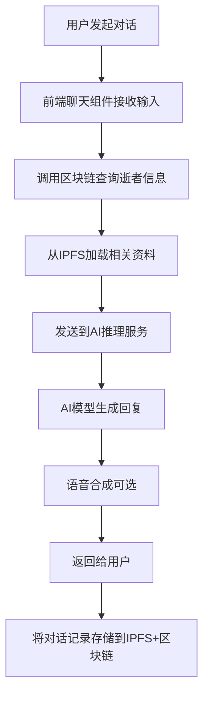

# Stardust AI智能体纪念对话系统设计方案

> **项目概述**：为每个逝者创建基于AI的智能体，通过对话交互提供沉浸式数字纪念体验

## 1. 项目概述与价值分析

### 1.1 功能描述

本方案设计一套AI驱动的数字纪念智能体系统，为Stardust平台上的每个逝者创建独特的AI智能体。用户可以与逝者的AI化身进行自然对话，体验仿佛与逝者真实交流的沉浸式纪念体验。

### 1.2 核心价值

#### 用户价值
- 🎯 **情感慰藉**：家属可与AI重现的逝者"对话"，获得心理安慰
- 🎯 **文化传承**：逝者的思想、价值观、人生感悟通过AI得以保存和传播
- 🎯 **教育意义**：后代可与祖先"交流"，了解家族历史
- 🎯 **纪念创新**：突破传统纪念方式，提供沉浸式缅怀体验

#### 商业价值
- 💰 **差异化竞争**：在数字纪念领域创造独特卖点
- 💰 **付费服务**：高级AI对话功能可作为VIP增值服务
- 💰 **技术领先**：在Web3+AI+纪念服务交叉领域建立先发优势

### 1.3 可行性评估

**综合评估：⭐⭐⭐⭐⭐ 高度可行**

#### 技术可行性 - 非常高
- ✅ **现有AI基础设施**：系统已有完整的AI推理服务（ai-inference-service）
- ✅ **数据基础**：逝者数据结构完善，包含基础信息和IPFS存储的丰富资料
- ✅ **存储能力**：IPFS集成用于大容量文本/媒体存储
- ✅ **前端集成**：React DApp已有AI服务调用hooks

#### 业务价值 - 极高
- ✅ **创新性强**：开创性的数字纪念体验，市场差异化明显
- ✅ **情感价值**：深度的情感需求，用户粘性强
- ✅ **变现能力**：多层次付费模式，商业前景广阔

#### 实现复杂度 - 中等
- ✅ **技术成熟**：大语言模型、语音合成等核心技术成熟
- ✅ **渐进式开发**：可分阶段实施，风险可控
- ✅ **团队匹配**：现有技术栈匹配度高

## 2. 技术架构设计

### 2.1 整体系统架构

```
┌─────────────────────────────────────────────────────────────────┐
│                    Stardust AI纪念智能体系统                      │
└─────────────────────────────────────────────────────────────────┘

┌──────────────────┐    ┌──────────────────┐    ┌─────────────────┐
│   前端DApp       │    │   区块链层        │    │  AI推理层       │
│                  │    │                  │    │                 │
│ ┌──────────────┐ │    │ ┌──────────────┐ │    │ ┌─────────────┐ │
│ │聊天界面组件  │ │    │ │pallet-deceased│ │    │ │对话引擎     │ │
│ │              │ │◄──►│ │逝者基础信息  │ │◄──►│ │(DeepSeek)   │ │
│ │语音合成播放  │ │    │ │              │ │    │ │             │ │
│ └──────────────┘ │    │ └──────────────┘ │    │ └─────────────┘ │
│                  │    │                  │    │                 │
│ ┌──────────────┐ │    │ ┌──────────────┐ │    │ ┌─────────────┐ │
│ │个性化设置    │ │    │ │pallet-ai-chat│ │    │ │记忆管理     │ │
│ │              │ │    │ │聊天会话记录  │ │    │ │(向量数据库) │ │
│ │权限控制      │ │    │ │              │ │    │ │             │ │
│ └──────────────┘ │    │ └──────────────┘ │    │ └─────────────┘ │
└──────────────────┘    └──────────────────┘    └─────────────────┘
         │                        │                        │
         │              ┌──────────────────┐              │
         └──────────────►│    IPFS层        │◄─────────────┘
                         │                  │
                         │ ┌──────────────┐ │
                         │ │生平资料      │ │
                         │ │照片/音频    │ │
                         │ │聊天记录     │ │
                         │ │AI训练数据   │ │
                         │ └──────────────┘ │
                         └──────────────────┘
```

### 2.2 数据流设计



### 2.3 核心组件设计

#### 2.3.1 区块链层：新增 `pallet-ai-chat`

```rust
/// AI聊天会话管理
pub struct ChatSession<T: Config> {
    pub deceased_id: T::DeceasedId,
    pub user: T::AccountId,
    pub session_id: Vec<u8>,
    pub created_at: BlockNumberFor<T>,
    pub last_active: BlockNumberFor<T>,
    pub message_count: u32,
    pub settings: ChatSettings,
}

/// 聊天设置
pub struct ChatSettings {
    pub voice_enabled: bool,
    pub personality_level: u8,  // 1-10 个性化强度
    pub response_style: ResponseStyle,  // formal/casual/intimate
    pub memory_depth: u8,  // 记忆上下文长度
}

/// 核心存储
#[pallet::storage]
pub type ChatSessions<T: Config> = StorageDoubleMap<
    _,
    Blake2_128Concat, T::DeceasedId,  // 逝者ID
    Blake2_128Concat, T::AccountId,   // 用户ID
    ChatSession<T>,
    OptionQuery,
>;

/// 聊天消息索引（仅存储IPFS CID）
#[pallet::storage]
pub type ChatMessages<T: Config> = StorageDoubleMap<
    _,
    Blake2_128Concat, Vec<u8>,  // session_id
    Blake2_128Concat, u32,      // message_index
    BoundedVec<u8, T::CidLimit>, // message_cid (IPFS)
    OptionQuery,
>;
```

#### 2.3.2 AI服务层扩展

```python
# ai-inference-service/app/chat/
class DeceasedAIAgent:
    """逝者AI智能体核心类"""

    def __init__(self, deceased_data: DeceasedProfile):
        self.profile = deceased_data
        self.base_prompt = self._build_base_prompt()
        self.memory_store = VectorMemoryStore(deceased_data.id)

    def _build_base_prompt(self) -> str:
        """构建基础人格提示词"""
        return f"""
        你是{self.profile.name}，{self.profile.description}。

        基本信息：
        - 出生：{self.profile.birth_date}
        - 性格特征：{self.profile.personality_traits}
        - 生平经历：{self.profile.life_events}
        - 价值观念：{self.profile.values}

        请以第一人称回答问题，保持一致的个性和记忆。
        回答要温和、有感情，体现出对家人朋友的关爱。
        """

    async def chat(self, message: str, context: ChatContext) -> ChatResponse:
        """处理聊天消息"""
        # 1. 检索相关记忆
        relevant_memories = await self.memory_store.search(message, k=5)

        # 2. 构建完整上下文
        full_context = self._build_chat_context(message, relevant_memories, context)

        # 3. 调用AI模型生成回复
        response = await self.llm_client.chat(
            prompt=self.base_prompt + full_context,
            max_tokens=300,
            temperature=0.8,  # 保持一定随机性，更自然
        )

        # 4. 存储新的对话记忆
        await self.memory_store.add_memory(
            content=f"用户说：{message}\n我回复：{response}",
            timestamp=datetime.now(),
            importance=self._calculate_importance(message, response)
        )

        return ChatResponse(
            text=response,
            emotion=self._detect_emotion(response),
            suggestions=self._generate_suggestions(message, response)
        )
```

#### 2.3.3 前端对话组件

```typescript
// components/chat/DeceasedChatBox.tsx
interface DeceasedChatBoxProps {
  deceasedId: string;
  onClose: () => void;
}

export const DeceasedChatBox: React.FC<DeceasedChatBoxProps> = ({
  deceasedId,
  onClose
}) => {
  const { startChat, sendMessage, messages, loading } = useDeceasedChat(deceasedId);
  const [input, setInput] = useState('');
  const [voiceEnabled, setVoiceEnabled] = useState(false);

  const handleSendMessage = async () => {
    if (!input.trim()) return;

    const userMessage = { role: 'user', content: input, timestamp: new Date() };
    setInput('');

    try {
      const aiResponse = await sendMessage(input);

      // 如果启用语音，播放AI回复
      if (voiceEnabled && aiResponse.voice_url) {
        playAudio(aiResponse.voice_url);
      }
    } catch (error) {
      message.error('发送消息失败，请稍后重试');
    }
  };

  return (
    <Card className="deceased-chat-box">
      <div className="chat-header">
        <Avatar src={deceased.mainImage} />
        <h3>{deceased.name}</h3>
        <Switch
          checked={voiceEnabled}
          onChange={setVoiceEnabled}
          checkedChildren="🔊"
          unCheckedChildren="🔇"
        />
        <Button type="text" icon={<CloseOutlined />} onClick={onClose} />
      </div>

      <div className="message-list">
        {messages.map(msg => (
          <MessageBubble key={msg.id} message={msg} />
        ))}
      </div>

      <div className="input-area">
        <Input.TextArea
          value={input}
          onChange={e => setInput(e.target.value)}
          placeholder={`与${deceased.name}对话...`}
          autoSize={{ minRows: 2, maxRows: 4 }}
          onPressEnter={handleSendMessage}
        />
        <Button
          type="primary"
          icon={<SendOutlined />}
          loading={loading}
          onClick={handleSendMessage}
        >
          发送
        </Button>
      </div>
    </Card>
  );
};
```

## 3. 实施路线图

### 3.1 Phase 1: 基础AI对话功能（4-6周）

#### 目标
实现基本的文本对话功能，用户可以与逝者AI进行简单交互。

#### 主要任务
1. **区块链层改进**
   - 开发 `pallet-ai-chat` 模块
   - 实现聊天会话管理
   - 添加消息索引存储

2. **AI服务层扩展**
   - 扩展现有ai-inference-service
   - 实现DeceasedAIAgent类
   - 集成DeepSeek AI模型

3. **前端对话界面**
   - 开发聊天组件
   - 实现消息展示
   - 添加基础设置功能

#### 验收标准
- ✅ 用户可以发起对话会话
- ✅ AI能根据逝者信息生成基础回复
- ✅ 对话记录存储到区块链+IPFS
- ✅ 基本的权限控制

### 3.2 Phase 2: 高级个性化功能（6-8周）

#### 目标
增强AI的个性化能力，提供更真实的对话体验。

#### 主要任务
1. **多模态交互**
   ```python
   class VoiceSynthesis:
       """语音合成服务"""

       async def synthesize_voice(
           self,
           text: str,
           voice_profile: VoiceProfile
       ) -> AudioFile:
           """使用AI语音合成技术生成个性化语音"""
   ```

2. **深度个性化学习**
   ```python
   class PersonalityLearningSystem:
       """个性化学习系统"""

       async def learn_from_interactions(self, chat_history: List[ChatMessage]):
           """从聊天历史学习个性特征"""
   ```

3. **记忆管理系统**
   - 实现向量数据库存储
   - 智能检索相关记忆
   - 重要性加权机制

#### 验收标准
- ✅ 语音合成功能
- ✅ 个性化回复风格调整
- ✅ 长期记忆管理
- ✅ 情感分析和回复

### 3.3 Phase 3: 商业化准备（2-3周）

#### 目标
完善付费体系和性能优化。

#### 主要任务
1. **分层服务模式**
   ```python
   class TieredAIService:
       # 免费层：基础对话
       async def basic_chat(self, message: str) -> str:
           """使用本地轻量级模型"""

       # 付费层：个性化对话
       async def premium_chat(self, message: str, context: RichContext) -> str:
           """使用云端大模型"""

       # VIP层：多模态交互
       async def vip_chat(self, message: str, multimedia_context: MultimodalContext) -> MultimodalResponse:
           """支持语音、图像交互"""
   ```

2. **性能优化**
   - 响应缓存机制
   - 批量处理优化
   - 成本控制策略

## 4. 风险评估与缓解策略

### 4.1 技术风险

| 风险类型 | 风险级别 | 影响 | 缓解策略 |
|---------|---------|------|---------|
| **AI模型成本过高** | 🔴 高 | 运营成本暴增 | 分层服务+本地模型+缓存优化 |
| **响应质量不稳定** | 🟡 中 | 用户体验差 | 多模型集成+质量评分+人工审核 |
| **数据隐私泄露** | 🔴 高 | 法律风险 | 端到端加密+本地处理+访问控制 |
| **存储成本膨胀** | 🟡 中 | 成本压力 | IPFS+压缩+冷热数据分层 |

### 4.2 业务风险

| 风险类型 | 风险级别 | 影响 | 缓解策略 |
|---------|---------|------|---------|
| **文化/宗教敏感性** | 🔴 高 | 社会争议 | 文化顾问+社区投票+退出选项 |
| **心理健康影响** | 🟡 中 | 用户沉迷 | 使用时间限制+心理健康提示 |
| **法律合规问题** | 🟡 中 | 监管风险 | 法律咨询+明确免责+用户同意 |
| **市场接受度不确定** | 🟡 中 | 产品失败 | MVP验证+渐进式推出+用户调研 |

### 4.3 关键缓解措施

#### 4.3.1 隐私保护设计

```typescript
class PrivateChatManager {
  async sendPrivateMessage(
    message: string,
    deceased_id: string,
    encryption_key: string
  ): Promise<ChatResponse> {
    // 客户端加密
    const encrypted = await this.crypto.encrypt(message, encryption_key);

    // 发送到本地AI处理器（不上传到云端）
    const response = await this.localAI.process(encrypted, deceased_id);

    // 解密回复
    return await this.crypto.decrypt(response, encryption_key);
  }
}
```

#### 4.3.2 文化敏感性处理

```python
class CulturalSensitivityFilter:
    """文化敏感性过滤器"""

    async def validate_interaction(
        self,
        message: str,
        deceased_profile: DeceasedProfile,
        user_profile: UserProfile
    ) -> ValidationResult:
        """验证交互是否符合文化和宗教要求"""
        # 检查宗教限制和文化敏感性
```

#### 4.3.3 成本控制策略

```python
class CostControlManager:
    """成本控制管理器"""

    async def smart_routing(self, user_request: ChatRequest) -> AIServiceRoute:
        """智能路由：根据用户等级和成本选择AI服务"""
        # 根据用户等级和请求复杂度选择最优路由
```

## 5. 投资预算估算

| 项目 | 开发成本 | 运营成本/月 | 说明 |
|------|---------|------------|------|
| **研发人力** | 50-80万元 | - | 3-4个工程师，6个月 |
| **AI模型使用** | - | 5-20万元 | 根据用户规模动态调整 |
| **基础设施** | 10万元 | 2-5万元 | 服务器、存储、CDN |
| **合计** | **60-90万元** | **7-25万元** | MVP到商业化全流程 |

## 6. 关键成功因素

### 6.1 数据质量是核心
AI智能体的质量完全依赖于逝者数据的丰富度和准确性。需要：
- 建立完善的数据收集流程
- 鼓励家属提供丰富的生平资料
- 开发智能数据提取和结构化工具

### 6.2 隐私保护是底线
必须确保用户数据安全，建立信任：
- 实施端到端加密
- 提供本地化处理选项
- 明确数据使用政策

### 6.3 文化敏感性是关键
需要处理好不同文化和宗教的接受度问题：
- 聘请文化和宗教顾问
- 实施社区投票机制
- 提供功能退出选项

### 6.4 成本控制是难点
AI推理成本需要通过技术手段和商业模式平衡：
- 分层服务策略
- 智能缓存机制
- 本地+云端混合架构

## 7. 总结与建议

### 7.1 项目价值总结

**综合评估：⭐⭐⭐⭐⭐ 强烈推荐实施**

1. **技术护城河**：在数字纪念+AI领域建立先发优势
2. **用户价值巨大**：解决人类最深层的情感需求
3. **商业前景广阔**：多种变现模式，长期价值高
4. **实现风险可控**：基于现有系统扩展，技术风险低

### 7.2 推荐实施策略

**采用渐进式开发策略**：
1. **Phase 1**: 实现MVP验证市场需求（2-3个月）
2. **Phase 2**: 产品化开发（3-4个月）
3. **Phase 3**: 商业化运营（4-6个月）

### 7.3 预期影响

这将是Stardust项目的一个重大创新突破，有望：
- 重新定义数字纪念服务的未来形态
- 在Web3+AI交叉领域确立领导地位
- 为用户创造深度的情感价值体验
- 建立可持续的商业模式和生态系统

**结论**：建议立即启动此功能的开发，这将成为Stardust平台的核心竞争优势和差异化价值主张。

---

**文档版本**：v1.0
**创建日期**：2025-11-12
**更新日期**：2025-11-12
**状态**：待审批