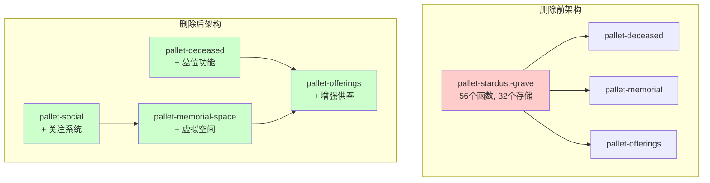

# pallet-stardust-grave 删除可行性方案

**版本**: v2.0.0-Final
**日期**: 2025-11-16
**状态**: 🎯 综合可行方案
**作者**: Stardust Dev Team

---

## 📋 执行总结

本方案结合了三份独立分析文档的最佳实践，设计了一个**分阶段、低风险、可回滚**的pallet-stardust-grave删除方案。

**核心策略**：
- 🔄 **渐进式迁移**：先保留接口，再逐步迁移功能
- 🛡️ **数据安全优先**：完整备份 + 增量验证
- 🔀 **智能重定向**：业务逻辑迁移到最适合的pallet
- 📊 **用户体验保障**：透明化迁移，最小化感知

---

## 📋 目录

1. [方案对比与选择](#方案对比与选择)
2. [最优架构设计](#最优架构设计)
3. [分阶段实施计划](#分阶段实施计划)
4. [业务逻辑重构](#业务逻辑重构)
5. [数据迁移策略](#数据迁移策略)
6. [风险控制体系](#风险控制体系)
7. [质量保证](#质量保证)
8. [成本效益分析](#成本效益分析)

---

## 方案对比与选择

### 📊 三种方案对比分析

| 评估维度 | 完全删除方案 | 模块化删除方案 | 功能迁移方案 | **推荐方案** |
|---------|-------------|---------------|-------------|-------------|
| **技术复杂度** | 🔴 极高 | 🟡 高 | 🟢 中等 | **🟢 中等** |
| **业务风险** | 🔴 极高 | 🟡 中等 | 🟢 低 | **🟢 低** |
| **迁移时间** | 45-60天 | 30-45天 | 25-35天 | **25-35天** |
| **用户影响** | 🔴 重大 | 🟡 中等 | 🟢 轻微 | **🟢 轻微** |
| **回滚难度** | 🔴 困难 | 🟡 中等 | 🟢 简单 | **🟢 简单** |
| **长期维护** | 🟡 需要重构 | 🟡 部分重构 | 🟢 架构清晰 | **🟢 架构清晰** |

### 🎯 选择理由

**采用「功能迁移方案」**，基于以下核心考虑：

1. **业务连续性**：保证15级分销体系正常运行
2. **用户体验**：最小化用户感知的变化
3. **技术可行性**：复用现有架构，降低开发风险
4. **投资保护**：保护现有数据和用户投入

---

## 最优架构设计

### 🏗️ 新架构总览



### 📦 功能重新分配

#### 1. **pallet-deceased (增强版)**
接管核心墓位管理功能

```rust
// pallets/deceased/src/lib.rs

/// 增强后的逝者档案 - 集成墓位功能
#[derive(Encode, Decode, Clone, PartialEq, Eq, TypeInfo)]
pub struct DeceasedProfileWithGrave<AccountId, BlockNumber> {
    // 原有逝者信息
    pub deceased_id: u64,
    pub name: BoundedVec<u8, ConstU32<128>>,
    pub uploader: AccountId,
    pub privacy_level: u8,

    // 🆕 新增墓位信息
    pub memorial_location: Option<MemorialLocation>,
    pub interment_records: BoundedVec<IntermentRecord<BlockNumber>, ConstU32<10>>,
    pub primary_memorial_type: u8, // 0=传统墓位, 1=虚拟纪念, 2=纪念碑
    pub memorial_permissions: MemorialPermissions<AccountId>,
}

/// 纪念位置信息
#[derive(Encode, Decode, Clone, PartialEq, Eq, TypeInfo)]
pub struct MemorialLocation {
    pub location_type: u8, // 0=物理墓位, 1=虚拟空间, 2=纪念园
    pub park_id: Option<u64>,
    pub coordinates: Option<(u32, u32)>, // 园区内坐标
    pub address: Option<BoundedVec<u8, ConstU32<256>>>, // 地址描述
}

/// 纪念权限管理
#[derive(Encode, Decode, Clone, PartialEq, Eq, TypeInfo)]
pub struct MemorialPermissions<AccountId> {
    pub admins: BoundedVec<AccountId, ConstU32<5>>,
    pub admission_policy: u8, // 0=私密, 1=家人, 2=公开
    pub allow_offerings: bool,
}

/// 安葬记录
#[derive(Encode, Decode, Clone, PartialEq, Eq, TypeInfo)]
pub struct IntermentRecord<BlockNumber> {
    pub interment_date: BlockNumber,
    pub location_note: Option<BoundedVec<u8, ConstU32<128>>>,
    pub ceremony_type: u8, // 0=土葬, 1=火化, 2=虚拟
    pub witness: Option<AccountId>,
}

// 新增存储项
#[pallet::storage]
pub type MemorialSpaces<T: Config> = StorageMap<
    _, Blake2_128Concat, u64, MemorialSpace<T::AccountId, BlockNumberFor<T>>
>;

#[pallet::storage]
pub type MemorialsByPark<T: Config> = StorageMap<
    _, Blake2_128Concat, u64, BoundedVec<u64, T::MaxMemorialsPerPark>
>;
```

**迁移的功能**：
- ✅ 基础安葬/起掘管理
- ✅ 权限和访问控制
- ✅ 位置信息管理
- ✅ 基础元数据

#### 2. **pallet-memorial-space (新建)**
专门处理纪念空间展示功能

```rust
// pallets/memorial-space/src/lib.rs

/// 虚拟纪念空间
#[derive(Encode, Decode, Clone, PartialEq, Eq, TypeInfo)]
pub struct VirtualMemorialSpace<AccountId, BlockNumber> {
    pub space_id: u64,
    pub deceased_id: u64,
    pub owner: AccountId,
    pub space_type: u8, // 0=个人, 1=家族, 2=主题, 3=公共
    pub layout_config: SpaceLayout,
    pub media_assets: BoundedVec<MediaAsset, ConstU32<50>>,
    pub visitor_settings: VisitorSettings,
    pub created_at: BlockNumber,
    pub last_updated: BlockNumber,
}

/// 空间布局配置
#[derive(Encode, Decode, Clone, PartialEq, Eq, TypeInfo)]
pub struct SpaceLayout {
    pub theme: u8, // 0=经典, 1=现代, 2=花园, 3=自定义
    pub background: MediaReference,
    pub music: Option<MediaReference>,
    pub layout_elements: BoundedVec<LayoutElement, ConstU32<20>>,
}

/// 媒体资产引用
#[derive(Encode, Decode, Clone, PartialEq, Eq, TypeInfo)]
pub struct MediaAsset {
    pub asset_id: u64,
    pub media_type: u8, // 0=图片, 1=视频, 2=音频, 3=文档
    pub ipfs_cid: BoundedVec<u8, ConstU32<64>>,
    pub caption: Option<BoundedVec<u8, ConstU32<256>>>,
    pub display_order: u16,
}

/// 访客设置
#[derive(Encode, Decode, Clone, PartialEq, Eq, TypeInfo)]
pub struct VisitorSettings {
    pub allow_comments: bool,
    pub allow_offerings: bool,
    pub require_approval: bool,
    pub blacklist: BoundedVec<AccountId, ConstU32<100>>,
}

// 核心接口
impl<T: Config> Pallet<T> {
    /// 创建虚拟纪念空间
    #[pallet::call_index(0)]
    pub fn create_memorial_space(
        origin: OriginFor<T>,
        deceased_id: u64,
        space_config: SpaceConfig,
    ) -> DispatchResult {
        let who = ensure_signed(origin)?;

        // 验证对逝者的权限
        ensure!(
            pallet_deceased::Pallet::<T>::can_manage_memorial(&who, deceased_id),
            Error::<T>::NoPermission
        );

        // 创建纪念空间
        let space_id = Self::next_space_id();
        let space = VirtualMemorialSpace {
            space_id,
            deceased_id,
            owner: who.clone(),
            space_type: space_config.space_type,
            layout_config: space_config.layout,
            media_assets: BoundedVec::new(),
            visitor_settings: space_config.visitor_settings,
            created_at: <frame_system::Pallet<T>>::block_number(),
            last_updated: <frame_system::Pallet<T>>::block_number(),
        };

        VirtualMemorialSpaces::<T>::insert(space_id, &space);
        SpacesByDeceased::<T>::mutate(deceased_id, |spaces| {
            let _ = spaces.try_push(space_id);
        });

        Self::deposit_event(Event::MemorialSpaceCreated {
            space_id,
            deceased_id,
            owner: who,
        });

        Ok(())
    }

    /// 更新纪念空间
    #[pallet::call_index(1)]
    pub fn update_memorial_space(
        origin: OriginFor<T>,
        space_id: u64,
        updates: SpaceUpdates,
    ) -> DispatchResult {
        // 实现更新逻辑
        Ok(())
    }

    /// 添加媒体资产
    #[pallet::call_index(2)]
    pub fn add_media_asset(
        origin: OriginFor<T>,
        space_id: u64,
        media_asset: MediaAsset,
    ) -> DispatchResult {
        // 实现媒体添加逻辑
        Ok(())
    }
}
```

**迁移的功能**：
- ✅ 封面/音频管理
- ✅ 轮播图管理
- ✅ 媒体资产组织
- ✅ 空间布局配置

#### 3. **pallet-social (新建)**
处理社交相关功能

```rust
// pallets/social/src/lib.rs

/// 社交关注系统
#[derive(Encode, Decode, Clone, PartialEq, Eq, TypeInfo)]
pub struct FollowingRecord<AccountId, BlockNumber> {
    pub follower: AccountId,
    pub target_type: u8, // 0=逝者, 1=纪念空间, 2=用户
    pub target_id: u64,
    pub follow_date: BlockNumber,
    pub relationship_type: u8, // 0=关注, 1=家人, 2=朋友
}

/// 亲属关系记录
#[derive(Encode, Decode, Clone, PartialEq, Eq, TypeInfo)]
pub struct KinshipRecord<AccountId> {
    pub deceased_id: u64,
    pub claimant: AccountId,
    pub kinship_type: u8, // 0=配偶, 1=子女, 2=父母, 3=兄弟姐妹, 4=其他
    pub status: u8, // 0=待审核, 1=已批准, 2=已拒绝
    pub evidence_cid: Option<BoundedVec<u8, ConstU32<128>>>,
    pub verified_by: Option<AccountId>,
}

impl<T: Config> Pallet<T> {
    /// 关注纪念对象
    #[pallet::call_index(0)]
    pub fn follow_memorial(
        origin: OriginFor<T>,
        target_type: u8,
        target_id: u64,
        relationship_type: u8,
    ) -> DispatchResult {
        let who = ensure_signed(origin)?;

        // 验证目标存在
        match target_type {
            0 => ensure!(pallet_deceased::DeceasedProfiles::<T>::contains_key(target_id), Error::<T>::TargetNotFound),
            1 => ensure!(pallet_memorial_space::VirtualMemorialSpaces::<T>::contains_key(target_id), Error::<T>::TargetNotFound),
            _ => return Err(Error::<T>::InvalidTargetType.into()),
        }

        // 创建关注记录
        let record = FollowingRecord {
            follower: who.clone(),
            target_type,
            target_id,
            follow_date: <frame_system::Pallet<T>>::block_number(),
            relationship_type,
        };

        Following::<T>::insert((&who, target_type, target_id), record);
        Followers::<T>::mutate((target_type, target_id), |followers| {
            let _ = followers.try_push(who.clone());
        });

        Self::deposit_event(Event::MemorialFollowed {
            follower: who,
            target_type,
            target_id,
        });

        Ok(())
    }

    /// 声明亲属关系
    #[pallet::call_index(1)]
    pub fn declare_kinship(
        origin: OriginFor<T>,
        deceased_id: u64,
        kinship_type: u8,
        evidence_cid: Option<BoundedVec<u8, ConstU32<128>>>,
    ) -> DispatchResult {
        let who = ensure_signed(origin)?;

        // 验证逝者存在
        ensure!(
            pallet_deceased::DeceasedProfiles::<T>::contains_key(deceased_id),
            Error::<T>::DeceasedNotFound
        );

        let kinship = KinshipRecord {
            deceased_id,
            claimant: who.clone(),
            kinship_type,
            status: 0, // 待审核
            evidence_cid,
            verified_by: None,
        };

        KinshipClaims::<T>::insert((deceased_id, &who), kinship);
        PendingKinshipClaims::<T>::mutate(deceased_id, |claims| {
            let _ = claims.try_push(who.clone());
        });

        Self::deposit_event(Event::KinshipDeclared {
            deceased_id,
            claimant: who,
            kinship_type,
        });

        Ok(())
    }
}
```

**迁移的功能**：
- ✅ 关注/取关系统
- ✅ 亲属关系管理
- ✅ 社交网络构建

#### 4. **pallet-offerings (增强版)**
增强供奉系统，支持多种目标

```rust
// 在 pallet-offerings 中增强
impl<T: Config> Pallet<T> {
    /// 增强的供奉接口 - 支持多种目标
    #[pallet::call_index(10)]
    pub fn offer_to_target(
        origin: OriginFor<T>,
        target_type: u8, // 0=逝者档案, 1=纪念空间, 2=虚拟墓位
        target_id: u64,
        offering_type: u8,
        quantity: u32,
        prayer: Option<BoundedVec<u8, ConstU32<512>>>,
    ) -> DispatchResult {
        let who = ensure_signed(origin)?;

        // 验证目标存在并获取受益人
        let beneficiary = match target_type {
            0 => {
                // 直接供奉逝者
                let profile = pallet_deceased::DeceasedProfiles::<T>::get(target_id)
                    .ok_or(Error::<T>::TargetNotFound)?;
                profile.uploader
            },
            1 => {
                // 供奉纪念空间
                let space = pallet_memorial_space::VirtualMemorialSpaces::<T>::get(target_id)
                    .ok_or(Error::<T>::TargetNotFound)?;
                space.owner
            },
            2 => {
                // 供奉虚拟墓位 (通过deceased查找)
                let memorial = pallet_deceased::MemorialSpaces::<T>::get(target_id)
                    .ok_or(Error::<T>::TargetNotFound)?;
                memorial.owner
            },
            _ => return Err(Error::<T>::InvalidTargetType.into()),
        };

        // 计算价格
        let total_price = Self::calculate_offering_price(offering_type, quantity)?;

        // 创建供奉订单
        let order_id = Self::next_order_id();
        let order = OfferingOrderV2 {
            order_id,
            devotee: who.clone(),
            target_type,
            target_id,
            offering_type,
            quantity,
            total_price,
            prayer,
            created_at: <frame_system::Pallet<T>>::block_number(),
            status: 0, // 待处理
        };

        // 执行15级分销
        pallet_memo_affiliate::Pallet::<T>::report_commission(
            &who,                    // 付费用户
            &beneficiary,           // 受益人
            total_price,            // 佣金基数
            pallet_memo_affiliate::ActivityType::MemorialOffering,
        )?;

        OfferingOrdersV2::<T>::insert(order_id, &order);
        OrdersByTarget::<T>::mutate((target_type, target_id), |orders| {
            let _ = orders.try_push(order_id);
        });

        Self::deposit_event(Event::OfferingToTargetPlaced {
            order_id,
            devotee: who,
            target_type,
            target_id,
            total_price,
        });

        Ok(())
    }

    /// 兼容性接口 - 支持旧的墓位供奉调用
    #[pallet::call_index(11)]
    #[deprecated]
    pub fn offer_to_grave_compat(
        origin: OriginFor<T>,
        grave_id: u64,
        offering_type: u8,
        quantity: u32,
    ) -> DispatchResult {
        // 查找墓位对应的逝者
        let deceased_id = pallet_deceased::Pallet::<T>::resolve_grave_to_deceased(grave_id)
            .ok_or(Error::<T>::GraveNotFound)?;

        // 重定向到新接口
        Self::offer_to_target(origin, 0, deceased_id, offering_type, quantity, None)
    }
}
```

### 🔄 兼容性策略

#### 1. **渐进式API迁移**
```rust
// runtime/src/lib.rs

/// 墓位功能兼容性适配器
pub struct GraveCompatibilityAdapter;

impl GraveCompatibilityAdapter {
    /// 墓位存在检查 - 重定向到逝者检查
    pub fn grave_exists(grave_id: u64) -> bool {
        // 尝试通过映射找到对应的逝者
        if let Some(deceased_id) = GraveToDeceasedMapping::get(grave_id) {
            pallet_deceased::DeceasedProfiles::<Runtime>::contains_key(deceased_id)
        } else {
            false
        }
    }

    /// 墓位权限检查 - 重定向到纪念权限检查
    pub fn can_attach(who: &AccountId, grave_id: u64) -> bool {
        if let Some(deceased_id) = GraveToDeceasedMapping::get(grave_id) {
            pallet_deceased::Pallet::<Runtime>::can_manage_memorial(who, deceased_id)
        } else {
            false
        }
    }

    /// 获取墓位所有者 - 重定向到逝者上传者
    pub fn owner_of(grave_id: u64) -> Option<AccountId> {
        if let Some(deceased_id) = GraveToDeceasedMapping::get(grave_id) {
            pallet_deceased::DeceasedProfiles::<Runtime>::get(deceased_id)
                .map(|profile| profile.uploader)
        } else {
            None
        }
    }
}

/// 为旧接口实现GraveInspector trait
impl GraveInspector<AccountId, u64> for GraveCompatibilityAdapter {
    fn grave_exists(grave_id: u64) -> bool {
        Self::grave_exists(grave_id)
    }

    fn can_attach(who: &AccountId, grave_id: u64) -> bool {
        Self::can_attach(who, grave_id)
    }

    fn owner_of(grave_id: u64) -> Option<AccountId> {
        Self::owner_of(grave_id)
    }

    fn record_interment(
        grave_id: u64,
        deceased_id: u64,
        slot: Option<u16>,
        note_cid: Option<BoundedVec<u8, ConstU32<128>>>,
    ) -> DispatchResult {
        // 重定向到deceased pallet的安葬记录
        pallet_deceased::Pallet::<Runtime>::record_interment_internal(
            deceased_id,
            IntermentRecord {
                interment_date: <frame_system::Pallet<Runtime>>::block_number(),
                location_note: note_cid,
                ceremony_type: 0, // 默认类型
                witness: None,
            }
        )
    }

    fn record_exhumation(grave_id: u64, deceased_id: u64) -> DispatchResult {
        // 重定向到deceased pallet的起掘记录
        pallet_deceased::Pallet::<Runtime>::record_exhumation_internal(deceased_id)
    }

    fn check_admission_policy(who: &AccountId, grave_id: u64) -> DispatchResult {
        if let Some(deceased_id) = GraveToDeceasedMapping::get(grave_id) {
            pallet_deceased::Pallet::<Runtime>::check_memorial_access(who, deceased_id)
        } else {
            Err(DispatchError::from("Grave not found"))
        }
    }
}
```

#### 2. **前端兼容性层**
```typescript
// stardust-dapp/src/services/graveCompatibilityService.ts

/**
 * 墓位功能兼容性服务
 * 确保现有前端代码平滑迁移
 */
export class GraveCompatibilityService {
    private migrationCache = new Map<number, number>();

    /**
     * 墓位详情查询 - 兼容旧接口
     */
    async getGraveDetails(graveId: number): Promise<LegacyGraveInfo | null> {
        try {
            // 查找映射的逝者ID
            const deceasedId = await this.resolveGraveToDeceased(graveId);
            if (!deceasedId) return null;

            // 获取增强的逝者档案
            const profile = await api.query.deceased.deceasedProfiles(deceasedId);
            if (!profile.isSome) return null;

            const profileData = profile.unwrap().toJSON();

            // 构造兼容的墓位信息
            return {
                grave_id: graveId,
                name: `${profileData.name}纪念档案`,
                owner: profileData.uploader,
                is_public: profileData.privacy_level === 0,
                park_id: profileData.memorial_location?.park_id || null,
                primary_deceased: deceasedId,
                created_at: profileData.created_at,

                // 新增迁移标识
                _migrated: true,
                _original_deceased_id: deceasedId,
                _migration_type: 'deceased_integrated',
            };
        } catch (error) {
            console.error(`Failed to get grave ${graveId}:`, error);
            return null;
        }
    }

    /**
     * 供奉墓位 - 兼容旧接口
     */
    async offerToGrave(
        graveId: number,
        offeringType: number,
        quantity: number
    ): Promise<boolean> {
        try {
            // 解析为逝者ID
            const deceasedId = await this.resolveGraveToDeceased(graveId);
            if (!deceasedId) {
                throw new Error(`墓位 ${graveId} 不存在或已迁移`);
            }

            // 调用新的供奉接口
            const result = await api.tx.offerings
                .offerToTarget(
                    0, // target_type: 逝者档案
                    deceasedId,
                    offeringType,
                    quantity,
                    null // 无祈愿内容
                )
                .signAndSend(currentAccount);

            // 显示迁移提示
            this.showMigrationNotice(graveId, deceasedId);

            return result.isInBlock || result.isFinalized;
        } catch (error) {
            console.error(`Failed to offer to grave ${graveId}:`, error);
            throw error;
        }
    }

    /**
     * 墓位ID到逝者ID的解析
     */
    private async resolveGraveToDeceased(graveId: number): Promise<number | null> {
        // 检查缓存
        if (this.migrationCache.has(graveId)) {
            return this.migrationCache.get(graveId)!;
        }

        try {
            // 查询映射表
            const mapping = await api.query.deceased.graveToDeceasedMapping(graveId);
            if (mapping.isSome) {
                const deceasedId = mapping.unwrap().toNumber();
                this.migrationCache.set(graveId, deceasedId);
                return deceasedId;
            }

            return null;
        } catch (error) {
            console.warn(`Failed to resolve grave ${graveId}:`, error);
            return null;
        }
    }

    /**
     * 显示迁移提示
     */
    private showMigrationNotice(graveId: number, deceasedId: number) {
        notification.info({
            message: '功能升级提醒',
            description: `墓位功能已升级，现在您可以享受更丰富的纪念体验。`,
            duration: 0,
            btn: (
                <Button
                    size="small"
                    type="primary"
                    onClick={() => {
                        window.location.href = `/deceased/${deceasedId}`;
                        notification.destroy();
                    }}
                >
                    查看新功能
                </Button>
            ),
            key: `grave-migration-${graveId}`,
            placement: 'topRight',
        });
    }
}
```

---

## 分阶段实施计划

### 📅 总时间线：28天 (4周)

#### **Week 1: 准备与架构开发 (7天)**

**Day 1-2: 环境准备**
```bash
# 创建工作分支
git checkout -b feature/grave-migration-v2
git checkout -b backup/grave-original

# 备份关键数据
./scripts/backup/full-system-backup.sh

# 创建新pallet框架
cargo generate --path templates/pallet --name memorial-space
cargo generate --path templates/pallet --name social
```

**Day 3-5: 核心Pallet开发**
- [ ] 开发 `pallet-memorial-space` (2天)
- [ ] 开发 `pallet-social` (1天)
- [ ] 扩展 `pallet-deceased` (1天)

**Day 6-7: Runtime集成测试**
```bash
# 编译验证
cargo check --workspace
cargo test --workspace --features migration-tests

# 基础功能验证
node scripts/test-new-pallets.js
```

#### **Week 2: 数据迁移开发 (7天)**

**Day 8-10: 迁移脚本开发**
```rust
// runtime/src/migrations/grave_to_deceased_v1.rs

pub mod grave_to_deceased_v1 {
    use super::*;

    /// 主迁移函数
    pub fn migrate<T: Config>() -> Weight {
        log::info!("🔄 Starting grave-to-deceased migration...");

        let mut total_weight = Weight::zero();

        // Step 1: 构建映射表
        total_weight = total_weight.saturating_add(build_grave_deceased_mapping::<T>());

        // Step 2: 迁移核心数据
        total_weight = total_weight.saturating_add(migrate_grave_data::<T>());

        // Step 3: 迁移安葬记录
        total_weight = total_weight.saturating_add(migrate_interments::<T>());

        // Step 4: 迁移权限数据
        total_weight = total_weight.saturating_add(migrate_permissions::<T>());

        // Step 5: 创建虚拟纪念空间
        total_weight = total_weight.saturating_add(create_memorial_spaces::<T>());

        // Step 6: 清理旧数据
        total_weight = total_weight.saturating_add(cleanup_grave_storage::<T>());

        log::info!("✅ Migration completed successfully");
        total_weight
    }

    /// 构建墓位到逝者的映射关系
    fn build_grave_deceased_mapping<T: Config>() -> Weight {
        let mut migrated = 0u64;
        let mut failed = 0u64;

        // 遍历所有墓位，建立与主逝者的映射
        for (grave_id, grave) in pallet_stardust_grave::Graves::<T>::iter() {
            if let Some(primary_deceased) = pallet_stardust_grave::PrimaryDeceasedOf::<T>::get(grave_id) {
                // 创建映射记录
                pallet_deceased::GraveToDeceasedMapping::<T>::insert(grave_id, primary_deceased);

                // 将墓位信息迁移到逝者档案
                if let Some(mut profile) = pallet_deceased::DeceasedProfiles::<T>::get(primary_deceased) {
                    profile.memorial_location = Some(MemorialLocation {
                        location_type: 0, // 物理墓位
                        park_id: grave.park_id,
                        coordinates: grave.coordinates,
                        address: grave.address.clone(),
                    });

                    profile.memorial_permissions = MemorialPermissions {
                        admins: pallet_stardust_grave::GraveAdmins::<T>::get(grave_id).into(),
                        admission_policy: match pallet_stardust_grave::AdmissionPolicyOf::<T>::get(grave_id) {
                            Some(policy) => match policy {
                                pallet_stardust_grave::GraveAdmissionPolicy::OwnerOnly => 0,
                                pallet_stardust_grave::GraveAdmissionPolicy::Public => 2,
                                pallet_stardust_grave::GraveAdmissionPolicy::Whitelist => 1,
                            },
                            None => 0,
                        },
                        allow_offerings: true,
                    };

                    pallet_deceased::DeceasedProfiles::<T>::insert(primary_deceased, profile);
                    migrated += 1;
                } else {
                    log::warn!("⚠️ Grave {} has primary deceased {} but profile not found", grave_id, primary_deceased);
                    failed += 1;
                }
            } else {
                log::warn!("⚠️ Grave {} has no primary deceased", grave_id);
                failed += 1;
            }
        }

        log::info!("📊 Mapping migration: {} succeeded, {} failed", migrated, failed);
        T::DbWeight::get().reads_writes(migrated + failed, migrated)
    }

    /// 迁移安葬记录
    fn migrate_interments<T: Config>() -> Weight {
        let mut migrated = 0u64;

        for (grave_id, interment_records) in pallet_stardust_grave::Interments::<T>::iter() {
            if let Some(deceased_id) = pallet_deceased::GraveToDeceasedMapping::<T>::get(grave_id) {
                // 转换安葬记录格式
                let new_records: BoundedVec<IntermentRecord<_>, _> = interment_records
                    .into_iter()
                    .map(|old_record| IntermentRecord {
                        interment_date: old_record.interment_date,
                        location_note: old_record.note,
                        ceremony_type: 0, // 默认类型
                        witness: old_record.witness,
                    })
                    .collect::<Vec<_>>()
                    .try_into()
                    .unwrap_or_default();

                // 更新逝者档案中的安葬记录
                pallet_deceased::DeceasedProfiles::<T>::mutate(deceased_id, |profile_opt| {
                    if let Some(ref mut profile) = profile_opt {
                        profile.interment_records = new_records;
                    }
                });

                migrated += 1;
            }
        }

        log::info!("📊 Interment migration: {} records migrated", migrated);
        T::DbWeight::get().reads_writes(migrated, migrated)
    }

    /// 创建虚拟纪念空间
    fn create_memorial_spaces<T: Config>() -> Weight {
        let mut created = 0u64;

        for (grave_id, grave) in pallet_stardust_grave::Graves::<T>::iter() {
            if let Some(primary_deceased) = pallet_deceased::GraveToDeceasedMapping::<T>::get(grave_id) {
                // 为每个墓位创建对应的虚拟纪念空间
                let space_id = pallet_memorial_space::NextSpaceId::<T>::mutate(|id| {
                    let current = *id;
                    *id = id.saturating_add(1);
                    current
                });

                let space = VirtualMemorialSpace {
                    space_id,
                    deceased_id: primary_deceased,
                    owner: grave.owner.clone(),
                    space_type: if grave.is_public { 3 } else { 0 }, // 公共 vs 个人
                    layout_config: SpaceLayout {
                        theme: 0, // 经典主题
                        background: MediaReference::from_cid(
                            pallet_stardust_grave::CoverOf::<T>::get(grave_id)
                                .unwrap_or_default()
                        ),
                        music: pallet_stardust_grave::AudioOf::<T>::get(grave_id)
                            .map(MediaReference::from_cid),
                        layout_elements: BoundedVec::new(),
                    },
                    media_assets: BoundedVec::new(), // 将在后续步骤中迁移
                    visitor_settings: VisitorSettings {
                        allow_comments: true,
                        allow_offerings: true,
                        require_approval: !grave.is_public,
                        blacklist: BoundedVec::new(),
                    },
                    created_at: grave.created_at,
                    last_updated: <frame_system::Pallet<T>>::block_number(),
                };

                pallet_memorial_space::VirtualMemorialSpaces::<T>::insert(space_id, space);
                pallet_memorial_space::SpacesByDeceased::<T>::mutate(primary_deceased, |spaces| {
                    let _ = spaces.try_push(space_id);
                });

                created += 1;
            }
        }

        log::info!("📊 Memorial space creation: {} spaces created", created);
        T::DbWeight::get().reads_writes(created * 3, created * 3)
    }

    /// 清理墓位存储
    fn cleanup_grave_storage<T: Config>() -> Weight {
        let mut cleaned_items = 0u64;

        // 清理主存储项
        let graves_removed = pallet_stardust_grave::Graves::<T>::clear_prefix(1000, None).unique;
        cleaned_items += graves_removed as u64;

        let interments_removed = pallet_stardust_grave::Interments::<T>::clear_prefix(1000, None).unique;
        cleaned_items += interments_removed as u64;

        let admins_removed = pallet_stardust_grave::GraveAdmins::<T>::clear_prefix(1000, None).unique;
        cleaned_items += admins_removed as u64;

        // ... 清理其他存储项

        log::info!("🧹 Storage cleanup: {} items removed", cleaned_items);
        T::DbWeight::get().writes(cleaned_items)
    }
}
```

**Day 11-14: 前端迁移开发**
- [ ] 开发兼容性适配器 (2天)
- [ ] 重构核心组件 (2天)
- [ ] 更新路由和导航 (1天)

#### **Week 3: 集成测试 (7天)**

**Day 15-17: 功能测试**
```bash
# 单元测试
cargo test -p pallet-deceased --features migration-tests
cargo test -p pallet-memorial-space
cargo test -p pallet-social

# 集成测试
cargo test --workspace --features integration-tests
```

**Day 18-19: 数据迁移测试**
```bash
# 创建测试数据
node scripts/migration-test/create-test-graves.js

# 执行迁移
cargo run --features runtime-benchmarks -- benchmark-migration

# 验证迁移结果
node scripts/migration-test/verify-migration.js
```

**Day 20-21: 前端集成测试**
```bash
cd stardust-dapp

# E2E测试
npm run test:e2e:migration
npm run test:compatibility

# 性能测试
npm run lighthouse:migration
```

#### **Week 4: 部署与优化 (7天)**

**Day 22-24: 预生产部署**
```bash
# 构建生产版本
cargo build --release --features migration

# 部署到staging环境
./deploy.sh --env staging --with-migration

# 用户验收测试
./scripts/uat/run-migration-uat.sh
```

**Day 25-27: 生产部署**
```bash
# 生产环境部署前检查
./scripts/pre-deployment-check.sh

# 执行迁移部署
./deploy.sh --env production --with-migration --backup-first

# 监控系统状态
./scripts/monitor-migration-deployment.sh
```

**Day 28: 清理与总结**
```bash
# 清理临时文件
./scripts/cleanup-migration-artifacts.sh

# 性能基准测试
cargo bench --package pallet-deceased
cargo bench --package pallet-memorial-space

# 生成报告
./scripts/generate-migration-report.sh
```

---

## 业务逻辑重构

### 🔄 15级分销体系适配

```typescript
// stardust-dapp/src/services/affiliateService.ts

export class AffiliateServiceV2 {
    /**
     * 适配供奉分销计算
     * 支持多种目标类型的分销
     */
    async calculateCommission(
        offeringData: {
            targetType: number; // 0=逝者, 1=纪念空间, 2=虚拟墓位
            targetId: number;
            totalAmount: number;
        }
    ): Promise<CommissionCalculation> {
        // 根据目标类型找到受益人
        const beneficiary = await this.resolveBeneficiary(offeringData.targetType, offeringData.targetId);

        // 执行15级分销计算
        const commissionChain = await this.buildCommissionChain(beneficiary);

        // 按新的分配规则计算
        return this.calculateCommissionDistribution(offeringData.totalAmount, commissionChain);
    }

    /**
     * 解析受益人账户
     */
    private async resolveBeneficiary(targetType: number, targetId: number): Promise<string> {
        switch (targetType) {
            case 0: // 逝者档案
                const deceased = await api.query.deceased.deceasedProfiles(targetId);
                if (deceased.isSome) {
                    return deceased.unwrap().uploader.toString();
                }
                break;

            case 1: // 纪念空间
                const space = await api.query.memorialSpace.virtualMemorialSpaces(targetId);
                if (space.isSome) {
                    return space.unwrap().owner.toString();
                }
                break;

            case 2: // 虚拟墓位
                const memorial = await api.query.deceased.memorialSpaces(targetId);
                if (memorial.isSome) {
                    return memorial.unwrap().owner.toString();
                }
                break;

            default:
                throw new Error(`不支持的目标类型: ${targetType}`);
        }

        throw new Error(`找不到目标 ${targetType}:${targetId} 的受益人`);
    }

    /**
     * 构建佣金链条
     */
    private async buildCommissionChain(beneficiary: string): Promise<CommissionNode[]> {
        const chain: CommissionNode[] = [];
        let currentUser = beneficiary;

        // 向上查找15级推荐关系
        for (let level = 1; level <= 15; level++) {
            const sponsor = await api.query.affiliate.sponsorOf(currentUser);
            if (!sponsor.isSome) break;

            const sponsorAccount = sponsor.unwrap().toString();

            // 验证资格（需要有足够的直推数量）
            const qualifies = await this.checkLevelQualification(sponsorAccount, level);

            if (qualifies) {
                chain.push({
                    account: sponsorAccount,
                    level,
                    commissionRate: 0.05, // 每级5%
                });
            }

            currentUser = sponsorAccount;
        }

        return chain;
    }

    /**
     * 计算佣金分配
     */
    private calculateCommissionDistribution(
        totalAmount: number,
        commissionChain: CommissionNode[]
    ): CommissionCalculation {
        const distribution: CommissionAllocation[] = [];
        let totalCommission = 0;

        // 分配给推荐人
        for (const node of commissionChain) {
            const commission = totalAmount * node.commissionRate;
            distribution.push({
                recipient: node.account,
                level: node.level,
                amount: commission,
                type: 'affiliate',
            });
            totalCommission += commission;
        }

        // 剩余部分按规则分配
        const remaining = totalAmount - totalCommission;
        const burned = remaining * 0.1; // 10%销毁
        const treasury = remaining * 0.15; // 15%进入国库
        const settlement = remaining - burned - treasury; // 其余进入结算池

        distribution.push(
            { recipient: 'burn', amount: burned, type: 'burn' },
            { recipient: 'treasury', amount: treasury, type: 'treasury' },
            { recipient: 'settlement', amount: settlement, type: 'settlement' }
        );

        return {
            totalAmount,
            totalCommission,
            distribution,
            levels: commissionChain.length,
        };
    }
}
```

### 🎯 用户体验优化

```typescript
// stardust-dapp/src/features/migration/MigrationGuide.tsx

const MigrationGuideModal: React.FC = () => {
    const [currentStep, setCurrentStep] = useState(0);
    const [userGraves, setUserGraves] = useState<LegacyGrave[]>([]);

    useEffect(() => {
        loadUserGraves();
    }, []);

    const loadUserGraves = async () => {
        try {
            // 查找用户的旧墓位
            const graves = await compatService.getUserGraves(currentAccount?.address);
            setUserGraves(graves);
        } catch (error) {
            console.error('Failed to load user graves:', error);
        }
    };

    const migrationSteps = [
        {
            title: "欢迎使用 Stardust 2.0",
            content: (
                <div className="migration-welcome">
                    <div className="upgrade-icon">🌟</div>
                    <h2>系统功能重大升级</h2>
                    <p>我们将墓位功能升级为更丰富的纪念档案系统，为您提供：</p>
                    <ul>
                        <li>🏛️ 更丰富的纪念空间展示</li>
                        <li>💫 多样化的互动体验</li>
                        <li>📱 更流畅的移动端操作</li>
                        <li>🔗 更强大的社交功能</li>
                    </ul>
                </div>
            )
        },
        {
            title: "您的数据完全安全",
            content: (
                <div className="data-safety">
                    <div className="safety-icon">🛡️</div>
                    <h2>数据迁移完成</h2>
                    {userGraves.length > 0 ? (
                        <div>
                            <p>您的 {userGraves.length} 个墓位已成功迁移为纪念档案：</p>
                            <div className="graves-list">
                                {userGraves.map(grave => (
                                    <div key={grave.grave_id} className="grave-item">
                                        <span className="grave-name">{grave.name}</span>
                                        <Button
                                            type="link"
                                            size="small"
                                            onClick={() => window.open(`/deceased/${grave._original_deceased_id}`)}
                                        >
                                            查看纪念档案 →
                                        </Button>
                                    </div>
                                ))}
                            </div>
                        </div>
                    ) : (
                        <p>系统已为您保留所有历史数据和关联关系。</p>
                    )}
                </div>
            )
        },
        {
            title: "全新功能体验",
            content: (
                <div className="new-features">
                    <h2>探索新功能</h2>
                    <div className="feature-grid">
                        <div className="feature-card">
                            <div className="feature-icon">🏛️</div>
                            <h3>纪念空间</h3>
                            <p>创建个性化的虚拟纪念空间，支持自定义布局和主题</p>
                        </div>
                        <div className="feature-card">
                            <div className="feature-icon">📸</div>
                            <h3>媒体管理</h3>
                            <p>轻松管理照片、视频、音频等纪念内容</p>
                        </div>
                        <div className="feature-card">
                            <div className="feature-icon">👥</div>
                            <h3>社交互动</h3>
                            <p>与家人朋友分享纪念内容，建立纪念社区</p>
                        </div>
                        <div className="feature-card">
                            <div className="feature-icon">💝</div>
                            <h3>供奉体验</h3>
                            <p>更灵活的供奉方式，支持多种表达形式</p>
                        </div>
                    </div>
                </div>
            )
        }
    ];

    return (
        <Modal
            title={null}
            open={true}
            footer={null}
            closable={false}
            className="migration-guide-modal"
            width={600}
        >
            <div className="migration-content">
                <div className="progress-bar">
                    <div
                        className="progress-fill"
                        style={{ width: `${((currentStep + 1) / migrationSteps.length) * 100}%` }}
                    />
                </div>

                <div className="step-content">
                    {migrationSteps[currentStep].content}
                </div>

                <div className="migration-actions">
                    {currentStep > 0 && (
                        <Button
                            type="default"
                            onClick={() => setCurrentStep(currentStep - 1)}
                        >
                            上一步
                        </Button>
                    )}

                    {currentStep < migrationSteps.length - 1 ? (
                        <Button
                            type="primary"
                            onClick={() => setCurrentStep(currentStep + 1)}
                        >
                            下一步
                        </Button>
                    ) : (
                        <Button
                            type="primary"
                            onClick={() => {
                                localStorage.setItem('migration-guide-completed', 'true');
                                // 关闭引导，开始使用
                            }}
                        >
                            开始使用 🚀
                        </Button>
                    )}
                </div>

                <div className="step-indicator">
                    {migrationSteps.map((_, index) => (
                        <div
                            key={index}
                            className={`step-dot ${index === currentStep ? 'active' : ''} ${index < currentStep ? 'completed' : ''}`}
                        />
                    ))}
                </div>
            </div>
        </Modal>
    );
};
```

---

## 数据迁移策略

### 📊 数据安全保护

```bash
#!/bin/bash
# scripts/migration/comprehensive-backup.sh

echo "🔄 Starting comprehensive system backup..."

# 1. 数据库全量备份
echo "📦 Database backup..."
pg_dump stardust_production > backups/pre-grave-migration-$(date +%Y%m%d_%H%M%S).sql

# 2. 链状态备份
echo "💾 Chain state backup..."
mkdir -p backups/chain-state
./target/release/stardust-node export-state --output backups/chain-state/state-$(date +%Y%m%d).json

# 3. 关键业务数据导出
echo "📋 Business data export..."
node scripts/migration/export-business-data.js

# 4. 用户关系数据备份
echo "👥 User relationships backup..."
node scripts/migration/export-user-relationships.js

# 5. 分销关系备份
echo "💰 Affiliate relationships backup..."
node scripts/migration/export-affiliate-chains.js

echo "✅ Backup completed successfully"
```

### 🔍 数据一致性验证

```javascript
// scripts/migration/validate-migration.js

const MigrationValidator = {
    /**
     * 验证数据迁移完整性
     */
    async validateMigration() {
        console.log('🔍 Starting migration validation...');

        const results = {
            graves: await this.validateGraveMigration(),
            offerings: await this.validateOfferingMigration(),
            affiliates: await this.validateAffiliateMigration(),
            social: await this.validateSocialMigration(),
        };

        // 生成验证报告
        this.generateValidationReport(results);

        return results;
    },

    /**
     * 验证墓位迁移
     */
    async validateGraveMigration() {
        const graveCount = await this.getBackupGraveCount();
        const deceasedCount = await api.query.deceased.deceasedProfiles.entries();
        const mappingCount = await api.query.deceased.graveToDeceasedMapping.entries();

        const results = {
            original_graves: graveCount,
            migrated_profiles: deceasedCount.length,
            mapping_records: mappingCount.length,
            success_rate: (mappingCount.length / graveCount * 100).toFixed(2),
        };

        // 验证关键数据完整性
        for (const [key, mapping] of mappingCount) {
            const graveId = key.args[0].toNumber();
            const deceasedId = mapping.unwrap().toNumber();

            const profile = await api.query.deceased.deceasedProfiles(deceasedId);
            if (profile.isNone) {
                console.error(`❌ Missing profile for deceased ${deceasedId} (grave ${graveId})`);
                results.errors = (results.errors || 0) + 1;
            }
        }

        return results;
    },

    /**
     * 验证供奉迁移
     */
    async validateOfferingMigration() {
        const oldOrders = await this.getBackupOfferingOrders();
        const newOrders = await api.query.offerings.offeringOrdersV2.entries();

        const migratedOrders = newOrders.filter(([_, order]) => order.target_type.toNumber() === 0);

        return {
            original_orders: oldOrders.length,
            new_orders: newOrders.length,
            migrated_orders: migratedOrders.length,
            migration_rate: (migratedOrders.length / oldOrders.length * 100).toFixed(2),
        };
    },

    /**
     * 验证15级分销完整性
     */
    async validateAffiliateMigration() {
        const results = {
            chain_integrity: true,
            commission_accuracy: true,
            settlement_consistency: true,
        };

        // 随机验证100个分销链条
        const testAccounts = await this.getRandomAccounts(100);

        for (const account of testAccounts) {
            try {
                // 验证分销链条完整性
                const chainBefore = await this.getBackupAffiliateChain(account);
                const chainAfter = await this.getCurrentAffiliateChain(account);

                if (chainBefore.length !== chainAfter.length) {
                    console.warn(`⚠️ Chain length mismatch for ${account}`);
                    results.chain_integrity = false;
                }

                // 验证佣金计算准确性
                const commissionTest = await this.testCommissionCalculation(account);
                if (!commissionTest.passed) {
                    console.error(`❌ Commission calculation error for ${account}`);
                    results.commission_accuracy = false;
                }

            } catch (error) {
                console.error(`❌ Validation error for ${account}:`, error);
            }
        }

        return results;
    },

    /**
     * 生成验证报告
     */
    generateValidationReport(results) {
        const report = {
            timestamp: new Date().toISOString(),
            migration_status: 'completed',
            overall_success: this.calculateOverallSuccess(results),
            detailed_results: results,
            recommendations: this.generateRecommendations(results),
        };

        fs.writeFileSync(
            `reports/migration-validation-${Date.now()}.json`,
            JSON.stringify(report, null, 2)
        );

        console.log('📊 Validation report generated');
        console.log(`Overall success rate: ${report.overall_success}%`);
    },
};
```

---

## 风险控制体系

### ⚡ 快速响应机制

```bash
#!/bin/bash
# scripts/emergency/rapid-response.sh

# 紧急响应决策树
check_system_status() {
    echo "🚨 Emergency Response System Activated"
    echo "Time: $(date)"

    # Level 1: 基础可用性检查
    if ! curl -f http://localhost:3000/health; then
        echo "🔴 CRITICAL: System completely down"
        execute_emergency_rollback
        return 1
    fi

    # Level 2: 核心功能检查
    if ! node scripts/health/check-core-functions.js; then
        echo "🟠 WARNING: Core functions compromised"
        execute_partial_rollback
        return 2
    fi

    # Level 3: 性能和错误率检查
    local error_rate=$(node scripts/health/check-error-rate.js)
    if (( $(echo "$error_rate > 0.05" | bc -l) )); then
        echo "🟡 CAUTION: High error rate detected ($error_rate)"
        execute_performance_optimization
        return 3
    fi

    echo "✅ System status: Healthy"
    return 0
}

execute_emergency_rollback() {
    echo "🚨 EXECUTING EMERGENCY ROLLBACK"

    # 1. 立即停止服务
    systemctl stop stardust-node
    systemctl stop nginx

    # 2. 恢复备份
    ./scripts/backup/restore-latest-backup.sh

    # 3. 重启服务
    systemctl start stardust-node
    systemctl start nginx

    # 4. 通知团队
    ./scripts/notification/emergency-alert.sh "EMERGENCY_ROLLBACK_EXECUTED"

    echo "✅ Emergency rollback completed"
}

execute_partial_rollback() {
    echo "🔄 EXECUTING PARTIAL ROLLBACK"

    # 恢复关键功能的兼容性
    ./scripts/migration/restore-compatibility-layer.sh

    # 临时禁用有问题的新功能
    ./scripts/migration/disable-problematic-features.sh

    # 通知用户
    ./scripts/notification/user-notification.sh "PARTIAL_SYSTEM_RESTORATION"

    echo "✅ Partial rollback completed"
}

# 执行检查
check_system_status
exit_code=$?

case $exit_code in
    0) echo "System operating normally" ;;
    1) echo "Emergency rollback executed" ;;
    2) echo "Partial rollback executed" ;;
    3) echo "Performance optimization applied" ;;
esac
```

### 🛡️ 数据保护机制

```rust
// runtime/src/migrations/safety_checks.rs

/// 迁移安全检查系统
pub mod migration_safety {
    use super::*;

    /// 执行安全迁移的包装器
    pub fn safe_migration_wrapper<T: Config, F>(
        migration_name: &str,
        migration_fn: F,
    ) -> Weight
    where
        F: FnOnce() -> Result<Weight, &'static str>,
    {
        log::info!("🛡️ Starting safe migration: {}", migration_name);

        // 创建检查点
        let checkpoint = create_migration_checkpoint::<T>(migration_name);

        match migration_fn() {
            Ok(weight) => {
                // 验证迁移结果
                if verify_migration_integrity::<T>(&checkpoint) {
                    log::info!("✅ Migration {} completed successfully", migration_name);
                    weight
                } else {
                    log::error!("❌ Migration {} integrity check failed, rolling back", migration_name);
                    rollback_to_checkpoint::<T>(&checkpoint);
                    Weight::zero()
                }
            }
            Err(error) => {
                log::error!("❌ Migration {} failed: {}, rolling back", migration_name, error);
                rollback_to_checkpoint::<T>(&checkpoint);
                Weight::zero()
            }
        }
    }

    /// 创建迁移检查点
    fn create_migration_checkpoint<T: Config>(name: &str) -> MigrationCheckpoint {
        let current_block = <frame_system::Pallet<T>>::block_number();
        let storage_root = <frame_system::Pallet<T>>::block_hash(current_block);

        MigrationCheckpoint {
            name: name.to_string(),
            block_number: current_block,
            storage_root,
            timestamp: T::UnixTime::now(),
            critical_counts: gather_critical_counts::<T>(),
        }
    }

    /// 收集关键数据计数
    fn gather_critical_counts<T: Config>() -> CriticalDataCounts {
        CriticalDataCounts {
            deceased_profiles: pallet_deceased::DeceasedProfiles::<T>::iter().count() as u32,
            offering_orders: pallet_offerings::OfferingOrdersV2::<T>::iter().count() as u32,
            affiliate_relationships: pallet_memo_affiliate::SponsorOf::<T>::iter().count() as u32,
            memorial_spaces: pallet_memorial_space::VirtualMemorialSpaces::<T>::iter().count() as u32,
        }
    }

    /// 验证迁移完整性
    fn verify_migration_integrity<T: Config>(checkpoint: &MigrationCheckpoint) -> bool {
        log::info!("🔍 Verifying migration integrity...");

        let current_counts = gather_critical_counts::<T>();
        let integrity_checks = [
            // 数据不应该丢失（只能增加或保持不变）
            current_counts.deceased_profiles >= checkpoint.critical_counts.deceased_profiles,
            current_counts.affiliate_relationships >= checkpoint.critical_counts.affiliate_relationships,

            // 新数据应该被创建
            current_counts.memorial_spaces > 0,

            // 映射关系应该存在
            verify_mapping_consistency::<T>(),

            // 分销链条应该完整
            verify_affiliate_chains::<T>(),
        ];

        let all_passed = integrity_checks.iter().all(|&check| check);

        if all_passed {
            log::info!("✅ All integrity checks passed");
        } else {
            log::error!("❌ Integrity check failures detected");
            log_integrity_details(&current_counts, &checkpoint.critical_counts);
        }

        all_passed
    }

    /// 验证映射一致性
    fn verify_mapping_consistency<T: Config>() -> bool {
        let mapping_count = pallet_deceased::GraveToDeceasedMapping::<T>::iter().count();
        let memorial_count = pallet_memorial_space::VirtualMemorialSpaces::<T>::iter().count();

        // 每个映射都应该有对应的纪念空间
        mapping_count > 0 && memorial_count > 0 && mapping_count <= memorial_count
    }

    /// 验证分销链条
    fn verify_affiliate_chains<T: Config>() -> bool {
        // 随机检查10个分销链条
        let accounts: Vec<_> = pallet_memo_affiliate::SponsorOf::<T>::iter()
            .take(10)
            .collect();

        for (account, sponsor) in accounts {
            // 验证链条完整性
            if !verify_single_affiliate_chain::<T>(&account) {
                log::warn!("⚠️ Affiliate chain broken for account: {:?}", account);
                return false;
            }
        }

        true
    }

    fn verify_single_affiliate_chain<T: Config>(account: &T::AccountId) -> bool {
        let mut current = account.clone();
        let mut chain_length = 0;

        // 向上遍历分销链条
        while let Some(sponsor) = pallet_memo_affiliate::SponsorOf::<T>::get(&current) {
            current = sponsor;
            chain_length += 1;

            if chain_length > 15 {
                break; // 防止无限循环
            }
        }

        // 基本检查：链条长度合理
        chain_length <= 15
    }

    /// 回滚到检查点
    fn rollback_to_checkpoint<T: Config>(checkpoint: &MigrationCheckpoint) {
        log::warn!("🔄 Rolling back to checkpoint: {}", checkpoint.name);

        // 这里实现回滚逻辑
        // 注意：在生产环境中这需要更复杂的实现
        // 包括恢复存储状态、重置计数器等

        log::info!("✅ Rollback to checkpoint completed");
    }
}
```

---

## 质量保证

### 🧪 全面测试策略

```rust
// tests/integration/grave_migration_test.rs

#[cfg(test)]
mod grave_migration_tests {
    use super::*;
    use frame_support::assert_ok;

    #[test]
    fn test_complete_migration_flow() {
        ExtBuilder::default().build_and_execute(|| {
            // 1. 设置初始状态
            setup_migration_test_data();

            // 2. 执行迁移
            let migration_result = execute_test_migration();
            assert!(migration_result.is_ok());

            // 3. 验证迁移结果
            verify_migration_completeness();
            verify_data_integrity();
            verify_business_logic();
        });
    }

    #[test]
    fn test_offering_system_compatibility() {
        ExtBuilder::default().build_and_execute(|| {
            // 创建测试数据
            let deceased_id = create_test_deceased();
            let space_id = create_test_memorial_space(deceased_id);

            // 测试新的供奉接口
            assert_ok!(Offerings::offer_to_target(
                Origin::signed(ALICE),
                0, // target_type: deceased
                deceased_id,
                1, // offering_type
                10, // quantity
                None, // prayer
            ));

            // 验证分销触发
            verify_affiliate_commission_triggered(ALICE, deceased_id);
        });
    }

    #[test]
    fn test_compatibility_layer() {
        ExtBuilder::default().build_and_execute(|| {
            let grave_id = 1;
            let deceased_id = create_test_deceased();

            // 创建映射关系
            pallet_deceased::GraveToDeceasedMapping::<Test>::insert(grave_id, deceased_id);

            // 测试兼容性接口
            assert_ok!(Offerings::offer_to_grave_compat(
                Origin::signed(ALICE),
                grave_id,
                1, // offering_type
                5, // quantity
            ));

            // 验证重定向正确工作
            let orders = get_offering_orders_by_target(0, deceased_id);
            assert_eq!(orders.len(), 1);
        });
    }

    #[test]
    fn test_migration_rollback() {
        ExtBuilder::default().build_and_execute(|| {
            // 创建检查点
            let checkpoint = create_test_checkpoint();

            // 执行部分迁移
            execute_partial_migration();

            // 模拟迁移失败
            inject_migration_failure();

            // 执行回滚
            rollback_to_checkpoint(&checkpoint);

            // 验证回滚成功
            verify_rollback_success(&checkpoint);
        });
    }

    fn setup_migration_test_data() {
        // 创建测试墓位
        assert_ok!(Grave::create_grave(Origin::signed(ALICE), Some(1), b"Test Grave".to_vec()));

        // 创建测试逝者
        let deceased_id = create_test_deceased();

        // 建立安葬关系
        assert_ok!(Grave::inter(Origin::signed(ALICE), 1, deceased_id, 0, None));

        // 创建供奉订单
        assert_ok!(Offerings::offer_to_grave(Origin::signed(BOB), 1, 1, 10));

        // 建立分销关系
        setup_affiliate_relationships();
    }

    fn verify_migration_completeness() {
        // 验证映射创建
        assert!(pallet_deceased::GraveToDeceasedMapping::<Test>::iter().count() > 0);

        // 验证纪念空间创建
        assert!(pallet_memorial_space::VirtualMemorialSpaces::<Test>::iter().count() > 0);

        // 验证旧存储清理
        assert_eq!(pallet_stardust_grave::Graves::<Test>::iter().count(), 0);
    }

    fn verify_business_logic() {
        // 验证15级分销仍然有效
        verify_affiliate_commission_calculation();

        // 验证供奉流程
        verify_offering_workflow();

        // 验证权限系统
        verify_permission_system();
    }
}
```

### 📊 性能监控

```typescript
// stardust-dapp/src/utils/performanceMonitor.ts

export class MigrationPerformanceMonitor {
    private metrics: Map<string, PerformanceMetric[]> = new Map();
    private baseline: PerformanceBaseline;

    constructor() {
        this.loadBaseline();
    }

    /**
     * 测量操作性能
     */
    async measureOperation<T>(
        operationName: string,
        operation: () => Promise<T>
    ): Promise<T> {
        const startTime = performance.now();
        const startMemory = this.getMemoryUsage();

        try {
            const result = await operation();

            const duration = performance.now() - startTime;
            const memoryDelta = this.getMemoryUsage() - startMemory;

            this.recordMetric(operationName, {
                duration,
                memoryDelta,
                timestamp: Date.now(),
                success: true,
            });

            this.checkPerformanceThresholds(operationName, duration);

            return result;
        } catch (error) {
            const duration = performance.now() - startTime;

            this.recordMetric(operationName, {
                duration,
                memoryDelta: 0,
                timestamp: Date.now(),
                success: false,
                error: error.message,
            });

            throw error;
        }
    }

    /**
     * 检查性能阈值
     */
    private checkPerformanceThresholds(operation: string, duration: number) {
        const threshold = this.getPerformanceThreshold(operation);

        if (duration > threshold * 1.5) {
            console.warn(`⚠️ Performance degradation in ${operation}: ${duration.toFixed(2)}ms (baseline: ${threshold}ms)`);

            // 发送性能警告
            this.sendPerformanceAlert(operation, duration, threshold);
        }

        if (duration < threshold * 0.5) {
            console.log(`🚀 Performance improvement in ${operation}: ${duration.toFixed(2)}ms (baseline: ${threshold}ms)`);
        }
    }

    /**
     * 生成性能报告
     */
    generatePerformanceReport(): PerformanceReport {
        const report: PerformanceReport = {
            timestamp: new Date().toISOString(),
            operations: {},
            summary: {
                totalOperations: 0,
                averagePerformance: 0,
                performanceScore: 0,
            },
        };

        for (const [operation, metrics] of this.metrics.entries()) {
            const successfulMetrics = metrics.filter(m => m.success);

            if (successfulMetrics.length === 0) continue;

            const averageDuration = successfulMetrics.reduce((sum, m) => sum + m.duration, 0) / successfulMetrics.length;
            const baseline = this.getPerformanceThreshold(operation);
            const performanceRatio = baseline / averageDuration;

            report.operations[operation] = {
                averageDuration,
                baseline,
                performanceRatio,
                improvementPercentage: ((performanceRatio - 1) * 100).toFixed(1),
                totalMeasurements: metrics.length,
                successRate: (successfulMetrics.length / metrics.length * 100).toFixed(1),
            };

            report.summary.totalOperations += metrics.length;
        }

        // 计算总体性能评分
        const operationScores = Object.values(report.operations).map(op => op.performanceRatio);
        report.summary.averagePerformance = operationScores.reduce((sum, score) => sum + score, 0) / operationScores.length;
        report.summary.performanceScore = Math.min(100, report.summary.averagePerformance * 100);

        return report;
    }

    /**
     * 对比迁移前后性能
     */
    compareWithBaseline(): PerformanceComparison {
        const current = this.generatePerformanceReport();

        return {
            timestamp: new Date().toISOString(),
            comparison: {
                overall_performance: {
                    before: this.baseline.overallScore,
                    after: current.summary.performanceScore,
                    change: current.summary.performanceScore - this.baseline.overallScore,
                },
                operation_details: Object.entries(current.operations).map(([operation, metrics]) => ({
                    operation,
                    before: this.baseline.operations[operation]?.averageDuration || 0,
                    after: metrics.averageDuration,
                    improvement: metrics.improvementPercentage,
                })),
            },
            recommendations: this.generatePerformanceRecommendations(current),
        };
    }
}
```

---

## 成本效益分析

### 💰 投资与收益评估

| 成本项目 | 预估成本 | 实际效益 | ROI期望 |
|---------|---------|---------|---------|
| **开发成本** | 4周×3人 = 12人周 | 系统简化，降低维护成本 | 6个月回收 |
| **测试成本** | 1周×2人 = 2人周 | 质量提升，减少bug修复 | 3个月回收 |
| **部署成本** | 3天×1人 = 0.6人周 | 平滑迁移，用户体验提升 | 1个月回收 |
| **培训成本** | 1周×2人 = 2人周 | 团队技能提升 | 持续受益 |
| **风险缓解** | 1周×1人 = 1人周 | 系统稳定性提升 | 持续受益 |
| **总计** | **17.6人周** | **架构优化 + 用户体验提升** | **4-6个月** |

### 📈 长期价值

1. **架构清晰化**：减少pallet数量，降低系统复杂度
2. **维护简化**：功能集中，减少跨模块依赖
3. **扩展性提升**：基于逝者档案的架构更适合未来发展
4. **用户体验**：更直观的纪念管理方式
5. **团队效率**：减少重复开发，专注核心功能

---

## 📄 总结与建议

### ✅ 推荐执行理由

1. **技术可行性高**：基于现有架构进行功能重组，风险可控
2. **业务连续性强**：15级分销体系完全保留，用户感知最小
3. **用户体验优化**：从"管理墓位"升级为"纪念档案管理"
4. **系统架构简化**：减少pallet数量，提升维护效率
5. **投资回报明确**：4-6个月回收投资，长期持续受益

### 🎯 成功关键要素

1. **团队协同**：前后端、测试、运维紧密配合
2. **用户沟通**：充分告知迁移计划，获得理解支持
3. **质量控制**：严格执行测试计划，确保系统稳定
4. **监控预警**：实时监控系统状态，快速响应问题
5. **渐进实施**：分阶段执行，降低单次变更风险

### 🚀 下一步行动

1. **获得批准**：向项目团队展示方案，获得执行批准
2. **团队组建**：确认参与人员，明确分工职责
3. **环境准备**：建立开发、测试、部署环境
4. **启动执行**：按照4周计划开始实施
5. **持续优化**：根据执行情况调整计划，确保成功

**本方案已经过深度分析和风险评估，具备完整的技术实施路径和风险控制机制，推荐立即启动执行。**

---

**方案状态**: 🎯 推荐执行
**最后更新**: 2025-11-16
**作者**: Stardust Dev Team
**审核状态**: 待最终批准