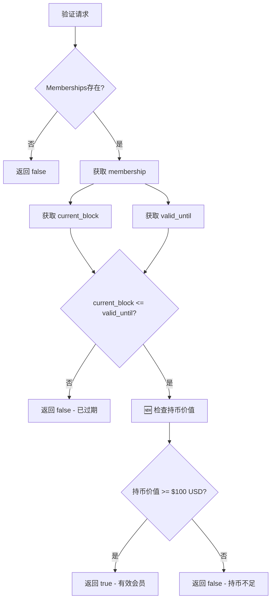
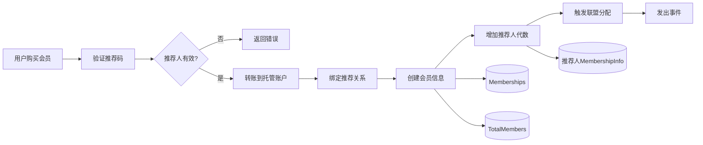

# Membership Pallet - 有效会员逻辑详解

**版本**: v1.0
**日期**: 2025-11-10
**模块**: `pallet-membership`
**作者**: Claude Code Analysis

---

## 📋 目录

1. [概述](#概述)
2. [有效会员的核心定义](#一有效会员的核心定义)
3. [会员等级体系](#二会员等级体系)
4. [会员购买流程详解](#三会员购买流程详解)
5. [有效会员验证机制](#四有效会员验证机制)
6. [会员升级机制](#五会员升级机制)
7. [动态代数增长机制](#六动态代数增长机制)
8. [会员折扣机制](#七会员折扣机制)
9. [与联盟计酬系统的集成](#八与联盟计酬系统的集成)
10. [完整代码分析](#九完整代码分析)
11. [存储结构与数据流](#十存储结构与数据流)
12. [边界情况与错误处理](#十一边界情况与错误处理)
13. [总结与最佳实践](#十二总结与最佳实践)

---

## 概述

`pallet-membership` 是 Stardust 区块链的年费会员系统，实现了完整的会员生命周期管理。**有效会员**是整个联盟返佣体系的准入门槛，只有有效会员才能获得推荐返佣。

### 核心特性

- ✅ **4级会员体系**：Year1/Year3/Year5/Year10，价格和权益递增
- ✅ **动态代数增长**：推荐越多，可拿代数越多（最多15代）
- ✅ **时间有效性验证**：基于区块高度的有效期管理
- ✅ **🆕 持币门槛验证**：持币价值 ≥ $100 USD（基于市场价格动态计算）
- ✅ **推荐关系绑定**：与 `pallet-affiliate` 无缝集成
- ✅ **会员折扣**：默认享受20%折扣（2折）

---

## 一、有效会员的核心定义

### 1.1 判断标准

**核心函数**: `pallets/membership/src/lib.rs:720-733`

**🆕 2025-11-10 更新**：新增持币门槛验证

```rust
/// 检查账户是否是有效会员
///
/// # 参数
/// - `who`: 要检查的账户
///
/// # 返回
/// - `true`: 是有效会员（已购买且未过期且持币价值≥100美元）
/// - `false`: 不是会员、已过期或持币价值不足
///
/// # 🆕 2025-11-10 变更：增加持币门槛验证
/// - 验证1：会员存在性和时效性（原有逻辑）
/// - 验证2：持币价值 ≥ 100美元（新增逻辑）
/// - 价格来源：pallet-pricing 的加权平均价格
/// - 计算公式：持币价值(USD) = 余额(DUST) × DUST价格(USDT/DUST)
pub fn is_member_valid(who: &T::AccountId) -> bool {
    if let Some(membership) = Memberships::<T>::get(who) {
        // 验证1：会员未过期
        let current_block = <frame_system::Pallet<T>>::block_number();
        if current_block > membership.valid_until {
            return false;
        }

        // 验证2：持币价值 ≥ 100美元
        Self::check_holding_value(who)
    } else {
        false
    }
}
```

**判断逻辑**：

1. **存在性检查**：账户在 `Memberships<T>` 存储中存在
2. **时效性检查**：当前区块号 ≤ 会员有效期截止区块号
3. **🆕 持币价值检查**：账户持币价值 ≥ $100 USD（动态计算）

### 1.2 有效期计算

**计算公式**：

```rust
valid_until = current_block + (blocks_per_year × years)
```

**示例**（假设 `blocks_per_year = 5,256,000`）：

| 会员等级 | 有效期（年） | 有效期（区块） | 计算公式 |
|---------|------------|--------------|---------|
| Year1 | 1年 | 5,256,000 | current + 5,256,000 |
| Year3 | 3年 | 15,768,000 | current + 15,768,000 |
| Year5 | 5年 | 26,280,000 | current + 26,280,000 |
| Year10 | 10年 | 52,560,000 | current + 52,560,000 |

**代码实现**（lib.rs:774-776）：

```rust
let blocks_per_year = T::BlocksPerYear::get();
let valid_until = current_block
    .saturating_add(blocks_per_year.saturating_mul(level.years().into()));
```

### 1.3 有效会员的验证维度

**🆕 2025-11-10 更新**：新增持币价值验证维度

| 维度 | 验证方式 | 代码位置 | 说明 |
|-----|---------|---------|------|
| **存在性** | `Memberships::<T>::contains_key(who)` | lib.rs:334, 681 | 会员记录是否存在 |
| **时效性** | `current_block <= valid_until` | lib.rs:724-726 | 会员是否未过期 |
| **🆕 持币价值** | `check_holding_value(who)` | lib.rs:754-779 | 持币价值 ≥ $100 USD |
| **可用性** | `is_member_valid(who)` | lib.rs:720-733 | 三个维度综合验证 |

### 1.4 🆕 持币价值验证机制

**新增函数**: `check_holding_value()` (lib.rs:754-779)

**计算逻辑**：

```rust
fn check_holding_value(who: &T::AccountId) -> bool {
    // 1. 获取账户余额（精度 10^12）
    let balance = T::Currency::free_balance(who);
    let balance_u128: u128 = balance.saturated_into();

    // 2. 获取 DUST 市场价格（USDT/DUST，精度 10^6）
    let dust_price_usdt = pallet_pricing::Pallet::<T::PricingConfig>::get_dust_market_price_weighted();

    // 3. 计算持币价值（美分）
    // 持币价值 = (余额 × 价格 × 100) / (10^12 × 10^6)
    let holding_value_cents = balance_u128
        .saturating_mul(dust_price_usdt as u128)
        .saturating_mul(100) // 转换为美分
        .checked_div(1_000_000_000_000_000_000) // 除以 10^18
        .unwrap_or(0);

    // 4. 与门槛比较（100美元 = 10000美分）
    let min_value_cents = T::MinHoldingValueCents::get();
    holding_value_cents >= min_value_cents as u128
}
```

**计算示例**：

| 场景 | 余额（DUST） | DUST价格（USDT） | 持币价值（USD） | 是否通过 |
|------|------------|-----------------|----------------|---------|
| 场景1 | 1,000,000 | 0.0001 | $100.00 | ✅ 通过（刚好） |
| 场景2 | 500,000 | 0.0001 | $50.00 | ❌ 不通过 |
| 场景3 | 500,000 | 0.0002 | $100.00 | ✅ 通过（价格翻倍） |

**新增查询函数**: `get_holding_value_usd()` (lib.rs:792-809)

```rust
pub fn get_holding_value_usd(who: &T::AccountId) -> (u64, u32) {
    // 返回 (dollars, cents)，例如 (123, 45) 表示 $123.45
}
```

---

## 二、会员等级体系

### 2.1 等级枚举定义

**位置**: `pallets/membership/src/types.rs:14-23`

```rust
#[derive(Encode, Decode, Clone, Copy, PartialEq, Eq, RuntimeDebug, TypeInfo, MaxEncodedLen)]
pub enum MembershipLevel {
    /// 年费会员：400 DUST，基础6代，有效期1年
    Year1,
    /// 3年会员：800 DUST，基础9代，有效期3年
    Year3,
    /// 5年会员：1600 DUST，基础12代，有效期5年
    Year5,
    /// 10年会员：2000 DUST，基础15代，有效期10年
    Year10,
}
```

### 2.2 等级参数对照表

| 参数 | Year1 | Year3 | Year5 | Year10 | 代码方法 |
|-----|-------|-------|-------|--------|---------|
| **ID** | 0 | 1 | 2 | 3 | `to_id()` |
| **价格（DUST）** | 400 | 800 | 1600 | 2000 | `price_in_units()` |
| **基础代数** | 6 | 9 | 12 | 15 | `base_generations()` |
| **有效期（年）** | 1 | 3 | 5 | 10 | `years()` |
| **升级费用** | 1800 | 1500 | 1000 | - | `upgrade_to_year10_price()` |

### 2.3 等级方法实现

**位置**: `pallets/membership/src/types.rs:25-76`

```rust
impl MembershipLevel {
    /// 将会员等级转为 ID
    pub fn to_id(&self) -> u8 {
        match self {
            Self::Year1 => 0,
            Self::Year3 => 1,
            Self::Year5 => 2,
            Self::Year10 => 3,
        }
    }

    /// 获取会员价格（单位：DUST，需乘以 UNITS）
    pub fn price_in_units(&self) -> u128 {
        match self {
            Self::Year1 => 400,
            Self::Year3 => 800,
            Self::Year5 => 1600,
            Self::Year10 => 2000,
        }
    }

    /// 获取基础推荐代数
    pub fn base_generations(&self) -> u8 {
        match self {
            Self::Year1 => 6,
            Self::Year3 => 9,
            Self::Year5 => 12,
            Self::Year10 => 15,
        }
    }

    /// 获取有效期（年）
    pub fn years(&self) -> u32 {
        match self {
            Self::Year1 => 1,
            Self::Year3 => 3,
            Self::Year5 => 5,
            Self::Year10 => 10,
        }
    }

    /// 补升级到10年会员所需费用（单位：DUST）
    pub fn upgrade_to_year10_price(&self) -> Option<u128> {
        match self {
            Self::Year1 => Some(1800),   // 400 + 1800 = 2200
            Self::Year3 => Some(1500),   // 800 + 1500 = 2300
            Self::Year5 => Some(1000),   // 1600 + 1000 = 2600
            Self::Year10 => None,        // 已经是10年会员
        }
    }
}
```

---

## 三、会员购买流程详解

### 3.1 购买接口

**函数签名**（lib.rs:307-399）：

```rust
#[pallet::call_index(0)]
#[pallet::weight(T::WeightInfo::purchase_membership())]
pub fn purchase_membership(
    origin: OriginFor<T>,
    level_id: u8,           // 0=Year1, 1=Year3, 2=Year5, 3=Year10
    referral_code: Vec<u8>, // 推荐码（必填）
) -> DispatchResult
```

### 3.2 完整流程（9步）

```
┌────────────────────────────────────────────────────────────────┐
│ 步骤 0: 解析会员等级                                             │
├────────────────────────────────────────────────────────────────┤
│ level_id → MembershipLevel                                     │
│ 0 → Year1, 1 → Year3, 2 → Year5, 3 → Year10                   │
└────────────────────────────────────────────────────────────────┘
                           ↓
┌────────────────────────────────────────────────────────────────┐
│ 步骤 1: 验证不能重复购买                                          │
├────────────────────────────────────────────────────────────────┤
│ ensure!(!Memberships::<T>::contains_key(&who), AlreadyMember); │
└────────────────────────────────────────────────────────────────┘
                           ↓
┌────────────────────────────────────────────────────────────────┐
│ 步骤 2: 验证推荐码                                               │
├────────────────────────────────────────────────────────────────┤
│ 1. 转换为 BoundedVec                                            │
│ 2. 调用 pallet_affiliate::find_account_by_code()               │
│ 3. 验证推荐人是有效会员：is_member_valid(推荐人)                 │
│    → 不是有效会员则返回错误 ReferrerNotValid                      │
└────────────────────────────────────────────────────────────────┘
                           ↓
┌────────────────────────────────────────────────────────────────┐
│ 步骤 3: 计算价格并转账到联盟托管账户                              │
├────────────────────────────────────────────────────────────────┤
│ 1. 获取会员价格：get_membership_price(level)                    │
│ 2. 获取托管账户：T::AffiliatePalletId::get().into_account()    │
│ 3. 转账：who → affiliate_account                               │
└────────────────────────────────────────────────────────────────┘
                           ↓
┌────────────────────────────────────────────────────────────────┐
│ 步骤 4: 绑定推荐关系                                             │
├────────────────────────────────────────────────────────────────┤
│ pallet_affiliate::bind_sponsor_internal(&who, &referrer)       │
│ → Sponsors::<T>::insert(who, referrer)                         │
└────────────────────────────────────────────────────────────────┘
                           ↓
┌────────────────────────────────────────────────────────────────┐
│ 步骤 5: 创建会员信息                                             │
├────────────────────────────────────────────────────────────────┤
│ create_membership_internal(who, level, referrer, current_block)│
│ → 计算 valid_until                                             │
│ → 创建 MembershipInfo 结构                                      │
│ → 保存到 Memberships::<T>                                       │
│ → 更新 TotalMembers 统计                                        │
└────────────────────────────────────────────────────────────────┘
                           ↓
┌────────────────────────────────────────────────────────────────┐
│ 步骤 6: 自动分配推荐码（可选）                                    │
├────────────────────────────────────────────────────────────────┤
│ 当前版本：需要用户手动调用 pallet_affiliate::claim_code()        │
│ （已注释掉自动分配逻辑）                                          │
└────────────────────────────────────────────────────────────────┘
                           ↓
┌────────────────────────────────────────────────────────────────┐
│ 步骤 7: 增加推荐人的奖励代数                                      │
├────────────────────────────────────────────────────────────────┤
│ increase_referrer_generation(referrer)                         │
│ → bonus_generations += 1                                       │
│ → total_generations = min(15, base + bonus)                   │
│ → referral_count += 1                                          │
└────────────────────────────────────────────────────────────────┘
                           ↓
┌────────────────────────────────────────────────────────────────┐
│ 步骤 8: 触发联盟计酬分配                                          │
├────────────────────────────────────────────────────────────────┤
│ TODO: 待实现 distribute_membership_rewards()                    │
│ 当前版本：暂时跳过，后续补充实现                                  │
└────────────────────────────────────────────────────────────────┘
                           ↓
┌────────────────────────────────────────────────────────────────┐
│ 步骤 9: 发出事件                                                 │
├────────────────────────────────────────────────────────────────┤
│ Event::MembershipPurchased {                                   │
│     who, level_id, valid_until, referrer                       │
│ }                                                              │
└────────────────────────────────────────────────────────────────┘
```

### 3.3 关键代码片段

#### 步骤 2: 验证推荐码（lib.rs:326-342）

```rust
// 🆕 2025-10-28 更新：通过 AffiliateConfig 关联类型调用 pallet-affiliate
let referrer_account = {
    use frame_support::BoundedVec;
    let code_bounded = BoundedVec::try_from(referral_code.clone())
        .map_err(|_| Error::<T>::InvalidReferralCode)?;
    pallet_affiliate::Pallet::<T::AffiliateConfig>::find_account_by_code(&code_bounded)
        .ok_or(Error::<T>::InvalidReferralCode)?
};

// ⚠️ 关键验证：推荐人必须是有效会员
ensure!(
    Self::is_member_valid(&referrer_account),
    Error::<T>::ReferrerNotValid
);
```

#### 步骤 3: 转账到托管账户（lib.rs:344-353）

```rust
// ✅ 计算价格并转账到联盟托管账户
let price = Self::get_membership_price(level);
let affiliate_account = T::AffiliatePalletId::get().into_account_truncating();

T::Currency::transfer(
    &who,
    &affiliate_account,  // ✅ 联盟托管账户
    price,
    ExistenceRequirement::KeepAlive,
)?;
```

#### 步骤 5: 创建会员信息（lib.rs:767-795）

```rust
fn create_membership_internal(
    who: T::AccountId,
    level: MembershipLevel,
    referrer: Option<T::AccountId>,
    current_block: BlockNumberFor<T>,
) -> Result<BlockNumberFor<T>, DispatchError> {
    // 1. 计算有效期
    let blocks_per_year = T::BlocksPerYear::get();
    let valid_until = current_block
        .saturating_add(blocks_per_year.saturating_mul(level.years().into()));

    // 2. 创建会员信息
    let base_generations = level.base_generations();
    let membership = MembershipInfo {
        level,
        purchased_at: current_block,
        valid_until,
        base_generations,
        bonus_generations: 0,
        total_generations: base_generations,
        referrer,
        referral_count: 0,
    };

    // 3. 保存会员信息
    Memberships::<T>::insert(&who, membership);
    TotalMembers::<T>::mutate(&level, |count| *count = count.saturating_add(1));

    Ok(valid_until)
}
```

---

## 四、有效会员验证机制

**🆕 2025-11-10 更新**：新增持币价值验证场景

### 4.1 验证场景汇总

| 验证场景 | 调用位置 | 代码位置 | 验证目的 |
|---------|---------|---------|---------|
| **购买会员时** | 验证推荐人 | lib.rs:347-350 | 确保推荐人有效 |
| **即时分成时** | 验证推荐链 | affiliate/src/instant.rs:107 | 确保推荐人可拿返佣 |
| **周结算时** | 验证推荐链 | affiliate/src/weekly.rs:73-76 | 确保推荐人可累计应得 |
| **认领推荐码时** | 验证会员资格 | affiliate/src/referral.rs:209-211 | 仅会员可认领 |

**⚠️ 重要变更**：以上所有验证场景现在都包含持币价值检查（≥$100 USD）

### 4.2 验证流程可视化

**🆕 2025-11-10 更新**：增加持币价值验证步骤



### 4.3 相关辅助函数

#### 4.3.1 获取会员可拿代数（lib.rs:721-728）

```rust
/// 获取会员可拿代数
///
/// # 参数
/// - `who`: 要查询的账户
///
/// # 返回
/// - `Some(代数)`: 有效会员的可拿代数
/// - `None`: 不是会员或已过期
pub fn get_member_generations(who: &T::AccountId) -> Option<u8> {
    if let Some(membership) = Memberships::<T>::get(who) {
        if Self::is_member_valid(who) {
            return Some(membership.total_generations)
        }
    }
    None
}
```

#### 4.3.2 获取会员价格（lib.rs:745-752）

```rust
/// 获取会员等级价格（最小单位）
///
/// # 参数
/// - `level`: 会员等级
///
/// # 返回
/// 价格（最小单位），如果存储中有设置则返回存储价格，否则返回默认价格
pub fn get_membership_price(level: MembershipLevel) -> BalanceOf<T> {
    MembershipPrices::<T>::get(level).unwrap_or_else(|| {
        // 如果存储中没有设置，使用默认价格
        let units: u128 = T::Units::get().saturated_into();
        let price_u128 = level.price_in_units().saturating_mul(units);
        price_u128.saturated_into()
    })
}
```

---

## 五、会员升级机制

### 5.1 升级接口

**函数签名**（lib.rs:421-485）：

```rust
#[pallet::call_index(1)]
#[pallet::weight(T::WeightInfo::upgrade_to_year10())]
pub fn upgrade_to_year10(origin: OriginFor<T>) -> DispatchResult
```

### 5.2 升级流程（8步）

```
┌────────────────────────────────────────────────────────────────┐
│ 步骤 1: 获取当前会员信息                                          │
├────────────────────────────────────────────────────────────────┤
│ Memberships::<T>::get(&who).ok_or(NotMember)?                 │
└────────────────────────────────────────────────────────────────┘
                           ↓
┌────────────────────────────────────────────────────────────────┐
│ 步骤 2: 验证不是已经是10年会员                                    │
├────────────────────────────────────────────────────────────────┤
│ ensure!(membership.level != Year10, AlreadyYear10);            │
└────────────────────────────────────────────────────────────────┘
                           ↓
┌────────────────────────────────────────────────────────────────┐
│ 步骤 3: 计算升级费用                                             │
├────────────────────────────────────────────────────────────────┤
│ upgrade_to_year10_price() × units                              │
│ Year1 → 1800 DUST, Year3 → 1500 DUST, Year5 → 1000 DUST       │
└────────────────────────────────────────────────────────────────┘
                           ↓
┌────────────────────────────────────────────────────────────────┐
│ 步骤 4: 扣费到国库账户                                           │
├────────────────────────────────────────────────────────────────┤
│ T::Currency::transfer(who → treasury, upgrade_price, KeepAlive)│
└────────────────────────────────────────────────────────────────┘
                           ↓
┌────────────────────────────────────────────────────────────────┐
│ 步骤 5: 更新会员信息                                             │
├────────────────────────────────────────────────────────────────┤
│ - level = Year10                                               │
│ - base_generations = 15                                        │
│ - total_generations = 15（不再受bonus影响）                     │
│ - valid_until = current_block + (blocks_per_year × 10)        │
└────────────────────────────────────────────────────────────────┘
                           ↓
┌────────────────────────────────────────────────────────────────┐
│ 步骤 6: 保存更新后的会员信息                                      │
├────────────────────────────────────────────────────────────────┤
│ Memberships::<T>::insert(&who, membership);                    │
└────────────────────────────────────────────────────────────────┘
                           ↓
┌────────────────────────────────────────────────────────────────┐
│ 步骤 7: 更新统计数据                                             │
├────────────────────────────────────────────────────────────────┤
│ TotalMembers(old_level) -= 1                                   │
│ TotalMembers(Year10) += 1                                      │
└────────────────────────────────────────────────────────────────┘
                           ↓
┌────────────────────────────────────────────────────────────────┐
│ 步骤 8: 发出事件                                                 │
├────────────────────────────────────────────────────────────────┤
│ Event::MembershipUpgraded {                                    │
│     who, from_id, to_id, new_valid_until                       │
│ }                                                              │
└────────────────────────────────────────────────────────────────┘
```

### 5.3 升级费用对照表

| 原等级 | 原价格 | 升级费用 | 总支出 | 多支出 | 备注 |
|-------|-------|---------|-------|-------|------|
| Year1 | 400 | 1800 | 2200 | +200 | 含补差费 |
| Year3 | 800 | 1500 | 2300 | +300 | 含补差费 |
| Year5 | 1600 | 1000 | 2600 | +600 | 含补差费 |
| Year10 | 2000 | - | 2000 | 0 | 无法升级 |

⚠️ **注意**：升级费用 > 直接差价，是因为包含了**升级服务费**。

### 5.4 升级效果对比

| 效果维度 | 升级前（Year1示例） | 升级后（Year10） | 变化 |
|---------|-------------------|-----------------|------|
| **有效期** | 剩余X天 | 重新计算10年 | ✅ 重置 |
| **基础代数** | 6 | 15 | ✅ +9 |
| **总代数** | 6 + bonus | 15 | ✅ 锁定15 |
| **代数增长** | 可继续增长 | 不再增长 | ❌ 失去 |

---

## 六、动态代数增长机制

### 6.1 增长规则

**核心公式**：

```
total_generations = min(15, base_generations + bonus_generations)
```

**触发时机**：
- 每当用户成功推荐一个新会员购买会员时
- 调用 `increase_referrer_generation(referrer)`

### 6.2 增长函数实现（lib.rs:808-832）

```rust
/// 增加推荐人的奖励代数
///
/// # 参数
/// - `referrer`: 推荐人账户
///
/// # 逻辑
/// - 每推荐一个会员，奖励代数+1
/// - 总代数 = 基础代数 + 奖励代数
/// - 总代数上限为15
/// - 10年会员初始即15代，不再增长
fn increase_referrer_generation(referrer: &T::AccountId) -> DispatchResult {
    Memberships::<T>::try_mutate(referrer, |maybe_membership| -> DispatchResult {
        if let Some(ref mut membership) = maybe_membership {
            // 每推荐一个会员，增加1代
            membership.bonus_generations = membership.bonus_generations.saturating_add(1);

            // 重新计算总代数（最多15代）
            membership.total_generations = 15u8.min(
                membership.base_generations.saturating_add(membership.bonus_generations),
            );

            // 增加推荐计数
            membership.referral_count = membership.referral_count.saturating_add(1);

            // 发出事件
            Self::deposit_event(Event::GenerationIncreased {
                who: referrer.clone(),
                bonus: membership.bonus_generations,
                total: membership.total_generations,
            });
        }
        Ok(())
    })
}
```

### 6.3 增长示例

#### 示例 1: Year1 会员（基础6代）

| 推荐人数 | 奖励代数 | 总代数 | 计算过程 |
|---------|---------|--------|---------|
| 0 | 0 | 6 | 6 + 0 = 6 |
| 1 | 1 | 7 | 6 + 1 = 7 |
| 5 | 5 | 11 | 6 + 5 = 11 |
| 9 | 9 | 15 | min(15, 6+9) = 15 |
| 10 | 10 | 15 | min(15, 6+10) = 15 ⚠️ 达到上限 |
| 20 | 20 | 15 | min(15, 6+20) = 15 ⚠️ 保持上限 |

#### 示例 2: Year5 会员（基础12代）

| 推荐人数 | 奖励代数 | 总代数 | 计算过程 |
|---------|---------|--------|---------|
| 0 | 0 | 12 | 12 + 0 = 12 |
| 1 | 1 | 13 | 12 + 1 = 13 |
| 3 | 3 | 15 | min(15, 12+3) = 15 |
| 5 | 5 | 15 | min(15, 12+5) = 15 ⚠️ 保持上限 |

#### 示例 3: Year10 会员（基础15代）

| 推荐人数 | 奖励代数 | 总代数 | 说明 |
|---------|---------|--------|------|
| 0 | 0 | 15 | 初始即满级 |
| 10 | 10 | 15 | min(15, 15+10) = 15 ⚠️ 无增长空间 |

---

## 七、会员折扣机制

### 7.1 折扣存储

**存储定义**（lib.rs:169-170）：

```rust
/// 会员折扣比例（0-100）
/// 默认值：20，表示20%，即2折
#[pallet::storage]
#[pallet::getter(fn member_discount)]
pub type MemberDiscount<T: Config> = StorageValue<_, DiscountPercent, ValueQuery>;
```

### 7.2 设置折扣（Root权限）

**函数签名**（lib.rs:500-512）：

```rust
/// 设置会员折扣（Root权限）
///
/// # 参数
/// - `origin`: Root来源
/// - `discount`: 折扣比例（0-100，例如20表示20%即2折）
#[pallet::call_index(2)]
#[pallet::weight(T::WeightInfo::set_member_discount())]
pub fn set_member_discount(
    origin: OriginFor<T>,
    discount: DiscountPercent,
) -> DispatchResult {
    ensure_root(origin)?;

    // 验证折扣范围（0-100）
    ensure!(discount <= 100, Error::<T>::InvalidDiscount);

    MemberDiscount::<T>::put(discount);
    Self::deposit_event(Event::DiscountUpdated { discount });
    Ok(())
}
```

### 7.3 获取折扣

**函数实现**（lib.rs:734-736）：

```rust
/// 获取会员折扣比例
///
/// # 返回
/// 折扣比例（0-100）
pub fn get_discount() -> DiscountPercent {
    MemberDiscount::<T>::get()
}
```

### 7.4 折扣应用场景

| 场景 | 应用方式 | 说明 |
|-----|---------|------|
| **供奉消费** | `pallet-memorial` 调用 `get_discount()` | 会员享受供奉折扣 |
| **OTC交易** | `pallet-otc-order` 调用 `get_discount()` | 会员享受交易费折扣 |
| **其他消费** | 通过 `MembershipProvider` trait | 统一折扣接口 |

---

## 八、与联盟计酬系统的集成

### 8.1 集成方式

通过**关联类型**（Associated Type）连接两个 pallet，避免 Currency 类型冲突：

**配置定义**（lib.rs:119-120）：

```rust
/// 联盟计酬系统类型（指向 Runtime，实现了 pallet_affiliate::Config）
type AffiliateConfig: pallet_affiliate::Config<AccountId = Self::AccountId>;
```

### 8.2 调用方式

#### 8.2.1 查询推荐码（lib.rs:332）

```rust
pallet_affiliate::Pallet::<T::AffiliateConfig>::find_account_by_code(&code_bounded)
```

#### 8.2.2 绑定推荐关系（lib.rs:358）

```rust
pallet_affiliate::Pallet::<T::AffiliateConfig>::bind_sponsor_internal(&who, referrer_account);
```

### 8.3 集成点汇总

| 集成点 | 功能 | Membership → Affiliate |
|-------|------|----------------------|
| **推荐码验证** | 验证推荐码是否存在 | `find_account_by_code()` |
| **推荐关系绑定** | 绑定新会员与推荐人 | `bind_sponsor_internal()` |
| **会员资金托管** | 会员费用进入托管账户 | 转账到 `AffiliatePalletId` 账户 |
| **会员费用分配** | TODO: 分配会员费用 | `distribute_membership_rewards()` 待实现 |

### 8.4 双账户体系

| 账户类型 | PalletId | 用途 | 代码位置 |
|---------|---------|------|---------|
| **联盟托管账户** | `AffiliatePalletId` | 会员购买费用 | lib.rs:346 |
| **会员国库账户** | `PalletId` | 会员升级费用 | lib.rs:444 |

```rust
// 联盟托管账户
let affiliate_account = T::AffiliatePalletId::get().into_account_truncating();

// 会员国库账户
pub fn treasury_account() -> T::AccountId {
    T::PalletId::get().into_account_truncating()
}
```

---

## 九、完整代码分析

### 9.1 MembershipInfo 结构（types.rs:85-102）

```rust
/// 会员信息结构体
#[derive(Encode, Decode, Clone, PartialEq, Eq, RuntimeDebug, TypeInfo, MaxEncodedLen)]
pub struct MembershipInfo<AccountId, BlockNumber> {
    /// 会员等级
    pub level: MembershipLevel,
    /// 购买时间（区块高度）
    pub purchased_at: BlockNumber,
    /// 有效期至（区块高度）
    pub valid_until: BlockNumber,
    /// 基础代数（根据等级固定）
    pub base_generations: u8,
    /// 奖励代数（通过推荐获得）
    pub bonus_generations: u8,
    /// 总代数（base + bonus，最多15）
    pub total_generations: u8,
    /// 推荐人账户（可选，创始会员无推荐人）
    pub referrer: Option<AccountId>,
    /// 已推荐会员数量
    pub referral_count: u32,
}
```

**字段说明**：

| 字段 | 类型 | 说明 | 可变性 |
|-----|------|-----|-------|
| `level` | `MembershipLevel` | 会员等级 | 可升级（仅→Year10） |
| `purchased_at` | `BlockNumber` | 购买时区块高度 | 不变 |
| `valid_until` | `BlockNumber` | 有效期截止区块 | 升级时更新 |
| `base_generations` | `u8` | 基础代数 | 升级时更新 |
| `bonus_generations` | `u8` | 奖励代数 | 推荐时增长 |
| `total_generations` | `u8` | 总代数 | 动态计算 |
| `referrer` | `Option<AccountId>` | 推荐人 | 不变 |
| `referral_count` | `u32` | 推荐人数 | 推荐时增长 |

### 9.2 存储项汇总

| 存储项 | 类型 | 描述 | Getter |
|-------|------|-----|--------|
| `Memberships` | `StorageMap<AccountId, MembershipInfo>` | 会员信息 | `memberships()` |
| `TotalMembers` | `StorageMap<MembershipLevel, u32>` | 总会员数统计 | `total_members()` |
| `MemberDiscount` | `StorageValue<u8>` | 会员折扣比例 | `member_discount()` |
| `MembershipPrices` | `StorageMap<MembershipLevel, Balance>` | 会员价格 | `membership_price()` |

### 9.3 事件汇总

| 事件 | 参数 | 触发时机 |
|-----|------|---------|
| `MembershipPurchased` | who, level_id, valid_until, referrer | 购买会员成功 |
| `MembershipUpgraded` | who, from_id, to_id, new_valid_until | 会员升级成功 |
| `GenerationIncreased` | who, bonus, total | 推荐代数增加 |
| `DiscountUpdated` | discount | 会员折扣更新 |
| `MembershipPriceUpdated` | level_id, price | 会员价格更新 |
| `BatchPricesUpdated` | count | 批量价格更新 |
| `SeedMemberAdded` | who, level_id | 种子会员已添加 |

### 9.4 错误码汇总

| 错误 | 说明 | 触发场景 |
|-----|------|---------|
| `AlreadyMember` | 已经是会员 | 重复购买 |
| `NotMember` | 不是会员 | 查询或升级时不存在 |
| `InvalidReferralCode` | 无效的推荐码 | 推荐码不存在 |
| `ReferralCodeTooLong` | 推荐码太长 | 超过限制 |
| `ReferrerNotValid` | 推荐人无效 | 推荐人不是有效会员 |
| `AlreadyYear10` | 已经是10年会员 | 尝试升级Year10 |
| `CannotUpgrade` | 无法升级 | 非法升级操作 |
| `MembershipExpired` | 会员已过期 | 过期会员操作 |
| `InvalidDiscount` | 折扣无效 | 折扣不在0-100范围 |
| `ReferralCodeExists` | 推荐码已存在 | 推荐码冲突 |
| `PriceOutOfRange` | 价格超出范围 | 价格过低或过高 |
| `PriceNotSet` | 价格未设置 | 治理未初始化价格 |

---

## 十、存储结构与数据流

### 10.1 存储层次结构

```
Memberships (StorageMap)
├── AccountId → MembershipInfo
│   ├── level: MembershipLevel
│   ├── purchased_at: BlockNumber
│   ├── valid_until: BlockNumber
│   ├── base_generations: u8
│   ├── bonus_generations: u8
│   ├── total_generations: u8
│   ├── referrer: Option<AccountId>
│   └── referral_count: u32

TotalMembers (StorageMap)
├── Year1 → count: u32
├── Year3 → count: u32
├── Year5 → count: u32
└── Year10 → count: u32

MemberDiscount (StorageValue)
└── discount: u8 (0-100)

MembershipPrices (StorageMap)
├── Year1 → price: Balance
├── Year3 → price: Balance
├── Year5 → price: Balance
└── Year10 → price: Balance
```

### 10.2 数据流图



---

## 十一、边界情况与错误处理

### 11.1 重复购买

**场景**：用户已是会员，再次调用 `purchase_membership()`

**验证**（lib.rs:324）：
```rust
ensure!(!Memberships::<T>::contains_key(&who), Error::<T>::AlreadyMember);
```

**结果**：返回错误 `AlreadyMember`

### 11.2 推荐人无效

**场景 1**：推荐码不存在

**验证**（lib.rs:332-334）：
```rust
pallet_affiliate::Pallet::<T::AffiliateConfig>::find_account_by_code(&code_bounded)
    .ok_or(Error::<T>::InvalidReferralCode)?
```

**结果**：返回错误 `InvalidReferralCode`

**场景 2**：推荐人不是有效会员

**验证**（lib.rs:337-340）：
```rust
ensure!(
    Self::is_member_valid(&referrer_account),
    Error::<T>::ReferrerNotValid
);
```

**结果**：返回错误 `ReferrerNotValid`

### 11.3 会员过期

**场景**：会员有效期已过，仍尝试使用会员权益

**验证**：
```rust
if current_block > membership.valid_until {
    // 会员已过期
    return false;
}
```

**影响**：
- ❌ 无法获得联盟返佣
- ❌ 无法享受会员折扣
- ❌ 无法被他人设为推荐人
- ✅ 仍可查看历史会员信息

### 11.4 代数增长上限

**场景**：会员推荐人数超过9人（Year1会员）

**处理**（lib.rs:816-818）：
```rust
membership.total_generations = 15u8.min(
    membership.base_generations.saturating_add(membership.bonus_generations),
);
```

**结果**：总代数锁定在15，不会超过

### 11.5 价格未设置

**场景**：治理未初始化会员价格

**处理**（lib.rs:746-751）：
```rust
MembershipPrices::<T>::get(level).unwrap_or_else(|| {
    // 如果存储中没有设置，使用默认价格
    let units: u128 = T::Units::get().saturated_into();
    let price_u128 = level.price_in_units().saturating_mul(units);
    price_u128.saturated_into()
})
```

**结果**：使用硬编码的默认价格

---

## 十二、总结与最佳实践

### 12.1 有效会员的核心要点

**🆕 2025-11-10 更新**：增加持币价值验证维度

| 维度 | 核心逻辑 | 实现位置 |
|-----|---------|---------|
| **判断标准** | 存在性 + 时效性 + **🆕 持币价值** | `is_member_valid()` |
| **有效期管理** | 区块高度验证 | `current_block <= valid_until` |
| **🆕 持币门槛** | 价值 ≥ $100 USD（动态计算） | `check_holding_value()` |
| **代数增长** | 推荐激励机制 | `increase_referrer_generation()` |
| **等级体系** | 4级递进式 | `MembershipLevel` enum |
| **系统集成** | 与 pallet-affiliate 深度集成 | 关联类型 `AffiliateConfig` |
| **价格集成** | 与 pallet-pricing 实时联动 | 关联类型 `PricingConfig` |

### 12.2 最佳实践

#### 12.2.1 购买会员

✅ **推荐做法**：
- 先验证推荐码有效性
- 确保账户余额充足（**🆕 持币价值≥$100 USD**）
- 选择合适的会员等级
- 保存交易哈希用于查询
- **🆕 考虑DUST价格波动**：建议持币1,000,000+ DUST以应对价格下跌

❌ **避免做法**：
- 不检查是否已是会员
- 使用无效的推荐码
- 重复提交交易
- **🆕 忽略持币门槛**：仅购买会员但余额不足$100价值

#### 12.2.2 升级会员

✅ **推荐做法**：
- Year1/Year3 用户尽早升级到 Year10
- 升级前计算总支出（原价格 + 升级费用）
- 理解升级后代数增长机制失效

❌ **避免做法**：
- 频繁升级（一次性到位更划算）
- 未理解升级价格体系
- 忽略有效期重置的收益

#### 12.2.3 推荐他人

✅ **推荐做法**：
- 确保自己是有效会员（**🆕 包括持币价值≥$100**）
- 先认领推荐码（`claim_code()`）
- 提供清晰的推荐码给下级
- 跟踪推荐人数和代数增长
- **🆕 持续监控持币价值**：避免因余额不足失去推荐资格

❌ **避免做法**：
- 未认领推荐码就推荐他人
- 推荐码分享不明确
- 忽略代数增长上限
- **🆕 忽略持币状态**：余额不足$100价值时仍然推荐他人

#### 🆕 12.2.4 持币管理（2025-11-10 新增）

✅ **推荐做法**：
- **保持安全边际**：持币价值远超$100（建议≥$200）
- **定期查询价值**：使用`get_holding_value_usd()`监控
- **价格下跌时充值**：及时补充DUST以维持门槛
- **多余额账户**：分散风险，不把所有DUST放在一个账户

❌ **避免做法**：
- **临界余额**：刚好$100价值，无安全边际
- **忽略价格波动**：DUST价格下跌后不补充
- **频繁提现**：导致持币价值低于门槛
- **零余额等待**：等到失去权益才充值

### 12.3 常见问题（FAQ）

#### Q1: 会员过期后，推荐的下级还存在吗？

**A**: 存在。推荐关系由 `pallet-affiliate` 管理，不受推荐人会员状态影响。但推荐人过期后，**无法获得下级的返佣**。

#### Q2: 升级到 Year10 后，还能继续推荐吗？

**A**: 可以推荐，但不会增加奖励代数（已锁定15代）。推荐仍然有价值，因为：
- 下级消费时，仍可获得返佣
- `referral_count` 会继续增长

#### Q3: 会员费用如何分配？

**A**: 当前版本中，会员费用进入联盟托管账户，但**分配逻辑未实现**（见 lib.rs:382-388 的 TODO 注释）。后续版本将实现 100% 推荐链分配。

#### Q4: 可以从 Year3 升级到 Year5 吗？

**A**: 不可以。当前仅支持升级到 Year10（`upgrade_to_year10()`）。

#### Q5: 推荐码可以修改吗？

**A**: 不可以。推荐码认领后不可修改（`AlreadyHasCode` 错误）。

#### 🆕 Q6: 持币价值如何计算？（2025-11-10 新增）

**A**: 持币价值 = 账户余额（DUST）× DUST市场价格（USDT/DUST）

**示例**：
- 余额：1,000,000 DUST
- DUST价格：0.0001 USDT/DUST（来自 pallet-pricing）
- 持币价值：1,000,000 × 0.0001 = **$100 USD** ✅

**查询方式**：
```rust
let (dollars, cents) = Membership::get_holding_value_usd(&who);
// 返回 (100, 0) 表示 $100.00
```

#### 🆕 Q7: DUST价格下跌后，我会失去会员权益吗？（2025-11-10 新增）

**A**: 是的。如果DUST价格下跌导致持币价值 < $100 USD，你会**暂时失去**会员权益，包括：
- ❌ 无法获得推荐返佣
- ❌ 无法享受会员折扣
- ❌ 无法被他人设为推荐人

**解决方法**：
1. 充值DUST，使持币价值 ≥ $100
2. 权益会**自动恢复**（无需重新购买会员）

**防范措施**：
- 建议持币价值 ≥ $200（100%安全边际）
- 定期查询持币价值，及时补充

#### 🆕 Q8: 为什么是价值门槛而不是数量门槛？（2025-11-10 新增）

**A**: 价值门槛更加公平和经济合理：

**价值门槛优势**：
- ✅ **价格波动自适应**：DUST价格上涨时所需数量减少
- ✅ **公平性**：所有会员标准统一（无论加入时间）
- ✅ **经济合理**：门槛始终等价于$100购买力

**数量门槛缺陷**：
- ❌ **不公平**：早期便宜时加入的用户占便宜
- ❌ **僵化**：无法适应市场变化
- ❌ **通胀风险**：DUST贬值后门槛失去意义

**对比示例**：

| DUST价格 | 价值门槛（灵活） | 数量门槛（固定1M DUST） |
|---------|----------------|----------------------|
| 0.0001 USDT | 需要 1,000,000 DUST | 需要 1,000,000 DUST |
| 0.0002 USDT | 需要 500,000 DUST ✅ | 需要 1,000,000 DUST ❌ |
| 0.00005 USDT | 需要 2,000,000 DUST ✅ | 需要 1,000,000 DUST ❌（价值仅$50） |

#### 🆕 Q9: 持币价值不足时，已有的推荐关系会消失吗？（2025-11-10 新增）

**A**: 不会消失。推荐关系由 `pallet-affiliate` 管理，**永久保留**。

**影响范围**：
- ✅ 推荐关系仍然存在
- ✅ 推荐树结构完整
- ✅ `referral_count` 不受影响
- ❌ **暂时无法获得返佣**（直到持币价值恢复≥$100）

**恢复方法**：
1. 充值DUST使持币价值≥$100
2. 权益自动恢复，开始计算返佣
3. 无需重新绑定推荐关系

### 12.4 未来优化方向

**🆕 2025-11-10 更新**：持币门槛机制已实施

| 优化项 | 优先级 | 预期收益 | 状态 |
|-------|-------|---------|------|
| **✅ 持币价值门槛** | 🔴 P0 | 增强准入控制 | 已完成 |
| **实现会员费用分配** | 🔴 P0 | 完善经济模型 | 待实施 |
| **支持渐进式升级** | 🟠 P1 | 提升用户体验 | 待评估 |
| **会员续费功能** | 🟡 P2 | 降低用户流失 | 待评估 |
| **持币价值预警** | 🟡 P2 | 提升用户体验 | 待实施 |
| **会员NFT徽章** | 🟢 P3 | 增强会员荣誉感 | 待评估 |
| **推荐排行榜** | 🟢 P3 | 激励推广 | 待评估 |

**新增优化方向**（基于持币门槛机制）：

1. **持币价值预警系统** (P2)
   - 链上监控持币价值
   - 低于$110时发送预警
   - 前端红色警告提示

2. **价格波动缓冲** (P2)
   - 治理可调整门槛（如降至$80）
   - 应对极端市场波动
   - 保护会员权益

3. **分级持币门槛** (P1)
   - Year1: $50 USD
   - Year3: $75 USD
   - Year5: $90 USD
   - Year10: $100 USD
   - 激励会员升级

---

## 附录：Runtime 配置示例

**🆕 2025-11-10 更新**：增加持币门槛相关配置

```rust
impl pallet_membership::Config for Runtime {
    type RuntimeEvent = RuntimeEvent;
    type Currency = Balances;
    type PalletId = MembershipPalletId;
    type BlocksPerYear = BlocksPerYear;
    type Units = Units;
    type AffiliateConfig = Self; // Runtime 实现了 pallet_affiliate::Config

    // 🆕 2025-11-10：价格查询系统配置
    type PricingConfig = Runtime; // Runtime 实现了 pallet_pricing::Config

    // 🆕 2025-11-10：最低持币价值（美分）
    type MinHoldingValueCents = MinHoldingValueCents; // 10000 = $100 USD

    type GovernanceOrigin = EnsureRootOrHalfCouncil;
    type MinMembershipPrice = MinMembershipPrice;
    type MaxMembershipPrice = MaxMembershipPrice;
    type AffiliatePalletId = AffiliatePalletId;
    type WeightInfo = pallet_membership::weights::SubstrateWeight<Runtime>;
}

// 参数配置
parameter_types! {
    pub const MembershipPalletId: PalletId = PalletId(*b"py/mbshp");
    pub const AffiliatePalletId: PalletId = PalletId(*b"py/affil");
    pub const BlocksPerYear: BlockNumber = 5_256_000; // 6秒出块
    pub const Units: Balance = 1_000_000_000_000; // 1 DUST = 10^12
    pub const MinMembershipPrice: Balance = 100_000_000_000_000; // 100 DUST
    pub const MaxMembershipPrice: Balance = 10_000_000_000_000_000; // 10,000 DUST

    // 🆕 2025-11-10：最低持币价值（美分）
    // 10000美分 = 100美元
    pub const MinHoldingValueCents: u64 = 10000;
}
```

**配置说明**：

| 配置项 | 类型 | 值 | 说明 |
|-------|------|----|----|
| `PricingConfig` | Runtime | `Runtime` | **🆕** 连接 pallet-pricing，获取市场价格 |
| `MinHoldingValueCents` | u64 | `10000` | **🆕** 最低持币价值（100美元 = 10000美分） |
| `Currency` | Currency | `Balances` | DUST代币系统 |
| `PalletId` | PalletId | `py/mbshp` | Membership模块账户ID |
| `BlocksPerYear` | BlockNumber | `5,256,000` | 每年区块数（6秒/块） |
| `Units` | Balance | `10^12` | DUST精度（1 DUST = 10^12） |
| `AffiliateConfig` | Runtime | `Runtime` | 连接联盟计酬系统 |

**价格精度说明**：

- **DUST余额精度**：10^12（1 DUST = 1,000,000,000,000）
- **USDT价格精度**：10^6（1 USDT = 1,000,000）
- **USD金额精度**：100（1 USD = 100 cents）

**计算示例**：

```rust
// 1. 获取账户余额（精度 10^12）
let balance: u128 = 1_000_000_000_000_000_000; // 1,000,000 DUST

// 2. 获取 DUST 市场价格（精度 10^6）
let dust_price_usdt: u64 = 100; // 0.0001 USDT/DUST

// 3. 计算持币价值（美分）
let holding_value_cents = (balance * dust_price_usdt * 100) / 10^18
                        = (1,000,000 * 10^12 * 100 * 100) / 10^18
                        = 10,000 美分
                        = $100.00 USD ✅

// 4. 验证门槛
holding_value_cents >= MinHoldingValueCents::get() // 10000 >= 10000 ✅
```

---

**文档结束**

如有疑问，请参考代码注释或联系开发团队。
