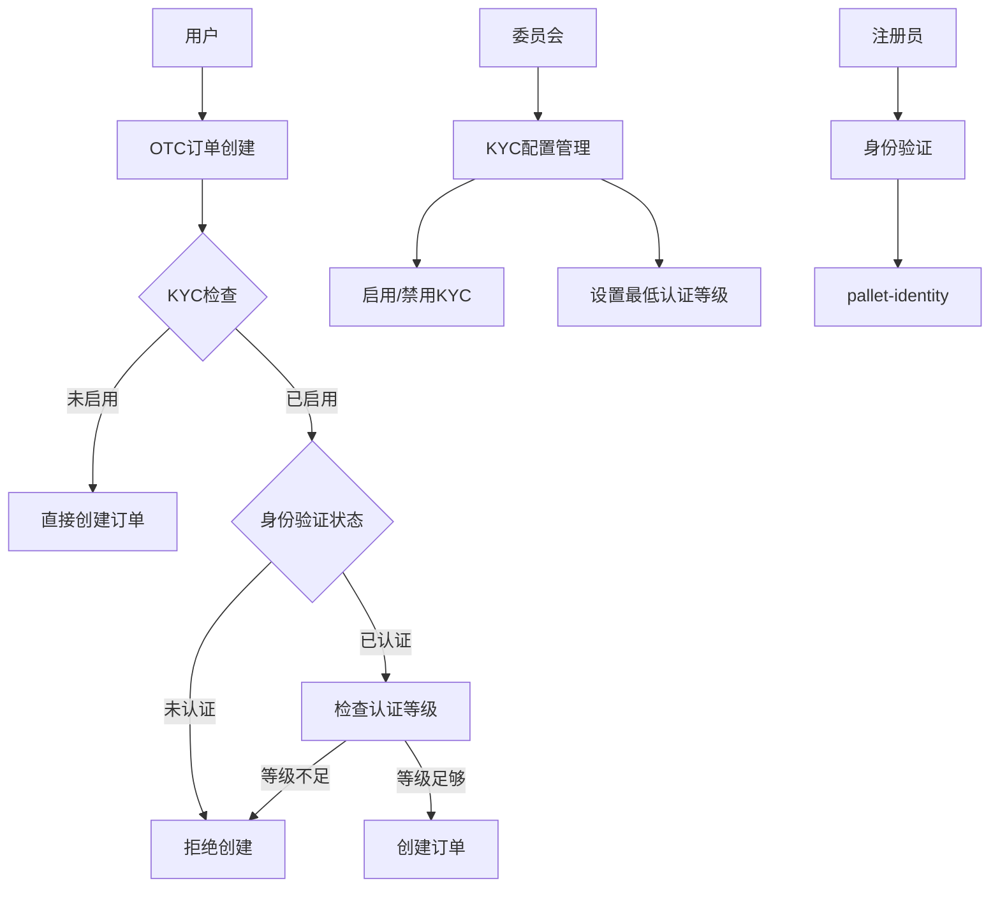
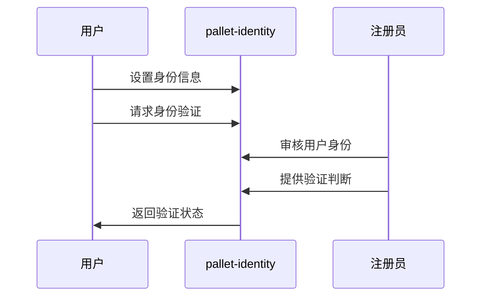
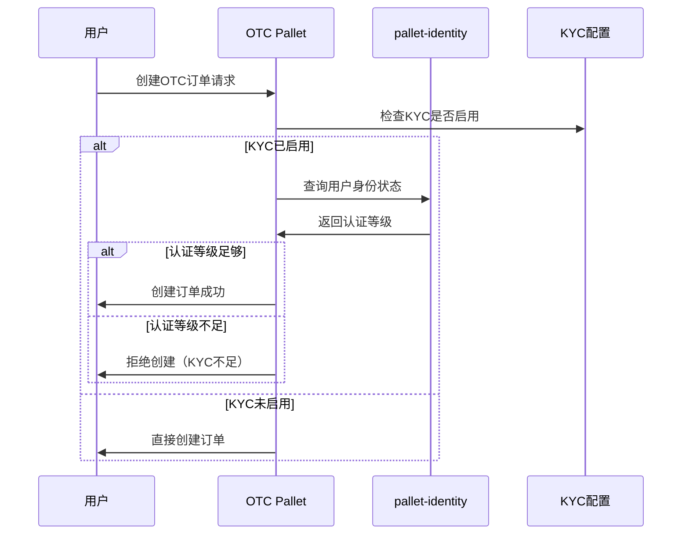

# OTC订单KYC认证方案

## 📋 方案概述

### 目标
实现OTC订单的KYC（Know Your Customer）认证机制，使用Substrate官方的`pallet-identity`进行身份验证，确保交易安全性和合规性。

### 核心功能
- 🔐 基于`pallet-identity`的KYC认证
- ⚖️ 委员会治理控制KYC开关
- 🛡️ 只有通过KYC的用户才能创建OTC订单
- 📊 灵活的认证等级管理

---

## 🏗️ 技术架构

### 系统组件



### Pallet依赖关系

```rust
// Cargo.toml dependencies
pallet-identity = { version = "4.0.0-dev", default-features = false }
pallet-collective = { version = "4.0.0-dev", default-features = false }
```

---

## 🔄 KYC认证流程

### 1. 身份注册阶段



### 2. OTC订单创建阶段



---

## ⚙️ 配置管理

### KYC配置结构

```rust
/// KYC配置
#[derive(Encode, Decode, Clone, PartialEq, Eq, TypeInfo, MaxEncodedLen)]
pub struct KycConfig {
    /// 是否启用KYC要求
    pub enabled: bool,
    /// 创建OTC订单的最低认证等级
    pub min_judgment_level: Judgement,
    /// 配置生效的区块高度
    pub effective_block: BlockNumber,
}

/// 身份认证等级（来自pallet-identity）
pub enum Judgement {
    /// 未知身份
    Unknown,
    /// 请求中的身份验证
    FeePaid(Balance),
    /// 合理身份（低级验证）
    Reasonable,
    /// 已知身份（中级验证）
    KnownGood,
    /// 过期身份
    OutOfDate,
    /// 低质量身份
    LowQuality,
    /// 错误身份
    Erroneous,
}
```

### 委员会控制接口

```rust
/// 委员会可调用的KYC管理函数
impl<T: Config> Pallet<T> {
    /// 启用KYC要求
    #[pallet::weight(T::WeightInfo::enable_kyc())]
    pub fn enable_kyc_requirement(
        origin: OriginFor<T>,
        min_judgment_level: Judgement,
    ) -> DispatchResult {
        // 确保调用者是委员会
        T::CommitteeOrigin::ensure_origin(origin)?;

        // 更新配置
        KycConfig::<T>::put(KycConfig {
            enabled: true,
            min_judgment_level,
            effective_block: <frame_system::Pallet<T>>::block_number(),
        });

        Self::deposit_event(Event::KycEnabled { min_judgment_level });
        Ok(())
    }

    /// 禁用KYC要求
    #[pallet::weight(T::WeightInfo::disable_kyc())]
    pub fn disable_kyc_requirement(origin: OriginFor<T>) -> DispatchResult {
        T::CommitteeOrigin::ensure_origin(origin)?;

        KycConfig::<T>::mutate(|config| {
            config.enabled = false;
            config.effective_block = <frame_system::Pallet<T>>::block_number();
        });

        Self::deposit_event(Event::KycDisabled);
        Ok(())
    }

    /// 更新最低认证等级
    #[pallet::weight(T::WeightInfo::update_kyc_level())]
    pub fn update_min_judgment_level(
        origin: OriginFor<T>,
        new_level: Judgement,
    ) -> DispatchResult {
        T::CommitteeOrigin::ensure_origin(origin)?;

        KycConfig::<T>::mutate(|config| {
            config.min_judgment_level = new_level;
            config.effective_block = <frame_system::Pallet<T>>::block_number();
        });

        Self::deposit_event(Event::KycLevelUpdated { new_level });
        Ok(())
    }
}
```

---

## 🛡️ KYC验证实现

### 身份验证检查函数

```rust
impl<T: Config> Pallet<T> {
    /// 检查用户是否满足KYC要求
    pub fn check_kyc_requirement(who: &T::AccountId) -> Result<(), DispatchError> {
        // 获取KYC配置
        let config = KycConfig::<T>::get();

        // 如果KYC未启用，直接通过
        if !config.enabled {
            return Ok(());
        }

        // 检查用户身份认证状态
        let identity_info = pallet_identity::IdentityOf::<T>::get(who)
            .ok_or(Error::<T>::IdentityNotSet)?;

        // 检查注册员判断
        let judgements = &identity_info.judgements;

        // 找到最高等级的有效判断
        let best_judgement = judgements
            .iter()
            .map(|(_, judgement)| judgement)
            .max_by_key(|j| Self::judgement_priority(j))
            .ok_or(Error::<T>::NoValidJudgement)?;

        // 检查是否满足最低等级要求
        if Self::judgement_priority(best_judgement) >=
           Self::judgement_priority(&config.min_judgment_level) {
            Ok(())
        } else {
            Err(Error::<T>::InsufficientKycLevel.into())
        }
    }

    /// 判断认证等级的优先级（数字越大等级越高）
    fn judgement_priority(judgement: &Judgement) -> u8 {
        match judgement {
            Judgement::Unknown => 0,
            Judgement::FeePaid(_) => 1,
            Judgement::Reasonable => 2,
            Judgement::KnownGood => 3,
            Judgement::LowQuality => 0,    // 低质量等同于未知
            Judgement::Erroneous => 0,     // 错误等同于未知
            Judgement::OutOfDate => 1,     // 过期等同于付费请求
        }
    }
}
```

### OTC订单创建集成

```rust
/// OTC订单创建（集成KYC检查）
#[pallet::call_index(0)]
#[pallet::weight(T::WeightInfo::create_otc_order())]
pub fn create_otc_order(
    origin: OriginFor<T>,
    asset_give: AssetId,
    amount_give: Balance,
    asset_want: AssetId,
    amount_want: Balance,
    auto_match: bool,
) -> DispatchResult {
    let who = ensure_signed(origin)?;

    // 🔐 KYC验证检查
    Self::check_kyc_requirement(&who)?;

    // 其他业务逻辑验证...
    ensure!(amount_give > 0, Error::<T>::InvalidAmount);
    ensure!(amount_want > 0, Error::<T>::InvalidAmount);

    // 创建订单
    let order_id = Self::next_order_id();
    let order = OtcOrder {
        creator: who.clone(),
        asset_give,
        amount_give,
        asset_want,
        amount_want,
        status: OrderStatus::Active,
        created_at: <frame_system::Pallet<T>>::block_number(),
        auto_match,
    };

    OtcOrders::<T>::insert(order_id, &order);
    NextOrderId::<T>::put(order_id + 1);

    Self::deposit_event(Event::OtcOrderCreated {
        order_id,
        creator: who,
        asset_give,
        amount_give,
        asset_want,
        amount_want,
    });

    Ok(())
}
```

---

## 📊 存储设计

### 存储项定义

```rust
#[pallet::storage]
/// KYC配置存储
pub type KycConfig<T: Config> = StorageValue<
    _,
    super::KycConfig<BlockNumberFor<T>>,
    ValueQuery,
>;

#[pallet::storage]
/// KYC豁免用户列表（委员会可设置）
pub type KycExemptAccounts<T: Config> = StorageMap<
    _,
    Blake2_128Concat,
    T::AccountId,
    (),
    OptionQuery,
>;

#[pallet::genesis_config]
pub struct GenesisConfig<T: Config> {
    /// 初始KYC配置
    pub kyc_config: super::KycConfig<BlockNumberFor<T>>,
    /// 初始豁免账户列表
    pub exempt_accounts: Vec<T::AccountId>,
}

#[pallet::genesis_build]
impl<T: Config> BuildGenesisConfig for GenesisConfig<T> {
    fn build(&self) {
        KycConfig::<T>::put(&self.kyc_config);

        for account in &self.exempt_accounts {
            KycExemptAccounts::<T>::insert(account, ());
        }
    }
}
```

---

## 🎯 事件定义

```rust
#[pallet::event]
#[pallet::generate_deposit(pub(super) fn deposit_event)]
pub enum Event<T: Config> {
    /// KYC要求已启用
    KycEnabled {
        min_judgment_level: Judgement,
    },
    /// KYC要求已禁用
    KycDisabled,
    /// KYC最低等级已更新
    KycLevelUpdated {
        new_level: Judgement,
    },
    /// 用户被添加到KYC豁免列表
    AccountExemptedFromKyc {
        account: T::AccountId,
    },
    /// 用户从KYC豁免列表中移除
    AccountRemovedFromKycExemption {
        account: T::AccountId,
    },
    /// OTC订单创建成功（已通过KYC检查）
    OtcOrderCreated {
        order_id: u64,
        creator: T::AccountId,
        asset_give: AssetId,
        amount_give: Balance,
        asset_want: AssetId,
        amount_want: Balance,
    },
    /// OTC订单创建被拒绝（KYC不足）
    OtcOrderRejectedKycInsufficient {
        account: T::AccountId,
        required_level: Judgement,
        current_level: Option<Judgement>,
    },
}
```

---

## ❌ 错误定义

```rust
#[pallet::error]
pub enum Error<T> {
    /// 未设置身份信息
    IdentityNotSet,
    /// 没有有效的身份判断
    NoValidJudgement,
    /// KYC认证等级不足
    InsufficientKycLevel,
    /// 身份认证已过期
    IdentityExpired,
    /// 身份认证质量过低
    IdentityLowQuality,
    /// 身份认证错误
    IdentityErroneous,
    /// 账户已在豁免列表中
    AccountAlreadyExempted,
    /// 账户不在豁免列表中
    AccountNotExempted,
    /// 无效的判断等级
    InvalidJudgementLevel,
}
```

---

## 🔧 Runtime配置

### Runtime集成

```rust
// runtime/src/lib.rs

impl pallet_otc_order::Config for Runtime {
    type RuntimeEvent = RuntimeEvent;
    type Currency = Balances;
    type AssetId = u32;

    // KYC相关配置
    type IdentityProvider = pallet_identity::Pallet<Runtime>;
    type CommitteeOrigin = pallet_collective::EnsureProportionAtLeast<
        AccountId,
        pallet_collective::Instance1,
        2,
        3,
    >;

    type WeightInfo = pallet_otc_order::weights::SubstrateWeight<Runtime>;
}

// 添加到construct_runtime!宏中
construct_runtime!(
    pub enum Runtime where
        Block = Block,
        NodeBlock = opaque::Block,
        UncheckedExtrinsic = UncheckedExtrinsic,
    {
        // ... 其他pallets

        Identity: pallet_identity,
        OtcOrder: pallet_otc_order,
        Council: pallet_collective::<Instance1>,
    }
);
```

---

## 🧪 测试方案

### 单元测试

```rust
#[cfg(test)]
mod tests {
    use super::*;
    use frame_support::{assert_ok, assert_noop, traits::OnInitialize};

    #[test]
    fn kyc_disabled_allows_order_creation() {
        ExtBuilder::default().build_and_execute(|| {
            // 禁用KYC
            assert_ok!(OtcOrder::disable_kyc_requirement(
                RuntimeOrigin::signed(council_account())
            ));

            // 未设置身份的用户应该能创建订单
            assert_ok!(OtcOrder::create_otc_order(
                RuntimeOrigin::signed(alice()),
                ASSET_A,
                100,
                ASSET_B,
                200,
                false,
            ));
        });
    }

    #[test]
    fn kyc_enabled_requires_identity() {
        ExtBuilder::default().build_and_execute(|| {
            // 启用KYC
            assert_ok!(OtcOrder::enable_kyc_requirement(
                RuntimeOrigin::signed(council_account()),
                Judgement::Reasonable,
            ));

            // 未设置身份的用户不能创建订单
            assert_noop!(
                OtcOrder::create_otc_order(
                    RuntimeOrigin::signed(alice()),
                    ASSET_A,
                    100,
                    ASSET_B,
                    200,
                    false,
                ),
                Error::<Test>::IdentityNotSet
            );
        });
    }

    #[test]
    fn sufficient_kyc_level_allows_order_creation() {
        ExtBuilder::default().build_and_execute(|| {
            // 设置身份信息
            let identity_info = IdentityInfo {
                display: Data::Raw(b"Alice".to_vec().try_into().unwrap()),
                ..Default::default()
            };

            assert_ok!(Identity::set_identity(
                RuntimeOrigin::signed(alice()),
                Box::new(identity_info)
            ));

            // 注册员提供KnownGood判断
            assert_ok!(Identity::provide_judgement(
                RuntimeOrigin::signed(registrar_account()),
                0, // reg_index
                alice(),
                Judgement::KnownGood,
                blake2_256(b"Alice").into(),
            ));

            // 启用KYC，要求Reasonable等级
            assert_ok!(OtcOrder::enable_kyc_requirement(
                RuntimeOrigin::signed(council_account()),
                Judgement::Reasonable,
            ));

            // KnownGood > Reasonable，应该允许创建订单
            assert_ok!(OtcOrder::create_otc_order(
                RuntimeOrigin::signed(alice()),
                ASSET_A,
                100,
                ASSET_B,
                200,
                false,
            ));
        });
    }
}
```

### 集成测试

```rust
#[test]
fn integration_test_kyc_workflow() {
    ExtBuilder::default().build_and_execute(|| {
        // 1. 初始状态：KYC禁用
        assert_eq!(KycConfig::<Test>::get().enabled, false);

        // 2. 委员会启用KYC
        assert_ok!(OtcOrder::enable_kyc_requirement(
            RuntimeOrigin::signed(council_account()),
            Judgement::Reasonable,
        ));

        // 3. 用户尝试创建订单（应该失败）
        assert_noop!(
            OtcOrder::create_otc_order(
                RuntimeOrigin::signed(bob()),
                ASSET_A,
                100,
                ASSET_B,
                200,
                false,
            ),
            Error::<Test>::IdentityNotSet
        );

        // 4. 用户设置身份并获得认证
        setup_identity_and_judgement(bob(), Judgement::KnownGood);

        // 5. 用户现在可以创建订单
        assert_ok!(OtcOrder::create_otc_order(
            RuntimeOrigin::signed(bob()),
            ASSET_A,
            100,
            ASSET_B,
            200,
            false,
        ));

        // 6. 委员会提高KYC要求
        assert_ok!(OtcOrder::update_min_judgment_level(
            RuntimeOrigin::signed(council_account()),
            Judgement::KnownGood,
        ));

        // 7. 用户仍然可以创建订单（因为已有KnownGood认证）
        assert_ok!(OtcOrder::create_otc_order(
            RuntimeOrigin::signed(bob()),
            ASSET_A,
            50,
            ASSET_B,
            100,
            false,
        ));
    });
}
```

---

## 🚀 部署指南

### 1. 创世配置

```rust
// chain_spec.rs
pub fn development_config() -> ChainSpec {
    ChainSpec::from_genesis(
        "Development",
        "dev",
        ChainType::Development,
        move || {
            testnet_genesis(
                // ... 其他配置

                // OTC KYC配置
                pallet_otc_order::GenesisConfig {
                    kyc_config: KycConfig {
                        enabled: false, // 开发环境默认禁用
                        min_judgment_level: Judgement::Reasonable,
                        effective_block: 0,
                    },
                    exempt_accounts: vec![
                        // 可以添加一些开发测试账户
                        get_account_id_from_seed::<sr25519::Public>("Alice"),
                    ],
                },
            )
        },
        // ...
    )
}
```

### 2. 生产环境配置

```rust
pub fn production_config() -> ChainSpec {
    ChainSpec::from_genesis(
        "Stardust Production",
        "stardust",
        ChainType::Live,
        move || {
            production_genesis(
                // OTC KYC配置
                pallet_otc_order::GenesisConfig {
                    kyc_config: KycConfig {
                        enabled: true, // 生产环境默认启用
                        min_judgment_level: Judgement::KnownGood,
                        effective_block: 0,
                    },
                    exempt_accounts: vec![], // 生产环境无豁免账户
                },
            )
        },
    )
}
```

---

## 📚 API文档

### 委员会调用接口

| 函数 | 描述 | 权限要求 |
|------|------|----------|
| `enable_kyc_requirement(min_level)` | 启用KYC要求并设置最低等级 | 委员会2/3 |
| `disable_kyc_requirement()` | 禁用KYC要求 | 委员会2/3 |
| `update_min_judgment_level(new_level)` | 更新最低认证等级 | 委员会2/3 |
| `exempt_account_from_kyc(account)` | 将账户添加到豁免列表 | 委员会2/3 |
| `remove_kyc_exemption(account)` | 从豁免列表移除账户 | 委员会2/3 |

### 查询接口

| 函数 | 描述 | 返回值 |
|------|------|--------|
| `kyc_config()` | 获取当前KYC配置 | `KycConfig` |
| `is_kyc_required()` | 检查是否启用KYC | `bool` |
| `check_kyc_status(account)` | 检查用户KYC状态 | `Result<Judgement, Error>` |
| `is_account_exempt(account)` | 检查账户是否豁免KYC | `bool` |

### 用户调用接口

| 函数 | 描述 | KYC要求 |
|------|------|---------|
| `create_otc_order(...)` | 创建OTC订单 | 是（如果启用） |
| `cancel_otc_order(order_id)` | 取消OTC订单 | 否 |
| `fulfill_otc_order(order_id)` | 履行OTC订单 | 否 |

---

## 🔒 安全考虑

### 1. 权限控制
- **委员会控制**：只有委员会（2/3多数）可以修改KYC配置
- **身份验证**：依赖pallet-identity的注册员系统
- **豁免机制**：提供应急豁免功能，但需要委员会批准

### 2. 数据完整性
- **等级验证**：确保认证等级的一致性和有效性
- **时间戳记录**：记录所有配置变更的生效时间
- **状态同步**：确保KYC状态与身份状态同步

### 3. 隐私保护
- **最小化原则**：仅验证必要的身份信息
- **数据分离**：KYC逻辑不存储身份详情，仅检查认证状态
- **审计友好**：所有KYC操作都有事件记录

### 4. 升级兼容性
- **向后兼容**：支持现有订单不受KYC变更影响
- **平滑过渡**：新KYC要求仅影响新订单创建
- **配置迁移**：支持runtime升级时的配置迁移

---

## 📈 监控和指标

### 建议监控的指标

1. **KYC配置变更频率**
2. **被KYC阻止的订单创建尝试次数**
3. **不同认证等级用户的订单创建数量**
4. **豁免账户的使用情况**
5. **平均KYC验证完成时间**

### 告警规则

- KYC配置意外禁用
- 大量订单因KYC被拒绝
- 豁免账户异常活动
- 身份认证系统不可用

---

## 🔮 未来扩展

### 可能的功能增强

1. **分层KYC要求**：根据订单金额设置不同的KYC等级要求
2. **时限KYC**：支持临时的KYC豁免期
3. **地域限制**：基于身份信息的地域访问控制
4. **风险评分**：结合更多因素的动态风险评估
5. **自动续期**：身份认证到期前的自动提醒和续期

### API扩展

```rust
// 未来可能的API扩展
pub fn set_amount_based_kyc_tiers(
    origin: OriginFor<T>,
    tiers: Vec<(Balance, Judgement)>,
) -> DispatchResult { /* ... */ }

pub fn set_temporary_kyc_exemption(
    origin: OriginFor<T>,
    account: T::AccountId,
    duration_blocks: BlockNumber,
) -> DispatchResult { /* ... */ }
```

---

## 📝 总结

该KYC认证方案提供了：

✅ **完整的身份验证机制** - 基于Substrate官方pallet-identity
✅ **灵活的治理控制** - 委员会可以动态调整KYC要求
✅ **安全的订单创建** - 只有通过认证的用户才能创建OTC订单
✅ **向后兼容性** - 支持平滑的功能启用和配置调整
✅ **应急机制** - 豁免账户功能保证系统可用性
✅ **完善的监控** - 全面的事件记录和错误处理

该方案设计合理、实现可行，能够满足OTC交易的合规要求，同时保持系统的灵活性和可维护性。