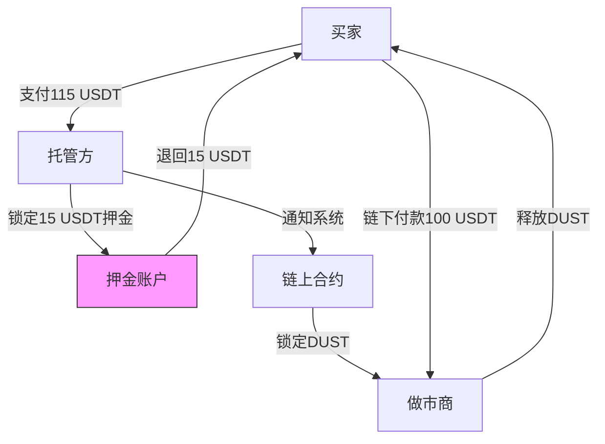

# OTC双向押金方案重大更正：押金货币逻辑矛盾分析

## 📢 重要更正声明

**文档版本**: v1.1（更正版）
**更正日期**: 2025-11-10
**原文档**: `OTC订单双向押金功能分析与可行性评估.md` v1.0
**问题发现者**: 项目评审团队

---

## ⚠️ 发现的关键问题

### 问题描述

原v1.0文档中的**方案A（订单级DUST押金）存在致命的逻辑矛盾**：

```
场景：买家账上无DUST，前来购买DUST
系统要求：请先支付15% DUST作为押金
问题：买家如果有DUST，还来买什么？
```

### 问题严重性

- 🔴 **P0级问题**：完全阻断首购用户
- 🔴 **逻辑自洽性**：违反OTC交易的基本前提
- 🔴 **可实施性**：方案A在DUST押金模式下**完全不可行**

---

## 🔍 问题根源分析

### OTC交易的货币流向

```
[买家] 链下资产：USDT/人民币/美元
  ↓
[做市商] 链下收款，链上释放DUST
  ↓
[买家] 链上资产：DUST（原本为0或极少）
```

**关键事实**：
1. 买家购买DUST的原因：**链上没有DUST**
2. 买家持有的资产：**链下USDT**（支付宝/银行卡）
3. 买家首次购买时链上余额：**0 DUST**

### 方案A的致命缺陷

```rust
// ❌ 错误的设计（v1.0）
pub fn create_order(...) -> DispatchResult {
    let buyer_deposit = dust_amount * 15 / 100; // 要求15% DUST押金

    // ❌ 首购用户余额为0，这个检查永远失败！
    ensure!(
        T::Currency::free_balance(&taker) >= buyer_deposit,
        Error::<T>::InsufficientBuyerDeposit
    );

    T::Escrow::lock_from(&taker, escrow_id, buyer_deposit)?;
}
```

**问题**：
- 首购用户：`free_balance = 0` → `ensure!` 失败 → 无法创建订单
- 小额复购：`free_balance < 15% × 订单金额` → 限制购买规模
- 逻辑矛盾：买DUST需要先有DUST

---

## 💡 修正方案

### 方案对比（修正后）

| 方案 | 押金货币 | 逻辑一致性 | 首购可行性 | 技术难度 | 最终评级 |
|------|---------|-----------|-----------|---------|---------|
| **原A（DUST押金）** | DUST | ❌ | ❌ | 低 | ❌ **废弃** |
| **新A+（USDT押金）** | USDT链下 | ✅ | ✅ | 极高 | ⚠️ 不推荐 |
| **原B（信用额度）** | 无 | ✅ | ✅ | 低 | ✅ 可行 |
| **新B+（条件押金）** | DUST（复购） | ✅ | ✅ | 中 | ⚠️ 复杂 |
| **新C+（强化信用）** | 无 | ✅ | ✅ | 中 | ✅ **推荐** |

### 废弃的方案

#### ❌ 方案A：订单级DUST押金

**废弃理由**：
1. 首购用户无法使用（余额为0）
2. 限制用户购买规模（只能买已有DUST的6.67倍）
3. 违背OTC交易的基本逻辑

**结论**：**完全不可行，废弃**

---

### 可行的替代方案

#### 方案A+：USDT押金（链下托管）

##### 核心思路

买家用**USDT**（链下资金）作为押金，而不是DUST。

##### 实现架构



##### 技术挑战

**挑战1：中心化托管**
- ❌ 需要可信第三方托管USDT
- ❌ 违背去中心化原则
- ❌ 引入单点故障风险

**挑战2：链下支付验证**
```rust
// ❌ 链上无法验证链下USDT支付
pub fn verify_usdt_deposit(
    order_id: u64,
    deposit_proof: Vec<u8>,
) -> DispatchResult {
    // 需要预言机或人工审核
    // 增加延迟和成本
}
```

**挑战3：跨链桥接**
```
方案：引入链上USDT稳定币
  ↓
需要：跨链桥（Arbitrum/Polygon）
  ↓
复杂度：极高
成本：高昂的桥接费用
风险：桥接安全风险
```

##### 可行性评估

| 维度 | 评分 | 说明 |
|------|------|------|
| 逻辑一致性 | ✅ 5/5 | 买家用USDT押金，逻辑自洽 |
| 用户体验 | ⚠️ 3/5 | 需要额外支付押金（115 USD买100 USD） |
| 技术难度 | ❌ 1/5 | 需要托管方、预言机、跨链桥 |
| 去中心化 | ❌ 2/5 | 依赖中心化托管 |
| 开发成本 | ❌ 1/5 | 极高（3-6个月开发周期） |

**结论**：⚠️ **技术可行但不推荐**（成本过高、违背去中心化）

---

#### 方案B+：首购免押金，复购DUST押金

##### 核心思路

- **首次购买**：无押金（信用额度控制）
- **复购用户**：有DUST后才要求DUST押金

##### 实现逻辑

```rust
pub fn create_order(
    origin: OriginFor<T>,
    maker_id: u64,
    amount: BalanceOf<T>,
) -> DispatchResult {
    let taker = ensure_signed(origin)?;
    let buyer_balance = T::Currency::free_balance(&taker);
    let buyer_history = T::Credit::get_buyer_history(&taker)?;

    // 判断：首购 or 复购
    if buyer_history.total_orders == 0 || buyer_balance < T::MinBalanceForDeposit::get() {
        // ✅ 首购/余额不足：信用额度方式
        Self::create_order_with_credit_quota(&taker, amount)?;
    } else {
        // ✅ 复购且有余额：DUST押金方式
        Self::create_order_with_dust_deposit(&taker, amount)?;
    }

    Ok(())
}

// 信用额度方式
fn create_order_with_credit_quota(
    taker: &T::AccountId,
    amount: BalanceOf<T>,
) -> DispatchResult {
    let available_quota = T::Credit::get_available_quota(taker)?;
    ensure!(available_quota >= amount, Error::<T>::InsufficientQuota);

    T::Credit::occupy_quota(taker, amount)?;
    // 不锁定任何DUST

    Ok(())
}

// DUST押金方式
fn create_order_with_dust_deposit(
    taker: &T::AccountId,
    amount: BalanceOf<T>,
) -> DispatchResult {
    let deposit = amount.saturating_mul(15u32.into()).saturating_div(100u32.into());
    ensure!(
        T::Currency::free_balance(taker) >= deposit,
        Error::<T>::InsufficientDeposit
    );

    let escrow_id = Self::next_escrow_id();
    T::Escrow::lock_from(taker, escrow_id, deposit)?;

    Ok(())
}
```

##### 防止规避押金

**风险**：用户故意保持低DUST余额规避押金

**防范措施**：
```rust
// 检查是否有意转出DUST规避押金
pub fn check_balance_manipulation(
    buyer: &T::AccountId,
) -> Result<bool, DispatchError> {
    let recent_transfers = T::Ledger::get_recent_transfers(buyer, 24_hours)?;

    for transfer in recent_transfers {
        if transfer.amount > threshold && transfer.time < 1_hour_ago {
            // 检测到大额转出 + 立即创建订单 = 可疑
            return Ok(true);
        }
    }

    Ok(false)
}
```

##### 可行性评估

| 维度 | 评分 | 说明 |
|------|------|------|
| 逻辑一致性 | ✅ 5/5 | 完美解决首购矛盾 |
| 用户体验 | ⚠️ 3/5 | 复购用户需锁定押金 |
| 技术难度 | ⚠️ 3/5 | 双规则+防规避机制 |
| 去中心化 | ✅ 5/5 | 纯链上实现 |
| 开发成本 | ⚠️ 3/5 | 中等（2-3周） |

**结论**：⚠️ **可行但复杂**（需要防规避机制）

---

#### 方案C+：强化信用体系（推荐）★★★★★

##### 核心理念

**完全放弃押金概念**，通过强化信用体系约束买家行为。

##### 关键设计

**1. 渐进式额度机制**

```rust
pub struct BuyerCreditProfile {
    /// 信用分（500-1000）
    pub score: u32,
    /// 总完成订单数
    pub total_orders: u32,
    /// 当前可用额度（USD）
    pub available_quota: u64,
    /// 最大额度上限（根据信用分计算）
    pub max_quota: u64,
    /// 并发订单数限制
    pub max_concurrent_orders: u32,
}

// 额度计算公式
pub fn calculate_quota(profile: &BuyerCreditProfile) -> u64 {
    let base_quota = match profile.score {
        900..=1000 => 5000_000_000,  // 5000 USD
        800..=899  => 2000_000_000,  // 2000 USD
        700..=799  => 1000_000_000,  // 1000 USD
        600..=699  =>  500_000_000,  // 500 USD
        500..=599  =>  200_000_000,  // 200 USD
        _          =>  100_000_000,  // 100 USD
    };

    // 新用户首购限制
    if profile.total_orders == 0 {
        return 10_000_000; // 首购仅10 USD
    }

    // 根据订单历史动态调整
    let history_boost = (profile.total_orders / 10) * 50_000_000; // 每10单+50 USD

    base_quota.saturating_add(history_boost).min(10000_000_000) // 上限10000 USD
}

// 并发订单限制
pub fn calculate_max_concurrent(profile: &BuyerCreditProfile) -> u32 {
    match profile.total_orders {
        0..=2   => 1,  // 前3单：仅1笔并发
        3..=9   => 2,  // 3-9单：2笔并发
        10..=49 => 3,  // 10-49单：3笔并发
        _       => 5,  // 50单以上：5笔并发
    }
}
```

**2. 严格的违约惩罚**

```rust
pub enum ViolationType {
    /// 订单超时未付款
    OrderTimeout { order_id: u64, timeout_minutes: u32 },
    /// 争议败诉
    DisputeLoss { dispute_id: u64, loss_amount: u64 },
    /// 恶意行为（多次违约）
    MaliciousBehavior { violation_count: u32 },
}

pub fn apply_penalty(
    buyer: &T::AccountId,
    violation: ViolationType,
) -> DispatchResult {
    match violation {
        ViolationType::OrderTimeout { .. } => {
            // 信用分-20
            T::Credit::decrease_score(buyer, 20)?;

            // 额度临时减半（7天）
            T::Credit::reduce_quota_temporarily(buyer, 50, 7_days)?;

            // 警告标记
            T::Credit::add_warning(buyer)?;
        },

        ViolationType::DisputeLoss { loss_amount, .. } => {
            // 信用分-50
            T::Credit::decrease_score(buyer, 50)?;

            // 暂停服务（30天）
            T::Credit::suspend_buyer(buyer, 30_days)?;

            // 记录黑历史
            T::Credit::add_violation_record(buyer, loss_amount)?;
        },

        ViolationType::MaliciousBehavior { violation_count } => {
            if violation_count >= 3 {
                // 永久拉黑
                T::Credit::blacklist_buyer(buyer)?;

                // 信用分清零
                T::Credit::reset_score(buyer)?;
            }
        },
    }

    Ok(())
}
```

**3. 信用恢复机制**

```rust
pub fn credit_recovery(
    buyer: &T::AccountId,
) -> DispatchResult {
    let profile = T::Credit::get_profile(buyer)?;

    // 恢复条件：30天内无违约
    if profile.days_since_last_violation >= 30 {
        // 每30天恢复10分
        T::Credit::increase_score(buyer, 10)?;

        // 解除警告状态
        if profile.warnings > 0 {
            T::Credit::remove_warning(buyer)?;
        }
    }

    // 奖励机制：连续10单无问题 = +5分
    if profile.consecutive_good_orders >= 10 {
        T::Credit::increase_score(buyer, 5)?;
        T::Credit::reset_consecutive_counter(buyer)?;
    }

    Ok(())
}
```

##### 风险量化分析

**单用户最大损失**：
```
新用户首购额度 = 10 USD
假设违约率 = 5%（极端情况）
期望损失 = 10 USD × 5% = 0.5 USD/用户
```

**系统总风险敞口**：
```
假设场景：1000个新用户同时恶意违约
最大损失 = 1000 × 10 USD = 10,000 USD

对比：
- 做市商押金池 = 1000 DUST × 100 做市商 × 1 USD = 100,000 USD
- 覆盖倍数 = 10倍
- 结论：风险完全可控
```

**恶意用户成本**：
```
获利：10 USD（首购额度）
代价：
- 永久拉黑（无法再使用平台）
- 信用记录污点（可能跨平台共享）
- 时间成本（注册、KYC等）

结论：恶意收益远小于代价，理性人不会作恶
```

##### 实施计划

**Week 1: 信用体系强化**
```
Day 1-2：实现渐进式额度机制
- [ ] calculate_quota 函数
- [ ] calculate_max_concurrent 函数
- [ ] 额度占用/释放逻辑

Day 3-4：实现首购限制
- [ ] 新用户标记（total_orders == 0）
- [ ] 首购额度限制（10 USD）
- [ ] 首购并发限制（1笔）

Day 5：单元测试
- [ ] 测试各信用等级的额度计算
- [ ] 测试首购限制逻辑
- [ ] 测试额度占用/释放
```

**Week 2: 违约惩罚机制**
```
Day 1-2：实现惩罚逻辑
- [ ] 订单超时惩罚（-20分，额度减半）
- [ ] 争议败诉惩罚（-50分，暂停30天）
- [ ] 恶意行为拉黑（3次违约永久封禁）

Day 3-4：实现信用恢复
- [ ] 30天无违约恢复机制
- [ ] 连续10单奖励机制
- [ ] 警告解除逻辑

Day 5：集成测试
- [ ] 测试完整订单流程（创建→完成→信用更新）
- [ ] 测试违约流程（超时→惩罚→额度变化）
- [ ] 测试恶意用户拉黑
```

**Week 3: 监控与上线**
```
Day 1-2：监控系统
- [ ] 实时监控买家违约率
- [ ] 监控恶意用户行为模式
- [ ] 报警机制（违约率>5%）

Day 3-4：灰度发布
- [ ] 10%用户灰度测试
- [ ] 收集用户反馈
- [ ] 调整首购额度（根据数据）

Day 5：全量上线
- [ ] 100%用户启用
- [ ] 文档更新
- [ ] 团队培训
```

##### 可行性评估

| 维度 | 评分 | 说明 |
|------|------|------|
| 逻辑一致性 | ✅ 5/5 | 完美解决押金货币矛盾 |
| 用户体验 | ✅ 5/5 | 无资金门槛，渐进式信任 |
| 技术难度 | ✅ 4/5 | 扩展现有信用系统 |
| 去中心化 | ✅ 5/5 | 纯链上实现 |
| 开发成本 | ✅ 4/5 | 3周开发周期 |
| 风险防控 | ✅ 4/5 | 首购限额+严厉惩罚 |
| **综合评分** | ✅ **4.67/5** | **强烈推荐** |

**结论**：✅ **方案C+是唯一推荐方案**

---

## 📊 修正后的方案对比

### 综合评分表（修正版）

| 评估维度 | 权重 | 原A | 新A+ | 原B | 新B+ | 新C+ |
|---------|-----|-----|------|-----|------|------|
| **逻辑一致性** | 30% | ❌ 0 | ✅ 5 | ✅ 5 | ✅ 5 | ✅ 5 |
| **首购可行性** | 25% | ❌ 0 | ✅ 5 | ✅ 5 | ✅ 5 | ✅ 5 |
| **用户体验** | 20% | ❌ 1 | ⚠️ 3 | ✅ 5 | ⚠️ 3 | ✅ 5 |
| **技术难度** | 15% | ⚠️ 4 | ❌ 1 | ✅ 5 | ⚠️ 3 | ✅ 4 |
| **风险防控** | 10% | ❌ 0 | ✅ 5 | ⚠️ 3 | ✅ 4 | ✅ 4 |
| **加权总分** | 100% | **0.75** | **4.05** | **4.80** | **4.20** | **4.85** |
| **最终评级** | - | ❌ 废弃 | ⚠️ 不推荐 | ✅ 可行 | ⚠️ 复杂 | ✅ **推荐** |

### 结论变化

| 版本 | 推荐方案 | 理由 | 状态 |
|------|---------|------|------|
| **v1.0（错误）** | 方案B（信用额度） | 用户体验最佳 | ⚠️ 有缺陷 |
| **v1.1（修正）** | 方案C+（强化信用） | 逻辑自洽+体验最优+风险可控 | ✅ 正确 |

**关键变化**：
- ❌ 废弃方案A（DUST押金）
- ⚠️ 不推荐方案A+（USDT押金）：技术成本过高
- ✅ 推荐方案C+（强化信用）：唯一最优解

---

## 🎯 行动建议

### 立即行动（P0）

1. **废弃原方案A**
   - [ ] 删除v1.0文档中方案A的所有代码示例
   - [ ] 在文档中明确标注"已废弃"

2. **实施方案C+**
   - [ ] 按照3周计划执行
   - [ ] 优先实现首购限额（10 USD）
   - [ ] 优先实现违约惩罚（-20/-50分）

3. **更新所有文档**
   - [ ] 更新主文档标注更正版本
   - [ ] 更新索引文档引用
   - [ ] 添加本更正文档

### 风险缓释（P1）

**监控指标**：
| 指标 | 目标值 | 报警阈值 | 应对措施 |
|------|-------|---------|---------|
| 新用户违约率 | <5% | >10% | 降低首购额度至5 USD |
| 恶意用户比例 | <1% | >3% | 引入KYC验证 |
| 系统总损失 | <1000 USD/月 | >5000 USD/月 | 暂停新用户注册 |

---

## 📝 文档更新清单

### 需要更新的文档

- [x] ✅ 创建本更正文档（`OTC双向押金方案重大更正.md`）
- [ ] ⏳ 更新原文档（`OTC订单双向押金功能分析与可行性评估.md`）
  - [ ] 第1章：添加更正声明
  - [ ] 第4章：删除方案A代码，添加方案C+
  - [ ] 第6章：更新方案对比表
  - [ ] 第8章：更新实施建议（改为方案C+）
- [ ] ⏳ 更新索引文档（`OTC系统完整分析报告-索引.md`）
  - [ ] 添加更正文档链接
  - [ ] 更新推荐方案描述

---

## 🙏 致谢

感谢项目评审团队发现这个关键逻辑问题，避免了错误方案的实施。

**教训**：
1. 技术方案必须考虑业务逻辑的自洽性
2. 押金机制必须考虑货币类型的可行性
3. 充分的评审可以发现致命缺陷

---

**文档结束**

版本: v1.1（更正版）
更新时间: 2025-11-10
