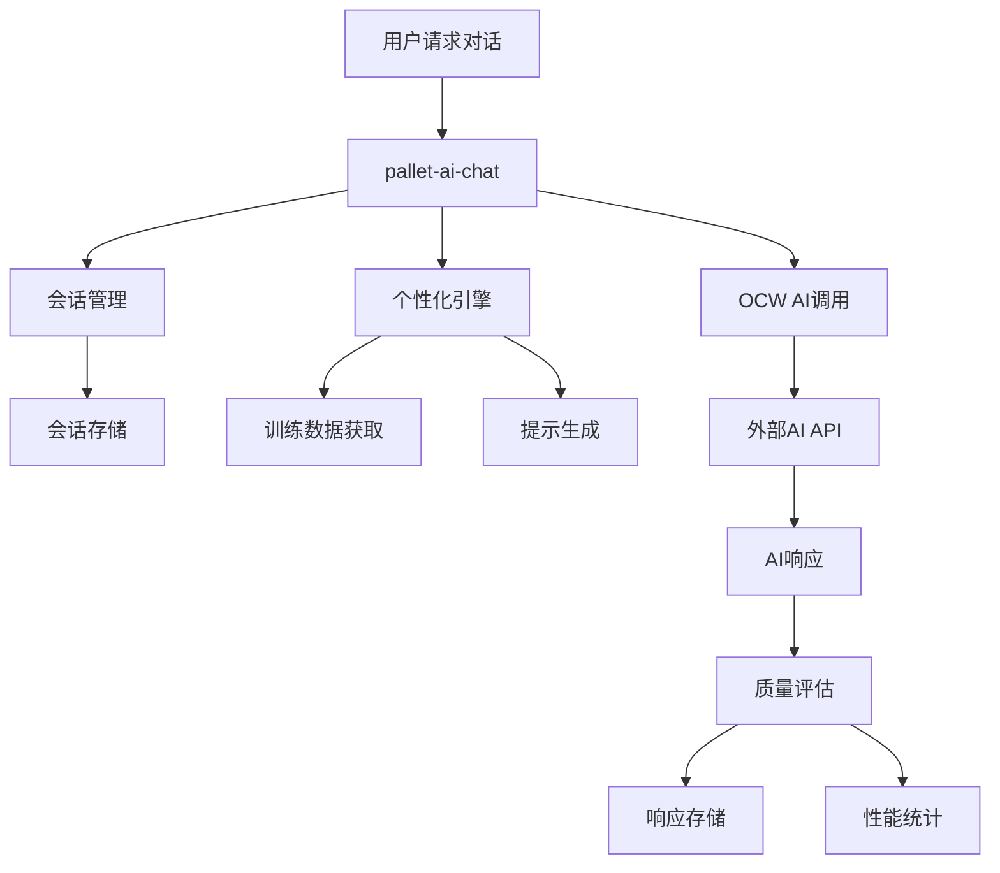

# Phase 3: AI集成层实施方案

## 概述

Phase 3是AI训练准备完成后的核心实现阶段，目标是建立完整的AI对话服务，实现逝者数字智能体与用户的实时交互。

## 架构设计

### 三层架构回顾

1. **数据存储层** (Phase 1完成)：`pallet-deceased` - 作品记录、元数据管理
2. **AI准备层** (Phase 2完成)：`pallet-deceased-ai` - 服务管理、数据导出、训练任务
3. **AI集成层** (Phase 3)：`pallet-ai-chat` - 对话服务、质量评估、个性化交互

### Phase 3核心组件



## 功能模块详述

### 1. 链下工作机(OCW)集成

#### 1.1 外部AI API对接

**支持的AI服务商**：
- OpenAI GPT-4/GPT-3.5
- Anthropic Claude
- 阿里云通义千问
- 百度文心一言
- 自部署开源模型（如LLaMA、ChatGLM）

**OCW功能**：
```rust
// 伪代码示例
impl OffchainWorker for Pallet<T> {
    fn offchain_worker(block_number: T::BlockNumber) {
        // 1. 从存储中获取待处理的对话请求
        // 2. 调用AI API获取响应
        // 3. 提交响应到链上存储
        // 4. 更新质量评估数据
    }
}
```

#### 1.2 API管理
- **密钥管理**：安全存储API密钥
- **负载均衡**：多服务商切换
- **重试机制**：网络故障处理
- **费用追踪**：API调用成本统计

### 2. 对话管理系统

#### 2.1 会话生命周期
```rust
pub enum ConversationStatus {
    Active,      // 活跃中
    Paused,      // 暂停
    Archived,    // 已归档
    Expired,     // 已过期
}

pub struct Conversation {
    session_id: u64,
    deceased_id: DeceasedId,
    user_id: AccountId,
    status: ConversationStatus,
    created_at: BlockNumber,
    last_active: BlockNumber,
    message_count: u32,
    quality_score: Option<u8>, // 0-100
}
```

#### 2.2 消息管理
```rust
pub struct ChatMessage {
    message_id: u64,
    session_id: u64,
    role: MessageRole,        // User/Assistant
    content: BoundedVec<u8, ConstU32<4000>>,
    timestamp: u64,
    quality_rating: Option<u8>,
    response_time: Option<u32>, // 毫秒
}

pub enum MessageRole {
    User = 0,
    Assistant = 1,
    System = 2,  // 系统提示
}
```

### 3. 个性化训练流程

#### 3.1 训练数据整合
- **作品分析**：从pallet-deceased获取作品内容
- **风格提取**：分析文本风格、词汇偏好、表达习惯
- **情感建模**：构建情感倾向模型
- **知识图谱**：建立个人知识和经历图谱

#### 3.2 提示工程
```rust
pub struct PersonalityPrompt {
    deceased_id: DeceasedId,
    base_prompt: BoundedVec<u8, ConstU32<2000>>,
    style_modifiers: Vec<StyleTag>,
    knowledge_context: Vec<KnowledgePoint>,
    conversation_history: Vec<HistoryContext>,
}

pub struct StyleTag {
    tag_type: StyleType,
    weight: u8,      // 0-100权重
    description: BoundedVec<u8, ConstU32<200>>,
}

pub enum StyleType {
    Formal,          // 正式
    Casual,          // 随意
    Humorous,        // 幽默
    Philosophical,   // 哲学性
    Technical,       // 技术性
    Emotional,       // 情感丰富
}
```

#### 3.3 动态学习
- **对话反馈**：根据用户评分优化响应
- **上下文记忆**：维持长期对话记忆
- **习惯适应**：学习用户偏好的对话风格

### 4. 质量评估体系

#### 4.1 多维度评估
```rust
pub struct QualityMetrics {
    relevance_score: u8,        // 相关性 0-100
    personality_match: u8,      // 人格匹配度 0-100
    emotional_authenticity: u8, // 情感真实性 0-100
    factual_accuracy: u8,       // 事实准确性 0-100
    response_quality: u8,       // 响应质量 0-100
    user_satisfaction: Option<u8>, // 用户满意度 0-100
}
```

#### 4.2 自动评估算法
- **语义相似度**：与训练数据的相似性分析
- **情感一致性**：情感表达的连贯性
- **话题连贯性**：对话主题的逻辑性
- **响应时间**：API调用效率监控

#### 4.3 用户反馈机制
- **即时评分**：消息级别的点赞/点踩
- **会话评价**：整体对话满意度评分
- **改进建议**：用户可提供改进意见
- **举报机制**：不当内容举报

## 实现计划

### 第1-2周：基础架构搭建
- [ ] 创建 `pallet-ai-chat` 基础结构
- [ ] 实现数据类型定义（对话、消息、质量评估）
- [ ] 设计存储结构和索引
- [ ] 配置基础的OCW框架

### 第3-4周：OCW AI API集成
- [ ] 实现HTTP客户端for OCW
- [ ] 对接OpenAI API（优先）
- [ ] 实现API密钥管理
- [ ] 添加错误处理和重试机制

### 第5-6周：对话管理核心功能
- [ ] 实现会话创建和管理
- [ ] 实现消息发送和存储
- [ ] 建立用户权限验证
- [ ] 实现对话历史查询

### 第7-8周：个性化引擎
- [ ] 实现训练数据获取接口
- [ ] 开发提示生成算法
- [ ] 建立风格标签系统
- [ ] 实现个性化参数调优

### 第9-12周：质量评估系统
- [ ] 实现多维度质量评估
- [ ] 开发自动评估算法
- [ ] 建立用户反馈机制
- [ ] 实现性能监控Dashboard

### 第13-16周：高级功能
- [ ] 实现多轮对话上下文管理
- [ ] 添加情感分析和响应
- [ ] 开发学习优化算法
- [ ] 建立A/B测试框架

### 第17-20周：测试和优化
- [ ] 全功能集成测试
- [ ] 性能基准测试
- [ ] 安全性审计
- [ ] 用户体验优化

### 第21-24周：部署和运维
- [ ] 生产环境部署
- [ ] 监控告警系统
- [ ] 数据备份策略
- [ ] 文档和培训

## 技术栈

### 链上组件
- **Substrate Framework**: 区块链运行时
- **Off-chain Workers**: 链下计算和API调用
- **SCALE Codec**: 数据编解码
- **sp-runtime**: Substrate运行时原语

### 链下组件
- **HTTP客户端**: 调用外部AI API
- **JSON处理**: API数据序列化/反序列化
- **加密存储**: API密钥安全管理
- **并发处理**: 多请求并行处理

### AI服务集成
- **OpenAI API**: GPT模型调用
- **Anthropic API**: Claude模型调用
- **自定义模型**: 本地部署模型支持
- **提示工程**: 个性化提示生成

## 安全考虑

### 1. 数据隐私
- **端到端加密**：敏感对话内容加密存储
- **权限控制**：严格的用户访问控制
- **数据最小化**：只存储必要的对话数据
- **隐私合规**：符合GDPR等隐私法规

### 2. API安全
- **密钥轮换**：定期更换API密钥
- **请求限制**：防止API滥用
- **内容过滤**：过滤不当请求内容
- **审计日志**：完整的操作审计

### 3. 智能合约安全
- **输入验证**：严格的参数验证
- **权限检查**：细粒度权限控制
- **状态一致性**：防止竞态条件
- **升级安全**：安全的合约升级机制

## 性能指标

### 响应性能
- **平均响应时间** < 3秒
- **P99响应时间** < 8秒
- **API成功率** > 99%
- **并发处理能力** > 1000 req/s

### 质量指标
- **用户满意度** > 80%
- **对话相关性** > 85%
- **人格匹配度** > 75%
- **系统可用性** > 99.9%

## 风险评估

### 技术风险
- **AI API稳定性**：依赖外部服务
- **OCW复杂性**：链下计算的复杂性
- **数据一致性**：链上链下数据同步
- **性能瓶颈**：大规模并发处理

### 业务风险
- **内容合规**：AI生成内容的合规性
- **用户体验**：对话质量的不确定性
- **成本控制**：AI API调用成本
- **竞争压力**：技术迭代速度

### 缓解措施
- **多服务商备份**：降低单点依赖
- **渐进式发布**：分阶段功能发布
- **质量监控**：实时质量监控和告警
- **成本管控**：使用配额和限制机制

## 成功标准

### 功能完整性
- ✅ 支持基础AI对话功能
- ✅ 实现个性化训练流程
- ✅ 建立完整质量评估体系
- ✅ 提供用户友好的交互接口

### 技术指标
- ✅ 系统稳定性 > 99.9%
- ✅ 响应时间 < 3秒平均
- ✅ 支持 > 1000并发用户
- ✅ API成功率 > 99%

### 业务指标
- ✅ 用户满意度 > 80%
- ✅ 日活跃用户 > 1000
- ✅ 对话质量评分 > 4.0/5.0
- ✅ 用户留存率 > 70%

---

**创建日期**: 2025-11-13
**版本**: v1.0
**负责人**: Claude Code
**状态**: 架构设计阶段