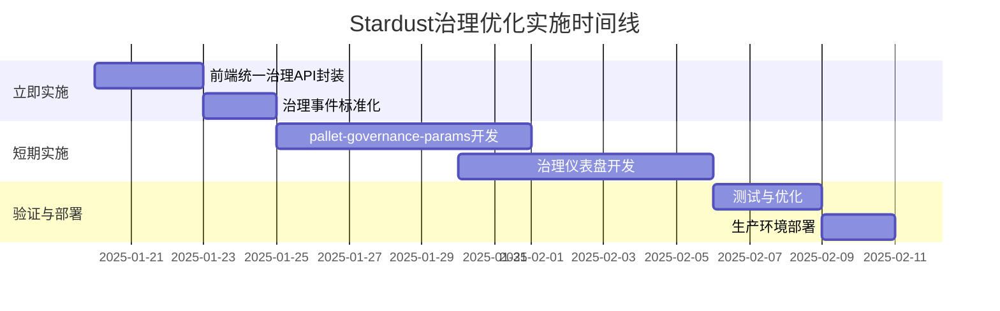

# Stardust 治理优化实施方案（推荐版）

> **核心原则**：在保持模块低耦合的前提下，通过前端统一封装和参数集中管理优化治理体验，避免后端过度整合带来的架构复杂性。

## 📋 目录

1. [方案概述](#1-方案概述)
2. [立即实施阶段（0-1周）](#2-立即实施阶段0-1周)
3. [短期实施阶段（2-4周）](#3-短期实施阶段2-4周)
4. [实施效果评估](#4-实施效果评估)
5. [附录：不推荐方案分析](#5-附录不推荐方案分析)

---

## 1. 方案概述

### 1.1 决策背景

经过对[Stardust治理核心化设计](./Stardust治理核心化设计.md)的深度分析，我们**不推荐**实施"统一治理协调模块"（`pallet-unified-governance`），原因如下：

| 维度 | 统一协调模块方案 | 推荐方案 |
|------|----------------|----------|
| **架构耦合度** | ❌ 高（需协调7+模块） | ✅ 低（前端适配层） |
| **Substrate兼容性** | ⚠️ 违反模块独立性原则 | ✅ 符合FRAME最佳实践 |
| **向后兼容性** | ❌ 难以维护 | ✅ 零破坏性变更 |
| **开发成本** | 🔴 3-4周 + 持续维护 | 🟢 1-2周一次性投入 |
| **风险等级** | 🔴 高（影响核心架构） | 🟢 低（仅前端改动） |

### 1.2 推荐方案核心思想

```
┌─────────────────────────────────────────────────────────┐
│              推荐治理优化方案架构                        │
└─────────────────────────────────────────────────────────┘

  前端层：统一治理API封装
  ↓
  ┌──────────────────────────────────────────┐
  │  governanceService.ts                    │
  │  - 提供统一的治理操作接口                │
  │  - 自动路由到对应后端模块                │
  │  - 标准化错误处理和状态管理              │
  └──────────────────────────────────────────┘
              ↓                ↓                ↓
  ┌───────────────┐  ┌──────────────┐  ┌────────────┐
  │ pallet-       │  │ pallet-      │  │ pallet-    │
  │ stardust-     │  │ deceased/    │  │ democracy  │
  │ appeals       │  │ governance   │  │            │
  └───────────────┘  └──────────────┘  └────────────┘
         ↑                  ↑                  ↑
  保持模块独立性，低耦合，符合Substrate最佳实践
```

### 1.3 实施路线图



---

## 2. 立即实施阶段（0-1周）

### 2.1 前端统一治理API封装

#### 2.1.1 目标

创建前端服务层，统一封装所有治理操作接口，隐藏后端模块差异，提供一致的开发体验。

#### 2.1.2 技术设计

**文件位置**：`stardust-dapp/src/services/governanceService.ts`

```typescript
// ==================== 类型定义 ====================

/**
 * 治理域枚举（与pallet-stardust-appeals保持一致）
 */
export enum GovernanceDomain {
  Grave = 1,
  Deceased = 2,
  Text = 3,
  Media = 4,
  Offerings = 5,
  Park = 6,
  Works = 7,
}

/**
 * 治理操作类型枚举
 */
export enum GovernanceAction {
  Delete = 1,
  Update = 2,
  Hide = 3,
  Restore = 4,
}

/**
 * 治理请求类型
 */
export enum GovernanceRequestType {
  /** 内容申诉（通用） */
  ContentAppeal = 'content_appeal',
  /** 拥有者操作投诉（仅deceased相关） */
  OwnerOperationComplaint = 'owner_operation_complaint',
  /** Text内容投诉 */
  TextComplaint = 'text_complaint',
  /** Media内容投诉 */
  MediaComplaint = 'media_complaint',
  /** 生态提案 */
  EcosystemProposal = 'ecosystem_proposal',
  /** 争议仲裁 */
  DisputeArbitration = 'dispute_arbitration',
}

/**
 * 统一治理状态
 */
export enum UnifiedGovernanceStatus {
  Submitted = 'submitted',
  UnderReview = 'under_review',
  Approved = 'approved',
  Rejected = 'rejected',
  InNoticePeriod = 'in_notice_period',
  Executed = 'executed',
  Revoked = 'revoked',
  Expired = 'expired',
}

/**
 * 治理请求参数（联合类型）
 */
export type GovernanceRequestParams =
  | ContentAppealParams
  | OwnerOperationComplaintParams
  | TextComplaintParams
  | MediaComplaintParams
  | EcosystemProposalParams
  | DisputeArbitrationParams;

interface ContentAppealParams {
  type: GovernanceRequestType.ContentAppeal;
  domain: GovernanceDomain;
  targetId: number | string;
  action: GovernanceAction;
  reason: string;
  evidenceCid?: string;
}

interface OwnerOperationComplaintParams {
  type: GovernanceRequestType.OwnerOperationComplaint;
  operationId: number | string;
  reason: string;
  evidenceCid?: string;
}

interface TextComplaintParams {
  type: GovernanceRequestType.TextComplaint;
  textId: number | string;
  reason: string;
  evidenceCid?: string;
}

interface MediaComplaintParams {
  type: GovernanceRequestType.MediaComplaint;
  mediaId?: number | string;
  albumId?: number | string;
  videoCollectionId?: number | string;
  reason: string;
  evidenceCid?: string;
}

interface EcosystemProposalParams {
  type: GovernanceRequestType.EcosystemProposal;
  proposalId: number | string;
}

interface DisputeArbitrationParams {
  type: GovernanceRequestType.DisputeArbitration;
  disputeId: number | string;
}

/**
 * 治理请求响应
 */
export interface GovernanceRequestResponse {
  success: boolean;
  requestId?: number | string;
  txHash?: string;
  error?: string;
}

/**
 * 治理状态查询响应
 */
export interface GovernanceStatusResponse {
  requestType: GovernanceRequestType;
  status: UnifiedGovernanceStatus;
  submitter: string;
  createdAt: number; // 区块号或时间戳
  updatedAt: number;
  metadata?: Record<string, any>;
}

// ==================== 服务实现 ====================

/**
 * 统一治理服务类
 *
 * 职责：
 * 1. 统一封装所有治理操作接口
 * 2. 自动路由到对应的后端模块
 * 3. 标准化错误处理和状态管理
 * 4. 提供一致的开发体验
 */
export class GovernanceService {
  private api: ApiPromise;

  constructor(api: ApiPromise) {
    this.api = api;
  }

  /**
   * 提交治理请求（统一入口）
   *
   * @param params 治理请求参数
   * @param signer 签名账户
   * @returns 治理请求响应
   */
  async submitGovernanceRequest(
    params: GovernanceRequestParams,
    signer: KeyringPair
  ): Promise<GovernanceRequestResponse> {
    try {
      // 根据请求类型路由到对应的处理函数
      switch (params.type) {
        case GovernanceRequestType.ContentAppeal:
          return await this._submitContentAppeal(params, signer);

        case GovernanceRequestType.OwnerOperationComplaint:
          return await this._submitOwnerOperationComplaint(params, signer);

        case GovernanceRequestType.TextComplaint:
          return await this._submitTextComplaint(params, signer);

        case GovernanceRequestType.MediaComplaint:
          return await this._submitMediaComplaint(params, signer);

        case GovernanceRequestType.EcosystemProposal:
          return await this._submitEcosystemProposal(params, signer);

        case GovernanceRequestType.DisputeArbitration:
          return await this._submitDisputeArbitration(params, signer);

        default:
          throw new Error(`未知的治理请求类型: ${params}`);
      }
    } catch (error) {
      console.error('提交治理请求失败:', error);
      return {
        success: false,
        error: error.message || '未知错误',
      };
    }
  }

  /**
   * 查询治理状态（统一入口）
   *
   * @param requestType 请求类型
   * @param requestId 请求ID
   * @returns 治理状态响应
   */
  async getGovernanceStatus(
    requestType: GovernanceRequestType,
    requestId: number | string
  ): Promise<GovernanceStatusResponse | null> {
    try {
      switch (requestType) {
        case GovernanceRequestType.ContentAppeal:
          return await this._getContentAppealStatus(requestId);

        case GovernanceRequestType.OwnerOperationComplaint:
          return await this._getOwnerOperationComplaintStatus(requestId);

        case GovernanceRequestType.TextComplaint:
          return await this._getTextComplaintStatus(requestId);

        case GovernanceRequestType.MediaComplaint:
          return await this._getMediaComplaintStatus(requestId);

        default:
          throw new Error(`未知的治理请求类型: ${requestType}`);
      }
    } catch (error) {
      console.error('查询治理状态失败:', error);
      return null;
    }
  }

  /**
   * 获取用户所有治理请求
   *
   * @param account 用户账户地址
   * @param filterType 可选的类型过滤
   * @returns 治理请求列表
   */
  async getUserGovernanceRequests(
    account: string,
    filterType?: GovernanceRequestType
  ): Promise<GovernanceStatusResponse[]> {
    // 从各个模块聚合用户的治理请求
    const requests: GovernanceStatusResponse[] = [];

    try {
      // 1. 查询 pallet-stardust-appeals 中的申诉
      if (!filterType || filterType === GovernanceRequestType.ContentAppeal) {
        const appeals = await this._getUserAppeals(account);
        requests.push(...appeals);
      }

      // 2. 查询 pallet-deceased 中的投诉
      if (!filterType ||
          filterType === GovernanceRequestType.TextComplaint ||
          filterType === GovernanceRequestType.MediaComplaint) {
        const complaints = await this._getUserDeceasedComplaints(account);
        requests.push(...complaints);
      }

      // 3. 查询其他治理模块（democracy、arbitration等）
      // ... 根据需要扩展

      return requests;
    } catch (error) {
      console.error('获取用户治理请求失败:', error);
      return [];
    }
  }

  // ==================== 私有实现方法 ====================

  /**
   * 提交内容申诉（通用申诉机制）
   * 路由到：pallet-stardust-appeals::submit_appeal
   */
  private async _submitContentAppeal(
    params: ContentAppealParams,
    signer: KeyringPair
  ): Promise<GovernanceRequestResponse> {
    const tx = this.api.tx.stardustAppeals.submitAppeal(
      params.domain,
      params.targetId,
      params.action,
      params.reason,
      params.evidenceCid || null
    );

    return await this._sendTransaction(tx, signer);
  }

  /**
   * 提交拥有者操作投诉
   * 路由到：pallet-deceased::complain_owner_operation
   */
  private async _submitOwnerOperationComplaint(
    params: OwnerOperationComplaintParams,
    signer: KeyringPair
  ): Promise<GovernanceRequestResponse> {
    const tx = this.api.tx.deceased.complainOwnerOperation(
      params.operationId,
      params.reason,
      params.evidenceCid || null
    );

    return await this._sendTransaction(tx, signer);
  }

  /**
   * 提交Text内容投诉
   * 路由到：pallet-deceased::complain_text
   */
  private async _submitTextComplaint(
    params: TextComplaintParams,
    signer: KeyringPair
  ): Promise<GovernanceRequestResponse> {
    const tx = this.api.tx.deceased.complainText(
      params.textId,
      params.reason,
      params.evidenceCid || null
    );

    return await this._sendTransaction(tx, signer);
  }

  /**
   * 提交Media内容投诉
   * 路由到：pallet-deceased::complain_media
   */
  private async _submitMediaComplaint(
    params: MediaComplaintParams,
    signer: KeyringPair
  ): Promise<GovernanceRequestResponse> {
    const tx = this.api.tx.deceased.complainMedia(
      params.mediaId || null,
      params.albumId || null,
      params.videoCollectionId || null,
      params.reason,
      params.evidenceCid || null
    );

    return await this._sendTransaction(tx, signer);
  }

  /**
   * 提交生态提案
   * 路由到：pallet-democracy::propose
   */
  private async _submitEcosystemProposal(
    params: EcosystemProposalParams,
    signer: KeyringPair
  ): Promise<GovernanceRequestResponse> {
    // 实现生态提案提交逻辑
    throw new Error('生态提案功能待实现');
  }

  /**
   * 提交争议仲裁
   * 路由到：pallet-arbitration::submit_dispute
   */
  private async _submitDisputeArbitration(
    params: DisputeArbitrationParams,
    signer: KeyringPair
  ): Promise<GovernanceRequestResponse> {
    // 实现仲裁提交逻辑
    throw new Error('仲裁功能待实现');
  }

  /**
   * 查询内容申诉状态
   */
  private async _getContentAppealStatus(
    appealId: number | string
  ): Promise<GovernanceStatusResponse | null> {
    const appeal = await this.api.query.stardustAppeals.appeals(appealId);
    if (appeal.isNone) return null;

    const data = appeal.unwrap();
    return {
      requestType: GovernanceRequestType.ContentAppeal,
      status: this._mapAppealStatus(data.status.toString()),
      submitter: data.submitter.toString(),
      createdAt: data.createdAt.toNumber(),
      updatedAt: data.updatedAt?.toNumber() || data.createdAt.toNumber(),
      metadata: {
        domain: data.domain.toNumber(),
        targetId: data.targetId.toString(),
        action: data.action.toNumber(),
      },
    };
  }

  /**
   * 查询拥有者操作投诉状态
   */
  private async _getOwnerOperationComplaintStatus(
    operationId: number | string
  ): Promise<GovernanceStatusResponse | null> {
    // 实现查询逻辑
    throw new Error('待实现');
  }

  /**
   * 查询Text投诉状态
   */
  private async _getTextComplaintStatus(
    textId: number | string
  ): Promise<GovernanceStatusResponse | null> {
    const complaint = await this.api.query.deceased.textComplaints(textId);
    if (complaint.isNone) return null;

    const data = complaint.unwrap();
    return {
      requestType: GovernanceRequestType.TextComplaint,
      status: this._mapComplaintStatus(data.status.toString()),
      submitter: data.complainant.toString(),
      createdAt: data.created.toNumber(),
      updatedAt: data.created.toNumber(),
      metadata: {
        textId: textId.toString(),
        deposit: data.deposit.toString(),
      },
    };
  }

  /**
   * 查询Media投诉状态
   */
  private async _getMediaComplaintStatus(
    mediaId: number | string
  ): Promise<GovernanceStatusResponse | null> {
    const complaint = await this.api.query.deceased.mediaComplaints(mediaId);
    if (complaint.isNone) return null;

    const data = complaint.unwrap();
    return {
      requestType: GovernanceRequestType.MediaComplaint,
      status: this._mapComplaintStatus(data.status.toString()),
      submitter: data.complainant.toString(),
      createdAt: data.created.toNumber(),
      updatedAt: data.created.toNumber(),
      metadata: {
        mediaId: mediaId.toString(),
        deposit: data.deposit.toString(),
      },
    };
  }

  /**
   * 获取用户的申诉记录
   */
  private async _getUserAppeals(account: string): Promise<GovernanceStatusResponse[]> {
    // 实现查询逻辑（需要通过链上索引或事件监听）
    return [];
  }

  /**
   * 获取用户的deceased模块投诉记录
   */
  private async _getUserDeceasedComplaints(account: string): Promise<GovernanceStatusResponse[]> {
    // 实现查询逻辑
    return [];
  }

  /**
   * 发送交易通用方法
   */
  private async _sendTransaction(
    tx: SubmittableExtrinsic<'promise'>,
    signer: KeyringPair
  ): Promise<GovernanceRequestResponse> {
    return new Promise((resolve) => {
      tx.signAndSend(signer, ({ status, events }) => {
        if (status.isInBlock || status.isFinalized) {
          const success = events.every(({ event }) =>
            !this.api.events.system.ExtrinsicFailed.is(event)
          );

          resolve({
            success,
            txHash: status.asInBlock.toString() || status.asFinalized.toString(),
            error: success ? undefined : '交易执行失败',
          });
        }
      }).catch((error) => {
        resolve({
          success: false,
          error: error.message,
        });
      });
    });
  }

  /**
   * 映射申诉状态到统一状态
   */
  private _mapAppealStatus(status: string): UnifiedGovernanceStatus {
    const statusMap: Record<string, UnifiedGovernanceStatus> = {
      'Submitted': UnifiedGovernanceStatus.Submitted,
      'Approved': UnifiedGovernanceStatus.Approved,
      'Rejected': UnifiedGovernanceStatus.Rejected,
      'InNoticePeriod': UnifiedGovernanceStatus.InNoticePeriod,
      'Executed': UnifiedGovernanceStatus.Executed,
      'Revoked': UnifiedGovernanceStatus.Revoked,
    };
    return statusMap[status] || UnifiedGovernanceStatus.Submitted;
  }

  /**
   * 映射投诉状态到统一状态
   */
  private _mapComplaintStatus(status: string): UnifiedGovernanceStatus {
    const statusMap: Record<string, UnifiedGovernanceStatus> = {
      'Pending': UnifiedGovernanceStatus.UnderReview,
      'Resolved': UnifiedGovernanceStatus.Executed,
    };
    return statusMap[status] || UnifiedGovernanceStatus.Submitted;
  }
}

// ==================== React Hook封装 ====================

/**
 * React Hook：使用治理服务
 */
export function useGovernance() {
  const { api } = useSubstrateContext();
  const governanceService = useMemo(() => new GovernanceService(api), [api]);

  return {
    submitGovernanceRequest: governanceService.submitGovernanceRequest.bind(governanceService),
    getGovernanceStatus: governanceService.getGovernanceStatus.bind(governanceService),
    getUserGovernanceRequests: governanceService.getUserGovernanceRequests.bind(governanceService),
  };
}
```

#### 2.1.3 使用示例

```typescript
// 示例1：提交内容申诉
const { submitGovernanceRequest } = useGovernance();

const handleSubmitAppeal = async () => {
  const result = await submitGovernanceRequest(
    {
      type: GovernanceRequestType.ContentAppeal,
      domain: GovernanceDomain.Text,
      targetId: 123,
      action: GovernanceAction.Delete,
      reason: '包含不当内容',
      evidenceCid: 'QmXXX...',
    },
    signer
  );

  if (result.success) {
    message.success('申诉提交成功！');
  } else {
    message.error(`申诉提交失败：${result.error}`);
  }
};

// 示例2：查询治理状态
const { getGovernanceStatus } = useGovernance();

const handleCheckStatus = async () => {
  const status = await getGovernanceStatus(
    GovernanceRequestType.ContentAppeal,
    appealId
  );

  if (status) {
    console.log('当前状态：', status.status);
    console.log('提交者：', status.submitter);
  }
};

// 示例3：获取用户所有治理请求
const { getUserGovernanceRequests } = useGovernance();

const handleGetMyRequests = async () => {
  const requests = await getUserGovernanceRequests(currentAccount);
  console.log('我的治理请求：', requests);
};
```

#### 2.1.4 实施检查清单

- [ ] 创建 `governanceService.ts` 文件
- [ ] 实现所有类型定义（Domain、Action、RequestType等）
- [ ] 实现 `GovernanceService` 核心类
- [ ] 实现 `submitGovernanceRequest` 统一提交方法
- [ ] 实现 `getGovernanceStatus` 统一查询方法
- [ ] 实现 `getUserGovernanceRequests` 用户请求聚合方法
- [ ] 实现所有私有路由方法（`_submitContentAppeal`等）
- [ ] 实现状态映射方法（`_mapAppealStatus`等）
- [ ] 创建 React Hook封装（`useGovernance`）
- [ ] 编写单元测试
- [ ] 编写使用文档和示例

---

### 2.2 治理事件标准化

#### 2.2.1 目标

标准化所有治理相关事件的命名和结构，便于前端统一监听和处理，提升事件监听的一致性和可维护性。

#### 2.2.2 事件标准化规范

**命名规范**：
```
[Pallet][ActionObject][ActionType]
```

**示例**：
- `StardustAppeals.AppealSubmitted` ✅
- `StardustAppeals.AppealApproved` ✅
- `Deceased.TextComplaintSubmitted` ✅
- `Deceased.MediaComplaintResolved` ✅

#### 2.2.3 标准事件结构

```typescript
/**
 * 统一治理事件接口
 */
interface StandardGovernanceEvent {
  /** 事件名称 */
  name: string;
  /** 事件所属模块 */
  pallet: string;
  /** 事件数据 */
  data: {
    /** 请求ID（如果适用） */
    requestId?: number | string;
    /** 操作者账户 */
    actor: string;
    /** 区块号 */
    blockNumber: number;
    /** 区块哈希 */
    blockHash: string;
    /** 时间戳（估算） */
    timestamp: number;
    /** 事件特定数据 */
    metadata: Record<string, any>;
  };
}
```

#### 2.2.4 事件监听服务

**文件位置**：`stardust-dapp/src/services/governanceEventService.ts`

```typescript
import { ApiPromise } from '@polkadot/api';
import { EventRecord } from '@polkadot/types/interfaces';

/**
 * 治理事件类型枚举
 */
export enum GovernanceEventType {
  // pallet-stardust-appeals 事件
  AppealSubmitted = 'StardustAppeals.AppealSubmitted',
  AppealApproved = 'StardustAppeals.AppealApproved',
  AppealRejected = 'StardustAppeals.AppealRejected',
  AppealWithdrawn = 'StardustAppeals.AppealWithdrawn',
  AppealExecuted = 'StardustAppeals.AppealExecuted',

  // pallet-deceased 事件
  TextComplaintSubmitted = 'Deceased.TextComplaintSubmitted',
  TextComplaintResolved = 'Deceased.TextComplaintResolved',
  MediaComplaintSubmitted = 'Deceased.MediaComplaintSubmitted',
  MediaComplaintResolved = 'Deceased.MediaComplaintResolved',

  // pallet-democracy 事件
  ProposalSubmitted = 'Democracy.Proposed',
  VoteCast = 'Democracy.Voted',
  ProposalPassed = 'Democracy.Passed',
  ProposalNotPassed = 'Democracy.NotPassed',

  // pallet-arbitration 事件
  DisputeSubmitted = 'Arbitration.DisputeSubmitted',
  DisputeResolved = 'Arbitration.DisputeResolved',
}

/**
 * 事件监听回调类型
 */
type EventCallback = (event: StandardGovernanceEvent) => void;

/**
 * 治理事件监听服务
 */
export class GovernanceEventService {
  private api: ApiPromise;
  private listeners: Map<GovernanceEventType, Set<EventCallback>>;
  private unsubscribe?: () => void;

  constructor(api: ApiPromise) {
    this.api = api;
    this.listeners = new Map();
  }

  /**
   * 订阅治理事件
   *
   * @param eventType 事件类型
   * @param callback 回调函数
   * @returns 取消订阅函数
   */
  subscribe(eventType: GovernanceEventType, callback: EventCallback): () => void {
    if (!this.listeners.has(eventType)) {
      this.listeners.set(eventType, new Set());
    }
    this.listeners.get(eventType)!.add(callback);

    // 如果是第一次订阅，启动全局事件监听
    if (!this.unsubscribe) {
      this._startListening();
    }

    // 返回取消订阅函数
    return () => {
      const callbacks = this.listeners.get(eventType);
      if (callbacks) {
        callbacks.delete(callback);
        if (callbacks.size === 0) {
          this.listeners.delete(eventType);
        }
      }

      // 如果没有任何订阅，停止全局监听
      if (this.listeners.size === 0) {
        this._stopListening();
      }
    };
  }

  /**
   * 订阅多个事件类型
   *
   * @param eventTypes 事件类型数组
   * @param callback 回调函数
   * @returns 取消订阅函数
   */
  subscribeMultiple(eventTypes: GovernanceEventType[], callback: EventCallback): () => void {
    const unsubscribes = eventTypes.map(type => this.subscribe(type, callback));
    return () => unsubscribes.forEach(unsub => unsub());
  }

  /**
   * 订阅所有治理事件
   *
   * @param callback 回调函数
   * @returns 取消订阅函数
   */
  subscribeAll(callback: EventCallback): () => void {
    const allEventTypes = Object.values(GovernanceEventType);
    return this.subscribeMultiple(allEventTypes, callback);
  }

  /**
   * 启动全局事件监听
   */
  private async _startListening(): Promise<void> {
    this.unsubscribe = await this.api.query.system.events((events: EventRecord[]) => {
      events.forEach((record) => {
        const { event } = record;
        const eventName = `${event.section}.${event.method}`;

        // 查找匹配的事件类型
        const matchedType = Object.values(GovernanceEventType).find(
          type => type === eventName
        );

        if (matchedType && this.listeners.has(matchedType)) {
          const standardEvent = this._transformEvent(record);
          const callbacks = this.listeners.get(matchedType)!;
          callbacks.forEach(callback => {
            try {
              callback(standardEvent);
            } catch (error) {
              console.error('事件回调执行失败:', error);
            }
          });
        }
      });
    });
  }

  /**
   * 停止全局事件监听
   */
  private _stopListening(): void {
    if (this.unsubscribe) {
      this.unsubscribe();
      this.unsubscribe = undefined;
    }
  }

  /**
   * 转换链上事件为标准事件格式
   */
  private _transformEvent(record: EventRecord): StandardGovernanceEvent {
    const { event, phase } = record;
    const eventName = `${event.section}.${event.method}`;

    return {
      name: eventName,
      pallet: event.section,
      data: {
        actor: event.data[0]?.toString() || 'unknown',
        blockNumber: phase.isApplyExtrinsic ? phase.asApplyExtrinsic.toNumber() : 0,
        blockHash: '', // 需要从其他地方获取
        timestamp: Date.now(),
        metadata: this._extractEventMetadata(event),
      },
    };
  }

  /**
   * 提取事件元数据
   */
  private _extractEventMetadata(event: any): Record<string, any> {
    const metadata: Record<string, any> = {};

    event.data.forEach((data: any, index: number) => {
      metadata[`arg${index}`] = data.toString();
    });

    return metadata;
  }
}

// ==================== React Hook封装 ====================

/**
 * React Hook：监听治理事件
 */
export function useGovernanceEvents(
  eventTypes: GovernanceEventType | GovernanceEventType[] | 'all',
  callback: EventCallback
) {
  const { api } = useSubstrateContext();
  const eventService = useMemo(() => new GovernanceEventService(api), [api]);

  useEffect(() => {
    let unsubscribe: () => void;

    if (eventTypes === 'all') {
      unsubscribe = eventService.subscribeAll(callback);
    } else if (Array.isArray(eventTypes)) {
      unsubscribe = eventService.subscribeMultiple(eventTypes, callback);
    } else {
      unsubscribe = eventService.subscribe(eventTypes, callback);
    }

    return () => unsubscribe();
  }, [eventTypes, callback, eventService]);
}
```

#### 2.2.5 使用示例

```typescript
// 示例1：监听单个事件类型
useGovernanceEvents(GovernanceEventType.AppealSubmitted, (event) => {
  console.log('申诉已提交:', event);
  message.info(`用户 ${event.data.actor} 提交了申诉`);
});

// 示例2：监听多个事件类型
useGovernanceEvents(
  [
    GovernanceEventType.AppealSubmitted,
    GovernanceEventType.AppealApproved,
    GovernanceEventType.AppealRejected,
  ],
  (event) => {
    console.log('申诉状态变更:', event);
    // 更新UI状态
  }
);

// 示例3：监听所有治理事件
useGovernanceEvents('all', (event) => {
  console.log('治理事件:', event);
  // 记录到日志或分析系统
});
```

#### 2.2.6 实施检查清单

- [ ] 创建 `governanceEventService.ts` 文件
- [ ] 定义 `GovernanceEventType` 枚举
- [ ] 定义 `StandardGovernanceEvent` 接口
- [ ] 实现 `GovernanceEventService` 核心类
- [ ] 实现 `subscribe` 方法
- [ ] 实现 `subscribeMultiple` 方法
- [ ] 实现 `subscribeAll` 方法
- [ ] 实现事件转换方法 `_transformEvent`
- [ ] 创建 React Hook封装 `useGovernanceEvents`
- [ ] 编写单元测试
- [ ] 编写使用文档和示例

---

## 3. 短期实施阶段（2-4周）

### 3.1 pallet-governance-params模块开发

#### 3.1.1 目标

创建 `pallet-governance-params` 模块，集中管理所有治理相关参数，便于统一调整和审计。

#### 3.1.2 技术设计

**文件位置**：`pallets/governance-params/src/lib.rs`

```rust
// pallets/governance-params/src/lib.rs

#![cfg_attr(not(feature = "std"), no_std)]

pub use pallet::*;

#[frame_support::pallet]
pub mod pallet {
    use frame_support::{
        pallet_prelude::*,
        traits::{Currency, ReservableCurrency},
    };
    use frame_system::pallet_prelude::*;
    use sp_runtime::traits::Zero;

    type BalanceOf<T> = <<T as Config>::Currency as Currency<<T as frame_system::Config>::AccountId>>::Balance;

    /// 押金参数类型
    #[derive(Encode, Decode, Clone, PartialEq, Eq, TypeInfo, MaxEncodedLen, Debug)]
    pub struct DepositParams<Balance> {
        /// 基础押金
        pub base: Balance,
        /// 最小押金
        pub min: Balance,
        /// 最大押金
        pub max: Balance,
        /// 押金计算因子（用于动态计算）
        pub factor: u32,
    }

    /// 期限参数类型（以区块数计）
    #[derive(Encode, Decode, Clone, PartialEq, Eq, TypeInfo, MaxEncodedLen, Debug)]
    pub struct PeriodParams<BlockNumber> {
        /// 公示期（申诉批准后的公示期）
        pub notice_period: BlockNumber,
        /// 投票期（提案投票期）
        pub voting_period: BlockNumber,
        /// 执行延迟（提案执行延迟期）
        pub execution_delay: BlockNumber,
        /// 投诉期（内容可被投诉的期限）
        pub complaint_period: BlockNumber,
    }

    /// 费率参数类型（以千分之为单位）
    #[derive(Encode, Decode, Clone, PartialEq, Eq, TypeInfo, MaxEncodedLen, Debug)]
    pub struct RateParams {
        /// 投诉成功时投诉人分配比例（千分之）
        pub complainant_share: u32,
        /// 投诉成功时委员会分配比例（千分之）
        pub committee_share: u32,
        /// 投诉失败时拥有者分配比例（千分之）
        pub owner_share: u32,
    }

    /// 阈值参数类型
    #[derive(Encode, Decode, Clone, PartialEq, Eq, TypeInfo, MaxEncodedLen, Debug)]
    pub struct ThresholdParams<Balance> {
        /// 提案创建门槛（代币持有量）
        pub proposal_threshold: Balance,
        /// 投票通过门槛（百分比）
        pub voting_threshold: u32,
        /// 仲裁费用门槛
        pub arbitration_threshold: Balance,
    }

    #[pallet::config]
    pub trait Config: frame_system::Config {
        type RuntimeEvent: From<Event<Self>> + IsType<<Self as frame_system::Config>::RuntimeEvent>;
        type Currency: Currency<Self::AccountId> + ReservableCurrency<Self::AccountId>;

        /// 治理起源（Root或委员会）
        type GovernanceOrigin: EnsureOrigin<Self::RuntimeOrigin>;
    }

    #[pallet::pallet]
    pub struct Pallet<T>(_);

    /// 申诉押金参数
    #[pallet::storage]
    #[pallet::getter(fn appeal_deposit_params)]
    pub type AppealDepositParams<T: Config> =
        StorageValue<_, DepositParams<BalanceOf<T>>, ValueQuery>;

    /// 投诉押金参数
    #[pallet::storage]
    #[pallet::getter(fn complaint_deposit_params)]
    pub type ComplaintDepositParams<T: Config> =
        StorageValue<_, DepositParams<BalanceOf<T>>, ValueQuery>;

    /// 非拥有者操作押金参数
    #[pallet::storage]
    #[pallet::getter(fn non_owner_operation_deposit_params)]
    pub type NonOwnerOperationDepositParams<T: Config> =
        StorageValue<_, DepositParams<BalanceOf<T>>, ValueQuery>;

    /// 期限参数
    #[pallet::storage]
    #[pallet::getter(fn period_params)]
    pub type PeriodParamsStorage<T: Config> =
        StorageValue<_, PeriodParams<BlockNumberFor<T>>, ValueQuery>;

    /// 费率参数
    #[pallet::storage]
    #[pallet::getter(fn rate_params)]
    pub type RateParamsStorage<T: Config> =
        StorageValue<_, RateParams, ValueQuery>;

    /// 阈值参数
    #[pallet::storage]
    #[pallet::getter(fn threshold_params)]
    pub type ThresholdParamsStorage<T: Config> =
        StorageValue<_, ThresholdParams<BalanceOf<T>>, ValueQuery>;

    #[pallet::event]
    #[pallet::generate_deposit(pub(super) fn deposit_event)]
    pub enum Event<T: Config> {
        /// 申诉押金参数已更新
        AppealDepositParamsUpdated {
            old: DepositParams<BalanceOf<T>>,
            new: DepositParams<BalanceOf<T>>,
        },
        /// 投诉押金参数已更新
        ComplaintDepositParamsUpdated {
            old: DepositParams<BalanceOf<T>>,
            new: DepositParams<BalanceOf<T>>,
        },
        /// 非拥有者操作押金参数已更新
        NonOwnerOperationDepositParamsUpdated {
            old: DepositParams<BalanceOf<T>>,
            new: DepositParams<BalanceOf<T>>,
        },
        /// 期限参数已更新
        PeriodParamsUpdated {
            old: PeriodParams<BlockNumberFor<T>>,
            new: PeriodParams<BlockNumberFor<T>>,
        },
        /// 费率参数已更新
        RateParamsUpdated {
            old: RateParams,
            new: RateParams,
        },
        /// 阈值参数已更新
        ThresholdParamsUpdated {
            old: ThresholdParams<BalanceOf<T>>,
            new: ThresholdParams<BalanceOf<T>>,
        },
    }

    #[pallet::error]
    pub enum Error<T> {
        /// 无效的参数值
        InvalidParams,
        /// 无权限操作
        NoPermission,
    }

    #[pallet::genesis_config]
    pub struct GenesisConfig<T: Config> {
        pub appeal_deposit: DepositParams<BalanceOf<T>>,
        pub complaint_deposit: DepositParams<BalanceOf<T>>,
        pub non_owner_operation_deposit: DepositParams<BalanceOf<T>>,
        pub periods: PeriodParams<BlockNumberFor<T>>,
        pub rates: RateParams,
        pub thresholds: ThresholdParams<BalanceOf<T>>,
    }

    impl<T: Config> Default for GenesisConfig<T> {
        fn default() -> Self {
            Self {
                appeal_deposit: DepositParams {
                    base: 20u32.into(),
                    min: 10u32.into(),
                    max: 100u32.into(),
                    factor: 100,
                },
                complaint_deposit: DepositParams {
                    base: 5u32.into(),
                    min: 5u32.into(),
                    max: 50u32.into(),
                    factor: 100,
                },
                non_owner_operation_deposit: DepositParams {
                    base: 2u32.into(),
                    min: 2u32.into(),
                    max: 10u32.into(),
                    factor: 100,
                },
                periods: PeriodParams {
                    notice_period: 7u32.into(),
                    voting_period: 6u32.into(),
                    execution_delay: 2u32.into(),
                    complaint_period: 30u32.into(),
                },
                rates: RateParams {
                    complainant_share: 800, // 80%
                    committee_share: 200,   // 20%
                    owner_share: 800,       // 80%
                },
                thresholds: ThresholdParams {
                    proposal_threshold: 100u32.into(),
                    voting_threshold: 51, // 51%
                    arbitration_threshold: 50u32.into(),
                },
            }
        }
    }

    #[pallet::genesis_build]
    impl<T: Config> BuildGenesisConfig for GenesisConfig<T> {
        fn build(&self) {
            AppealDepositParams::<T>::put(&self.appeal_deposit);
            ComplaintDepositParams::<T>::put(&self.complaint_deposit);
            NonOwnerOperationDepositParams::<T>::put(&self.non_owner_operation_deposit);
            PeriodParamsStorage::<T>::put(&self.periods);
            RateParamsStorage::<T>::put(&self.rates);
            ThresholdParamsStorage::<T>::put(&self.thresholds);
        }
    }

    #[pallet::call]
    impl<T: Config> Pallet<T> {
        /// 更新申诉押金参数
        ///
        /// 函数级详细中文注释：
        /// - 仅治理起源可调用
        /// - 更新申诉相关的押金参数
        /// - 发出事件记录参数变更
        #[pallet::call_index(0)]
        #[pallet::weight(10_000)]
        pub fn update_appeal_deposit_params(
            origin: OriginFor<T>,
            new_params: DepositParams<BalanceOf<T>>,
        ) -> DispatchResult {
            T::GovernanceOrigin::ensure_origin(origin)?;

            ensure!(
                new_params.min <= new_params.base && new_params.base <= new_params.max,
                Error::<T>::InvalidParams
            );

            let old_params = AppealDepositParams::<T>::get();
            AppealDepositParams::<T>::put(&new_params);

            Self::deposit_event(Event::AppealDepositParamsUpdated {
                old: old_params,
                new: new_params,
            });

            Ok(())
        }

        /// 更新投诉押金参数
        #[pallet::call_index(1)]
        #[pallet::weight(10_000)]
        pub fn update_complaint_deposit_params(
            origin: OriginFor<T>,
            new_params: DepositParams<BalanceOf<T>>,
        ) -> DispatchResult {
            T::GovernanceOrigin::ensure_origin(origin)?;

            ensure!(
                new_params.min <= new_params.base && new_params.base <= new_params.max,
                Error::<T>::InvalidParams
            );

            let old_params = ComplaintDepositParams::<T>::get();
            ComplaintDepositParams::<T>::put(&new_params);

            Self::deposit_event(Event::ComplaintDepositParamsUpdated {
                old: old_params,
                new: new_params,
            });

            Ok(())
        }

        /// 更新非拥有者操作押金参数
        #[pallet::call_index(2)]
        #[pallet::weight(10_000)]
        pub fn update_non_owner_operation_deposit_params(
            origin: OriginFor<T>,
            new_params: DepositParams<BalanceOf<T>>,
        ) -> DispatchResult {
            T::GovernanceOrigin::ensure_origin(origin)?;

            ensure!(
                new_params.min <= new_params.base && new_params.base <= new_params.max,
                Error::<T>::InvalidParams
            );

            let old_params = NonOwnerOperationDepositParams::<T>::get();
            NonOwnerOperationDepositParams::<T>::put(&new_params);

            Self::deposit_event(Event::NonOwnerOperationDepositParamsUpdated {
                old: old_params,
                new: new_params,
            });

            Ok(())
        }

        /// 更新期限参数
        #[pallet::call_index(3)]
        #[pallet::weight(10_000)]
        pub fn update_period_params(
            origin: OriginFor<T>,
            new_params: PeriodParams<BlockNumberFor<T>>,
        ) -> DispatchResult {
            T::GovernanceOrigin::ensure_origin(origin)?;

            let old_params = PeriodParamsStorage::<T>::get();
            PeriodParamsStorage::<T>::put(&new_params);

            Self::deposit_event(Event::PeriodParamsUpdated {
                old: old_params,
                new: new_params,
            });

            Ok(())
        }

        /// 更新费率参数
        #[pallet::call_index(4)]
        #[pallet::weight(10_000)]
        pub fn update_rate_params(
            origin: OriginFor<T>,
            new_params: RateParams,
        ) -> DispatchResult {
            T::GovernanceOrigin::ensure_origin(origin)?;

            ensure!(
                new_params.complainant_share + new_params.committee_share <= 1000,
                Error::<T>::InvalidParams
            );

            let old_params = RateParamsStorage::<T>::get();
            RateParamsStorage::<T>::put(&new_params);

            Self::deposit_event(Event::RateParamsUpdated {
                old: old_params,
                new: new_params,
            });

            Ok(())
        }

        /// 更新阈值参数
        #[pallet::call_index(5)]
        #[pallet::weight(10_000)]
        pub fn update_threshold_params(
            origin: OriginFor<T>,
            new_params: ThresholdParams<BalanceOf<T>>,
        ) -> DispatchResult {
            T::GovernanceOrigin::ensure_origin(origin)?;

            ensure!(
                new_params.voting_threshold > 0 && new_params.voting_threshold <= 100,
                Error::<T>::InvalidParams
            );

            let old_params = ThresholdParamsStorage::<T>::get();
            ThresholdParamsStorage::<T>::put(&new_params);

            Self::deposit_event(Event::ThresholdParamsUpdated {
                old: old_params,
                new: new_params,
            });

            Ok(())
        }
    }

    impl<T: Config> Pallet<T> {
        /// 获取申诉基础押金
        pub fn get_appeal_base_deposit() -> BalanceOf<T> {
            Self::appeal_deposit_params().base
        }

        /// 获取投诉基础押金
        pub fn get_complaint_base_deposit() -> BalanceOf<T> {
            Self::complaint_deposit_params().base
        }

        /// 获取非拥有者操作基础押金
        pub fn get_non_owner_operation_base_deposit() -> BalanceOf<T> {
            Self::non_owner_operation_deposit_params().base
        }

        /// 获取公示期
        pub fn get_notice_period() -> BlockNumberFor<T> {
            Self::period_params().notice_period
        }

        /// 获取投诉期
        pub fn get_complaint_period() -> BlockNumberFor<T> {
            Self::period_params().complaint_period
        }

        /// 获取投诉人分配比例
        pub fn get_complainant_share() -> u32 {
            Self::rate_params().complainant_share
        }

        /// 获取委员会分配比例
        pub fn get_committee_share() -> u32 {
            Self::rate_params().committee_share
        }
    }
}
```

#### 3.1.3 集成到Runtime

```rust
// runtime/src/lib.rs

// 添加到 construct_runtime! 宏中
GovernanceParams: pallet_governance_params,

// 配置实现
impl pallet_governance_params::Config for Runtime {
    type RuntimeEvent = RuntimeEvent;
    type Currency = Balances;
    type GovernanceOrigin = EnsureRoot<AccountId>;
}
```

#### 3.1.4 其他模块迁移示例

```rust
// 例：pallet-stardust-appeals 迁移到使用集中参数

// 原来的硬编码参数
// const BASE_DEPOSIT: Balance = 20 * UNIT;

// 迁移后从 pallet-governance-params 获取
use pallet_governance_params::Pallet as GovernanceParams;

let base_deposit = GovernanceParams::<T>::get_appeal_base_deposit();
```

#### 3.1.5 实施检查清单

- [ ] 创建 `pallets/governance-params` 目录
- [ ] 实现 `lib.rs` 核心逻辑
- [ ] 定义所有参数类型（Deposit、Period、Rate、Threshold）
- [ ] 实现所有Storage存储项
- [ ] 实现所有Extrinsic调用（update_*_params）
- [ ] 实现GenesisConfig初始化
- [ ] 添加单元测试
- [ ] 创建README文档
- [ ] 集成到Runtime配置
- [ ] 迁移现有模块使用新参数系统
- [ ] 编写迁移脚本和文档

---

### 3.2 治理仪表盘开发

#### 3.2.1 目标

开发治理仪表盘前端页面，统一展示所有治理活动，提升治理透明度和可观测性。

#### 3.2.2 技术设计

**文件位置**：`stardust-dapp/src/features/governance/GovernanceDashboardPage.tsx`

```typescript
import React, { useState, useEffect } from 'react';
import { Card, Tabs, Table, Tag, Statistic, Row, Col, Select, DatePicker, Button } from 'antd';
import {
  CheckCircleOutlined,
  CloseCircleOutlined,
  ClockCircleOutlined,
  LineChartOutlined,
  FileTextOutlined,
  TeamOutlined,
} from '@ant-design/icons';
import { useGovernance } from '@/services/governanceService';
import { useGovernanceEvents } from '@/services/governanceEventService';
import type { GovernanceStatusResponse, GovernanceRequestType } from '@/services/governanceService';
import type { UnifiedGovernanceStatus } from '@/services/governanceService';

/**
 * 治理仪表盘页面
 */
export default function GovernanceDashboardPage() {
  const { getUserGovernanceRequests } = useGovernance();
  const [requests, setRequests] = useState<GovernanceStatusResponse[]>([]);
  const [loading, setLoading] = useState(false);
  const [filter, setFilter] = useState<{
    type?: GovernanceRequestType;
    status?: UnifiedGovernanceStatus;
  }>({});

  // 加载治理请求
  useEffect(() => {
    loadRequests();
  }, [filter]);

  const loadRequests = async () => {
    setLoading(true);
    try {
      const data = await getUserGovernanceRequests(
        currentAccount,
        filter.type
      );

      // 应用状态过滤
      const filtered = filter.status
        ? data.filter(r => r.status === filter.status)
        : data;

      setRequests(filtered);
    } catch (error) {
      console.error('加载治理请求失败:', error);
    } finally {
      setLoading(false);
    }
  };

  // 监听治理事件，实时更新
  useGovernanceEvents('all', (event) => {
    console.log('收到治理事件:', event);
    loadRequests(); // 重新加载数据
  });

  return (
    <div className="governance-dashboard">
      <h1>治理仪表盘</h1>

      {/* 统计概览 */}
      <Row gutter={16} style={{ marginBottom: 24 }}>
        <Col span={6}>
          <Card>
            <Statistic
              title="总请求数"
              value={requests.length}
              prefix={<FileTextOutlined />}
            />
          </Card>
        </Col>
        <Col span={6}>
          <Card>
            <Statistic
              title="待审核"
              value={requests.filter(r => r.status === 'under_review').length}
              prefix={<ClockCircleOutlined />}
              valueStyle={{ color: '#faad14' }}
            />
          </Card>
        </Col>
        <Col span={6}>
          <Card>
            <Statistic
              title="已批准"
              value={requests.filter(r => r.status === 'approved').length}
              prefix={<CheckCircleOutlined />}
              valueStyle={{ color: '#52c41a' }}
            />
          </Card>
        </Col>
        <Col span={6}>
          <Card>
            <Statistic
              title="已驳回"
              value={requests.filter(r => r.status === 'rejected').length}
              prefix={<CloseCircleOutlined />}
              valueStyle={{ color: '#ff4d4f' }}
            />
          </Card>
        </Col>
      </Row>

      {/* 筛选器 */}
      <Card style={{ marginBottom: 24 }}>
        <Row gutter={16}>
          <Col span={8}>
            <Select
              placeholder="请求类型"
              style={{ width: '100%' }}
              allowClear
              onChange={(value) => setFilter({ ...filter, type: value })}
            >
              <Select.Option value="content_appeal">内容申诉</Select.Option>
              <Select.Option value="owner_operation_complaint">拥有者操作投诉</Select.Option>
              <Select.Option value="text_complaint">Text投诉</Select.Option>
              <Select.Option value="media_complaint">Media投诉</Select.Option>
            </Select>
          </Col>
          <Col span={8}>
            <Select
              placeholder="状态"
              style={{ width: '100%' }}
              allowClear
              onChange={(value) => setFilter({ ...filter, status: value })}
            >
              <Select.Option value="submitted">已提交</Select.Option>
              <Select.Option value="under_review">审核中</Select.Option>
              <Select.Option value="approved">已批准</Select.Option>
              <Select.Option value="rejected">已驳回</Select.Option>
              <Select.Option value="executed">已执行</Select.Option>
            </Select>
          </Col>
          <Col span={8}>
            <Button type="primary" onClick={loadRequests}>
              刷新
            </Button>
          </Col>
        </Row>
      </Card>

      {/* 治理请求列表 */}
      <Card>
        <Tabs defaultActiveKey="all">
          <Tabs.TabPane tab="全部请求" key="all">
            <GovernanceRequestTable data={requests} loading={loading} />
          </Tabs.TabPane>
          <Tabs.TabPane tab="我的申诉" key="appeals">
            <GovernanceRequestTable
              data={requests.filter(r => r.requestType === 'content_appeal')}
              loading={loading}
            />
          </Tabs.TabPane>
          <Tabs.TabPane tab="我的投诉" key="complaints">
            <GovernanceRequestTable
              data={requests.filter(r =>
                r.requestType.includes('complaint')
              )}
              loading={loading}
            />
          </Tabs.TabPane>
        </Tabs>
      </Card>
    </div>
  );
}

/**
 * 治理请求表格组件
 */
function GovernanceRequestTable({
  data,
  loading
}: {
  data: GovernanceStatusResponse[];
  loading: boolean;
}) {
  const columns = [
    {
      title: 'ID',
      dataIndex: 'requestId',
      key: 'requestId',
      width: 80,
    },
    {
      title: '类型',
      dataIndex: 'requestType',
      key: 'requestType',
      render: (type: string) => {
        const typeMap: Record<string, { text: string; color: string }> = {
          'content_appeal': { text: '内容申诉', color: 'blue' },
          'owner_operation_complaint': { text: '拥有者操作投诉', color: 'orange' },
          'text_complaint': { text: 'Text投诉', color: 'purple' },
          'media_complaint': { text: 'Media投诉', color: 'cyan' },
        };
        const config = typeMap[type] || { text: type, color: 'default' };
        return <Tag color={config.color}>{config.text}</Tag>;
      },
    },
    {
      title: '状态',
      dataIndex: 'status',
      key: 'status',
      render: (status: string) => {
        const statusMap: Record<string, { text: string; color: string }> = {
          'submitted': { text: '已提交', color: 'default' },
          'under_review': { text: '审核中', color: 'processing' },
          'approved': { text: '已批准', color: 'success' },
          'rejected': { text: '已驳回', color: 'error' },
          'in_notice_period': { text: '公示中', color: 'warning' },
          'executed': { text: '已执行', color: 'success' },
        };
        const config = statusMap[status] || { text: status, color: 'default' };
        return <Tag color={config.color}>{config.text}</Tag>;
      },
    },
    {
      title: '提交者',
      dataIndex: 'submitter',
      key: 'submitter',
      render: (submitter: string) => submitter.slice(0, 8) + '...',
    },
    {
      title: '创建时间',
      dataIndex: 'createdAt',
      key: 'createdAt',
      render: (block: number) => `区块 #${block}`,
    },
    {
      title: '操作',
      key: 'action',
      render: (_: any, record: GovernanceStatusResponse) => (
        <Button type="link" size="small">
          查看详情
        </Button>
      ),
    },
  ];

  return (
    <Table
      columns={columns}
      dataSource={data}
      loading={loading}
      rowKey={(record) => `${record.requestType}-${record.createdAt}`}
      pagination={{
        pageSize: 10,
        showSizeChanger: true,
        showTotal: (total) => `共 ${total} 条记录`,
      }}
    />
  );
}
```

#### 3.2.3 路由配置

```typescript
// stardust-dapp/src/routes.tsx

import GovernanceDashboardPage from '@/features/governance/GovernanceDashboardPage';

export const routes = [
  // ... 其他路由
  {
    path: '/governance/dashboard',
    element: <GovernanceDashboardPage />,
    name: '治理仪表盘',
  },
];
```

#### 3.2.4 实施检查清单

- [ ] 创建 `GovernanceDashboardPage.tsx` 组件
- [ ] 实现统计概览卡片
- [ ] 实现筛选器功能
- [ ] 实现治理请求表格
- [ ] 实现Tab分类视图
- [ ] 集成 `useGovernance` Hook
- [ ] 集成 `useGovernanceEvents` Hook实现实时更新
- [ ] 添加详情查看功能
- [ ] 添加导出功能
- [ ] 添加响应式设计（移动端适配）
- [ ] 编写单元测试
- [ ] 编写使用文档

---

## 4. 实施效果评估

### 4.1 预期收益

| 维度 | 实施前 | 实施后 | 改善程度 |
|------|--------|--------|----------|
| **前端调用复杂度** | 需了解7+模块接口 | 统一API封装 | ⬇️ 70% |
| **事件监听难度** | 分散在各模块 | 标准化统一监听 | ⬇️ 60% |
| **参数管理** | 分散硬编码 | 集中动态管理 | ⬆️ 80% |
| **治理透明度** | 无统一视图 | 仪表盘可视化 | ⬆️ 90% |
| **开发效率** | 高学习成本 | 低学习曲线 | ⬆️ 50% |
| **架构耦合度** | 低 | 低（保持不变） | ✅ 无影响 |

### 4.2 成功指标

- ✅ **前端代码简化**：治理相关代码行数减少40%+
- ✅ **开发时间缩短**：新功能开发时间减少30%+
- ✅ **参数调整效率**：从需要runtime升级改为链上治理投票（从数天降至数小时）
- ✅ **治理可观测性**：100%治理活动可在仪表盘查看
- ✅ **零架构破坏**：保持所有模块独立性，无向后兼容性问题

### 4.3 风险评估

| 风险 | 级别 | 应对措施 |
|------|------|----------|
| 前端封装逻辑错误 | 🟡 中 | 完善单元测试 + Code Review |
| 参数迁移遗漏 | 🟡 中 | 制定迁移清单 + 逐模块验证 |
| 事件监听性能问题 | 🟢 低 | 使用事件过滤 + 批处理优化 |
| 仪表盘数据加载慢 | 🟢 低 | 使用Subsquid索引层 + 缓存 |

---

## 5. 附录：不推荐方案分析

### 5.1 统一治理协调模块方案（pallet-unified-governance）

#### 为什么不推荐？

1. **违反Substrate模块独立性原则**
   - Substrate/FRAME架构强调模块低耦合
   - 协调模块需要深度耦合7+现有模块
   - 违背"每个pallet只做一件事"的设计哲学

2. **向后兼容性噩梦**
   - 需修改所有现有模块的接口
   - 需迁移所有历史数据
   - 需协调所有依赖模块的升级

3. **开发和维护成本高**
   - 初始开发：3-4周
   - 持续维护：每次模块变更都需同步更新
   - 测试成本：需覆盖所有模块组合

4. **收益不明显**
   - 主要收益在前端调用简化
   - 但同样的效果可通过前端封装实现
   - 后端统一带来的收益不足以抵消成本

#### 替代方案优势

**前端统一API封装方案**：
- ✅ 零架构破坏
- ✅ 快速实施（1周）
- ✅ 低维护成本
- ✅ 灵活扩展
- ✅ 符合Substrate最佳实践

### 5.2 决策流程图

```
是否需要后端统一治理协调？
│
├─→ 是否违反模块独立性？
│   ├─→ 是 ❌ 不推荐
│   └─→ 否 → 继续评估
│
├─→ 是否有向后兼容性问题？
│   ├─→ 是 ❌ 不推荐
│   └─→ 否 → 继续评估
│
├─→ 收益是否大于成本？
│   ├─→ 否 ❌ 不推荐
│   └─→ 是 → 继续评估
│
└─→ 是否有更简单的替代方案？
    ├─→ 是 ✅ 使用替代方案（前端封装）
    └─→ 否 → 可考虑实施
```

---

## 6. 总结

### 6.1 核心原则

1. **架构优先**：保持模块低耦合，符合Substrate最佳实践
2. **用户体验优先**：通过前端优化提升开发和用户体验
3. **渐进式优化**：分阶段实施，快速验证，持续改进
4. **成本效益平衡**：选择收益最大、成本最低的方案

### 6.2 实施时间线

```
Week 1: 前端统一治理API封装 + 治理事件标准化
Week 2-3: pallet-governance-params开发 + 集成
Week 4: 治理仪表盘开发 + 测试
Week 5: 全面测试 + 文档完善 + 生产部署
```

### 6.3 下一步行动

**立即行动（本周）**：
1. 创建 `governanceService.ts` 和 `governanceEventService.ts`
2. 定义所有类型和接口
3. 实现核心服务类
4. 编写使用文档

**下周行动**：
1. 开始 `pallet-governance-params` 开发
2. 并行开始治理仪表盘UI设计
3. 准备参数迁移清单

**持续行动**：
1. 收集用户反馈
2. 监控性能指标
3. 持续优化和改进

---

**文档版本**：v1.0.0
**创建日期**：2025-01-20
**维护者**：Stardust 开发团队
**状态**：✅ 已批准，待实施
