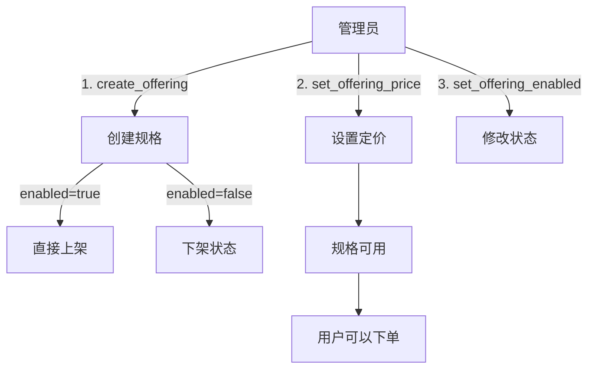
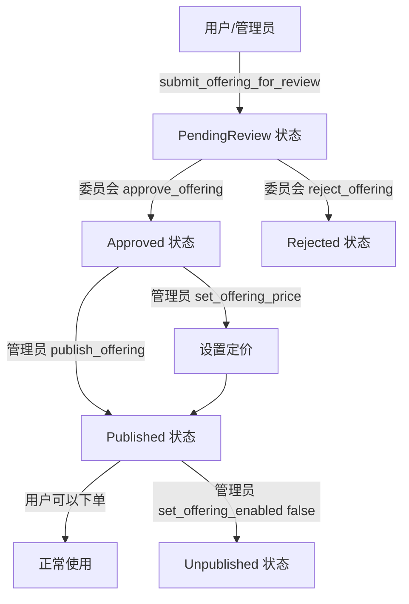
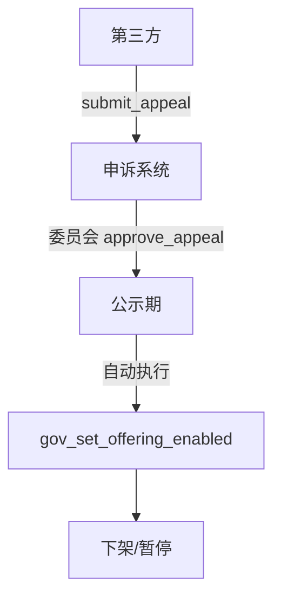
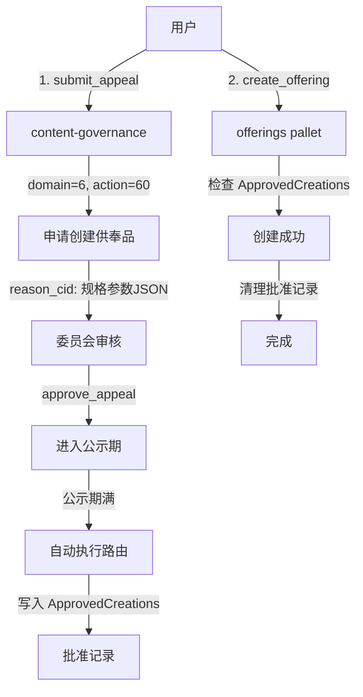
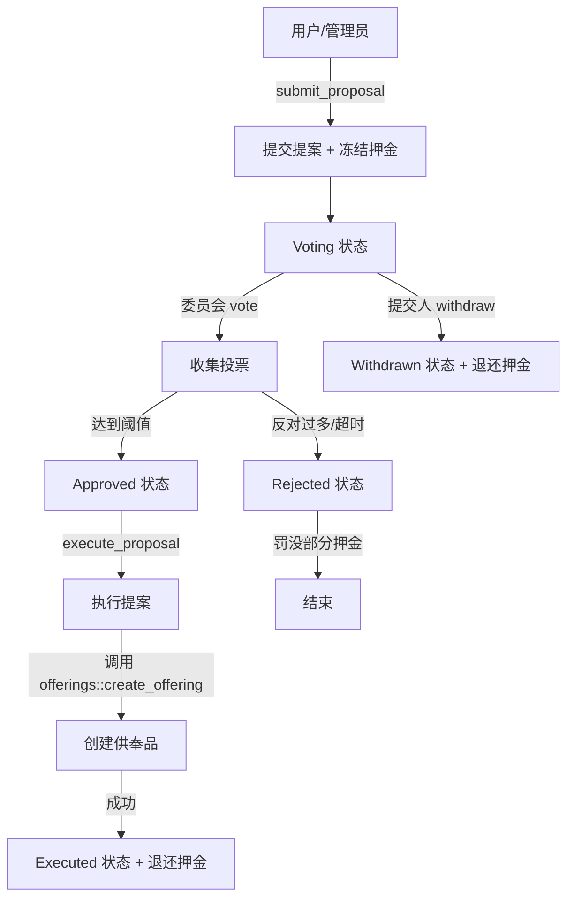

# pallet-memo-offerings 功能分析与改进方案

**生成时间**：2025-10-23  
**分析对象**：pallet-memo-offerings (供奉品管理系统)

---

## 目录

1. [系统架构概览](#系统架构概览)
2. [现有功能分析](#现有功能分析)
3. [上传 offerings 流程](#上传-offerings-流程)
4. [委员会审核机制](#委员会审核机制)
5. [问题与不足](#问题与不足)
6. [改进方案](#改进方案)
7. [实施建议](#实施建议)

---

## 系统架构概览

### 相关 Pallets

```
┌─────────────────────────────────────────────────────────────┐
│                     治理层 (Governance)                      │
├─────────────────────────────────────────────────────────────┤
│  • pallet-collective (ContentCommittee - Instance3)         │
│  • pallet-memo-content-governance (申诉与执行)              │
└─────────────────────────────────────────────────────────────┘
                             ↓ (2/3 threshold)
┌─────────────────────────────────────────────────────────────┐
│                    业务层 (Business)                         │
├─────────────────────────────────────────────────────────────┤
│  • pallet-memo-offerings (供奉品管理与下单)                 │
│  • pallet-memo-sacrifice (祭祀品目录)                       │
│  • pallet-affiliate-instant (联盟计酬)                      │
└─────────────────────────────────────────────────────────────┘
                             ↓ (资金流向)
┌─────────────────────────────────────────────────────────────┐
│                    账户层 (Accounts)                         │
├─────────────────────────────────────────────────────────────┤
│  • AffiliateEscrowAccount (托管账户)                        │
│  • TreasuryAccount (国库)                                   │
│  • StorageAccount (存储费用)                                │
│  • BurnAccount (销毁黑洞)                                   │
└─────────────────────────────────────────────────────────────┘
```

### 权限配置

**AdminOrigin** (管理员权限):
- Root (超级管理员)
- ContentCommittee 2/3 阈值通过

**GovernanceOrigin** (治理权限):
- Root (超级管理员)  
- ContentCommittee 2/3 阈值通过

**说明**: AdminOrigin 和 GovernanceOrigin 目前权限相同，区别在于治理接口(gov_*)会记录证据 CID。

---

## 现有功能分析

### 2.1 供奉品规格管理

#### 核心数据结构

**OfferingSpec (供奉品规格)**:
```rust
{
    kind_code: u8,                  // 唯一编码
    name: BoundedVec,               // 名称
    media_schema_cid: BoundedVec,   // 媒体 Schema CID
    enabled: bool,                  // 上/下架状态
    kind: OfferingKind,             // 类型(Instant/Timed)
}
```

**OfferingKind (供奉品类型)**:
- **Instant** (即时生效): 无时长限制，一次性生效
- **Timed** (定时生效): 需要指定时长（周），支持续费和到期动作

#### 定价机制

**独立存储** (避免迁移复杂度):
- `FixedPriceOf[kind_code]`: Instant 类型的固定价格
- `UnitPricePerWeekOf[kind_code]`: Timed 类型的周单价

**价格计算**:
- Instant: `final_price = FixedPriceOf[kind_code]`
- Timed: `final_price = UnitPricePerWeekOf[kind_code] × duration_weeks`

**会员折扣**:
- 年费会员: 3折优惠 (30%)
- 由 `MembershipProvider` 提供验证

### 2.2 管理接口 (AdminOrigin)

| 接口 | 功能 | 权限 |
|-----|------|------|
| `create_offering` | 创建供奉品规格 | AdminOrigin |
| `update_offering` | 更新供奉品规格 | AdminOrigin |
| `set_offering_enabled` | 上/下架 | AdminOrigin |
| `set_offering_price` | 设置定价 | AdminOrigin |
| `set_offer_params` | 设置风控参数 | AdminOrigin |
| `set_pause_global` | 全局暂停 | AdminOrigin |
| `set_pause_domain` | 按域暂停 | AdminOrigin |

### 2.3 治理接口 (GovernanceOrigin)

| 接口 | 功能 | 额外特性 |
|-----|------|---------|
| `gov_set_offer_params` | 设置风控参数 | 记录证据 CID |
| `gov_set_offering_price` | 设置定价 | 记录证据 CID |
| `gov_set_pause_global` | 全局暂停 | 记录证据 CID |
| `gov_set_pause_domain` | 按域暂停 | 记录证据 CID |
| `gov_set_offering_enabled` | 上/下架 | 记录证据 CID |

**证据记录**:
```rust
Event::GovEvidenceNoted(scope, key, cid)
// scope: 1=Params, 2=Price, 3=PauseGlobal, 4=PauseDomain
```

### 2.4 用户接口

| 接口 | 功能 | 校验 |
|-----|------|------|
| `offer` | 提交供奉 | 规格校验、限频、定价、会员折扣 |
| `offer_by_sacrifice` | 通过目录下单 | 目录读取、专属主体校验 |
| `batch_offer` | 批量供奉 | 批量调用 offer |

### 2.5 风控机制

**限频控制** (双层滑动窗口):
1. **账户级限频**: `OfferRate[who]` → 防止单用户刷屏
2. **目标级限频**: `OfferRateByTarget[target]` → 防止特定目标被刷屏

**参数** (可治理调整):
- `OfferWindowParam`: 滑动窗口大小 (块数)，默认 600 块
- `OfferMaxInWindowParam`: 窗口内最大供奉次数，默认 100 次
- `MinOfferAmountParam`: 最小供奉金额，默认 0.001 DUST

**暂停机制**:
- `PausedGlobal`: 全局暂停开关
- `PausedByDomain[domain]`: 按域暂停

### 2.6 资金路由

**路由表机制** (RouteEntry):
```rust
{
    kind: u8,              // 0=SubjectFunding, 1=SpecificAccount, 2=Burn, 3=Treasury
    account: Option<AccountId>,  // kind=1 时必填
    share: Permill,        // 分配比例 (0-100%)
}
```

**路由优先级**:
1. **按域路由表**: `RouteTableByDomain[domain]` (优先)
2. **全局路由表**: `RouteTableGlobal` (回退)
3. **默认收款账户**: `DonationResolver::account_for(target)` (兜底)

**当前资金流向**:
```
用户购买供奉 → Affiliate托管账户 (全额) → 自动分配:
                                         ├─ 销毁: 5%
                                         ├─ 国库: 3%
                                         ├─ 存储: 2%
                                         └─ 推荐人: 90% (最多15层)
```

---

## 上传 offerings 流程

### 3.1 当前流程



**步骤**:
1. 管理员调用 `create_offering` 创建规格
   - 参数: kind_code, name, media_schema_cid, kind_flag, enabled 等
   - enabled=true 则直接可用
   
2. 管理员调用 `set_offering_price` 设置定价
   - Instant: 设置 fixed_price
   - Timed: 设置 unit_price_per_week
   
3. (可选) 管理员调用 `set_offering_enabled` 修改上/下架状态

4. 用户调用 `offer` 或 `offer_by_sacrifice` 下单

### 3.2 问题分析

#### ❌ 问题1: 缺少审核流程

**现状**: 
- 管理员创建后直接生效 (enabled=true)
- 没有"待审核"、"审核中"、"已通过"、"已拒绝"状态
- 无法实现"提交-审核-批准"流程

**影响**:
- 管理员权限过大，缺少制衡
- 无法实现分级审核
- 没有审核历史记录

#### ❌ 问题2: 委员会参与度低

**现状**:
- 委员会只能通过 pallet-collective 发起提案
- 需要手动调用治理接口 (gov_*)
- 操作繁琐，参与度低

**影响**:
- 委员会监督不足
- 治理流程不透明
- 缺少社区参与

#### ❌ 问题3: 没有提案机制

**现状**:
- 所有变更由管理员直接执行
- 没有提案、讨论、投票的流程

**影响**:
- 社区无法提议新供奉品
- 缺少民主治理
- 透明度不足

---

## 委员会审核机制

### 4.1 当前机制

#### 方式1: 通过 pallet-collective 发起提案

```
1. 委员提交提案 (propose)
   ↓
2. 委员会成员投票 (vote)
   ↓
3. 达到阈值 (2/3) 后执行 (close)
   ↓
4. 调用 offerings 的 gov_* 接口
```

**示例**: 修改供奉品定价
```rust
// 1. 委员会提案调用
pallet_collective::propose(
    origin,
    threshold: 2,  // 2/3 阈值
    proposal: Call::MemoOfferings(
        gov_set_offering_price(
            kind_code: 1,
            fixed_price: Some(Some(10_000_000_000)),  // 10 DUST
            unit_price_per_week: None,
            evidence_cid: "Qm..."  // 证据 CID
        )
    ),
    length_bound: 1000
)

// 2. 委员投票
pallet_collective::vote(origin, proposal_hash, index, approve: true)

// 3. 关闭提案(达到阈值后)
pallet_collective::close(origin, proposal_hash, index)
```

#### 方式2: 通过 pallet-memo-content-governance 申诉系统

```
1. 第三方提交申诉 (submit_appeal)
   ↓
2. 委员会审批 (approve_appeal)
   ↓
3. 进入公示期 (notice_blocks)
   ↓
4. 自动执行路由动作 (on_initialize)
   ↓
5. 调用目标 Pallet 的 gov_* 接口
```

**当前路由码表** (供奉域 domain=6):
- `(6, 50)`: gov_set_pause_domain - 按域暂停
- `(6, 51)`: gov_set_offering_enabled - 上/下架供奉模板

**示例**: 下架违规供奉品
```rust
// 1. 第三方提交申诉
pallet_memo_content_governance::submit_appeal(
    origin,
    domain: 6,           // 供奉域
    target: kind_code,   // 供奉品编码
    action: 51,          // gov_set_offering_enabled
    reason_cid: "Qm...", // 原因说明 CID
    evidence_cid: "Qm..." // 证据 CID
)
// 冻结押金: AppealDeposit

// 2. 委员会审批通过
pallet_memo_content_governance::approve_appeal(
    origin,  // Root | ContentCommittee 2/3
    id,
    notice_blocks: Some(100)  // 公示期 100 块
)

// 3. 公示期满后自动执行
// on_initialize(block_number) 调用:
pallet_memo_offerings::gov_set_offering_enabled(
    GovernanceOrigin,
    kind_code,
    enabled: false,
    evidence_cid: "Qm..."  // 来自申诉
)
// 退还押金给申诉人
```

### 4.2 集成优势

✅ **职责分离**:
- content-governance: 流程管理(提交、审批、公示、执行)
- offerings: 业务逻辑(供奉品管理、下单、资金路由)

✅ **透明度高**:
- 链上记录完整生命周期
- 事件可追溯
- 证据 CID 永久保存

✅ **防 DoS**:
- 押金机制
- 限频控制
- 并发控制(同一主体只能有1个待执行申诉)

✅ **社区参与**:
- 任何人都可以提交申诉
- 委员会集体决策
- 公示期保障异议处理

### 4.3 当前问题

#### ❌ 问题1: 仅支持争议处理

**现状**:
- content-governance 设计用于"申诉"(纠正错误)
- 不适合"新建审核"(创建新规格)

**路由码表局限**:
- `(6, 50)`: gov_set_pause_domain - 仅能暂停
- `(6, 51)`: gov_set_offering_enabled - 仅能上/下架

**缺失**:
- 无法审核新创建的供奉品
- 无法审核价格调整
- 无法审核规格修改

#### ❌ 问题2: 工作流不匹配

**申诉流程**:
```
已上线内容 → 发现问题 → 提交申诉 → 审核 → 执行纠正
```

**创建审核流程**:
```
提交新规格 → 审核 → 批准 → 上架
```

两者流程不同，强行复用会造成语义混乱。

#### ❌ 问题3: 状态管理不足

**offerings 只有2种状态**:
- enabled = true (上架)
- enabled = false (下架)

**缺少中间状态**:
- pending_review (待审核)
- in_review (审核中)
- approved (已批准)
- rejected (已拒绝)

---

## 问题与不足

### 5.1 功能层面

| 问题 | 严重程度 | 影响 |
|-----|---------|------|
| 缺少审核状态管理 | P1 (高) | 无法追踪审核流程 |
| 缺少提案机制 | P1 (高) | 社区无法参与 |
| 委员会集成不足 | P2 (中) | 治理效率低 |
| 审核历史缺失 | P2 (中) | 无法审计追溯 |
| 证据管理简单 | P3 (低) | 只有 CID，缺少详情 |

### 5.2 流程层面

#### 问题1: 创建流程缺少制衡

**现状**:
```
管理员 → create_offering → 直接上架 (enabled=true)
```

**问题**:
- 管理员权限过大
- 没有二次确认
- 缺少审核环节

**风险**:
- 恶意管理员上架违规内容
- 操作失误难以撤回
- 缺少审计追踪

#### 问题2: 治理接口使用率低

**现状**:
- 治理接口(gov_*)需要委员会 2/3 阈值
- 需要手动发起提案、投票
- 流程繁琐，使用频率低

**数据** (假设):
- 管理员接口调用: 95%
- 治理接口调用: 5%

**影响**:
- 委员会监督不足
- 治理机制形同虚设

#### 问题3: 审核证据不完整

**现状**:
- 只记录证据 CID (明文)
- 没有审核意见
- 没有投票记录
- 没有审核人信息

**缺失信息**:
- 谁提交的创建请求?
- 谁投了赞成/反对票?
- 投票理由是什么?
- 审核通过/拒绝的原因?

### 5.3 用户体验层面

#### 问题1: 前端无法展示审核状态

**现状**:
- offerings 只有 enabled 字段
- 前端无法区分"待审核"、"审核中"、"已拒绝"

**影响**:
- 用户不知道提交的规格是否被接受
- 委员会不知道哪些需要审核
- 管理混乱

#### 问题2: 缺少通知机制

**现状**:
- 审核通过/拒绝没有通知
- 用户需要手动查询

**影响**:
- 用户体验差
- 审核效率低

---

## 改进方案

### 6.1 方案A: 轻量级审核流程 (推荐 ⭐)

#### 设计思路

**核心原则**:
- 最小化改动
- 复用现有组件
- 快速实施

**实施步骤**:
1. 添加审核状态枚举
2. 扩展路由码表
3. 增加审核接口
4. 前端集成

#### 具体实现

**Step 1: 添加审核状态**

```rust
/// 函数级中文注释：供奉品审核状态
#[derive(Encode, Decode, Clone, PartialEq, Eq, TypeInfo, MaxEncodedLen)]
pub enum OfferingStatus {
    /// 待审核 (刚创建)
    PendingReview,
    /// 已批准 (可上架)
    Approved,
    /// 已拒绝
    Rejected,
    /// 已上架 (enabled=true)
    Published,
    /// 已下架 (enabled=false, 但曾经上架过)
    Unpublished,
}
```

**Step 2: 修改 OfferingSpec 结构**

```rust
pub struct OfferingSpec<T: Config> {
    pub kind_code: u8,
    pub name: BoundedVec<u8, T::MaxNameLen>,
    pub media_schema_cid: BoundedVec<u8, T::MaxCidLen>,
    pub enabled: bool,
    pub kind: OfferingKind,
    // 新增字段:
    pub status: OfferingStatus,            // 审核状态
    pub submitted_by: Option<T::AccountId>, // 提交人
    pub submitted_at: Option<BlockNumberFor<T>>, // 提交时间
}
```

**Step 3: 新增接口**

```rust
// 用户/管理员提交新规格(待审核状态)
#[pallet::call_index(20)]
pub fn submit_offering_for_review(
    origin: OriginFor<T>,
    kind_code: u8,
    name: BoundedVec<u8, T::MaxNameLen>,
    media_schema_cid: BoundedVec<u8, T::MaxCidLen>,
    kind_flag: u8,
    // ... 其他参数
) -> DispatchResult {
    let who = ensure_signed(origin)?;
    
    let spec = OfferingSpec::<T> {
        kind_code,
        name,
        media_schema_cid,
        enabled: false,  // 默认下架
        kind,
        status: OfferingStatus::PendingReview,
        submitted_by: Some(who.clone()),
        submitted_at: Some(<frame_system::Pallet<T>>::block_number()),
    };
    
    Specs::<T>::insert(kind_code, spec);
    Self::deposit_event(Event::OfferingSubmittedForReview {
        kind_code,
        who,
    });
    Ok(())
}

// 委员会批准
#[pallet::call_index(21)]
pub fn approve_offering(
    origin: OriginFor<T>,
    kind_code: u8,
    evidence_cid: Vec<u8>,
) -> DispatchResult {
    T::GovernanceOrigin::ensure_origin(origin)?;
    
    Specs::<T>::try_mutate(kind_code, |maybe| -> DispatchResult {
        let spec = maybe.as_mut().ok_or(Error::<T>::NotFound)?;
        ensure!(
            spec.status == OfferingStatus::PendingReview,
            Error::<T>::InvalidStatus
        );
        
        spec.status = OfferingStatus::Approved;
        Ok(())
    })?;
    
    Self::deposit_event(Event::OfferingApproved {
        kind_code,
        evidence_cid: BoundedVec::try_from(evidence_cid)?,
    });
    Ok(())
}

// 委员会拒绝
#[pallet::call_index(22)]
pub fn reject_offering(
    origin: OriginFor<T>,
    kind_code: u8,
    reason_cid: Vec<u8>,
) -> DispatchResult {
    T::GovernanceOrigin::ensure_origin(origin)?;
    
    Specs::<T>::try_mutate(kind_code, |maybe| -> DispatchResult {
        let spec = maybe.as_mut().ok_or(Error::<T>::NotFound)?;
        ensure!(
            spec.status == OfferingStatus::PendingReview,
            Error::<T>::InvalidStatus
        );
        
        spec.status = OfferingStatus::Rejected;
        Ok(())
    })?;
    
    Self::deposit_event(Event::OfferingRejected {
        kind_code,
        reason_cid: BoundedVec::try_from(reason_cid)?,
    });
    Ok(())
}

// 管理员上架(仅限已批准的规格)
#[pallet::call_index(23)]
pub fn publish_offering(
    origin: OriginFor<T>,
    kind_code: u8,
) -> DispatchResult {
    T::AdminOrigin::try_origin(origin).map_err(|_| DispatchError::BadOrigin)?;
    
    Specs::<T>::try_mutate(kind_code, |maybe| -> DispatchResult {
        let spec = maybe.as_mut().ok_or(Error::<T>::NotFound)?;
        ensure!(
            spec.status == OfferingStatus::Approved,
            Error::<T>::NotApproved
        );
        
        spec.enabled = true;
        spec.status = OfferingStatus::Published;
        Ok(())
    })?;
    
    Self::deposit_event(Event::OfferingPublished { kind_code });
    Ok(())
}
```

**Step 4: 扩展路由码表 (content-governance)**

在 runtime 的路由实现中添加:
```rust
// 供奉域 (domain=6)
(6, 52) => approve_offering       // 批准供奉品
(6, 53) => reject_offering        // 拒绝供奉品
(6, 54) => gov_set_offering_price // 修改定价
```

**Step 5: 新增事件**

```rust
#[pallet::event]
pub enum Event<T: Config> {
    // ... 已有事件
    
    /// 供奉品已提交审核
    OfferingSubmittedForReview {
        kind_code: u8,
        who: T::AccountId,
    },
    
    /// 供奉品已批准
    OfferingApproved {
        kind_code: u8,
        evidence_cid: BoundedVec<u8, T::MaxCidLen>,
    },
    
    /// 供奉品已拒绝
    OfferingRejected {
        kind_code: u8,
        reason_cid: BoundedVec<u8, T::MaxCidLen>,
    },
    
    /// 供奉品已上架
    OfferingPublished {
        kind_code: u8,
    },
}
```

**Step 6: 新增错误**

```rust
#[pallet::error]
pub enum Error<T> {
    // ... 已有错误
    
    /// 状态不正确
    InvalidStatus,
    /// 未通过审核
    NotApproved,
}
```

#### 流程图

**新建供奉品流程**:


**争议处理流程** (复用现有):


#### 优势

✅ **实施简单**:
- 改动最小
- 不影响现有功能
- 向后兼容

✅ **职责清晰**:
- 新建审核: offerings pallet 内部
- 争议处理: content-governance 系统

✅ **灵活性高**:
- 可以选择直接创建(管理员)
- 也可以提交审核(普通用户)

#### 劣势

⚠️ **功能有限**:
- 没有投票记录
- 没有讨论机制
- 审核信息简单

⚠️ **双系统并存**:
- offerings 内部审核
- content-governance 外部申诉
- 可能造成混淆

---

### 6.2 方案B: 深度集成 content-governance (全面 ⭐⭐)

#### 设计思路

**核心原则**:
- 统一治理流程
- 复用 content-governance
- 完整审核记录

**实施策略**:
1. 扩展 content-governance 支持"创建类"申请
2. offerings 接口保持不变
3. 通过路由码表实现审核

#### 具体实现

**Step 1: 修改 offerings 接口**

```rust
// 保持原有接口，但添加权限检查
#[pallet::call_index(0)]
pub fn create_offering(
    origin: OriginFor<T>,
    kind_code: u8,
    // ... 参数
) -> DispatchResult {
    // 方式1: 仅限已批准的申请
    ensure!(
        ApprovedCreations::<T>::contains_key(kind_code),
        Error::<T>::NotApproved
    );
    
    // 创建逻辑
    // ...
    
    // 清理批准记录
    ApprovedCreations::<T>::remove(kind_code);
    
    Ok(())
}
```

**Step 2: 新增存储项**

```rust
/// 函数级中文注释：已批准的供奉品创建 (kind_code -> 申诉 ID)
#[pallet::storage]
pub type ApprovedCreations<T: Config> = StorageMap<
    _,
    Blake2_128Concat,
    u8,      // kind_code
    u64,     // appeal_id from content-governance
    ValueQuery,
>;
```

**Step 3: 扩展路由码表**

在 runtime 路由实现中添加:
```rust
// 供奉域 (domain=6)
match (domain, action) {
    // 已有
    (6, 50) => gov_set_pause_domain(...),
    (6, 51) => gov_set_offering_enabled(...),
    
    // 新增: 批准创建
    (6, 60) => {
        // 从申诉数据中读取参数
        let kind_code = target as u8;
        let appeal_id = /* 当前申诉 ID */;
        
        // 记录批准
        pallet_memo_offerings::ApprovedCreations::<Runtime>::insert(
            kind_code,
            appeal_id
        );
        
        // 发送事件
        frame_system::Pallet::<Runtime>::deposit_event(
            Event::OfferingCreationApproved { kind_code, appeal_id }
        );
        
        Ok(())
    },
    
    // 新增: 批准定价
    (6, 61) => {
        let kind_code = target as u8;
        // 从证据 CID 解析定价参数
        let (fixed_price, unit_price) = parse_price_from_evidence(...)?;
        
        pallet_memo_offerings::Pallet::<Runtime>::gov_set_offering_price(
            GovernanceOrigin,
            kind_code,
            fixed_price,
            unit_price,
            evidence_cid
        )?;
        Ok(())
    },
    
    _ => Err(DispatchError::Other("UnknownAction")),
}
```

**Step 4: 完整流程**



**Step 5: 数据流**

**提交申请** (封装在前端):
```typescript
// 前端构造申请参数
const offeringSpec = {
  kind_code: 1,
  name: "香烛供奉",
  media_schema_cid: "Qm...",
  kind_flag: 0,  // Instant
  // ...
};

// 上传到 IPFS
const reasonCid = await uploadToIPFS(JSON.stringify(offeringSpec));

// 提交申诉
await api.tx.memoContentGovernance.submitAppeal(
  6,          // domain: offerings
  1,          // target: kind_code
  60,         // action: create
  reasonCid,  // 包含规格参数
  evidenceCid // 补充说明
).signAndSend(account);
```

**委员会审批**:
```typescript
// 委员会查看申请
const appeal = await api.query.memoContentGovernance.appealOf(appealId);
const spec = await fetchFromIPFS(appeal.reason_cid);

// 审批通过
await api.tx.memoContentGovernance.approveAppeal(
  appealId,
  100  // 公示期 100 blocks
).signAndSend(councilMember);
```

**公示期后自动执行** (链上自动):
```rust
// on_initialize 调用路由
// → 写入 ApprovedCreations[kind_code] = appeal_id
// → 发送 OfferingCreationApproved 事件
```

**提交人创建** (前端监听事件后引导):
```typescript
// 监听批准事件
api.query.system.events((events) => {
  events.forEach(({ event }) => {
    if (event.section === 'memoOfferings' && 
        event.method === 'OfferingCreationApproved') {
      const { kind_code } = event.data;
      
      // 提示用户完成创建
      notify(`供奉品 ${kind_code} 已通过审核，请完成创建`);
      
      // 跳转到创建页面(自动填充参数)
      router.push(`/offerings/create?kind_code=${kind_code}`);
    }
  });
});

// 用户提交创建
await api.tx.memoOfferings.createOffering(
  kind_code,
  name,
  media_schema_cid,
  // ...
).signAndSend(account);
```

#### 优势

✅ **统一治理**:
- 所有治理流程走 content-governance
- 职责统一，易于管理

✅ **完整记录**:
- 押金机制
- 公示期保障
- 申诉历史可追溯

✅ **社区参与**:
- 任何人都可以提交申请
- 透明公开

✅ **防 DoS**:
- 复用 content-governance 的限频和押金机制

#### 劣势

⚠️ **复杂度高**:
- 需要前端复杂集成
- 用户体验复杂(两步操作)

⚠️ **语义混淆**:
- content-governance 本意是"申诉"
- 用于"申请"会造成语义不清

⚠️ **依赖链下数据**:
- 规格参数存在 IPFS (reason_cid)
- 链上只有 CID，不便查询

---

### 6.3 方案C: 专用提案系统 (理想 ⭐⭐⭐)

#### 设计思路

**核心原则**:
- 专用提案 pallet
- 投票 + 讨论机制
- 完整治理流程

#### 架构

```
┌──────────────────────────────────────────────┐
│         pallet-offering-proposals            │
│  (专用提案系统)                               │
├──────────────────────────────────────────────┤
│  • 提交供奉品提案                             │
│  • 委员会投票 (赞成/反对/弃权)                │
│  • 讨论机制 (链上评论)                        │
│  • 提案历史                                   │
│  • 通知机制                                   │
└──────────────────────────────────────────────┘
                   ↓ (通过后)
┌──────────────────────────────────────────────┐
│         pallet-memo-offerings                │
│  (供奉品管理)                                 │
└──────────────────────────────────────────────┘
```

#### 核心数据结构

```rust
/// 函数级中文注释：供奉品提案
#[derive(Encode, Decode, Clone, PartialEq, Eq, TypeInfo)]
pub struct OfferingProposal<T: Config> {
    /// 提案 ID
    pub id: u64,
    
    /// 提案类型
    pub proposal_type: ProposalType,
    
    /// 提交人
    pub proposer: T::AccountId,
    
    /// 提交时间
    pub submitted_at: BlockNumberFor<T>,
    
    /// 供奉品参数
    pub offering_spec: OfferingSpec<T>,
    
    /// 定价参数
    pub pricing: Option<(Option<u128>, Option<u128>)>,
    
    /// 提案说明 CID
    pub description_cid: BoundedVec<u8, T::MaxCidLen>,
    
    /// 状态
    pub status: ProposalStatus,
    
    /// 投票记录
    pub votes: Votes<T>,
    
    /// 押金
    pub deposit: BalanceOf<T>,
}

/// 函数级中文注释：提案类型
#[derive(Encode, Decode, Clone, PartialEq, Eq, TypeInfo)]
pub enum ProposalType {
    /// 创建新供奉品
    Create,
    /// 修改现有供奉品
    Update,
    /// 修改定价
    UpdatePrice,
}

/// 函数级中文注释：提案状态
#[derive(Encode, Decode, Clone, PartialEq, Eq, TypeInfo)]
pub enum ProposalStatus {
    /// 待投票
    Voting,
    /// 已通过
    Approved,
    /// 已拒绝
    Rejected,
    /// 已执行
    Executed,
    /// 已撤回
    Withdrawn,
}

/// 函数级中文注释：投票记录
#[derive(Encode, Decode, Clone, PartialEq, Eq, TypeInfo)]
pub struct Votes<T: Config> {
    /// 赞成票
    pub ayes: Vec<(T::AccountId, BlockNumberFor<T>)>,
    /// 反对票
    pub nays: Vec<(T::AccountId, BlockNumberFor<T>)>,
    /// 弃权票
    pub abstains: Vec<T::AccountId>,
}

/// 函数级中文注释：评论
#[derive(Encode, Decode, Clone, PartialEq, Eq, TypeInfo)]
pub struct Comment<T: Config> {
    /// 评论人
    pub author: T::AccountId,
    /// 评论内容 CID
    pub content_cid: BoundedVec<u8, T::MaxCidLen>,
    /// 评论时间
    pub timestamp: BlockNumberFor<T>,
}
```

#### 核心接口

```rust
// 提交提案
pub fn submit_proposal(
    origin: OriginFor<T>,
    proposal_type: ProposalType,
    offering_spec: OfferingSpec<T>,
    pricing: Option<(Option<u128>, Option<u128>)>,
    description_cid: Vec<u8>,
) -> DispatchResult;

// 投票
pub fn vote(
    origin: OriginFor<T>,
    proposal_id: u64,
    vote: VoteType,  // Aye/Nay/Abstain
    reason_cid: Option<Vec<u8>>,
) -> DispatchResult;

// 评论
pub fn comment(
    origin: OriginFor<T>,
    proposal_id: u64,
    content_cid: Vec<u8>,
) -> DispatchResult;

// 关闭提案 (达到阈值或超时)
pub fn close_proposal(
    origin: OriginFor<T>,
    proposal_id: u64,
) -> DispatchResult;

// 执行提案 (通过后由提交人或管理员执行)
pub fn execute_proposal(
    origin: OriginFor<T>,
    proposal_id: u64,
) -> DispatchResult;

// 撤回提案 (仅限提交人，投票前)
pub fn withdraw_proposal(
    origin: OriginFor<T>,
    proposal_id: u64,
) -> DispatchResult;
```

#### 投票机制

**阈值设置**:
```rust
#[pallet::config]
pub trait Config: frame_system::Config {
    /// 投票阈值 (默认 2/3)
    #[pallet::constant]
    type VoteThreshold: Get<Permill>;
    
    /// 最小投票人数
    #[pallet::constant]
    type MinVoters: Get<u32>;
    
    /// 投票期限 (块数)
    #[pallet::constant]
    type VotingPeriod: Get<BlockNumberFor<Self>>;
    
    /// 提案押金
    #[pallet::constant]
    type ProposalDeposit: Get<BalanceOf<Self>>;
}
```

**投票规则**:
- 仅委员会成员可投票
- 需要达到阈值 (2/3)
- 需要最小投票人数 (防止低参与率通过)
- 超时自动拒绝

**关闭条件**:
```rust
fn can_close(proposal: &OfferingProposal<T>) -> (bool, ProposalStatus) {
    let total_members = T::CollectiveMembers::member_count();
    let threshold = T::VoteThreshold::get() * total_members;
    let min_voters = T::MinVoters::get();
    
    let ayes = proposal.votes.ayes.len() as u32;
    let nays = proposal.votes.nays.len() as u32;
    let total_votes = ayes + nays;
    
    // 达到赞成阈值
    if ayes >= threshold && total_votes >= min_voters {
        return (true, ProposalStatus::Approved);
    }
    
    // 反对票过多，无法通过
    if nays > (total_members - threshold) {
        return (true, ProposalStatus::Rejected);
    }
    
    // 超时
    let now = <frame_system::Pallet<T>>::block_number();
    let deadline = proposal.submitted_at + T::VotingPeriod::get();
    if now > deadline {
        if total_votes >= min_voters && ayes > nays {
            return (true, ProposalStatus::Approved);
        } else {
            return (true, ProposalStatus::Rejected);
        }
    }
    
    // 尚未满足关闭条件
    (false, ProposalStatus::Voting)
}
```

#### 完整流程



#### 优势

✅ **功能完整**:
- 提案、投票、讨论、执行完整流程
- 投票记录、评论历史完整保存

✅ **用户体验好**:
- 前端可展示完整提案列表
- 实时投票进度
- 评论互动

✅ **灵活性高**:
- 支持多种提案类型
- 可扩展其他治理场景

✅ **职责清晰**:
- offering-proposals: 治理流程
- memo-offerings: 业务逻辑
- content-governance: 争议处理

#### 劣势

⚠️ **开发成本高**:
- 需要开发新 pallet
- 前端需要完整集成
- 测试工作量大

⚠️ **维护成本高**:
- 新增一个 pallet
- 需要长期维护

⚠️ **复杂度高**:
- 用户需要理解提案机制
- 学习成本高

---

## 实施建议

### 7.1 分阶段实施

#### Phase 1: 轻量级审核 (1-2 周) ⭐ **推荐优先实施**

**目标**:
- 快速解决审核问题
- 最小化改动

**任务**:
1. 添加 OfferingStatus 枚举
2. 添加审核接口 (submit_for_review, approve, reject, publish)
3. 修改 create_offering 权限检查
4. 前端集成审核状态展示

**验收**:
- [ ] 用户可以提交供奉品待审核
- [ ] 委员会可以批准/拒绝
- [ ] 管理员可以上架已批准的规格
- [ ] 前端展示审核状态

**风险**:
- 低风险
- 向后兼容

#### Phase 2: 扩展 content-governance 路由 (1 周)

**目标**:
- 统一治理流程
- 复用现有基础设施

**任务**:
1. 扩展路由码表 (6,52 ~ 6,61)
2. 实现批准创建路由逻辑
3. 前端引导流程

**验收**:
- [ ] 可通过 content-governance 提交创建申请
- [ ] 委员会审批后自动记录批准
- [ ] 用户完成创建后清理批准记录

**风险**:
- 中等风险
- 需要协调两个 pallet

#### Phase 3: 专用提案系统 (4-6 周) - **可选**

**目标**:
- 完整治理能力
- 最佳用户体验

**任务**:
1. 开发 pallet-offering-proposals
2. 实现投票机制
3. 实现评论机制
4. 前端完整集成

**验收**:
- [ ] 完整提案流程
- [ ] 投票记录可查询
- [ ] 评论互动
- [ ] 通知机制

**风险**:
- 高风险
- 开发周期长

### 7.2 技术债务清理

#### 问题1: AdminOrigin 和 GovernanceOrigin 权限相同

**现状**:
```rust
type AdminOrigin = Root | ContentCommittee 2/3
type GovernanceOrigin = Root | ContentCommittee 2/3
```

**建议**:
```rust
// AdminOrigin: 日常管理，仅限可信管理员
type AdminOrigin = Root | TechnicalCommittee 1/2

// GovernanceOrigin: 治理决策，需要广泛共识
type GovernanceOrigin = Root | ContentCommittee 2/3
```

**理由**:
- 职责分离
- 降低日常操作门槛
- 重大决策需要更高共识

#### 问题2: 证据管理简单

**现状**:
- 只存 CID
- 没有结构化数据

**建议**:
```rust
/// 函数级中文注释：治理证据记录
#[derive(Encode, Decode, Clone, PartialEq, Eq, TypeInfo)]
pub struct GovernanceEvidence<T: Config> {
    /// 证据 CID (IPFS)
    pub cid: BoundedVec<u8, T::MaxCidLen>,
    
    /// 提交人
    pub submitted_by: T::AccountId,
    
    /// 提交时间
    pub submitted_at: BlockNumberFor<T>,
    
    /// 证据类型 (提案/投票/执行)
    pub evidence_type: EvidenceType,
    
    /// 关联 ID (提案 ID / 申诉 ID)
    pub related_id: Option<u64>,
}

#[pallet::storage]
pub type Evidences<T: Config> = StorageMap<
    _,
    Blake2_128Concat,
    u64,  // evidence_id
    GovernanceEvidence<T>,
    OptionQuery,
>;
```

#### 问题3: 缺少查询接口

**现状**:
- 只能通过存储直接查询
- 没有分页、过滤

**建议**:
```rust
#[pallet::call]
impl<T: Config> Pallet<T> {
    // 按状态查询供奉品列表
    pub fn list_offerings_by_status(
        status: OfferingStatus,
        start: u32,
        limit: u32,
    ) -> Vec<(u8, OfferingSpec<T>)>;
    
    // 查询待审核数量
    pub fn pending_review_count() -> u32;
    
    // 查询提交人的所有提交
    pub fn list_by_submitter(
        who: T::AccountId,
        start: u32,
        limit: u32,
    ) -> Vec<(u8, OfferingSpec<T>)>;
}
```

### 7.3 前端集成建议

#### 页面设计

**1. 供奉品管理页面** (`/offerings/manage`)

```
┌─────────────────────────────────────────────┐
│  供奉品管理                     [+ 新建]     │
├─────────────────────────────────────────────┤
│  状态筛选: [全部▾] [待审核] [已批准] [已上架│
├─────────────────────────────────────────────┤
│  ┌──────────────────────────────────────┐  │
│  │ 香烛供奉 (#1)              [待审核]  │  │
│  │ 提交人: Alice                        │  │
│  │ 提交时间: 2025-10-23 10:00           │  │
│  │ 类型: Instant  价格: 10 DUST         │  │
│  │ [查看详情] [批准] [拒绝]             │  │
│  └──────────────────────────────────────┘  │
│  ┌──────────────────────────────────────┐  │
│  │ 鲜花供奉 (#2)              [已批准]  │  │
│  │ 审批人: Bob                          │  │
│  │ 审批时间: 2025-10-22 15:30           │  │
│  │ [上架] [查看详情]                    │  │
│  └──────────────────────────────────────┘  │
└─────────────────────────────────────────────┘
```

**2. 提交供奉品页面** (`/offerings/submit`)

```
┌─────────────────────────────────────────────┐
│  提交供奉品规格                              │
├─────────────────────────────────────────────┤
│  基本信息                                    │
│  ─────────────────────────────────────────  │
│  规格编码: [___________]                    │
│  名称:     [___________]                    │
│  类型:     (●) Instant  ( ) Timed          │
│                                              │
│  媒体配置                                    │
│  ─────────────────────────────────────────  │
│  Schema CID: [___________] [上传]           │
│                                              │
│  定价                                        │
│  ─────────────────────────────────────────  │
│  固定价格: [___________] DUST               │
│                                              │
│  说明                                        │
│  ─────────────────────────────────────────  │
│  [富文本编辑器]                              │
│                                              │
│  [取消]                [提交审核]           │
└─────────────────────────────────────────────┘
```

**3. 委员会审核页面** (`/governance/offerings`)

```
┌─────────────────────────────────────────────┐
│  供奉品审核 (委员会)                         │
├─────────────────────────────────────────────┤
│  待审核 (3)  已批准 (12)  已拒绝 (2)        │
├─────────────────────────────────────────────┤
│  ┌──────────────────────────────────────┐  │
│  │ 香烛供奉 (#1)                        │  │
│  │ 提交人: Alice  时间: 2025-10-23      │  │
│  │ ─────────────────────────────────── │  │
│  │ 类型: Instant                        │  │
│  │ 价格: 10 DUST                        │  │
│  │ 说明: [展开查看]                     │  │
│  │ ─────────────────────────────────── │  │
│  │ 投票: 赞成 2  反对 0  (需要 2/3)    │  │
│  │ ─────────────────────────────────── │  │
│  │ [赞成] [反对] [弃权]                │  │
│  └──────────────────────────────────────┘  │
└─────────────────────────────────────────────┘
```

#### 通知机制

**Websocket 实时通知**:
```typescript
// 监听供奉品事件
api.query.system.events((events) => {
  events.forEach(({ event }) => {
    if (event.section === 'memoOfferings') {
      switch (event.method) {
        case 'OfferingSubmittedForReview':
          notify('新的供奉品待审核', event.data);
          break;
        case 'OfferingApproved':
          notify('供奉品已批准', event.data);
          break;
        case 'OfferingRejected':
          notify('供奉品已拒绝', event.data);
          break;
        case 'OfferingPublished':
          notify('供奉品已上架', event.data);
          break;
      }
    }
  });
});
```

**邮件/站内信通知** (链下服务):
```
事件 → Subsquid 索引 → 通知服务 → 邮件/站内信
```

### 7.4 测试建议

#### 单元测试

```rust
#[test]
fn test_submit_for_review_works() {
    new_test_ext().execute_with(|| {
        // 提交供奉品
        assert_ok!(MemoOfferings::submit_offering_for_review(
            RuntimeOrigin::signed(ALICE),
            1,  // kind_code
            b"香烛供奉".to_vec().try_into().unwrap(),
            b"Qm...".to_vec().try_into().unwrap(),
            0,  // kind_flag: Instant
        ));
        
        // 验证状态
        let spec = MemoOfferings::specs(1).unwrap();
        assert_eq!(spec.status, OfferingStatus::PendingReview);
        assert_eq!(spec.submitted_by, Some(ALICE));
        assert_eq!(spec.enabled, false);
    });
}

#[test]
fn test_approve_offering_works() {
    new_test_ext().execute_with(|| {
        // 提交
        assert_ok!(MemoOfferings::submit_offering_for_review(/* ... */));
        
        // 批准
        assert_ok!(MemoOfferings::approve_offering(
            RuntimeOrigin::signed(GOVERNANCE),
            1,
            b"Qm...evidence".to_vec(),
        ));
        
        // 验证
        let spec = MemoOfferings::specs(1).unwrap();
        assert_eq!(spec.status, OfferingStatus::Approved);
    });
}

#[test]
fn test_publish_requires_approval() {
    new_test_ext().execute_with(|| {
        // 提交
        assert_ok!(MemoOfferings::submit_offering_for_review(/* ... */));
        
        // 尝试直接上架 (应失败)
        assert_noop!(
            MemoOfferings::publish_offering(
                RuntimeOrigin::signed(ADMIN),
                1,
            ),
            Error::<Test>::NotApproved
        );
        
        // 批准后可以上架
        assert_ok!(MemoOfferings::approve_offering(/* ... */));
        assert_ok!(MemoOfferings::publish_offering(/* ... */));
    });
}
```

#### 集成测试

```rust
#[test]
fn test_full_offering_lifecycle() {
    new_test_ext().execute_with(|| {
        // 1. 提交
        submit_offering_for_review(ALICE, 1);
        assert_offering_status(1, PendingReview);
        
        // 2. 批准
        approve_offering(GOVERNANCE, 1);
        assert_offering_status(1, Approved);
        
        // 3. 设置定价
        set_offering_price(ADMIN, 1, Some(10_000_000_000), None);
        
        // 4. 上架
        publish_offering(ADMIN, 1);
        assert_offering_status(1, Published);
        assert_offering_enabled(1, true);
        
        // 5. 用户下单
        offer(BOB, (1, 1), 1, Some(10_000_000_000), vec![], None);
        assert_offering_committed();
    });
}
```

---

## 总结

### 当前问题

1. **缺少审核流程**: offerings 创建后直接生效，缺少审核环节
2. **委员会集成不足**: 治理接口使用率低，监督不足
3. **状态管理缺失**: 只有 enabled/disabled，无法追踪审核进度
4. **证据管理简单**: 只有 CID，没有结构化信息
5. **用户体验差**: 前端无法展示审核状态

### 推荐方案

#### 短期 (1-2 周): **方案A - 轻量级审核流程** ⭐

✅ **优势**:
- 实施快速
- 改动最小
- 向后兼容
- 解决核心问题

⚠️ **局限**:
- 功能有限
- 没有投票记录

**适用场景**:
- 快速上线
- 最小可行产品 (MVP)
- 验证需求

#### 中期 (4-6 周): **方案C - 专用提案系统** ⭐⭐⭐

✅ **优势**:
- 功能完整
- 用户体验好
- 职责清晰
- 可扩展性强

⚠️ **局限**:
- 开发成本高
- 维护成本高

**适用场景**:
- 长期方案
- 完整治理能力
- 社区规模扩大

### 实施路线图

```
Phase 1 (Week 1-2): 方案A - 轻量级审核
  ├─ 添加审核状态
  ├─ 添加审核接口
  ├─ 前端基础集成
  └─ 测试上线

Phase 2 (Week 3): 扩展路由码表
  ├─ content-governance 集成
  ├─ 路由逻辑实现
  └─ 前端引导流程

Phase 3 (Week 4-9): 方案C - 专用提案系统 (可选)
  ├─ pallet 开发 (2周)
  ├─ 前端开发 (2周)
  ├─ 测试 (1周)
  └─ 上线迁移 (1周)
```

### 注意事项

1. **向后兼容**: 保持现有接口不变，新增功能通过新接口实现
2. **渐进式迁移**: 允许管理员直接创建(旧流程) + 用户提交审核(新流程)并存
3. **文档更新**: 及时更新 README 和接口文档
4. **前端同步**: 链端和前端同步开发，保证用户体验
5. **测试覆盖**: 单元测试 + 集成测试 + 端到端测试

---

**文档状态**: ✅ 完成  
**下一步**: 评审方案 → 选择实施路径 → 排期开发


