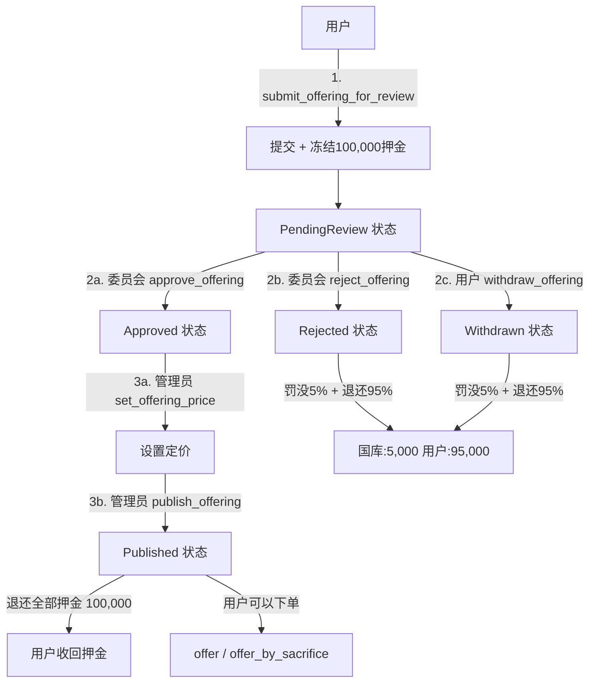
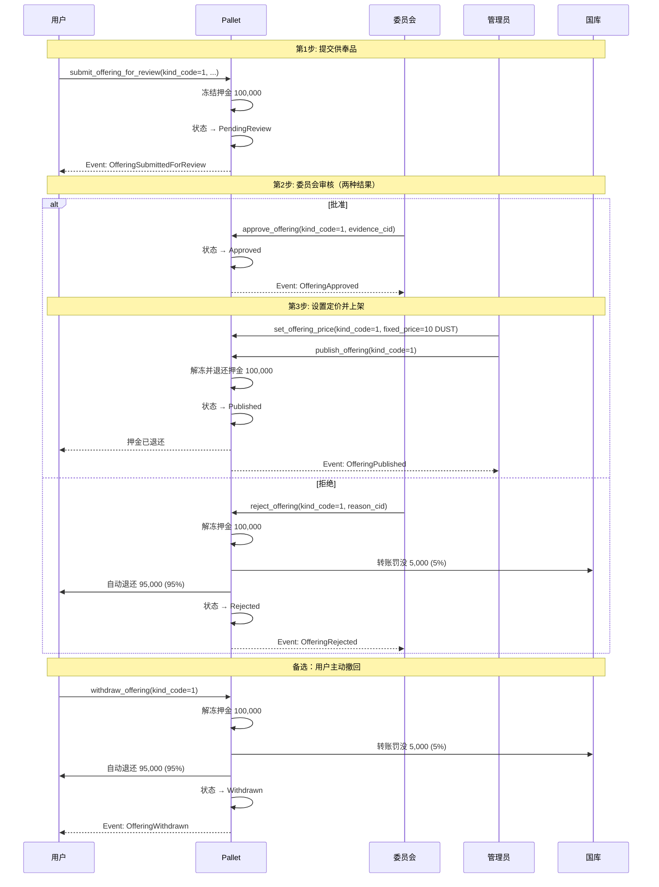

# pallet-memo-offerings 轻量级审核方案 (带押金机制)

**生成时间**：2025-10-23  
**版本**：v2.0 (增强版)  
**状态**：待实施

---

## 目录

1. [方案概述](#方案概述)
2. [核心设计](#核心设计)
3. [技术实现](#技术实现)
4. [完整流程](#完整流程)
5. [前端集成](#前端集成)
6. [测试用例](#测试用例)
7. [实施计划](#实施计划)

---

## 方案概述

### 设计目标

✅ **防止恶意提交**：通过押金机制提高提交门槛  
✅ **提高提交质量**：罚没机制促使用户认真准备  
✅ **快速实施**：最小改动，1-2周完成  
✅ **职责清晰**：offerings pallet 内部完成审核流程

### 核心特性

| 特性 | 说明 |
|-----|------|
| **提交押金** | 100,000 单位 (0.1 DUST) |
| **罚没比例** | 5% (拒绝或撤回时) |
| **退还比例** | 95% (拒绝或撤回时) / 100% (批准后上架时) |
| **罚没流向** | 国库账户 (TreasuryAccount) |
| **押金管理** | Currency::reserve/unreserve |

### 资金流向

```
┌────────────────────────────────────────────────────────┐
│                  提交供奉品 (100,000)                   │
└────────────────────────────────────────────────────────┘
                           │
                           ├─ 冻结押金 100,000
                           │
        ┌──────────────────┴──────────────────┐
        │                                     │
   [批准路径]                            [拒绝/撤回路径]
        │                                     │
        ├─ 上架成功                           ├─ 国库: 5,000 (5%)
        ├─ 退还全部: 100,000                  └─ 退还: 95,000 (95%)
        └─ 用户收益: +100,000
```

---

## 核心设计

### 2.1 状态枚举

```rust
/// 函数级中文注释：供奉品审核状态
#[derive(Encode, Decode, Clone, PartialEq, Eq, TypeInfo, MaxEncodedLen, Debug)]
pub enum OfferingStatus {
    /// 待审核 (刚提交，押金已冻结)
    PendingReview,
    
    /// 已批准 (等待上架，押金仍冻结)
    Approved,
    
    /// 已拒绝 (已罚没5%并退还95%，押金已释放)
    Rejected,
    
    /// 已撤回 (用户主动撤回，已罚没5%并退还95%，押金已释放)
    Withdrawn,
    
    /// 已上架 (enabled=true，押金已退还)
    Published,
    
    /// 已下架 (enabled=false，但曾经上架过)
    Unpublished,
}
```

### 2.2 扩展 OfferingSpec

```rust
/// 函数级中文注释：供奉品规格（增强版，带审核信息）
#[derive(Encode, Decode, Clone, PartialEq, Eq, TypeInfo, MaxEncodedLen)]
#[scale_info(skip_type_params(T))]
pub struct OfferingSpec<T: Config> {
    /// 规格编码（唯一）
    pub kind_code: u8,
    
    /// 名称
    pub name: BoundedVec<u8, T::MaxNameLen>,
    
    /// 媒体 Schema CID
    pub media_schema_cid: BoundedVec<u8, T::MaxCidLen>,
    
    /// 是否启用（上架状态）
    pub enabled: bool,
    
    /// 供奉品类型
    pub kind: OfferingKind,
    
    // ========== 审核相关字段（新增）==========
    
    /// 审核状态
    pub status: OfferingStatus,
    
    /// 提交人
    pub submitted_by: Option<T::AccountId>,
    
    /// 提交时间
    pub submitted_at: Option<BlockNumberFor<T>>,
    
    /// 押金金额（记录实际冻结的金额，用于退还）
    pub deposit: Option<BalanceOf<T>>,
    
    /// 审核人（批准或拒绝的委员会成员）
    pub reviewed_by: Option<T::AccountId>,
    
    /// 审核时间
    pub reviewed_at: Option<BlockNumberFor<T>>,
    
    /// 审核意见 CID（批准或拒绝的原因说明）
    pub review_cid: Option<BoundedVec<u8, T::MaxCidLen>>,
}
```

### 2.3 Config 配置

```rust
#[pallet::config]
pub trait Config: frame_system::Config {
    // ... 已有配置
    
    /// 函数级中文注释：供奉品提交押金（默认 100,000 单位 = 0.1 DUST）
    #[pallet::constant]
    type SubmissionDeposit: Get<BalanceOf<Self>>;
    
    /// 函数级中文注释：拒绝/撤回罚没比例（bps，默认 5000 = 5%）
    #[pallet::constant]
    type RejectionSlashBps: Get<u32>;
}
```

### 2.4 Runtime 配置示例

```rust
// runtime/src/configs/mod.rs
parameter_types! {
    /// 提交押金: 0.1 DUST (100,000 单位，假设 1 DUST = 1,000,000 单位)
    pub const OfferingSubmissionDeposit: Balance = 100_000;
    
    /// 罚没比例: 5% (500 bps out of 10,000)
    pub const OfferingRejectionSlashBps: u32 = 500;
}

impl pallet_memo_offerings::Config for Runtime {
    // ... 已有配置
    
    type SubmissionDeposit = OfferingSubmissionDeposit;
    type RejectionSlashBps = OfferingRejectionSlashBps;
}
```

---

## 技术实现

### 3.1 核心接口

#### 接口1: 提交供奉品待审核

```rust
/// 函数级详细中文注释：提交供奉品规格待审核
/// 
/// 功能：
/// - 任何签名账户都可以提交
/// - 自动冻结押金（SubmissionDeposit）
/// - 初始状态为 PendingReview
/// - 记录提交人、提交时间、押金金额
/// 
/// 参数：
/// - kind_code: 规格编码（必须唯一，未被使用）
/// - name: 供奉品名称
/// - media_schema_cid: 媒体 Schema CID
/// - kind_flag: 类型标志 (0=Instant, 1=Timed)
/// - min_duration: Timed 类型的最小时长（周）
/// - max_duration: Timed 类型的最大时长（周）
/// - can_renew: 是否可续费
/// - expire_action: 到期动作代码
/// - description_cid: 提交说明 CID（上传到 IPFS）
/// 
/// 错误：
/// - AlreadyExists: kind_code 已被使用
/// - InsufficientBalance: 余额不足支付押金
/// - BadKind: 类型参数不合法
/// 
/// 事件：
/// - OfferingSubmittedForReview
#[pallet::call_index(20)]
#[pallet::weight(10_000)]
pub fn submit_offering_for_review(
    origin: OriginFor<T>,
    kind_code: u8,
    name: BoundedVec<u8, T::MaxNameLen>,
    media_schema_cid: BoundedVec<u8, T::MaxCidLen>,
    kind_flag: u8,
    min_duration: Option<u32>,
    max_duration: Option<u32>,
    can_renew: bool,
    expire_action: u8,
    description_cid: BoundedVec<u8, T::MaxCidLen>,
) -> DispatchResult {
    let who = ensure_signed(origin)?;
    
    // 检查 kind_code 是否已存在
    ensure!(
        !Specs::<T>::contains_key(kind_code),
        Error::<T>::AlreadyExists
    );
    
    // 构造 OfferingKind
    let kind = match kind_flag {
        0 => OfferingKind::Instant,
        1 => OfferingKind::Timed {
            min: min_duration.unwrap_or(1),
            max: max_duration,
            can_renew,
            expire_action,
        },
        _ => return Err(Error::<T>::BadKind.into()),
    };
    
    // 冻结押金
    let deposit = T::SubmissionDeposit::get();
    T::Currency::reserve(&who, deposit)?;
    
    // 获取当前块高
    let now = <frame_system::Pallet<T>>::block_number();
    
    // 创建规格
    let spec = OfferingSpec::<T> {
        kind_code,
        name: name.clone(),
        media_schema_cid: media_schema_cid.clone(),
        enabled: false,  // 默认下架
        kind,
        // 审核字段
        status: OfferingStatus::PendingReview,
        submitted_by: Some(who.clone()),
        submitted_at: Some(now),
        deposit: Some(deposit),
        reviewed_by: None,
        reviewed_at: None,
        review_cid: None,
    };
    
    // 验证规格合法性
    ensure!(spec_validate::<T>(&spec), Error::<T>::BadKind);
    
    // 存储
    Specs::<T>::insert(kind_code, spec);
    
    // 发送事件
    Self::deposit_event(Event::OfferingSubmittedForReview {
        kind_code,
        who,
        deposit,
        description_cid,
    });
    
    Ok(())
}
```

#### 接口2: 批准供奉品

```rust
/// 函数级详细中文注释：批准供奉品
/// 
/// 功能：
/// - 仅限 GovernanceOrigin (Root | ContentCommittee 2/3)
/// - 将状态从 PendingReview 改为 Approved
/// - 记录审核人、审核时间、审核意见
/// - 押金仍保持冻结（待上架后退还）
/// 
/// 参数：
/// - kind_code: 规格编码
/// - evidence_cid: 审核证据 CID（批准理由）
/// 
/// 错误：
/// - NotFound: 规格不存在
/// - InvalidStatus: 状态不是 PendingReview
/// 
/// 事件：
/// - OfferingApproved
#[pallet::call_index(21)]
#[pallet::weight(10_000)]
pub fn approve_offering(
    origin: OriginFor<T>,
    kind_code: u8,
    evidence_cid: Vec<u8>,
) -> DispatchResult {
    // 确保是治理起源
    T::GovernanceOrigin::ensure_origin(origin.clone())?;
    
    // 获取调用者（用于记录审核人）
    let reviewer = ensure_signed(origin)?;
    
    // 验证证据 CID 长度
    let evidence_bounded: BoundedVec<u8, T::MaxCidLen> = 
        evidence_cid.try_into().map_err(|_| Error::<T>::BadInput)?;
    
    // 修改规格
    Specs::<T>::try_mutate(kind_code, |maybe_spec| -> DispatchResult {
        let spec = maybe_spec.as_mut().ok_or(Error::<T>::NotFound)?;
        
        // 检查状态
        ensure!(
            spec.status == OfferingStatus::PendingReview,
            Error::<T>::InvalidStatus
        );
        
        // 更新状态
        spec.status = OfferingStatus::Approved;
        spec.reviewed_by = Some(reviewer.clone());
        spec.reviewed_at = Some(<frame_system::Pallet<T>>::block_number());
        spec.review_cid = Some(evidence_bounded.clone());
        
        Ok(())
    })?;
    
    // 发送事件
    Self::deposit_event(Event::OfferingApproved {
        kind_code,
        reviewer,
        evidence_cid: evidence_bounded,
    });
    
    Ok(())
}
```

#### 接口3: 拒绝供奉品

```rust
/// 函数级详细中文注释：拒绝供奉品
/// 
/// 功能：
/// - 仅限 GovernanceOrigin (Root | ContentCommittee 2/3)
/// - 将状态从 PendingReview 改为 Rejected
/// - 罚没 5% 押金到国库，退还 95% 给提交人
/// - 记录审核人、审核时间、审核意见
/// 
/// 参数：
/// - kind_code: 规格编码
/// - reason_cid: 拒绝理由 CID
/// 
/// 错误：
/// - NotFound: 规格不存在
/// - InvalidStatus: 状态不是 PendingReview
/// 
/// 事件：
/// - OfferingRejected
#[pallet::call_index(22)]
#[pallet::weight(10_000)]
pub fn reject_offering(
    origin: OriginFor<T>,
    kind_code: u8,
    reason_cid: Vec<u8>,
) -> DispatchResult {
    // 确保是治理起源
    T::GovernanceOrigin::ensure_origin(origin.clone())?;
    
    // 获取调用者
    let reviewer = ensure_signed(origin)?;
    
    // 验证 CID 长度
    let reason_bounded: BoundedVec<u8, T::MaxCidLen> = 
        reason_cid.try_into().map_err(|_| Error::<T>::BadInput)?;
    
    // 读取规格并处理押金
    let spec = Specs::<T>::get(kind_code).ok_or(Error::<T>::NotFound)?;
    
    // 检查状态
    ensure!(
        spec.status == OfferingStatus::PendingReview,
        Error::<T>::InvalidStatus
    );
    
    let submitter = spec.submitted_by.ok_or(Error::<T>::BadInput)?;
    let deposit = spec.deposit.ok_or(Error::<T>::BadInput)?;
    
    // 计算罚没金额和退还金额
    let slash_bps = T::RejectionSlashBps::get();  // 500 bps = 5%
    let slash_amount = deposit.saturating_mul(slash_bps.into()) / 10_000u32.into();
    let refund_amount = deposit.saturating_sub(slash_amount);
    
    // 解除全部冻结
    T::Currency::unreserve(&submitter, deposit);
    
    // 罚没到国库
    if slash_amount > Zero::zero() {
        let treasury = T::TreasuryAccount::get();
        T::Currency::transfer(
            &submitter,
            &treasury,
            slash_amount,
            ExistenceRequirement::KeepAlive,
        )?;
    }
    
    // 退还剩余 (95%) 已自动解冻，无需额外操作
    
    // 更新规格状态
    Specs::<T>::try_mutate(kind_code, |maybe_spec| -> DispatchResult {
        let s = maybe_spec.as_mut().ok_or(Error::<T>::NotFound)?;
        s.status = OfferingStatus::Rejected;
        s.reviewed_by = Some(reviewer.clone());
        s.reviewed_at = Some(<frame_system::Pallet<T>>::block_number());
        s.review_cid = Some(reason_bounded.clone());
        Ok(())
    })?;
    
    // 发送事件
    Self::deposit_event(Event::OfferingRejected {
        kind_code,
        submitter,
        reviewer,
        deposit,
        slashed: slash_amount,
        refunded: refund_amount,
        reason_cid: reason_bounded,
    });
    
    Ok(())
}
```

#### 接口4: 撤回供奉品

```rust
/// 函数级详细中文注释：撤回供奉品（提交人主动撤回）
/// 
/// 功能：
/// - 仅限提交人本人调用
/// - 仅在 PendingReview 状态可撤回
/// - 罚没 5% 押金到国库，退还 95% 给提交人
/// 
/// 参数：
/// - kind_code: 规格编码
/// 
/// 错误：
/// - NotFound: 规格不存在
/// - NotSubmitter: 调用者不是提交人
/// - InvalidStatus: 状态不是 PendingReview
/// 
/// 事件：
/// - OfferingWithdrawn
#[pallet::call_index(23)]
#[pallet::weight(10_000)]
pub fn withdraw_offering(
    origin: OriginFor<T>,
    kind_code: u8,
) -> DispatchResult {
    let who = ensure_signed(origin)?;
    
    // 读取规格
    let spec = Specs::<T>::get(kind_code).ok_or(Error::<T>::NotFound)?;
    
    // 检查调用者是否是提交人
    let submitter = spec.submitted_by.ok_or(Error::<T>::BadInput)?;
    ensure!(who == submitter, Error::<T>::NotSubmitter);
    
    // 检查状态（只有待审核状态可以撤回）
    ensure!(
        spec.status == OfferingStatus::PendingReview,
        Error::<T>::InvalidStatus
    );
    
    let deposit = spec.deposit.ok_or(Error::<T>::BadInput)?;
    
    // 计算罚没和退还
    let slash_bps = T::RejectionSlashBps::get();  // 500 bps = 5%
    let slash_amount = deposit.saturating_mul(slash_bps.into()) / 10_000u32.into();
    let refund_amount = deposit.saturating_sub(slash_amount);
    
    // 解除冻结
    T::Currency::unreserve(&who, deposit);
    
    // 罚没到国库
    if slash_amount > Zero::zero() {
        let treasury = T::TreasuryAccount::get();
        T::Currency::transfer(
            &who,
            &treasury,
            slash_amount,
            ExistenceRequirement::KeepAlive,
        )?;
    }
    
    // 更新状态
    Specs::<T>::try_mutate(kind_code, |maybe_spec| -> DispatchResult {
        let s = maybe_spec.as_mut().ok_or(Error::<T>::NotFound)?;
        s.status = OfferingStatus::Withdrawn;
        Ok(())
    })?;
    
    // 发送事件
    Self::deposit_event(Event::OfferingWithdrawn {
        kind_code,
        who,
        deposit,
        slashed: slash_amount,
        refunded: refund_amount,
    });
    
    Ok(())
}
```

#### 接口5: 上架供奉品

```rust
/// 函数级详细中文注释：上架供奉品（发布）
/// 
/// 功能：
/// - 仅限 AdminOrigin (Root | TechnicalCommittee 1/2)
/// - 仅能上架 Approved 状态的规格
/// - 需要先设置定价（FixedPriceOf 或 UnitPricePerWeekOf）
/// - 上架成功后退还全部押金给提交人
/// 
/// 参数：
/// - kind_code: 规格编码
/// 
/// 错误：
/// - NotFound: 规格不存在
/// - NotApproved: 状态不是 Approved
/// - PriceNotSet: 未设置定价
/// 
/// 事件：
/// - OfferingPublished
#[pallet::call_index(24)]
#[pallet::weight(10_000)]
pub fn publish_offering(
    origin: OriginFor<T>,
    kind_code: u8,
) -> DispatchResult {
    // 确保是管理员
    T::AdminOrigin::try_origin(origin).map_err(|_| DispatchError::BadOrigin)?;
    
    // 读取规格
    let spec = Specs::<T>::get(kind_code).ok_or(Error::<T>::NotFound)?;
    
    // 检查状态
    ensure!(
        spec.status == OfferingStatus::Approved,
        Error::<T>::NotApproved
    );
    
    // 检查是否已设置定价
    let has_price = match spec.kind {
        OfferingKind::Instant => FixedPriceOf::<T>::contains_key(kind_code),
        OfferingKind::Timed { .. } => UnitPricePerWeekOf::<T>::contains_key(kind_code),
    };
    ensure!(has_price, Error::<T>::PriceNotSet);
    
    // 退还押金
    if let (Some(submitter), Some(deposit)) = (spec.submitted_by.clone(), spec.deposit) {
        T::Currency::unreserve(&submitter, deposit);
    }
    
    // 更新状态
    Specs::<T>::try_mutate(kind_code, |maybe_spec| -> DispatchResult {
        let s = maybe_spec.as_mut().ok_or(Error::<T>::NotFound)?;
        s.enabled = true;
        s.status = OfferingStatus::Published;
        Ok(())
    })?;
    
    // 发送事件
    Self::deposit_event(Event::OfferingPublished {
        kind_code,
        submitter: spec.submitted_by,
        deposit_refunded: spec.deposit,
    });
    
    Ok(())
}
```

### 3.2 新增事件

```rust
#[pallet::event]
#[pallet::generate_deposit(pub(super) fn deposit_event)]
pub enum Event<T: Config> {
    // ... 已有事件
    
    /// 函数级中文注释：供奉品已提交审核
    /// - kind_code: 规格编码
    /// - who: 提交人
    /// - deposit: 冻结的押金金额
    /// - description_cid: 提交说明 CID
    OfferingSubmittedForReview {
        kind_code: u8,
        who: T::AccountId,
        deposit: BalanceOf<T>,
        description_cid: BoundedVec<u8, T::MaxCidLen>,
    },
    
    /// 函数级中文注释：供奉品已批准
    /// - kind_code: 规格编码
    /// - reviewer: 审核人（委员会成员）
    /// - evidence_cid: 审核证据 CID
    OfferingApproved {
        kind_code: u8,
        reviewer: T::AccountId,
        evidence_cid: BoundedVec<u8, T::MaxCidLen>,
    },
    
    /// 函数级中文注释：供奉品已拒绝
    /// - kind_code: 规格编码
    /// - submitter: 提交人
    /// - reviewer: 审核人
    /// - deposit: 原押金金额
    /// - slashed: 罚没金额 (5%)
    /// - refunded: 退还金额 (95%)
    /// - reason_cid: 拒绝理由 CID
    OfferingRejected {
        kind_code: u8,
        submitter: T::AccountId,
        reviewer: T::AccountId,
        deposit: BalanceOf<T>,
        slashed: BalanceOf<T>,
        refunded: BalanceOf<T>,
        reason_cid: BoundedVec<u8, T::MaxCidLen>,
    },
    
    /// 函数级中文注释：供奉品已撤回（提交人主动）
    /// - kind_code: 规格编码
    /// - who: 提交人
    /// - deposit: 原押金金额
    /// - slashed: 罚没金额 (5%)
    /// - refunded: 退还金额 (95%)
    OfferingWithdrawn {
        kind_code: u8,
        who: T::AccountId,
        deposit: BalanceOf<T>,
        slashed: BalanceOf<T>,
        refunded: BalanceOf<T>,
    },
    
    /// 函数级中文注释：供奉品已上架
    /// - kind_code: 规格编码
    /// - submitter: 提交人（可选）
    /// - deposit_refunded: 退还的押金（可选）
    OfferingPublished {
        kind_code: u8,
        submitter: Option<T::AccountId>,
        deposit_refunded: Option<BalanceOf<T>>,
    },
}
```

### 3.3 新增错误

```rust
#[pallet::error]
pub enum Error<T> {
    // ... 已有错误
    
    /// 规格已存在
    AlreadyExists,
    /// 状态不正确
    InvalidStatus,
    /// 未通过审核
    NotApproved,
    /// 调用者不是提交人
    NotSubmitter,
    /// 未设置定价
    PriceNotSet,
    /// 输入参数不合法
    BadInput,
}
```

### 3.4 查询接口 (只读)

```rust
impl<T: Config> Pallet<T> {
    /// 函数级中文注释：按状态查询供奉品列表
    /// 
    /// 参数：
    /// - status: 目标状态
    /// - start: 起始 kind_code
    /// - limit: 最多返回数量
    /// 
    /// 返回：
    /// - Vec<(u8, OfferingSpec<T>)>: (kind_code, 规格) 列表
    pub fn list_offerings_by_status(
        status: OfferingStatus,
        start: u8,
        limit: u32,
    ) -> Vec<(u8, OfferingSpec<T>)> {
        let mut result = Vec::new();
        let mut count = 0u32;
        
        for kind_code in start..=u8::MAX {
            if count >= limit {
                break;
            }
            
            if let Some(spec) = Specs::<T>::get(kind_code) {
                if spec.status == status {
                    result.push((kind_code, spec));
                    count += 1;
                }
            }
        }
        
        result
    }
    
    /// 函数级中文注释：查询待审核数量
    pub fn pending_review_count() -> u32 {
        let mut count = 0u32;
        
        for kind_code in 0..=u8::MAX {
            if let Some(spec) = Specs::<T>::get(kind_code) {
                if spec.status == OfferingStatus::PendingReview {
                    count += 1;
                }
            }
        }
        
        count
    }
    
    /// 函数级中文注释：查询某人提交的所有供奉品
    /// 
    /// 参数：
    /// - who: 提交人账户
    /// - start: 起始 kind_code
    /// - limit: 最多返回数量
    /// 
    /// 返回：
    /// - Vec<(u8, OfferingSpec<T>)>: (kind_code, 规格) 列表
    pub fn list_by_submitter(
        who: T::AccountId,
        start: u8,
        limit: u32,
    ) -> Vec<(u8, OfferingSpec<T>)> {
        let mut result = Vec::new();
        let mut count = 0u32;
        
        for kind_code in start..=u8::MAX {
            if count >= limit {
                break;
            }
            
            if let Some(spec) = Specs::<T>::get(kind_code) {
                if spec.submitted_by == Some(who.clone()) {
                    result.push((kind_code, spec));
                    count += 1;
                }
            }
        }
        
        result
    }
}
```

---

## 完整流程

### 4.1 流程图



### 4.2 时序图



### 4.3 状态机

```
┌─────────────────────────────────────────────────────────────┐
│                      供奉品审核状态机                        │
└─────────────────────────────────────────────────────────────┘

  [用户提交]
       │
       ↓
  PendingReview ──────────────────────────────────────┐
       │                                               │
       ├─────[委员会批准]───→ Approved                │
       │                          │                    │
       │                          ├─[设置定价]        │
       │                          ↓                    │
       │                     [管理员上架]              │
       │                          │                    │
       │                          ↓                    │
       │                     Published                 │
       │                          │                    │
       │                          ├─[下架]             │
       │                          ↓                    │
       │                     Unpublished               │
       │                                               │
       ├─────[委员会拒绝]───→ Rejected (终态)         │
       │                                               │
       └─────[用户撤回]─────→ Withdrawn (终态)────────┘

说明：
- PendingReview: 可转到 Approved/Rejected/Withdrawn
- Approved: 可转到 Published
- Published: 可转到 Unpublished (通过 set_offering_enabled)
- Rejected/Withdrawn: 终态，不可再转换
```

---

## 前端集成

### 5.1 页面设计

#### 页面1: 提交供奉品页面 (`/offerings/submit`)

```typescript
// components/OfferingSubmitForm.tsx
import { Form, Input, Radio, InputNumber, Button, Alert } from 'antd';
import { usePolkadotApi, useAccount } from '@/hooks';

export const OfferingSubmitForm = () => {
  const { api } = usePolkadotApi();
  const { account } = useAccount();
  const [form] = Form.useForm();
  
  // 读取配置
  const DEPOSIT = 100_000; // 从 api.consts.memoOfferings.submissionDeposit 读取
  
  const onSubmit = async (values) => {
    // 1. 上传说明到 IPFS
    const description = {
      purpose: values.purpose,
      target_audience: values.target_audience,
      // ...
    };
    const descriptionCid = await uploadToIPFS(JSON.stringify(description));
    
    // 2. 提交供奉品
    await api.tx.memoOfferings.submitOfferingForReview(
      values.kind_code,
      values.name,
      values.media_schema_cid,
      values.kind_flag,
      values.min_duration,
      values.max_duration,
      values.can_renew,
      values.expire_action,
      descriptionCid
    ).signAndSend(account);
  };
  
  return (
    <Form form={form} onFinish={onSubmit} layout="vertical">
      <Alert
        type="info"
        message="提交需要冻结押金"
        description={`提交供奉品需要冻结 ${DEPOSIT / 1_000_000} DUST 作为押金。审核通过后上架时全额退还；审核拒绝或主动撤回时扣除 5% 罚款。`}
        style={{ marginBottom: 24 }}
      />
      
      <Form.Item
        label="规格编码"
        name="kind_code"
        rules={[{ required: true, message: '请输入规格编码' }]}
      >
        <InputNumber min={1} max={255} />
      </Form.Item>
      
      <Form.Item
        label="名称"
        name="name"
        rules={[{ required: true, message: '请输入名称' }]}
      >
        <Input placeholder="例如: 香烛供奉" />
      </Form.Item>
      
      <Form.Item
        label="类型"
        name="kind_flag"
        rules={[{ required: true }]}
        initialValue={0}
      >
        <Radio.Group>
          <Radio value={0}>Instant (即时生效)</Radio>
          <Radio value={1}>Timed (定时，需要时长)</Radio>
        </Radio.Group>
      </Form.Item>
      
      {/* ... 其他字段 */}
      
      <Form.Item>
        <Button type="primary" htmlType="submit">
          提交审核 (冻结 {DEPOSIT / 1_000_000} DUST)
        </Button>
      </Form.Item>
    </Form>
  );
};
```

#### 页面2: 委员会审核页面 (`/governance/offerings/review`)

```typescript
// components/OfferingReviewList.tsx
import { Table, Button, Modal, Form, Input, message } from 'antd';
import { usePolkadotApi, useAccount } from '@/hooks';

export const OfferingReviewList = () => {
  const { api } = usePolkadotApi();
  const { account } = useAccount();
  const [offerings, setOfferings] = useState([]);
  
  // 加载待审核列表
  useEffect(() => {
    loadPendingOfferings();
  }, []);
  
  const loadPendingOfferings = async () => {
    // 调用查询接口
    const result = await api.call.memoOfferingsApi.listOfferingsByStatus(
      'PendingReview',
      0,
      50
    );
    
    // 获取提交说明
    const enriched = await Promise.all(result.map(async ([kind_code, spec]) => {
      const description = await fetchFromIPFS(spec.review_cid);
      return {
        kind_code,
        ...spec,
        description
      };
    }));
    
    setOfferings(enriched);
  };
  
  const handleApprove = async (kind_code) => {
    const evidence = await Modal.prompt({
      title: '批准供奉品',
      content: '请输入批准理由（将上传到 IPFS）：',
    });
    
    const evidenceCid = await uploadToIPFS(evidence);
    
    await api.tx.memoOfferings.approveOffering(
      kind_code,
      evidenceCid
    ).signAndSend(account);
    
    message.success('已批准');
    loadPendingOfferings();
  };
  
  const handleReject = async (kind_code) => {
    const reason = await Modal.prompt({
      title: '拒绝供奉品',
      content: '请输入拒绝理由（将上传到 IPFS）：',
    });
    
    const reasonCid = await uploadToIPFS(reason);
    
    await api.tx.memoOfferings.rejectOffering(
      kind_code,
      reasonCid
    ).signAndSend(account);
    
    message.success('已拒绝，已扣除 5% 押金');
    loadPendingOfferings();
  };
  
  const columns = [
    { title: '编码', dataIndex: 'kind_code' },
    { title: '名称', dataIndex: 'name' },
    { title: '提交人', dataIndex: 'submitted_by' },
    { title: '提交时间', dataIndex: 'submitted_at' },
    { title: '押金', dataIndex: 'deposit', render: (v) => `${v / 1_000_000} DUST` },
    {
      title: '操作',
      render: (_, record) => (
        <>
          <Button type="primary" onClick={() => handleApprove(record.kind_code)}>
            批准
          </Button>
          <Button danger onClick={() => handleReject(record.kind_code)}>
            拒绝
          </Button>
        </>
      )
    }
  ];
  
  return <Table dataSource={offerings} columns={columns} />;
};
```

#### 页面3: 我的提交页面 (`/offerings/my-submissions`)

```typescript
// components/MySubmissions.tsx
import { Table, Tag, Button, Tooltip } from 'antd';

export const MySubmissions = () => {
  const { api } = usePolkadotApi();
  const { account } = useAccount();
  const [submissions, setSubmissions] = useState([]);
  
  useEffect(() => {
    loadMySubmissions();
  }, [account]);
  
  const loadMySubmissions = async () => {
    const result = await api.call.memoOfferingsApi.listBySubmitter(
      account.address,
      0,
      50
    );
    setSubmissions(result);
  };
  
  const handleWithdraw = async (kind_code) => {
    await api.tx.memoOfferings.withdrawOffering(kind_code).signAndSend(account);
    message.success('已撤回，扣除 5% 押金');
    loadMySubmissions();
  };
  
  const statusMap = {
    PendingReview: { text: '待审核', color: 'blue' },
    Approved: { text: '已批准', color: 'green' },
    Rejected: { text: '已拒绝', color: 'red' },
    Withdrawn: { text: '已撤回', color: 'gray' },
    Published: { text: '已上架', color: 'success' },
  };
  
  const columns = [
    { title: '编码', dataIndex: 'kind_code' },
    { title: '名称', dataIndex: 'name' },
    {
      title: '状态',
      dataIndex: 'status',
      render: (status) => (
        <Tag color={statusMap[status].color}>{statusMap[status].text}</Tag>
      )
    },
    { title: '提交时间', dataIndex: 'submitted_at' },
    {
      title: '押金状态',
      render: (_, record) => {
        if (record.status === 'PendingReview' || record.status === 'Approved') {
          return <Tag color="orange">已冻结 {record.deposit / 1_000_000} DUST</Tag>;
        } else if (record.status === 'Published') {
          return <Tag color="green">已退还 {record.deposit / 1_000_000} DUST</Tag>;
        } else {
          const slashed = record.deposit * 0.05;
          const refunded = record.deposit * 0.95;
          return (
            <Tooltip title={`罚没: ${slashed / 1_000_000} DUST, 退还: ${refunded / 1_000_000} DUST`}>
              <Tag color="red">已罚没 5%</Tag>
            </Tooltip>
          );
        }
      }
    },
    {
      title: '操作',
      render: (_, record) => {
        if (record.status === 'PendingReview') {
          return (
            <Button size="small" onClick={() => handleWithdraw(record.kind_code)}>
              撤回 (扣5%)
            </Button>
          );
        }
        return null;
      }
    }
  ];
  
  return <Table dataSource={submissions} columns={columns} />;
};
```

### 5.2 实时通知

```typescript
// hooks/useOfferingNotifications.ts
import { useEffect } from 'react';
import { notification } from 'antd';
import { usePolkadotApi, useAccount } from './';

export const useOfferingNotifications = () => {
  const { api } = usePolkadotApi();
  const { account } = useAccount();
  
  useEffect(() => {
    if (!api || !account) return;
    
    // 订阅事件
    const unsub = api.query.system.events((events) => {
      events.forEach(({ event }) => {
        if (event.section === 'memoOfferings') {
          handleOfferingEvent(event);
        }
      });
    });
    
    return () => {
      unsub.then(fn => fn());
    };
  }, [api, account]);
  
  const handleOfferingEvent = (event) => {
    switch (event.method) {
      case 'OfferingApproved':
        const { kind_code } = event.data;
        notification.success({
          message: '供奉品已批准',
          description: `供奉品 #${kind_code} 已通过审核，请联系管理员设置定价并上架`,
        });
        break;
        
      case 'OfferingRejected':
        const { kind_code: rejected_code, slashed, refunded } = event.data;
        notification.warning({
          message: '供奉品已拒绝',
          description: `供奉品 #${rejected_code} 审核未通过。罚没 ${slashed / 1_000_000} DUST，退还 ${refunded / 1_000_000} DUST`,
        });
        break;
        
      case 'OfferingPublished':
        const { kind_code: published_code, deposit_refunded } = event.data;
        notification.success({
          message: '供奉品已上架',
          description: `供奉品 #${published_code} 已成功上架，押金 ${deposit_refunded / 1_000_000} DUST 已退还`,
        });
        break;
    }
  };
};
```

---

## 测试用例

### 6.1 单元测试

```rust
#[cfg(test)]
mod tests {
    use super::*;
    use frame_support::{assert_ok, assert_noop};
    
    // 测试账户
    const ALICE: u64 = 1;
    const BOB: u64 = 2;
    const GOVERNANCE: u64 = 3;
    const ADMIN: u64 = 4;
    
    /// 测试1: 提交供奉品成功
    #[test]
    fn test_submit_offering_for_review_works() {
        new_test_ext().execute_with(|| {
            // 给 Alice 充值
            Balances::make_free_balance_be(&ALICE, 1_000_000);
            
            // 提交供奉品
            assert_ok!(MemoOfferings::submit_offering_for_review(
                RuntimeOrigin::signed(ALICE),
                1,  // kind_code
                b"香烛供奉".to_vec().try_into().unwrap(),
                b"Qm...schema".to_vec().try_into().unwrap(),
                0,  // kind_flag: Instant
                None, None, false, 0,
                b"Qm...desc".to_vec().try_into().unwrap(),
            ));
            
            // 验证状态
            let spec = MemoOfferings::specs(1).unwrap();
            assert_eq!(spec.status, OfferingStatus::PendingReview);
            assert_eq!(spec.submitted_by, Some(ALICE));
            assert_eq!(spec.deposit, Some(100_000));
            assert_eq!(spec.enabled, false);
            
            // 验证押金已冻结
            assert_eq!(Balances::reserved_balance(&ALICE), 100_000);
            assert_eq!(Balances::free_balance(&ALICE), 900_000);
        });
    }
    
    /// 测试2: 重复提交失败
    #[test]
    fn test_submit_duplicate_fails() {
        new_test_ext().execute_with(|| {
            Balances::make_free_balance_be(&ALICE, 1_000_000);
            
            // 第一次提交成功
            assert_ok!(MemoOfferings::submit_offering_for_review(/* ... */));
            
            // 第二次提交同一个 kind_code 失败
            assert_noop!(
                MemoOfferings::submit_offering_for_review(/* same kind_code */),
                Error::<Test>::AlreadyExists
            );
        });
    }
    
    /// 测试3: 余额不足提交失败
    #[test]
    fn test_submit_insufficient_balance_fails() {
        new_test_ext().execute_with(|| {
            // Alice 只有 50,000，不足 100,000 押金
            Balances::make_free_balance_be(&ALICE, 50_000);
            
            assert_noop!(
                MemoOfferings::submit_offering_for_review(/* ... */),
                pallet_balances::Error::<Test>::InsufficientBalance
            );
        });
    }
    
    /// 测试4: 批准供奉品成功
    #[test]
    fn test_approve_offering_works() {
        new_test_ext().execute_with(|| {
            // 提交
            setup_offering(ALICE, 1);
            
            // 批准
            assert_ok!(MemoOfferings::approve_offering(
                RuntimeOrigin::signed(GOVERNANCE),
                1,
                b"Qm...evidence".to_vec(),
            ));
            
            // 验证状态
            let spec = MemoOfferings::specs(1).unwrap();
            assert_eq!(spec.status, OfferingStatus::Approved);
            assert_eq!(spec.reviewed_by, Some(GOVERNANCE));
            
            // 押金仍冻结
            assert_eq!(Balances::reserved_balance(&ALICE), 100_000);
        });
    }
    
    /// 测试5: 非待审核状态无法批准
    #[test]
    fn test_approve_invalid_status_fails() {
        new_test_ext().execute_with(|| {
            // 提交并批准
            setup_offering(ALICE, 1);
            assert_ok!(MemoOfferings::approve_offering(/* ... */));
            
            // 尝试再次批准
            assert_noop!(
                MemoOfferings::approve_offering(RuntimeOrigin::signed(GOVERNANCE), 1, vec![]),
                Error::<Test>::InvalidStatus
            );
        });
    }
    
    /// 测试6: 拒绝供奉品，罚没5%
    #[test]
    fn test_reject_offering_slashes_deposit() {
        new_test_ext().execute_with(|| {
            // 提交
            Balances::make_free_balance_be(&ALICE, 1_000_000);
            assert_ok!(MemoOfferings::submit_offering_for_review(/* ... */));
            
            let treasury_before = Balances::free_balance(&TREASURY);
            
            // 拒绝
            assert_ok!(MemoOfferings::reject_offering(
                RuntimeOrigin::signed(GOVERNANCE),
                1,
                b"Qm...reason".to_vec(),
            ));
            
            // 验证状态
            let spec = MemoOfferings::specs(1).unwrap();
            assert_eq!(spec.status, OfferingStatus::Rejected);
            
            // 验证押金处理
            let slashed = 100_000 * 5 / 100;  // 5,000
            let refunded = 100_000 - slashed;  // 95,000
            
            // Alice 收到 95,000 (原 900,000 + 95,000 = 995,000)
            assert_eq!(Balances::free_balance(&ALICE), 995_000);
            assert_eq!(Balances::reserved_balance(&ALICE), 0);
            
            // 国库收到 5,000
            assert_eq!(Balances::free_balance(&TREASURY), treasury_before + slashed);
        });
    }
    
    /// 测试7: 撤回供奉品，罚没5%
    #[test]
    fn test_withdraw_offering_slashes_deposit() {
        new_test_ext().execute_with(|| {
            // 提交
            Balances::make_free_balance_be(&ALICE, 1_000_000);
            assert_ok!(MemoOfferings::submit_offering_for_review(/* ... */));
            
            let treasury_before = Balances::free_balance(&TREASURY);
            
            // 撤回
            assert_ok!(MemoOfferings::withdraw_offering(
                RuntimeOrigin::signed(ALICE),
                1,
            ));
            
            // 验证状态
            let spec = MemoOfferings::specs(1).unwrap();
            assert_eq!(spec.status, OfferingStatus::Withdrawn);
            
            // 验证押金处理（同拒绝）
            assert_eq!(Balances::free_balance(&ALICE), 995_000);
            assert_eq!(Balances::free_balance(&TREASURY), treasury_before + 5_000);
        });
    }
    
    /// 测试8: 非提交人无法撤回
    #[test]
    fn test_withdraw_non_submitter_fails() {
        new_test_ext().execute_with(|| {
            // Alice 提交
            setup_offering(ALICE, 1);
            
            // Bob 尝试撤回
            assert_noop!(
                MemoOfferings::withdraw_offering(RuntimeOrigin::signed(BOB), 1),
                Error::<Test>::NotSubmitter
            );
        });
    }
    
    /// 测试9: 上架供奉品，退还全部押金
    #[test]
    fn test_publish_offering_refunds_deposit() {
        new_test_ext().execute_with(|| {
            // 提交并批准
            Balances::make_free_balance_be(&ALICE, 1_000_000);
            assert_ok!(MemoOfferings::submit_offering_for_review(/* ... */));
            assert_ok!(MemoOfferings::approve_offering(/* ... */));
            
            // 设置定价
            assert_ok!(MemoOfferings::set_offering_price(
                RuntimeOrigin::signed(ADMIN),
                1,
                Some(Some(10_000_000_000)),  // 10 DUST
                None,
            ));
            
            // 上架
            assert_ok!(MemoOfferings::publish_offering(
                RuntimeOrigin::signed(ADMIN),
                1,
            ));
            
            // 验证状态
            let spec = MemoOfferings::specs(1).unwrap();
            assert_eq!(spec.status, OfferingStatus::Published);
            assert_eq!(spec.enabled, true);
            
            // 验证押金已全部退还
            assert_eq!(Balances::reserved_balance(&ALICE), 0);
            assert_eq!(Balances::free_balance(&ALICE), 1_000_000);  // 全部恢复
        });
    }
    
    /// 测试10: 未批准无法上架
    #[test]
    fn test_publish_not_approved_fails() {
        new_test_ext().execute_with(|| {
            // 仅提交，未批准
            setup_offering(ALICE, 1);
            
            // 尝试上架
            assert_noop!(
                MemoOfferings::publish_offering(RuntimeOrigin::signed(ADMIN), 1),
                Error::<Test>::NotApproved
            );
        });
    }
    
    /// 测试11: 未设置定价无法上架
    #[test]
    fn test_publish_no_price_fails() {
        new_test_ext().execute_with(|| {
            // 提交并批准
            setup_offering(ALICE, 1);
            assert_ok!(MemoOfferings::approve_offering(/* ... */));
            
            // 尝试上架（未设置定价）
            assert_noop!(
                MemoOfferings::publish_offering(RuntimeOrigin::signed(ADMIN), 1),
                Error::<Test>::PriceNotSet
            );
        });
    }
    
    // 辅助函数
    fn setup_offering(who: u64, kind_code: u8) {
        Balances::make_free_balance_be(&who, 1_000_000);
        assert_ok!(MemoOfferings::submit_offering_for_review(
            RuntimeOrigin::signed(who),
            kind_code,
            b"Test".to_vec().try_into().unwrap(),
            b"Qm...".to_vec().try_into().unwrap(),
            0, None, None, false, 0,
            b"Qm...".to_vec().try_into().unwrap(),
        ));
    }
}
```

### 6.2 集成测试

```rust
#[test]
fn test_full_offering_lifecycle_approved() {
    new_test_ext().execute_with(|| {
        // 初始余额
        Balances::make_free_balance_be(&ALICE, 1_000_000);
        let alice_balance_start = Balances::free_balance(&ALICE);
        
        // 1. 提交
        assert_ok!(MemoOfferings::submit_offering_for_review(/* ... */));
        assert_eq!(Balances::reserved_balance(&ALICE), 100_000);
        assert_offering_status(1, OfferingStatus::PendingReview);
        
        // 2. 批准
        assert_ok!(MemoOfferings::approve_offering(/* ... */));
        assert_offering_status(1, OfferingStatus::Approved);
        assert_eq!(Balances::reserved_balance(&ALICE), 100_000);  // 仍冻结
        
        // 3. 设置定价
        assert_ok!(MemoOfferings::set_offering_price(/* ... */));
        
        // 4. 上架
        assert_ok!(MemoOfferings::publish_offering(/* ... */));
        assert_offering_status(1, OfferingStatus::Published);
        assert_offering_enabled(1, true);
        
        // 5. 验证押金已退还
        assert_eq!(Balances::reserved_balance(&ALICE), 0);
        assert_eq!(Balances::free_balance(&ALICE), alice_balance_start);
        
        // 6. 用户可以下单
        assert_ok!(MemoOfferings::offer(
            RuntimeOrigin::signed(BOB),
            (1, 1),  // target
            1,       // kind_code
            Some(10_000_000_000),
            vec![],
            None,
        ));
    });
}

#[test]
fn test_full_offering_lifecycle_rejected() {
    new_test_ext().execute_with(|| {
        // 初始余额
        Balances::make_free_balance_be(&ALICE, 1_000_000);
        let treasury_before = Balances::free_balance(&TREASURY);
        
        // 1. 提交
        assert_ok!(MemoOfferings::submit_offering_for_review(/* ... */));
        
        // 2. 拒绝
        assert_ok!(MemoOfferings::reject_offering(/* ... */));
        assert_offering_status(1, OfferingStatus::Rejected);
        
        // 3. 验证罚没
        assert_eq!(Balances::free_balance(&ALICE), 995_000);
        assert_eq!(Balances::free_balance(&TREASURY), treasury_before + 5_000);
        assert_eq!(Balances::reserved_balance(&ALICE), 0);
    });
}
```

---

## 实施计划

### 7.1 开发任务拆分

| 任务 | 工作量 | 依赖 | 负责人 |
|-----|-------|-----|--------|
| **Phase 1: 链端开发** ||||
| 1.1 修改 OfferingSpec 结构 | 2h | - | 后端 |
| 1.2 实现 submit_offering_for_review | 4h | 1.1 | 后端 |
| 1.3 实现 approve_offering | 2h | 1.1 | 后端 |
| 1.4 实现 reject_offering | 4h | 1.1 | 后端 |
| 1.5 实现 withdraw_offering | 3h | 1.1 | 后端 |
| 1.6 实现 publish_offering | 3h | 1.1 | 后端 |
| 1.7 添加查询接口 | 3h | 1.1 | 后端 |
| 1.8 单元测试 | 6h | 1.2-1.6 | 后端 |
| 1.9 集成测试 | 4h | 1.8 | 后端 |
| **Phase 2: Runtime 配置** ||||
| 2.1 添加配置参数 | 1h | 1.1 | 后端 |
| 2.2 更新 README | 2h | 1.9 | 后端 |
| **Phase 3: 前端开发** ||||
| 3.1 提交供奉品页面 | 8h | 1.9 | 前端 |
| 3.2 委员会审核页面 | 6h | 1.9 | 前端 |
| 3.3 我的提交页面 | 6h | 1.9 | 前端 |
| 3.4 实时通知功能 | 4h | 3.1-3.3 | 前端 |
| **Phase 4: 测试与上线** ||||
| 4.1 链端编译测试 | 2h | 2.2 | 后端 |
| 4.2 前端功能测试 | 4h | 3.4 | 前端+测试 |
| 4.3 端到端测试 | 4h | 4.1, 4.2 | 测试 |
| 4.4 部署到测试网 | 2h | 4.3 | DevOps |
| 4.5 用户验收测试 | - | 4.4 | 全员 |

### 7.2 时间估算

| 阶段 | 工作量 | 工作日 |
|-----|-------|--------|
| Phase 1: 链端开发 | 31h | 4天 |
| Phase 2: Runtime 配置 | 3h | 0.5天 |
| Phase 3: 前端开发 | 24h | 3天 |
| Phase 4: 测试与上线 | 12h | 1.5天 |
| **总计** | **70h** | **9天** |

**实际交付时间**：考虑并行开发和缓冲，预计 **1.5-2周** 完成。

### 7.3 里程碑

| 里程碑 | 交付物 | 验收标准 |
|--------|--------|---------|
| M1: 链端完成 | Pallet 代码 + 测试 | 所有测试通过，编译无错误 |
| M2: 前端完成 | 3个页面 + 通知 | 功能演示通过 |
| M3: 测试网部署 | 运行中的测试网 | 端到端测试通过 |
| M4: 主网上线 | 主网升级 | 委员会投票通过 |

### 7.4 风险与缓解

| 风险 | 可能性 | 影响 | 缓解措施 |
|-----|-------|-----|---------|
| 押金冻结逻辑错误 | 中 | 高 | 充分测试，代码审查 |
| 罚没计算错误 | 中 | 高 | 单元测试覆盖所有分支 |
| 前端交互复杂 | 高 | 中 | 提供详细提示和文档 |
| 用户不理解押金机制 | 高 | 中 | 前端多处提示，FAQ |
| 委员会审核速度慢 | 中 | 中 | 设置审核 SLA，提醒机制 |

---

## 附录

### A. 配置参考

```rust
// runtime/src/configs/mod.rs

parameter_types! {
    // 供奉品提交押金: 100,000 单位 = 0.1 DUST
    // 说明：假设 1 DUST = 1,000,000 单位
    pub const OfferingSubmissionDeposit: Balance = 100_000;
    
    // 拒绝/撤回罚没比例: 500 bps = 5%
    // 说明：bps (basis points) 单位，10,000 bps = 100%
    pub const OfferingRejectionSlashBps: u32 = 500;
}

impl pallet_memo_offerings::Config for Runtime {
    // ... 已有配置
    
    type SubmissionDeposit = OfferingSubmissionDeposit;
    type RejectionSlashBps = OfferingRejectionSlashBps;
    type TreasuryAccount = TreasuryAccountId;  // 罚没资金流向
}
```

### B. 事件订阅示例

```typescript
// 前端订阅所有供奉品事件
api.query.system.events((events) => {
  events.forEach(({ phase, event }) => {
    if (event.section === 'memoOfferings') {
      console.log(`\t${event.section}:${event.method}`, event.data.toString());
      
      // 解析具体事件
      switch (event.method) {
        case 'OfferingSubmittedForReview':
          const { kind_code, who, deposit, description_cid } = event.data;
          console.log(`用户 ${who} 提交供奉品 #${kind_code}，押金 ${deposit}`);
          break;
          
        case 'OfferingApproved':
          // ...
          break;
          
        case 'OfferingRejected':
          const { slashed, refunded } = event.data;
          console.log(`罚没 ${slashed}，退还 ${refunded}`);
          break;
      }
    }
  });
});
```

### C. FAQ

**Q1: 为什么需要押金？**  
A: 押金机制可以防止恶意提交和垃圾信息，提高提交质量。

**Q2: 为什么罚没比例是 5%？**  
A: 参考 pallet-memo-content-governance 的设计，5% 既有一定威慑力，又不会过度惩罚。可以通过治理调整。

**Q3: 押金什么时候退还？**  
A: 审核通过后上架时全额退还；拒绝或撤回时退还 95%。

**Q4: 可以修改已提交的供奉品吗？**  
A: 当前版本不支持修改，只能撤回后重新提交。未来可以增加"修改待审核"功能。

**Q5: 如果委员会一直不审核怎么办？**  
A: 可以考虑增加"超时自动拒绝"机制，或者"申诉加速审核"功能。当前版本用户可以主动撤回。

**Q6: 罚没的资金去哪了？**  
A: 转入国库账户（TreasuryAccount），用于平台运营。

**Q7: 管理员可以直接创建供奉品吗？**  
A: 可以。保留原有的 `create_offering` 接口，仅限管理员直接创建（无需审核）。

---

**文档状态**: ✅ 完成  
**版本**: v2.0 (带押金机制)  
**下一步**: 评审方案 → 开发排期 → 实施


