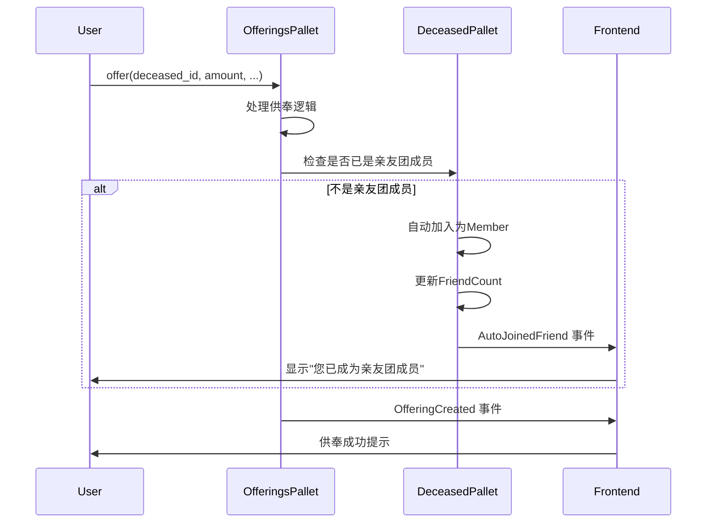
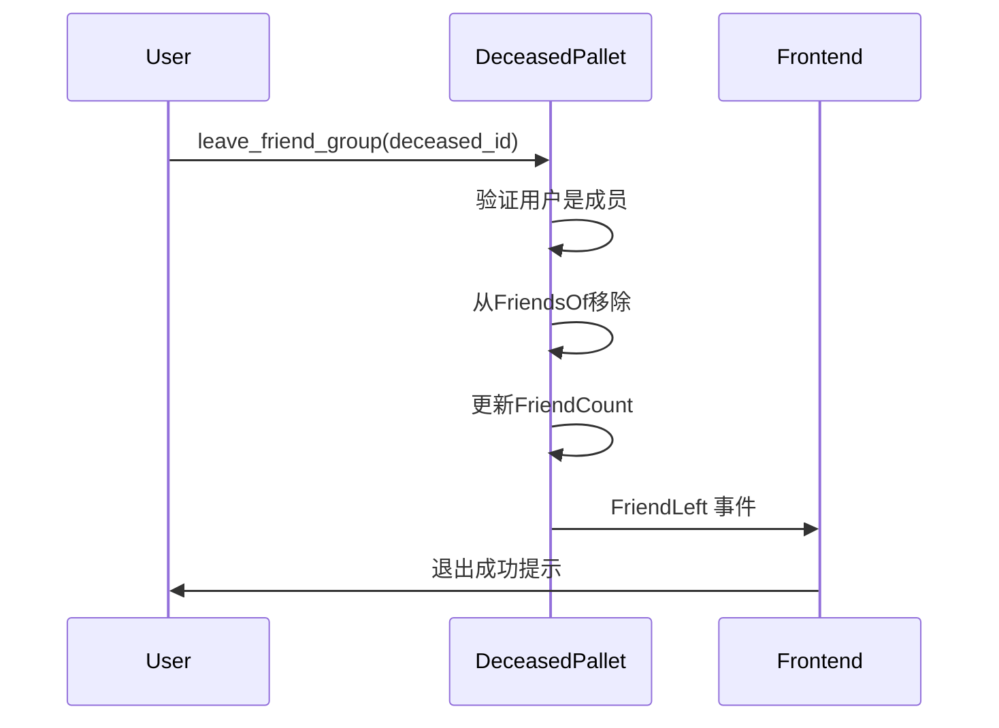
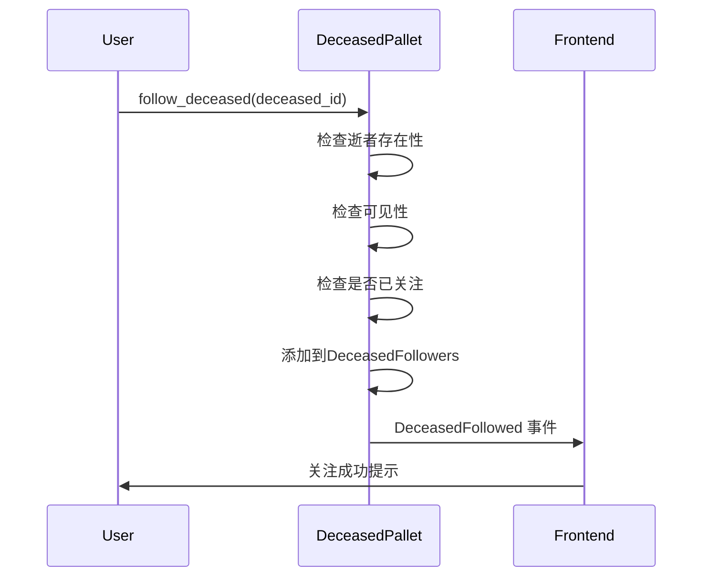
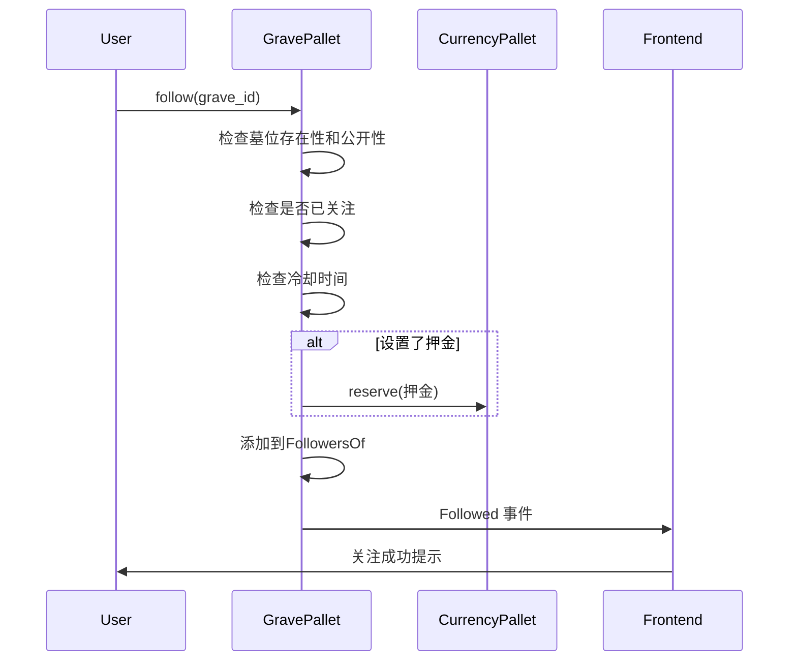

# 亲友团与关注功能设计方案

## 一、需求背景

### 核心需求
1. **自动加入亲友团**: 给逝者供奉过的用户自动成为亲友团成员
2. **自由退出**: 用户可以主动退出亲友团
3. **管理员删除**: 管理员可以移除亲友团成员
4. **关注功能**:
   - 可以关注逝者
   - 可以关注纪念馆(墓位)
   - 两者独立管理

### 业务价值
- **建立真实纪念关系**: 通过供奉行为筛选有意义的亲友关系
- **防刷机制**: 需要付出MEMO代币才能自动加入，避免恶意刷粉
- **灵活的社交功能**: 满足不同层次的关注需求

## 二、现状分析

### 2.1 pallet-deceased 现状
✅ **已有功能**:
- `FriendsOf`: 存储亲友团成员
- `FriendCount`: 统计成员数量
- `leave_friend_group()`: 退出亲友团
- `kick_friend()`: 管理员删除成员

❌ **缺失功能**:
- **没有自动加入机制**
- **没有关注功能**

### 2.2 pallet-stardust-grave 现状
❌ **关注功能已停用** (v9->v10迁移):
- `follow()`和`unfollow()`返回`PolicyViolation`错误
- 注释说明:"方案B: 亲友/关注统一回归逝者维度"
- 但旧关注数据仍保留在存储中

## 三、设计方案

### 3.1 整体架构

```
供奉自动加入亲友团 + 双轨关注系统

亲友团系统 (Deceased Pallet)
├── 自动加入: 供奉 → 自动成为Member
├── 自由退出: leave_friend_group()
├── 管理员删除: kick_friend()
└── 角色管理: Member(普通) / Core(核心)

关注系统 (双轨)
├── 逝者关注 (Deceased Pallet - 新增)
│   ├── follow_deceased() / unfollow_deceased()
│   ├── 无押金，纯社交功能
│   └── 关注特定逝者
│
└── 纪念馆关注 (Grave Pallet - 重新启用)
    ├── follow() / unfollow()
    ├── 可配置押金(T::FollowDeposit)
    └── 关注整个墓位/家族
```

### 3.2 核心设计原则

1. **亲友团 vs 关注的区别**:
   - **亲友团**: 需要供奉过，有实质纪念关系，可获得特殊权限
   - **关注**: 纯社交功能，无前置条件，无特殊权限

2. **双轨关注的意义**:
   - **逝者关注**: 关注特定的人，用于获取个人动态
   - **纪念馆关注**: 关注整个墓位/家族，用于获取墓地活动

3. **权限分离**:
   - 亲友团: owner是唯一管理者，可删除成员
   - 关注: 无需管理，用户完全自由

## 四、具体实现

### 4.1 deceased pallet 扩展

#### 新增存储结构

```rust
/// 函数级中文注释: 逝者的关注者列表
#[pallet::storage]
pub type DeceasedFollowers<T: Config> = StorageMap<
    _,
    Blake2_128Concat,
    T::DeceasedId,
    BoundedVec<T::AccountId, T::MaxFollowers>,
    ValueQuery,
>;

/// 函数级中文注释: 快速判断是否关注逝者
#[pallet::storage]
pub type IsDeceasedFollower<T: Config> = StorageDoubleMap<
    _,
    Blake2_128Concat,
    T::DeceasedId,
    Blake2_128Concat,
    T::AccountId,
    (),
    OptionQuery,
>;
```

#### 新增事件

```rust
/// 关注逝者
DeceasedFollowed {
    deceased_id: T::DeceasedId,
    who: T::AccountId
},

/// 取消关注逝者
DeceasedUnfollowed {
    deceased_id: T::DeceasedId,
    who: T::AccountId
},

/// 供奉自动加入亲友团
AutoJoinedFriend {
    deceased_id: T::DeceasedId,
    who: T::AccountId
},
```

#### 新增接口

```rust
/// 函数级详细中文注释: 关注逝者
/// - 任何人都可以关注公开的逝者
/// - 关注不需要押金(与墓位关注不同)
/// - 不自动加入亲友团
#[pallet::call_index(70)]
pub fn follow_deceased(
    origin: OriginFor<T>,
    deceased_id: T::DeceasedId,
) -> DispatchResult {
    let who = ensure_signed(origin)?;
    let deceased = DeceasedOf::<T>::get(deceased_id)
        .ok_or(Error::<T>::DeceasedNotFound)?;

    // 检查可见性
    let is_visible = VisibilityOf::<T>::get(deceased_id).unwrap_or(true);
    ensure!(is_visible, Error::<T>::NotAuthorized);

    // 检查是否已关注
    ensure!(
        !IsDeceasedFollower::<T>::contains_key(deceased_id, &who),
        Error::<T>::AlreadyFollowing
    );

    // 添加到关注列表
    DeceasedFollowers::<T>::try_mutate(deceased_id, |list| -> DispatchResult {
        list.try_push(who.clone())
            .map_err(|_| Error::<T>::FriendTooMany)?;
        Ok(())
    })?;

    IsDeceasedFollower::<T>::insert(deceased_id, &who, ());

    Self::deposit_event(Event::DeceasedFollowed { deceased_id, who });
    Ok(())
}

/// 函数级详细中文注释: 取消关注逝者
#[pallet::call_index(71)]
pub fn unfollow_deceased(
    origin: OriginFor<T>,
    deceased_id: T::DeceasedId,
) -> DispatchResult {
    let who = ensure_signed(origin)?;

    ensure!(
        IsDeceasedFollower::<T>::contains_key(deceased_id, &who),
        Error::<T>::NotFollowing
    );

    DeceasedFollowers::<T>::mutate(deceased_id, |list| {
        if let Some(pos) = list.iter().position(|x| x == &who) {
            list.swap_remove(pos);
        }
    });

    IsDeceasedFollower::<T>::remove(deceased_id, &who);

    Self::deposit_event(Event::DeceasedUnfollowed { deceased_id, who });
    Ok(())
}
```

### 4.2 offerings pallet 扩展

在 `pallet-memo-offerings` 的供奉接口中添加自动加入亲友团的逻辑：

```rust
// 在 offer() 函数中，供奉成功后添加以下逻辑:

// ⭐ 核心功能：供奉自动加入亲友团
if !<pallet_deceased::FriendsOf<T>>::contains_key(deceased_id, &who) {
    // 自动加入为普通成员
    let now = <frame_system::Pallet<T>>::block_number();
    let friend_record = pallet_deceased::FriendRecord {
        role: pallet_deceased::FriendRole::Member,
        since: now,
        note: Default::default(),
    };

    <pallet_deceased::FriendsOf<T>>::insert(
        deceased_id,
        &who,
        friend_record,
    );

    // 更新计数
    let count = <pallet_deceased::FriendCount<T>>::get(deceased_id);
    <pallet_deceased::FriendCount<T>>::insert(deceased_id, count + 1);

    // 发送自动加入事件
    <pallet_deceased::Pallet<T>>::deposit_event(
        pallet_deceased::Event::AutoJoinedFriend {
            deceased_id,
            who: who.clone()
        }
    );
}
```

### 4.3 grave pallet 关注功能重新启用

修改原有的 `follow()`/`unfollow()` 函数，去除 `PolicyViolation` 错误：

```rust
/// 函数级详细中文注释: 关注墓位(纪念馆)
/// - 重新启用关注功能
/// - 支持押金配置(可设为0)
/// - 检查墓位公开性
#[pallet::call_index(20)]
pub fn follow(origin: OriginFor<T>, id: u64) -> DispatchResult {
    let who = ensure_signed(origin)?;

    // 检查墓位存在
    let grave = Graves::<T>::get(id).ok_or(Error::<T>::NotFound)?;

    // 检查是否公开
    ensure!(grave.is_public, Error::<T>::PolicyViolation);

    // 检查是否已关注
    ensure!(
        !IsFollower::<T>::contains_key(id, &who),
        Error::<T>::AlreadyFollowing
    );

    // 检查冷却时间
    let now = <frame_system::Pallet<T>>::block_number();
    if let Some(last_action) = LastFollowAction::<T>::get(id, &who) {
        let cooldown = T::FollowCooldownBlocks::get();
        ensure!(
            now >= last_action.saturating_add(cooldown),
            Error::<T>::PolicyViolation
        );
    }

    // 处理押金(如果设置)
    let deposit = T::FollowDeposit::get();
    if !deposit.is_zero() {
        T::Currency::reserve(&who, deposit)
            .map_err(|_| Error::<T>::DepositFailed)?;
    }

    // 添加到关注列表
    let mut followers = FollowersOf::<T>::get(id);
    followers.try_push(who.clone())
        .map_err(|_| Error::<T>::CapacityExceeded)?;
    FollowersOf::<T>::insert(id, followers);

    IsFollower::<T>::insert(id, &who, ());
    LastFollowAction::<T>::insert(id, &who, now);

    Self::deposit_event(Event::Followed { id, who });
    Ok(())
}

/// 函数级详细中文注释: 取消关注墓位
#[pallet::call_index(21)]
pub fn unfollow(origin: OriginFor<T>, id: u64) -> DispatchResult {
    let who = ensure_signed(origin)?;

    ensure!(
        IsFollower::<T>::contains_key(id, &who),
        Error::<T>::NotFollowing
    );

    // 检查冷却时间
    let now = <frame_system::Pallet<T>>::block_number();
    if let Some(last_action) = LastFollowAction::<T>::get(id, &who) {
        let cooldown = T::FollowCooldownBlocks::get();
        ensure!(
            now >= last_action.saturating_add(cooldown),
            Error::<T>::PolicyViolation
        );
    }

    // 退还押金(如果有)
    let deposit = T::FollowDeposit::get();
    if !deposit.is_zero() {
        T::Currency::unreserve(&who, deposit);
    }

    FollowersOf::<T>::mutate(id, |list| {
        if let Some(pos) = list.iter().position(|x| x == &who) {
            list.swap_remove(pos);
        }
    });

    IsFollower::<T>::remove(id, &who);
    LastFollowAction::<T>::insert(id, &who, now);

    Self::deposit_event(Event::Unfollowed { id, who });
    Ok(())
}
```

## 五、配置参数

### 5.1 Runtime 配置

```rust
// runtime/src/lib.rs

impl pallet_deceased::Config for Runtime {
    // ... 现有配置

    /// 每个逝者最大关注者数量
    type MaxFollowers: Get<u32> = ConstU32<10000>;
}

impl pallet_stardust_grave::Config for Runtime {
    // ... 现有配置

    /// 关注押金 (建议设为0，无押金模式)
    type FollowDeposit: Get<Balance> = ConstU128<0>;

    /// 每个墓位最大关注者数量
    type MaxFollowers: Get<u32> = ConstU32<10000>;

    /// 关注操作冷却时间 (以块为单位)
    type FollowCooldownBlocks: Get<u32> = ConstU32<100>; // ~10分钟
}
```

### 5.2 存储容量规划

| 存储项 | 单项大小 | 预期容量 | 总容量估算 |
|--------|----------|----------|------------|
| DeceasedFollowers | ~320KB | 10000 items | ~3.2GB |
| IsDeceasedFollower | ~96B | 1M entries | ~96MB |
| FollowersOf | ~320KB | 10000 items | ~3.2GB |
| IsFollower | ~96B | 1M entries | ~96MB |

## 六、业务流程

### 6.1 供奉自动加入亲友团流程



### 6.2 用户主动退出亲友团流程



### 6.3 关注逝者流程



### 6.4 关注纪念馆流程



## 七、前端集成指南

### 7.1 事件监听

```javascript
// 监听供奉自动加入亲友团
api.query.system.events((events) => {
  events.forEach(({ event }) => {
    if (event.section === 'deceased' && event.method === 'AutoJoinedFriend') {
      const [deceasedId, who] = event.data;
      showNotification(`您已成为逝者 ${deceasedId} 的亲友团成员`);
    }
  });
});

// 监听关注逝者
api.query.system.events((events) => {
  events.forEach(({ event }) => {
    if (event.section === 'deceased' && event.method === 'DeceasedFollowed') {
      const [deceasedId, who] = event.data;
      updateFollowButton(deceasedId, true);
    }
  });
});
```

### 7.2 状态查询

```javascript
// 检查是否为亲友团成员
const isFriendMember = await api.query.deceased.friendsOf(deceasedId, userAccount);

// 检查是否关注逝者
const isFollowingDeceased = await api.query.deceased.isDeceasedFollower(deceasedId, userAccount);

// 检查是否关注纪念馆
const isFollowingGrave = await api.query.stardustGrave.isFollower(graveId, userAccount);

// 获取关注者列表
const deceasedFollowers = await api.query.deceased.deceasedFollowers(deceasedId);
const graveFollowers = await api.query.stardustGrave.followersOf(graveId);
```

### 7.3 交互接口

```javascript
// 关注逝者
const followDeceased = async (deceasedId) => {
  const tx = api.tx.deceased.followDeceased(deceasedId);
  await tx.signAndSend(userAccount, callback);
};

// 取消关注逝者
const unfollowDeceased = async (deceasedId) => {
  const tx = api.tx.deceased.unfollowDeceased(deceasedId);
  await tx.signAndSend(userAccount, callback);
};

// 关注纪念馆
const followGrave = async (graveId) => {
  const tx = api.tx.stardustGrave.follow(graveId);
  await tx.signAndSend(userAccount, callback);
};

// 退出亲友团
const leaveFriendGroup = async (deceasedId) => {
  const tx = api.tx.deceased.leaveFriendGroup(deceasedId);
  await tx.signAndSend(userAccount, callback);
};
```

## 八、测试用例

### 8.1 供奉自动加入测试

```rust
#[test]
fn test_auto_join_friend_on_offering() {
    ExtBuilder::default().build().execute_with(|| {
        // 创建逝者
        let deceased_id = create_test_deceased();

        // Alice供奉前不是亲友团成员
        assert!(!DeceasedFriendsOf::<Test>::contains_key(deceased_id, &ALICE));

        // Alice供奉
        assert_ok!(MemoOfferings::offer(
            Origin::signed(ALICE),
            deceased_id,
            100u128,
            // ...
        ));

        // Alice自动成为亲友团成员
        assert!(DeceasedFriendsOf::<Test>::contains_key(deceased_id, &ALICE));

        // 检查角色为Member
        let friend_record = DeceasedFriendsOf::<Test>::get(deceased_id, &ALICE).unwrap();
        assert_eq!(friend_record.role, FriendRole::Member);

        // 检查事件
        assert_last_event(Event::AutoJoinedFriend { deceased_id, who: ALICE }.into());
    });
}
```

### 8.2 关注功能测试

```rust
#[test]
fn test_follow_deceased() {
    ExtBuilder::default().build().execute_with(|| {
        let deceased_id = create_test_deceased();

        // Alice关注逝者
        assert_ok!(Deceased::follow_deceased(
            Origin::signed(ALICE),
            deceased_id
        ));

        // 验证关注状态
        assert!(IsDeceasedFollower::<Test>::contains_key(deceased_id, &ALICE));

        let followers = DeceasedFollowers::<Test>::get(deceased_id);
        assert!(followers.contains(&ALICE));

        // 检查事件
        assert_last_event(Event::DeceasedFollowed { deceased_id, who: ALICE }.into());
    });
}

#[test]
fn test_follow_grave() {
    ExtBuilder::default().build().execute_with(|| {
        let grave_id = create_test_grave();

        // Alice关注墓位
        assert_ok!(StardustGrave::follow(
            Origin::signed(ALICE),
            grave_id
        ));

        // 验证关注状态
        assert!(IsFollower::<Test>::contains_key(grave_id, &ALICE));

        let followers = FollowersOf::<Test>::get(grave_id);
        assert!(followers.contains(&ALICE));
    });
}
```

### 8.3 权限测试

```rust
#[test]
fn test_friend_management_permissions() {
    ExtBuilder::default().build().execute_with(|| {
        let deceased_id = create_test_deceased_owned_by(ALICE);

        // Alice作为owner可以删除Bob
        make_friend(deceased_id, BOB);
        assert_ok!(Deceased::kick_friend(
            Origin::signed(ALICE),
            deceased_id,
            BOB
        ));

        // Bob不能删除Charlie(非owner)
        make_friend(deceased_id, CHARLIE);
        assert_noop!(
            Deceased::kick_friend(
                Origin::signed(BOB),
                deceased_id,
                CHARLIE
            ),
            Error::<Test>::NotAuthorized
        );
    });
}
```

## 九、迁移策略

### 9.1 兼容性保证

1. **保留现有数据**: 不删除 `FollowersOf`/`IsFollower` 等存储
2. **旧关注关系**: 现有的关注关系保持有效，用户可继续取消关注
3. **新旧接口并存**: 新增接口不影响现有功能

### 9.2 迁移步骤

```rust
// 1. 部署新代码(包含新存储和接口)
// 2. 运行时升级触发迁移
// 3. 前端适配新接口

fn on_runtime_upgrade() -> Weight {
    let current = Pallet::<T>::in_code_storage_version();
    if current < 11 {
        // 重新启用关注功能无需特殊迁移
        // 仅更新存储版本
        STORAGE_VERSION.put::<Pallet<T>>();
        Weight::from_parts(1_000, 0)
    } else {
        Weight::zero()
    }
}
```

### 9.3 回退方案

如果出现问题，可以临时回退：

```rust
// 紧急回退：重新禁用关注功能
#[pallet::call_index(20)]
pub fn follow(origin: OriginFor<T>, id: u64) -> DispatchResult {
    let _ = ensure_signed(origin)?;
    let _ = id;
    Err(Error::<T>::PolicyViolation.into()) // 临时禁用
}
```

## 十、性能考虑

### 10.1 存储优化

1. **使用 BoundedVec**: 限制列表长度，防止状态膨胀
2. **双重索引**: `DeceasedFollowers` + `IsDeceasedFollower` 平衡查询性能
3. **冷却机制**: 防止频繁操作导致的垃圾数据

### 10.2 Gas 消耗

| 操作 | 预估 Weight | 说明 |
|------|-------------|------|
| 供奉自动加入 | +5,000 | 额外的存储写入 |
| follow_deceased | 15,000 | 新增关注逻辑 |
| follow (grave) | 20,000 | 包含押金处理 |
| unfollow | 10,000 | 移除操作较轻量 |

### 10.3 并发处理

- **无锁设计**: 关注操作独立，无竞态条件
- **幂等操作**: 重复关注/取消关注不会出错
- **事务安全**: 单个存储操作保证原子性

## 十一、安全考虑

### 11.1 防刷机制

1. **供奉门槛**: 需要付出 DUST 代币才能自动加入亲友团
2. **冷却时间**: 关注/取消关注有时间间隔限制
3. **容量限制**: 每个实体的关注者数量有上限

### 11.2 隐私保护

1. **可见性控制**: 私有逝者不允许关注
2. **权限检查**: 严格验证操作权限
3. **数据隔离**: 关注和亲友团数据分离存储

### 11.3 恶意行为防范

1. **押金机制**: 纪念馆关注可设置押金(可配置为0)
2. **黑名单功能**: 墓主可禁止特定用户关注
3. **管理员权限**: owner 可随时清理亲友团

## 十二、总结

### 12.1 方案优势

- ✅ **真实关系建立**: 通过供奉行为筛选有意义的亲友关系
- ✅ **灵活的社交系统**: 双轨关注满足不同层次需求
- ✅ **用户体验优化**: 自动加入 + 自由退出的流畅体验
- ✅ **防刷机制完善**: 经济门槛 + 技术限制双重保障
- ✅ **兼容性良好**: 最小化对现有代码的影响
- ✅ **可扩展性强**: 为后续功能留下充足接口空间

### 12.2 实施建议

1. **分阶段部署**:
   - Phase 1: deceased 关注功能 + 供奉自动加入
   - Phase 2: grave 关注功能重新启用
   - Phase 3: 前端 UI 完善和优化

2. **参数调优**:
   - 初期设置较大的容量上限 (10000)
   - 关注押金建议设为 0 降低门槛
   - 冷却时间设为 100 块 (~10分钟) 防止滥用

3. **监控指标**:
   - 亲友团成员增长趋势
   - 关注/取消关注操作频率
   - 存储空间占用情况
   - 用户活跃度变化

### 12.3 后续优化方向

1. **智能推荐**: 基于关注关系推荐相关逝者/纪念馆
2. **社交功能增强**: 亲友团内部消息、活动通知等
3. **隐私设置**: 更细粒度的可见性控制
4. **数据分析**: 关注行为的统计分析和可视化