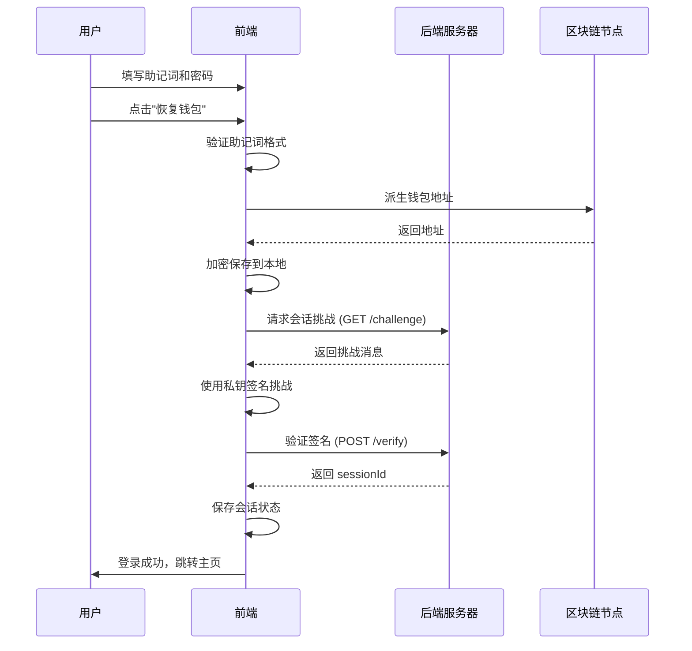

# 会话建立失败问题解决方案

> ⚠️ **文档状态：已过时**  
> 本问题已通过**架构变更**彻底解决（2025-11-08）  
> 新架构不再依赖自定义后端（8787端口），改为纯前端+链上实现  
> 详见：[架构变更-移除自定义后端.md](./架构变更-移除自定义后端.md)

---

## 📋 问题描述（历史记录）

在使用恢复钱包功能时，用户遇到错误提示：**"会话建立失败，请稍后重试"**

### 错误截图位置
- 页面：恢复钱包页面 (`RestoreWalletPage`)
- 触发时机：填写完助记词和密码，点击"恢复钱包"按钮后
- 错误类型：会话创建失败

### ✅ 已解决
**解决方案**: 移除对自定义后端的依赖，改为纯前端会话管理  
**实施日期**: 2025-11-08  
**状态**: 问题已彻底解决，本文档保留作为历史参考

## 🔍 根本原因分析

### 1. 技术栈架构

Stardust DApp 采用前后端分离架构：
- **前端**: React + TypeScript + Vite (端口 5173)
- **区块链节点**: Substrate (端口 9944)
- **后端服务器**: 会话管理和认证 (端口 8787)

### 2. 会话建立流程



### 3. 错误发生点

**问题**: 后端服务器 (http://127.0.0.1:8787) **未运行**

执行流程：
```
sessionManager.createSession(address)
  └─> handshakeWithBackend(address)
      └─> fetch('http://127.0.0.1:8787/challenge')
          └─> ❌ 连接失败 (ECONNREFUSED)
          └─> 返回 { error: 'NETWORK_UNREACHABLE' }
  └─> 检查 result?.sessionId
      └─> ❌ sessionId 为空
  └─> 检查开发模式
      └─> import.meta.env.DEV = undefined
      └─> import.meta.env.VITE_ALLOW_DEV_SESSION = undefined
      └─> ❌ 不创建 dev session
  └─> 返回 null
  
RestoreWalletPage.handleRestore()
  └─> session === null
  └─> 再次检查开发模式 ❌ 失败
  └─> 抛出错误: "会话建立失败，请稍后重试"
```

## 解决方案

### ✅ 方案一：启用开发模式（推荐）

**适用场景**: 开发、测试环境，后端服务器暂未部署

**步骤**:

1. 在前端项目根目录创建 `.env` 文件（已完成）:

```bash
cd /home/xiaodong/文档/stardust/stardust-dapp
cat .env
```

2. 重启前端开发服务器:

```bash
# 先停止当前运行的服务器 (Ctrl+C)
npm run dev
```

3. 测试登录功能:
   - 访问 http://localhost:5173
   - 点击"恢复钱包"
   - 填写助记词（12或24个词）和密码
   - 点击"恢复钱包"按钮
   - 查看控制台日志确认使用了 dev session

**开发模式会话特征**:
- `sessionId` 格式: `dev-{address}-{timestamp}`
- `allowances.mock = true` (表示模拟授权)
- 24小时有效期
- 仅保存在本地浏览器

### ⚙️ 方案二：启动后端服务器

**适用场景**: 生产环境，完整功能测试

**要求**:
- 需要独立的后端服务器项目
- 实现以下 API 端点:
  - `GET /challenge?address={address}` - 获取挑战消息
  - `POST /verify` - 验证签名并创建会话

**后端 API 规范**:

1. **获取挑战** (`GET /challenge`):
```json
// Request
GET /challenge?address=5GrwvaEF5zXb26Fz9rcQpDWS57CtERHpNehXCPcNoHGKutQY

// Response
{
  "id": "challenge-uuid-123",
  "message": "Sign this message to authenticate: {timestamp}",
  "expiresAt": 1699876543210
}
```

2. **验证签名** (`POST /verify`):
```json
// Request
POST /verify
{
  "address": "5GrwvaEF5zXb26Fz9rcQpDWS57CtERHpNehXCPcNoHGKutQY",
  "signature": "0x123abc...",
  "challengeId": "challenge-uuid-123",
  "timestamp": 1699876543210
}

// Response (成功)
{
  "sessionId": "session-uuid-456",
  "allowances": {
    "maxTransactions": 100,
    "maxAmount": "1000000000000"
  }
}

// Response (失败)
{
  "error": "INVALID_SIGNATURE",
  "message": "Signature verification failed"
}
```

### 🔧 方案三：前端代码优化（备选）

如果项目计划长期使用开发模式，可以优化代码逻辑：

**修改 `RestoreWalletPage.tsx`**:

```typescript
// 创建会话 - 优化后的逻辑
let session = await sessionManager.createSession(addr);

// 开发环境自动降级
if (!session) {
  console.warn('会话创建失败，尝试使用开发模式');
  try {
    session = sessionManager.forceCreateDevSession(addr);
    console.log('✅ 开发模式会话已创建');
  } catch (error) {
    console.error('开发模式会话创建失败:', error);
    throw new Error('会话建立失败，请稍后重试');
  }
}

// 成功回调
onSuccess?.(addr);
```

## 📊 验证步骤

### 1. 检查环境变量

```bash
cd /home/xiaodong/文档/stardust/stardust-dapp
cat .env | grep VITE_ALLOW_DEV_SESSION
```

应该输出: `VITE_ALLOW_DEV_SESSION=1`

### 2. 检查前端服务器

```bash
lsof -nP -iTCP:5173 -sTCP:LISTEN
```

应该有进程在监听 5173 端口

### 3. 检查区块链节点

```bash
lsof -nP -iTCP:9944 -sTCP:LISTEN
```

应该有进程在监听 9944 端口

### 4. 测试登录流程

打开浏览器控制台 (F12)，观察以下日志：

```javascript
// 成功的开发模式日志
[session] createSession start {address: "5Grw..."}
[session] handshake result {error: "NETWORK_UNREACHABLE"}
[session] no sessionId, using dev fallback
[session] session created {expiresAt: 1699876543210}

// 表单状态日志
🔍 表单状态: {
  mnemonicWords: 12,
  passwordLength: 8,
  confirmPasswordLength: 8,
  passwordMatch: true,
  canSubmit: true
}
```

## 🐛 常见问题

### Q1: 重启后还是报错？

**A**: 确保以下几点：
1. `.env` 文件在正确的位置 (`stardust-dapp/.env`)
2. 前端开发服务器已完全重启
3. 清除浏览器缓存并刷新页面 (Ctrl+Shift+R)

### Q2: 开发模式的会话安全吗？

**A**: 开发模式会话仅适用于开发/测试环境：
- ✅ 钱包助记词仍然加密保存在本地
- ✅ 私钥永不离开浏览器
- ❌ 会话未经后端验证
- ❌ 没有真实的授权额度限制
- ⚠️ **不要在生产环境使用开发模式**

### Q3: 如何区分开发会话和正式会话？

**A**: 查看控制台或检查 sessionId 格式：
- 开发会话: `dev-{address}-{timestamp}`
- 正式会话: 后端生成的 UUID
- 检查 allowances: `{mock: true}` 表示开发模式

### Q4: 后端服务器在哪里？

**A**: 当前项目中**没有包含后端服务器**的实现。后端服务器需要：
- 独立部署
- 实现挑战-响应认证机制
- 提供会话管理功能

建议使用以下技术栈开发后端：
- Node.js + Express
- Python + FastAPI
- Rust + Actix-web

## 📚 相关文件

### 核心文件

- **会话管理器**: `stardust-dapp/src/lib/sessionManager.ts`
- **后端接口**: `stardust-dapp/src/lib/backend.ts`
- **应用配置**: `stardust-dapp/src/lib/config.ts`
- **恢复钱包页面**: `stardust-dapp/src/features/auth/RestoreWalletPage.tsx`

### 配置文件

- **环境变量**: `stardust-dapp/.env` (新创建)
- **包配置**: `stardust-dapp/package.json`
- **Vite 配置**: `stardust-dapp/vite.config.ts`

## 🔄 更新日志

### 2025-11-08
- ✅ 诊断并定位问题根源：后端服务器未运行
- ✅ 创建 `.env` 文件启用开发模式
- ✅ 添加调试日志到 `RestoreWalletPage.tsx`
- ✅ 编写完整的问题分析和解决方案文档

## 🚀 下一步行动

### 短期（开发阶段）
- [x] 启用开发模式绕过后端验证
- [ ] 测试完整的登录流程
- [ ] 验证会话持久化功能
- [ ] 测试会话过期和自动刷新

### 中期（测试阶段）
- [ ] 设计后端 API 规范
- [ ] 开发后端认证服务
- [ ] 集成后端服务到开发环境
- [ ] 完整端到端测试

### 长期（生产阶段）
- [ ] 部署后端服务器到生产环境
- [ ] 配置负载均衡和容错
- [ ] 实施会话安全审计
- [ ] 监控和日志系统

---

**维护者**: Stardust 开发团队  
**文档版本**: 1.0.0  
**最后更新**: 2025-11-08

