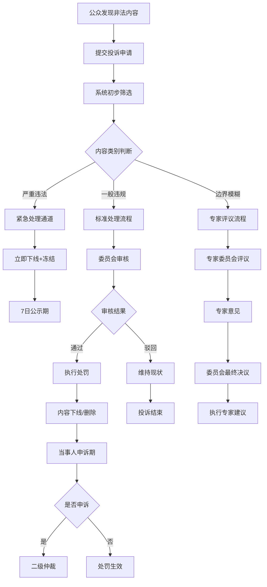

# 公众投诉治理机制设计方案

## 执行摘要

本方案设计了一套完整的公众投诉治理机制，用于处理墓地、陵园、逝者内容中的非法信息。该机制基于现有的申诉系统(`pallet-stardust-appeals`)、仲裁系统(`pallet-arbitration`)和证据系统(`pallet-evidence`)，提供了从内容举报、审核、处罚到申诉的完整治理流程，既保护了公众利益，也保障了内容创建者的合法权益。

## 1. 问题背景分析

### 1.1 非法内容风险

在纪念园区系统中，用户可能上传以下类型的非法内容：

#### 🚫 严重违法内容
- **虚假身份信息**: 冒用他人身份创建虚假逝者档案
- **诽谤诬陷**: 恶意中伤、散布不实信息损害他人名誉
- **违法犯罪信息**: 涉及暴力、恐怖主义、非法组织等内容
- **侵权内容**: 未经授权使用他人照片、文字、音频等

#### ⚠️ 不当内容
- **商业广告**: 在纪念内容中植入商业信息
- **政治宣传**: 利用纪念平台进行政治活动
- **迷信邪教**: 传播封建迷信、邪教思想
- **低俗内容**: 不符合纪念场所庄严性的内容

#### 🔍 边界模糊内容
- **争议性历史人物**: 对历史人物评价存在分歧
- **宗教信仰冲突**: 不同宗教背景的纪念方式差异
- **文化价值观冲突**: 不同文化背景的价值观差异

### 1.2 当前系统能力

基于代码分析，当前系统已具备以下基础能力：

#### 现有组件
- **申诉系统**: 支持多域申诉（墓地、逝者、媒体等）
- **证据管理**: 统一的证据存储和引用机制
- **仲裁框架**: 双向押金、多方参与的争议解决
- **治理委员会**: 内容审核和决策机构

#### 技术基础
```rust
// 当前支持的申诉域
Domain 1: 墓地 (Grave)
Domain 2: 逝者档案 (Deceased)
Domain 3: 逝者文本 (Deceased Text)
Domain 4: 逝者媒体 (Deceased Media)
Domain 5: 供奉品 (Offerings)
Domain 6: 园区 (Park)

// 当前支持的操作类型
Action 1: 设置可见性
Action 4: 转移所有权
Action 20: 移除悼词
// ... 更多操作
```

## 2. 公众投诉治理机制设计

### 2.1 整体架构



### 2.2 投诉分类体系

#### 2.2.1 按严重程度分级

```rust
#[derive(Encode, Decode, Clone, PartialEq, Eq, TypeInfo, MaxEncodedLen)]
pub enum ComplaintSeverity {
    /// 紧急：严重违法，需要立即处理
    Critical = 1,
    /// 重要：明显违规，需要快速处理
    Major = 2,
    /// 一般：疑似违规，需要审核确认
    Minor = 3,
    /// 边界：存在争议，需要专家评议
    Disputed = 4,
}

#[derive(Encode, Decode, Clone, PartialEq, Eq, TypeInfo, MaxEncodedLen)]
pub enum ComplaintType {
    /// 身份造假
    FakeIdentity,
    /// 诽谤诬陷
    Defamation,
    /// 侵犯版权
    CopyrightViolation,
    /// 商业广告
    CommercialAd,
    /// 政治宣传
    PoliticalPropaganda,
    /// 迷信邪教
    Superstition,
    /// 低俗内容
    InappropriateContent,
    /// 其他违规
    Other,
}
```

#### 2.2.2 处理时效要求

```rust
#[pallet::constant]
pub struct ComplaintTimeframes;

impl ComplaintTimeframes {
    /// 紧急投诉处理时限（2小时）
    pub const CRITICAL_RESPONSE_HOURS: u32 = 2;
    /// 重要投诉处理时限（24小时）
    pub const MAJOR_RESPONSE_HOURS: u32 = 24;
    /// 一般投诉处理时限（72小时）
    pub const MINOR_RESPONSE_HOURS: u32 = 72;
    /// 争议投诉处理时限（7天）
    pub const DISPUTED_RESPONSE_DAYS: u32 = 7;
    /// 公示期时长（7天）
    pub const PUBLIC_NOTICE_DAYS: u32 = 7;
    /// 申诉期时长（15天）
    pub const APPEAL_PERIOD_DAYS: u32 = 15;
}
```

### 2.3 投诉提交机制

#### 2.3.1 投诉入口设计

```rust
#[pallet::call_index(30)]
#[pallet::weight(T::WeightInfo::submit_public_complaint())]
pub fn submit_public_complaint(
    origin: OriginFor<T>,
    /// 投诉目标域 (1=Grave, 2=Deceased, 等)
    target_domain: u8,
    /// 目标ID (grave_id, deceased_id, 等)
    target_id: u64,
    /// 违规类型
    complaint_type: ComplaintType,
    /// 严重程度（系统根据类型自动判断，用户可以建议）
    suggested_severity: Option<ComplaintSeverity>,
    /// 投诉理由描述
    reason_cid: BoundedVec<u8, T::MaxCidLen>,
    /// 证据材料CID列表
    evidence_cids: BoundedVec<BoundedVec<u8, T::MaxCidLen>, ConstU32<10>>,
    /// 联系方式（加密存储，仅审核人员可见）
    contact_info: Option<BoundedVec<u8, T::MaxContactLen>>,
) -> DispatchResult {
    let complainant = ensure_signed(origin)?;

    // 1. 基础验证
    ensure!(!reason_cid.is_empty(), Error::<T>::ReasonRequired);
    ensure!(!evidence_cids.is_empty(), Error::<T>::EvidenceRequired);

    // 2. 限频检查（防止恶意投诉）
    Self::check_complaint_frequency(&complainant)?;

    // 3. 自动分级（基于投诉类型和内容分析）
    let severity = Self::determine_complaint_severity(
        complaint_type.clone(),
        suggested_severity,
        &target_domain,
        target_id,
    )?;

    // 4. 计算押金（根据严重程度调整）
    let deposit = Self::calc_complaint_deposit(severity.clone())?;

    // 5. 锁定押金
    T::Fungible::hold(
        &T::RuntimeHoldReason::from(HoldReason::Complaint),
        &complainant,
        deposit,
    )?;

    // 6. 创建投诉记录
    let complaint_id = Self::create_complaint_record(
        complainant.clone(),
        target_domain,
        target_id,
        complaint_type,
        severity.clone(),
        reason_cid,
        evidence_cids,
        contact_info,
        deposit,
    )?;

    // 7. 触发自动处理流程
    Self::trigger_complaint_processing(complaint_id, severity)?;

    Self::deposit_event(Event::PublicComplaintSubmitted {
        complaint_id,
        complainant,
        target_domain,
        target_id,
        complaint_type,
        severity,
    });

    Ok(())
}
```

#### 2.3.2 智能分级算法

```rust
impl<T: Config> Pallet<T> {
    /// 智能确定投诉严重程度
    fn determine_complaint_severity(
        complaint_type: ComplaintType,
        suggested: Option<ComplaintSeverity>,
        domain: &u8,
        target_id: u64,
    ) -> Result<ComplaintSeverity, Error<T>> {

        // 基础分级规则
        let base_severity = match complaint_type {
            ComplaintType::FakeIdentity => ComplaintSeverity::Critical,
            ComplaintType::Defamation => ComplaintSeverity::Major,
            ComplaintType::CopyrightViolation => ComplaintSeverity::Major,
            ComplaintType::CommercialAd => ComplaintSeverity::Minor,
            ComplaintType::PoliticalPropaganda => ComplaintSeverity::Minor,
            ComplaintType::Superstition => ComplaintSeverity::Minor,
            ComplaintType::InappropriateContent => ComplaintSeverity::Minor,
            ComplaintType::Other => ComplaintSeverity::Minor,
        };

        // 内容影响力调整
        let content_influence = Self::assess_content_influence(*domain, target_id)?;
        let adjusted_severity = match (base_severity, content_influence) {
            // 高影响力内容升级处理
            (ComplaintSeverity::Minor, InfluenceLevel::High) => ComplaintSeverity::Major,
            (ComplaintSeverity::Major, InfluenceLevel::High) => ComplaintSeverity::Critical,
            // 低影响力内容可以降级
            (ComplaintSeverity::Major, InfluenceLevel::Low) => ComplaintSeverity::Minor,
            // 其他情况保持原级别
            (severity, _) => severity,
        };

        // 历史记录调整
        let target_history = Self::get_violation_history(*domain, target_id)?;
        let final_severity = if target_history.violation_count > 3 {
            // 累犯升级处理
            match adjusted_severity {
                ComplaintSeverity::Minor => ComplaintSeverity::Major,
                ComplaintSeverity::Major => ComplaintSeverity::Critical,
                other => other,
            }
        } else {
            adjusted_severity
        };

        Ok(final_severity)
    }

    /// 评估内容影响力
    fn assess_content_influence(
        domain: u8,
        target_id: u64,
    ) -> Result<InfluenceLevel, Error<T>> {
        match domain {
            1 => {
                // 墓地影响力：基于访问量、供奉数、关注度
                let grave_stats = T::GraveStatsProvider::get_stats(target_id)?;
                Ok(match grave_stats.total_visitors {
                    n if n > 10000 => InfluenceLevel::High,
                    n if n > 1000 => InfluenceLevel::Medium,
                    _ => InfluenceLevel::Low,
                })
            },
            2 => {
                // 逝者档案影响力：基于知名度、媒体关注等
                let deceased_profile = T::DeceasedProfileProvider::get_profile(target_id)?;
                Ok(Self::calculate_deceased_influence(&deceased_profile))
            },
            _ => Ok(InfluenceLevel::Low),
        }
    }
}

#[derive(Encode, Decode, Clone, PartialEq, Eq, TypeInfo)]
pub enum InfluenceLevel {
    Low,
    Medium,
    High,
}
```

### 2.4 审核处理流程

#### 2.4.1 紧急处理通道

```rust
/// 紧急投诉自动处理
fn handle_critical_complaint(complaint_id: u64) -> DispatchResult {
    let complaint = Complaints::<T>::get(complaint_id)
        .ok_or(Error::<T>::ComplaintNotFound)?;

    // 1. 立即标记内容为"审核中"状态
    Self::set_content_under_review(
        complaint.target_domain,
        complaint.target_id,
        true,
    )?;

    // 2. 自动限制内容可见性（仅创建者可见）
    T::ContentVisibilityController::set_visibility(
        complaint.target_domain,
        complaint.target_id,
        VisibilityLevel::Private,
    )?;

    // 3. 通知紧急响应团队
    Self::notify_emergency_team(complaint_id)?;

    // 4. 设置加速审核时间表
    let review_deadline = Self::current_block() + T::CriticalReviewBlocks::get();
    ComplaintSchedule::<T>::insert(complaint_id, review_deadline);

    // 5. 记录紧急处理日志
    Self::deposit_event(Event::EmergencyActionTaken {
        complaint_id,
        action: EmergencyAction::ContentHidden,
        reviewer: Self::get_system_account(),
    });

    Ok(())
}
```

#### 2.4.2 委员会审核流程

```rust
#[pallet::call_index(31)]
#[pallet::weight(T::WeightInfo::committee_review_complaint())]
pub fn committee_review_complaint(
    origin: OriginFor<T>,
    complaint_id: u64,
    decision: ReviewDecision,
    reasoning: BoundedVec<u8, T::MaxReasoningLen>,
    recommended_action: Option<PunishmentAction>,
) -> DispatchResult {
    // 1. 验证审核权限
    let reviewer = ensure_signed(origin)?;
    ensure!(
        T::CommitteeManager::is_active_member(&reviewer),
        Error::<T>::NotCommitteeMember
    );

    // 2. 检查是否已审核
    ensure!(
        !ReviewRecords::<T>::contains_key(complaint_id, &reviewer),
        Error::<T>::AlreadyReviewed
    );

    let mut complaint = Complaints::<T>::get(complaint_id)
        .ok_or(Error::<T>::ComplaintNotFound)?;

    // 3. 记录个人审核意见
    let review_record = ReviewRecord {
        reviewer: reviewer.clone(),
        decision: decision.clone(),
        reasoning: reasoning.clone(),
        recommended_action: recommended_action.clone(),
        reviewed_at: Self::current_block(),
    };

    ReviewRecords::<T>::insert(complaint_id, &reviewer, review_record);

    // 4. 更新投诉统计
    complaint.reviews_received += 1;
    match decision {
        ReviewDecision::Uphold => complaint.uphold_votes += 1,
        ReviewDecision::Reject => complaint.reject_votes += 1,
        ReviewDecision::NeedMoreInfo => complaint.info_requests += 1,
    }

    // 5. 检查是否达到决议条件
    if Self::has_sufficient_reviews(complaint_id) {
        let final_decision = Self::calculate_committee_consensus(complaint_id)?;
        Self::execute_committee_decision(complaint_id, final_decision)?;
    }

    Complaints::<T>::insert(complaint_id, complaint);

    Self::deposit_event(Event::CommitteeReviewSubmitted {
        complaint_id,
        reviewer,
        decision,
    });

    Ok(())
}

/// 计算委员会共识
fn calculate_committee_consensus(complaint_id: u64) -> Result<CommitteeDecision, Error<T>> {
    let complaint = Complaints::<T>::get(complaint_id)
        .ok_or(Error::<T>::ComplaintNotFound)?;

    let total_votes = complaint.uphold_votes + complaint.reject_votes;
    let uphold_percentage = (complaint.uphold_votes * 100) / total_votes;

    let decision = match uphold_percentage {
        p if p >= 67 => CommitteeDecision::StrongUphold,  // 2/3多数支持
        p if p >= 51 => CommitteeDecision::WeakUphold,    // 简单多数支持
        p if p <= 33 => CommitteeDecision::StrongReject,  // 2/3多数反对
        _ => CommitteeDecision::WeakReject,                // 简单多数反对
    };

    Ok(decision)
}
```

#### 2.4.3 专家评议机制

```rust
#[derive(Encode, Decode, Clone, PartialEq, Eq, TypeInfo, MaxEncodedLen)]
pub enum ExpertDomain {
    /// 法律专家
    Legal,
    /// 文化专家
    Cultural,
    /// 宗教专家
    Religious,
    /// 历史专家
    Historical,
    /// 心理学专家
    Psychological,
    /// 技术专家
    Technical,
}

/// 专家评议流程
#[pallet::call_index(32)]
pub fn expert_evaluation(
    origin: OriginFor<T>,
    complaint_id: u64,
    expert_domain: ExpertDomain,
    evaluation: ExpertEvaluation,
    confidence_level: u8,  // 1-100
) -> DispatchResult {
    let expert = ensure_signed(origin)?;

    // 验证专家资格
    ensure!(
        T::ExpertRegistry::is_qualified_expert(&expert, &expert_domain),
        Error::<T>::NotQualifiedExpert
    );

    // 检查利益冲突
    ensure!(
        !Self::has_conflict_of_interest(&expert, complaint_id)?,
        Error::<T>::ConflictOfInterest
    );

    let evaluation_record = ExpertEvaluationRecord {
        expert: expert.clone(),
        domain: expert_domain,
        evaluation,
        confidence_level,
        evaluation_date: Self::current_block(),
        reasoning: evaluation.reasoning.clone(),
    };

    // 存储专家意见
    ExpertEvaluations::<T>::insert(complaint_id, &expert, evaluation_record);

    // 检查是否收集到足够的专家意见
    if Self::has_sufficient_expert_opinions(complaint_id) {
        let expert_consensus = Self::synthesize_expert_opinions(complaint_id)?;
        Self::forward_to_final_review(complaint_id, expert_consensus)?;
    }

    Self::deposit_event(Event::ExpertEvaluationSubmitted {
        complaint_id,
        expert,
        domain: expert_domain,
        confidence: confidence_level,
    });

    Ok(())
}
```

### 2.5 处罚执行机制

#### 2.5.1 处罚等级体系

```rust
#[derive(Encode, Decode, Clone, PartialEq, Eq, TypeInfo, MaxEncodedLen)]
pub enum PunishmentLevel {
    /// 警告（记录在案，无实质影响）
    Warning,
    /// 内容隐藏（设为私有，仅创建者可见）
    ContentHidden,
    /// 内容删除（彻底移除，不可恢复）
    ContentDeleted,
    /// 账户限制（限制创建新内容）
    AccountRestricted(u32), // 限制天数
    /// 账户封禁（完全禁止访问）
    AccountBanned(u32), // 封禁天数
    /// 永久封禁
    PermanentBan,
}

#[derive(Encode, Decode, Clone, PartialEq, Eq, TypeInfo, MaxEncodedLen)]
pub struct PunishmentAction {
    /// 处罚等级
    pub level: PunishmentLevel,
    /// 生效时间
    pub effective_date: BlockNumber,
    /// 持续时间（对于临时处罚）
    pub duration: Option<BlockNumber>,
    /// 处罚理由
    pub reason: BoundedVec<u8, ConstU32<512>>,
    /// 是否可申诉
    pub appealable: bool,
}

/// 执行处罚决定
fn execute_punishment(
    target_domain: u8,
    target_id: u64,
    owner: &T::AccountId,
    punishment: PunishmentAction,
) -> DispatchResult {
    match punishment.level {
        PunishmentLevel::Warning => {
            // 记录警告，发送通知
            Self::record_warning(target_domain, target_id, owner, &punishment)?;
            Self::notify_owner(owner, NotificationType::Warning, &punishment.reason)?;
        },

        PunishmentLevel::ContentHidden => {
            // 隐藏内容
            T::ContentVisibilityController::set_visibility(
                target_domain,
                target_id,
                VisibilityLevel::Private,
            )?;
            Self::record_punishment(target_domain, target_id, owner, &punishment)?;
        },

        PunishmentLevel::ContentDeleted => {
            // 删除内容（需要备份用于申诉）
            Self::backup_content_for_appeal(target_domain, target_id)?;
            T::ContentManager::delete_content(target_domain, target_id)?;
            Self::record_punishment(target_domain, target_id, owner, &punishment)?;
        },

        PunishmentLevel::AccountRestricted(days) => {
            // 限制账户创建权限
            let until_block = Self::current_block() +
                T::BlocksPerDay::get() * days.into();
            T::AccountManager::restrict_account(owner, until_block)?;
            Self::record_punishment(target_domain, target_id, owner, &punishment)?;
        },

        PunishmentLevel::AccountBanned(days) => {
            // 封禁账户
            let until_block = Self::current_block() +
                T::BlocksPerDay::get() * days.into();
            T::AccountManager::ban_account(owner, until_block)?;
            Self::record_punishment(target_domain, target_id, owner, &punishment)?;
        },

        PunishmentLevel::PermanentBan => {
            // 永久封禁
            T::AccountManager::permanent_ban(owner)?;
            Self::record_punishment(target_domain, target_id, owner, &punishment)?;
        },
    }

    // 发送处罚通知
    Self::notify_punishment_executed(target_domain, target_id, owner, &punishment)?;

    Ok(())
}
```

#### 2.5.2 处罚决定逻辑

```rust
/// 根据违规类型和历史记录确定处罚等级
fn determine_punishment_level(
    complaint_type: ComplaintType,
    content_influence: InfluenceLevel,
    violation_history: &ViolationHistory,
    committee_consensus: CommitteeDecision,
) -> PunishmentAction {

    // 基础处罚等级
    let base_level = match complaint_type {
        ComplaintType::FakeIdentity => PunishmentLevel::ContentDeleted,
        ComplaintType::Defamation => PunishmentLevel::ContentHidden,
        ComplaintType::CopyrightViolation => PunishmentLevel::ContentDeleted,
        ComplaintType::CommercialAd => PunishmentLevel::ContentHidden,
        ComplaintType::PoliticalPropaganda => PunishmentLevel::Warning,
        ComplaintType::Superstition => PunishmentLevel::Warning,
        ComplaintType::InappropriateContent => PunishmentLevel::ContentHidden,
        ComplaintType::Other => PunishmentLevel::Warning,
    };

    // 根据委员会共识调整
    let consensus_adjusted = match (base_level, committee_consensus) {
        (level, CommitteeDecision::StrongUphold) => level, // 保持原判
        (PunishmentLevel::ContentDeleted, CommitteeDecision::WeakUphold) =>
            PunishmentLevel::ContentHidden, // 降级
        (PunishmentLevel::ContentHidden, CommitteeDecision::WeakUphold) =>
            PunishmentLevel::Warning, // 降级
        (level, CommitteeDecision::WeakReject) =>
            PunishmentLevel::Warning, // 大幅降级
        (_, CommitteeDecision::StrongReject) => return Self::create_dismissal(), // 驳回
    };

    // 根据历史记录升级
    let history_adjusted = match (consensus_adjusted, violation_history.violation_count) {
        (PunishmentLevel::Warning, count) if count >= 3 =>
            PunishmentLevel::ContentHidden,
        (PunishmentLevel::ContentHidden, count) if count >= 3 =>
            PunishmentLevel::AccountRestricted(7), // 限制7天
        (PunishmentLevel::ContentDeleted, count) if count >= 3 =>
            PunishmentLevel::AccountRestricted(30), // 限制30天
        (level, count) if count >= 5 =>
            PunishmentLevel::AccountBanned(30), // 封禁30天
        (level, count) if count >= 10 =>
            PunishmentLevel::PermanentBan, // 永久封禁
        (level, _) => level,
    };

    // 根据内容影响力调整
    let final_level = match (history_adjusted, content_influence) {
        (PunishmentLevel::Warning, InfluenceLevel::High) =>
            PunishmentLevel::ContentHidden,
        (PunishmentLevel::ContentHidden, InfluenceLevel::High) =>
            PunishmentLevel::ContentDeleted,
        (level, _) => level,
    };

    PunishmentAction {
        level: final_level,
        effective_date: Self::current_block(),
        duration: Self::get_punishment_duration(&final_level),
        reason: Self::generate_punishment_reason(&complaint_type, &committee_consensus),
        appealable: matches!(final_level,
            PunishmentLevel::ContentHidden |
            PunishmentLevel::ContentDeleted |
            PunishmentLevel::AccountRestricted(_) |
            PunishmentLevel::AccountBanned(_)
        ),
    }
}
```

### 2.6 申诉救济机制

#### 2.6.1 申诉权利保护

```rust
/// 被处罚方申诉处罚决定
#[pallet::call_index(33)]
#[pallet::weight(T::WeightInfo::appeal_punishment())]
pub fn appeal_punishment(
    origin: OriginFor<T>,
    original_complaint_id: u64,
    appeal_reason: BoundedVec<u8, T::MaxAppealReasonLen>,
    new_evidence: Option<BoundedVec<BoundedVec<u8, T::MaxCidLen>, ConstU32<5>>>,
    request_hearing: bool,
) -> DispatchResult {
    let appellant = ensure_signed(origin)?;

    // 1. 验证申诉资格
    let punishment_record = PunishmentRecords::<T>::get(original_complaint_id)
        .ok_or(Error::<T>::PunishmentNotFound)?;
    ensure!(punishment_record.target_owner == appellant, Error::<T>::NotTargetOwner);
    ensure!(punishment_record.action.appealable, Error::<T>::NotAppealable);

    // 2. 检查申诉期限
    let appeal_deadline = punishment_record.effective_date + T::AppealPeriodBlocks::get();
    ensure!(Self::current_block() <= appeal_deadline, Error::<T>::AppealDeadlineExpired);

    // 3. 检查是否已申诉
    ensure!(
        !Appeals::<T>::contains_key(original_complaint_id),
        Error::<T>::AlreadyAppealed
    );

    // 4. 锁定申诉押金
    let appeal_deposit = T::AppealDeposit::get();
    T::Fungible::hold(
        &T::RuntimeHoldReason::from(HoldReason::Appeal),
        &appellant,
        appeal_deposit,
    )?;

    // 5. 创建申诉记录
    let appeal_record = AppealRecord {
        appellant: appellant.clone(),
        original_complaint_id,
        appeal_reason: appeal_reason.clone(),
        new_evidence,
        request_hearing,
        submitted_at: Self::current_block(),
        status: AppealStatus::Submitted,
        assigned_judge: None,
    };

    let appeal_id = NextAppealId::<T>::mutate(|id| {
        let current = *id;
        *id = id.saturating_add(1);
        current
    });

    Appeals::<T>::insert(appeal_id, appeal_record);

    // 6. 暂停处罚执行（对于可暂停的处罚）
    if Self::is_suspendable_punishment(&punishment_record.action.level) {
        Self::suspend_punishment_execution(original_complaint_id)?;
    }

    // 7. 分配审理法官或专家组
    if request_hearing {
        Self::assign_appeal_hearing(appeal_id)?;
    } else {
        Self::assign_appeal_reviewer(appeal_id)?;
    }

    Self::deposit_event(Event::PunishmentAppealed {
        appeal_id,
        original_complaint_id,
        appellant,
        request_hearing,
    });

    Ok(())
}
```

#### 2.6.2 二级仲裁机制

```rust
/// 高级别申诉审理（专家组或仲裁庭）
#[pallet::call_index(34)]
pub fn conduct_appeal_hearing(
    origin: OriginFor<T>,
    appeal_id: u64,
    hearing_decision: HearingDecision,
    detailed_reasoning: BoundedVec<u8, T::MaxHearingReasonLen>,
    compensation_recommended: Option<Balance>,
) -> DispatchResult {
    // 确保只有指定的审理法官可以执行
    let judge = ensure_signed(origin)?;
    let appeal = Appeals::<T>::get(appeal_id).ok_or(Error::<T>::AppealNotFound)?;

    ensure!(
        appeal.assigned_judge == Some(judge.clone()),
        Error::<T>::NotAuthorizedJudge
    );

    ensure!(
        appeal.status == AppealStatus::InHearing,
        Error::<T>::InvalidAppealStatus
    );

    // 执行申诉决定
    match hearing_decision {
        HearingDecision::UpoldOriginal => {
            // 维持原判
            Self::finalize_original_punishment(appeal.original_complaint_id)?;
            Self::forfeit_appeal_deposit(&appeal.appellant)?;
        },

        HearingDecision::OverturnCompletely => {
            // 完全推翻原判
            Self::reverse_punishment(appeal.original_complaint_id)?;
            Self::return_appeal_deposit(&appeal.appellant)?;

            // 可能的补偿
            if let Some(compensation) = compensation_recommended {
                Self::award_compensation(&appeal.appellant, compensation)?;
            }
        },

        HearingDecision::ModifyPunishment(new_punishment) => {
            // 修改处罚
            Self::modify_punishment(appeal.original_complaint_id, new_punishment)?;
            Self::return_appeal_deposit(&appeal.appellant)?;
        },

        HearingDecision::DismissWithPrejudice => {
            // 驳回申诉且不允许再次申诉
            Self::finalize_original_punishment(appeal.original_complaint_id)?;
            Self::forfeit_appeal_deposit(&appeal.appellant)?;
            Self::blacklist_further_appeals(appeal.original_complaint_id)?;
        },
    }

    // 更新申诉状态
    Appeals::<T>::mutate(appeal_id, |maybe_appeal| {
        if let Some(appeal_record) = maybe_appeal {
            appeal_record.status = AppealStatus::Resolved;
        }
    });

    Self::deposit_event(Event::AppealHearingCompleted {
        appeal_id,
        judge,
        decision: hearing_decision.clone(),
    });

    Ok(())
}
```

### 2.7 防护机制设计

#### 2.7.1 防恶意投诉机制

```rust
/// 投诉限频控制
#[derive(Encode, Decode, Clone, PartialEq, Eq, TypeInfo, MaxEncodedLen, Default)]
pub struct ComplaintLimits<BlockNumber> {
    /// 每日投诉限制
    pub daily_limit: u32,
    /// 当日已投诉数量
    pub daily_count: u32,
    /// 当前日期（块）
    pub current_day: BlockNumber,
    /// 历史成功率
    pub success_rate: u32,
    /// 信誉评分
    pub reputation_score: u32,
}

impl<T: Config> Pallet<T> {
    /// 检查投诉频率限制
    fn check_complaint_frequency(who: &T::AccountId) -> DispatchResult {
        let current_block = Self::current_block();
        let current_day = current_block / T::BlocksPerDay::get();

        ComplaintLimits::<T>::mutate(who, |limits| {
            // 重置每日计数
            if limits.current_day != current_day {
                limits.current_day = current_day;
                limits.daily_count = 0;
            }

            // 根据信誉评分动态调整限制
            let adjusted_limit = Self::calc_dynamic_complaint_limit(limits.reputation_score);

            ensure!(limits.daily_count < adjusted_limit, Error::<T>::DailyLimitExceeded);

            limits.daily_count += 1;
            Ok(())
        })
    }

    /// 根据用户信誉动态调整投诉限制
    fn calc_dynamic_complaint_limit(reputation_score: u32) -> u32 {
        match reputation_score {
            score if score >= 90 => 10,  // 高信誉用户：每日10次
            score if score >= 70 => 5,   // 中等信誉：每日5次
            score if score >= 50 => 3,   // 一般信誉：每日3次
            score if score >= 20 => 1,   // 低信誉：每日1次
            _ => 0,                      // 极低信誉：禁止投诉
        }
    }

    /// 检测恶意投诉模式
    fn detect_malicious_complaint_pattern(
        complainant: &T::AccountId,
        target_domain: u8,
        target_id: u64,
    ) -> Result<bool, Error<T>> {
        // 1. 检查是否频繁投诉同一目标
        let same_target_count = ComplaintHistory::<T>::iter_prefix((complainant, target_domain, target_id))
            .count();
        if same_target_count >= 3 {
            return Ok(true); // 可能存在恶意骚扰
        }

        // 2. 检查投诉成功率异常
        let user_stats = ComplaintLimits::<T>::get(complainant);
        if user_stats.success_rate < 20 && user_stats.daily_count > 5 {
            return Ok(true); // 大量无效投诉
        }

        // 3. 检查投诉目标创建者是否为自己
        let target_owner = T::ContentOwnerProvider::get_owner(target_domain, target_id)?;
        if target_owner == *complainant {
            return Ok(true); // 自我投诉（可能是刷奖励）
        }

        // 4. 检查是否与目标创建者存在关联
        if T::IdentityProvider::are_related(complainant, &target_owner) {
            return Ok(true); // 关联账户投诉
        }

        Ok(false)
    }
}
```

#### 2.7.2 投诉质量评估

```rust
/// 投诉质量评分系统
#[derive(Encode, Decode, Clone, PartialEq, Eq, TypeInfo, MaxEncodedLen)]
pub struct ComplaintQualityScore {
    /// 证据充分性评分 (1-10)
    pub evidence_score: u8,
    /// 理由清晰度评分 (1-10)
    pub reasoning_score: u8,
    /// 分类准确性评分 (1-10)
    pub categorization_score: u8,
    /// 法律依据评分 (1-10)
    pub legal_basis_score: u8,
    /// 综合质量评分
    pub overall_score: u8,
}

impl<T: Config> Pallet<T> {
    /// 自动评估投诉质量
    fn assess_complaint_quality(
        complaint_type: &ComplaintType,
        reason_cid: &BoundedVec<u8, T::MaxCidLen>,
        evidence_cids: &BoundedVec<BoundedVec<u8, T::MaxCidLen>, ConstU32<10>>,
        target_domain: u8,
        target_id: u64,
    ) -> Result<ComplaintQualityScore, Error<T>> {

        // 1. 评估证据充分性
        let evidence_score = Self::evaluate_evidence_sufficiency(evidence_cids)?;

        // 2. 评估理由清晰度（需要AI分析或人工预处理）
        let reasoning_score = Self::evaluate_reasoning_clarity(reason_cid)?;

        // 3. 评估分类准确性（基于内容分析）
        let categorization_score = Self::evaluate_categorization_accuracy(
            complaint_type, target_domain, target_id
        )?;

        // 4. 评估法律依据（基于预设规则库）
        let legal_basis_score = Self::evaluate_legal_basis(complaint_type)?;

        // 5. 计算综合评分
        let overall_score = (evidence_score + reasoning_score +
                           categorization_score + legal_basis_score) / 4;

        Ok(ComplaintQualityScore {
            evidence_score,
            reasoning_score,
            categorization_score,
            legal_basis_score,
            overall_score,
        })
    }

    /// 基于投诉质量调整处理优先级
    fn adjust_processing_priority(
        base_severity: ComplaintSeverity,
        quality_score: &ComplaintQualityScore,
        complainant_reputation: u32,
    ) -> (ComplaintSeverity, u32) {

        let priority_boost = match (quality_score.overall_score, complainant_reputation) {
            // 高质量投诉 + 高信誉用户 = 最高优先级
            (score, rep) if score >= 8 && rep >= 80 => 2,
            // 中等质量投诉 + 中等信誉用户 = 正常优先级
            (score, rep) if score >= 6 && rep >= 50 => 1,
            // 低质量投诉 = 降低优先级
            (score, _) if score < 4 => -1,
            _ => 0,
        };

        let adjusted_severity = match (base_severity, priority_boost) {
            (ComplaintSeverity::Critical, boost) if boost >= 2 => ComplaintSeverity::Critical,
            (ComplaintSeverity::Major, boost) if boost >= 1 => ComplaintSeverity::Critical,
            (ComplaintSeverity::Minor, boost) if boost >= 2 => ComplaintSeverity::Major,
            (severity, boost) if boost < 0 => {
                // 降级处理
                match severity {
                    ComplaintSeverity::Major => ComplaintSeverity::Minor,
                    ComplaintSeverity::Minor => ComplaintSeverity::Disputed,
                    other => other,
                }
            },
            (severity, _) => severity,
        };

        // 计算数值优先级（用于队列排序）
        let priority_score = match adjusted_severity {
            ComplaintSeverity::Critical => 100,
            ComplaintSeverity::Major => 75,
            ComplaintSeverity::Minor => 50,
            ComplaintSeverity::Disputed => 25,
        } + priority_boost * 5;

        (adjusted_severity, priority_score as u32)
    }
}
```

### 2.8 激励机制设计

#### 2.8.1 投诉者奖励机制

```rust
/// 投诉奖励计算
fn calculate_complainant_reward(
    complaint_type: ComplaintType,
    quality_score: ComplaintQualityScore,
    committee_consensus: CommitteeDecision,
    content_influence: InfluenceLevel,
) -> Balance {
    // 基础奖励（根据违规严重程度）
    let base_reward = match complaint_type {
        ComplaintType::FakeIdentity => T::BaseReward::get() * 5u32.into(),
        ComplaintType::Defamation => T::BaseReward::get() * 3u32.into(),
        ComplaintType::CopyrightViolation => T::BaseReward::get() * 4u32.into(),
        ComplaintType::CommercialAd => T::BaseReward::get() * 2u32.into(),
        ComplaintType::PoliticalPropaganda => T::BaseReward::get() * 2u32.into(),
        ComplaintType::Superstition => T::BaseReward::get() * 1u32.into(),
        ComplaintType::InappropriateContent => T::BaseReward::get() * 2u32.into(),
        ComplaintType::Other => T::BaseReward::get() * 1u32.into(),
    };

    // 质量加成（10%-50%）
    let quality_multiplier = Perbill::from_percent(
        10 + (quality_score.overall_score as u32) * 4
    );

    // 共识强度加成
    let consensus_multiplier = match committee_consensus {
        CommitteeDecision::StrongUphold => Perbill::from_percent(150),
        CommitteeDecision::WeakUphold => Perbill::from_percent(120),
        CommitteeDecision::WeakReject => Perbill::from_percent(50),
        CommitteeDecision::StrongReject => Perbill::from_percent(0), // 无奖励
    };

    // 内容影响力加成
    let influence_multiplier = match content_influence {
        InfluenceLevel::High => Perbill::from_percent(200),
        InfluenceLevel::Medium => Perbill::from_percent(150),
        InfluenceLevel::Low => Perbill::from_percent(100),
    };

    // 计算最终奖励
    let quality_adjusted = quality_multiplier.mul_floor(base_reward);
    let consensus_adjusted = consensus_multiplier.mul_floor(quality_adjusted);
    influence_multiplier.mul_floor(consensus_adjusted)
}

/// 分发投诉奖励
fn distribute_complaint_rewards(complaint_id: u64) -> DispatchResult {
    let complaint = Complaints::<T>::get(complaint_id)
        .ok_or(Error::<T>::ComplaintNotFound)?;

    let reward_amount = Self::calculate_complainant_reward(
        complaint.complaint_type.clone(),
        complaint.quality_score.clone(),
        complaint.committee_decision.clone(),
        complaint.content_influence.clone(),
    );

    // 从国库转账给投诉者
    T::Fungible::transfer(
        &T::TreasuryAccount::get(),
        &complaint.complainant,
        reward_amount,
        frame_support::traits::tokens::Preservation::Preserve,
    )?;

    // 返还押金
    T::Fungible::release(
        &T::RuntimeHoldReason::from(HoldReason::Complaint),
        &complaint.complainant,
        complaint.deposit,
        frame_support::traits::tokens::Precision::Exact,
    )?;

    // 更新投诉者信誉和统计
    Self::update_complainant_reputation(&complaint.complainant, true)?;

    Self::deposit_event(Event::ComplaintRewardDistributed {
        complaint_id,
        complainant: complaint.complainant,
        reward_amount,
    });

    Ok(())
}
```

#### 2.8.2 委员会成员奖励

```rust
/// 委员会成员工作量统计
#[derive(Encode, Decode, Clone, PartialEq, Eq, TypeInfo, MaxEncodedLen, Default)]
pub struct CommitteeWorkStats<BlockNumber> {
    /// 本月审核案件数
    pub cases_reviewed: u32,
    /// 审核准确率（基于二级复核）
    pub accuracy_rate: u32,
    /// 平均响应时间（块）
    pub avg_response_time: BlockNumber,
    /// 质量评分（基于案例复查）
    pub quality_score: u32,
    /// 本月工作开始时间
    pub month_start: BlockNumber,
}

/// 委员会月度奖励分配
#[pallet::call_index(40)]
#[pallet::weight(T::WeightInfo::distribute_committee_rewards())]
pub fn distribute_committee_rewards(origin: OriginFor<T>) -> DispatchResult {
    // 只允许治理或自动化系统调用
    T::GovernanceOrigin::ensure_origin(origin)?;

    let current_block = Self::current_block();
    let total_reward_pool = T::MonthlyCommitteeRewardPool::get();

    // 收集所有活跃委员会成员的工作统计
    let mut member_performances = Vec::new();
    let mut total_weighted_work = 0u32;

    for member in T::CommitteeManager::get_active_members().iter() {
        let stats = CommitteeWorkStats::<T>::get(member);

        // 计算加权工作量
        let weighted_work = Self::calculate_weighted_workload(&stats);
        total_weighted_work += weighted_work;

        member_performances.push((member.clone(), stats, weighted_work));
    }

    // 按加权工作量分配奖励
    for (member, stats, weighted_work) in member_performances {
        if weighted_work > 0 {
            let member_share = Perbill::from_rational(weighted_work, total_weighted_work);
            let reward_amount = member_share.mul_floor(total_reward_pool);

            // 发放奖励
            T::Fungible::transfer(
                &T::TreasuryAccount::get(),
                &member,
                reward_amount,
                frame_support::traits::tokens::Preservation::Preserve,
            )?;

            Self::deposit_event(Event::CommitteeRewardDistributed {
                member: member.clone(),
                reward_amount,
                cases_reviewed: stats.cases_reviewed,
                quality_score: stats.quality_score,
            });
        }

        // 重置月度统计
        CommitteeWorkStats::<T>::remove(&member);
    }

    Ok(())
}

/// 计算委员会成员加权工作量
fn calculate_weighted_workload(stats: &CommitteeWorkStats<BlockNumber>) -> u32 {
    let base_work = stats.cases_reviewed;

    // 质量加成 (80-120%)
    let quality_multiplier = 80 + (stats.quality_score * 40 / 100);

    // 准确率加成 (50-150%)
    let accuracy_multiplier = 50 + stats.accuracy_rate;

    // 响应速度加成（响应越快加成越高）
    let speed_multiplier = if stats.avg_response_time <= T::FastResponseThreshold::get() {
        120 // 快速响应：+20%
    } else if stats.avg_response_time <= T::NormalResponseThreshold::get() {
        100 // 正常响应：无加成
    } else {
        80  // 慢速响应：-20%
    };

    // 综合计算加权工作量
    let weighted_base = (base_work * quality_multiplier) / 100;
    let accuracy_adjusted = (weighted_base * accuracy_multiplier) / 100;
    (accuracy_adjusted * speed_multiplier) / 100
}
```

## 3. 技术实现方案

### 3.1 存储结构设计

```rust
/// 投诉记录主存储
#[pallet::storage]
pub type Complaints<T: Config> = StorageMap<
    _,
    Blake2_128Concat,
    u64, // complaint_id
    ComplaintRecord<T::AccountId, T::Balance, BlockNumberFor<T>>,
    OptionQuery,
>;

/// 投诉计数器
#[pallet::storage]
pub type NextComplaintId<T: Config> = StorageValue<_, u64, ValueQuery>;

/// 按目标索引投诉
#[pallet::storage]
pub type ComplaintsByTarget<T: Config> = StorageDoubleMap<
    _,
    Blake2_128Concat,
    (u8, u64), // (domain, target_id)
    Blake2_128Concat,
    u64, // complaint_id
    (),
    OptionQuery,
>;

/// 按投诉者索引
#[pallet::storage]
pub type ComplaintsByComplainant<T: Config> = StorageDoubleMap<
    _,
    Blake2_128Concat,
    T::AccountId,
    Blake2_128Concat,
    u64, // complaint_id
    (),
    OptionQuery,
>;

/// 按状态索引投诉
#[pallet::storage]
pub type ComplaintsByStatus<T: Config> = StorageDoubleMap<
    _,
    Blake2_128Concat,
    ComplaintStatus,
    Blake2_128Concat,
    u64, // complaint_id
    (),
    OptionQuery,
>;

/// 处罚记录存储
#[pallet::storage]
pub type PunishmentRecords<T: Config> = StorageMap<
    _,
    Blake2_128Concat,
    u64, // complaint_id
    PunishmentRecord<T::AccountId, BlockNumberFor<T>>,
    OptionQuery,
>;

/// 违规历史统计
#[pallet::storage]
pub type ViolationHistory<T: Config> = StorageDoubleMap<
    _,
    Blake2_128Concat,
    (u8, u64), // (domain, target_id)
    Blake2_128Concat,
    T::AccountId, // owner
    ViolationStats<BlockNumberFor<T>>,
    ValueQuery,
>;

/// 投诉限制存储
#[pallet::storage]
pub type ComplaintLimits<T: Config> = StorageMap<
    _,
    Blake2_128Concat,
    T::AccountId,
    ComplaintLimitInfo<BlockNumberFor<T>>,
    ValueQuery,
>;
```

### 3.2 事件定义

```rust
#[pallet::event]
#[pallet::generate_deposit(pub(super) fn deposit_event)]
pub enum Event<T: Config> {
    /// 公众投诉已提交
    PublicComplaintSubmitted {
        complaint_id: u64,
        complainant: T::AccountId,
        target_domain: u8,
        target_id: u64,
        complaint_type: ComplaintType,
        severity: ComplaintSeverity,
    },

    /// 紧急行动已采取
    EmergencyActionTaken {
        complaint_id: u64,
        action: EmergencyAction,
        reviewer: T::AccountId,
    },

    /// 委员会审核已提交
    CommitteeReviewSubmitted {
        complaint_id: u64,
        reviewer: T::AccountId,
        decision: ReviewDecision,
    },

    /// 专家评议已提交
    ExpertEvaluationSubmitted {
        complaint_id: u64,
        expert: T::AccountId,
        domain: ExpertDomain,
        confidence: u8,
    },

    /// 投诉处理完成
    ComplaintProcessed {
        complaint_id: u64,
        final_decision: ProcessingResult,
        punishment_applied: Option<PunishmentAction>,
    },

    /// 投诉奖励已分发
    ComplaintRewardDistributed {
        complaint_id: u64,
        complainant: T::AccountId,
        reward_amount: T::Balance,
    },

    /// 委员会奖励已分发
    CommitteeRewardDistributed {
        member: T::AccountId,
        reward_amount: T::Balance,
        cases_reviewed: u32,
        quality_score: u32,
    },

    /// 处罚已申诉
    PunishmentAppealed {
        appeal_id: u64,
        original_complaint_id: u64,
        appellant: T::AccountId,
        request_hearing: bool,
    },

    /// 申诉听证会已完成
    AppealHearingCompleted {
        appeal_id: u64,
        judge: T::AccountId,
        decision: HearingDecision,
    },

    /// 恶意投诉检测到
    MaliciousComplaintDetected {
        complainant: T::AccountId,
        complaint_id: u64,
        reason: MaliciousReason,
    },
}
```

### 3.3 权限控制接口

```rust
/// 委员会管理接口
pub trait CommitteeManager<AccountId> {
    /// 获取活跃委员会成员列表
    fn get_active_members() -> Vec<AccountId>;

    /// 检查是否为活跃委员会成员
    fn is_active_member(who: &AccountId) -> bool;

    /// 获取委员会投票权重
    fn get_voting_weight(who: &AccountId) -> u32;

    /// 检查委员会成员专业领域
    fn get_expertise_domains(who: &AccountId) -> Vec<ExpertDomain>;
}

/// 专家注册接口
pub trait ExpertRegistry<AccountId> {
    /// 检查是否为认证专家
    fn is_qualified_expert(who: &AccountId, domain: &ExpertDomain) -> bool;

    /// 获取专家认证等级
    fn get_expert_level(who: &AccountId, domain: &ExpertDomain) -> Option<u8>;

    /// 获取专家历史准确率
    fn get_expert_accuracy(who: &AccountId) -> u32;

    /// 检查专家是否存在利益冲突
    fn has_conflict_of_interest(who: &AccountId, case_id: u64) -> bool;
}

/// 内容管理接口
pub trait ContentManager<AccountId> {
    /// 获取内容所有者
    fn get_content_owner(domain: u8, target_id: u64) -> Result<AccountId, DispatchError>;

    /// 设置内容可见性
    fn set_content_visibility(
        domain: u8,
        target_id: u64,
        visibility: VisibilityLevel,
    ) -> DispatchResult;

    /// 删除内容
    fn delete_content(domain: u8, target_id: u64) -> DispatchResult;

    /// 备份内容（用于申诉）
    fn backup_content(domain: u8, target_id: u64) -> Result<Vec<u8>, DispatchError>;

    /// 恢复内容
    fn restore_content(domain: u8, target_id: u64, backup_data: Vec<u8>) -> DispatchResult;
}

/// 账户管理接口
pub trait AccountManager<AccountId, BlockNumber> {
    /// 限制账户功能
    fn restrict_account(who: &AccountId, until: BlockNumber) -> DispatchResult;

    /// 封禁账户
    fn ban_account(who: &AccountId, until: BlockNumber) -> DispatchResult;

    /// 永久封禁账户
    fn permanent_ban(who: &AccountId) -> DispatchResult;

    /// 检查账户状态
    fn get_account_status(who: &AccountId) -> AccountStatus;
}
```

## 4. 实施计划

### 4.1 分阶段实施策略

#### 第一阶段：基础投诉系统（4周）

**目标**: 建立基本的公众投诉提交和处理机制

**任务清单**:
- [ ] 实现`pallet-public-complaints`核心功能
- [ ] 设计投诉分类和严重程度判断逻辑
- [ ] 实现基础的委员会审核流程
- [ ] 配置基本的处罚执行机制
- [ ] 部署测试网验证

**技术要求**:
```rust
// 最小可行实现
- submit_public_complaint()
- committee_review_complaint()
- execute_punishment()
- appeal_punishment()
```

**成功标准**:
- 用户可以成功提交投诉
- 委员会可以正常审核和投票
- 处罚可以正确执行
- 被处罚方可以进行申诉

#### 第二阶段：智能化和防护（6周）

**目标**: 增强系统智能化程度和防护能力

**任务清单**:
- [ ] 实现智能分级和优先级调整
- [ ] 部署恶意投诉检测机制
- [ ] 建立投诉质量评估系统
- [ ] 实现动态限频控制
- [ ] 添加专家评议流程
- [ ] 完善申诉和二级仲裁

**技术要求**:
```rust
// 智能化功能
- determine_complaint_severity()
- detect_malicious_complaint_pattern()
- assess_complaint_quality()
- expert_evaluation()
- conduct_appeal_hearing()
```

**成功标准**:
- 恶意投诉检出率 > 90%
- 投诉质量评估准确率 > 85%
- 审核效率提升 > 40%
- 申诉满意度 > 80%

#### 第三阶段：奖励和优化（4周）

**目标**: 建立完整的激励机制和性能优化

**任务清单**:
- [ ] 实现投诉者奖励机制
- [ ] 建立委员会成员绩效考核
- [ ] 优化存储和查询性能
- [ ] 完善监控和告警系统
- [ ] 进行全面安全审计
- [ ] 准备主网部署

**技术要求**:
```rust
// 奖励和优化
- calculate_complainant_reward()
- distribute_committee_rewards()
- optimize_storage_queries()
- implement_monitoring_alerts()
```

**成功标准**:
- 投诉参与度提升 > 50%
- 委员会活跃度提升 > 30%
- 系统响应时间 < 2秒
- 安全审计通过率 100%

### 4.2 资源配置

#### 4.2.1 开发团队配置

**核心开发团队** (4人):
- **技术负责人** (1人): 系统架构设计和核心逻辑实现
- **Substrate开发工程师** (2人): Pallet开发和Runtime集成
- **前端开发工程师** (1人): 用户界面和交互设计

**专家顾问团队** (3人):
- **法律顾问** (1人): 投诉分类和处罚标准设计
- **治理专家** (1人): 治理流程设计和优化建议
- **安全专家** (1人): 安全审计和风险评估

#### 4.2.2 硬件和环境配置

**开发环境**:
- 测试网节点: 4核CPU, 8GB RAM, 100GB SSD
- 开发服务器: 8核CPU, 16GB RAM, 500GB SSD
- 前端开发环境: 标准开发机器配置

**测试环境**:
- 多节点测试网: 3个验证节点 + 2个全节点
- 压力测试环境: 模拟1000+用户并发操作
- 安全测试环境: 隔离的安全测试专用网络

### 4.3 预算估算

#### 4.3.1 开发成本

**人力成本** (14周):
- 技术负责人: $15,000/月 × 3.5月 = $52,500
- Substrate开发 (×2): $12,000/月 × 3.5月 × 2 = $84,000
- 前端开发: $10,000/月 × 3.5月 = $35,000
- 专家顾问费: $20,000 (一次性)
- **小计**: $191,500

**基础设施成本** (6个月):
- 云服务器成本: $2,000/月 × 6月 = $12,000
- 第三方服务费: $1,000/月 × 6月 = $6,000
- 安全审计费用: $15,000 (一次性)
- **小计**: $33,000

**总开发成本**: $224,500

#### 4.3.2 运营成本

**初始奖励池** (6个月):
- 投诉者奖励池: 500,000 DUST (估值$50,000)
- 委员会奖励池: 300,000 DUST (估值$30,000)
- 应急处理基金: 200,000 DUST (估值$20,000)
- **小计**: $100,000

**持续运营成本** (每月):
- 委员会成员津贴: $5,000/月
- 专家顾问费: $2,000/月
- 系统维护费: $1,000/月
- **小计**: $8,000/月

### 4.4 风险管控

#### 4.4.1 技术风险

**风险**: Substrate升级兼容性问题
**概率**: 中等
**影响**: 高
**缓解措施**:
- 密切关注Substrate版本更新
- 保持代码的向前兼容性
- 建立版本回退方案

**风险**: 性能瓶颈导致系统响应缓慢
**概率**: 中等
**影响**: 中等
**缓解措施**:
- 进行充分的压力测试
- 实施数据库优化和缓存策略
- 设计可扩展的架构

#### 4.4.2 治理风险

**风险**: 委员会成员腐败或串通
**概率**: 低
**影响**: 高
**缓解措施**:
- 建立轮换机制和利益冲突检查
- 实施多级审核和抽查机制
- 设置举报奖励和惩罚机制

**风险**: 恶意投诉攻击系统资源
**概率**: 高
**影响**: 中等
**缓解措施**:
- 部署多层防护机制
- 实施动态限频和质量评估
- 建立快速响应机制

#### 4.4.3 法律风险

**风险**: 处罚决定面临法律挑战
**概率**: 中等
**影响**: 高
**缓解措施**:
- 确保所有规则符合当地法律
- 建立完善的申诉和救济机制
- 定期进行法律合规审查

## 5. 监控和评估

### 5.1 关键性能指标

#### 5.1.1 系统性能指标

**响应时间**:
- 投诉提交响应时间 < 3秒
- 委员会审核界面加载时间 < 2秒
- 处罚执行时间 < 5秒

**吞吐量**:
- 每日投诉处理能力 > 1000件
- 并发用户支持 > 500人
- 高峰时段响应稳定性 > 99%

#### 5.1.2 治理效果指标

**投诉质量**:
- 投诉成功率: 60-80%
- 平均处理时间 < 48小时
- 申诉率 < 15%

**用户满意度**:
- 投诉者满意度 > 75%
- 被投诉者满意度 > 60%
- 委员会成员满意度 > 80%

#### 5.1.3 安全指标

**恶意行为检测**:
- 恶意投诉检出率 > 90%
- 误报率 < 5%
- 响应时间 < 1小时

**系统安全**:
- 安全漏洞数量 = 0
- 数据泄露事件 = 0
- 系统可用性 > 99.5%

### 5.2 监控系统设计

#### 5.2.1 实时监控面板

```rust
/// 系统监控指标收集
#[derive(Encode, Decode, Clone, PartialEq, Eq, TypeInfo)]
pub struct SystemMetrics {
    /// 实时统计
    pub active_complaints: u32,
    pub pending_reviews: u32,
    pub daily_submissions: u32,
    pub average_processing_time: u32,

    /// 性能指标
    pub response_time_ms: u32,
    pub success_rate_percent: u8,
    pub error_rate_percent: u8,

    /// 资源使用
    pub storage_usage_mb: u32,
    pub cpu_usage_percent: u8,
    pub memory_usage_mb: u32,
}

/// 自动告警规则
impl<T: Config> Pallet<T> {
    /// 检查系统健康状态
    fn check_system_health() -> Vec<Alert> {
        let mut alerts = Vec::new();
        let metrics = Self::collect_current_metrics();

        // 性能告警
        if metrics.response_time_ms > 5000 {
            alerts.push(Alert::PerformanceIssue(
                "Response time exceeds 5 seconds".into()
            ));
        }

        // 积压告警
        if metrics.pending_reviews > 100 {
            alerts.push(Alert::BacklogWarning(
                format!("Pending reviews: {}", metrics.pending_reviews)
            ));
        }

        // 错误率告警
        if metrics.error_rate_percent > 5 {
            alerts.push(Alert::HighErrorRate(
                format!("Error rate: {}%", metrics.error_rate_percent)
            ));
        }

        // 资源告警
        if metrics.storage_usage_mb > 10000 {
            alerts.push(Alert::StorageWarning(
                format!("Storage usage: {} MB", metrics.storage_usage_mb)
            ));
        }

        alerts
    }

    /// 定期执行健康检查
    fn periodic_health_check() -> Weight {
        let alerts = Self::check_system_health();

        for alert in alerts {
            Self::handle_system_alert(alert);
        }

        T::WeightInfo::periodic_health_check()
    }
}
```

#### 5.2.2 数据分析和报告

**每日报告内容**:
- 投诉提交数量和类型分布
- 委员会审核效率统计
- 处罚执行情况汇总
- 系统性能指标趋势

**每周报告内容**:
- 投诉质量趋势分析
- 恶意行为检测总结
- 用户满意度调查结果
- 系统优化建议

**每月报告内容**:
- 治理效果综合评估
- 奖励机制运行分析
- 法律合规检查报告
- 下月改进计划

## 6. 结论和建议

### 6.1 可行性结论

**技术可行性**: ⭐⭐⭐⭐⭐ (5/5)
- 基于成熟的Substrate框架，技术实现完全可行
- 现有的申诉、仲裁、证据系统提供了良好基础
- 智能化功能可以逐步优化完善

**经济可行性**: ⭐⭐⭐⭐⚬ (4/5)
- 初始投资适中，约25万美元
- 奖励机制通过罚没资金自给自足
- 长期运营成本可控

**治理可行性**: ⭐⭐⭐⭐⚬ (4/5)
- 多层次审核机制保证决策质量
- 申诉救济机制保障当事人权利
- 需要建立成熟的委员会和专家体系

**法律合规性**: ⭐⭐⭐⚬⚬ (3/5)
- 需要根据具体法域进行调整
- 程序正义和实体正义需要平衡
- 建议咨询专业法律顾问

### 6.2 核心建议

#### 6.2.1 短期建议（1-3个月）

1. **建立法律合规框架**
   - 聘请专业法律顾问团队
   - 制定详细的投诉处理规则
   - 确保符合当地法律法规

2. **组建专业治理团队**
   - 招募有经验的委员会成员
   - 建立专家库和轮换机制
   - 制定培训和考核标准

3. **完善技术架构设计**
   - 详细设计系统接口和数据结构
   - 制定开发规范和测试标准
   - 建立持续集成和部署流程

#### 6.2.2 中期建议（3-6个月）

1. **分阶段实施系统功能**
   - 先实现基础投诉和审核功能
   - 逐步增加智能化和防护机制
   - 最后完善奖励和优化功能

2. **建立运营支撑体系**
   - 制定详细的操作手册
   - 建立客服和支持体系
   - 实施用户教育和培训计划

3. **持续监控和优化**
   - 建立完善的监控和告警系统
   - 定期分析数据和收集反馈
   - 根据实际运营情况调整参数

#### 6.2.3 长期建议（6-12个月）

1. **国际化和标准化**
   - 支持多语言和多法域
   - 建立行业标准和最佳实践
   - 与其他平台建立互操作性

2. **AI和自动化增强**
   - 引入机器学习提高检测准确率
   - 实现智能化的分类和推荐
   - 建立自适应的参数调整机制

3. **生态系统建设**
   - 建立第三方开发者社区
   - 支持插件和扩展机制
   - 构建完整的治理生态

### 6.3 风险提示

1. **法律风险**: 务必确保系统符合当地法律法规，建议在实施前进行专业的法律合规审查。

2. **治理风险**: 委员会和专家的选择和管理至关重要，需要建立严格的利益冲突避免机制。

3. **技术风险**: 智能化功能的准确性需要大量测试和调优，建议采用渐进式部署策略。

4. **经济风险**: 奖励机制的可持续性依赖于系统的健康运行，需要建立风险准备金。

### 6.4 成功关键因素

1. **专业团队**: 技术团队、法律团队、治理团队的专业性是成功的基础
2. **社区支持**: 用户和社区的理解和支持是系统运行的关键
3. **持续优化**: 根据实际运营情况不断调整和优化是长期成功的保障
4. **透明度**: 保持决策过程的透明度和可问责性是获得信任的前提

通过谨慎的规划和实施，这套公众投诉治理机制有望成为区块链治理领域的标杆案例，为去中心化平台的内容治理提供可行的解决方案。

---

**文档版本**: v1.0
**最后更新**: 2025-01-14
**作者**: Claude Code Analysis
**状态**: 待审核实施