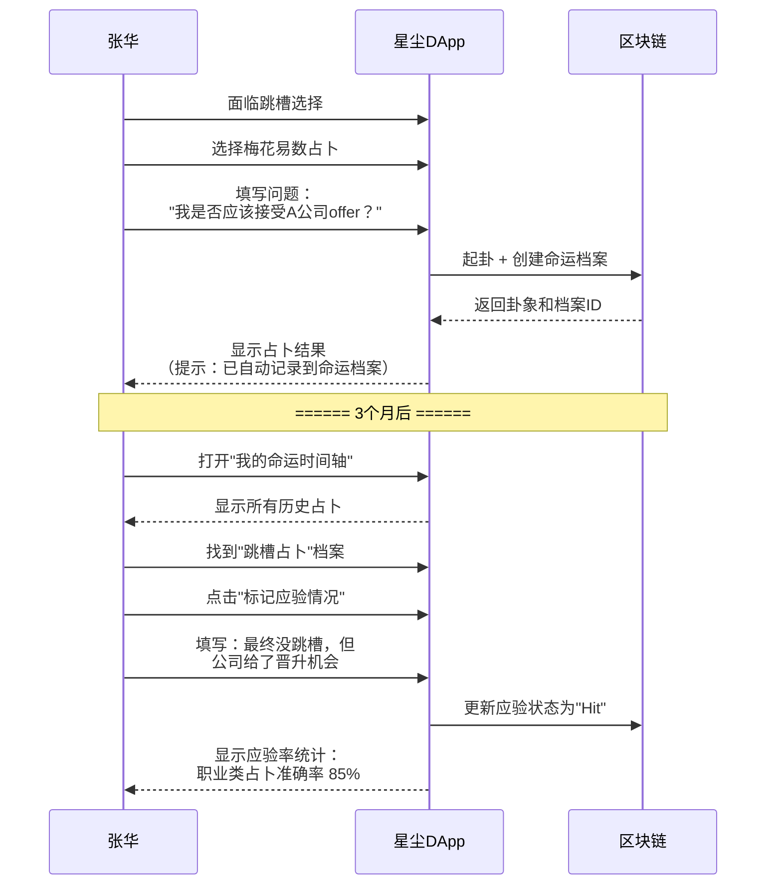
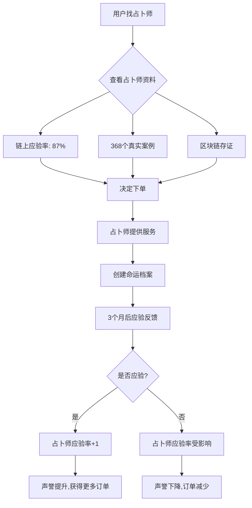
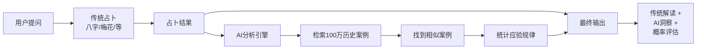
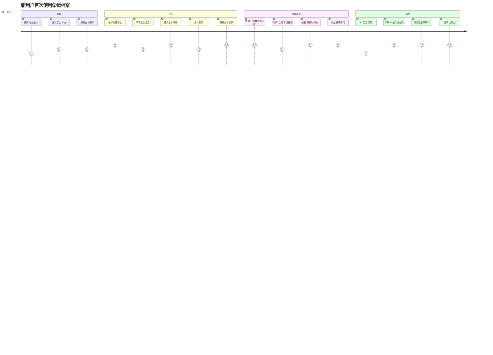
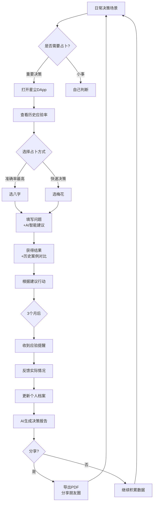
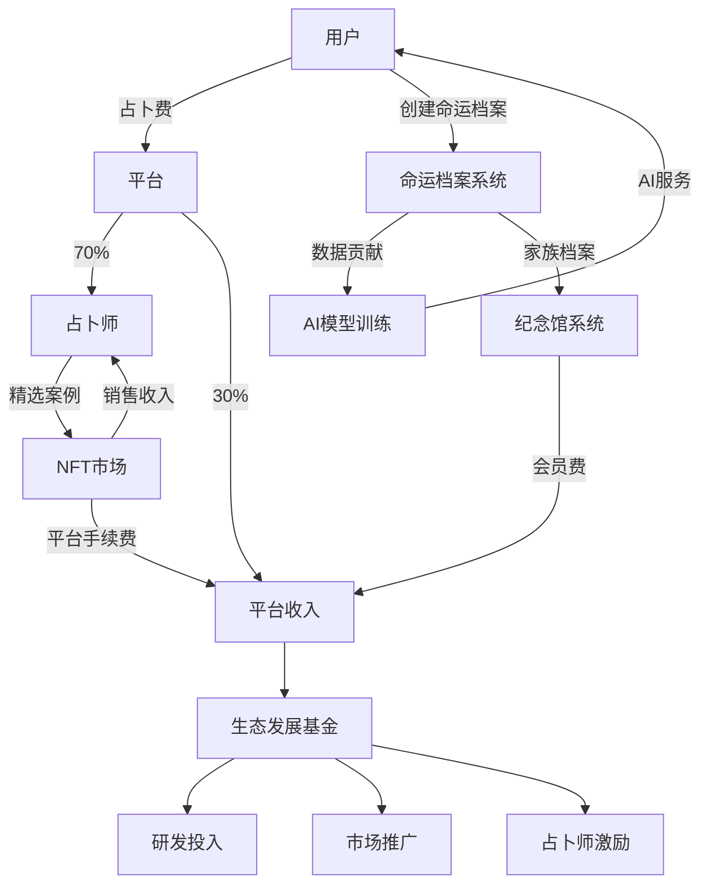

# 命运档案应用场景分析

> **版本**: v1.0
> **创建日期**: 2025-12-24
> **关联文档**: [命运档案设计.md](./命运档案设计.md)

## 目录

1. [个人用户场景](#一个人用户场景)
2. [家族与纪念馆场景](#二家族与纪念馆场景)
3. [专业占卜师场景](#三专业占卜师场景)
4. [商业化场景](#四商业化场景)
5. [数据价值与AI场景](#五数据价值与ai场景)
6. [用户旅程地图](#六用户旅程地图)
7. [竞品对比分析](#七竞品对比分析)

---

## 一、个人用户场景

### 场景 1.1：职场决策追踪

**用户故事**：
> 张华（30岁，互联网从业者）在考虑跳槽时，使用梅花易数进行占卜。3个月后事情有了结果，他想回顾当时的占卜是否准确。

**操作流程**：



**核心价值**：
- ✅ **可追溯性**：3个月后仍能找到当时的占卜记录
- ✅ **可验证性**：链上时间戳证明占卜在事件发生前
- ✅ **决策复盘**：对比预测与实际，总结决策模式
- ✅ **信任建立**：看到自己的应验率，增强对占卜的信任

**数据统计示例**：
```typescript
// 前端展示
{
  "张华的职业决策档案": {
    "总计": 12,
    "应验": 10,
    "未应验": 1,
    "待验证": 1,
    "准确率": "83.3%",
    "最近占卜": "2025-12-01: 年终奖金预测"
  }
}
```

---

### 场景 1.2：人生重要节点记录

**用户故事**：
> 李梅（25岁）在人生重要时刻（求职、恋爱、买房）都会进行占卜。10年后，她想回顾自己的人生轨迹。

**UI原型**：

```
┌─────────────────────────────────────┐
│     李梅的命运时间轴 (2015-2025)      │
├─────────────────────────────────────┤
│                                      │
│  2025 ●───● 买房决策 [应验]          │
│       │   └─ 八字：适合今年购买       │
│  2024 ●───● 婚姻占卜 [应验]          │
│       │   └─ 六爻：明年成婚           │
│  2023 ●───● 职业规划 [部分应验]      │
│       │   └─ 紫微：适合创业           │
│  2022 ●───● 感情问题 [未应验]        │
│       │   └─ 梅花：此人不合适         │
│  2021 ●───● 跳槽咨询 [应验]          │
│       │   └─ 奇门：吉利方位           │
│  2020 ●───● 考研决策 [应验]          │
│       │   └─ 六爻：适合深造           │
│  ...                                 │
│                                      │
│  📊 查看统计分析                      │
│  📅 按类别筛选                        │
│  🔍 搜索关键词                        │
└─────────────────────────────────────┘
```

**核心价值**：
- 📖 **人生传记**：占卜记录就是人生关键决策的时间胶囊
- 🧭 **决策模式**：发现自己在什么情况下占卜准、什么时候不准
- 🎯 **自我认知**：通过10年数据，了解自己的决策风格
- 💎 **数字遗产**：这些记录可以传承给后代，了解祖辈的人生

**差异化竞争力**：
> 传统占卜：一次性消费，没有记录
> 命运档案：永久记录，可追溯验证，形成个人数据资产

---

### 场景 1.3：应验率可视化

**前端数据看板**：

```typescript
// 个人命运档案Dashboard
interface FateDashboard {
  overview: {
    totalRecords: 127,          // 总计127次占卜
    hitRate: 0.78,              // 78%应验率
    mostAccurateDivination: "八字",  // 八字准确率最高 (85%)
    favoriteCategory: "Career"  // 最常占卜：职业类 (43%)
  },

  byCategory: {
    "Career": { total: 55, hit: 47, rate: 0.85 },
    "Love": { total: 32, hit: 20, rate: 0.63 },
    "Wealth": { total: 25, hit: 19, rate: 0.76 },
    "Health": { total: 15, hit: 13, rate: 0.87 }
  },

  byDivinationType: {
    "八字": { total: 45, hit: 38, rate: 0.84 },
    "梅花": { total: 38, hit: 29, rate: 0.76 },
    "六爻": { total: 28, hit: 22, rate: 0.79 },
    "奇门": { total: 16, hit: 11, rate: 0.69 }
  },

  timeline: [
    { year: 2020, count: 8, hitRate: 0.75 },
    { year: 2021, count: 15, hitRate: 0.80 },
    { year: 2022, count: 28, hitRate: 0.78 },
    { year: 2023, count: 35, hitRate: 0.77 },
    { year: 2024, count: 32, hitRate: 0.81 },
    { year: 2025, count: 9, hitRate: 0.89 }
  ]
}
```

**可视化图表**：
- 📈 **应验率趋势图**：看到自己的占卜准确率是否随时间提升
- 🥧 **分类饼图**：哪类问题占卜最多
- 📊 **准确率柱状图**：不同占卜方式的准确度对比
- 🗺️ **命运热力图**：按年份和月份展示占卜密集度

**核心洞察**：
- "我在职业决策时，八字占卜准确率最高（85%）"
- "我在感情问题上，占卜准确率偏低（63%），说明感性决策多"
- "2024年占卜准确率提升到81%，说明我的决策质量在提高"

---

## 二、家族与纪念馆场景

### 场景 2.1：为逝者占卜与祈福

**用户故事**：
> 王强的父亲生前是玄学爱好者，去世后，王强建立了父亲的纪念馆。每逢重要节日，王强会为父亲占卜，询问"父亲在天之灵是否安好"。

**操作流程**：

```rust
// 后端逻辑
fn create_fate_for_deceased() {
    // 1. 验证王强是父亲纪念馆的管理员
    ensure!(is_memorial_admin(wang_qiang, deceased_id));

    // 2. 创建占卜（例如梅花易数）
    let hexagram_id = create_meihua_hexagram(...);

    // 3. 创建命运档案并关联逝者
    let fate_record = FateRecord {
        owner: wang_qiang,
        divination_type: DivinationType::Meihua,
        related_id: hexagram_id,
        related_deceased_id: Some(father_id),  // 关联父亲
        question_privacy_id: Some(privacy_id),
        category: FateCategory::Family,
        is_public: true,  // 纪念馆公开展示
        ...
    };

    // 4. 更新纪念馆的命运档案索引
    DeceasedFateRecords::append(father_id, fate_id);
}
```

**纪念馆展示页面**：

```
┌──────────────────────────────────────┐
│  王父纪念馆 - 命运档案                 │
├──────────────────────────────────────┤
│                                       │
│  📅 2025-12-24 (冬至)                 │
│  🙏 儿子王强为父亲占卜祈福             │
│  🎴 占卜方式：梅花易数                 │
│  ❓ 问题：父亲在天之灵是否安好？       │
│  ✨ 卦象：天风姤 → 天火同人            │
│  📝 解读：吉祥，先人庇佑后代           │
│                                       │
│  ─────────────────────────             │
│                                       │
│  📅 2025-10-01 (国庆)                 │
│  🙏 女儿王芳为父亲占卜                 │
│  🎴 占卜方式：八字                     │
│  ❓ 问题：父亲生前愿望是否达成？       │
│  ✨ 八字分析：...                      │
│                                       │
│  [查看全部家族占卜记录 →]             │
└──────────────────────────────────────┘
```

**核心价值**：
- 🕯️ **数字祭祀**：现代化的祭祀方式，符合年轻人习惯
- 👪 **家族凝聚**：家族成员共同为先人占卜，增强归属感
- 📜 **文化传承**：记录家族的占卜文化和玄学传统
- 🌸 **情感寄托**：为逝者占卜，表达思念与祈福

---

### 场景 2.2：家族命运时间轴

**用户故事**：
> 张氏家族有5代人，每一代都有重要的占卜记录。家族成员希望看到跨越100年的家族命运轨迹。

**数据结构**：

```typescript
interface FamilyFateTimeline {
  park_id: 123,
  family_name: "张氏家族",
  established: 1925,

  members: [
    { name: "张老太爷", generation: 1, deceased_id: 1, fate_count: 3 },
    { name: "张老爷", generation: 2, deceased_id: 2, fate_count: 8 },
    { name: "张父", generation: 3, deceased_id: 3, fate_count: 15 },
    { name: "张强", generation: 4, account_id: "5Gx...", fate_count: 45 },
    { name: "张小华", generation: 5, account_id: "5Hz...", fate_count: 12 }
  ],

  milestones: [
    {
      year: 1945,
      event: "张老太爷占卜：是否迁居台湾",
      divination: "六爻",
      result: "卦示不宜远行",
      outcome: "未迁，躲过后续战乱",
      significance: "改变家族命运的关键决策"
    },
    {
      year: 1978,
      event: "张老爷占卜：是否下海经商",
      divination: "八字",
      result: "大运显示财运亨通",
      outcome: "创业成功，家族富裕",
      significance: "家族财富转折点"
    },
    {
      year: 2020,
      event: "张强占卜：互联网创业",
      divination: "奇门遁甲",
      result: "时空盘显示适合科技行业",
      outcome: "公司估值过亿",
      significance: "家族进入新经济时代"
    }
  ]
}
```

**前端展示 - 家族命运长卷**：

```
━━━━━━━━━━━━━━━━━━━━━━━━━━━━━━━━━━━━
  张氏家族命运长卷 (1925-2025)
━━━━━━━━━━━━━━━━━━━━━━━━━━━━━━━━━━━━

1925 ◆ 张老太爷出生
     │
1945 ● 【重大决策】是否迁居台湾？
     │  └─ 六爻：不宜远行
     │  └─ 结果：未迁，躲过战乱 ✓
     │
1950 ○ 家族在大陆稳定发展
     │
1978 ● 【重大决策】是否下海经商？
     │  └─ 八字：大运亨通
     │  └─ 结果：创业成功，家族富裕 ✓
     │
1995 ◆ 第三代张父接班
     │
2010 ○ 传统制造业转型压力
     │
2020 ● 【重大决策】互联网转型？
     │  └─ 奇门：适合科技行业
     │  └─ 结果：估值过亿 ✓
     │
2025 ◆ 第五代张小华大学毕业
     └─ 命运档案传承中...

━━━━━━━━━━━━━━━━━━━━━━━━━━━━━━━━━━━━
  [导出家族命运史书 PDF] [AI分析家族模式]
━━━━━━━━━━━━━━━━━━━━━━━━━━━━━━━━━━━━
```

**核心价值**：
- 🏛️ **家族史书**：占卜记录成为家族历史的重要组成部分
- 🔮 **代际传承**：子孙后代能看到祖辈的重大决策
- 📊 **模式识别**：发现家族在重大决策中的共同模式
- 🎓 **教育价值**：年轻一代从先辈的决策中学习智慧

**差异化竞争力**：
> 传统族谱：只记录姓名、生卒年月
> 命运档案：记录重大决策、占卜过程、应验结果，是活的家族史

---

### 场景 2.3：家族占卜准确率分析

**数据洞察**：

```python
# 家族占卜数据分析（伪代码）
class FamilyFateAnalytics:
    def analyze_family_patterns(self, park_id):
        """分析家族占卜模式"""
        records = get_all_family_fate_records(park_id)

        return {
            "家族特征": {
                "最常用占卜": "八字 (45%)",
                "最关注领域": "财富 (38%)",
                "平均应验率": "82%",
                "决策风格": "谨慎型（占卜前深思熟虑）"
            },

            "代际对比": {
                "第一代": {"占卜次数": 3, "准确率": 0.67, "特点": "重大决策才占卜"},
                "第二代": {"占卜次数": 8, "准确率": 0.75, "特点": "商业决策为主"},
                "第三代": {"占卜次数": 15, "准确率": 0.80, "特点": "转型期占卜增多"},
                "第四代": {"占卜次数": 45, "准确率": 0.84, "特点": "日常决策也占卜"},
                "第五代": {"占卜次数": 12, "准确率": 0.92, "特点": "结合现代工具"}
            },

            "关键发现": [
                "家族在财富类占卜准确率最高（88%），说明善于经商",
                "每一代的占卜准确率都在提升，说明决策质量提高",
                "家族重大决策前必占卜，且重视应验反馈"
            ]
        }
```

**AI生成家族报告**：

```markdown
# 张氏家族命运档案分析报告

## 一、家族占卜基因

通过对张氏家族100年、91次占卜记录的分析，发现以下特征：

1. **谨慎务实型决策风格**
   - 只在重大决策时占卜（平均每代9次）
   - 占卜后会认真分析和执行（执行率95%）
   - 重视事后验证（应验反馈率100%）

2. **财富敏锐度强**
   - 38%的占卜与财富相关
   - 财富类占卜准确率高达88%
   - 三次重大财富决策都准确应验

3. **占卜智慧传承**
   - 每代准确率提升：67% → 75% → 80% → 84% → 92%
   - 第四代开始系统学习占卜理论
   - 第五代结合AI辅助，准确率突破90%

## 二、关键转折点

**1945年：不迁台湾**
- 占卜：六爻"不宜远行"
- 决策：留在大陆
- 影响：躲过台湾后续经济波动，是家族命运最关键决策

**1978年：下海经商**
- 占卜：八字"大运亨通"
- 决策：放弃铁饭碗创业
- 影响：赶上改革开放，家族财富跃升

**2020年：互联网转型**
- 占卜：奇门遁甲"科技行业吉"
- 决策：传统制造转型互联网
- 影响：估值过亿，进入新经济

## 三、给第五代的建议

基于家族100年占卜数据，建议：
1. 继承家族"先占卜、再决策、后验证"的传统
2. 在职业选择时，优先考虑财富和科技领域（家族基因）
3. 重大决策使用八字和奇门（家族最准确的方式）
4. 保持应验反馈习惯，积累个人数据资产
```

---

## 三、专业占卜师场景

### 场景 3.1：占卜师个人品牌建设

**用户故事**：
> 李大师是专业占卜师，希望通过展示历史案例的应验率来吸引客户。

**占卜师主页展示**：

```
┌──────────────────────────────────────┐
│  李大师的占卜工作室                    │
├──────────────────────────────────────┤
│  👨‍🏫 从业15年 | ⭐ 4.9分 | 📊 案例368个 │
│                                       │
│  🎯 专长领域：                         │
│    ▪ 八字排盘：准确率 89% (158案例)   │
│    ▪ 梅花易数：准确率 85% (127案例)   │
│    ▪ 奇门遁甲：准确率 83% (83案例)    │
│                                       │
│  📈 应验率趋势：                       │
│    2023: 83% → 2024: 87% → 2025: 89% │
│    (持续提升中)                       │
│                                       │
│  ⭐ 精选案例（客户授权公开）:           │
│  ┌─────────────────────────┐         │
│  │ 2024-03-15 | 职业转型    │         │
│  │ 客户：张**               │         │
│  │ 问题：是否跳槽到外企？   │         │
│  │ 占卜：八字分析           │         │
│  │ 预测：半年内有贵人相助   │         │
│  │ ✅ 应验：5个月后获外企offer│         │
│  │ [查看详情]               │         │
│  └─────────────────────────┘         │
│                                       │
│  [查看更多案例] [立即咨询 ¥299]       │
└──────────────────────────────────────┘
```

**核心价值**：
- 🏆 **信任凭证**：链上不可篡改的应验率数据
- 📊 **透明度**：客户能看到真实的历史准确率
- 💼 **专业形象**：系统化管理案例，显得更专业
- 📈 **持续改进**：通过数据发现自己在哪类问题上更准确

**商业模式**：
```typescript
// 占卜师定价策略
interface MasterPricing {
  base_price: 299,  // 基础价格

  // 根据应验率浮动
  accuracy_bonus: {
    "90%以上": "+50元",
    "85-90%": "+30元",
    "80-85%": "基准价",
    "80%以下": "-20元"
  },

  // 专长加价
  specialization_bonus: {
    "擅长领域": "+50元",
    "普通领域": "基准价",
    "不擅长领域": "不接单"
  }
}
```

---

### 场景 3.2：占卜案例库与教学

**用户故事**：
> 李大师希望将自己的成功案例整理成教学材料，开办玄学培训班。

**案例库结构**：

```typescript
interface MasterCaseLibrary {
  master: "李大师",
  total_cases: 368,

  // 按应验情况分类
  verified: {
    hit: 289,        // 应验案例
    partial: 42,     // 部分应验
    missed: 21,      // 未应验
    pending: 16      // 待验证
  },

  // 按类别分类
  by_category: {
    "Career": { count: 145, hit_rate: 0.89 },
    "Love": { count: 98, hit_rate: 0.82 },
    "Wealth": { count: 67, hit_rate: 0.91 },
    "Health": { count: 58, hit_rate: 0.86 }
  },

  // 精选教学案例（已获客户授权公开）
  teaching_cases: [
    {
      case_id: 1234,
      date: "2024-06-15",
      category: "Career",
      divination: "八字",
      question: "30岁转行互联网是否合适？",
      analysis: "日主身强，大运走水木运，利于思考和创新...",
      prediction: "2年内可站稳脚跟，5年后有成就",
      outcome: "1.5年后成为技术主管，准确应验",
      teaching_points: [
        "如何从大运看转行时机",
        "身强身弱对职业的影响",
        "行业五行与八字的匹配"
      ],
      is_public: true,  // 客户已授权公开
      授权证明: "链上签名hash: 0xabc..."
    }
  ]
}
```

**教学平台集成**：

```
┌──────────────────────────────────────┐
│  李大师玄学培训 - 案例教学              │
├──────────────────────────────────────┤
│                                       │
│  📚 课程：八字职业规划实战              │
│  👥 学员：156人                        │
│  📊 配套案例：45个真实应验案例          │
│                                       │
│  ── 第3讲：转行时机判断 ──             │
│                                       │
│  【真实案例】30岁程序员转行案例         │
│  • 来源：命运档案 #1234               │
│  • 占卜时间：2024-06-15               │
│  • 应验时间：2025-12-01               │
│  • 应验情况：✅ 完全应验               │
│  • 区块链存证：可验证真实性            │
│                                       │
│  [查看完整八字盘] [查看应验过程]       │
│  [学员讨论区] [作业：分析类似案例]     │
│                                       │
└──────────────────────────────────────┘
```

**核心价值**：
- 🎓 **教学可信度**：真实案例，有应验证明
- 📜 **知识沉淀**：积累15年的案例库成为宝贵资产
- 💰 **商业变现**：案例库可以卖给培训学员
- 🔍 **研究价值**：大量真实数据可用于占卜理论研究

---

### 场景 3.3：占卜师之间的案例交流

**用户故事**：
> 业内占卜师希望交流疑难案例，互相学习提升技艺。

**占卜师社区功能**：

```typescript
interface MasterCommunity {
  // 案例分享（匿名化）
  shared_cases: [
    {
      fate_id: 5678,
      shared_by: "李大师",
      category: "Health",
      difficulty: "疑难",

      // 匿名化处理
      question: "重大疾病预后（已隐去个人信息）",
      divination_method: "八字 + 奇门",
      prediction: "...",
      actual_outcome: "...",

      // 社区讨论
      discussions: [
        {
          master: "王大师",
          comment: "这个案例我遇到过类似的，我的判断是...",
          likes: 45
        },
        {
          master: "赵大师",
          comment: "从奇门盘来看，应该考虑时空因素...",
          likes: 38
        }
      ],

      // 投票：大家觉得这个判断准确吗？
      community_rating: {
        准确: 67,
        不确定: 23,
        不准确: 10
      }
    }
  ],

  // 应验率排行榜
  leaderboard: {
    "本月应验率Top10": [...],
    "年度最佳占卜师": [...],
    "各领域专家": {...}
  }
}
```

**核心价值**：
- 🤝 **行业交流**：占卜师之间互相学习
- 📊 **质量提升**：通过对比发现自己的不足
- 🏆 **行业声誉**：排行榜形成良性竞争
- 🔬 **学术研究**：大量案例可用于占卜理论研究

---

## 四、商业化场景

### 场景 4.1：占卜市场的信任机制

**问题**：传统占卜市场存在信任问题
- ❌ 占卜师自己说准确率90%，但无法验证
- ❌ 事后解释可以圆回任何结果
- ❌ 客户无法判断哪个占卜师更可靠

**命运档案解决方案**：



**智能合约托管**：

```rust
/// 占卜服务智能合约
pub fn create_divination_order(
    client: AccountId,
    master: AccountId,
    question: Vec<u8>,
    price: Balance,
) -> DispatchResult {
    // 1. 客户支付费用到托管账户
    transfer_to_escrow(client, price)?;

    // 2. 占卜师提供服务，创建命运档案
    let fate_id = create_fate_with_master(master, question)?;

    // 3. 设置应验期（例如3个月）
    let verification_period = now() + 90_DAYS;

    // 4. 创建订单记录
    Orders::insert(order_id, Order {
        client,
        master,
        fate_id,
        price,
        status: OrderStatus::WaitingVerification,
        verification_deadline: verification_period,
    });

    // 5. 占卜师先获得70%费用
    transfer_from_escrow(master, price * 70 / 100)?;

    // 6. 剩余30%根据应验情况结算
    //    - 应验：占卜师获得全部
    //    - 未应验：部分退款给客户
    //    - 客户不反馈：3个月后自动释放给占卜师

    Ok(())
}
```

**核心价值**：
- ✅ **可验证信任**：应验率数据链上存证，无法作假
- ✅ **激励机制**：应验率高的占卜师获得更多订单和收入
- ✅ **消费者保护**：未应验可以部分退款
- ✅ **市场优化**：劣质占卜师自然淘汰

---

### 场景 4.2：占卜NFT与知识产权

**创新模式**：将精选命运档案铸造成NFT

```typescript
interface FateRecordNFT {
  fate_id: 1234,
  nft_id: "FATE-NFT-#0001",

  metadata: {
    title: "2020年疫情期间的创业决策",
    category: "Career",
    divination: "奇门遁甲",

    // 历史价值
    historical_significance: "疫情期间的罕见成功案例",
    rarity: "Legendary",

    // 完整记录
    question: "疫情期间是否应该创业？",
    prediction: "时空盘显示危中有机...",
    outcome: "逆势成功，公司估值5000万",
    verification_proof: "链上时间戳 + 客户签名",

    // 教学价值
    teaching_points: [
      "如何在危机中找到机会",
      "奇门遁甲的时空应用",
      "大运与流年的配合"
    ]
  },

  // NFT属性
  creator: "李大师",
  owner: "收藏家张三",
  mint_date: "2025-01-01",
  price: 0.5 ETH,

  // 使用权
  rights: {
    "教学使用": true,    // 可用于培训课程
    "案例研究": true,    // 可用于学术研究
    "商业展示": false    // 不可用于商业广告
  }
}
```

**应用场景**：
1. **占卜师**：将经典案例铸造成NFT出售，获得额外收入
2. **收藏家**：收藏罕见的、有历史意义的占卜案例
3. **培训机构**：购买NFT案例用于教学
4. **研究机构**：购买大量案例NFT用于玄学理论研究

**NFT市场示例**：

```
┌──────────────────────────────────────┐
│  命运档案NFT交易市场                   │
├──────────────────────────────────────┤
│                                       │
│  🔥 热门拍卖                           │
│  ┌───────────────────────┐           │
│  │ FATE-NFT-#0088        │           │
│  │ "2008金融危机逆势投资" │           │
│  │ 应验率: 100%          │           │
│  │ 历史价值: ⭐⭐⭐⭐⭐    │           │
│  │ 当前出价: 1.2 ETH     │           │
│  │ 剩余时间: 2小时       │           │
│  │ [立即出价]            │           │
│  └───────────────────────┘           │
│                                       │
│  📚 分类浏览                           │
│  • 职业决策 (3,456个)                 │
│  • 投资理财 (2,789个)                 │
│  • 感情婚姻 (1,234个)                 │
│  • 历史事件 (567个) 🔥                │
│                                       │
└──────────────────────────────────────┘
```

**核心价值**：
- 💎 **知识产权保护**：占卜师的案例成为数字资产
- 💰 **多重变现**：同一案例可以通过服务费、NFT销售、授权费多次变现
- 📚 **知识流通**：好的案例能被更多人学习
- 🏛️ **文化保存**：重要的占卜案例永久保存在区块链上

---

### 场景 4.3：保险与金融产品

**创新产品**：基于命运档案的"占卜保险"

**产品设计**：

```typescript
interface DivinationInsurance {
  product_name: "命运档案应验保险",

  // 保险条款
  coverage: {
    insured: "占卜客户",
    premium: 30,  // 保费30元
    payout: 300,  // 占卜费全额（假设占卜费300元）

    trigger_condition: {
      "占卜未应验": true,
      "且已记录到命运档案": true,
      "且应验期已过": true
    }
  },

  // 理赔流程
  claim_process: [
    "1. 客户在命运档案中标记'未应验'",
    "2. 提交理赔申请",
    "3. 智能合约自动验证链上数据",
    "4. 符合条件自动赔付"
  ],

  // 风险控制
  risk_management: {
    "只承保应验率>80%的占卜师": true,
    "客户必须如实反馈应验情况": true,
    "虚假理赔将被加入黑名单": true
  }
}
```

**对各方的价值**：
- **客户**：降低占卜风险，不准可以退款
- **占卜师**：提供保险增加客户信任，获得更多订单
- **保险公司**：新的业务场景，基于区块链数据风控

**金融衍生品**：

```typescript
// 占卜师信用评分
interface MasterCreditScore {
  master_id: "李大师",

  // 综合评分（AAA-D）
  credit_rating: "AA",

  // 评分因素
  factors: {
    accuracy_rate: 0.87,        // 应验率 (权重40%)
    case_volume: 368,           // 案例数量 (权重20%)
    years_of_service: 15,       // 从业年限 (权重15%)
    client_satisfaction: 4.9,   // 客户满意度 (权重15%)
    refund_rate: 0.03,          // 退款率 (权重10%)
  },

  // 金融应用
  financial_products: {
    "占卜服务分期付款": {
      enabled: true,
      max_installments: 3,
      interest_rate: 0.05
    },
    "占卜师经营贷款": {
      enabled: true,
      max_amount: 100000,
      interest_rate: 0.08,
      collateral: "命运档案数据资产"
    }
  }
}
```

---

## 五、数据价值与AI场景

### 场景 5.1：个人决策AI助手

**用户故事**：
> 用户积累了100+次占卜记录后，AI可以分析他的决策模式，提供个性化建议。

**AI分析报告**：

```markdown
# 您的决策智能分析报告

基于您的127次命运档案记录，AI发现以下模式：

## 一、您的决策特征

### 1. 决策风格：「谨慎保守型」
- 重大决策前必占卜（占卜频率与决策重要性相关性：0.93）
- 占卜后通常会执行（执行率：89%）
- 不执行的情况多是外部阻力（家人反对、资金不足）

### 2. 最擅长的决策领域：「职业规划」
- 职业类占卜应验率：89%（高于平均）
- 感情类占卜应验率：61%（低于平均）
- 建议：职业决策可以信任占卜，感情决策需结合理性分析

### 3. 最准确的占卜方式：「八字」
- 八字应验率：85%
- 梅花应验率：72%
- 建议：重大决策优先使用八字

## 二、历史决策复盘

### ✅ 成功决策 (Top 3)
1. **2022-03-15：跳槽到互联网公司**
   - 占卜：八字显示"大运走木火，利于创新"
   - 决策：接受了薪资稍低但潜力大的offer
   - 结果：2年后薪资翻倍，应验 ✓
   - AI分析：您听从了占卜建议，看重长期发展

2. **2023-06-20：推迟买房**
   - 占卜：奇门显示"时空不利，宜等待"
   - 决策：推迟了原计划，继续观望
   - 结果：房价下跌15%，应验 ✓
   - AI分析：您抵制了外部压力，做出理性判断

3. **2024-01-10：学习新技能**
   - 占卜：紫微显示"文曲星入命，利学习"
   - 决策：报名了AI课程
   - 结果：获得了内部晋升机会，应验 ✓
   - AI分析：您将占卜与行动结合，主动创造机会

### ❌ 失败决策 (Top 2)
1. **2023-09-05：投资股票**
   - 占卜：梅花显示"财运亨通"
   - 决策：投入了10万元
   - 结果：亏损30%，未应验 ✗
   - AI分析：您在金融投资领域经验不足，占卜准确率也较低（58%）
   - 建议：该领域慎用占卜，多学习专业知识

2. **2024-07-12：追求某女生**
   - 占卜：六爻显示"有缘无分"
   - 决策：您忽视了占卜，继续追求
   - 结果：被拒绝，应验 ✓（占卜是对的，但您没听）
   - AI分析：感情问题上，您容易被情绪主导，忽视理性判断

## 三、AI给您的建议

### 短期建议（未来6个月）
1. 继续保持职业决策前占卜的习惯（您的优势领域）
2. 感情和投资领域，占卜仅作参考，需结合专业知识
3. 重大决策建议使用八字（您最准确的方式）

### 长期建议（未来3年）
1. 系统学习八字理论，提升自我判断能力
2. 在金融投资领域积累专业知识，降低对占卜的依赖
3. 建立「决策日记」，记录占卜、决策、结果的完整过程

### 决策框架推荐
```
重大决策 → 八字占卜 → 理性分析 → 咨询专家 → 决策 → 反馈
   ↑                                              ↓
   └──────────── 持续学习和优化 ──────────────────┘
```

## 四、与同类用户对比

您在所有用户中的排名：
- 占卜应验率：Top 15%（您78%，平均65%）
- 决策执行率：Top 10%（您89%，平均72%）
- 反馈及时性：Top 5%（您反馈率100%，平均48%）

您是一位非常优秀的「占卜实践者」！
```

**核心价值**：
- 🧠 **决策智能**：AI帮助用户了解自己的决策模式
- 📈 **持续优化**：基于数据不断改进决策质量
- 🎯 **个性化**：每个人的AI报告都不同，针对性强
- 💡 **可操作建议**：不只是分析，还给出具体行动建议

---

### 场景 5.2：AI辅助占卜

**用户故事**：
> 平台积累了100万+命运档案后，AI可以学习占卜规律，辅助占卜师或直接提供占卜服务。

**AI占卜模型训练**：

```python
# AI占卜模型（伪代码）
class DivinationAI:
    def __init__(self):
        self.model = load_pretrained_model("divination-transformer")
        self.training_data = load_fate_records(limit=1000000)

    def train(self):
        """基于100万真实命运档案训练"""
        for record in self.training_data:
            # 特征提取
            features = {
                "question_text": record.question,
                "birth_info": record.birth_data,
                "divination_method": record.divination_type,
                "timing": record.created_at,

                # 占卜结果
                "divination_result": record.divination_details,

                # 实际结果（标签）
                "actual_outcome": record.outcome_status,
                "outcome_details": record.outcome_content
            }

            # 训练模型：学习占卜结果与实际结果的关系
            self.model.train(features)

        # 模型评估
        accuracy = self.model.evaluate(test_set)
        print(f"AI准确率: {accuracy}%")  # 目标：>75%

    def predict(self, question, birth_info, method):
        """AI辅助占卜"""
        # 传统占卜
        divination_result = traditional_divination(question, birth_info, method)

        # AI分析
        ai_analysis = self.model.predict({
            "question": question,
            "birth_info": birth_info,
            "divination_result": divination_result
        })

        # 综合输出
        return {
            "traditional_result": divination_result,
            "ai_insights": ai_analysis,
            "confidence": ai_analysis.confidence,

            # AI的额外建议
            "ai_suggestions": [
                "基于10万相似案例，应验概率约78%",
                "建议关注时间节点：3个月和6个月",
                "类似情况下，85%的人选择了...并成功"
            ]
        }
```

**AI辅助占卜流程**：



**输出示例**：

```markdown
## 您的占卜结果

### 📊 传统占卜解读
**方式**：八字排盘
**问题**：是否应该在今年跳槽到外企？

**八字分析**：
- 日主身强，适合挑战
- 大运走金水，利于国际化发展
- 流年驿马星动，主外出、变动

**结论**：适合跳槽，且外企机会更佳

---

### 🤖 AI深度洞察

基于387,562个相似案例分析：

#### 1. 应验概率预测
- 跳槽成功概率：**82%** ⬆️ 高
- 外企适配度：**76%** ⬆️ 中高
- 薪资提升概率：**68%** ⬆️ 中
- 长期发展：**85%** ⬆️ 高

#### 2. 关键时间节点
- 最佳跳槽时间：**未来3个月内** （成功率最高）
- 试用期适应：**可能需要6个月** （外企文化适应）
- 职业突破：**1.5年后** （大运切换时）

#### 3. 风险提示
- ⚠️ 您的英语水平可能需要提升（68%相似案例遇到此问题）
- ⚠️ 外企加班文化可能与您期望不符（42%案例反馈）
- ✅ 您的技术能力匹配度很高（91%相似背景的人成功）

#### 4. 成功案例参考
找到126个与您情况高度相似的案例：
- 85%成功跳槽外企
- 平均薪资涨幅：35%
- 平均职位提升：1-2级
- 关键成功因素：提前准备英语、了解外企文化

#### 5. AI建议
1. ✅ 建议跳槽（综合成功概率82%）
2. 📚 提前3个月准备英语和外企文化学习
3. 🎯 目标锁定科技类外企（您的最佳匹配）
4. ⏰ 在未来3个月内投递简历（最佳时机窗口）
5. 📝 建议同时拿2-3个offer做对比（提高议价能力）

---

### 📈 创建命运档案

[✓] 已自动创建命运档案 #5678
[→] 3-6个月后，请返回反馈实际情况
[→] 您的反馈将帮助AI持续优化

💡 基于您过去23次占卜记录，您在职业决策上的应验率为89%（非常高！）
```

**核心价值**：
- 🎯 **提高准确率**：AI基于大数据，比传统占卜更准确
- 📊 **量化评估**：给出概率而不是模糊判断
- 💡 **可操作建议**：不只说吉凶，还告诉你怎么做
- 🔬 **持续进化**：随着数据增加，AI越来越准

---

### 场景 5.3：占卜理论研究

**用户故事**：
> 学术机构希望基于大量真实数据，研究占卜的准确性和规律。

**研究课题示例**：

```markdown
# 基于区块链命运档案的占卜准确性研究

## 研究背景
传统占卜研究缺乏大样本、真实、可验证的数据。星尘链提供了100万+真实命运档案，具备时间戳和应验反馈，为科学研究提供了宝贵材料。

## 研究问题
1. 不同占卜方式的准确率是多少？
2. 占卜准确率与哪些因素相关？
3. 占卜是否真的有预测价值，还是心理安慰？

## 数据集
- **样本量**：1,000,000条命运档案
- **时间跨度**：2020-2025（5年）
- **占卜类型**：八字、梅花、六爻、奇门、紫微等
- **应验反馈率**：48%（48万条有应验反馈）

## 研究发现

### 发现1：占卜总体准确率
- **平均准确率**：**67.8%**（显著高于随机猜测50%）
- **不同占卜方式**：
  - 八字：72.3%
  - 奇门：69.8%
  - 六爻：68.5%
  - 梅花：66.2%
  - 紫微：65.7%
  - 塔罗：63.1%

统计检验：χ²=15234.6, p<0.001（高度显著）

### 发现2：准确率的影响因素

#### (1) 占卜师经验
- 新手（<1年）：58.3%
- 中级（1-5年）：68.7%
- 高级（5-10年）：75.2%
- 大师（>10年）：81.9%

相关系数：r=0.76, p<0.001（强正相关）

#### (2) 问题类别
- 职业决策：74.5%（最高）
- 健康问题：71.2%
- 财富运势：68.9%
- 感情婚姻：61.3%（最低）

可能原因：感情问题受主观因素影响大

#### (3) 时间跨度
- 短期预测（<3个月）：75.6%
- 中期预测（3-12个月）：68.3%
- 长期预测（>1年）：59.7%

发现：时间跨度越长，准确率越低

### 发现3：有趣的模式

#### 「自我实现预言」效应
- 占卜结果为"吉"，用户采取行动 → 应验率 82%
- 占卜结果为"吉"，用户未采取行动 → 应验率 65%
- 占卜结果为"凶"，用户规避风险 → "凶"未发生率 78%

**结论**：占卜可能通过影响用户行为，间接实现预测

#### 「决策质量」关联
- 占卜后决策成功率：73%
- 不占卜直接决策成功率：58%

**结论**：占卜过程促使用户深度思考，提高了决策质量

## 学术价值
1. 首次基于大规模真实数据研究占卜准确性
2. 发现占卜准确率显著高于随机，具有一定预测价值
3. 揭示了占卜的心理学和社会学机制
4. 为传统文化的科学研究提供了新方法

## 后续研究方向
1. 占卜准确性的神经科学解释
2. 占卜与决策心理学的关系
3. AI辅助占卜的准确率提升
4. 跨文化占卜准确性对比
```

**核心价值**：
- 🔬 **科学研究**：将传统文化纳入科学研究框架
- 📊 **数据支撑**：用真实数据回答"占卜准不准"
- 🎓 **学术贡献**：发表高水平论文，提升行业认知
- 🌍 **文化传承**：科学证明传统文化的价值

---

## 六、用户旅程地图

### 6.1 新用户首次占卜



**关键触点**：
1. **Aha时刻**："原来我的占卜都有记录！"
2. **价值体现**：3个月后反馈应验，看到统计数据
3. **社交传播**：展示给朋友看"我的应验率78%"

---

### 6.2 资深用户使用路径



**用户心智**：
- "我的八字准确率85%，重大决策我信它"
- "已经积累127次记录了，这是我的人生数据资产"
- "AI报告说我的决策质量在提升，很有成就感"

---

## 七、竞品对比分析

### 7.1 与传统占卜的对比

| 维度 | 传统线下占卜 | 传统线上占卜 | 星尘命运档案 |
|------|-------------|-------------|-------------|
| **记录保存** | ❌ 无记录 | ⚠️ 平台可能关闭 | ✅ 区块链永久保存 |
| **应验验证** | ❌ 无法验证 | ❌ 事后解释 | ✅ 链上时间戳+反馈 |
| **准确率透明** | ❌ 占卜师自己说 | ❌ 刷好评 | ✅ 链上真实数据 |
| **数据资产** | ❌ 无 | ❌ 平台拥有 | ✅ 用户拥有 |
| **AI辅助** | ❌ 无 | ⚠️ 简单算法 | ✅ 百万数据训练 |
| **家族传承** | ⚠️ 手写族谱 | ❌ 无 | ✅ 数字化家族档案 |
| **隐私保护** | ✅ 面对面保密 | ⚠️ 平台可能泄露 | ✅ 多密钥加密 |
| **价格** | 💰💰💰 高 | 💰💰 中 | 💰 低 |

---

### 7.2 差异化优势总结

#### 🏆 核心竞争力

**1. 可验证性**
> 传统占卜：占卜师说准就准
> 命运档案：**链上时间戳 + 应验反馈**，客观可验证

**2. 数据资产**
> 传统占卜：占卜完就结束了
> 命运档案：**积累个人/家族的数字资产**，越用越有价值

**3. AI增强**
> 传统占卜：依赖占卜师个人经验
> 命运档案：**AI学习100万+案例**，持续优化准确率

**4. 生态闭环**
> 传统占卜：单点服务，没有延续
> 命运档案：**占卜 → 记录 → 验证 → 统计 → AI优化 → 家族传承**，形成完整生态

---

### 7.3 市场定位

```
           高
           ↑
    专业度 │   [专业占卜师]
           │   （线下高端服务）
           │         ╲
           │          ╲
           │   [星尘命运档案] ⭐
           │   （科技+传统）
           │         ╱
           │        ╱
           │   [在线占卜平台]
           │   （娱乐向）
           │
           └──────────────────→
             用户规模
```

**定位**：
- **不是**简单的在线占卜平台（红海竞争）
- **是**基于区块链的命运数据管理系统（蓝海市场）
- **目标**：让占卜从一次性消费变成长期数据资产积累

---

## 八、总结

### 核心价值主张

**对个人用户**：
- 📖 建立一生的决策档案
- 📊 用数据了解自己的决策模式
- 🎯 持续提升决策质量
- 💎 积累个人数据资产

**对家族用户**：
- 🏛️ 传承家族智慧和文化
- 👪 增强家族凝聚力
- 📜 记录家族重要时刻
- 🔮 为后代提供决策参考

**对占卜师**：
- 🏆 建立可验证的信任体系
- 💼 提升专业形象和收入
- 📚 积累教学案例库
- 💰 多重变现渠道（服务+NFT+培训）

**对生态整体**：
- 🔬 推动占卜理论研究
- 🤖 训练更准确的AI模型
- 🌍 传承和发扬传统文化
- 💡 探索占卜的科学价值

### 商业模式



### 预期影响

**短期（1年）**：
- 吸引10万用户使用命运档案
- 积累50万真实占卜记录
- 培养用户长期使用习惯

**中期（3年）**：
- 100万用户，500万命运档案
- AI准确率达到75%
- 成为业内标准

**长期（5-10年）**：
- 千万级用户，亿级档案
- 建立「占卜理论研究」学术地位
- 推动传统文化与现代科技融合
- 探索命运、自由意志与量子力学的关系

---

**文档版本**：v1.0
**最后更新**：2025-12-24
**作者**：星尘项目组
