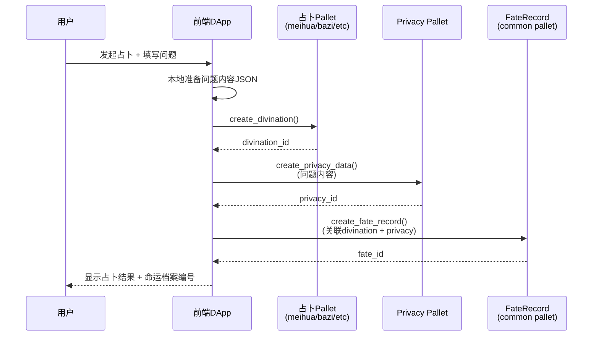

## 命运档案设计（占卜全生命周期记录）

> **版本**: v0.2（优化设计稿）
> **适用范围**: `pallet-divination-*`（梅花 / 八字 / 六爻 / 奇门 / 紫微 / 大六壬 / 小六壬 / 塔罗等）
> **目标**: 为每次占卜建立可追溯、可验证、可复盘的「命运档案」
> **最后更新**: 2025-12-24

---

## 一、核心概念

- **命运档案（FateRecord）**  
  对「一次占卜行为」及其后续应验情况的完整记录。  
  由三部分组成：
  1. **链上元数据**：谁、什么时候、用什么方式、起了什么卦 / 局，当前应验状态等（结构化、可检索）  
  2. **IPFS 内容**：问题详情、人工解读、AI 解读、事后备注等（文本为主，加密保存）  
  3. **时间轴索引**：把多次占卜串成一条人生 / 家族「命运时间线」

- **设计原则**
  - **最小上链**：链上只放必要的索引与标签，敏感内容通过 `pallet-divination-privacy` 统一管理
  - **不可篡改**：关键字段一经写入不可随意修改，应验状态允许追加更新但保留历史
  - **多占卜类型统一抽象**：所有占卜类型共享一套 FateRecord 抽象，便于前端统一展示
  - **复用现有系统**：集成 `pallet-divination-privacy` 和 deceased/park 系统，避免重复开发
  - **纪念馆生态融合**：命运档案作为纪念馆的一部分，记录逝者/家族的占卜历史

---

## 二、链上数据结构设计

> **实施位置**：建议在 `pallet-divination-common` 中实现，作为所有占卜pallet的公共基础设施。

### 1. FateRecord 核心结构（优化版）

```rust
use pallet_divination_common::DivinationType;
use pallet_divination_privacy::types::{DivinationRef, PrivacyMode};

/// 命运档案（一次占卜的链上元数据）
///
/// 设计要点：
/// - 不直接存储CID，而是通过 pallet-divination-privacy 管理加密内容
/// - 支持与deceased/park系统关联，实现家族命运档案
/// - 轻量化设计，减少链上存储开销
#[derive(Clone, Encode, Decode, TypeInfo, MaxEncodedLen)]
pub struct FateRecord<AccountId, BlockNumber> {
    /// 档案 ID（全局递增）
    pub id: u64,

    /// 发起人账号
    pub owner: AccountId,

    /// 占卜类型（使用 common pallet 的统一类型）
    pub divination_type: DivinationType,

    /// 关联的具体卦象 / 命盘 ID
    /// 例如：梅花易数的 hexagram_id、八字的 chart_id
    pub related_id: u64,

    // ===== 时间信息 =====
    /// 创建区块号（主要时间标识）
    pub created_at: BlockNumber,

    // ===== 隐私内容引用（通过 privacy pallet 管理）=====
    /// 问题与上下文的隐私数据引用
    /// 包含：问题文本、场景标签、重要程度等
    pub question_privacy_id: Option<u64>,

    /// 应验结果的隐私数据引用
    /// 包含：事后总结、反思、标签等
    pub outcome_privacy_id: Option<u64>,

    // ===== 状态与应验 =====
    /// 当前应验状态（可追加更新）
    pub outcome_status: OutcomeStatus,

    /// 应验更新时间
    pub outcome_updated_at: Option<BlockNumber>,

    // ===== 纪念馆生态集成 =====
    /// 关联的逝者 ID（为逝者占卜的场景）
    /// 例如：为逝者生前事务占卜、后人为逝者祈福占卜等
    pub related_deceased_id: Option<u64>,

    /// 关联的纪念馆 ID（家族命运档案）
    /// 用于家族成员共享命运时间轴
    pub related_park_id: Option<u64>,

    // ===== 标记与权限 =====
    /// 是否公开展示
    /// true: 可在公共广场/纪念馆展示
    /// false: 仅授权用户可见
    pub is_public: bool,

    /// 业务分类标签（链上索引用）
    /// career(职业) / love(感情) / health(健康) / wealth(财运) / other(其他)
    pub category: FateCategory,
}
```

### 2. 枚举字段定义

#### 2.1 应验状态

```rust
/// 应验状态枚举
///
/// 用于追踪占卜预测与实际结果的对照
#[derive(Clone, Copy, Encode, Decode, TypeInfo, MaxEncodedLen, PartialEq, Eq, Debug)]
pub enum OutcomeStatus {
    /// 待验证（事件尚未发生或时间未到）
    Pending = 0,
    /// 部分应验（预测正确一部分）
    PartiallyHit = 1,
    /// 完全应验（预测准确）
    Hit = 2,
    /// 未应验（预测不准确）
    Missed = 3,
    /// 已取消（不再追踪或事件已失效）
    Cancelled = 4,
}
```

#### 2.2 业务分类

```rust
/// 命运档案业务分类
///
/// 用于前端筛选和统计分析
#[derive(Clone, Copy, Encode, Decode, TypeInfo, MaxEncodedLen, PartialEq, Eq, Debug)]
pub enum FateCategory {
    /// 职业发展（跳槽、升职、创业等）
    Career = 0,
    /// 感情婚姻（恋爱、婚姻、分手等）
    Love = 1,
    /// 健康医疗（疾病、手术、康复等）
    Health = 2,
    /// 财运投资（投资、借贷、理财等）
    Wealth = 3,
    /// 学业考试（升学、考试、留学等）
    Education = 4,
    /// 家庭亲属（家庭关系、亲属事务等）
    Family = 5,
    /// 法律诉讼（官司、纠纷、维权等）
    Legal = 6,
    /// 出行迁移（搬家、旅行、移民等）
    Travel = 7,
    /// 其他类型
    Other = 99,
}
```

### 3. 存储映射设计

```rust
/// 命运档案存储（主存储）
///
/// 存储所有命运档案记录
#[pallet::storage]
pub type FateRecords<T: Config> = StorageMap<
    _,
    Blake2_128Concat,
    u64,  // fate_id
    FateRecord<T::AccountId, BlockNumberFor<T>>,
    OptionQuery,
>;

/// 用户命运时间轴索引
///
/// 按时间倒序存储用户的所有命运档案ID
/// 支持分页查询：前端可以逐批加载
#[pallet::storage]
pub type UserFateTimeline<T: Config> = StorageMap<
    _,
    Blake2_128Concat,
    T::AccountId,
    BoundedVec<u64, T::MaxFateRecordsPerUser>,  // fate_id 列表
    ValueQuery,
>;

/// 占卜结果反向索引
///
/// 从具体的占卜结果快速定位到命运档案
/// 例如：(DivinationType::Meihua, hexagram_id) -> fate_id
#[pallet::storage]
pub type DivinationToFate<T: Config> = StorageMap<
    _,
    Blake2_128Concat,
    (DivinationType, u64),  // (占卜类型, 结果ID)
    u64,  // fate_id
    OptionQuery,
>;

/// 纪念馆命运档案索引
///
/// 按纪念馆聚合家族成员的命运档案
/// 用于实现「家族命运时间轴」
#[pallet::storage]
pub type ParkFateRecords<T: Config> = StorageMap<
    _,
    Blake2_128Concat,
    u64,  // park_id
    BoundedVec<u64, T::MaxFateRecordsPerPark>,  // fate_id 列表
    ValueQuery,
>;

/// 逝者关联命运档案索引
///
/// 记录与特定逝者相关的所有占卜
/// 例如：为逝者生前占卜、后人为逝者祈福占卜等
#[pallet::storage]
pub type DeceasedFateRecords<T: Config> = StorageMap<
    _,
    Blake2_128Concat,
    u64,  // deceased_id
    BoundedVec<u64, T::MaxFateRecordsPerDeceased>,  // fate_id 列表
    ValueQuery,
>;

/// 下一个命运档案ID
#[pallet::storage]
pub type NextFateId<T: Config> = StorageValue<_, u64, ValueQuery>;
```

### 4. 配置类型（Config Trait）

```rust
#[pallet::config]
pub trait Config: frame_system::Config {
    type RuntimeEvent: From<Event<Self>> + IsType<<Self as frame_system::Config>::RuntimeEvent>;

    /// 每个用户最多保存的命运档案数量
    /// 建议值：1000（覆盖大部分用户的一生占卜记录）
    #[pallet::constant]
    type MaxFateRecordsPerUser: Get<u32>;

    /// 每个纪念馆最多关联的命运档案数量
    /// 建议值：5000（家族成员共享）
    #[pallet::constant]
    type MaxFateRecordsPerPark: Get<u32>;

    /// 每个逝者最多关联的命运档案数量
    /// 建议值：500
    #[pallet::constant]
    type MaxFateRecordsPerDeceased: Get<u32>;
}

---

## 三、隐私内容结构设计（通过 pallet-divination-privacy）

> **关键变更**：不再直接在FateRecord中存储CID，而是通过 `pallet-divination-privacy` 统一管理加密内容。

### 1. 问题与上下文内容（Question Content）

由 `FateRecord.question_privacy_id` 引用，存储在 privacy pallet 中：

```jsonc
{
  "version": "1.0",
  // ===== 问题核心 =====
  "title": "某次重要决策占卜",
  "question_text": "我是否应该在今年内跳槽到 A 公司？",

  // ===== 场景上下文 =====
  "context": {
    "importance": "high",           // low / normal / high
    "tags": ["跳槽", "北京", "互联网公司"],
    "background": "当前公司环境压抑，A公司给出了更高薪酬...",
    "deadline": "2025-12-31",       // 决策期限
  },

  // ===== 客户端元数据（可选）=====
  "metadata": {
    "timezone": "Asia/Shanghai",
    "location_hint": "北京",         // 可选地理位置
    "device": "mobile"
  }
}
```

**设计要点**：
- 去除链上已有信息（如 divination_kind、fate_id 等）
- 专注于业务内容：问题文本、背景、标签
- 通过 privacy pallet 的加密机制保护隐私

### 2. 应验结果与总结（Outcome Content）

由 `FateRecord.outcome_privacy_id` 引用：

```jsonc
{
  "version": "1.0",
  // ===== 实际发生的事件 =====
  "event_summary": "最终没有跳槽，但公司内部给了更好的岗位与薪酬，整体结果好于预期。",
  "event_date": "2025-06-30",

  // ===== 应验分析 =====
  "hit_analysis": {
    "is_accurate": true,              // 预测是否准确
    "accuracy_score": 8,              // 准确度评分 (1-10)
    "details": "占卜建议三个月内观望，实际上正是这段观望期促成了内部机会。"
  },

  // ===== 事后反思 =====
  "reflection": "这次占卜让我冷静下来，多做了一些调研，也促成了和上级的沟通。",

  // ===== 标签与分类 =====
  "tags": ["心态改善", "决策复盘", "职场沟通"],

  // ===== 附加解读（可选）=====
  "additional_notes": "后来发现占卜中提到的'内部贵人'确实出现了..."
}
```

### 3. 与 privacy pallet 的集成方式

#### 3.1 创建命运档案时

```rust
// 伪代码示例
pub fn create_fate_record(
    origin,
    divination_type: DivinationType,
    related_id: u64,
    question_content: Vec<u8>,  // JSON序列化的问题内容
    category: FateCategory,
    is_public: bool,
    // privacy 相关参数
    privacy_mode: PrivacyMode,  // Plain / SingleKey / MultiKey
    authorized_accounts: Vec<(AccountId, AccessRole)>,  // 可选授权列表
) -> DispatchResult {
    // 1. 首先在 privacy pallet 中创建加密内容
    let question_privacy_id = pallet_divination_privacy::Pallet::<T>::create_privacy_data(
        origin.clone(),
        DivinationRef {
            divination_type,
            result_id: related_id,
        },
        question_content,
        privacy_mode,
        authorized_accounts,
    )?;

    // 2. 然后创建 FateRecord
    let fate_id = NextFateId::<T>::get();
    let fate_record = FateRecord {
        id: fate_id,
        owner: who,
        divination_type,
        related_id,
        created_at: current_block,
        question_privacy_id: Some(question_privacy_id),
        outcome_privacy_id: None,  // 初始为空
        outcome_status: OutcomeStatus::Pending,
        outcome_updated_at: None,
        related_deceased_id: None,
        related_park_id: None,
        is_public,
        category,
    };

    // 3. 存储并更新索引
    FateRecords::<T>::insert(fate_id, fate_record);
    UserFateTimeline::<T>::append(&who, fate_id)?;
    DivinationToFate::<T>::insert((divination_type, related_id), fate_id);

    Ok(())
}
```

#### 3.2 查询命运档案内容时

```rust
// 前端/RPC调用流程
// 1. 查询 FateRecord 获取基础信息
let fate_record = FateRecords::<T>::get(fate_id)?;

// 2. 通过 question_privacy_id 查询加密内容
let question_content = pallet_divination_privacy::Pallet::<T>::get_privacy_data(
    fate_record.question_privacy_id.unwrap(),
    requester_account,
)?;

// 3. 前端解密并展示
// privacy pallet 会根据 PrivacyMode 返回明文或加密数据
```

### 4. 占卜解读的存储方案

**解读内容不属于命运档案的核心范畴**，建议：

- **链上解读**：由各占卜pallet自身存储（如八字的解盘数据）
- **人工解读**：通过 `pallet-divination-market` 的订单系统管理
- **AI解读**：通过 `pallet-divination-ai` 管理

命运档案只关注：
- ✅ 问题是什么
- ✅ 结果如何
- ✅ 应验情况

而不关注：
- ❌ 具体如何解读
- ❌ 中间的解读过程

---

## 四、生命周期设计（从起卦到命运档案）

### 1. 创建阶段（占卜当下）



**关键步骤**：
1. 用户在前端发起占卜（梅花/八字/六爻等）
2. 用户填写占卜问题和背景（可选）
3. 前端调用对应占卜pallet生成卦象/命盘
4. 前端将问题内容通过privacy pallet加密存储
5. 前端调用fate record创建接口，关联占卜结果和隐私数据
6. 系统更新用户时间轴索引

### 2. 使用阶段（查看与统计）

#### 2.1 个人命运时间轴

```typescript
// 前端示例代码
async function loadFateTimeline(accountId: string, page: number = 0, pageSize: number = 20) {
  // 1. 查询用户的 fate_id 列表
  const fateIds = await api.query.fateRecord.userFateTimeline(accountId);

  // 2. 分页加载详细信息
  const start = page * pageSize;
  const end = start + pageSize;
  const fateRecords = await Promise.all(
    fateIds.slice(start, end).map(id =>
      api.query.fateRecord.fateRecords(id)
    )
  );

  // 3. 过滤公开记录或有权限的记录
  return fateRecords.filter(record =>
    record.is_public || record.owner === currentUser
  );
}
```

#### 2.2 家族命运档案（纪念馆场景）

```typescript
// 查询某个纪念馆的所有命运档案
async function loadParkFateRecords(parkId: number) {
  const fateIds = await api.query.fateRecord.parkFateRecords(parkId);

  // 按时间排序，生成家族命运热力图
  const records = await loadFateDetails(fateIds);
  return groupByYearAndCategory(records);
}
```

### 3. 应验反馈阶段（事后更新）

```rust
/// 更新命运档案的应验状态
///
/// 用户在事件发展后，可以标记占卜的应验情况
pub fn update_fate_outcome(
    origin: OriginFor<T>,
    fate_id: u64,
    new_status: OutcomeStatus,
    outcome_content: Option<Vec<u8>>,  // JSON格式的应验总结
    privacy_mode: PrivacyMode,
) -> DispatchResult {
    let who = ensure_signed(origin)?;

    // 1. 验证权限
    let mut fate_record = FateRecords::<T>::get(fate_id)
        .ok_or(Error::<T>::FateRecordNotFound)?;
    ensure!(fate_record.owner == who, Error::<T>::NotOwner);

    // 2. 如果提供了应验内容，存储到privacy pallet
    let outcome_privacy_id = if let Some(content) = outcome_content {
        let privacy_id = pallet_divination_privacy::Pallet::<T>::create_privacy_data(
            origin.clone(),
            DivinationRef {
                divination_type: fate_record.divination_type,
                result_id: fate_record.related_id,
            },
            content,
            privacy_mode,
            vec![],  // 默认不额外授权
        )?;
        Some(privacy_id)
    } else {
        fate_record.outcome_privacy_id
    };

    // 3. 更新状态
    fate_record.outcome_status = new_status;
    fate_record.outcome_privacy_id = outcome_privacy_id;
    fate_record.outcome_updated_at = Some(<frame_system::Pallet<T>>::block_number());

    // 4. 存储并发出事件
    FateRecords::<T>::insert(fate_id, fate_record);
    Self::deposit_event(Event::FateOutcomeUpdated {
        fate_id,
        owner: who,
        new_status,
    });

    Ok(())
}
```

### 4. 权限与隐私管理

命运档案的隐私控制通过两层机制实现：

#### 4.1 链上可见性控制（FateRecord.is_public）
- `true`: 记录本身在公共时间轴可见
- `false`: 仅授权用户可查询

#### 4.2 内容加密控制（通过 privacy pallet）
- `PrivacyMode::Plain`: 明文，任何人可读
- `PrivacyMode::SingleKey`: 仅所有者可读
- `PrivacyMode::MultiKey`: 授权多方可读

**典型场景组合**：
```rust
// 场景1：完全私密（自己看）
is_public: false,
privacy_mode: PrivacyMode::SingleKey

// 场景2：公开展示但内容加密（展示标题，内容需授权）
is_public: true,
privacy_mode: PrivacyMode::MultiKey,
authorized: [占卜师、家族成员]

// 场景3：完全公开（公共案例库）
is_public: true,
privacy_mode: PrivacyMode::Plain
```

---

## 五、与现有系统的集成方案

### 1. 与占卜 Pallet 的集成

**设计原则**：各占卜pallet保持独立，通过 hook 或 trait 可选集成命运档案功能。

#### 1.1 在占卜Pallet中添加FateRecord创建（可选）

```rust
// 在 pallet-meihua/src/lib.rs 中

#[pallet::call]
impl<T: Config> Pallet<T> {
    /// 创建梅花易数卦象（扩展版，支持命运档案）
    pub fn create_hexagram_with_fate(
        origin: OriginFor<T>,
        // ... 原有起卦参数 ...
        // 命运档案相关参数
        question_content: Option<Vec<u8>>,
        fate_category: Option<FateCategory>,
        is_public: bool,
    ) -> DispatchResult {
        let who = ensure_signed(origin)?;

        // 1. 创建卦象（原有逻辑）
        let hexagram_id = Self::do_create_hexagram(...)?;

        // 2. 如果提供了问题内容，创建命运档案
        if let Some(content) = question_content {
            pallet_divination_common::fate_record::Pallet::<T>::create_fate_record(
                origin.clone(),
                DivinationType::Meihua,
                hexagram_id,
                content,
                fate_category.unwrap_or(FateCategory::Other),
                is_public,
                PrivacyMode::SingleKey,  // 默认仅自己可见
                vec![],
            )?;
        }

        Ok(())
    }
}
```

#### 1.2 前端调用示例

```typescript
// 方案A：一次性创建（推荐）
await api.tx.meihua.createHexagramWithFate(
  // 起卦参数...
  shang_gua, xia_gua, dong_yao,
  // 命运档案参数
  questionJson,           // 问题内容JSON
  'Career',               // 分类
  false                   // 不公开
).signAndSend(account);

// 方案B：分步创建（灵活）
// 1. 先起卦
const hexagramId = await api.tx.meihua.createHexagram(...);

// 2. 用户可选是否创建命运档案
if (userWantsToTrack) {
  await api.tx.fateRecord.create(
    'Meihua',
    hexagramId,
    questionJson,
    'Career',
    false
  );
}
```

### 2. 与 deceased/park 系统的集成

#### 2.1 为逝者占卜场景

```rust
/// 为逝者创建命运档案
///
/// 场景：后人为逝者生前事务占卜、祈福占卜等
pub fn create_fate_for_deceased(
    origin: OriginFor<T>,
    divination_type: DivinationType,
    related_id: u64,
    deceased_id: u64,  // 关联的逝者ID
    question_content: Vec<u8>,
    category: FateCategory,
    privacy_mode: PrivacyMode,
) -> DispatchResult {
    let who = ensure_signed(origin)?;

    // 1. 验证逝者存在且有权限
    let deceased = pallet_deceased::DeceasedRecords::<T>::get(deceased_id)
        .ok_or(Error::<T>::DeceasedNotFound)?;
    // 可以添加权限检查：是否是逝者的家属或纪念馆成员

    // 2. 创建命运档案（正常流程）
    let fate_id = Self::do_create_fate_record(
        who,
        divination_type,
        related_id,
        question_content,
        category,
        false,  // 默认不公开
        privacy_mode,
    )?;

    // 3. 关联逝者ID
    FateRecords::<T>::mutate(fate_id, |record| {
        if let Some(r) = record {
            r.related_deceased_id = Some(deceased_id);
        }
    });

    // 4. 更新逝者的命运档案索引
    DeceasedFateRecords::<T>::try_mutate(deceased_id, |list| {
        list.try_push(fate_id).map_err(|_| Error::<T>::TooManyRecords)
    })?;

    Self::deposit_event(Event::FateCreatedForDeceased {
        fate_id,
        deceased_id,
        creator: who,
    });

    Ok(())
}
```

#### 2.2 纪念馆家族档案

```rust
/// 将命运档案关联到纪念馆
///
/// 用于实现家族命运时间轴
pub fn link_fate_to_park(
    origin: OriginFor<T>,
    fate_id: u64,
    park_id: u64,
) -> DispatchResult {
    let who = ensure_signed(origin)?;

    // 1. 验证命运档案所有权
    let mut fate_record = FateRecords::<T>::get(fate_id)
        .ok_or(Error::<T>::FateRecordNotFound)?;
    ensure!(fate_record.owner == who, Error::<T>::NotOwner);

    // 2. 验证纪念馆存在且有权限
    // ... park权限检查逻辑 ...

    // 3. 关联
    fate_record.related_park_id = Some(park_id);
    FateRecords::<T>::insert(fate_id, fate_record);

    // 4. 更新纪念馆索引
    ParkFateRecords::<T>::try_mutate(park_id, |list| {
        list.try_push(fate_id).map_err(|_| Error::<T>::TooManyRecords)
    })?;

    Ok(())
}
```

### 3. 与 Subsquid 数据层的集成

**推荐方案**：使用Subsquid索引命运档案数据，支持复杂查询。

#### 3.1 需要索引的事件

```rust
#[pallet::event]
#[pallet::generate_deposit(pub(super) fn deposit_event)]
pub enum Event<T: Config> {
    /// 命运档案已创建
    FateRecordCreated {
        fate_id: u64,
        owner: T::AccountId,
        divination_type: DivinationType,
        related_id: u64,
        category: FateCategory,
        block_number: BlockNumberFor<T>,
    },

    /// 应验状态已更新
    FateOutcomeUpdated {
        fate_id: u64,
        owner: T::AccountId,
        new_status: OutcomeStatus,
        block_number: BlockNumberFor<T>,
    },

    /// 命运档案关联到逝者
    FateLinkedToDeceased {
        fate_id: u64,
        deceased_id: u64,
        block_number: BlockNumberFor<T>,
    },

    /// 命运档案关联到纪念馆
    FateLinkedToPark {
        fate_id: u64,
        park_id: u64,
        block_number: BlockNumberFor<T>,
    },
}
```

#### 3.2 Subsquid Schema 示例

```graphql
type FateRecord @entity {
  id: ID!
  owner: Account!
  divinationType: DivinationType!
  relatedId: BigInt!
  createdAt: BigInt!
  category: FateCategory!
  outcomeStatus: OutcomeStatus!
  outcomeUpdatedAt: BigInt
  relatedDeceased: DeceasedRecord
  relatedPark: Park
  isPublic: Boolean!
}

enum DivinationType {
  MEIHUA
  BAZI
  LIUYAO
  QIMEN
  ZIWEI
  DALIUREN
  XIAOLIUREN
  TAROT
}

enum FateCategory {
  CAREER
  LOVE
  HEALTH
  WEALTH
  EDUCATION
  FAMILY
  LEGAL
  TRAVEL
  OTHER
}

enum OutcomeStatus {
  PENDING
  PARTIALLY_HIT
  HIT
  MISSED
  CANCELLED
}
```

#### 3.3 支持的查询能力

```graphql
# 查询用户的所有命运档案（分页）
query GetUserFateTimeline($owner: String!, $limit: Int!, $offset: Int!) {
  fateRecords(
    where: { owner: { id_eq: $owner } }
    orderBy: createdAt_DESC
    limit: $limit
    offset: $offset
  ) {
    id
    divinationType
    category
    outcomeStatus
    createdAt
  }
}

# 按分类统计应验率
query GetAccuracyByCategory($owner: String!) {
  fateRecords(where: { owner: { id_eq: $owner } }) {
    category
    outcomeStatus
  }
}

# 查询纪念馆的家族命运档案
query GetParkFateRecords($parkId: String!) {
  fateRecords(
    where: { relatedPark: { id_eq: $parkId } }
    orderBy: createdAt_DESC
  ) {
    id
    owner { id }
    divinationType
    category
    createdAt
  }
}
```

---

## 六、实施计划（分阶段推进）

### Phase 1: 基础架构搭建（1-2周）

**目标**：在 `pallet-divination-common` 中实现 FateRecord 基础功能

#### 任务清单
- [x] ✅ 在 common pallet 中定义 FateRecord 数据结构
- [ ] 实现存储映射（FateRecords, UserFateTimeline 等）
- [ ] 实现核心 extrinsics：
  - `create_fate_record()`
  - `update_fate_outcome()`
  - `set_fate_visibility()`
- [ ] 定义 Events 和 Errors
- [ ] 编写单元测试
- [ ] 在 runtime 中集成 fate_record 模块

#### 验收标准
- 能够创建命运档案并关联到占卜结果
- 能够查询用户的命运时间轴
- 能够更新应验状态
- 测试覆盖率 > 80%

### Phase 2: Privacy 集成与前端开发（2-3周）

**目标**：打通 privacy pallet 和前端UI

#### 任务清单
- [ ] 集成 `pallet-divination-privacy` 管理问题内容加密
- [ ] 在梅花易数 pallet 中添加 FateRecord hook（试点）
- [ ] 前端开发：
  - [ ] 命运时间轴组件（FateTimeline.tsx）
  - [ ] 占卜问题表单组件（QuestionForm.tsx）
  - [ ] 应验反馈组件（OutcomeFeedback.tsx）
- [ ] 前端服务层：
  - [ ] fateRecordService.ts
  - [ ] 与 privacy service 集成
- [ ] 在测试网部署验证

#### 验收标准
- 梅花易数可以创建带命运档案的占卜
- 前端能显示完整的命运时间轴
- 能够加密/解密问题内容
- 能够提交应验反馈

### Phase 3: 全面铺开与纪念馆集成（2-3周）

**目标**：扩展到所有占卜类型，集成deceased/park系统

#### 任务清单
- [ ] 在所有占卜 pallet 中添加 FateRecord 支持：
  - [ ] pallet-bazi
  - [ ] pallet-liuyao
  - [ ] pallet-qimen
  - [ ] pallet-ziwei
  - [ ] pallet-daliuren
  - [ ] pallet-xiaoliuren
  - [ ] pallet-tarot
- [ ] 实现 deceased 和 park 关联功能：
  - [ ] `create_fate_for_deceased()`
  - [ ] `link_fate_to_park()`
- [ ] 前端开发：
  - [ ] 家族命运档案页面
  - [ ] 逝者命运档案页面
  - [ ] 统计分析组件（应验率、分类分布等）

#### 验收标准
- 所有占卜类型都支持命运档案
- 能够在纪念馆中查看家族命运时间轴
- 能够为逝者创建关联档案

### Phase 4: 数据分析与AI增强（1-2周）

**目标**：提供数据洞察和AI辅助功能

#### 任务清单
- [ ] Subsquid 集成：
  - [ ] 索引 FateRecord 相关事件
  - [ ] 实现 GraphQL schema
  - [ ] 提供统计查询API
- [ ] 前端数据可视化：
  - [ ] 人生命运热力图
  - [ ] 应验率趋势图
  - [ ] 分类分布饼图
- [ ] AI 功能集成（可选）：
  - [ ] 基于历史档案的决策风格分析
  - [ ] 占卜准确性预测

#### 验收标准
- Subsquid 能够提供复杂查询
- 前端展示丰富的数据可视化
- 用户能够看到个人/家族的命运分析报告

---

## 七、技术检查清单

### 7.1 Runtime 配置检查

```bash
# 1. 检查 pallet_timestamp 是否启用
grep -r "pallet_timestamp" runtime/src/

# 2. 检查 DivinationType 是否包含所有占卜类型
cat pallets/divination/common/src/lib.rs | grep -A 20 "pub enum DivinationType"

# 3. 检查 privacy pallet 是否已集成
grep -r "pallet_divination_privacy" runtime/src/
```

**预期结果**：
- ✅ `pallet_timestamp` 已配置（或使用 BlockNumber 替代）
- ✅ `DivinationType` 包含 8 种占卜类型
- ✅ `pallet_divination_privacy` 已在 runtime 中注册

### 7.2 存储效率评估

```rust
// FateRecord 存储大小估算
use codec::Encode;

let fate_record = FateRecord {
    id: 1000,
    owner: AccountId::default(),
    divination_type: DivinationType::Meihua,
    related_id: 5000,
    created_at: 1_000_000u32,
    question_privacy_id: Some(123),
    outcome_privacy_id: Some(456),
    outcome_status: OutcomeStatus::Hit,
    outcome_updated_at: Some(1_100_000u32),
    related_deceased_id: Some(10),
    related_park_id: Some(20),
    is_public: false,
    category: FateCategory::Career,
};

let encoded = fate_record.encode();
println!("FateRecord size: {} bytes", encoded.len());
```

**预期结果**：
- ✅ 单条 FateRecord < 150 bytes
- ✅ 1000 条记录 < 150 KB（可接受）

### 7.3 隐私安全检查

- [ ] 问题内容必须通过 privacy pallet 加密存储
- [ ] 前端不能在未授权情况下读取他人的隐私内容
- [ ] Privacy pallet 的密钥推导安全可靠
- [ ] 前端使用 X25519 正确加密/解密

### 7.4 前端工具函数检查

```bash
# 检查是否已有 IPFS 上传功能
find stardust-dapp/src -name "*ipfs*" -o -name "*privacy*"

# 检查是否已有加密工具
grep -r "crypto-js\|@polkadot/util-crypto" stardust-dapp/package.json
```

**预期结果**：
- ✅ IPFS 上传工具函数已存在
- ✅ 加密库（crypto-js）已安装
- ✅ @polkadot/util-crypto 已集成

### 7.5 兼容性检查

```rust
// 确保 FateRecord 实现所有必要的 trait
impl<AccountId, BlockNumber> FateRecord<AccountId, BlockNumber>
where
    AccountId: Encode + Decode,
    BlockNumber: Encode + Decode,
{
    // 确保可以序列化
    fn test_encode_decode() {
        let record = Self::default();
        let encoded = record.encode();
        let decoded = Self::decode(&mut &encoded[..]).unwrap();
        assert_eq!(record, decoded);
    }
}
```

---

## 八、常见问题 FAQ

### Q1: 命运档案会占用多少链上存储？
**A**: 单条 FateRecord 约 120-150 bytes。假设一个用户一生创建 1000 条档案，总计约 150 KB，属于可接受范围。实际问题内容通过 privacy pallet 的 IPFS 存储，不占用链上空间。

### Q2: 如果用户不想创建命运档案怎么办？
**A**: 命运档案是**可选功能**。用户可以只使用占卜功能而不创建档案。前端应提供"是否记录到命运档案"的选项开关。

### Q3: 能否修改或删除历史命运档案？
**A**:
- **不可修改**：档案的核心字段（如创建时间、关联的占卜结果）不可修改，保证记录的不可篡改性
- **可更新**：应验状态、隐私设置、关联关系可以更新
- **不支持删除**：建议使用"归档"或"设为不公开"，而非物理删除

### Q4: 命运档案与占卜结果的关系？
**A**:
- **1对1关系**：一个命运档案对应一次占卜结果
- **松耦合**：即使占卜结果被删除（如果支持），命运档案仍然保留作为历史记录
- **通过 DivinationToFate 映射**：可以从占卜结果快速定位到命运档案

### Q5: 如何保证隐私内容的安全？
**A**:
- 使用 `pallet-divination-privacy` 的多密钥加密机制
- 前端使用 X25519 加密，链上只存储加密后的 CID
- 授权基于角色（Owner/Master/Family），可随时撤销
- 符合项目既有的加密规范

### Q6: Subsquid 索引是否必需？
**A**:
- **Phase 1-2 可选**：链上查询足够支撑基础功能
- **Phase 3-4 强烈推荐**：复杂统计查询（如应验率分析）依赖 Subsquid
- **性能考虑**：用户如果有上千条档案，前端查询会较慢，Subsquid 可显著提升体验

---

## 九、总结

### 核心设计要点

1. **三层架构**：
   - 链上元数据（FateRecord）- 轻量、可索引
   - 隐私内容（privacy pallet）- 加密、可授权
   - 数据索引（Subsquid）- 高效、可统计

2. **系统集成**：
   - 与 `pallet-divination-privacy` 深度集成，避免重复开发
   - 与 deceased/park 系统融合，实现纪念馆生态闭环
   - 复用 `DivinationType` 统一抽象，支持 8 种占卜类型

3. **灵活设计**：
   - 命运档案是**可选功能**，不影响现有占卜流程
   - 支持明文/单密钥/多密钥三种隐私模式
   - 允许事后追加应验反馈

4. **实用价值**：
   - 为用户提供「一生的命运时间轴」
   - 支持家族命运档案聚合与分析
   - 记录占卜应验情况，辅助决策复盘

### 关键改进（相比 v0.1）

| 方面 | v0.1 设计 | v0.2 优化设计 |
|------|----------|-------------|
| **CID存储** | 直接在FateRecord中存储CID | 通过privacy pallet统一管理 |
| **占卜类型** | 仅列举4种 | 覆盖全部8种占卜类型 |
| **系统集成** | 缺失 | 明确deceased/park关联 |
| **索引设计** | 无明确Storage定义 | 5个Storage映射完整覆盖 |
| **IPFS内容** | 包含冗余元数据 | 精简为纯业务内容 |
| **实施计划** | 缺失 | 4阶段渐进式推进 |
| **技术验证** | 缺失 | 完整的检查清单和FAQ |

### 立即可执行的行动

**Week 1-2**：
```bash
# 1. 在 common pallet 中创建 fate_record 模块
mkdir -p pallets/divination/common/src/fate_record
touch pallets/divination/common/src/fate_record/mod.rs
touch pallets/divination/common/src/fate_record/types.rs
touch pallets/divination/common/src/fate_record/tests.rs

# 2. 运行技术检查清单（见第七章）
bash scripts/check-fate-record-requirements.sh
```

**Week 3-4**：
- 在梅花易数pallet中试点集成
- 开发前端命运时间轴组件
- 测试网部署验证

### 预期收益

- **用户体验提升**：占卜不再是一次性消费，而是可追溯的人生记录
- **生态价值增强**：命运档案与纪念馆深度融合，增加用户粘性
- **数据资产积累**：应验数据可用于AI模型训练，提升预测准确性
- **差异化竞争力**：业内首创「区块链命运档案」概念

### 风险与应对

| 风险 | 影响 | 应对方案 |
|------|------|---------|
| 用户不愿填写问题内容 | 档案价值降低 | 设计为可选功能，提供默认模板 |
| 隐私内容泄露 | 用户信任受损 | 严格使用privacy pallet，定期安全审计 |
| 链上存储膨胀 | 运行成本增加 | 限制单用户档案数量（1000条上限） |
| 前端性能问题 | 用户体验下降 | 强制分页加载，Subsquid索引加速 |

---

**文档版本记录**：
- v0.1 (2025-12-XX): 初始概念设计
- v0.2 (2025-12-24): 全面优化，集成privacy pallet和deceased/park系统，新增实施计划和技术检查清单


