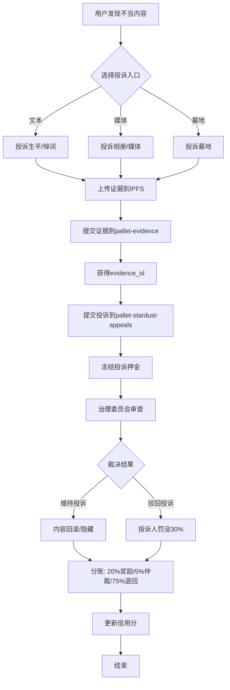
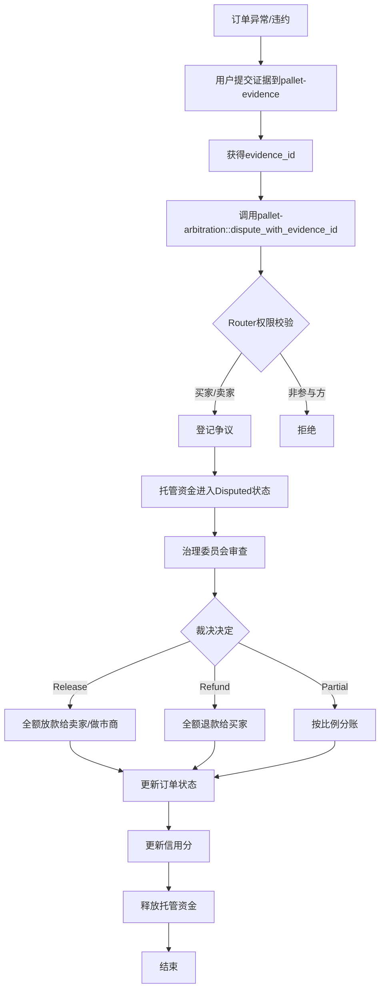
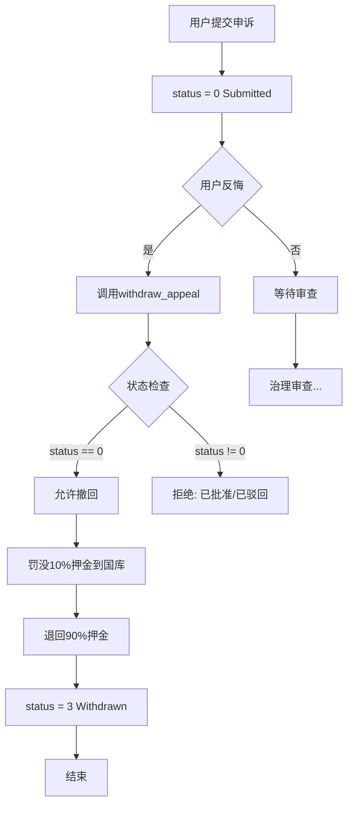

# Stardust投诉/申诉治理 - 整体方案设计

> **版本**: v1.0  
> **日期**: 2025-10-27  
> **状态**: 设计阶段 - 待评审  
> **负责人**: 项目架构组

---

## 📋 执行摘要

本方案旨在为Stardust生态建立一个**统一、安全、高效**的投诉/申诉治理体系，解决当前6个自研pallet投诉机制不统一的问题，提升用户体验和治理效率。

### 核心目标
1. ✅ **统一架构**：建立统一的投诉/申诉处理框架
2. ✅ **权限清晰**：明确用户、治理、系统的权责边界
3. ✅ **安全可靠**：多层安全机制保护资金和数据
4. ✅ **用户友好**：简化流程，提升用户体验
5. ✅ **可扩展性**：支持未来新业务域的快速接入

---

## 🏗️ 整体架构设计

### 架构图

```text
┌─────────────────────────────────────────────────────────────────┐
│                        用户层 (User Layer)                       │
│  - 提交投诉/申诉    - 提供证据    - 撤回申诉    - 查询状态      │
└────────────────────────────┬────────────────────────────────────┘
                             ↓
┌─────────────────────────────────────────────────────────────────┐
│                    前端应用层 (Frontend Layer)                   │
│  - 统一投诉入口    - 证据上传    - 进度追踪    - 消息通知       │
└────────────────────────────┬────────────────────────────────────┘
                             ↓
┌─────────────────────────────────────────────────────────────────┐
│                   API聚合层 (API Aggregation)                    │
│  - 路由分发    - 权限校验    - 数据聚合    - 事件监听           │
└────────────────────────────┬────────────────────────────────────┘
                             ↓
┌─────────────────────────────────────────────────────────────────┐
│                  治理中枢 (Governance Hub)                       │
│  ┌──────────────────────────────────────────────────┐           │
│  │         pallet-stardust-appeals (核心申诉引擎)        │           │
│  │  - 申诉登记    - 公示期管理    - 自动执行        │           │
│  │  - 重试机制    - 应答否决      - 押金管理        │           │
│  └──────────────────────────────────────────────────┘           │
│  ┌──────────────────────────────────────────────────┐           │
│  │      pallet-arbitration (争议仲裁中心)           │           │
│  │  - 争议登记    - 域路由        - 裁决执行        │           │
│  │  - 证据关联    - 分账逻辑      - 信用扣减        │           │
│  └──────────────────────────────────────────────────┘           │
└────────────────────────────┬────────────────────────────────────┘
                             ↓
┌─────────────────────────────────────────────────────────────────┐
│                  支撑服务层 (Supporting Services)                │
│  ┌──────────────┐  ┌──────────────┐  ┌──────────────┐          │
│  │pallet-deposits│  │pallet-evidence│  │pallet-escrow │          │
│  │  押金管理     │  │  证据存储     │  │  资金托管    │          │
│  └──────────────┘  └──────────────┘  └──────────────┘          │
└────────────────────────────┬────────────────────────────────────┘
                             ↓
┌─────────────────────────────────────────────────────────────────┐
│                  业务域层 (Business Domain Layer)                │
│  ┌──────────┐  ┌──────────┐  ┌──────────┐  ┌──────────┐        │
│  │deceased- │  │deceased- │  │  memo-   │  │   OTC    │        │
│  │  text    │  │  media   │  │  grave   │  │  order   │        │
│  └──────────┘  └──────────┘  └──────────┘  └──────────┘        │
│  - 实现投诉接口  - 执行裁决逻辑  - 内容回滚  - 状态更新         │
└─────────────────────────────────────────────────────────────────┘
```

### 分层职责

| 层级 | 职责 | 关键组件 |
|-----|------|---------|
| **用户层** | 提交、查询、应答 | Web App, Mobile App |
| **前端应用层** | UI交互、数据展示 | React组件、状态管理 |
| **API聚合层** | 路由、聚合、监听 | Subsquid (可选)、Polkadot.js |
| **治理中枢** | 核心治理逻辑 | stardust-appeals, arbitration |
| **支撑服务层** | 通用服务 | deposits, evidence, escrow |
| **业务域层** | 业务实现 | 各业务pallet |

---

## 🎯 统一治理流程设计

### 流程1：内容投诉流程（Text/Media）



**关键节点说明：**

1. **提交阶段**：
   - 用户选择投诉类型（文本/媒体/墓地）
   - 上传证据到IPFS（图片、截图、说明文档）
   - 提交证据到`pallet-evidence`获得`evidence_id`
   - 调用`pallet-stardust-appeals::submit_appeal()`
   - 系统冻结投诉押金（默认100 DUST，根据历史动态调整）

2. **审查阶段**：
   - 治理委员会查看证据（通过`evidence_id`）
   - 委员会投票表决（需2/3通过）
   - 批准后进入30天公示期

3. **执行阶段**：
   - 公示期到期自动执行
   - 域路由分发到具体业务pallet
   - 业务pallet执行内容回滚/隐藏
   - 自动分账（20%奖励赢家、5%仲裁费、75%退回输家）

4. **结束阶段**：
   - 更新用户信用分
   - 发送通知消息
   - 记录治理日志

---

### 流程2：交易争议流程（OTC/Bridge）



**关键节点说明：**

1. **发起阶段**：
   - 用户（买家/卖家/做市商）发现订单问题
   - 上传证据（聊天记录、转账凭证、超时证明）
   - 提交到`pallet-evidence`
   - 调用`pallet-arbitration::dispute_with_evidence_id()`

2. **权限校验**：
   - `Router::can_dispute()`校验身份
   - OTC域：仅买家或卖家
   - Bridge域：仅用户或做市商
   - 防止第三方恶意发起争议

3. **托管锁定**：
   - 托管资金状态变为`Disputed`
   - 禁止普通release/refund操作
   - 仅等待仲裁决议

4. **裁决执行**：
   - 委员会投票（2/3通过）
   - 三种裁决：Release（0）、Refund（1）、Partial（2,bps）
   - Router路由到业务pallet
   - 业务pallet调用`escrow`释放/退款资金

5. **后续处理**：
   - 更新买家/做市商信用分
   - 败诉方扣分（buyer-credit/maker-credit）
   - 更新订单状态为Resolved
   - 发送通知

---

### 流程3：申诉撤回流程



**关键节点说明：**

1. **撤回条件**：
   - 仅`status=0`（已提交）时可撤回
   - 已批准/已驳回/已执行不可撤回
   - 仅申诉人本人可操作

2. **罚没机制**：
   - 撤回罚没10%押金（防止随意提交）
   - 退回90%押金给申诉人
   - 10%押金进入国库（Treasury）

---

## 🔐 权限管理方案

### 三层权限模型

```text
┌─────────────────────────────────────────────────────────┐
│                    Root/超级管理员                       │
│  - 所有权限    - 应急暂停    - 参数配置    - 强制执行   │
└────────────────────────┬────────────────────────────────┘
                         ↓
┌─────────────────────────────────────────────────────────┐
│              治理委员会 (Governance Committee)           │
│  - 审查投诉    - 裁决争议    - 批准/驳回    - 投票表决  │
└────────────────────────┬────────────────────────────────┘
                         ↓
┌─────────────────────────────────────────────────────────┐
│                普通用户 (Normal Users)                   │
│  - 提交投诉    - 提交争议    - 撤回申诉    - 查询状态   │
└─────────────────────────────────────────────────────────┘
```

### 权限矩阵

| 操作 | 普通用户 | 业务Pallet | 治理委员会 | Root |
|-----|---------|-----------|-----------|------|
| **提交投诉/申诉** | ✅ | ❌ | ✅ | ✅ |
| **撤回申诉** | ✅（本人+status=0） | ❌ | ❌ | ✅ |
| **查询状态** | ✅ | ✅ | ✅ | ✅ |
| **批准申诉** | ❌ | ❌ | ✅ | ✅ |
| **驳回申诉** | ❌ | ❌ | ✅ | ✅ |
| **裁决争议** | ❌ | ❌ | ✅ | ✅ |
| **修改状态** | ❌ | ❌ | ✅ | ✅ |
| **修改押金** | ❌ | ❌ | ❌ | ✅ |
| **全局暂停** | ❌ | ❌ | ❌ | ✅ |
| **执行裁决** | ❌ | ✅（通过Router） | ❌ | ✅ |
| **应答否决** | ✅（间接-保持活跃） | ❌ | ❌ | ❌ |

### 动态权限策略

#### 1. Router权限校验（arbitration）

```rust
// Runtime实现示例
impl ArbitrationRouter<AccountId> for RuntimeArbitrationRouter {
    fn can_dispute(domain: [u8; 8], who: &AccountId, id: u64) -> bool {
        match domain {
            // OTC域：买家或卖家
            b"stardust/otc_order" => {
                let order = OtcOrder::orders(id)?;
                who == &order.buyer || who == &order.seller
            },
            // Bridge域：用户或做市商
            b"stardust/simple_bridge" => {
                let record = SimpleBridge::records(id)?;
                who == &record.user || who == &record.maker
            },
            // Deceased域：墓主或管理员
            b"stardust/deceased_text" | b"stardust/deceased_media" => {
                let deceased_id = Self::extract_deceased_id(domain, id)?;
                MemoGrave::is_owner_or_admin(who, deceased_id)
            },
            _ => false,
        }
    }
}
```

#### 2. 治理Origin配置

```rust
// Runtime配置示例
impl pallet_memo_appeals::Config for Runtime {
    type GovernanceOrigin = EitherOfDiverse<
        // Root总是有权限
        EnsureRoot<AccountId>,
        // 或内容委员会2/3通过
        EnsureProportionAtLeast<
            AccountId,
            ContentCommitteeInstance,
            2, 3
        >,
    >;
}

impl pallet_arbitration::Config for Runtime {
    type DecisionOrigin = EitherOfDiverse<
        EnsureRoot<AccountId>,
        EnsureProportionAtLeast<
            AccountId,
            ArbitrationCommitteeInstance,
            2, 3
        >,
    >;
}
```

---

## 🛡️ 安全机制设计

### 1. 多层防护体系

```text
┌─────────────────────────────────────────────────────────┐
│  Layer 1: 输入验证层                                     │
│  - 证据CID长度校验    - 参数范围检查    - 签名验证      │
└────────────────────────┬────────────────────────────────┘
                         ↓
┌─────────────────────────────────────────────────────────┐
│  Layer 2: 权限控制层                                     │
│  - Origin鉴权    - Router校验    - 状态门控             │
└────────────────────────┬────────────────────────────────┘
                         ↓
┌─────────────────────────────────────────────────────────┐
│  Layer 3: 业务逻辑层                                     │
│  - 限频控制    - 重复检查    - 并发串行化               │
└────────────────────────┬────────────────────────────────┘
                         ↓
┌─────────────────────────────────────────────────────────┐
│  Layer 4: 资金保护层                                     │
│  - 押金冻结    - 托管锁定    - 分账自动化               │
└────────────────────────┬────────────────────────────────┘
                         ↓
┌─────────────────────────────────────────────────────────┐
│  Layer 5: 应急响应层                                     │
│  - 全局暂停    - 争议锁定    - Root强制执行             │
└─────────────────────────────────────────────────────────┘
```

### 2. 押金动态策略

```rust
// 动态押金计算策略
impl AppealDepositPolicy for ContentAppealDepositPolicy {
    fn calc_deposit(
        who: &AccountId,
        domain: u8,
        target: u64,
        action: u8,
    ) -> Option<Balance> {
        // 基础押金
        let base = 100 * DUST;
        
        // 历史成功率调整
        let history = Appeals::list_by_account(who, None, 0, 100);
        let success_rate = calculate_success_rate(&history);
        let multiplier = if success_rate > 0.8 {
            0.8  // 优质用户8折
        } else if success_rate < 0.3 {
            2.0  // 恶意用户2倍
        } else {
            1.0  // 正常用户原价
        };
        
        // 目标规模调整（高价值内容需更高押金）
        let scale_multiplier = match domain {
            2 => {  // Deceased域
                let followers = MemoGrave::followers_count(target);
                if followers > 1000 { 1.5 } else { 1.0 }
            },
            _ => 1.0,
        };
        
        Some((base as f64 * multiplier * scale_multiplier) as Balance)
    }
}
```

### 3. 限频保护策略

```text
窗口限频规则：
- 时间窗口：600块（约1小时）
- 窗口内限制：每用户最多5次投诉/申诉
- 超出拒绝：返回RateLimited错误

累计限频规则：
- 24小时内：最多20次
- 7天内：最多50次
- 恶意刷屏者：暂时封禁

白名单机制：
- 治理委员会成员：无限频限制
- 信用AAA用户：2倍窗口限额
```

### 4. 并发控制策略

```rust
// 同主体并发串行化
// 保障同一时刻只存在一个处于批准待执行的申诉
pub type PendingBySubject<T> = StorageMap<
    (domain, target) -> appeal_id
>;

// 提交时检查
ensure!(
    PendingBySubject::get((domain, target)).is_none(),
    Error::AlreadyPending
);

// 批准时占位
PendingBySubject::insert((domain, target), appeal_id);

// 执行后释放
PendingBySubject::remove((domain, target));
```

---

## 🎨 前端交互设计

### 1. 统一投诉入口

```typescript
// 前端组件：ComplaintEntrance.tsx
interface ComplaintEntranceProps {
  domain: 'text' | 'media' | 'grave' | 'otc' | 'bridge';
  targetId: string;
  targetInfo: {
    title: string;
    owner: string;
    createTime: string;
  };
}

// 用户流程
1. 点击"投诉"按钮 → 弹出投诉表单
2. 选择投诉类型（不当内容/违规交易/虚假信息等）
3. 上传证据（图片/文档/截图，自动上传IPFS）
4. 填写投诉理由（可选，存IPFS）
5. 预览押金金额（根据历史动态计算）
6. 确认提交 → 调用链上接口
7. 显示交易Hash和投诉ID
8. 跳转到"我的投诉"追踪进度
```

### 2. 投诉进度追踪

```typescript
// 前端组件：ComplaintTracker.tsx
interface ComplaintStatus {
  id: string;
  domain: string;
  target: string;
  status: 'submitted' | 'approved' | 'rejected' | 'executed' | 'withdrawn';
  submitTime: Date;
  executeAt?: Date;
  deposit: string;
  evidence: Evidence[];
}

// 状态展示
- Submitted: "审查中" - 黄色进度条
- Approved: "已批准·公示期倒计时30天" - 蓝色进度条
- Rejected: "已驳回·罚没30%" - 红色
- Executed: "已执行·内容已处理" - 绿色
- Withdrawn: "已撤回·罚没10%" - 灰色
```

### 3. 治理委员会审查面板

```typescript
// 前端组件：GovernancePanel.tsx (仅委员可见)
interface GovernanceTask {
  id: string;
  type: 'complaint' | 'dispute';
  submitTime: Date;
  submitter: string;
  target: string;
  evidence: Evidence[];
  votes: {
    approve: number;
    reject: number;
    threshold: number;
  };
}

// 功能
1. 查看待审查任务列表（按时间排序）
2. 查看证据详情（图片/文档/链上数据）
3. 投票表决（Approve/Reject）
4. 查看其他委员投票情况
5. 添加裁决理由（存IPFS）
6. 批量处理（多选批量批准/驳回）
```

### 4. 消息通知系统

```typescript
// 通知类型
enum NotificationType {
  ComplaintSubmitted,     // 投诉已提交
  ComplaintApproved,      // 投诉已批准
  ComplaintRejected,      // 投诉已驳回
  ComplaintExecuted,      // 投诉已执行
  ContentReported,        // 您的内容被投诉
  DisputeOpened,          // 订单进入争议
  ArbitrationResult,      // 仲裁结果
  DepositReturned,        // 押金已退回
  CreditUpdated,          // 信用分已更新
}

// 通知触发
1. 链上事件监听（Subsquid/Polkadot.js）
2. 实时推送到前端（WebSocket）
3. 浏览器通知（Notification API）
4. 站内消息中心
5. 可选邮件通知
```

---

## 📊 数据流设计

### 1. 投诉数据流

```text
用户提交
  ↓
[evidence_cid] → IPFS存储
  ↓
[evidence_id] → pallet-evidence::commit()
  ↓
[appeal_id] → pallet-stardust-appeals::submit_appeal()
  ↓
[deposit_id] → pallet-deposits::reserve()
  ↓
链上事件: AppealSubmitted
  ↓
前端监听 → 更新UI状态
  ↓
Subsquid索引 → 数据库存储（可选）
  ↓
用户查询 → 前端展示
```

### 2. 争议数据流

```text
用户提交证据
  ↓
[evidence_id] → pallet-evidence::commit()
  ↓
用户发起争议
  ↓
[dispute_key] → pallet-arbitration::dispute_with_evidence_id()
  ↓
Router权限校验 → can_dispute()
  ↓
登记争议 → Disputed[(domain, id)] = ()
  ↓
托管锁定 → escrow::dispute(id)
  ↓
链上事件: Disputed
  ↓
治理审查 → 委员会投票
  ↓
裁决执行 → arbitration::arbitrate()
  ↓
Router分发 → apply_decision()
  ↓
业务执行 → 释放资金/更新状态/扣信用分
  ↓
链上事件: Arbitrated
  ↓
前端通知 → 用户查看结果
```

---

## 🔄 迁移与统一方案

### Phase 1: 短期优化（当前-1个月）

**目标**：优化现有6个pallet的投诉机制，保持向后兼容

#### 1.1 deceased-text迁移

```rust
// 步骤1：保留现有接口（向后兼容）
pub fn complain_life(...) -> DispatchResult {
    // 旧逻辑保留
    ...
    
    // 同时调用新系统（可选）
    #[cfg(feature = "unified-governance")]
    {
        let evidence_id = T::Evidence::commit(...)?;
        T::Appeals::submit_appeal(
            domain: 3u8,  // Deceased Text
            target: deceased_id.into(),
            action: 0u8,  // Delete Life
            evidence_id,
        )?;
    }
}

// 步骤2：添加废弃警告
#[deprecated(note = "Use pallet-stardust-appeals instead")]
pub fn complain_life(...) -> DispatchResult { ... }

// 步骤3：文档更新
// README.md添加迁移说明
```

#### 1.2 deceased-media迁移

```rust
// 类似deceased-text
// 保留旧接口 + 添加统一调用
```

#### 1.3 stardust-grave迁移

```rust
// 特殊处理：保留累积投诉列表
// 新增：可选转换为统一申诉
pub fn convert_complaint_to_appeal(
    grave_id: u64,
    complaint_idx: u32,
) -> DispatchResult {
    let complaint = ComplaintsByGrave::get(grave_id)[complaint_idx];
    // 转换为统一申诉
    T::Appeals::submit_appeal(...)?;
}
```

---

### Phase 2: 中期统一（1-3个月）

**目标**：逐步迁移到统一治理框架

#### 2.1 统一接口设计

```rust
// 新增trait: ComplaintHandler
pub trait ComplaintHandler {
    /// 提交投诉（统一入口）
    fn submit_complaint(
        who: &AccountId,
        domain: u8,
        target: u64,
        action: u8,
        evidence_id: u64,
        reason_cid: Vec<u8>,
    ) -> DispatchResult;
    
    /// 查询投诉状态
    fn complaint_status(domain: u8, target: u64) -> Option<ComplaintStatus>;
    
    /// 执行裁决（由治理调用）
    fn apply_decision(
        domain: u8,
        target: u64,
        decision: Decision,
    ) -> DispatchResult;
}

// 所有业务pallet实现该trait
impl<T: Config> ComplaintHandler<T> for Pallet<T> {
    fn submit_complaint(...) -> DispatchResult {
        // 统一调用stardust-appeals
        T::Appeals::submit_appeal(...)?;
        Ok(())
    }
    
    fn apply_decision(domain, target, decision) -> DispatchResult {
        // 根据domain执行具体逻辑
        match domain {
            3 => Self::handle_text_complaint(target, decision),
            4 => Self::handle_media_complaint(target, decision),
            ...
        }
    }
}
```

#### 2.2 前端统一改造

```typescript
// 统一投诉SDK
export class UnifiedComplaintSDK {
  // 提交投诉（自动路由到正确pallet）
  async submitComplaint(params: {
    domain: Domain;
    targetId: string;
    action: Action;
    evidence: File[];
    reason?: string;
  }): Promise<ComplaintResult> {
    // 1. 上传证据到IPFS
    const evidenceCid = await this.uploadToIPFS(params.evidence);
    
    // 2. 提交证据到链上
    const evidenceId = await this.submitEvidence(evidenceCid);
    
    // 3. 提交投诉
    const appealId = await this.api.tx.memoAppeals.submitAppeal(
      params.domain,
      params.targetId,
      params.action,
      params.reason || '',
      evidenceCid,
    ).signAndSend(this.signer);
    
    return { appealId, evidenceId };
  }
  
  // 查询投诉状态（统一接口）
  async getComplaintStatus(appealId: string): Promise<ComplaintStatus> {
    const appeal = await this.api.query.memoAppeals.appeals(appealId);
    return this.parseAppealStatus(appeal);
  }
}
```

---

### Phase 3: 长期优化（3-6个月）

**目标**：完全统一，移除冗余代码

#### 3.1 移除旧接口

```rust
// deceased-text/lib.rs
// 移除旧投诉接口
// #[pallet::call_index(13)]
// pub fn complain_life(...) { ... }  // DELETED

// README.md更新
// 移除旧接口文档
```

#### 3.2 数据迁移脚本

```typescript
// scripts/migrate-complaints.ts
async function migrateOldComplaints() {
  // 1. 读取旧投诉数据
  const oldComplaints = await api.query.deceasedText.complaintOf.entries();
  
  // 2. 转换为新格式
  for (const [key, complaint] of oldComplaints) {
    const [domain, target] = key.args;
    
    // 创建证据ID（如果没有）
    let evidenceId = complaint.evidence_id;
    if (!evidenceId) {
      evidenceId = await createLegacyEvidence(complaint);
    }
    
    // 提交到新系统
    await api.tx.memoAppeals.submitAppeal(
      domain,
      target,
      0, // action
      '', // reason_cid
      evidenceId,
    ).signAndSend(admin);
  }
  
  // 3. 清理旧数据（需governance批准）
  // await api.tx.sudo.sudo(
  //   api.tx.deceasedText.purgeOldComplaints()
  // ).signAndSend(admin);
}
```

---

## 📈 性能优化方案

### 1. 链上优化

```rust
// 1. 分页查询优化
pub fn list_appeals_paginated(
    start_id: u64,
    limit: u32,
    filters: Option<Filters>,
) -> Vec<AppealSummary> {
    // 仅返回摘要，不包含完整数据
    // 前端按需加载详情
}

// 2. 索引优化
// 添加二级索引：按状态查询
pub type AppealsByStatus<T> = StorageDoubleMap<
    status,
    appeal_id,
    ()
>;

// 3. 批量操作
pub fn batch_approve_appeals(
    appeal_ids: Vec<u64>,
    notice_blocks: BlockNumber,
) -> DispatchResult {
    // 批量批准，降低交易成本
}
```

### 2. 链下优化（Subsquid）

```typescript
// schema.graphql
type Appeal @entity {
  id: ID!
  domain: Int!
  target: BigInt!
  action: Int!
  submitter: String!
  status: AppealStatus!
  submitTime: DateTime!
  executeAt: DateTime
  deposit: BigInt!
  evidence: [Evidence!]! @derivedFrom(field: "appeal")
}

type Evidence @entity {
  id: ID!
  appeal: Appeal!
  cid: String!
  type: EvidenceType!
  uploadTime: DateTime!
}

// 查询示例
query GetMyAppeals($account: String!) {
  appeals(
    where: { submitter_eq: $account },
    orderBy: submitTime_DESC,
    limit: 20
  ) {
    id
    domain
    status
    submitTime
    deposit
  }
}
```

---

## 🧪 测试方案

### 1. 单元测试

```rust
// pallets/stardust-appeals/src/tests.rs
#[test]
fn test_submit_appeal_success() {
    new_test_ext().execute_with(|| {
        // 准备测试数据
        let who = account(1);
        let domain = 3u8;
        let target = 1u64;
        
        // 提交申诉
        assert_ok!(MemoAppeals::submit_appeal(
            Origin::signed(who),
            domain,
            target,
            0,
            vec![1,2,3].try_into().unwrap(),
            vec![4,5,6].try_into().unwrap(),
        ));
        
        // 验证状态
        let appeal = Appeals::<Test>::get(1).unwrap();
        assert_eq!(appeal.status, 0);
        assert_eq!(appeal.domain, domain);
    });
}

#[test]
fn test_withdraw_appeal_slash() {
    new_test_ext().execute_with(|| {
        // 提交申诉
        submit_test_appeal(account(1));
        
        let balance_before = Balances::free_balance(account(1));
        
        // 撤回申诉
        assert_ok!(MemoAppeals::withdraw_appeal(
            Origin::signed(account(1)),
            1,
        ));
        
        let balance_after = Balances::free_balance(account(1));
        
        // 验证罚没10%
        let deposit = AppealDeposit::get();
        let slash = deposit * 10 / 100;
        assert_eq!(balance_before - balance_after, slash);
    });
}
```

### 2. 集成测试

```typescript
// tests/integration/complaint.test.ts
describe('Unified Complaint System', () => {
  it('should submit complaint and execute decision', async () => {
    // 1. 提交证据
    const evidenceId = await submitEvidence({
      cid: 'QmTest123',
      domain: 3,
      target: 1,
    });
    
    // 2. 提交投诉
    const appealId = await submitAppeal({
      domain: 3,
      target: 1,
      action: 0,
      evidenceId,
    });
    
    // 3. 治理批准
    await governanceApprove(appealId);
    
    // 4. 等待公示期
    await advanceBlocks(432000); // 30天
    
    // 5. 验证执行
    const appeal = await getAppeal(appealId);
    expect(appeal.status).toBe('executed');
    
    // 6. 验证内容回滚
    const text = await getDeceasedText(1);
    expect(text.cid).toBe(previousCid);
  });
});
```

### 3. 压力测试

```typescript
// tests/stress/rate-limit.test.ts
describe('Rate Limiting', () => {
  it('should block rapid submissions', async () => {
    const user = account(1);
    
    // 快速提交6次（窗口限制5次）
    for (let i = 0; i < 6; i++) {
      if (i < 5) {
        await expect(submitAppeal(user, i)).resolves.toBeDefined();
      } else {
        await expect(submitAppeal(user, i)).rejects.toThrow('RateLimited');
      }
    }
  });
});
```

---

## 📋 实施路线图

### 里程碑1：基础架构（Week 1-2）

- [ ] 完成方案设计评审
- [ ] 确定技术栈和依赖
- [ ] 搭建开发环境
- [ ] 编写技术规范文档

### 里程碑2：核心功能开发（Week 3-6）

- [ ] pallet-stardust-appeals增强（动态押金、应答否决）
- [ ] pallet-arbitration完善（Router解耦）
- [ ] pallet-deposits集成
- [ ] pallet-evidence功能补充
- [ ] 单元测试覆盖率>80%

### 里程碑3：前端开发（Week 7-10）

- [ ] 统一投诉入口组件
- [ ] 进度追踪面板
- [ ] 治理审查面板
- [ ] 消息通知系统
- [ ] SDK封装

### 里程碑4：数据迁移（Week 11-12）

- [ ] 编写迁移脚本
- [ ] 测试网数据迁移
- [ ] 向后兼容性验证
- [ ] 文档更新

### 里程碑5：测试与优化（Week 13-14）

- [ ] 集成测试
- [ ] 压力测试
- [ ] 性能优化
- [ ] 安全审计

### 里程碑6：上线准备（Week 15-16）

- [ ] 主网部署准备
- [ ] 用户培训文档
- [ ] 运营手册
- [ ] 监控告警配置
- [ ] 灰度发布

---

## 💰 成本估算

| 项目 | 工作量 | 预算（人天） | 备注 |
|-----|--------|------------|------|
| 架构设计 | 高 | 5 | 技术方案、API设计 |
| 后端开发 | 高 | 20 | Pallet开发、测试 |
| 前端开发 | 中 | 15 | UI组件、SDK |
| 数据迁移 | 中 | 8 | 脚本、验证 |
| 测试 | 高 | 10 | 单元、集成、压力 |
| 文档 | 中 | 5 | 技术文档、用户手册 |
| 部署上线 | 低 | 3 | 部署、监控 |
| **总计** | - | **66人天** | 约3个月（2人团队） |

---

## 🎯 成功指标

### 技术指标

- [ ] 6个pallet统一到1个治理框架
- [ ] 代码冗余度降低60%
- [ ] 单元测试覆盖率>80%
- [ ] 交易成功率>99%
- [ ] 平均响应时间<3秒

### 用户指标

- [ ] 投诉提交成功率>95%
- [ ] 用户满意度>4.0/5.0
- [ ] 恶意投诉率<5%
- [ ] 治理决策时间<7天

### 业务指标

- [ ] 投诉处理效率提升50%
- [ ] 治理委员会工作量降低30%
- [ ] 资金安全事故=0
- [ ] 用户申诉成功率>40%

---

## 📚 参考资料

- [自研pallet投诉申诉字段权限分析报告](./自研pallet投诉申诉字段权限分析报告.md)
- [投诉申诉字段权限-快速参考](./投诉申诉字段权限-快速参考.md)
- [pallet-stardust-appeals README](/home/xiaodong/文档/stardust/pallets/stardust-appeals/README.md)
- [pallet-arbitration README](/home/xiaodong/文档/stardust/pallets/arbitration/README.md)
- [pallet-deposits README](/home/xiaodong/文档/stardust/pallets/deposits/README.md)
- [pallet-evidence README](/home/xiaodong/文档/stardust/pallets/evidence/README.md)

---

## 📝 变更日志

| 日期 | 版本 | 变更内容 | 责任人 |
|-----|------|---------|--------|
| 2025-10-27 | v1.0 | 初始版本，完整方案设计 | 架构组 |

---

## ✅ 审批流程

| 角色 | 姓名 | 审批状态 | 日期 | 备注 |
|-----|------|---------|------|------|
| 架构师 | - | 待审批 | - | - |
| 技术负责人 | - | 待审批 | - | - |
| 产品经理 | - | 待审批 | - | - |
| 项目经理 | - | 待审批 | - | - |

---

**文档状态**: 📝 草稿 - 待评审  
**维护责任**: 项目架构组  
**联系方式**: architecture@stardust.io

