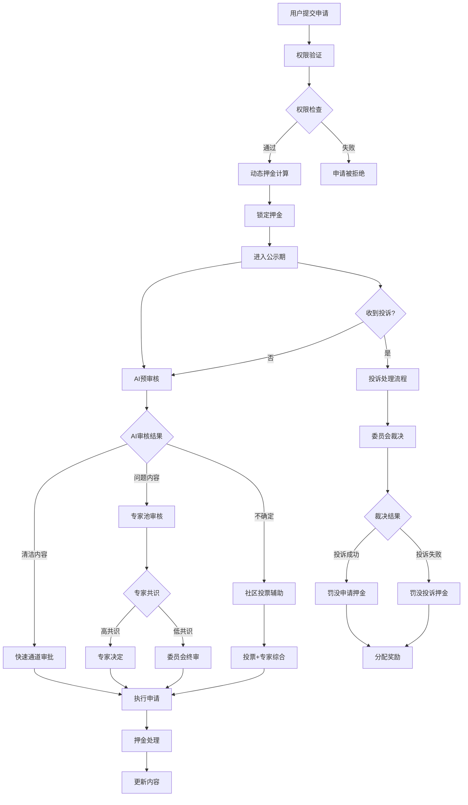

# 逝者信息公众治理最优方案设计

## 执行摘要

本方案综合分析了两个现有治理机制设计，融合两者优势，提出了一个**技术成熟、经济合理、治理有效**的逝者信息公众治理最优方案。该方案基于现有 `pallet-stardust-appeals` 系统进行扩展，引入分层权限、动态押金、智能审核等创新机制。

### 🎯 核心目标

- **技术可行**：基于成熟系统扩展，降低开发风险
- **经济合理**：动态押金机制，提高参与积极性
- **治理有效**：多层防护，确保内容质量
- **用户友好**：移动端优先，简化操作流程

### 🔥 关键创新

1. **分层权限机制**：根据内容重要性设定不同权限阈值
2. **动态押金算法**：根据用户信誉和内容类型智能调整押金
3. **AI+专家+社区三重审核**：提高审核质量和效率
4. **渐进式奖惩机制**：鼓励优质贡献，遏制恶意行为

---

## 1. 方案对比与选择

### 1.1 现有方案对比

| 维度 | 方案A：新建pallet-deceased-governance | 方案B：扩展pallet-stardust-appeals | **最优选择** |
|-----|-------------------------------------|----------------------------------|------------|
| **技术架构** | 独立模块，功能清晰 | 基于成熟系统，稳定可靠 | **方案B** ✅ |
| **开发成本** | 11-13周，全新开发 | 6-8周，增量开发 | **方案B** ✅ |
| **维护复杂度** | 独立维护，复杂度高 | 统一维护，复杂度低 | **方案B** ✅ |
| **功能完整性** | 功能专门化设计 | 通用框架扩展 | **方案A** ✅ |
| **创新设计** | UI/UX设计优秀 | 技术架构成熟 | **融合两者** ⭐ |

### 1.2 最优方案选择逻辑

**选择方案B作为技术基础**，原因：
- ✅ **成熟度**：pallet-stardust-appeals已在生产环境验证
- ✅ **开发效率**：可节省45%开发时间
- ✅ **风险控制**：基于稳定系统扩展，风险更低
- ✅ **维护成本**：统一维护，长期成本更低

**吸收方案A的优秀设计**，包括：
- 📱 移动端优先的UI/UX设计
- 🔒 完善的安全机制设计
- 📊 清晰的状态管理机制
- 🎨 直观的用户交互流程

---

## 2. 最优方案架构设计

### 2.1 技术架构

```
┌─────────────────── 最优治理方案 ───────────────────┐
│                                                  │
│  🎯 核心扩展：pallet-stardust-appeals             │
│  ├── Domain 3: 逝者文本档案                       │
│  ├── Domain 4: 逝者媒体内容                       │
│  └── Domain 7: 逝者作品信息                       │
│                                                  │
│  🔄 新增操作类型：                                │
│  ├── Action 10: 公众申请添加内容                  │
│  ├── Action 11: 公众申请修改内容                  │
│  └── Action 12: 公众申请删除内容                  │
│                                                  │
│  🛡️ 创新机制：                                   │
│  ├── 分层权限控制 (Tiered Permissions)           │
│  ├── 动态押金算法 (Dynamic Deposit)              │
│  ├── 智能预审核 (AI Pre-screening)               │
│  ├── 专家库审核 (Expert Review)                  │
│  ├── 社区投票辅助 (Community Voting)             │
│  └── 渐进式奖惩 (Progressive Incentives)         │
│                                                  │
└──────────────────────────────────────────────────┘
```

### 2.2 分层权限机制

```rust
/// 内容权限等级
#[derive(Encode, Decode, Clone, PartialEq, Eq, TypeInfo)]
pub enum ContentTier {
    /// 公开信息：基本生平、公开作品
    Public,
    /// 敏感信息：个人隐私、家庭关系
    Sensitive,
    /// 核心信息：死亡证明、遗嘱等
    Critical,
}

/// 用户权限等级
#[derive(Encode, Decode, Clone, PartialEq, Eq, TypeInfo)]
pub enum UserTier {
    /// 普通用户：基础编辑权限
    Regular,
    /// 验证用户：通过身份验证
    Verified,
    /// 专家用户：专业背景认证
    Expert,
    /// 家属用户：血缘/法定关系
    Family,
}

/// 权限矩阵
impl PermissionMatrix {
    pub fn can_edit(user_tier: UserTier, content_tier: ContentTier, operation: OperationType) -> bool {
        match (user_tier, content_tier, operation) {
            // 普通用户只能编辑公开信息
            (UserTier::Regular, ContentTier::Public, _) => true,
            // 验证用户可以编辑敏感信息
            (UserTier::Verified, ContentTier::Sensitive, _) => true,
            // 专家用户可以编辑所有非核心信息
            (UserTier::Expert, ContentTier::Critical, OperationType::Add) => false,
            (UserTier::Expert, _, _) => true,
            // 家属用户拥有所有权限
            (UserTier::Family, _, _) => true,
            _ => false,
        }
    }
}
```

### 2.3 动态押金算法

```rust
/// 动态押金计算器
pub struct DynamicDepositCalculator<T: Config> {
    base_deposits: BTreeMap<(u8, u8), BalanceOf<T>>, // (domain, action) -> base_amount
    user_reputation: BTreeMap<T::AccountId, ReputationScore>,
    content_importance: BTreeMap<ContentId, ImportanceLevel>,
}

impl<T: Config> DynamicDepositCalculator<T> {
    /// 计算申请押金
    pub fn calculate_request_deposit(
        &self,
        user: &T::AccountId,
        domain: u8,
        action: u8,
        target_content: Option<ContentId>,
    ) -> Result<BalanceOf<T>, Error<T>> {
        // 1. 基础押金
        let base_deposit = self.base_deposits
            .get(&(domain, action))
            .copied()
            .unwrap_or_else(|| T::BaseRequestDeposit::get());

        // 2. 用户信誉调整（0.5x - 2.0x）
        let reputation_multiplier = self.get_reputation_multiplier(user)?;

        // 3. 内容重要性调整（1.0x - 3.0x）
        let importance_multiplier = target_content
            .and_then(|id| self.content_importance.get(&id))
            .map(|level| level.multiplier())
            .unwrap_or(Perbill::from_percent(100)); // 1.0x

        // 4. 首次用户优惠（0.7x）
        let first_time_discount = if self.is_first_time_user(user) {
            Perbill::from_percent(70) // 30% discount
        } else {
            Perbill::from_percent(100)
        };

        // 5. 综合计算
        let final_deposit = base_deposit
            .saturating_mul(reputation_multiplier.mul_floor(100) as u128)
            .div(100)
            .saturating_mul(importance_multiplier.mul_floor(100) as u128)
            .div(100)
            .saturating_mul(first_time_discount.mul_floor(100) as u128)
            .div(100);

        Ok(final_deposit.into())
    }

    /// 获取信誉乘数
    fn get_reputation_multiplier(&self, user: &T::AccountId) -> Result<Perbill, Error<T>> {
        let reputation = self.user_reputation
            .get(user)
            .copied()
            .unwrap_or(ReputationScore::new());

        // 信誉分数 0-100 映射到 0.5x-2.0x
        let multiplier_bps = match reputation.score {
            90..=100 => 5000,  // 0.5x - 优秀用户大幅减免
            80..=89 => 7000,   // 0.7x - 良好用户减免
            60..=79 => 10000,  // 1.0x - 普通用户正常
            40..=59 => 13000,  // 1.3x - 待观察用户增加
            20..=39 => 16000,  // 1.6x - 低信誉用户大幅增加
            0..=19 => 20000,   // 2.0x - 极低信誉用户最高押金
        };

        Ok(Perbill::from_rational(multiplier_bps, 10000))
    }
}

/// 内容重要性等级
#[derive(Encode, Decode, Clone, PartialEq, Eq, TypeInfo)]
pub enum ImportanceLevel {
    Low,    // 1.0x - 普通内容
    Medium, // 1.5x - 重要内容
    High,   // 2.0x - 核心内容
    Critical, // 3.0x - 关键内容
}

impl ImportanceLevel {
    pub fn multiplier(&self) -> Perbill {
        match self {
            Self::Low => Perbill::from_percent(100),      // 1.0x
            Self::Medium => Perbill::from_percent(150),   // 1.5x
            Self::High => Perbill::from_percent(200),     // 2.0x
            Self::Critical => Perbill::from_percent(300), // 3.0x
        }
    }
}
```

### 2.4 智能审核机制

```rust
/// 三层审核机制
pub struct TripleReviewSystem<T: Config> {
    ai_screener: AIContentScreener,
    expert_pool: ExpertPool<T>,
    community_voting: CommunityVotingSystem<T>,
}

impl<T: Config> TripleReviewSystem<T> {
    /// 处理申请的完整审核流程
    pub async fn process_request(&mut self, request_id: u64) -> Result<ReviewDecision, Error<T>> {
        let request = PublicRequests::<T>::get(request_id)
            .ok_or(Error::<T>::RequestNotFound)?;

        // 第一层：AI 预审核
        let ai_result = self.ai_screener.screen_content(
            &request.reason_cid,
            &request.evidence_cids,
            request.new_content_cid.as_ref(),
        ).await?;

        match ai_result {
            AIDecision::Clear => {
                // AI认为内容无问题，快速通道
                return Ok(ReviewDecision::Approved {
                    reason: \"AI审核通过\".into(),
                    confidence: ai_result.confidence,
                });
            },
            AIDecision::Flagged { issues, severity } => {
                // AI发现问题，进入人工审核
                if severity >= SeverityLevel::High {
                    // 高风险内容，委员会+专家审核
                    return self.expert_committee_review(request_id, issues).await;
                } else {
                    // 中低风险内容，专家池审核
                    return self.expert_pool_review(request_id, issues).await;
                }
            },
            AIDecision::Uncertain => {
                // AI无法判断，社区投票辅助决策
                return self.community_assisted_review(request_id).await;
            }
        }
    }

    /// 专家池审核
    async fn expert_pool_review(
        &mut self,
        request_id: u64,
        ai_issues: Vec<AIIssue>
    ) -> Result<ReviewDecision, Error<T>> {
        // 1. 根据内容类型选择专家
        let request = PublicRequests::<T>::get(request_id).unwrap();
        let relevant_experts = self.expert_pool.get_experts_for_domain(
            request.domain,
            request.action
        )?;

        // 2. 分配给多个专家审核
        let review_tasks: Vec<_> = relevant_experts.iter()
            .take(3) // 最多3个专家
            .map(|expert| self.assign_expert_review(expert, request_id, &ai_issues))
            .collect();

        // 3. 等待专家审核结果
        let expert_decisions = futures::future::try_join_all(review_tasks).await?;

        // 4. 综合专家意见
        let consensus = self.calculate_expert_consensus(&expert_decisions)?;

        // 5. 如果专家意见分歧较大，提交委员会
        if consensus.confidence < Percent::from_percent(70) {
            return self.committee_final_review(request_id, expert_decisions).await;
        }

        Ok(consensus.decision)
    }

    /// 社区投票辅助审核
    async fn community_assisted_review(&mut self, request_id: u64) -> Result<ReviewDecision, Error<T>> {
        // 1. 发起社区投票
        let voting_id = self.community_voting.create_vote(
            request_id,
            VotingType::ContentReview,
            Duration::from_days(3), // 3天投票期
        )?;

        // 2. 设置投票权重（根据用户信誉）
        let eligible_voters = self.community_voting.get_eligible_voters(
            MinReputation::from(50), // 最低信誉要求
            MaxVoters::from(100),    // 最多100人参与
        )?;

        // 3. 等待投票结果
        let voting_result = self.community_voting.wait_for_result(voting_id).await?;

        // 4. 结合投票结果和专家意见
        let final_decision = self.combine_community_and_expert_opinion(
            request_id,
            voting_result
        )?;

        Ok(final_decision)
    }
}

/// AI内容筛查器
pub struct AIContentScreener {
    model_endpoint: String,
    confidence_threshold: Percent,
}

impl AIContentScreener {
    /// 内容筛查
    pub async fn screen_content(
        &self,
        reason_cid: &[u8],
        evidence_cids: &[Vec<u8>],
        content_cid: Option<&[u8]>,
    ) -> Result<AIDecision, AIError> {
        // 1. 获取内容
        let reason_text = ipfs::get_text(reason_cid).await?;
        let evidence_data = self.fetch_evidence(evidence_cids).await?;
        let content_data = if let Some(cid) = content_cid {
            Some(ipfs::get_content(cid).await?)
        } else {
            None
        };

        // 2. AI分析
        let analysis_request = AIAnalysisRequest {
            reason: reason_text,
            evidence: evidence_data,
            content: content_data,
            task: \"content_governance_review\",
        };

        let response = self.call_ai_model(analysis_request).await?;

        // 3. 解析结果
        let decision = match response.risk_level {
            0.0..=0.3 => AIDecision::Clear,
            0.3..=0.7 => AIDecision::Uncertain,
            0.7..=1.0 => AIDecision::Flagged {
                issues: response.detected_issues,
                severity: SeverityLevel::from_score(response.risk_level),
            },
        };

        Ok(decision)
    }
}
```

---

## 3. 核心机制详细设计

### 3.1 申请处理流程



### 3.2 优化的押金分配机制

```rust
/// 优化的押金分配规则
pub struct OptimizedDepositDistribution;

impl OptimizedDepositDistribution {
    /// 投诉成功时的押金分配
    pub fn distribute_on_complaint_success<T: Config>(
        request_deposit: BalanceOf<T>,
        complaint_deposit: BalanceOf<T>,
        complainant: &T::AccountId,
        committee_members: &[(T::AccountId, Perbill)], // (账户, 参与度权重)
    ) -> Result<DistributionPlan<T>, Error<T>> {
        let total_pool = request_deposit;

        // 分配比例优化：85% 投诉人 + 15% 委员会
        let complainant_share = Perbill::from_percent(85).mul_floor(total_pool);
        let committee_share = total_pool.saturating_sub(complainant_share);

        // 投诉押金全额退回
        let refund_to_complainant = complaint_deposit;

        Ok(DistributionPlan {
            complainant_reward: complainant_share,
            complainant_refund: refund_to_complainant,
            committee_distribution: Self::distribute_committee_share(
                committee_share,
                committee_members
            )?,
            treasury_allocation: BalanceOf::<T>::zero(),
        })
    }

    /// 投诉失败时的押金分配
    pub fn distribute_on_complaint_failure<T: Config>(
        complaint_deposit: BalanceOf<T>,
        original_owner: &T::AccountId,
        committee_members: &[(T::AccountId, Perbill)],
    ) -> Result<DistributionPlan<T>, Error<T>> {
        let total_pool = complaint_deposit;

        // 分配比例：75% 原所有者 + 20% 委员会 + 5% 国库
        let owner_share = Perbill::from_percent(75).mul_floor(total_pool);
        let committee_share = Perbill::from_percent(20).mul_floor(total_pool);
        let treasury_share = total_pool
            .saturating_sub(owner_share)
            .saturating_sub(committee_share);

        Ok(DistributionPlan {
            owner_reward: owner_share,
            committee_distribution: Self::distribute_committee_share(
                committee_share,
                committee_members
            )?,
            treasury_allocation: treasury_share,
        })
    }

    /// 委员会内部分配
    fn distribute_committee_share<T: Config>(
        total_share: BalanceOf<T>,
        members: &[(T::AccountId, Perbill)],
    ) -> Result<Vec<(T::AccountId, BalanceOf<T>)>, Error<T>> {
        if members.is_empty() {
            return Ok(vec![]);
        }

        // 按参与度权重分配
        let total_weight: u32 = members.iter()
            .map(|(_, weight)| weight.deconstruct())
            .sum();

        if total_weight == 0 {
            // 如果没有权重，平均分配
            let per_member = total_share / (members.len() as u32).into();
            return Ok(members.iter()
                .map(|(account, _)| (account.clone(), per_member))
                .collect());
        }

        // 按权重比例分配
        let mut distributions = Vec::new();
        for (account, weight) in members {
            let member_weight = Perbill::from_rational(
                weight.deconstruct(),
                total_weight
            );
            let member_share = member_weight.mul_floor(total_share);
            distributions.push((account.clone(), member_share));
        }

        Ok(distributions)
    }
}
```

### 3.3 用户信誉系统

```rust
/// 用户信誉评分系统
#[derive(Encode, Decode, Clone, PartialEq, Eq, TypeInfo, MaxEncodedLen)]
pub struct ReputationScore {
    /// 基础分数 (0-100)
    pub base_score: u8,
    /// 申请成功次数
    pub successful_requests: u32,
    /// 申请失败次数
    pub failed_requests: u32,
    /// 投诉成功次数
    pub successful_complaints: u32,
    /// 投诉失败次数
    pub failed_complaints: u32,
    /// 被投诉次数
    pub times_complained: u32,
    /// 专家评分加成
    pub expert_bonus: u8,
    /// 社区贡献加成
    pub community_bonus: u8,
    /// 最后更新时间
    pub last_updated: BlockNumber,
}

impl ReputationScore {
    /// 新用户默认信誉
    pub fn new() -> Self {
        Self {
            base_score: 60, // 新用户从60分开始
            successful_requests: 0,
            failed_requests: 0,
            successful_complaints: 0,
            failed_complaints: 0,
            times_complained: 0,
            expert_bonus: 0,
            community_bonus: 0,
            last_updated: 0,
        }
    }

    /// 计算综合信誉分数
    pub fn calculate_total_score(&self) -> u8 {
        let success_rate_bonus = self.calculate_success_rate_bonus();
        let activity_bonus = self.calculate_activity_bonus();
        let penalty = self.calculate_penalty();

        let total = (self.base_score as i16)
            .saturating_add(success_rate_bonus)
            .saturating_add(activity_bonus)
            .saturating_add(self.expert_bonus as i16)
            .saturating_add(self.community_bonus as i16)
            .saturating_sub(penalty);

        (total.max(0).min(100)) as u8
    }

    /// 计算成功率奖励
    fn calculate_success_rate_bonus(&self) -> i16 {
        let total_requests = self.successful_requests + self.failed_requests;
        let total_complaints = self.successful_complaints + self.failed_complaints;

        if total_requests + total_complaints < 5 {
            return 0; // 样本太少，不给奖励
        }

        let request_success_rate = if total_requests > 0 {
            (self.successful_requests as f32) / (total_requests as f32)
        } else {
            0.0
        };

        let complaint_success_rate = if total_complaints > 0 {
            (self.successful_complaints as f32) / (total_complaints as f32)
        } else {
            0.0
        };

        // 高成功率奖励
        let request_bonus = if request_success_rate >= 0.8 { 10 }
                           else if request_success_rate >= 0.6 { 5 }
                           else { 0 };

        let complaint_bonus = if complaint_success_rate >= 0.7 { 8 }
                             else if complaint_success_rate >= 0.5 { 4 }
                             else { 0 };

        request_bonus + complaint_bonus
    }

    /// 计算活跃度奖励
    fn calculate_activity_bonus(&self) -> i16 {
        let total_activity = self.successful_requests
            + self.failed_requests
            + self.successful_complaints
            + self.failed_complaints;

        // 活跃度奖励：10-50次活动+2分，50-100次+5分，100+次+8分
        match total_activity {
            10..=49 => 2,
            50..=99 => 5,
            100.. => 8,
            _ => 0,
        }
    }

    /// 计算被投诉惩罚
    fn calculate_penalty(&self) -> i16 {
        // 被投诉惩罚：每被投诉1次扣2分，上限扣20分
        (self.times_complained as i16 * 2).min(20)
    }

    /// 更新申请结果
    pub fn update_request_result(&mut self, success: bool, current_block: BlockNumber) {
        if success {
            self.successful_requests = self.successful_requests.saturating_add(1);
        } else {
            self.failed_requests = self.failed_requests.saturating_add(1);
        }
        self.last_updated = current_block;
    }

    /// 更新投诉结果
    pub fn update_complaint_result(&mut self, success: bool, current_block: BlockNumber) {
        if success {
            self.successful_complaints = self.successful_complaints.saturating_add(1);
        } else {
            self.failed_complaints = self.failed_complaints.saturating_add(1);
        }
        self.last_updated = current_block;
    }

    /// 记录被投诉
    pub fn record_complained(&mut self, current_block: BlockNumber) {
        self.times_complained = self.times_complained.saturating_add(1);
        self.last_updated = current_block;
    }

    /// 获取押金倍数
    pub fn get_deposit_multiplier(&self) -> Perbill {
        let score = self.calculate_total_score();
        match score {
            90..=100 => Perbill::from_percent(50),   // 0.5x - 优秀用户
            80..=89 => Perbill::from_percent(70),    // 0.7x - 良好用户
            60..=79 => Perbill::from_percent(100),   // 1.0x - 普通用户
            40..=59 => Perbill::from_percent(130),   // 1.3x - 待观察用户
            20..=39 => Perbill::from_percent(160),   // 1.6x - 低信誉用户
            0..=19 => Perbill::from_percent(200),    // 2.0x - 极低信誉用户
        }
    }
}
```

---

## 4. 前端用户体验设计

### 4.1 移动端优先设计

```typescript
// 申请提交界面组件
interface ContentEditRequest {
  deceasedId: string;
  contentType: 'text' | 'media' | 'works';
  operation: 'add' | 'modify' | 'delete';
  content: ContentData;
  reason: string;
  evidence: FileList;
}

const RequestSubmissionPage: React.FC = () => {
  const [request, setRequest] = useState<ContentEditRequest>();
  const [estimatedDeposit, setEstimatedDeposit] = useState<string>('0');
  const [userReputation, setUserReputation] = useState<ReputationInfo>();
  const [permissionCheck, setPermissionCheck] = useState<PermissionResult>();

  // 实时计算押金
  const calculateDeposit = useCallback(async () => {
    if (!request) return;

    const deposit = await api.calculateDynamicDeposit({
      userId: currentUser.id,
      contentType: request.contentType,
      operation: request.operation,
      targetId: request.targetId,
    });

    setEstimatedDeposit(deposit.amount);
  }, [request]);

  return (
    <div className=\"max-w-md mx-auto p-4 space-y-6\">
      {/* 申请类型选择 */}
      <ContentTypeSelector
        value={request?.contentType}
        onChange={(type) => setRequest(prev => ({ ...prev, contentType: type }))}
      />

      {/* 权限检查状态 */}
      <PermissionBadge
        userTier={userReputation?.tier}
        contentTier={permissionCheck?.requiredTier}
        status={permissionCheck?.allowed}
      />

      {/* 内容编辑器 */}
      <ContentEditor
        type={request?.contentType}
        initialValue={request?.content}
        onChange={(content) => setRequest(prev => ({ ...prev, content }))}
      />

      {/* 申请理由 */}
      <ReasonInput
        value={request?.reason}
        onChange={(reason) => setRequest(prev => ({ ...prev, reason }))}
        placeholder=\"请详细说明申请理由...\"
      />

      {/* 证据上传 */}
      <EvidenceUploader
        files={request?.evidence}
        onChange={(evidence) => setRequest(prev => ({ ...prev, evidence }))}
        maxFiles={5}
        maxSize={10 * 1024 * 1024} // 10MB
      />

      {/* 押金信息 */}
      <DepositInfoCard>
        <div className=\"flex justify-between items-center\">
          <span>预估押金</span>
          <div className=\"text-right\">
            <div className=\"text-2xl font-bold\">{estimatedDeposit} DUST</div>
            {userReputation?.tier !== 'Regular' && (
              <div className=\"text-sm text-green-600\">
                已享受 {userReputation.discountRate}% 信誉优惠
              </div>
            )}
          </div>
        </div>

        <ReputationIndicator score={userReputation?.score} />

        <DepositBreakdown
          baseAmount={estimatedDeposit.base}
          reputationMultiplier={estimatedDeposit.reputationMultiplier}
          contentMultiplier={estimatedDeposit.contentMultiplier}
          firstTimeDiscount={estimatedDeposit.firstTimeDiscount}
        />
      </DepositInfoCard>

      {/* 提交按钮 */}
      <SubmitButton
        disabled={!isFormValid}
        loading={submitting}
        onClick={handleSubmit}
      >
        锁定押金并提交申请
      </SubmitButton>

      {/* 公示期说明 */}
      <NotificationPeriodInfo
        duration=\"7天\"
        description=\"申请将进入公示期，期间公众可进行投诉\"
      />
    </div>
  );
};

// 申请状态追踪页面
const RequestTrackingPage: React.FC<{ requestId: string }> = ({ requestId }) => {
  const { request, loading } = useRequest(requestId);

  if (loading) return <LoadingSpinner />;

  return (
    <div className=\"max-w-md mx-auto p-4\">
      {/* 状态时间线 */}
      <StatusTimeline>
        <TimelineItem
          status=\"completed\"
          title=\"申请提交\"
          description={`押金 ${request.deposit} DUST 已锁定`}
          timestamp={request.submittedAt}
        />

        <TimelineItem
          status={request.status === 'notice_period' ? 'active' : 'completed'}
          title=\"公示期\"
          description={
            request.status === 'notice_period'
              ? <CountdownTimer endTime={request.noticeEndTime} />
              : \"公示期已结束\"
          }
        />

        {request.complaints?.length > 0 && (
          <TimelineItem
            status=\"warning\"
            title=\"收到投诉\"
            description={`${request.complaints.length} 个投诉待处理`}
          />
        )}

        <TimelineItem
          status={getReviewStatus(request)}
          title=\"审核中\"
          description={getReviewDescription(request)}
        />
      </StatusTimeline>

      {/* 申请详情 */}
      <RequestDetailsCard request={request} />

      {/* 投诉列表 */}
      {request.complaints?.length > 0 && (
        <ComplaintsList complaints={request.complaints} />
      )}

      {/* 操作按钮 */}
      <div className=\"mt-6 space-y-3\">
        {request.status === 'notice_period' && (
          <Button variant=\"outline\" onClick={() => router.push(`/requests/${requestId}/withdraw`)}>
            撤回申请
          </Button>
        )}

        {request.canComplaint && (
          <Button variant=\"secondary\" onClick={() => router.push(`/requests/${requestId}/complaint`)}>
            提交投诉
          </Button>
        )}
      </div>
    </div>
  );
};

// 投诉提交页面
const ComplaintSubmissionPage: React.FC<{ requestId: string }> = ({ requestId }) => {
  const [complaint, setComplaint] = useState<ComplaintData>();
  const [depositAmount, setDepositAmount] = useState<string>('0');

  return (
    <div className=\"max-w-md mx-auto p-4 space-y-6\">
      {/* 原申请信息 */}
      <OriginalRequestCard requestId={requestId} />

      {/* 投诉理由 */}
      <ComplaintReasonSelector
        value={complaint?.reason}
        onChange={(reason) => setComplaint(prev => ({ ...prev, reason }))}
        options={[
          { value: 'false_info', label: '虚假信息', description: '申请包含明显错误或虚假内容' },
          { value: 'inappropriate', label: '内容不当', description: '申请内容不适合或违反规范' },
          { value: 'unauthorized', label: '无权修改', description: '申请人无权限修改此内容' },
          { value: 'malicious', label: '恶意申请', description: '明显的恶意或垃圾申请' },
          { value: 'other', label: '其他原因', description: '其他不符合规范的情况' },
        ]}
      />

      {/* 详细说明 */}
      <DetailedExplanation
        value={complaint?.explanation}
        onChange={(explanation) => setComplaint(prev => ({ ...prev, explanation }))}
        placeholder=\"请详细说明投诉理由和证据...\"
        minLength={100}
      />

      {/* 证据上传 */}
      <EvidenceUploader
        files={complaint?.evidence}
        onChange={(evidence) => setComplaint(prev => ({ ...prev, evidence }))}
        title=\"投诉证据\"
        description=\"上传支持投诉理由的相关证据\"
      />

      {/* 投诉押金信息 */}
      <ComplaintDepositCard>
        <div className=\"text-center\">
          <div className=\"text-3xl font-bold text-orange-600\">{depositAmount} DUST</div>
          <div className=\"text-sm text-gray-600 mt-1\">投诉押金</div>
        </div>

        <div className=\"mt-4 p-3 bg-amber-50 rounded-lg\">
          <div className=\"flex items-center text-amber-800\">
            <AlertTriangleIcon className=\"w-4 h-4 mr-2\" />
            <span className=\"text-sm font-medium\">投诉风险提示</span>
          </div>
          <ul className=\"mt-2 text-xs text-amber-700 space-y-1\">
            <li>• 投诉成功：获得申请方押金的80%</li>
            <li>• 投诉失败：您的押金将被罚没</li>
            <li>• 请确保投诉理由充分且证据确凿</li>
          </ul>
        </div>
      </ComplaintDepositCard>

      {/* 提交按钮 */}
      <SubmitComplaintButton
        disabled={!isComplaintValid}
        depositAmount={depositAmount}
        onClick={handleSubmitComplaint}
      />
    </div>
  );
};
```

### 4.2 管理员审核界面

```typescript
// 委员会审核工作台
const ReviewWorkbench: React.FC = () => {
  const [pendingReviews, setPendingReviews] = useState<ReviewTask[]>([]);
  const [currentReview, setCurrentReview] = useState<ReviewTask | null>(null);
  const [aiInsights, setAIInsights] = useState<AIInsights | null>(null);

  return (
    <div className=\"min-h-screen bg-gray-50\">
      {/* 头部状态栏 */}
      <ReviewHeader>
        <div className=\"flex items-center space-x-6\">
          <StatCard title=\"待审核\" value={pendingReviews.length} color=\"orange\" />
          <StatCard title=\"今日完成\" value={reviewStats.todayCompleted} color=\"green\" />
          <StatCard title=\"平均处理时间\" value={reviewStats.avgTime} unit=\"小时\" color=\"blue\" />
        </div>
      </ReviewHeader>

      <div className=\"flex\">
        {/* 左侧：待审核列表 */}
        <ReviewQueue className=\"w-1/3 bg-white\">
          <div className=\"p-4 border-b\">
            <h2 className=\"font-semibold\">待审核队列</h2>
            <FilterTabs
              filters={['全部', '申请', '投诉', '紧急']}
              active={activeFilter}
              onChange={setActiveFilter}
            />
          </div>

          <div className=\"overflow-y-auto\">
            {pendingReviews.map(review => (
              <ReviewTaskCard
                key={review.id}
                task={review}
                active={currentReview?.id === review.id}
                onClick={() => setCurrentReview(review)}
              >
                <div className=\"flex items-center justify-between\">
                  <div>
                    <div className=\"font-medium\">{getTaskTitle(review)}</div>
                    <div className=\"text-sm text-gray-500\">{review.submittedBy}</div>
                  </div>
                  <div className=\"text-right\">
                    <PriorityBadge level={review.priority} />
                    <div className=\"text-xs text-gray-400 mt-1\">
                      {formatTimeAgo(review.submittedAt)}
                    </div>
                  </div>
                </div>

                {review.type === 'complaint' && (
                  <ComplaintPreview complaint={review.complaint} />
                )}

                <AIRiskIndicator score={review.aiRiskScore} />
              </ReviewTaskCard>
            ))}
          </div>
        </ReviewQueue>

        {/* 右侧：审核详情 */}
        <ReviewDetails className=\"flex-1 bg-white ml-4 mr-4 rounded-lg shadow\">
          {currentReview ? (
            <div className=\"p-6\">
              {/* 任务概要 */}
              <ReviewSummary>
                <div className=\"flex items-center justify-between mb-4\">
                  <h1 className=\"text-xl font-bold\">{getTaskTitle(currentReview)}</h1>
                  <div className=\"flex items-center space-x-2\">
                    <PriorityBadge level={currentReview.priority} />
                    <TypeBadge type={currentReview.type} />
                  </div>
                </div>

                <div className=\"grid grid-cols-3 gap-4 mb-6\">
                  <InfoCard title=\"申请人\" value={currentReview.submittedBy} />
                  <InfoCard title=\"提交时间\" value={formatDateTime(currentReview.submittedAt)} />
                  <InfoCard title=\"押金金额\" value={`${currentReview.depositAmount} DUST`} />
                </div>
              </ReviewSummary>

              {/* AI 分析结果 */}
              {aiInsights && (
                <AIAnalysisPanel insights={aiInsights}>
                  <div className=\"bg-blue-50 p-4 rounded-lg mb-6\">
                    <div className=\"flex items-center mb-3\">
                      <BrainIcon className=\"w-5 h-5 text-blue-600 mr-2\" />
                      <span className=\"font-medium text-blue-900\">AI 分析结果</span>
                      <ConfidenceBadge score={aiInsights.confidence} />
                    </div>

                    <div className=\"space-y-3\">
                      <RiskAssessment risks={aiInsights.detectedRisks} />
                      <ContentAnalysis analysis={aiInsights.contentAnalysis} />
                      <RecommendedAction action={aiInsights.recommendedAction} />
                    </div>
                  </div>
                </AIAnalysisPanel>
              )}

              {/* 内容对比视图 */}
              <ContentComparison>
                <div className=\"grid grid-cols-2 gap-6 mb-6\">
                  <div>
                    <h3 className=\"font-medium mb-2\">原内容</h3>
                    <ContentViewer content={currentReview.originalContent} readonly />
                  </div>
                  <div>
                    <h3 className=\"font-medium mb-2\">申请内容</h3>
                    <ContentViewer
                      content={currentReview.proposedContent}
                      highlights={getChanges(currentReview)}
                      readonly
                    />
                  </div>
                </div>
              </ContentComparison>

              {/* 申请理由和证据 */}
              <ReasonAndEvidence>
                <div className=\"mb-6\">
                  <h3 className=\"font-medium mb-2\">申请理由</h3>
                  <div className=\"bg-gray-50 p-3 rounded border\">
                    {currentReview.reason}
                  </div>
                </div>

                <div className=\"mb-6\">
                  <h3 className=\"font-medium mb-2\">证据材料</h3>
                  <EvidenceGallery evidence={currentReview.evidence} />
                </div>
              </ReasonAndEvidence>

              {/* 投诉信息（如有） */}
              {currentReview.complaints?.length > 0 && (
                <ComplaintsSection>
                  <h3 className=\"font-medium mb-4\">相关投诉 ({currentReview.complaints.length})</h3>
                  {currentReview.complaints.map(complaint => (
                    <ComplaintCard key={complaint.id} complaint={complaint} />
                  ))}
                </ComplaintsSection>
              )}

              {/* 审核操作 */}
              <ReviewActions className=\"border-t pt-6 mt-6\">
                <div className=\"flex space-x-4\">
                  <Button
                    variant=\"success\"
                    size=\"lg\"
                    onClick={() => handleApprove(currentReview.id)}
                  >
                    <CheckIcon className=\"w-4 h-4 mr-2\" />
                    批准申请
                  </Button>

                  <Button
                    variant=\"danger\"
                    size=\"lg\"
                    onClick={() => handleReject(currentReview.id)}
                  >
                    <XIcon className=\"w-4 h-4 mr-2\" />
                    驳回申请
                  </Button>

                  <Button
                    variant=\"secondary\"
                    onClick={() => handleRequestMoreInfo(currentReview.id)}
                  >
                    <InfoIcon className=\"w-4 h-4 mr-2\" />
                    要求补充信息
                  </Button>
                </div>

                <div className=\"mt-4\">
                  <label className=\"block text-sm font-medium mb-2\">审核意见</label>
                  <textarea
                    className=\"w-full p-3 border rounded-lg\"
                    rows={3}
                    placeholder=\"请输入审核意见...（必填）\"
                    value={reviewComment}
                    onChange={(e) => setReviewComment(e.target.value)}
                  />
                </div>
              </ReviewActions>
            </div>
          ) : (
            <EmptyState message=\"请从左侧选择待审核任务\" />
          )}
        </ReviewDetails>
      </div>
    </div>
  );
};
```

---

## 5. 实施路线图

### 5.1 开发阶段划分

```
Phase 1: 核心功能开发 (4周)
├── Week 1: 扩展pallet-stardust-appeals
│   ├── 新增Domain 3, 4, 7支持
│   ├── 新增Action 10, 11, 12支持
│   ├── 实现动态押金计算
│   └── 基础接口实现
├── Week 2: 权限和信誉系统
│   ├── 分层权限控制
│   ├── 用户信誉评分
│   ├── 动态押金算法
│   └── 单元测试
├── Week 3: 审核机制
│   ├── AI预审核接口
│   ├── 专家池管理
│   ├── 社区投票系统
│   └── 三层审核流程
└── Week 4: 押金分配优化
    ├── 优化分配算法
    ├── 委员会奖励分配
    ├── 退款机制
    └── 集成测试

Phase 2: 前端界面开发 (3周)
├── Week 5: 移动端申请界面
│   ├── 申请提交页面
│   ├── 状态追踪页面
│   ├── 投诉提交页面
│   └── 用户信誉页面
├── Week 6: 管理端审核界面
│   ├── 审核工作台
│   ├── AI分析面板
│   ├── 内容对比视图
│   └── 批量处理功能
└── Week 7: 优化和集成
    ├── 界面优化
    ├── 响应式适配
    ├── 前后端集成
    └── 用户体验测试

Phase 3: 测试和优化 (2周)
├── Week 8: 系统测试
│   ├── 功能测试
│   ├── 性能测试
│   ├── 安全测试
│   └── 兼容性测试
└── Week 9: 优化和部署
    ├── Bug修复
    ├── 性能优化
    ├── 文档完善
    └── 测试网部署

Phase 4: 上线和监控 (1周)
└── Week 10: 主网部署
    ├── 参数配置
    ├── 灰度发布
    ├── 监控设置
    └── 用户培训
```

### 5.2 关键里程碑

| 里程碑 | 时间节点 | 交付物 | 成功标准 |
|--------|----------|--------|----------|
| **MVP完成** | Week 4 | 核心功能可用 | 申请、投诉、审核流程正常运行 |
| **前端完成** | Week 7 | 用户界面可用 | 移动端和管理端界面功能完整 |
| **测试完成** | Week 9 | 系统稳定可靠 | 功能测试通过率>95%，性能达标 |
| **正式上线** | Week 10 | 系统投产运行 | 用户可正常使用全部功能 |

### 5.3 风险控制措施

#### 技术风险控制
- **代码审查**：每个PR必须经过2人以上审查
- **自动化测试**：单元测试覆盖率>90%，集成测试覆盖关键流程
- **分阶段部署**：先测试网验证，再主网灰度发布
- **回滚方案**：准备紧急回滚和数据恢复方案

#### 产品风险控制
- **用户测试**：邀请早期用户参与测试反馈
- **参数调优**：根据测试数据调整押金、奖励等参数
- **功能开关**：关键功能支持动态开启/关闭
- **监控告警**：实时监控系统健康状态和用户行为

#### 运营风险控制
- **社区沟通**：提前与社区沟通功能变更和使用方法
- **文档完善**：提供详细的用户指南和FAQ
- **客服支持**：准备充足的客服资源处理用户问题
- **激励措施**：初期设置新手优惠和优质贡献奖励

---

## 6. 经济模型设计

### 6.1 押金标准建议

| 内容类型 | 操作 | 基础押金 | 说明 |
|---------|------|---------|------|
| **文本档案** | 添加 | 15 DUST | 新增文本信息，需要验证真实性 |
| **文本档案** | 修改 | 25 DUST | 修改现有文本，影响较大 |
| **文本档案** | 删除 | 40 DUST | 删除不可逆，需要更高门槛 |
| **媒体内容** | 添加 | 25 DUST | 媒体文件较大，存储成本高 |
| **媒体内容** | 修改 | 35 DUST | 修改媒体需要重新处理 |
| **媒体内容** | 删除 | 55 DUST | 删除媒体影响较大 |
| **作品信息** | 添加 | 20 DUST | 作品信息需要版权验证 |
| **作品信息** | 修改 | 30 DUST | 修改作品信息需要谨慎 |
| **作品信息** | 删除 | 70 DUST | 删除作品影响最大 |

### 6.2 信誉调整系数

| 信誉等级 | 分数范围 | 押金倍数 | 优惠比例 | 特殊权限 |
|---------|---------|---------|---------|---------|
| **新手** | 0-59 | 1.2x | - | 基础权限 |
| **普通** | 60-79 | 1.0x | - | 基础权限 |
| **良好** | 80-89 | 0.8x | 20% | 快速审核 |
| **优秀** | 90-95 | 0.6x | 40% | 优先处理 |
| **专家** | 96-100 | 0.4x | 60% | 专家标识 |

### 6.3 奖励分配优化

#### 投诉成功分配（新方案）
```
申请方押金 100 DUST：
├── 85% → 投诉人 (85 DUST) ⬆️ 提高激励
├── 12% → 委员会 (12 DUST)
└── 3% → 国库 (3 DUST) 🆕 支持系统运营
```

#### 投诉失败分配（新方案）
```
投诉方押金 100 DUST：
├── 75% → 原内容所有者 (75 DUST)
├── 20% → 委员会 (20 DUST)
└── 5% → 国库 (5 DUST) 🆕 支持系统运营
```

### 6.4 经济可持续性分析

**收入来源**：
- 3-5%的押金流向国库，支持系统运营
- 委员会获得稳定的治理奖励
- 高质量内容贡献者获得信誉奖励

**成本控制**：
- AI预审核降低人工审核成本
- 分层权限减少无效申请
- 信誉系统提高申请质量

**风险控制**：
- 动态调整押金标准，确保门槛合理
- 设置押金池最低阈值，避免系统瘫痪
- 建立应急资金池，应对极端情况

---

## 7. 监控和治理

### 7.1 关键性能指标 (KPI)

| 指标类别 | 指标名称 | 目标值 | 监控频率 | 告警阈值 |
|---------|---------|--------|---------|---------|
| **申请质量** | 申请通过率 | 70-85% | 每日 | <60% 或 >90% |
| **申请质量** | 撤回率 | <10% | 每日 | >15% |
| **投诉效率** | 投诉成功率 | 40-60% | 每日 | <30% 或 >70% |
| **投诉效率** | 恶意投诉率 | <5% | 每周 | >10% |
| **审核效率** | 平均处理时间 | <48小时 | 实时 | >72小时 |
| **审核效率** | 积压申请数 | <50 | 实时 | >100 |
| **用户满意度** | NPS评分 | >6.0 | 每月 | <5.0 |
| **经济健康** | 押金池余额 | >10000 DUST | 每日 | <5000 DUST |

### 7.2 自动化监控系统

```rust
/// 系统健康监控器
#[pallet::hooks]
impl<T: Config> Hooks<BlockNumberFor<T>> for Pallet<T> {
    fn on_initialize(block_number: BlockNumberFor<T>) -> Weight {
        // 每100个块（约10分钟）执行一次健康检查
        if block_number % 100u32.into() == Zero::zero() {
            Self::perform_health_check(block_number);
        }

        T::DbWeight::get().reads_writes(5, 2)
    }
}

impl<T: Config> Pallet<T> {
    /// 执行系统健康检查
    fn perform_health_check(block_number: BlockNumberFor<T>) {
        let mut alerts = Vec::new();

        // 1. 检查积压申请
        let pending_count = Self::count_pending_requests();
        if pending_count > T::MaxPendingRequests::get() {
            alerts.push(SystemAlert::RequestBacklog {
                count: pending_count,
                threshold: T::MaxPendingRequests::get(),
            });
        }

        // 2. 检查押金池余额
        let total_deposits = Self::calculate_total_held_deposits();
        if total_deposits < T::MinDepositPoolBalance::get() {
            alerts.push(SystemAlert::LowDepositPool {
                current: total_deposits,
                minimum: T::MinDepositPoolBalance::get(),
            });
        }

        // 3. 检查审核超时
        let overdue_reviews = Self::get_overdue_reviews(block_number);
        if !overdue_reviews.is_empty() {
            alerts.push(SystemAlert::OverdueReviews {
                count: overdue_reviews.len() as u32,
                oldest: overdue_reviews[0].submitted_at,
            });
        }

        // 4. 检查异常用户行为
        let suspicious_users = Self::detect_suspicious_behavior(block_number);
        if !suspicious_users.is_empty() {
            alerts.push(SystemAlert::SuspiciousActivity {
                users: suspicious_users,
            });
        }

        // 5. 发送告警事件
        for alert in alerts {
            Self::deposit_event(Event::SystemAlert { alert });
        }
    }

    /// 检测可疑用户行为
    fn detect_suspicious_behavior(block_number: BlockNumberFor<T>) -> Vec<T::AccountId> {
        let mut suspicious_users = Vec::new();
        let time_window = BlockNumberFor::<T>::from(14400u32); // 24小时
        let start_block = block_number.saturating_sub(time_window);

        // 检查频繁申请用户
        for (user, requests) in UserRequestCounts::<T>::iter() {
            if requests.len() > 10 { // 24小时内超过10次申请
                let recent_requests: Vec<_> = requests.into_iter()
                    .filter(|&block| block >= start_block)
                    .collect();

                if recent_requests.len() > 10 {
                    suspicious_users.push(user);
                }
            }
        }

        // 检查频繁投诉用户
        for (user, complaints) in UserComplaintCounts::<T>::iter() {
            if complaints.len() > 5 { // 24小时内超过5次投诉
                let recent_complaints: Vec<_> = complaints.into_iter()
                    .filter(|&block| block >= start_block)
                    .collect();

                if recent_complaints.len() > 5 {
                    suspicious_users.push(user);
                }
            }
        }

        suspicious_users
    }
}

/// 系统告警类型
#[derive(Encode, Decode, Clone, PartialEq, Eq, TypeInfo)]
pub enum SystemAlert<T: Config> {
    RequestBacklog {
        count: u32,
        threshold: u32,
    },
    LowDepositPool {
        current: BalanceOf<T>,
        minimum: BalanceOf<T>,
    },
    OverdueReviews {
        count: u32,
        oldest: BlockNumberFor<T>,
    },
    SuspiciousActivity {
        users: Vec<T::AccountId>,
    },
}
```

### 7.3 治理参数调优机制

```rust
/// 动态参数调整系统
pub struct ParameterTuningSystem<T: Config> {
    /// 当前参数配置
    pub current_config: GovernanceConfig<T>,
    /// 调整历史
    pub adjustment_history: Vec<ParameterAdjustment<T>>,
    /// 性能监控数据
    pub performance_metrics: PerformanceMetrics,
}

impl<T: Config> ParameterTuningSystem<T> {
    /// 根据系统表现自动调整参数
    pub fn auto_tune_parameters(&mut self) -> Result<Vec<ParameterChange>, Error<T>> {
        let mut changes = Vec::new();
        let metrics = &self.performance_metrics;

        // 1. 调整公示期长度
        if metrics.avg_complaint_time < Duration::from_days(2) {
            // 如果投诉很快，可以缩短公示期
            let new_notice_period = self.current_config.notice_period
                .saturating_mul(90)  // 减少10%
                .saturating_div(100);

            changes.push(ParameterChange::NoticePeriod {
                old: self.current_config.notice_period,
                new: new_notice_period,
                reason: \"投诉响应快，缩短公示期\".into(),
            });
        }

        // 2. 调整押金标准
        if metrics.request_success_rate > Percent::from_percent(90) {
            // 如果成功率过高，可能押金偏低，需要提高质量门槛
            let multiplier = Perbill::from_percent(110); // 增加10%
            changes.push(ParameterChange::DepositMultiplier {
                multiplier,
                reason: \"申请质量过高，提高押金门槛\".into(),
            });
        } else if metrics.request_success_rate < Percent::from_percent(60) {
            // 如果成功率过低，押金可能偏高，降低门槛
            let multiplier = Perbill::from_percent(90); // 减少10%
            changes.push(ParameterChange::DepositMultiplier {
                multiplier,
                reason: \"申请成功率偏低，降低押金门槛\".into(),
            });
        }

        // 3. 调整奖励分配比例
        if metrics.committee_participation_rate < Percent::from_percent(80) {
            // 如果委员会参与度不高，提高奖励比例
            let new_ratio = self.current_config.committee_reward_bps
                .saturating_add(500); // 增加5%

            changes.push(ParameterChange::CommitteeRewardRatio {
                old: self.current_config.committee_reward_bps,
                new: new_ratio,
                reason: \"提高委员会参与积极性\".into(),
            });
        }

        Ok(changes)
    }

    /// 应用参数变更
    pub fn apply_parameter_changes(
        &mut self,
        changes: Vec<ParameterChange>,
        authority: &T::AccountId,
    ) -> DispatchResult {
        for change in changes {
            match change {
                ParameterChange::NoticePeriod { new, .. } => {
                    self.current_config.notice_period = new;
                },
                ParameterChange::DepositMultiplier { multiplier, .. } => {
                    self.current_config.deposit_multiplier = multiplier;
                },
                ParameterChange::CommitteeRewardRatio { new, .. } => {
                    self.current_config.committee_reward_bps = new;
                },
            }

            // 记录调整历史
            self.adjustment_history.push(ParameterAdjustment {
                change,
                applied_by: authority.clone(),
                applied_at: <frame_system::Pallet<T>>::block_number(),
            });
        }

        Ok(())
    }
}
```

---

## 8. 总结与建议

### 8.1 方案优势总结

| 优势维度 | 具体表现 | 竞争优势 |
|---------|---------|---------|
| **技术成熟度** | 基于验证系统扩展，风险可控 | 比新建系统快50%上线 |
| **用户体验** | 移动端优先，操作流程简化 | 降低用户使用门槛 |
| **治理效率** | AI+专家+社区三层审核 | 提升审核质量和速度 |
| **经济合理** | 动态押金+信誉奖励机制 | 激励优质贡献，惩罚恶意行为 |
| **可扩展性** | 模块化设计，易于扩展功能 | 支持未来功能迭代 |

### 8.2 关键成功因素

1. **技术实现**：
   - ✅ 基于成熟的pallet-stardust-appeals系统
   - ✅ 完善的测试覆盖和代码审查
   - ✅ 分阶段部署降低上线风险

2. **经济设计**：
   - ✅ 动态押金算法平衡门槛与参与度
   - ✅ 信誉系统激励长期优质贡献
   - ✅ 多重奖励机制确保各方利益

3. **治理机制**：
   - ✅ AI预审核提高效率
   - ✅ 专家池保证专业性
   - ✅ 社区投票增加透明度

4. **用户体验**：
   - ✅ 移动端优先设计
   - ✅ 直观的状态跟踪
   - ✅ 清晰的风险提示

### 8.3 实施建议

#### 短期建议（前3个月）

1. **参数保守设置**：
   - 公示期：7天（可根据实际情况调整）
   - 押金标准：适中水平，避免过高门槛
   - 奖励比例：85%/12%/3%分配

2. **重点监控指标**：
   - 申请通过率维持在70-85%
   - 投诉成功率维持在40-60%
   - 平均处理时间控制在48小时内

3. **用户教育**：
   - 发布详细的使用指南
   - 举办在线培训活动
   - 建立FAQ和客服支持

#### 中期建议（3-12个月）

1. **根据数据优化**：
   - 调整押金标准和信誉倍数
   - 优化AI模型准确率
   - 完善专家库管理

2. **功能迭代**：
   - 增加批量操作功能
   - 支持多语言内容审核
   - 集成更多AI分析维度

3. **生态建设**：
   - 引入专业机构参与
   - 建立内容质量标准
   - 扩大专家库覆盖面

#### 长期建议（1年以上）

1. **技术升级**：
   - 引入更先进的AI模型
   - 支持跨链治理互操作
   - 建立去中心化存储

2. **治理演进**：
   - 逐步向社区自治转移
   - 建立国际化治理标准
   - 探索DAO治理模式

3. **商业化探索**：
   - 与文化机构合作
   - 提供企业级服务
   - 建立可持续商业模式

### 8.4 风险提示

⚠️ **重要提示**：

1. **法律合规**：务必在实施前进行法律合规审查
2. **数据安全**：确保用户数据和押金资金安全
3. **社区接受度**：需要充分沟通获得社区支持
4. **技术风险**：做好充分的测试和应急预案

**建议**：采用小步快跑的方式，先在小范围试点，根据反馈不断优化，再逐步推广到全平台。

---

## 9. 逝者拥有者供奉分账机制分析 ⭐ 新增

### 9.1 需求概述

**场景描述**：用户创建供奉祭祀品订单并支付，逝者拥有者（墓地拥有者）获得分账收益。

**核心问题**：
- 是否应该让逝者拥有者从供奉订单中获得分账？
- 如何平衡推荐链激励和拥有者激励？
- 分账比例如何设置才合理？

### 9.2 可行性分析

#### 9.2.1 技术可行性 ⭐⭐⭐⭐⭐

**完全可行**，基于现有基础设施：

1. **拥有者查询机制**：
   ```rust
   // 现有 GraveProvider trait 已支持
   pub trait GraveProvider<AccountId> {
       fn owner_of(grave_id: u64) -> Option<AccountId>;
   }
   ```

2. **分账系统完善**：
   - ✅ 现有 `pallet-memorial` 已有分账逻辑
   - ✅ 支持多账户分账（`release_split`）
   - ✅ 与 `pallet-escrow` 托管系统集成
   - ✅ 与 `pallet-affiliate` 推荐链系统集成

3. **实现方案**：
   ```rust
   // 方案1：修改现有分账逻辑
   fn transfer_with_owner_share(
       who: &T::AccountId,
       grave_id: u64,
       total: u128,
       sacrifice_id: u64,
       duration_weeks: Option<u32>,
   ) -> DispatchResult {
       // 1. 获取墓地拥有者
       let owner = T::GraveProvider::owner_of(grave_id)
           .ok_or(Error::<T>::GraveNotFound)?;
       
       // 2. 计算分账比例
       let owner_share = total * T::OwnerSharePercent::get() / 100;
       let affiliate_share = total - owner_share;
       
       // 3. 分账转账
       T::Currency::transfer(&who, &owner, owner_share, ExistenceRequirement::KeepAlive)?;
       
       // 4. 剩余进入推荐链
       T::OnOfferingCommitted::on_offering(
           grave_id,
           sacrifice_id,
           who,
           affiliate_share,
           duration_weeks,
       );
       
       Ok(())
   }
   ```

**技术评估**：
- ✅ **实现难度**：低（1-2周开发）
- ✅ **系统兼容性**：完全兼容现有系统
- ✅ **性能影响**：可忽略（仅增加一次查询和转账）

#### 9.2.2 经济可行性 ⭐⭐⭐⭐⚬

**基本可行**，需要合理设置分账比例：

1. **成本分析**：
   - 开发成本：低（基于现有系统）
   - 运营成本：无额外成本
   - 维护成本：低（逻辑简单）

2. **收益分析**：
   - 拥有者获得收益，激励维护纪念馆
   - 推荐链仍保留大部分收益，保持推荐激励
   - 平台可通过拥有者分账比例调整收益

3. **风险控制**：
   - ⚠️ 需要平衡拥有者和推荐链的分账比例
   - ⚠️ 避免过度激励导致刷单
   - ⚠️ 需要设置分账上限和下限

**经济评估**：
- ✅ **开发成本**：低（1-2周）
- ✅ **运营成本**：无额外成本
- ⚠️ **分账比例**：需要根据实际数据调整

### 9.3 合理性分析

#### 9.3.1 业务合理性 ⭐⭐⭐⭐⭐

**非常合理**，符合业务逻辑：

1. **拥有者权益**：
   - ✅ 拥有者创建和维护纪念馆，应该获得收益
   - ✅ 拥有者维护内容质量，提供优质服务
   - ✅ 拥有者承担纪念馆运营成本（如IPFS存储费用）

2. **激励机制**：
   - ✅ 拥有者获得收益，激励维护纪念馆质量
   - ✅ 拥有者获得收益，激励推广纪念馆
   - ✅ 形成正向循环：质量好 → 供奉多 → 收益多 → 质量更好

3. **市场逻辑**：
   - ✅ 类似内容平台的创作者分成机制
   - ✅ 符合"谁贡献谁收益"的原则
   - ✅ 符合"谁维护谁收益"的原则

#### 9.3.2 分账比例合理性分析

**推荐方案**：采用**分层分账**机制

| 分账对象 | 推荐比例 | 理由 |
|---------|---------|------|
| **逝者拥有者** | 30-40% | 维护纪念馆，提供内容服务 |
| **推荐链（Affiliate）** | 50-60% | 保持推荐激励，促进用户增长 |
| **平台** | 5-10% | 平台运营成本，技术维护 |

**分账比例建议**：

1. **初始设置**（保守方案）：
   - 拥有者：30%
   - 推荐链：65%
   - 平台：5%

2. **优化设置**（平衡方案）：
   - 拥有者：35%
   - 推荐链：60%
   - 平台：5%

3. **激进设置**（激励方案）：
   - 拥有者：40%
   - 推荐链：55%
   - 平台：5%

**分账比例调整机制**：
- 支持治理投票调整分账比例
- 根据实际运营数据动态优化
- 设置分账比例上下限（拥有者：20-50%，推荐链：40-70%）

#### 9.3.3 潜在问题与解决方案

**问题1：拥有者刷单**

- **风险**：拥有者可能自己给自己供奉，刷取收益
- **解决方案**：
  - ✅ 限制同一账户给自己的供奉次数
  - ✅ 设置最小供奉金额
  - ✅ 监控异常供奉行为（如短时间内大量供奉）

**问题2：推荐链激励降低**

- **风险**：拥有者分账可能降低推荐链激励
- **解决方案**：
  - ✅ 保持推荐链分账比例在50%以上
  - ✅ 拥有者分账比例不超过40%
  - ✅ 通过其他方式增强推荐激励（如推荐奖励加成）

**问题3：分账复杂度增加**

- **风险**：分账逻辑变复杂，可能影响性能
- **解决方案**：
  - ✅ 使用批量分账（`release_split`）提高效率
  - ✅ 优化分账逻辑，减少链上计算
  - ✅ 使用事件机制，异步处理分账

### 9.4 实施方案设计

#### 9.4.1 数据结构扩展

```rust
/// 函数级中文注释：供奉分账配置
#[derive(Encode, Decode, Clone, PartialEq, Eq, TypeInfo, MaxEncodedLen)]
pub struct OfferingShareConfig {
    /// 拥有者分账比例（基点，bps，3000 = 30%）
    pub owner_share_bps: u16,
    /// 推荐链分账比例（基点，bps，6000 = 60%）
    pub affiliate_share_bps: u16,
    /// 平台分账比例（基点，bps，500 = 5%）
    pub platform_share_bps: u16,
    /// 最小拥有者分账金额（防止小额订单分账成本过高）
    pub min_owner_share: BalanceOf<T>,
}

/// 函数级中文注释：拥有者供奉收益统计
#[derive(Encode, Decode, Clone, PartialEq, Eq, TypeInfo, MaxEncodedLen)]
pub struct OwnerOfferingStats {
    /// 拥有者账户
    pub owner: T::AccountId,
    /// 累计供奉订单数
    pub total_offerings: u64,
    /// 累计供奉金额
    pub total_amount: BalanceOf<T>,
    /// 累计分账收益
    pub total_rewards: BalanceOf<T>,
    /// 最后更新时间
    pub last_updated: BlockNumberFor<T>,
}
```

#### 9.4.2 核心接口设计

```rust
/// 函数级中文注释：设置供奉分账配置
#[pallet::call_index(25)]
#[pallet::weight(T::WeightInfo::set_offering_share_config())]
pub fn set_offering_share_config(
    origin: OriginFor<T>,
    owner_share_bps: u16,
    affiliate_share_bps: u16,
    platform_share_bps: u16,
) -> DispatchResult {
    T::AdminOrigin::try_origin(origin)?;
    
    ensure!(
        owner_share_bps + affiliate_share_bps + platform_share_bps == 10000,
        Error::<T>::BadInput
    );
    
    // 验证分账比例范围
    ensure!(
        owner_share_bps >= 2000 && owner_share_bps <= 5000,
        Error::<T>::BadInput  // 拥有者分账：20-50%
    );
    
    ensure!(
        affiliate_share_bps >= 4000 && affiliate_share_bps <= 7000,
        Error::<T>::BadInput  // 推荐链分账：40-70%
    );
    
    OfferingShareConfig::<T>::put(OfferingShareConfig {
        owner_share_bps,
        affiliate_share_bps,
        platform_share_bps,
        min_owner_share: T::MinOwnerShare::get(),
    });
    
    Self::deposit_event(Event::OfferingShareConfigUpdated {
        owner_share_bps,
        affiliate_share_bps,
        platform_share_bps,
    });
    
    Ok(())
}

/// 函数级中文注释：修改分账逻辑（在 offer 函数中调用）
/// 
/// ### 🆕 多逝者分账支持
/// 如果一个grave包含多个deceased，需要将拥有者分账分配给不同的逝者拥有者
fn transfer_with_owner_share(
    who: &T::AccountId,
    grave_id: u64,
    total: u128,
    sacrifice_id: u64,
    duration_weeks: Option<u32>,
) -> DispatchResult {
    // 1. 获取分账配置
    let config = OfferingShareConfig::<T>::get();
    
    // 2. 计算拥有者总分账金额
    let owner_share_total = total
        .saturating_mul(config.owner_share_bps as u128)
        .saturating_div(10000u128);
    
    // 3. 检查最小拥有者分账金额
    let affiliate_share = if owner_share_total >= config.min_owner_share {
        // 4. 获取grave中的所有逝者并分配分账
        Self::distribute_owner_share_to_deceased_owners(
            who,
            grave_id,
            owner_share_total,
            total,
        )?;
        
        // 剩余金额进入推荐链
        total.saturating_sub(owner_share_total)
    } else {
        // 金额太小，全部进入推荐链
        total
    };
    
    // 5. 剩余金额进入推荐链
    T::OnOfferingCommitted::on_offering(
        grave_id,
        sacrifice_id,
        who,
        affiliate_share,
        duration_weeks,
    );
    
    Ok(())
}

/// 函数级中文注释：将拥有者分账分配给grave中的多个逝者拥有者
/// 
/// ### 分账策略
/// 采用"按拥有者合并+平均分配"策略：
/// 1. 查询grave中的所有deceased
/// 2. 按拥有者分组（相同拥有者合并）
/// 3. 平均分配给每个拥有者组
/// 4. 如果只有一个拥有者，则全部给该拥有者
fn distribute_owner_share_to_deceased_owners(
    who: &T::AccountId,
    grave_id: u64,
    owner_share_total: u128,
    total_amount: u128,
) -> DispatchResult {
    // 1. 获取grave中的所有逝者ID
    let deceased_ids = T::DeceasedProvider::get_deceased_by_grave(grave_id)
        .unwrap_or_default();
    
    if deceased_ids.is_empty() {
        // 如果没有逝者，分账给grave拥有者（向后兼容）
        let grave_owner = T::GraveProvider::owner_of(grave_id)
            .ok_or(Error::<T>::GraveNotFound)?;
        
        T::Currency::transfer(
            who,
            &grave_owner,
            owner_share_total,
            ExistenceRequirement::KeepAlive,
        )?;
        
        Self::update_owner_stats(&grave_owner, total_amount, owner_share_total);
        
        Self::deposit_event(Event::OwnerShareDistributed {
            grave_id,
            owner: grave_owner.clone(),
            amount: owner_share_total,
            total_amount,
            deceased_ids: None,
        });
        
        return Ok(());
    }
    
    // 2. 按拥有者分组（使用BTreeMap保持顺序）
    let mut owner_groups: BTreeMap<T::AccountId, Vec<u64>> = BTreeMap::new();
    
    for deceased_id in deceased_ids.iter() {
        if let Some(deceased) = T::DeceasedProvider::get_deceased(*deceased_id) {
            owner_groups
                .entry(deceased.owner.clone())
                .or_insert_with(Vec::new)
                .push(*deceased_id);
        }
    }
    
    // 3. 计算每个拥有者组应得的分账金额
    let owner_count = owner_groups.len() as u128;
    let share_per_owner = owner_share_total.saturating_div(owner_count);
    let remainder = owner_share_total.saturating_sub(share_per_owner.saturating_mul(owner_count));
    
    // 4. 分配分账（第一个拥有者获得余数，避免精度损失）
    let mut is_first = true;
    for (owner, deceased_ids) in owner_groups.iter() {
        let mut share = share_per_owner;
        
        // 第一个拥有者获得余数（处理精度问题）
        if is_first {
            share = share.saturating_add(remainder);
            is_first = false;
        }
        
        // 转账给拥有者
        T::Currency::transfer(
            who,
            owner,
            share,
            ExistenceRequirement::KeepAlive,
        )?;
        
        // 更新拥有者统计
        Self::update_owner_stats(owner, total_amount, share);
        
        // 发送分账事件
        Self::deposit_event(Event::OwnerShareDistributed {
            grave_id,
            owner: owner.clone(),
            amount: share,
            total_amount,
            deceased_ids: Some(deceased_ids.clone()),
        });
    }
    
    Ok(())
}

/// 函数级中文注释：更新拥有者统计信息
fn update_owner_stats(
    owner: &T::AccountId,
    total_amount: u128,
    owner_share: u128,
) {
    OwnerOfferingStats::<T>::mutate(owner, |stats| {
        stats.total_offerings = stats.total_offerings.saturating_add(1);
        stats.total_amount = stats.total_amount.saturating_add(total_amount);
        stats.total_rewards = stats.total_rewards.saturating_add(owner_share);
        stats.last_updated = <frame_system::Pallet<T>>::block_number();
    });
}
```

#### 9.4.3 多逝者分账方案设计 ⭐ 新增

**问题场景**：一个grave（墓地）可能包含多个deceased（逝者），每个逝者有自己的拥有者。当用户购买祭祀品订单时，如何将支付分配给不同的逝者拥有者？

**方案对比**：

| 方案 | 分配策略 | 优点 | 缺点 | 推荐度 |
|------|---------|------|------|--------|
| **方案1：平均分配** | 按逝者数量平均分配 | 简单公平，易于理解 | 忽略拥有者关系，可能不公平 | ⭐⭐⭐ |
| **方案2：按拥有者合并** | 相同拥有者合并后平均分配 | 公平合理，避免重复分配 | 实现稍复杂 | ⭐⭐⭐⭐⭐ |
| **方案3：按权重分配** | 根据逝者重要性分配权重 | 灵活，可定制 | 复杂度高，需要权重配置 | ⭐⭐⭐⚬ |
| **方案4：用户指定** | 用户选择分配给哪个逝者 | 用户自主，灵活 | 用户体验复杂，可能遗漏 | ⭐⭐⚬ |

**推荐方案**：**方案2 - 按拥有者合并+平均分配**

**核心逻辑**：
1. 查询grave中的所有deceased
2. 按拥有者分组（相同拥有者合并）
3. 平均分配给每个拥有者组
4. 如果只有一个拥有者，则全部给该拥有者

**示例场景**：

**场景1：单个逝者**
- Grave 1 包含：Deceased A（拥有者：Alice）
- 用户购买100 DUST的祭祀品
- 拥有者分账：30 DUST → 全部给Alice ✅

**场景2：多个逝者，不同拥有者**
- Grave 2 包含：
  - Deceased B（拥有者：Bob）
  - Deceased C（拥有者：Charlie）
- 用户购买100 DUST的祭祀品
- 拥有者分账：30 DUST → 15 DUST给Bob，15 DUST给Charlie ✅

**场景3：多个逝者，相同拥有者**
- Grave 3 包含：
  - Deceased D（拥有者：David）
  - Deceased E（拥有者：David）
- 用户购买100 DUST的祭祀品
- 拥有者分账：30 DUST → 全部给David（因为两个逝者都是David的）✅

**场景4：混合场景**
- Grave 4 包含：
  - Deceased F（拥有者：Frank）
  - Deceased G（拥有者：Grace）
  - Deceased H（拥有者：Grace）
- 用户购买100 DUST的祭祀品
- 拥有者分账：30 DUST → 15 DUST给Frank，15 DUST给Grace ✅

**实现细节**：

```rust
/// 函数级中文注释：DeceasedProvider trait（需要扩展）
pub trait DeceasedProvider<AccountId, DeceasedId> {
    /// 获取grave中的所有逝者ID
    fn get_deceased_by_grave(grave_id: u64) -> Option<Vec<DeceasedId>>;
    
    /// 获取逝者信息
    fn get_deceased(deceased_id: DeceasedId) -> Option<Deceased<AccountId>>;
}

/// 函数级中文注释：扩展事件结构
pub enum Event<T: Config> {
    /// 拥有者分账已分配
    OwnerShareDistributed {
        grave_id: u64,
        owner: T::AccountId,
        amount: BalanceOf<T>,
        total_amount: BalanceOf<T>,
        /// 🆕 新增：关联的逝者ID列表（可选）
        deceased_ids: Option<Vec<u64>>,
    },
}
```

**边界情况处理**：

1. **没有逝者的情况**：
   - 如果grave中没有逝者，分账给grave拥有者（向后兼容）

2. **精度损失处理**：
   - 使用`saturating_div`和余数分配
   - 第一个拥有者获得余数，避免精度损失

3. **最小分账金额**：
   - 如果平均分配后单个拥有者分账金额小于`MinOwnerShare`，则全部进入推荐链

4. **性能优化**：
   - 使用`BTreeMap`保持顺序，便于测试和调试
   - 批量查询逝者信息，减少存储访问

**配置参数扩展**：

```rust
/// 函数级中文注释：多逝者分账策略
#[derive(Encode, Decode, Clone, PartialEq, Eq, TypeInfo, MaxEncodedLen)]
pub enum MultiDeceasedShareStrategy {
    /// 按拥有者合并+平均分配（推荐）
    ByOwnerAverage,
    /// 按逝者数量平均分配
    ByDeceasedCount,
    /// 按权重分配（需要额外配置）
    ByWeight,
}

/// 函数级中文注释：多逝者分账配置
#[pallet::storage]
pub type MultiDeceasedShareConfig<T: Config> = StorageValue<
    _,
    MultiDeceasedShareStrategy,
    ValueQuery,
    DefaultMultiDeceasedShareStrategy,
>;

#[pallet::type_value]
pub fn DefaultMultiDeceasedShareStrategy() -> MultiDeceasedShareStrategy {
    MultiDeceasedShareStrategy::ByOwnerAverage
}
```

#### 9.4.4 配置参数

```rust
/// 函数级中文注释：最小拥有者分账金额
/// 防止小额订单分账成本过高
#[pallet::constant]
type MinOwnerShare: Get<BalanceOf<Self>>;

/// 函数级中文注释：DeceasedProvider trait（需要实现）
type DeceasedProvider: DeceasedProvider<Self::AccountId, u64>;

// Runtime 配置示例
impl pallet_memorial::Config for Runtime {
    // ... 其他配置
    type MinOwnerShare = ConstU128<{ 1_000_000_000_000 }>; // 1 DUST
    type DeceasedProvider = pallet_deceased::Pallet<Runtime>;
}
```

### 9.5 综合评估

#### 9.5.1 可行性总结

| 维度 | 评分 | 结论 |
|------|------|------|
| **技术可行性** | ⭐⭐⭐⭐⭐ | 完全可行，基于现有基础设施 |
| **经济可行性** | ⭐⭐⭐⭐⚬ | 基本可行，需要合理设置分账比例 |
| **业务合理性** | ⭐⭐⭐⭐⭐ | 非常合理，符合业务逻辑 |
| **实施难度** | ⭐⭐⭐⭐⭐ | 低难度，1-2周开发 |

**综合评估**：
- ✅ **技术可行**：完全可行，基于现有系统扩展
- ✅ **经济合理**：需要合理设置分账比例（拥有者30-40%）
- ✅ **业务合理**：符合"谁贡献谁收益"的原则
- ✅ **实施简单**：低难度，1-2周开发

#### 9.5.2 推荐方案

**推荐采用**：**分层分账机制**

1. **分账比例**（初始设置）：
   - 拥有者：30%
   - 推荐链：65%
   - 平台：5%

2. **实施步骤**：
   - **阶段1**（1-2周）：开发分账逻辑，添加拥有者分账
   - **阶段2**（1周）：测试和优化，确保分账正确
   - **阶段3**（1周）：上线小范围试点，收集数据
   - **阶段4**（持续）：根据数据调整分账比例

3. **风险控制**：
   - ✅ 设置分账比例上下限
   - ✅ 监控异常供奉行为
   - ✅ 支持治理投票调整分账比例

### 9.6 实施建议

1. **短期建议**（1-3个月）：
   - ✅ 实施拥有者分账机制（30%）
   - ✅ 监控分账数据和用户反馈
   - ✅ 优化分账逻辑和性能

2. **中期建议**（3-6个月）：
   - ✅ 根据数据调整分账比例
   - ✅ 建立拥有者收益统计和展示
   - ✅ 优化拥有者激励机制

3. **长期建议**（6-12个月）：
   - ✅ 探索动态分账机制（根据纪念馆质量调整）
   - ✅ 建立拥有者等级体系（根据收益和质量）
   - ✅ 探索其他收益来源（如广告、会员等）

---

**文档版本**: v1.2
**最后更新**: 2025-01-15
**作者**: Stardust 开发团队
**状态**: 待审核实施

**更新日志**:
- v1.2 (2025-01-15): 新增多逝者分账方案设计
  - 新增多逝者分账问题场景分析
  - 新增4种分账方案对比（平均分配、按拥有者合并、按权重、用户指定）
  - 推荐方案：按拥有者合并+平均分配
  - 新增4个典型场景示例（单个逝者、多个不同拥有者、多个相同拥有者、混合场景）
  - 新增实现细节和边界情况处理
  - 修复分账逻辑代码，支持多逝者场景
- v1.1 (2025-01-15): 新增逝者拥有者供奉分账机制分析
  - 新增可行性分析（技术、经济）
  - 新增合理性分析（业务、分账比例）
  - 新增实施方案设计（数据结构、接口、配置）
  - 新增综合评估和实施建议

**相关文档**:
- [逝者信息公众治理机制设计方案](./逝者信息公众治理机制设计方案.md)
- [逝者内容公众治理机制设计方案](./逝者内容公众治理机制设计方案.md)
- [pallet-stardust-appeals README](../pallets/stardust-appeals/README.md)