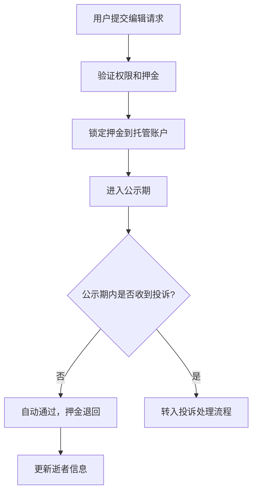
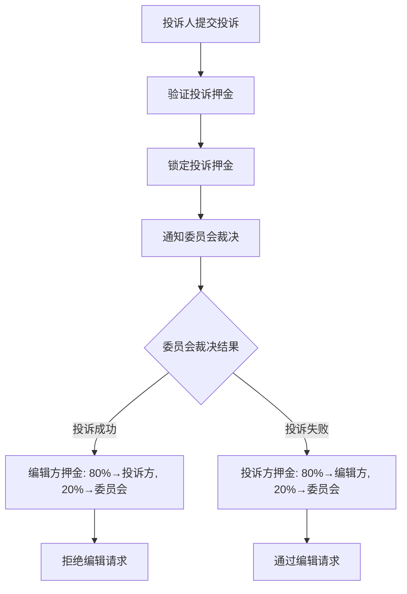

# 逝者信息公众治理机制设计方案

## 项目概述

本方案设计了一个基于押金和投诉机制的逝者信息公众编辑系统，允许公众参与逝者媒体、文本档案和作品信息的维护，通过经济激励和治理机制确保信息质量。

## 可行性分析

### ✅ 技术可行性

**现有基础设施支持：**
- **存储层**：`pallet-stardust-ipfs` 支持媒体文件存储
- **治理层**：`pallet-evidence` + `pallet-arbitration` 提供争议解决框架
- **资金托管**：现有 escrow 机制可扩展支持押金管理
- **身份系统**：账户体系和权限管理已完善

**技术架构融合度高：**
- 无需重新构建核心基础设施
- 可复用现有的委员会治理模式
- 符合 Substrate FRAME 开发规范

### ✅ 业务可行性

**市场需求明确：**
- 逝者信息需要持续维护和更新
- 家属可能无法及时维护所有信息
- 公众参与可提高信息准确性和完整性

**运营模式可持续：**
- 押金机制确保操作者负责任
- 投诉机制提供纠错途径
- 委员会获得收益，激励公正裁决

## 合理性与风险评估

### ✅ 经济合理性

**押金设计合理：**
- **成本约束**：押金门槛防止垃圾信息和恶意操作
- **风险对称**：编辑方和投诉方都需承担押金风险
- **激励平衡**：80/20分配既奖励正确行为，又补偿治理成本

**资金流向透明：**
```
投诉成功：编辑方押金 → 80%投诉方 + 20%委员会
投诉失败：投诉方押金 → 80%编辑方 + 20%委员会
```

### ⚠️ 主要风险与缓解措施

**1. 恶意攻击风险**
- **风险**：串通进行虚假投诉获利
- **缓解**：身份验证、频率限制、信誉系统

**2. 委员会治理风险**
- **风险**：委员会偏私或低效
- **缓解**：委员会轮换、决策公开、申诉机制

**3. 技术安全风险**
- **风险**：押金托管合约漏洞
- **缓解**：代码审计、分阶段部署、紧急暂停机制

## 技术实现方案

### 核心 Pallet 设计

#### `pallet-deceased-governance`

**主要功能：**
- 处理逝者信息编辑请求和押金管理
- 实现投诉流程和资金分配逻辑
- 集成现有 evidence 和 arbitration 模块

**关键数据结构：**

```rust
/// 编辑请求结构
#[derive(Encode, Decode, Clone, PartialEq, Eq, TypeInfo)]
pub struct EditRequest<AccountId, BlockNumber, Balance> {
    /// 编辑发起人
    pub editor: AccountId,
    /// 目标逝者ID
    pub deceased_id: DeceasedId,
    /// 编辑类型（新增/修改/删除）
    pub edit_type: EditType,
    /// 编辑内容IPFS哈希
    pub content_hash: BoundedVec<u8, MaxContentHashLength>,
    /// 押金金额
    pub deposit: Balance,
    /// 公示期结束区块
    pub review_end_block: BlockNumber,
    /// 当前状态
    pub status: EditRequestStatus,
}

/// 编辑请求状态枚举
#[derive(Encode, Decode, Clone, PartialEq, Eq, TypeInfo)]
pub enum EditRequestStatus {
    /// 公示期内，等待投诉
    Pending,
    /// 公示期结束，自动通过
    Approved,
    /// 被投诉，等待委员会裁决
    Challenged(ChallengeId),
    /// 投诉败诉，编辑通过
    ChallengeRejected,
    /// 投诉胜诉，编辑被拒绝
    ChallengeAccepted,
}

/// 投诉记录结构
#[derive(Encode, Decode, Clone, PartialEq, Eq, TypeInfo)]
pub struct Challenge<AccountId, Balance> {
    /// 投诉人账户
    pub challenger: AccountId,
    /// 被投诉的编辑请求ID
    pub edit_request_id: EditRequestId,
    /// 投诉理由IPFS哈希
    pub reason_hash: BoundedVec<u8, MaxReasonHashLength>,
    /// 投诉押金
    pub deposit: Balance,
    /// 投诉状态
    pub status: ChallengeStatus,
}
```

**关键接口函数：**

```rust
/// 提交编辑请求，锁定押金
#[pallet::call_index(0)]
#[pallet::weight(10_000)]
pub fn submit_edit_request(
    origin: OriginFor<T>,
    deceased_id: DeceasedId,
    edit_type: EditType,
    content_hash: BoundedVec<u8, MaxContentHashLength>,
) -> DispatchResult;

/// 投诉编辑请求，锁定投诉押金
#[pallet::call_index(1)]
#[pallet::weight(10_000)]
pub fn challenge_edit_request(
    origin: OriginFor<T>,
    edit_request_id: EditRequestId,
    reason_hash: BoundedVec<u8, MaxReasonHashLength>,
) -> DispatchResult;

/// 委员会裁决投诉（需要委员会权限）
#[pallet::call_index(2)]
#[pallet::weight(10_000)]
pub fn resolve_challenge(
    origin: OriginFor<T>,
    challenge_id: ChallengeId,
    decision: ChallengeDecision,
) -> DispatchResult;

/// 自动处理过期的编辑请求（公示期结束）
#[pallet::call_index(3)]
#[pallet::weight(10_000)]
pub fn finalize_expired_requests(
    origin: OriginFor<T>,
    max_requests: u32,
) -> DispatchResult;
```

### 业务流程设计

#### 1. 编辑请求流程



#### 2. 投诉处理流程



### 系统参数配置

```rust
#[pallet::config]
pub trait Config: frame_system::Config + pallet_deceased::Config {
    /// 编辑押金基础金额
    #[pallet::constant]
    type BaseEditDeposit: Get<BalanceOf<Self>>;

    /// 投诉押金金额
    #[pallet::constant]
    type ChallengeDeposit: Get<BalanceOf<Self>>;

    /// 公示期长度（区块数）
    #[pallet::constant]
    type ReviewPeriod: Get<BlockNumberFor<Self>>;

    /// 委员会成员分配比例（基点，如2000表示20%）
    #[pallet::constant]
    type CommitteeAllocationRatio: Get<u16>;

    /// 单个账户每日最大编辑次数
    #[pallet::constant]
    type MaxDailyEditsPerAccount: Get<u32>;
}
```

## 安全机制设计

### 1. 防刷机制

**账户门槛：**
- 要求账户持有最低代币数量
- 账户需要通过身份认证或信誉积累
- 新账户有操作频率限制

**操作限制：**
```rust
/// 每日编辑次数限制
DailyEditCount: double_map hasher(Blake2_128Concat) AccountId,
                              hasher(Blake2_128Concat) BlockNumber => u32;

/// 账户信誉分数
AccountReputation: map hasher(Blake2_128Concat) AccountId => ReputationScore;
```

### 2. 委员会治理

**委员会轮换机制：**
- 委员会成员定期轮换（如每月）
- 成员通过质押和投票选出
- 建立委员会监督和申诉机制

**决策透明化：**
- 所有裁决记录上链公开
- 委员会决策需要提供理由
- 支持社区监督和质疑

### 3. 紧急机制

**暂停功能：**
```rust
/// 紧急暂停编辑功能
#[pallet::call_index(99)]
#[pallet::weight(10_000)]
pub fn emergency_pause(
    origin: OriginFor<T>,
) -> DispatchResult {
    ensure_root(origin)?;
    IsSystemPaused::<T>::put(true);
    Self::deposit_event(Event::SystemPaused);
    Ok(())
}
```

## 前端集成方案

### UI/UX 设计要点

**移动端优先：**
- 编辑表单简洁明了，支持图片/文档上传
- 投诉流程可视化，显示处理进度
- 押金信息清晰展示，避免用户误解

**状态展示：**
```typescript
interface EditRequestStatus {
  PENDING: '公示期';
  CHALLENGED: '投诉中';
  APPROVED: '已通过';
  REJECTED: '已拒绝';
}

// 编辑请求卡片组件
const EditRequestCard = ({ request }: { request: EditRequest }) => {
  return (
    <Card>
      <StatusBadge status={request.status} />
      <ContentPreview hash={request.contentHash} />
      <DepositInfo amount={request.deposit} />
      {request.status === 'PENDING' && (
        <CountdownTimer endBlock={request.reviewEndBlock} />
      )}
    </Card>
  );
};
```

### API 接口设计

```typescript
// 编辑相关API
export const editingApi = {
  // 提交编辑请求
  submitEditRequest: (params: {
    deceasedId: string;
    editType: 'create' | 'update' | 'delete';
    content: EditContent;
  }) => Promise<{ requestId: string }>;

  // 投诉编辑请求
  challengeRequest: (params: {
    requestId: string;
    reason: string;
  }) => Promise<{ challengeId: string }>;

  // 查询编辑请求状态
  getEditRequestStatus: (requestId: string) => Promise<EditRequestStatus>;

  // 获取我的编辑历史
  getMyEditHistory: () => Promise<EditRequest[]>;
};
```

## 运营策略建议

### 初期推广

**1. 激励措施**
- 前期降低押金门槛，鼓励优质内容贡献
- 设立"优秀编辑者"奖励计划
- 与逝者家属合作，引导初始内容建设

**2. 内容质量管控**
- 建立内容审核标准和范例
- 培训初始委员会成员
- 设置内容分级，重要信息需要更高权限

### 长期发展

**1. 社区自治**
- 逐步向社区转移治理权
- 建立内容贡献者等级系统
- 引入专业机构参与（如博物馆、学术机构）

**2. 功能扩展**
- 支持多语言版本编辑
- 集成AI辅助内容审核
- 与其他纪念平台互操作

## 技术实施计划

### Phase 1: 核心功能开发 (4-6周)
- [ ] `pallet-deceased-governance` 基础框架
- [ ] 编辑请求提交和押金管理
- [ ] 基础前端编辑界面
- [ ] 单元测试覆盖

### Phase 2: 投诉机制开发 (3-4周)
- [ ] 投诉流程实现
- [ ] 委员会裁决功能
- [ ] 资金分配逻辑
- [ ] 前端投诉界面

### Phase 3: 安全与优化 (2-3周)
- [ ] 防刷机制实现
- [ ] 紧急暂停功能
- [ ] 性能优化
- [ ] 安全审计

### Phase 4: 部署与测试 (2周)
- [ ] 测试网部署
- [ ] 压力测试
- [ ] 用户验收测试
- [ ] 主网部署准备

## 结论

本方案在技术上可行，在业务上合理，但需要注意以下关键点：

**✅ 优势：**
- 利用经济激励确保内容质量
- 提供公正的争议解决机制
- 与现有系统架构高度融合

**⚠️ 关注点：**
- 需要建立完善的反作弊机制
- 委员会治理质量直接影响系统可信度
- 用户教育和运营策略同样重要

**建议：**
采用分阶段实施策略，先在小范围测试运行，逐步扩大规模并完善机制。重点关注用户反馈，持续优化押金标准和治理规则。