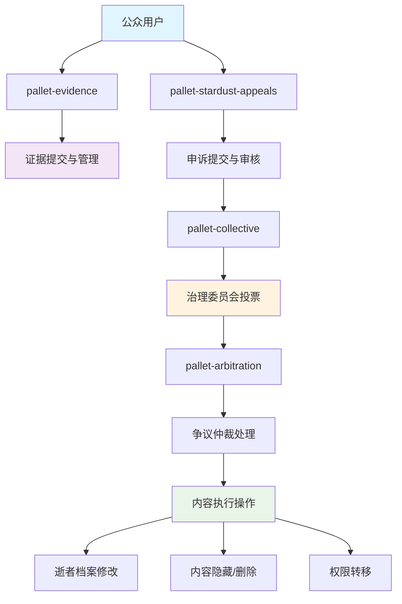
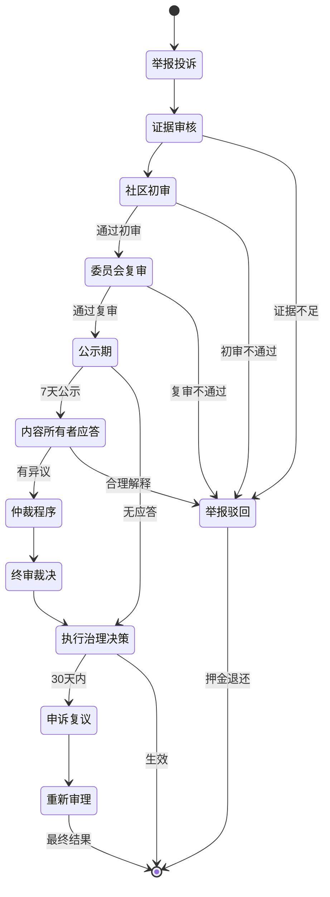

# 逝者内容公众治理方案

## 📋 方案概述

本方案基于 Stardust 区块链现有的治理基础设施，为逝者相册、生平、文章等内容设计了一套完整的公众治理机制。通过多层级审核、社区投票、申诉复议等流程，确保逝者内容的真实性、合规性和社会责任。

### 设计理念

- **去中心化治理**：公众参与，避免中心化审查
- **多层级保护**：初审、复审、终审三级审核体系
- **证据驱动**：所有治理决策均基于可验证的证据
- **权益平衡**：保护逝者尊严与言论自由并重
- **透明公正**：全流程链上记录，可追溯可监督

### 适用范围

本治理方案适用于以下逝者内容类型：

| 内容类型 | Domain ID | 描述 | 治理触发条件 |
|---------|-----------|------|-------------|
| **逝者档案** | 2 | 基本信息、生平介绍 | 虚假信息、不当内容 |
| **逝者相册** | 4 | 照片、影像资料 | 侵犯隐私、不当图片 |
| **逝者文章** | 3 | 纪念文章、生平故事 | 诽谤、造谣、违法内容 |
| **墓地信息** | 1 | 墓地基本信息 | 虚假位置、误导信息 |
| **纪念供奉** | 5 | 供奉品、纪念物 | 不当物品、商业推广 |

---

## 🔗 架构设计

### 治理模块协作关系



### 核心治理流程



---

## 🚨 内容投诉举报机制

### 举报触发条件

公众可对以下情况的逝者内容提起举报：

#### 1. 虚假信息类
- **身份造假**：冒用他人身份创建逝者档案
- **时间造假**：虚构死亡时间或生平时间
- **地点造假**：虚假的出生地、居住地、墓地位置
- **经历造假**：虚构职业、成就、社会关系

#### 2. 不当内容类
- **诽谤中伤**：恶意诋毁逝者或其家属
- **隐私侵犯**：未经授权公开私人信息或照片
- **仇恨言论**：基于种族、宗教、性别等歧视内容
- **违法内容**：涉及违法犯罪的内容

#### 3. 商业滥用类
- **广告推广**：利用逝者信息进行商业宣传
- **诈骗行为**：以逝者名义进行诈骗活动
- **非法募捐**：未经授权的募捐活动

### 举报流程

#### 第一步：证据准备
用户需通过 `pallet-evidence` 提交举报证据：

```rust
// 提交证据（使用承诺哈希模式保护隐私）
Evidence::commit_hash(
    RuntimeOrigin::signed(reporter),
    *b"rpt_dec_",  // ns: 逝者举报
    deceased_id,   // subject_id
    evidence_commit, // 证据承诺哈希
    Some(reason_memo), // 举报理由摘要
)?;
```

**证据要求：**
- 必须提供充分证据支持举报理由
- 证据可包括：截图、录音、文档、证人证言等
- 证据需通过 IPFS 存储，确保不可篡改
- 敏感证据可使用加密模式保护隐私

#### 第二步：提交申诉
基于证据 ID 提交正式申诉：

```rust
StardustAppeals::submit_appeal_with_evidence(
    RuntimeOrigin::signed(reporter),
    2,           // domain: 逝者档案
    deceased_id, // target: 逝者ID
    action_code, // action: 具体治理动作
    evidence_id, // evidence_id: 证据引用
    Some(reason_cid), // 详细举报理由
)?;
```

**押金机制：**
- **基础押金**：50 DUST（防止恶意举报）
- **动态调整**：根据举报历史和内容严重性调整
- **举报成功**：押金全额退还 + 奖励 20 DUST
- **举报失败**：押金罚没 30%，余额退还

#### 第三步：限频保护
防止恶意刷屏举报：

- **窗口期限**：24小时内最多举报 5 次
- **同一目标**：7天内同一用户不能重复举报同一逝者
- **全局限制**：单用户每月最多举报 50 次

### 举报类型与对应治理动作

| 举报类型 | Action Code | 治理措施 | 说明 |
|---------|-------------|---------|------|
| 虚假身份 | 1 | 标记为争议身份 | 添加"身份存疑"标记 |
| 不当内容 | 2 | 内容隐藏/删除 | 暂时或永久隐藏内容 |
| 隐私侵犯 | 3 | 移除敏感信息 | 删除涉及隐私的内容 |
| 权限滥用 | 4 | 转移管理权限 | 将管理权转移给合法继承人 |
| 商业滥用 | 5 | 禁止商业活动 | 移除商业内容，禁止推广 |
| 违法内容 | 6 | 完全删除档案 | 严重违法时删除整个档案 |

---

## 🔍 多层级审核流程

### 审核层级设计

#### 第一级：社区初审（Community Review）
- **审核人员**：活跃社区用户（声誉分 ≥ 500 分）
- **审核时限**：3天
- **通过条件**：3/5 多数票通过
- **主要职责**：基础事实核验、明显违规内容识别

**初审流程：**
```rust
// 社区用户投票
CommunityReview::vote(
    RuntimeOrigin::signed(reviewer),
    appeal_id,
    vote_result, // 0=反对, 1=支持, 2=弃权
    vote_reason, // 投票理由
)?;
```

**激励机制：**
- 参与投票奖励：1 DUST/票
- 投票正确奖励：额外 2 DUST
- 恶意投票惩罚：扣除 10 声誉分

#### 第二级：委员会复审（Committee Review）
- **审核人员**：内容治理委员会（9名专业委员）
- **审核时限**：7天
- **通过条件**：5/9 多数票通过
- **主要职责**：法律合规性、社会影响评估

**复审流程：**
```rust
// 委员会投票（通过 pallet-collective）
Collective::vote(
    RuntimeOrigin::signed(committee_member),
    proposal_hash,
    proposal_index,
    approve, // 是否批准申诉
)?;
```

**委员会组成：**
- 法律专家：2名（处理法律相关问题）
- 社会伦理专家：2名（评估社会影响）
- 技术专家：2名（技术可行性评估）
- 社区代表：3名（代表社区利益）

#### 第三级：公示与应答期（Public Notice Period）
- **公示时长**：7天
- **通知方式**：链上事件 + 前端推送
- **应答权限**：内容所有者、家族成员、授权代理人

**应答机制：**
```rust
// 内容所有者应答
DeceasedContentDefense::respond_to_appeal(
    RuntimeOrigin::signed(owner),
    appeal_id,
    defense_evidence_id, // 反驳证据
    defense_statement,   // 申辩声明
)?;
```

### 自动化审核辅助

#### AI 内容预筛选
- **违禁词检测**：自动识别明显违法违规内容
- **图像识别**：检测不当图片、隐私信息
- **语义分析**：识别仇恨言论、诽谤内容
- **真实性验证**：交叉比对公开数据源

#### 区块链自动执行
```rust
// 自动执行治理决策（通过 pallet-scheduler）
Scheduler::schedule(
    RuntimeOrigin::root(),
    execute_block,     // 执行时间
    None,              // 优先级
    governance_call,   // 治理调用
)?;
```

---

## 🗳️ 治理决策与投票机制

### 投票权重设计

#### 社区用户投票权重
基于多维度声誉评分系统：

```rust
fn calculate_voting_power(user: &AccountId) -> u32 {
    let base_power = 1u32;

    // 声誉分加权（最高 5 倍）
    let reputation_multiplier = min(reputation_score / 1000, 5);

    // 持币时长加权（最高 3 倍）
    let holding_multiplier = min(holding_months / 6, 3);

    // 参与度加权（最高 2 倍）
    let participation_multiplier = min(governance_participation / 50, 2);

    base_power * reputation_multiplier * holding_multiplier * participation_multiplier
}
```

**声誉分来源：**
- 正确投票：+10分
- 提供有效证据：+20分
- 恶意行为：-50分
- 社区贡献：+5~100分

#### 委员会投票权重
- 所有委员享有同等投票权（1票/人）
- 特殊情况下可申请专家意见（咨询性质，不参与投票）

### 投票激励机制

#### 参与激励
```rust
// 投票奖励分配
fn distribute_voting_rewards(appeal_id: u64, total_pool: Balance) {
    let correct_voters = get_correct_voters(appeal_id);
    let reward_per_voter = total_pool / correct_voters.len();

    for voter in correct_voters {
        // 基础奖励
        let base_reward = reward_per_voter;

        // 早期投票奖励（前 24 小时内投票额外 20%）
        let early_bonus = if is_early_voter(&voter, appeal_id) {
            base_reward * 20 / 100
        } else { 0 };

        // 质量奖励（提供优质投票理由额外 30%）
        let quality_bonus = if has_quality_reasoning(&voter, appeal_id) {
            base_reward * 30 / 100
        } else { 0 };

        let total_reward = base_reward + early_bonus + quality_bonus;
        transfer_reward(&voter, total_reward);
    }
}
```

#### 奖励资金池
- **基础池**：每个申诉自动注入 100 DUST
- **举报押金**：恶意举报罚没金额
- **国库支持**：重要治理案件的额外奖励
- **社区捐赠**：社区自愿捐赠基金

### 特殊投票机制

#### 紧急处理程序
对于严重违法或紧急情况，启动快速通道：

```rust
// 紧急治理调用
EmergencyGovernance::emergency_action(
    RuntimeOrigin::root(),
    appeal_id,
    emergency_action, // 紧急措施
    justification,    // 紧急理由
)?;
```

**触发条件：**
- 涉及重大违法犯罪
- 造成严重社会影响
- 威胁平台安全运行
- 法律监管要求

**流程简化：**
- 跳过社区初审，直接委员会投票
- 缩短审核时限（24小时内）
- 降低通过门槛（3/9 即可）
- 事后补充完整审核程序

#### 重新审议机制
对于争议较大的决策，可申请重新审议：

**申请条件：**
- 30% 以上委员联名申请
- 发现新的重要证据
- 程序存在重大瑕疵
- 社区强烈反对（10,000+ 签名）

---

## ⚖️ 内容修改与删除执行机制

### 执行措施分级

#### 1级措施：警告标记
```rust
// 添加争议标记
DeceasedGovernance::add_warning_label(
    deceased_id,
    warning_type,  // 1=身份存疑, 2=内容争议, 3=待核实
    warning_text,  // 警告文本
    expiry_block,  // 标记过期时间
)?;
```

**适用情况：**
- 轻微不实信息
- 存疑但证据不充分
- 等待进一步核实

**执行效果：**
- 在逝者页面显示醒目警告
- 搜索结果中标注争议状态
- 限制社交分享功能

#### 2级措施：内容隐藏
```rust
// 隐藏特定内容
DeceasedGovernance::hide_content(
    deceased_id,
    content_type,  // 1=文本, 2=图片, 3=档案
    content_ids,   // 具体内容ID列表
    reason_code,   // 隐藏原因
)?;
```

**适用情况：**
- 不当但不严重的内容
- 隐私争议内容
- 需要修正的信息

**执行效果：**
- 内容对公众不可见
- 管理员和家属可查看
- 保留修复后恢复的可能性

#### 3级措施：内容删除
```rust
// 删除违规内容
DeceasedGovernance::remove_content(
    deceased_id,
    content_type,
    content_ids,
    deletion_reason,
    backup_required, // 是否需要备份
)?;
```

**适用情况：**
- 严重违法违规内容
- 侵权内容
- 恶意诽谤信息

**执行效果：**
- 内容完全删除
- IPFS 数据标记删除
- 保留审计日志

#### 4级措施：权限转移
```rust
// 转移管理权限
DeceasedGovernance::transfer_ownership(
    deceased_id,
    new_owner,     // 新的管理者
    transfer_reason, // 转移原因
    verification_evidence, // 身份验证证据
)?;
```

**适用情况：**
- 当前管理员滥用权限
- 合法继承人申请权限
- 原管理员无法履职

**执行效果：**
- 管理权限完全转移
- 原管理员失去编辑权
- 新管理员获得完全控制权

#### 5级措施：档案冻结
```rust
// 冻结整个档案
DeceasedGovernance::freeze_profile(
    deceased_id,
    freeze_duration, // 冻结时长
    freeze_reason,   // 冻结原因
)?;
```

**适用情况：**
- 重大争议待调查
- 法律纠纷进行中
- 多方权利争夺

**执行效果：**
- 停止所有编辑功能
- 仅允许查看基本信息
- 暂停所有社交互动

### 执行权限控制

#### 权限分层
```rust
pub enum ExecutionAuthority {
    // 自动执行（AI + 智能合约）
    Automated,

    // 社区版主（1-2级措施）
    CommunityMod,

    // 治理委员会（3-4级措施）
    GovernanceCommittee,

    // 超级管理员（5级措施 + 紧急情况）
    RootAdmin,

    // 法律当局（法定要求）
    LegalAuthority,
}
```

#### 多重签名保护
重要操作需要多重确认：

```rust
// 重要治理操作需要多签
MultisigGovernance::propose_execution(
    RuntimeOrigin::signed(committee_member),
    execution_proposal,
    required_signatures, // 需要的签名数量
)?;

MultisigGovernance::approve_execution(
    RuntimeOrigin::signed(another_member),
    proposal_id,
)?;
```

### 执行监督机制

#### 操作审计
```rust
// 记录所有治理操作
GovernanceAudit::log_action(
    operator,           // 操作者
    action_type,        // 操作类型
    target_deceased,    // 目标逝者
    operation_details,  // 操作详情
    evidence_refs,      // 相关证据
    timestamp,          // 操作时间
)?;
```

#### 可撤销窗口
- **24小时内**：社区版主操作可被上级撤销
- **72小时内**：委员会决策可申请紧急复议
- **30天内**：所有决策可通过申诉程序挑战

---

## 📞 申诉与复议流程

### 申诉权利主体

#### 一级申诉权（当事人申诉）
有权提起申诉的人员：

1. **直接当事人**
   - 逝者档案的创建者/管理员
   - 被举报内容的上传者
   - 逝者的直系亲属

2. **利益相关人**
   - 逝者档案中提及的在世人员
   - 照片中的其他当事人
   - 受影响的机构组织

3. **法定代理人**
   - 法院指定的监护人
   - 律师代理人
   - 合法授权代表

#### 二级申诉权（社会监督）
具备监督申诉资格的主体：

1. **社会组织**
   - 人权保护组织
   - 行业协会
   - 学术研究机构

2. **媒体监督**
   - 新闻媒体机构
   - 自媒体影响力账号（粉丝 >10万）

3. **公益律师**
   - 执业律师
   - 法律援助组织

### 申诉类型与流程

#### Type A：程序申诉（Procedural Appeal）
**针对治理程序的申诉**

```rust
// 提交程序申诉
ProceduralAppeal::submit_appeal(
    RuntimeOrigin::signed(appellant),
    original_appeal_id,    // 原申诉ID
    procedure_issue_type,  // 程序问题类型
    evidence_of_violation, // 程序违规证据
)?;
```

**常见程序问题：**
- 审核时限超期
- 投票程序不当
- 证据审核遗漏
- 权限使用越界
- 通知程序缺失

**处理流程：**
1. 提交程序申诉（需要 20 DUST 押金）
2. 程序审查委员会审核（5天）
3. 确认程序违规 → 重新审理原案
4. 程序合规 → 驳回申诉，罚没押金 50%

#### Type B：实体申诉（Substantive Appeal）
**针对治理决策内容的申诉**

```rust
// 提交实体申诉
SubstantiveAppeal::submit_appeal(
    RuntimeOrigin::signed(appellant),
    original_decision,     // 原决策
    new_evidence_id,      // 新证据
    appeal_arguments,     // 申诉论据
)?;
```

**申诉理由：**
- 发现新的关键证据
- 原证据存在重大瑕疵
- 事实认定严重错误
- 法律适用不当
- 处罚措施过重

**处理流程：**
1. 提交实体申诉（需要 50 DUST 押金）
2. 证据补强期（7天，允许补充材料）
3. 申诉委员会审理（14天）
4. 听证会（必要时）
5. 做出终审决定

#### Type C：紧急申诉（Emergency Appeal）
**针对紧急情况的快速申诉**

```rust
// 紧急申诉
EmergencyAppeal::submit_urgent_appeal(
    RuntimeOrigin::signed(appellant),
    emergency_type,       // 紧急情况类型
    immediate_harm,       // 即时损害描述
    urgent_evidence,      // 紧急证据
    requested_interim,    // 请求的临时措施
)?;
```

**紧急情况认定：**
- 生命健康受到威胁
- 重大财产损失
- 社会影响恶劣且扩大中
- 不可逆转的损害正在发生

**快速处理：**
- 2小时内响应
- 24小时内临时措施
- 72小时内初步决定
- 后续补充完整程序

### 申诉审理机构

#### 申诉委员会组成
```rust
pub struct AppealCommittee {
    // 主席（法律背景）
    pub chair: AccountId,

    // 常务委员（5人）
    pub permanent_members: Vec<AccountId>,

    // 专业委员（根据案件类型选择3人）
    pub specialist_pool: BTreeMap<SpecialtyType, Vec<AccountId>>,

    // 社区代表（随机选择2人）
    pub community_representatives: Vec<AccountId>,
}

pub enum SpecialtyType {
    Legal,        // 法律专家
    Technology,   // 技术专家
    Ethics,       // 伦理专家
    Medicine,     // 医学专家
    History,      // 历史学专家
    Psychology,   // 心理学专家
}
```

#### 回避制度
```rust
// 委员会成员回避
AppealCommittee::recuse_member(
    member_id,
    appeal_id,
    recusal_reason, // 回避理由
)?;
```

**强制回避情况：**
- 与当事人有利害关系
- 曾参与原案审理
- 存在经济利益冲突
- 有其他可能影响公正的情形

### 申诉结果与执行

#### 申诉结果类型
```rust
pub enum AppealResult {
    // 维持原决定
    Upheld,

    // 部分改判
    PartiallyReversed {
        modified_sanctions: Vec<SanctionType>,
        reduction_percentage: u8,
    },

    // 完全撤销
    FullyReversed,

    // 发回重审
    Remanded {
        remand_instructions: Vec<u8>,
        specific_issues: Vec<IssueType>,
    },
}
```

#### 执行时效
```rust
// 申诉结果自动执行
AppealExecution::schedule_execution(
    appeal_result,
    execution_delay, // 执行延迟（默认24小时）
)?;

// 紧急执行
AppealExecution::immediate_execution(
    emergency_appeal_result,
)?;
```

### 最终救济途径

#### 司法途径
当链上治理机制无法解决争议时：

1. **仲裁机构**
   - 申请专业仲裁
   - 选择互联网仲裁院
   - 国际域名争议仲裁

2. **法院诉讼**
   - 民事诉讼（侵权、名誉权）
   - 行政诉讼（监管决定）
   - 刑事报案（涉嫌犯罪）

#### 技术救济
```rust
// 技术层面的最终保护
TechnicalSafeguard::invoke_emergency_protection(
    threat_level,        // 威胁级别
    protection_scope,    // 保护范围
    duration,           // 保护时长
)?;
```

**技术保护措施：**
- 紧急备份重要数据
- 临时屏蔽恶意访问
- 启用特殊安全模式
- 联系执法部门协助

---

## 🔒 安全保障与隐私保护

### 数据安全保障

#### 分级加密存储
```rust
pub enum ContentSecurityLevel {
    // 公开级别（不加密）
    Public,

    // 限制级别（家族可见）
    Restricted,

    // 私密级别（当事人可见）
    Private,

    // 机密级别（司法程序可见）
    Confidential,
}

// 根据安全级别加密存储
SecureStorage::store_with_encryption(
    content_data,
    security_level,
    authorized_parties, // 授权查看方
)?;
```

#### 证据完整性保护
```rust
// 证据哈希链保护
EvidenceChain::create_hash_chain(
    evidence_id,
    content_hash,     // 内容哈希
    previous_hash,    // 前一个证据哈希
    timestamp,        // 时间戳
    submitter,        // 提交者
)?;

// 防篡改验证
EvidenceChain::verify_integrity(
    evidence_id,
    claimed_hash,
) -> bool;
```

### 隐私保护机制

#### 个人敏感信息保护
```rust
pub struct PrivacySettings {
    // 身份信息保护级别
    pub identity_protection: ProtectionLevel,

    // 联系方式保护
    pub contact_privacy: PrivacyLevel,

    // 家庭关系保护
    pub family_privacy: PrivacyLevel,

    // 医疗信息保护
    pub medical_privacy: PrivacyLevel,

    // 财务信息保护
    pub financial_privacy: PrivacyLevel,
}

pub enum ProtectionLevel {
    None,        // 无保护
    Basic,       // 基础脱敏
    Enhanced,    // 增强脱敏
    Maximum,     // 最大保护
}
```

#### 差分隐私保护
```rust
// 在统计查询中添加噪声保护隐私
DifferentialPrivacy::add_noise_to_query(
    query_result,
    sensitivity,  // 敏感度参数
    epsilon,      // 隐私预算
) -> NoisyResult;
```

### 举报人保护

#### 匿名举报机制
```rust
// 匿名举报提交
AnonymousReport::submit_anonymous_report(
    encrypted_report,    // 加密的举报内容
    anonymous_evidence,  // 匿名证据
    contact_method,      // 联系方式（加密）
)?;

// 零知识身份验证
ZKIdentityProof::verify_reporter_eligibility(
    anonymous_proof,     // 零知识证明
    eligibility_criteria, // 资格标准
) -> bool;
```

#### 举报人身份保护
```rust
pub struct ReporterProtection {
    // 身份加密级别
    pub identity_encryption: EncryptionLevel,

    // 通信保护
    pub communication_shield: bool,

    // 反追踪保护
    pub anti_tracking: bool,

    // 法律保护级别
    pub legal_protection: LegalProtectionLevel,
}
```

### 数据跨境与合规

#### 跨境数据保护
```rust
// 跨境数据传输合规检查
CrossBorderCompliance::verify_data_transfer(
    source_jurisdiction,  // 源管辖区
    target_jurisdiction, // 目标管辖区
    data_type,          // 数据类型
    transfer_purpose,   // 传输目的
) -> ComplianceResult;
```

#### 法律法规适配
```rust
pub trait JurisdictionCompliance {
    // GDPR 合规（欧盟）
    fn gdpr_compliance_check(&self) -> ComplianceStatus;

    // CCPA 合规（加州）
    fn ccpa_compliance_check(&self) -> ComplianceStatus;

    // 个人信息保护法合规（中国）
    fn pipl_compliance_check(&self) -> ComplianceStatus;

    // 通用合规检查
    fn general_compliance_check(&self, jurisdiction: Jurisdiction) -> ComplianceStatus;
}
```

---

## 📊 监督与透明度

### 治理透明度机制

#### 公开治理数据
```rust
// 治理统计数据公开接口
pub trait GovernanceTransparency {
    // 治理案件统计
    fn get_governance_statistics(
        time_period: TimePeriod,
    ) -> GovernanceStats;

    // 决策执行情况
    fn get_execution_status(
        decision_id: u64,
    ) -> ExecutionStatus;

    // 委员会投票记录
    fn get_voting_records(
        committee_id: CommitteeId,
        time_range: TimeRange,
    ) -> Vec<VotingRecord>;
}

pub struct GovernanceStats {
    pub total_appeals: u32,        // 总申诉数量
    pub approved_appeals: u32,     // 批准的申诉
    pub rejected_appeals: u32,     // 驳回的申诉
    pub execution_success_rate: u8, // 执行成功率
    pub average_processing_time: u32, // 平均处理时间
    pub user_satisfaction_score: u8,  // 用户满意度
}
```

#### 实时治理监控
```rust
// 治理过程实时监控
GovernanceMonitor::track_appeal_progress(
    appeal_id,
    current_stage,    // 当前阶段
    responsible_party, // 负责方
    deadline,         // 截止时间
    progress_percentage, // 进度百分比
)?;
```

### 社会监督机制

#### 第三方监督机构
```rust
pub struct ExternalOversight {
    // 学术研究机构
    pub academic_institutions: Vec<InstitutionId>,

    // 媒体监督
    pub media_partners: Vec<MediaId>,

    // NGO 组织
    pub ngo_organizations: Vec<NgoId>,

    // 政府监管部门
    pub regulatory_authorities: Vec<AuthorityId>,
}

// 第三方审计访问
ExternalAudit::grant_audit_access(
    auditor_id,
    audit_scope,      // 审计范围
    access_duration,  // 访问时长
    data_anonymization_level, // 数据匿名化级别
)?;
```

#### 公众监督参与
```rust
// 公众监督举报
PublicOversight::submit_oversight_report(
    RuntimeOrigin::signed(citizen),
    governance_issue_type,  // 治理问题类型
    evidence_package,      // 证据包
    severity_level,        // 严重程度
)?;

pub enum GovernanceIssueType {
    ProcessViolation,      // 程序违规
    BiasInDecision,       // 决策偏见
    CorruptionSuspicion,  // 腐败嫌疑
    ResourceMisuse,       // 资源滥用
    TransparencyLack,     // 透明度不足
}
```

### 定期报告与评估

#### 治理效果评估
```rust
// 定期治理效果评估
GovernanceEvaluation::conduct_quarterly_assessment(
    quarter: Quarter,
    evaluation_criteria: Vec<CriteriaType>,
) -> EvaluationReport;

pub struct EvaluationReport {
    pub effectiveness_score: u8,     // 治理有效性评分
    pub efficiency_metrics: EfficiencyMetrics, // 效率指标
    pub user_feedback_summary: UserFeedback,   // 用户反馈摘要
    pub improvement_recommendations: Vec<Recommendation>, // 改进建议
    pub comparative_analysis: ComparativeData, // 对比分析
}
```

#### 年度治理白皮书
```rust
// 生成年度治理白皮书
AnnualReport::generate_whitepaper(
    year: Year,
    include_case_studies: bool,
    anonymization_level: AnonymizationLevel,
) -> WhitePaper;

pub struct WhitePaper {
    pub executive_summary: ExecutiveSummary,
    pub statistical_overview: StatisticalData,
    pub case_studies: Vec<AnonymizedCaseStudy>,
    pub challenges_identified: Vec<Challenge>,
    pub future_improvements: Vec<ImprovementPlan>,
    pub stakeholder_feedback: StakeholderFeedback,
}
```

---

## 💡 激励与惩罚机制

### 正向激励体系

#### 参与治理奖励
```rust
// 治理参与积分系统
GovernanceIncentive::award_participation_points(
    participant: &AccountId,
    activity_type: ParticipationType,
    quality_score: u8,
) -> Result<u32, Error>;

pub enum ParticipationType {
    QualityReporting(ReportQuality),    // 优质举报
    AccurateVoting(VotingAccuracy),     // 准确投票
    EvidenceSubmission(EvidenceQuality), // 证据提交
    CommitteeService(ServicePeriod),    // 委员会服务
    CommunityModeration(ModActivity),   // 社区管理
}

// 积分兑换奖励
GovernanceReward::redeem_points(
    account: &AccountId,
    points_to_redeem: u32,
    reward_type: RewardType,
) -> Result<(), Error>;

pub enum RewardType {
    TokenReward(Balance),              // 代币奖励
    PrivilegeUpgrade(PrivilegeLevel),  // 权限升级
    RecognitionBadge(BadgeType),       // 荣誉徽章
    PlatformCredits(u32),              // 平台积分
}
```

#### 长期贡献激励
```rust
// 长期贡献者奖励计划
LongTermIncentive::calculate_annual_bonus(
    contributor: &AccountId,
    contribution_history: ContributionHistory,
) -> AnnualBonus;

pub struct ContributionHistory {
    pub years_of_participation: u32,
    pub total_quality_score: u32,
    pub leadership_roles: Vec<LeadershipRole>,
    pub innovation_contributions: Vec<Innovation>,
    pub mentorship_activities: Vec<MentorshipRecord>,
}
```

### 负向惩罚机制

#### 违规行为处罚
```rust
// 违规行为分级处罚
ViolationPenalty::apply_graduated_sanctions(
    violator: &AccountId,
    violation_type: ViolationType,
    violation_severity: SeverityLevel,
    repeat_offense_count: u32,
) -> PenaltyPackage;

pub enum ViolationType {
    MaliciousReporting,     // 恶意举报
    FalseTestimony,        // 虚假证言
    VotingManipulation,    // 投票操纵
    ConflictOfInterest,    // 利益冲突
    ProcessAbuse,          // 程序滥用
    DataMisuse,           // 数据滥用
}

pub enum SeverityLevel {
    Minor,      // 轻微违规
    Moderate,   // 中等违规
    Serious,    // 严重违规
    Severe,     // 极严重违规
}

pub struct PenaltyPackage {
    pub financial_penalty: Option<Balance>,     // 经济处罚
    pub privilege_suspension: Option<Duration>, // 权限暂停
    pub reputation_deduction: u32,              // 声誉扣减
    pub activity_restriction: Vec<ActivityRestriction>, // 活动限制
    pub mandatory_training: Option<TrainingProgram>,    // 强制培训
}
```

#### 累进处罚制度
```rust
// 累进处罚算法
fn calculate_escalated_penalty(
    base_penalty: Penalty,
    offense_count: u32,
    time_since_last_offense: Duration,
) -> EscalatedPenalty {
    let escalation_factor = match offense_count {
        1 => 1.0,
        2 => 1.5,
        3 => 2.5,
        4 => 4.0,
        _ => 6.0, // 5次及以上
    };

    let time_decay_factor = if time_since_last_offense > Duration::days(365) {
        0.8 // 一年以上减免20%
    } else {
        1.0
    };

    EscalatedPenalty {
        monetary_penalty: base_penalty.monetary * escalation_factor * time_decay_factor,
        suspension_period: base_penalty.suspension * escalation_factor,
        reputation_impact: base_penalty.reputation * escalation_factor,
    }
}
```

### 社区自治激励

#### 社区治理代币
```rust
// 专门的治理代币系统
GovernanceToken::mint_for_contribution(
    contributor: &AccountId,
    contribution_value: ContributionValue,
) -> Result<Balance, Error>;

// 治理代币投票权重
GovernanceVoting::calculate_voting_power(
    account: &AccountId,
) -> VotingPower {
    let token_balance = GovernanceToken::balance_of(account);
    let locked_duration = GovernanceToken::lock_duration(account);
    let participation_history = GovernanceHistory::get_participation_score(account);

    VotingPower {
        base_power: token_balance,
        time_bonus: locked_duration * 10 / 365, // 锁定一年增加10%
        reputation_bonus: participation_history / 100,
    }
}
```

#### 去中心化自主组织（DAO）
```rust
// DAO 治理结构
pub struct GovernanceDAO {
    pub treasury: TreasuryAccount,
    pub governance_council: Vec<CouncilMember>,
    pub community_representatives: Vec<CommunityRep>,
    pub technical_committee: Vec<TechnicalExpert>,
    pub ethics_board: Vec<EthicsExpert>,
}

// DAO 提案系统
DAO::submit_governance_proposal(
    proposer: &AccountId,
    proposal_type: ProposalType,
    proposal_content: ProposalContent,
    execution_parameters: ExecutionParams,
) -> Result<ProposalId, Error>;

pub enum ProposalType {
    PolicyChange,        // 政策修改
    ParameterAdjustment, // 参数调整
    BudgetAllocation,    // 预算分配
    SystemUpgrade,       // 系统升级
    EmergencyAction,     // 紧急行动
}
```

---

## 🚀 技术实现路线图

### Phase 1: 基础设施完善（已完成）
**时间：2025年10月 - 2025年11月**

✅ **现有基础设施分析**
- pallet-evidence：统一证据管理系统
- pallet-arbitration：仲裁争议处理系统
- pallet-stardust-appeals：申诉治理模块
- pallet-collective：治理委员会投票

✅ **架构优化**
- 域路由机制完善
- 多层级审核框架
- 自动执行机制
- 押金管理系统

### Phase 2: 治理流程集成（当前阶段）
**时间：2025年11月 - 2025年12月**

🚧 **核心功能开发**
```rust
// 逝者内容治理专用模块
pallet-deceased-governance {
    // 内容投诉举报
    fn submit_content_complaint(),

    // 多级审核流程
    fn process_community_review(),
    fn process_committee_review(),
    fn process_public_notice(),

    // 执行治理决策
    fn execute_governance_decision(),

    // 申诉与复议
    fn submit_appeal(),
    fn process_appeal(),
}
```

🚧 **前端界面开发**
- 举报提交界面
- 审核管理面板
- 投票参与界面
- 申诉提交系统
- 治理透明度展示

### Phase 3: 高级功能实现
**时间：2026年1月 - 2026年2月**

🔄 **智能化治理**
```rust
// AI 辅助审核系统
pallet-ai-governance {
    // 内容预筛选
    fn ai_content_screening(),

    // 风险评估
    fn calculate_risk_score(),

    // 自动分类
    fn auto_categorize_complaint(),

    // 推荐决策
    fn recommend_governance_action(),
}
```

🔄 **跨链治理机制**
```rust
// 跨链治理协议
pallet-cross-chain-governance {
    // 跨链证据同步
    fn sync_evidence_across_chains(),

    // 跨链投票聚合
    fn aggregate_cross_chain_votes(),

    // 跨链执行协调
    fn coordinate_cross_chain_execution(),
}
```

### Phase 4: 生态系统扩展
**时间：2026年3月 - 2026年6月**

🔄 **治理生态完善**
- 专业仲裁机构接入
- 法律服务提供商集成
- 第三方审计机构合作
- 社会组织监督网络

🔄 **国际化与合规**
- 多语言支持
- 地区法规适配
- 国际标准对接
- 跨境合规保障

### Phase 5: 持续优化与维护
**时间：2026年7月开始**

🔄 **性能优化**
- 治理流程效率提升
- 用户体验优化
- 系统稳定性增强
- 安全性持续加固

🔄 **创新功能**
- 零知识证明应用
- 联邦学习治理
- 量子安全升级
- 去中心化身份系统

---

## 📈 效果评估与迭代

### 关键指标体系

#### 治理效果指标
```rust
pub struct GovernanceEffectivenessMetrics {
    // 响应效率
    pub response_time: ResponseTimeMetrics,

    // 决策质量
    pub decision_quality: DecisionQualityMetrics,

    // 用户满意度
    pub user_satisfaction: UserSatisfactionMetrics,

    // 社会影响
    pub social_impact: SocialImpactMetrics,
}

pub struct ResponseTimeMetrics {
    pub average_processing_time: Duration,      // 平均处理时间
    pub escalation_rate: f64,                  // 升级率
    pub on_time_completion_rate: f64,          // 按时完成率
}

pub struct DecisionQualityMetrics {
    pub appeal_success_rate: f64,              // 申诉成功率
    pub decision_reversal_rate: f64,           // 决策推翻率
    pub consistency_score: f64,                // 一致性评分
    pub accuracy_rate: f64,                    // 准确率
}
```

#### 参与度指标
```rust
pub struct ParticipationMetrics {
    // 用户参与
    pub total_active_participants: u32,        // 总活跃参与者
    pub new_participant_growth_rate: f64,      // 新参与者增长率
    pub participant_retention_rate: f64,       // 参与者留存率

    // 投票参与
    pub voting_participation_rate: f64,        // 投票参与率
    pub vote_quality_score: f64,              // 投票质量评分

    // 证据贡献
    pub evidence_submission_rate: f64,         // 证据提交率
    pub evidence_quality_score: f64,          // 证据质量评分
}
```

### 定期评估机制

#### 月度评估
```rust
// 月度治理效果评估
MonthlyAssessment::conduct_monthly_review(
    month: Month,
    evaluation_scope: EvaluationScope,
) -> MonthlyReport;

pub struct MonthlyReport {
    pub key_metrics_summary: KeyMetrics,
    pub trending_issues: Vec<TrendingIssue>,
    pub performance_compared_to_target: PerformanceGap,
    pub immediate_action_items: Vec<ActionItem>,
}
```

#### 季度深度分析
```rust
// 季度深度分析
QuarterlyAnalysis::conduct_deep_dive_analysis(
    quarter: Quarter,
    focus_areas: Vec<FocusArea>,
) -> QuarterlyAnalysisReport;

pub struct QuarterlyAnalysisReport {
    pub comprehensive_metrics: ComprehensiveMetrics,
    pub stakeholder_feedback_analysis: StakeholderAnalysis,
    pub comparative_benchmarking: BenchmarkingResult,
    pub strategic_recommendations: Vec<StrategyRecommendation>,
    pub risk_assessment: RiskAssessment,
}
```

### 迭代优化流程

#### 数据驱动优化
```rust
// 基于数据的治理优化
DataDrivenOptimization::analyze_and_optimize(
    historical_data: GovernanceData,
    performance_targets: Vec<Target>,
) -> OptimizationPlan;

pub struct OptimizationPlan {
    pub identified_bottlenecks: Vec<Bottleneck>,
    pub proposed_improvements: Vec<Improvement>,
    pub implementation_roadmap: Roadmap,
    pub expected_impact: ImpactProjection,
}
```

#### A/B 测试框架
```rust
// 治理流程 A/B 测试
ABTestFramework::run_governance_experiment(
    experiment_design: ExperimentDesign,
    target_population: Population,
    test_duration: Duration,
) -> ExperimentResult;

pub struct ExperimentDesign {
    pub control_group_process: ProcessVariant,
    pub test_group_process: ProcessVariant,
    pub success_metrics: Vec<Metric>,
    pub hypothesis: Hypothesis,
}
```

---

## 🎯 总结与展望

### 核心优势

#### 1. 系统性治理架构
本方案构建了从举报投诉到最终执行的完整治理链条，确保每个环节都有明确的责任主体和操作流程。

#### 2. 多重保障机制
通过多层级审核、公示期应答、申诉复议等机制，最大程度保护各方权益，防止误判和滥用。

#### 3. 技术与人文结合
既利用区块链技术确保透明性和不可篡改性，又充分考虑人文关怀和社会责任。

#### 4. 可扩展性设计
模块化架构设计，可根据实际运行情况灵活调整参数和流程。

### 预期效果

#### 短期目标（6个月内）
- 建立基本的内容投诉和审核机制
- 形成稳定的治理参与群体
- 处理积累的争议案件
- 建立治理信誉体系

#### 中期目标（1-2年内）
- 治理效率显著提升（平均处理时间缩短50%）
- 用户满意度达到85%以上
- 恶意内容减少80%
- 形成自我净化的社区生态

#### 长期愿景（3-5年内）
- 成为去中心化内容治理的行业标杆
- 建立跨平台、跨链的治理协作网络
- 推动相关法律法规和行业标准制定
- 为数字化纪念行业提供完善的治理框架

### 持续改进承诺

我们将持续收集用户反馈，优化治理流程，确保该治理方案始终符合社会发展需要和用户期待。同时，我们也欢迎社区成员积极参与治理实践，共同构建一个公正、透明、高效的逝者内容治理生态系统。

---

**文档版本**：v1.0.0
**最后更新**：2025-11-13
**维护团队**：Stardust 治理工作组
**联系方式**：governance@stardust.network

---

*本方案遵循开源精神，欢迎社区贡献改进意见和技术实现。*