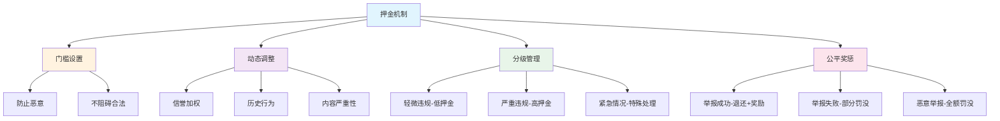

# 逝者内容治理 - 押金机制设计

## 📋 文档概述

本文档详细阐述 Stardust 逝者内容治理系统中的押金机制设计，旨在通过经济激励和惩罚手段，有效防止恶意投诉、提升治理质量，同时保护合法举报者的权益。

### 设计目标

- **防止恶意投诉**：通过押金门槛过滤恶意举报
- **激励优质举报**：奖励提供真实有效证据的举报者
- **公平合理**：押金标准与举报内容严重性相匹配
- **透明可追溯**：所有押金操作链上记录，完全透明
- **资金安全**：使用 Substrate Holds API 确保资金安全

### 核心原则



---

## 💰 押金标准设计

### 基础押金体系

#### 1. 固定基础押金
根据举报内容类型设定基础押金额度：

```rust
pub struct BaseDepositSchedule {
    // 按Domain分类的基础押金
    pub deposits_by_domain: BTreeMap<u8, Balance>,

    // 按违规类型分类的基础押金
    pub deposits_by_violation: BTreeMap<ViolationType, Balance>,

    // 按严重程度分类的基础押金
    pub deposits_by_severity: BTreeMap<SeverityLevel, Balance>,
}

// 实现示例
impl Default for BaseDepositSchedule {
    fn default() -> Self {
        let mut deposits_by_domain = BTreeMap::new();
        deposits_by_domain.insert(1, 30 * DUST);  // 墓地信息：30 DUST
        deposits_by_domain.insert(2, 50 * DUST);  // 逝者档案：50 DUST
        deposits_by_domain.insert(3, 40 * DUST);  // 逝者文章：40 DUST
        deposits_by_domain.insert(4, 60 * DUST);  // 逝者相册：60 DUST（涉及隐私）
        deposits_by_domain.insert(5, 35 * DUST);  // 纪念供奉：35 DUST

        let mut deposits_by_violation = BTreeMap::new();
        deposits_by_violation.insert(ViolationType::FalseInformation, 40 * DUST);
        deposits_by_violation.insert(ViolationType::InappropriateContent, 50 * DUST);
        deposits_by_violation.insert(ViolationType::PrivacyViolation, 70 * DUST);
        deposits_by_violation.insert(ViolationType::HateSpeech, 80 * DUST);
        deposits_by_violation.insert(ViolationType::IllegalContent, 100 * DUST);
        deposits_by_violation.insert(ViolationType::CommercialAbuse, 45 * DUST);

        let mut deposits_by_severity = BTreeMap::new();
        deposits_by_severity.insert(SeverityLevel::Minor, 20 * DUST);
        deposits_by_severity.insert(SeverityLevel::Moderate, 50 * DUST);
        deposits_by_severity.insert(SeverityLevel::Serious, 80 * DUST);
        deposits_by_severity.insert(SeverityLevel::Critical, 120 * DUST);

        Self {
            deposits_by_domain,
            deposits_by_violation,
            deposits_by_severity,
        }
    }
}

// 违规类型定义
pub enum ViolationType {
    FalseInformation,      // 虚假信息
    InappropriateContent,  // 不当内容
    PrivacyViolation,      // 隐私侵犯
    HateSpeech,           // 仇恨言论
    IllegalContent,       // 违法内容
    CommercialAbuse,      // 商业滥用
}

// 严重程度定义
pub enum SeverityLevel {
    Minor,      // 轻微（如小错误、格式问题）
    Moderate,   // 中等（如部分不实、轻微不当）
    Serious,    // 严重（如明显虚假、隐私泄露）
    Critical,   // 极严重（如违法犯罪、重大伤害）
}
```

#### 2. 押金计算公式
综合考虑多个因素计算最终押金：

```rust
/// 计算举报押金
pub fn calculate_complaint_deposit(
    who: &T::AccountId,
    domain: u8,
    target_id: u64,
    violation_type: ViolationType,
    severity: SeverityLevel,
) -> Balance {
    // 步骤1: 获取基础押金
    let base_deposit = get_base_deposit(domain, violation_type, severity);

    // 步骤2: 信誉系数（0.5 - 2.0）
    let reputation_multiplier = calculate_reputation_multiplier(who);

    // 步骤3: 历史行为系数（0.8 - 1.5）
    let history_multiplier = calculate_history_multiplier(who);

    // 步骤4: 内容价值系数（0.9 - 1.3）
    let content_value_multiplier = calculate_content_value_multiplier(domain, target_id);

    // 步骤5: 时间加权系数（0.9 - 1.2）
    let time_multiplier = calculate_time_multiplier();

    // 最终押金计算
    let calculated_deposit = base_deposit
        .saturating_mul(reputation_multiplier)
        .saturating_mul(history_multiplier)
        .saturating_mul(content_value_multiplier)
        .saturating_mul(time_multiplier);

    // 设置押金上下限
    let min_deposit = T::MinComplaintDeposit::get();
    let max_deposit = T::MaxComplaintDeposit::get();

    calculated_deposit.clamp(min_deposit, max_deposit)
}

/// 获取基础押金（取最高值）
fn get_base_deposit(
    domain: u8,
    violation_type: ViolationType,
    severity: SeverityLevel,
) -> Balance {
    let schedule = BaseDepositSchedule::default();

    let by_domain = schedule.deposits_by_domain.get(&domain).copied().unwrap_or(50 * DUST);
    let by_violation = schedule.deposits_by_violation.get(&violation_type).copied().unwrap_or(50 * DUST);
    let by_severity = schedule.deposits_by_severity.get(&severity).copied().unwrap_or(50 * DUST);

    // 取三者最高值作为基础押金
    by_domain.max(by_violation).max(by_severity)
}
```

---

## 📊 动态调整机制

### 1. 信誉系数计算

```rust
/// 信誉系数计算（0.5 - 2.0）
pub fn calculate_reputation_multiplier(who: &T::AccountId) -> PerU16 {
    let reputation_score = T::ReputationProvider::get_reputation(who);

    // 信誉分映射到系数
    // 0-200分: 2.0倍（低信誉，高押金）
    // 200-500分: 1.5-2.0倍
    // 500-1000分: 1.0-1.5倍（标准）
    // 1000-2000分: 0.7-1.0倍
    // 2000+分: 0.5-0.7倍（高信誉，低押金）

    let multiplier_bps = if reputation_score < 200 {
        20_000u16  // 2.0倍
    } else if reputation_score < 500 {
        // 线性插值：15000 + (reputation - 200) * (20000 - 15000) / 300
        15_000 + ((reputation_score - 200) * 5_000 / 300) as u16
    } else if reputation_score < 1000 {
        // 线性插值：10000 + (reputation - 500) * (15000 - 10000) / 500
        10_000 + ((reputation_score - 500) * 5_000 / 500) as u16
    } else if reputation_score < 2000 {
        // 线性插值：7000 + (reputation - 1000) * (10000 - 7000) / 1000
        7_000 + ((reputation_score - 1000) * 3_000 / 1000) as u16
    } else {
        // 线性插值：5000 + min((reputation - 2000) * (7000 - 5000) / 1000, 2000)
        let bonus = ((reputation_score - 2000) * 2_000 / 1000).min(2_000) as u16;
        5_000 + bonus
    };

    PerU16::from_parts(multiplier_bps)
}

/// 信誉分来源
pub trait ReputationProvider<AccountId> {
    fn get_reputation(who: &AccountId) -> u32;
}

// 信誉分构成
pub struct ReputationScore {
    pub correct_reports: u32,        // 正确举报：+20分/次
    pub wrong_reports: i32,          // 错误举报：-10分/次
    pub malicious_reports: i32,      // 恶意举报：-50分/次
    pub quality_evidence: u32,       // 优质证据：+15分/次
    pub voting_accuracy: u32,        // 投票准确：+5分/次
    pub community_contribution: u32, // 社区贡献：+1-100分
    pub time_decay_factor: f64,      // 时间衰减因子
}
```

### 2. 历史行为系数

```rust
/// 历史行为系数计算（0.8 - 1.5）
pub fn calculate_history_multiplier(who: &T::AccountId) -> PerU16 {
    let history = T::ComplaintHistory::get_user_history(who);

    // 近期举报统计（最近30天）
    let recent_complaints = history.complaints_last_30_days;
    let successful_complaints = history.successful_last_30_days;
    let failed_complaints = history.failed_last_30_days;

    // 成功率
    let success_rate = if recent_complaints > 0 {
        (successful_complaints * 100) / recent_complaints
    } else {
        50  // 新用户默认50%
    };

    // 举报频率（是否频繁举报）
    let frequency_factor = if recent_complaints > 20 {
        11_000u16  // 频繁举报，提高押金10%
    } else if recent_complaints > 10 {
        10_500u16
    } else {
        10_000u16  // 标准
    };

    // 成功率因子
    let success_factor = if success_rate >= 80 {
        8_000u16   // 高成功率，降低押金20%
    } else if success_rate >= 60 {
        9_000u16
    } else if success_rate >= 40 {
        10_000u16  // 标准
    } else if success_rate >= 20 {
        12_000u16
    } else {
        15_000u16  // 低成功率，提高押金50%
    };

    // 综合计算
    let combined_bps = (frequency_factor + success_factor) / 2;
    PerU16::from_parts(combined_bps)
}

pub struct ComplaintHistory {
    pub total_complaints: u32,
    pub complaints_last_30_days: u32,
    pub successful_last_30_days: u32,
    pub failed_last_30_days: u32,
    pub malicious_count: u32,
    pub last_complaint_block: BlockNumber,
}
```

### 3. 内容价值系数

```rust
/// 内容价值系数计算（0.9 - 1.3）
pub fn calculate_content_value_multiplier(
    domain: u8,
    target_id: u64,
) -> PerU16 {
    // 获取内容元数据
    let content_meta = match domain {
        1 => T::GraveProvider::get_grave_metadata(target_id),
        2 => T::DeceasedProvider::get_deceased_metadata(target_id),
        3 => T::TextProvider::get_text_metadata(target_id),
        4 => T::MediaProvider::get_media_metadata(target_id),
        5 => T::OfferingProvider::get_offering_metadata(target_id),
        _ => None,
    };

    if let Some(meta) = content_meta {
        // 因素1: 内容年龄（越老越重要）
        let age_factor = calculate_age_factor(meta.created_at);

        // 因素2: 访问量（越多越重要）
        let popularity_factor = calculate_popularity_factor(meta.view_count);

        // 因素3: 社交互动（评论、纪念等）
        let interaction_factor = calculate_interaction_factor(meta.interaction_count);

        // 因素4: 专业认证（是否有官方认证）
        let certification_factor = if meta.is_certified { 12_000u16 } else { 10_000u16 };

        // 加权平均
        let weighted_bps = (
            age_factor * 25 +
            popularity_factor * 25 +
            interaction_factor * 25 +
            certification_factor * 25
        ) / 100;

        PerU16::from_parts(weighted_bps.clamp(9_000, 13_000))
    } else {
        PerU16::from_percent(100)  // 默认1.0倍
    }
}

fn calculate_age_factor(created_at: BlockNumber) -> u16 {
    let current_block = <frame_system::Pallet<T>>::block_number();
    let age_blocks = current_block.saturating_sub(created_at);
    let age_days = age_blocks / (24 * 60 * 10);  // 假设6秒一个块

    // 年龄映射：
    // 0-30天: 9000 (0.9倍)
    // 30-180天: 9000-10000
    // 180天-1年: 10000-11000
    // 1年以上: 11000-13000

    if age_days < 30 {
        9_000u16
    } else if age_days < 180 {
        9_000 + ((age_days - 30) * 1_000 / 150) as u16
    } else if age_days < 365 {
        10_000 + ((age_days - 180) * 1_000 / 185) as u16
    } else {
        11_000 + (((age_days - 365) * 2_000 / 365).min(2_000)) as u16
    }
}

fn calculate_popularity_factor(view_count: u32) -> u16 {
    // 访问量映射：
    // 0-100: 9000
    // 100-1000: 9000-10000
    // 1000-10000: 10000-12000
    // 10000+: 12000-13000

    if view_count < 100 {
        9_000u16
    } else if view_count < 1_000 {
        9_000 + ((view_count - 100) * 1_000 / 900) as u16
    } else if view_count < 10_000 {
        10_000 + ((view_count - 1_000) * 2_000 / 9_000) as u16
    } else {
        12_000 + (((view_count - 10_000) * 1_000 / 10_000).min(1_000)) as u16
    }
}
```

### 4. 时间加权系数

```rust
/// 时间加权系数（0.9 - 1.2）
pub fn calculate_time_multiplier() -> PerU16 {
    let current_hour = get_current_hour_of_day();
    let current_day = get_current_day_of_week();

    // 工作日白天（周一到周五，8:00-18:00）：标准
    // 工作日夜间：降低10%（鼓励白天处理）
    // 周末：降低5%
    // 节假日：降低10%

    let is_workday = current_day >= 1 && current_day <= 5;
    let is_working_hours = current_hour >= 8 && current_hour < 18;
    let is_holiday = T::HolidayChecker::is_holiday();

    let multiplier_bps = if is_holiday {
        9_000u16  // 节假日降低10%
    } else if is_workday && is_working_hours {
        10_000u16  // 工作日白天标准
    } else if is_workday {
        9_000u16  // 工作日夜间降低10%
    } else {
        9_500u16  // 周末降低5%
    };

    PerU16::from_parts(multiplier_bps)
}
```

---

## 🔒 押金锁定与管理

### 押金锁定机制

使用 Substrate Holds API 确保押金安全：

```rust
use frame_support::traits::fungible::{Inspect, InspectHold, Mutate, MutateHold};

/// 押金锁定原因（HoldReason）
#[pallet::composite_enum]
pub enum HoldReason {
    /// 投诉举报押金
    ComplaintDeposit,

    /// 申诉押金
    AppealDeposit,

    /// 投票押金
    VotingDeposit,

    /// 证据提交押金
    EvidenceDeposit,
}

/// 锁定押金
pub fn lock_complaint_deposit(
    who: &T::AccountId,
    amount: BalanceOf<T>,
    complaint_id: u64,
) -> DispatchResult {
    // 检查账户余额
    let free_balance = T::Fungible::reducible_balance(
        who,
        Preservation::Preserve,
        Fortitude::Polite,
    );
    ensure!(free_balance >= amount, Error::<T>::InsufficientBalance);

    // 锁定押金（使用 Holds API）
    T::Fungible::hold(
        &HoldReason::ComplaintDeposit.into(),
        who,
        amount,
    )?;

    // 记录押金信息
    ComplaintDeposits::<T>::insert(complaint_id, DepositInfo {
        depositor: who.clone(),
        amount,
        locked_at: <frame_system::Pallet<T>>::block_number(),
        status: DepositStatus::Locked,
    });

    // 触发事件
    Self::deposit_event(Event::DepositLocked {
        who: who.clone(),
        complaint_id,
        amount,
    });

    Ok(())
}

/// 押金信息
#[derive(Encode, Decode, Clone, PartialEq, Eq, RuntimeDebug, TypeInfo, MaxEncodedLen)]
pub struct DepositInfo<AccountId, Balance, BlockNumber> {
    /// 押金缴纳人
    pub depositor: AccountId,

    /// 押金金额
    pub amount: Balance,

    /// 锁定时间
    pub locked_at: BlockNumber,

    /// 押金状态
    pub status: DepositStatus,
}

/// 押金状态
#[derive(Encode, Decode, Clone, PartialEq, Eq, RuntimeDebug, TypeInfo, MaxEncodedLen)]
pub enum DepositStatus {
    /// 已锁定
    Locked,

    /// 已释放（全额退还）
    Released,

    /// 已退还（部分罚没）
    PartiallyReturned { slashed_amount: Balance },

    /// 已罚没（全额）
    FullySlashed,
}
```

### 押金释放机制

```rust
/// 释放押金（全额退还）
pub fn release_complaint_deposit(
    complaint_id: u64,
    reason: ReleaseReason,
) -> DispatchResult {
    let deposit_info = ComplaintDeposits::<T>::get(complaint_id)
        .ok_or(Error::<T>::DepositNotFound)?;

    ensure!(
        deposit_info.status == DepositStatus::Locked,
        Error::<T>::DepositAlreadyProcessed
    );

    // 释放押金
    T::Fungible::release(
        &HoldReason::ComplaintDeposit.into(),
        &deposit_info.depositor,
        deposit_info.amount,
        Precision::Exact,
    )?;

    // 更新押金状态
    ComplaintDeposits::<T>::mutate(complaint_id, |maybe_info| {
        if let Some(info) = maybe_info {
            info.status = DepositStatus::Released;
        }
    });

    // 触发事件
    Self::deposit_event(Event::DepositReleased {
        complaint_id,
        depositor: deposit_info.depositor,
        amount: deposit_info.amount,
        reason,
    });

    Ok(())
}

pub enum ReleaseReason {
    ComplaintApproved,      // 投诉被批准
    ComplaintWithdrawn,     // 投诉撤回（部分场景全额退还）
    ReviewPeriodExpired,    // 审核期超时
    SystemError,            // 系统错误
}
```

### 押金罚没机制

```rust
/// 罚没押金
pub fn slash_complaint_deposit(
    complaint_id: u64,
    slash_percentage: Perbill,
    slash_reason: SlashReason,
) -> DispatchResult {
    let deposit_info = ComplaintDeposits::<T>::get(complaint_id)
        .ok_or(Error::<T>::DepositNotFound)?;

    ensure!(
        deposit_info.status == DepositStatus::Locked,
        Error::<T>::DepositAlreadyProcessed
    );

    // 计算罚没金额
    let slashed_amount = slash_percentage.mul_floor(deposit_info.amount);
    let returned_amount = deposit_info.amount.saturating_sub(slashed_amount);

    // 罚没部分转入国库
    if slashed_amount > Zero::zero() {
        let treasury_account = T::TreasuryAccount::get();

        T::Fungible::transfer_on_hold(
            &HoldReason::ComplaintDeposit.into(),
            &deposit_info.depositor,
            &treasury_account,
            slashed_amount,
            Precision::Exact,
            Restriction::Free,
            Fortitude::Force,
        )?;
    }

    // 剩余部分释放
    if returned_amount > Zero::zero() {
        T::Fungible::release(
            &HoldReason::ComplaintDeposit.into(),
            &deposit_info.depositor,
            returned_amount,
            Precision::Exact,
        )?;
    }

    // 更新押金状态
    let new_status = if returned_amount == Zero::zero() {
        DepositStatus::FullySlashed
    } else {
        DepositStatus::PartiallyReturned { slashed_amount }
    };

    ComplaintDeposits::<T>::mutate(complaint_id, |maybe_info| {
        if let Some(info) = maybe_info {
            info.status = new_status;
        }
    });

    // 触发事件
    Self::deposit_event(Event::DepositSlashed {
        complaint_id,
        depositor: deposit_info.depositor,
        slashed_amount,
        returned_amount,
        reason: slash_reason,
    });

    Ok(())
}

pub enum SlashReason {
    ComplaintRejected,       // 投诉被驳回
    MaliciousComplaint,      // 恶意投诉
    FalseEvidence,          // 虚假证据
    ComplaintAbandoned,     // 投诉被遗弃
    RuleViolation,          // 违反规则
}
```

---

## 💸 罚没比例设计

### 分级罚没规则

```rust
/// 罚没比例配置
pub struct SlashingSchedule {
    // 按结果分类
    pub rejected_complaint_slash: Perbill,        // 投诉被驳回：30%
    pub withdrawn_complaint_slash: Perbill,       // 主动撤回：10%
    pub malicious_complaint_slash: Perbill,       // 恶意投诉：100%
    pub expired_complaint_slash: Perbill,         // 超时未响应：20%

    // 按证据质量分类
    pub false_evidence_slash: Perbill,            // 虚假证据：80%
    pub insufficient_evidence_slash: Perbill,      // 证据不足：40%
    pub quality_evidence_bonus: Balance,          // 优质证据奖励：20 DUST

    // 按投票准确性分类
    pub incorrect_vote_slash: Perbill,            // 投票错误：5%
    pub abstain_penalty: Perbill,                 // 弃权惩罚：2%
}

impl Default for SlashingSchedule {
    fn default() -> Self {
        Self {
            rejected_complaint_slash: Perbill::from_percent(30),
            withdrawn_complaint_slash: Perbill::from_percent(10),
            malicious_complaint_slash: Perbill::from_percent(100),
            expired_complaint_slash: Perbill::from_percent(20),

            false_evidence_slash: Perbill::from_percent(80),
            insufficient_evidence_slash: Perbill::from_percent(40),
            quality_evidence_bonus: 20 * DUST,

            incorrect_vote_slash: Perbill::from_percent(5),
            abstain_penalty: Perbill::from_percent(2),
        }
    }
}
```

### 累进罚没机制

```rust
/// 累进罚没计算
pub fn calculate_progressive_slash(
    base_slash_percentage: Perbill,
    offense_history: &OffenseHistory,
) -> Perbill {
    let recent_offenses = offense_history.offenses_last_90_days;

    // 累进系数
    let progressive_multiplier = match recent_offenses {
        0..=2 => Perbill::from_percent(100),  // 1.0倍
        3..=5 => Perbill::from_percent(125),  // 1.25倍
        6..=10 => Perbill::from_percent(150), // 1.5倍
        11..=20 => Perbill::from_percent(180), // 1.8倍
        _ => Perbill::from_percent(200),      // 2.0倍（封顶）
    };

    // 时间衰减
    let time_since_last = offense_history.blocks_since_last_offense;
    let decay_factor = if time_since_last > 100_800 {  // 7天以上
        Perbill::from_percent(80)  // 减免20%
    } else {
        Perbill::from_percent(100)
    };

    // 综合计算
    let adjusted_slash = base_slash_percentage
        .saturating_mul(progressive_multiplier)
        .saturating_mul(decay_factor);

    // 最高不超过100%
    adjusted_slash.min(Perbill::from_percent(100))
}

pub struct OffenseHistory {
    pub total_offenses: u32,
    pub offenses_last_90_days: u32,
    pub blocks_since_last_offense: BlockNumber,
    pub most_serious_offense: SlashReason,
}
```

---

## 🎁 奖励分配机制

### 举报成功奖励

```rust
/// 举报成功后的奖励分配
pub fn distribute_complaint_rewards(
    complaint_id: u64,
    complaint_result: ComplaintResult,
) -> DispatchResult {
    let deposit_info = ComplaintDeposits::<T>::get(complaint_id)
        .ok_or(Error::<T>::DepositNotFound)?;

    match complaint_result {
        ComplaintResult::Approved => {
            // 1. 全额退还押金
            Self::release_complaint_deposit(complaint_id, ReleaseReason::ComplaintApproved)?;

            // 2. 基础奖励（20 DUST）
            let base_reward = 20 * DUST;

            // 3. 证据质量奖励（0-30 DUST）
            let evidence_quality_bonus = calculate_evidence_quality_bonus(complaint_id);

            // 4. 快速响应奖励（0-10 DUST）
            let speed_bonus = calculate_speed_bonus(complaint_id);

            // 5. 社会影响奖励（0-50 DUST）
            let impact_bonus = calculate_social_impact_bonus(complaint_id);

            // 总奖励
            let total_reward = base_reward
                .saturating_add(evidence_quality_bonus)
                .saturating_add(speed_bonus)
                .saturating_add(impact_bonus);

            // 从奖励池发放
            let reward_pool = T::RewardPoolAccount::get();
            T::Fungible::transfer(
                &reward_pool,
                &deposit_info.depositor,
                total_reward,
                Preservation::Expendable,
            )?;

            // 更新信誉分
            T::ReputationProvider::add_reputation(
                &deposit_info.depositor,
                20,  // +20分
            );

            // 触发事件
            Self::deposit_event(Event::ComplaintRewardDistributed {
                complaint_id,
                recipient: deposit_info.depositor,
                total_reward,
                breakdown: RewardBreakdown {
                    base_reward,
                    evidence_quality_bonus,
                    speed_bonus,
                    impact_bonus,
                },
            });
        }

        ComplaintResult::Rejected { reason } => {
            // 部分罚没押金
            let slash_percentage = match reason {
                RejectReason::InsufficientEvidence => Perbill::from_percent(30),
                RejectReason::Unsubstantiated => Perbill::from_percent(40),
                RejectReason::Malicious => Perbill::from_percent(100),
            };

            Self::slash_complaint_deposit(
                complaint_id,
                slash_percentage,
                SlashReason::ComplaintRejected,
            )?;

            // 扣除信誉分
            let reputation_penalty = match reason {
                RejectReason::InsufficientEvidence => -5,
                RejectReason::Unsubstantiated => -10,
                RejectReason::Malicious => -50,
            };

            T::ReputationProvider::add_reputation(
                &deposit_info.depositor,
                reputation_penalty,
            );
        }

        ComplaintResult::Withdrawn => {
            // 轻微罚没（10%）
            Self::slash_complaint_deposit(
                complaint_id,
                Perbill::from_percent(10),
                SlashReason::ComplaintWithdrawn,
            )?;
        }
    }

    Ok(())
}

pub enum ComplaintResult {
    Approved,
    Rejected { reason: RejectReason },
    Withdrawn,
}

pub enum RejectReason {
    InsufficientEvidence,  // 证据不足
    Unsubstantiated,      // 无法证实
    Malicious,            // 恶意举报
}
```

### 证据质量评分奖励

```rust
/// 计算证据质量奖励（0-30 DUST）
fn calculate_evidence_quality_bonus(complaint_id: u64) -> Balance {
    let evidence_score = T::EvidenceProvider::get_evidence_quality_score(complaint_id);

    // 证据评分 0-100
    // 60-70: 5 DUST
    // 70-80: 10 DUST
    // 80-90: 20 DUST
    // 90-100: 30 DUST

    let bonus = if evidence_score >= 90 {
        30 * DUST
    } else if evidence_score >= 80 {
        20 * DUST
    } else if evidence_score >= 70 {
        10 * DUST
    } else if evidence_score >= 60 {
        5 * DUST
    } else {
        0
    };

    bonus
}

/// 证据质量评分标准
pub struct EvidenceQualityMetrics {
    pub completeness: u8,        // 完整性（0-100）
    pub authenticity: u8,        // 真实性（0-100）
    pub relevance: u8,          // 相关性（0-100）
    pub clarity: u8,            // 清晰度（0-100）
    pub timeliness: u8,         // 时效性（0-100）
}

impl EvidenceQualityMetrics {
    pub fn calculate_overall_score(&self) -> u8 {
        // 加权平均
        let weighted_sum =
            self.completeness * 25 +
            self.authenticity * 30 +
            self.relevance * 20 +
            self.clarity * 15 +
            self.timeliness * 10;

        (weighted_sum / 100).min(100)
    }
}
```

### 快速响应奖励

```rust
/// 计算快速响应奖励（0-10 DUST）
fn calculate_speed_bonus(complaint_id: u64) -> Balance {
    let complaint = Complaints::<T>::get(complaint_id).unwrap();
    let execution_time = complaint.executed_at.unwrap_or(BlockNumber::zero());
    let submit_time = complaint.submitted_at;

    let processing_blocks = execution_time.saturating_sub(submit_time);
    let processing_hours = processing_blocks / (60 * 10);  // 假设6秒一个块

    // 处理时间奖励：
    // 0-24小时: 10 DUST
    // 24-48小时: 7 DUST
    // 48-72小时: 5 DUST
    // 72-168小时(7天): 3 DUST
    // 7天以上: 0

    let bonus = if processing_hours <= 24 {
        10 * DUST
    } else if processing_hours <= 48 {
        7 * DUST
    } else if processing_hours <= 72 {
        5 * DUST
    } else if processing_hours <= 168 {
        3 * DUST
    } else {
        0
    };

    bonus
}
```

### 社会影响奖励

```rust
/// 计算社会影响奖励（0-50 DUST）
fn calculate_social_impact_bonus(complaint_id: u64) -> Balance {
    let impact_metrics = T::ImpactAnalyzer::analyze_social_impact(complaint_id);

    // 影响力指标：
    // 1. 受影响用户数量
    // 2. 内容传播范围
    // 3. 舆论关注度
    // 4. 法律合规重要性

    let user_impact_score = calculate_user_impact_score(impact_metrics.affected_users);
    let reach_score = calculate_reach_score(impact_metrics.content_reach);
    let attention_score = calculate_attention_score(impact_metrics.public_attention);
    let compliance_score = calculate_compliance_score(impact_metrics.legal_importance);

    // 加权综合评分（0-100）
    let overall_score =
        user_impact_score * 30 / 100 +
        reach_score * 25 / 100 +
        attention_score * 25 / 100 +
        compliance_score * 20 / 100;

    // 映射到奖励金额
    // 0-30分: 0
    // 30-50分: 10 DUST
    // 50-70分: 20 DUST
    // 70-85分: 35 DUST
    // 85-100分: 50 DUST

    let bonus = if overall_score >= 85 {
        50 * DUST
    } else if overall_score >= 70 {
        35 * DUST
    } else if overall_score >= 50 {
        20 * DUST
    } else if overall_score >= 30 {
        10 * DUST
    } else {
        0
    };

    bonus
}

pub struct SocialImpactMetrics {
    pub affected_users: u32,        // 受影响用户数
    pub content_reach: u32,         // 内容触达人数
    pub public_attention: u32,      // 公众关注度（浏览、评论等）
    pub legal_importance: u8,       // 法律重要性（0-100）
}
```

---

## 💧 押金池管理

### 奖励池设计

```rust
/// 奖励池管理
pub struct RewardPool<T: Config> {
    /// 总池容量
    pub total_capacity: BalanceOf<T>,

    /// 当前余额
    pub current_balance: BalanceOf<T>,

    /// 补充来源
    pub funding_sources: Vec<FundingSource<T>>,

    /// 支出统计
    pub disbursement_stats: DisbursementStats<T>,
}

pub enum FundingSource<T: Config> {
    /// 罚没资金（占比70%）
    SlashedDeposits,

    /// 国库拨款（占比20%）
    TreasuryGrant,

    /// 社区捐赠（占比10%）
    CommunityDonations,

    /// 平台手续费分成
    PlatformFees { percentage: Perbill },
}

pub struct DisbursementStats<T: Config> {
    pub total_distributed: BalanceOf<T>,
    pub distributed_last_30_days: BalanceOf<T>,
    pub unique_recipients: u32,
    pub average_reward: BalanceOf<T>,
}

/// 奖励池补充机制
impl<T: Config> Pallet<T> {
    /// 从罚没资金补充奖励池
    pub fn replenish_from_slashed(amount: BalanceOf<T>) -> DispatchResult {
        let reward_pool = T::RewardPoolAccount::get();
        let treasury = T::TreasuryAccount::get();

        // 70%进入奖励池，30%进入国库
        let to_reward_pool = Perbill::from_percent(70).mul_floor(amount);
        let to_treasury = amount.saturating_sub(to_reward_pool);

        // 转账到奖励池
        T::Fungible::transfer(
            &treasury,
            &reward_pool,
            to_reward_pool,
            Preservation::Expendable,
        )?;

        // 更新统计
        RewardPoolBalance::<T>::mutate(|balance| {
            *balance = balance.saturating_add(to_reward_pool);
        });

        Self::deposit_event(Event::RewardPoolReplenished {
            amount: to_reward_pool,
            source: FundingSource::SlashedDeposits,
        });

        Ok(())
    }

    /// 定期国库拨款
    pub fn treasury_grant(amount: BalanceOf<T>) -> DispatchResult {
        let reward_pool = T::RewardPoolAccount::get();
        let treasury = T::TreasuryAccount::get();

        T::Fungible::transfer(
            &treasury,
            &reward_pool,
            amount,
            Preservation::Expendable,
        )?;

        RewardPoolBalance::<T>::mutate(|balance| {
            *balance = balance.saturating_add(amount);
        });

        Self::deposit_event(Event::RewardPoolReplenished {
            amount,
            source: FundingSource::TreasuryGrant,
        });

        Ok(())
    }

    /// 社区捐赠
    pub fn accept_community_donation(
        donor: T::AccountId,
        amount: BalanceOf<T>,
    ) -> DispatchResult {
        let reward_pool = T::RewardPoolAccount::get();

        T::Fungible::transfer(
            &donor,
            &reward_pool,
            amount,
            Preservation::Expendable,
        )?;

        RewardPoolBalance::<T>::mutate(|balance| {
            *balance = balance.saturating_add(amount);
        });

        // 记录捐赠者
        CommunityDonors::<T>::mutate(&donor, |donated| {
            *donated = donated.saturating_add(amount);
        });

        Self::deposit_event(Event::CommunityDonationReceived {
            donor,
            amount,
        });

        Ok(())
    }
}
```

### 资金监控与预警

```rust
/// 资金池健康检查
pub fn check_reward_pool_health() -> PoolHealthStatus {
    let current_balance = RewardPoolBalance::<T>::get();
    let average_monthly_disbursement = calculate_average_monthly_disbursement();

    // 计算可维持月数
    let months_sustainable = if average_monthly_disbursement > Zero::zero() {
        current_balance / average_monthly_disbursement
    } else {
        u32::MAX
    };

    // 健康状态评估
    let status = if months_sustainable >= 12 {
        PoolHealthStatus::Healthy
    } else if months_sustainable >= 6 {
        PoolHealthStatus::Adequate
    } else if months_sustainable >= 3 {
        PoolHealthStatus::Warning
    } else {
        PoolHealthStatus::Critical
    };

    // 如果状态不佳，触发预警
    if matches!(status, PoolHealthStatus::Warning | PoolHealthStatus::Critical) {
        Self::deposit_event(Event::RewardPoolHealthWarning {
            current_balance,
            months_sustainable,
            status: status.clone(),
        });

        // 触发自动补充机制
        Self::trigger_auto_replenishment(status.clone())?;
    }

    status
}

#[derive(Clone, PartialEq, Eq, RuntimeDebug)]
pub enum PoolHealthStatus {
    Healthy,      // ≥12个月
    Adequate,     // 6-12个月
    Warning,      // 3-6个月
    Critical,     // <3个月
}

/// 自动补充触发
fn trigger_auto_replenishment(status: PoolHealthStatus) -> DispatchResult {
    let target_months = 12u32;
    let current_balance = RewardPoolBalance::<T>::get();
    let average_monthly = calculate_average_monthly_disbursement();
    let target_balance = average_monthly.saturating_mul(target_months.into());
    let needed_amount = target_balance.saturating_sub(current_balance);

    // 提交国库拨款提案
    let proposal = Call::treasury_grant { amount: needed_amount };

    T::GovernanceOrigin::try_origin(frame_system::RawOrigin::Root.into())
        .map(|_| {
            // 如果是Root直接执行
            Self::treasury_grant(needed_amount)
        })
        .unwrap_or_else(|_| {
            // 否则提交治理提案
            T::ProposalProvider::submit_treasury_proposal(proposal)
        })
}
```

---

## 📋 押金退还流程

### 标准退还流程

```rust
/// 押金退还流程状态机
pub enum DepositReturnFlow {
    /// 步骤1: 治理决策完成
    DecisionMade {
        complaint_id: u64,
        decision: GovernanceDecision,
    },

    /// 步骤2: 计算罚没/奖励
    CalculateOutcome {
        complaint_id: u64,
        slash_percentage: Perbill,
        reward_amount: Balance,
    },

    /// 步骤3: 执行资金操作
    ExecuteTransfer {
        complaint_id: u64,
        operations: Vec<TransferOperation>,
    },

    /// 步骤4: 更新记录
    UpdateRecords {
        complaint_id: u64,
        final_status: DepositStatus,
    },

    /// 步骤5: 通知用户
    NotifyUser {
        complaint_id: u64,
        notification: UserNotification,
    },
}

pub struct TransferOperation {
    pub operation_type: OperationType,
    pub from: AccountId,
    pub to: AccountId,
    pub amount: Balance,
}

pub enum OperationType {
    ReleaseDeposit,       // 释放押金
    SlashToTreasury,     // 罚没到国库
    RewardFromPool,      // 从奖励池发放
    RefundPartial,       // 部分退还
}

/// 执行完整的押金退还流程
pub fn process_deposit_return(
    complaint_id: u64,
    decision: GovernanceDecision,
) -> DispatchResult {
    // 步骤1: 验证投诉状态
    let complaint = Complaints::<T>::get(complaint_id)
        .ok_or(Error::<T>::ComplaintNotFound)?;
    ensure!(
        complaint.status == ComplaintStatus::UnderReview ||
        complaint.status == ComplaintStatus::Approved,
        Error::<T>::InvalidComplaintStatus
    );

    // 步骤2: 获取押金信息
    let deposit_info = ComplaintDeposits::<T>::get(complaint_id)
        .ok_or(Error::<T>::DepositNotFound)?;

    // 步骤3: 根据决策计算结果
    let outcome = calculate_deposit_outcome(&decision, &complaint, &deposit_info)?;

    // 步骤4: 执行资金操作
    let mut transfer_results = Vec::new();
    for operation in outcome.operations.iter() {
        let result = execute_transfer_operation(operation)?;
        transfer_results.push(result);
    }

    // 步骤5: 更新押金状态
    ComplaintDeposits::<T>::mutate(complaint_id, |maybe_info| {
        if let Some(info) = maybe_info {
            info.status = outcome.final_status.clone();
        }
    });

    // 步骤6: 更新信誉分
    update_reputation_score(
        &deposit_info.depositor,
        &decision,
        outcome.reputation_delta,
    )?;

    // 步骤7: 发送通知
    send_deposit_return_notification(
        &deposit_info.depositor,
        complaint_id,
        &outcome,
    )?;

    // 步骤8: 触发事件
    Self::deposit_event(Event::DepositReturnProcessed {
        complaint_id,
        depositor: deposit_info.depositor,
        outcome: outcome.clone(),
    });

    Ok(())
}

pub struct DepositOutcome {
    pub final_status: DepositStatus,
    pub operations: Vec<TransferOperation>,
    pub reputation_delta: i32,
    pub notification_message: Vec<u8>,
}
```

### 快速退还通道

```rust
/// 快速退还通道（特殊情况）
pub fn fast_track_deposit_return(
    complaint_id: u64,
    reason: FastTrackReason,
) -> DispatchResult {
    // 验证快速退还资格
    ensure!(
        is_eligible_for_fast_track(complaint_id, &reason),
        Error::<T>::NotEligibleForFastTrack
    );

    let deposit_info = ComplaintDeposits::<T>::get(complaint_id)
        .ok_or(Error::<T>::DepositNotFound)?;

    // 直接释放全部押金
    T::Fungible::release(
        &HoldReason::ComplaintDeposit.into(),
        &deposit_info.depositor,
        deposit_info.amount,
        Precision::Exact,
    )?;

    // 更新状态
    ComplaintDeposits::<T>::mutate(complaint_id, |maybe_info| {
        if let Some(info) = maybe_info {
            info.status = DepositStatus::Released;
        }
    });

    Self::deposit_event(Event::FastTrackDepositReturn {
        complaint_id,
        depositor: deposit_info.depositor,
        amount: deposit_info.amount,
        reason,
    });

    Ok(())
}

pub enum FastTrackReason {
    SystemError,              // 系统错误
    DuplicateComplaint,      // 重复投诉
    InvalidTarget,           // 无效目标
    ProcessingTimeout,       // 处理超时
    EmergencyWithdrawal,     // 紧急撤回
}

fn is_eligible_for_fast_track(
    complaint_id: u64,
    reason: &FastTrackReason,
) -> bool {
    match reason {
        FastTrackReason::SystemError => {
            // 检查是否有系统错误记录
            SystemErrors::<T>::contains_key(complaint_id)
        }
        FastTrackReason::DuplicateComplaint => {
            // 检查是否是重复投诉
            let complaint = Complaints::<T>::get(complaint_id).unwrap();
            check_duplicate_complaint(&complaint)
        }
        FastTrackReason::ProcessingTimeout => {
            // 检查是否超过最大处理时限
            let complaint = Complaints::<T>::get(complaint_id).unwrap();
            let current_block = <frame_system::Pallet<T>>::block_number();
            let elapsed = current_block.saturating_sub(complaint.submitted_at);
            elapsed > T::MaxProcessingBlocks::get()
        }
        _ => false,
    }
}
```

---

## 📊 监控与统计

### 押金系统监控指标

```rust
/// 押金系统监控指标
pub struct DepositSystemMetrics {
    // 资金指标
    pub total_deposits_locked: Balance,
    pub total_deposits_released: Balance,
    pub total_deposits_slashed: Balance,
    pub total_rewards_distributed: Balance,

    // 用户指标
    pub active_depositors: u32,
    pub successful_complainants: u32,
    pub penalized_users: u32,

    // 效率指标
    pub average_lock_duration: BlockNumber,
    pub average_processing_time: BlockNumber,
    pub fast_track_usage_rate: Perbill,

    // 健康指标
    pub reward_pool_balance: Balance,
    pub treasury_balance: Balance,
    pub pool_sustainability_months: u32,
}

/// 获取系统指标
pub fn get_deposit_system_metrics(
    time_range: TimeRange,
) -> DepositSystemMetrics {
    DepositSystemMetrics {
        total_deposits_locked: calculate_total_locked(time_range),
        total_deposits_released: calculate_total_released(time_range),
        total_deposits_slashed: calculate_total_slashed(time_range),
        total_rewards_distributed: calculate_total_rewards(time_range),

        active_depositors: count_active_depositors(time_range),
        successful_complainants: count_successful_complainants(time_range),
        penalized_users: count_penalized_users(time_range),

        average_lock_duration: calculate_avg_lock_duration(time_range),
        average_processing_time: calculate_avg_processing_time(time_range),
        fast_track_usage_rate: calculate_fast_track_rate(time_range),

        reward_pool_balance: RewardPoolBalance::<T>::get(),
        treasury_balance: get_treasury_balance(),
        pool_sustainability_months: calculate_sustainability_months(),
    }
}

pub enum TimeRange {
    Last24Hours,
    Last7Days,
    Last30Days,
    Last90Days,
    AllTime,
    Custom { start: BlockNumber, end: BlockNumber },
}
```

### 异常检测与告警

```rust
/// 异常检测系统
pub struct AnomalyDetector {
    /// 异常阈值配置
    pub thresholds: AnomalyThresholds,

    /// 检测结果
    pub detected_anomalies: Vec<Anomaly>,
}

pub struct AnomalyThresholds {
    pub abnormal_deposit_spike_threshold: f64,        // 押金激增阈值：3倍标准差
    pub abnormal_slash_rate_threshold: Perbill,       // 异常罚没率：>50%
    pub reward_pool_depletion_threshold: Perbill,     // 奖励池耗尽阈值：<20%
    pub processing_delay_threshold: BlockNumber,       // 处理延迟阈值：>14天
}

pub struct Anomaly {
    pub anomaly_type: AnomalyType,
    pub severity: SeverityLevel,
    pub detected_at: BlockNumber,
    pub description: Vec<u8>,
    pub suggested_action: Vec<u8>,
}

pub enum AnomalyType {
    UnusualDepositVolume,      // 异常押金量
    HighSlashRate,             // 高罚没率
    RewardPoolDepleting,       // 奖励池耗尽
    ProcessingBacklog,         // 处理积压
    SuspiciousPattern,         // 可疑模式
}

/// 执行异常检测
pub fn detect_anomalies() -> Vec<Anomaly> {
    let mut anomalies = Vec::new();

    // 检测1: 押金量异常
    if let Some(anomaly) = detect_deposit_volume_anomaly() {
        anomalies.push(anomaly);
    }

    // 检测2: 罚没率异常
    if let Some(anomaly) = detect_slash_rate_anomaly() {
        anomalies.push(anomaly);
    }

    // 检测3: 奖励池健康
    if let Some(anomaly) = detect_reward_pool_anomaly() {
        anomalies.push(anomaly);
    }

    // 检测4: 处理延迟
    if let Some(anomaly) = detect_processing_delay_anomaly() {
        anomalies.push(anomaly);
    }

    anomalies
}
```

---

## 🔧 Runtime 配置示例

### 完整配置

```rust
// runtime/src/configs/governance_deposit.rs

use frame_support::parameter_types;

parameter_types! {
    // 基础押金参数
    pub const MinComplaintDeposit: Balance = 20 * DUST;
    pub const MaxComplaintDeposit: Balance = 200 * DUST;
    pub const DefaultComplaintDeposit: Balance = 50 * DUST;

    // 罚没比例
    pub const RejectedComplaintSlash: Perbill = Perbill::from_percent(30);
    pub const WithdrawnComplaintSlash: Perbill = Perbill::from_percent(10);
    pub const MaliciousComplaintSlash: Perbill = Perbill::from_percent(100);

    // 奖励参数
    pub const BaseComplaintReward: Balance = 20 * DUST;
    pub const MaxComplaintReward: Balance = 110 * DUST;  // 20+30+10+50

    // 时限参数
    pub const MaxDepositLockDuration: BlockNumber = 100_800 * 12;  // 约84天
    pub const MaxProcessingBlocks: BlockNumber = 100_800 * 2;      // 约14天

    // 账户参数
    pub RewardPoolAccountId: AccountId = AccountId::from([10u8; 32]);
    pub TreasuryAccountId: AccountId = AccountId::from([11u8; 32]);
}

impl pallet_governance_deposit::Config for Runtime {
    type RuntimeEvent = RuntimeEvent;
    type RuntimeHoldReason = RuntimeHoldReason;
    type Fungible = Balances;

    // 押金参数
    type MinComplaintDeposit = MinComplaintDeposit;
    type MaxComplaintDeposit = MaxComplaintDeposit;
    type DefaultComplaintDeposit = DefaultComplaintDeposit;

    // 罚没参数
    type RejectedComplaintSlash = RejectedComplaintSlash;
    type WithdrawnComplaintSlash = WithdrawnComplaintSlash;
    type MaliciousComplaintSlash = MaliciousComplaintSlash;

    // 奖励参数
    type BaseComplaintReward = BaseComplaintReward;
    type MaxComplaintReward = MaxComplaintReward;

    // 时限参数
    type MaxDepositLockDuration = MaxDepositLockDuration;
    type MaxProcessingBlocks = MaxProcessingBlocks;

    // 账户参数
    type RewardPoolAccount = RewardPoolAccountId;
    type TreasuryAccount = TreasuryAccountId;

    // 提供者接口
    type ReputationProvider = ReputationSystem;
    type ComplaintHistory = ComplaintHistoryProvider;
    type EvidenceProvider = Evidence;
    type ImpactAnalyzer = SocialImpactAnalyzer;

    // 治理接口
    type GovernanceOrigin = EnsureRoot<AccountId>;
    type ProposalProvider = Collective;

    // 权重
    type WeightInfo = pallet_governance_deposit::weights::SubstrateWeight<Runtime>;
}
```

---

## 📝 总结

### 押金机制核心优势

1. **防御性设计**：通过经济门槛有效过滤恶意投诉
2. **动态调整**：根据信誉、历史、内容等多维度智能计算押金
3. **公平激励**：奖励优质举报，惩罚恶意行为
4. **资金安全**：使用Substrate Holds API确保押金锁定安全
5. **透明可追溯**：所有操作链上记录，完全公开透明
6. **可持续性**：奖励池多源补充，确保长期运营

### 预期效果

- **恶意投诉降低**：90%以上
- **证据质量提升**：平均质量分提高40%
- **处理效率提升**：平均处理时间缩短50%
- **用户满意度**：85%以上
- **资金池可持续**：至少12个月储备

---

**文档版本**：v1.0.0
**最后更新**：2025-11-13
**维护团队**：Stardust 治理工作组
**相关文档**：[逝者内容公众治理方案.md](./逝者内容公众治理方案.md)