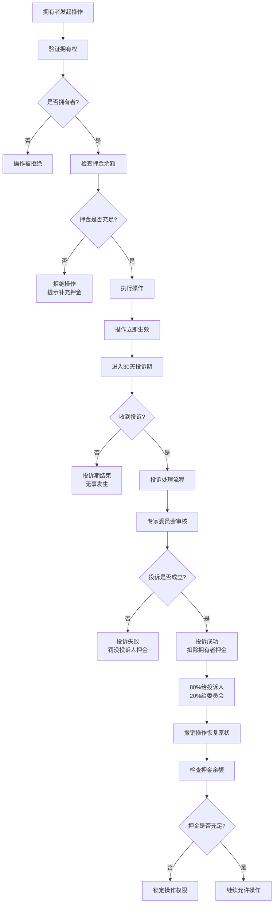
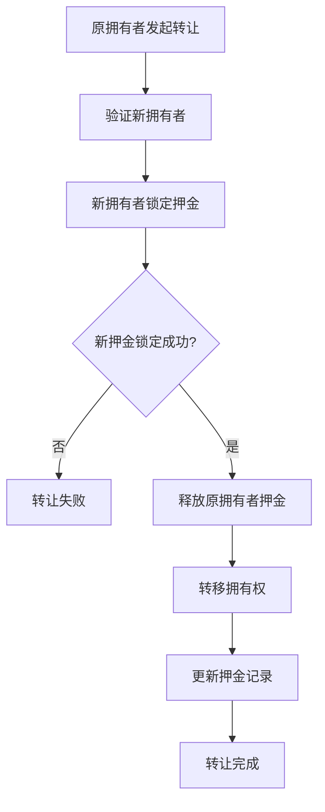

# 逝者拥有者操作投诉治理机制设计方案（永久质押押金模式）

## 执行摘要

本方案专门针对**逝者拥有者对自有逝者进行增删改操作的投诉治理机制**进行设计。该机制采用**创建时一次性永久质押押金**的模式，拥有者在创建逝者时锁定押金，押金不足时需要补齐才能继续操作，直到转让拥有权时释放押金。日常增删改操作无需额外押金，通过质押押金池承担投诉风险。

### 🎯 核心特点

- **一次性永久质押**：创建逝者时锁定押金，直到转让拥有权才释放
- **USDT计价系统**：避免DUST价格波动对治理的影响
- **押金池模式**：投诉成功从质押押金池扣除，无需每次操作锁定
- **押金不足限制**：押金不足时限制操作权限，必须补齐
- **最小投诉押金**：5 USDT最小投诉押金，确保投诉质量

### 💡 设计创新

1. **永久质押机制**：创建时锁定，转让时释放，简化操作流程
2. **押金池承责**：质押押金作为责任保证金，覆盖所有操作
3. **押金补充机制**：押金不足自动锁定权限，补齐后恢复
4. **无操作成本**：日常增删改不需要额外押金，降低使用门槛

---

## 1. 业务场景分析

### 1.1 核心场景

**场景一：创建逝者并锁定押金**
```
用户创建逝者
→ 计算所需押金（USDT计价）
→ 锁定DUST押金（永久质押）
→ 获得完整操作权限
```

**场景二：正常增删改操作**
```
拥有者操作内容
→ 检查押金是否充足
→ 充足：允许操作（无需额外押金）
→ 不足：拒绝操作，提示补充押金
```

**场景三：投诉处理**
```
公众投诉操作
→ 锁定投诉押金
→ 委员会审核
→ 投诉成功：从拥有者质押押金扣除 → 80%给投诉人，20%给委员会
→ 投诉失败：罚没投诉人押金 → 80%给拥有者，20%给委员会
```

**场景四：押金不足补充**
```
押金余额低于要求
→ 限制操作权限
→ 拥有者补充押金
→ 押金充足后恢复权限
```

**场景五：转让拥有权**
```
拥有者转让逝者
→ 释放原拥有者质押押金
→ 新拥有者锁定新的质押押金
→ 完成拥有权转移
```

### 1.2 押金模式对比

| 对比维度 | 传统模式（每次操作锁押金） | 🆕 永久质押模式 |
|---------|------------------------|-----------------|
| **押金锁定时机** | 每次操作时 | 创建逝者时一次性 |
| **押金释放时机** | 操作完成或投诉期结束 | 转让拥有权时 |
| **操作成本** | 每次需要锁定押金 | ✅ 无额外押金 |
| **资金占用** | 临时锁定 | ✅ 长期质押 |
| **用户体验** | 繁琐，需频繁准备押金 | ✅ 一次锁定，自由操作 |
| **风险覆盖** | 单次操作风险 | ✅ 所有操作风险 |

### 1.3 押金计算逻辑

```rust
/// 永久质押押金计算公式
质押押金 = 基础押金 × 内容规模系数 × 历史信誉系数

/// 基础押金标准（USDT）
基础押金 = 100 USDT（固定）

/// 内容规模系数（预期内容数量）
内容规模系数 = {
    小规模（<10条）: 1.0x
    中规模（10-50条）: 1.5x
    大规模（>50条）: 2.0x
}

/// 历史信誉系数（用户历史记录）
历史信誉系数 = {
    新用户: 1.0x
    良好记录: 0.8x
    优秀记录: 0.6x
    不良记录: 1.5x
}
```

**示例计算**：
- 新用户创建中规模逝者：100 USDT × 1.5 × 1.0 = **150 USDT**
- 优秀用户创建小规模逝者：100 USDT × 1.0 × 0.6 = **60 USDT**

---

## 2. USDT计价永久质押押金机制

### 2.1 创建时押金锁定

#### 押金标准表

| 逝者规模 | 预期内容量 | 基础押金 | 规模系数 | 最终押金范围 |
|---------|-----------|---------|---------|-------------|
| **小规模** | <10条内容 | 100 USDT | 1.0x | 60-150 USDT |
| **中规模** | 10-50条内容 | 100 USDT | 1.5x | 90-225 USDT |
| **大规模** | >50条内容 | 100 USDT | 2.0x | 120-300 USDT |

#### 创建逝者接口

```rust
/// 创建逝者并锁定永久质押押金
#[pallet::call_index(0)]
#[pallet::weight(T::WeightInfo::create_deceased_with_deposit())]
pub fn create_deceased_with_deposit(
    origin: OriginFor<T>,
    /// 逝者基本信息
    deceased_info: DeceasedInfo,
    /// 预期内容规模
    expected_scale: ContentScale,
) -> DispatchResult {
    let owner = ensure_signed(origin)?;
    let now = <frame_system::Pallet<T>>::block_number();

    // 1. 计算所需押金（USDT）
    let deposit_usdt = Self::calculate_creation_deposit_usdt(
        &owner,
        expected_scale,
    )?;

    // 2. 转换为DUST金额
    let deposit_dust = Self::convert_usdt_to_dust(deposit_usdt)?;

    // 3. 锁定押金（永久质押）
    T::Fungible::hold(
        &T::RuntimeHoldReason::from(HoldReason::DeceasedOwnerDeposit),
        &owner,
        deposit_dust,
    )?;

    // 4. 创建逝者记录
    let deceased_id = Self::do_create_deceased(&owner, deceased_info)?;

    // 5. 记录押金信息
    let deposit_record = OwnerDepositRecord {
        owner: owner.clone(),
        deceased_id,
        total_deposited_usdt: deposit_usdt,
        total_deposited_dust: deposit_dust,
        available_usdt: deposit_usdt,
        available_dust: deposit_dust,
        deducted_usdt: 0,
        deducted_dust: BalanceOf::<T>::zero(),
        locked_at: now,
        exchange_rate: Self::get_current_exchange_rate()?,
        status: DepositStatus::Active,
    };

    OwnerDepositRecords::<T>::insert(deceased_id, deposit_record.clone());
    OwnerDepositsByOwner::<T>::insert(&owner, deceased_id, ());

    Self::deposit_event(Event::DeceasedCreatedWithDeposit {
        deceased_id,
        owner,
        deposit_usdt,
        deposit_dust,
    });

    Ok(())
}

/// 计算创建押金（USDT）
fn calculate_creation_deposit_usdt(
    owner: &T::AccountId,
    scale: ContentScale,
) -> Result<u32, Error<T>> {
    let base_deposit = T::BaseCreationDepositUsdt::get(); // 100 USDT

    // 规模系数
    let scale_multiplier = match scale {
        ContentScale::Small => Perbill::from_percent(100),  // 1.0x
        ContentScale::Medium => Perbill::from_percent(150), // 1.5x
        ContentScale::Large => Perbill::from_percent(200),  // 2.0x
    };

    // 历史信誉系数
    let reputation_multiplier = Self::get_owner_reputation_multiplier(owner)?;

    // 综合计算
    let final_deposit = (base_deposit as u128)
        .saturating_mul(scale_multiplier.mul_floor(100) as u128)
        .div(100)
        .saturating_mul(reputation_multiplier.mul_floor(100) as u128)
        .div(100);

    Ok(final_deposit as u32)
}
```

### 2.2 押金余额管理

#### 押金记录结构

```rust
/// 拥有者押金记录
#[derive(Encode, Decode, Clone, PartialEq, Eq, TypeInfo, MaxEncodedLen)]
pub struct OwnerDepositRecord<T: Config> {
    /// 拥有者账户
    pub owner: T::AccountId,
    /// 逝者ID
    pub deceased_id: u64,

    /// 总锁定押金（USDT）
    pub total_deposited_usdt: u32,
    /// 总锁定押金（DUST）
    pub total_deposited_dust: BalanceOf<T>,

    /// 可用押金（USDT）- 扣除投诉罚款后的余额
    pub available_usdt: u32,
    /// 可用押金（DUST）
    pub available_dust: BalanceOf<T>,

    /// 已扣除押金（USDT）- 投诉罚款累计
    pub deducted_usdt: u32,
    /// 已扣除押金（DUST）
    pub deducted_dust: BalanceOf<T>,

    /// 锁定时间
    pub locked_at: BlockNumberFor<T>,
    /// 锁定时汇率
    pub exchange_rate: ExchangeRate,
    /// 押金状态
    pub status: DepositStatus,
}

/// 押金状态
#[derive(Encode, Decode, Clone, PartialEq, Eq, TypeInfo, MaxEncodedLen)]
pub enum DepositStatus {
    /// 活跃状态（押金充足）
    Active,
    /// 押金不足（需要补充）
    Insufficient,
    /// 已冻结（等待转让或其他处理）
    Frozen,
    /// 已释放
    Released,
}
```

#### 押金充足性检查

```rust
impl<T: Config> Pallet<T> {
    /// 检查押金是否充足
    pub fn is_deposit_sufficient(deceased_id: u64) -> Result<bool, Error<T>> {
        let deposit_record = OwnerDepositRecords::<T>::get(deceased_id)
            .ok_or(Error::<T>::DepositRecordNotFound)?;

        // 最低要求：50 USDT
        let min_required_usdt = T::MinimumDepositUsdt::get();

        Ok(deposit_record.available_usdt >= min_required_usdt)
    }

    /// 确保押金充足，否则拒绝操作
    pub fn ensure_sufficient_deposit(deceased_id: u64) -> DispatchResult {
        ensure!(
            Self::is_deposit_sufficient(deceased_id)?,
            Error::<T>::InsufficientDeposit
        );
        Ok(())
    }

    /// 获取押金状态信息
    pub fn get_deposit_status(deceased_id: u64) -> Result<DepositStatusInfo, Error<T>> {
        let deposit_record = OwnerDepositRecords::<T>::get(deceased_id)
            .ok_or(Error::<T>::DepositRecordNotFound)?;

        let min_required_usdt = T::MinimumDepositUsdt::get();
        let shortage_usdt = if deposit_record.available_usdt < min_required_usdt {
            min_required_usdt - deposit_record.available_usdt
        } else {
            0
        };

        Ok(DepositStatusInfo {
            total_deposited_usdt: deposit_record.total_deposited_usdt,
            available_usdt: deposit_record.available_usdt,
            deducted_usdt: deposit_record.deducted_usdt,
            min_required_usdt,
            shortage_usdt,
            is_sufficient: shortage_usdt == 0,
            can_operate: shortage_usdt == 0,
        })
    }
}

/// 押金状态信息
#[derive(Encode, Decode, Clone, PartialEq, Eq, TypeInfo)]
pub struct DepositStatusInfo {
    /// 总押金
    pub total_deposited_usdt: u32,
    /// 可用押金
    pub available_usdt: u32,
    /// 已扣除
    pub deducted_usdt: u32,
    /// 最低要求
    pub min_required_usdt: u32,
    /// 缺口
    pub shortage_usdt: u32,
    /// 是否充足
    pub is_sufficient: bool,
    /// 是否可以操作
    pub can_operate: bool,
}
```

### 2.3 押金补充机制

```rust
/// 补充押金
#[pallet::call_index(1)]
#[pallet::weight(T::WeightInfo::top_up_deposit())]
pub fn top_up_deposit(
    origin: OriginFor<T>,
    /// 逝者ID
    deceased_id: u64,
    /// 补充金额（USDT）
    top_up_usdt: u32,
) -> DispatchResult {
    let owner = ensure_signed(origin)?;

    // 1. 验证拥有权
    Self::ensure_is_owner(&owner, deceased_id)?;

    // 2. 获取押金记录
    let mut deposit_record = OwnerDepositRecords::<T>::get(deceased_id)
        .ok_or(Error::<T>::DepositRecordNotFound)?;

    ensure!(
        deposit_record.owner == owner,
        Error::<T>::NotOwner
    );

    // 3. 转换为DUST金额
    let top_up_dust = Self::convert_usdt_to_dust(top_up_usdt)?;

    // 4. 锁定补充押金
    T::Fungible::hold(
        &T::RuntimeHoldReason::from(HoldReason::DeceasedOwnerDeposit),
        &owner,
        top_up_dust,
    )?;

    // 5. 更新押金记录
    deposit_record.total_deposited_usdt = deposit_record.total_deposited_usdt
        .saturating_add(top_up_usdt);
    deposit_record.total_deposited_dust = deposit_record.total_deposited_dust
        .saturating_add(top_up_dust);
    deposit_record.available_usdt = deposit_record.available_usdt
        .saturating_add(top_up_usdt);
    deposit_record.available_dust = deposit_record.available_dust
        .saturating_add(top_up_dust);

    // 6. 更新状态
    if deposit_record.available_usdt >= T::MinimumDepositUsdt::get() {
        deposit_record.status = DepositStatus::Active;
    }

    OwnerDepositRecords::<T>::insert(deceased_id, deposit_record.clone());

    Self::deposit_event(Event::DepositToppedUp {
        deceased_id,
        owner,
        top_up_usdt,
        top_up_dust,
        new_available_usdt: deposit_record.available_usdt,
    });

    Ok(())
}
```

---

## 3. 拥有者操作流程（无需额外押金）

### 3.1 操作权限检查流程



### 3.2 拥有者操作接口

```rust
/// 拥有者执行操作（无需额外押金）
#[pallet::call_index(10)]
#[pallet::weight(T::WeightInfo::owner_execute_operation())]
pub fn owner_execute_operation(
    origin: OriginFor<T>,
    /// 逝者ID
    deceased_id: u64,
    /// 操作类型
    operation: OperationType,
    /// 内容类型
    content_type: ContentType,
    /// 内容ID（修改/删除时）
    content_id: Option<u64>,
    /// 新内容CID（新增/修改时）
    new_content_cid: Option<BoundedVec<u8, ConstU32<128>>>,
    /// 操作理由
    reason: BoundedVec<u8, ConstU32<512>>,
) -> DispatchResult {
    let owner = ensure_signed(origin)?;
    let now = <frame_system::Pallet<T>>::block_number();

    // 1. 验证拥有权
    Self::ensure_is_owner(&owner, deceased_id)?;

    // 2. 检查押金是否充足
    Self::ensure_sufficient_deposit(deceased_id)?;

    // 3. 验证操作参数
    Self::validate_operation_params(
        operation,
        content_type,
        content_id,
        &new_content_cid
    )?;

    // 4. 执行操作（无需锁定押金）
    let operation_id = Self::execute_content_operation(
        &owner,
        deceased_id,
        operation,
        content_type,
        content_id,
        new_content_cid.clone(),
    )?;

    // 5. 记录操作
    let owner_operation = OwnerOperation {
        operation_id,
        owner: owner.clone(),
        deceased_id,
        operation,
        content_type,
        content_id,
        new_content_cid,
        reason,
        executed_at: now,
        complaint_window_end: now + T::OwnerOperationComplaintPeriod::get(),
        status: OwnerOperationStatus::Active,
        complaint_count: 0,
    };

    OwnerOperations::<T>::insert(operation_id, owner_operation.clone());

    Self::deposit_event(Event::OwnerOperationExecuted {
        operation_id,
        owner,
        deceased_id,
        operation,
        complaint_window_end: owner_operation.complaint_window_end,
    });

    Ok(())
}
```

---

## 4. 投诉处理与押金扣除

### 4.1 投诉押金标准

**固定投诉押金**：
- **最小押金**：5 USDT
- **标准押金**：10 USDT
- **高风险投诉**：20 USDT（针对严重违规）

```rust
/// 投诉押金计算
pub fn calculate_complaint_deposit(
    operation: &OwnerOperation<T>,
) -> Result<u32, Error<T>> {
    // 根据操作类型和内容类型决定投诉押金
    let deposit_usdt = match (operation.operation, operation.content_type) {
        // 删除操作投诉押金较高
        (OperationType::Delete, ContentType::Works) => 20,
        (OperationType::Delete, ContentType::Media) => 15,
        (OperationType::Delete, _) => 10,

        // 修改操作
        (OperationType::Modify, ContentType::Works) => 15,
        (OperationType::Modify, _) => 10,

        // 新增操作投诉押金较低
        (OperationType::Add, _) => 5,
    };

    Ok(deposit_usdt.max(T::MinComplaintDepositUsdt::get()))
}
```

### 4.2 投诉提交接口

```rust
/// 投诉拥有者操作
#[pallet::call_index(11)]
#[pallet::weight(T::WeightInfo::complain_owner_operation())]
pub fn complain_owner_operation(
    origin: OriginFor<T>,
    /// 操作ID
    operation_id: u64,
    /// 投诉类型
    complaint_type: ComplaintType,
    /// 投诉理由
    reason: BoundedVec<u8, ConstU32<1024>>,
    /// 证据CID列表
    evidence_cids: BoundedVec<BoundedVec<u8, ConstU32<128>>, ConstU32<10>>,
) -> DispatchResult {
    let complainant = ensure_signed(origin)?;
    let now = <frame_system::Pallet<T>>::block_number();

    // 1. 获取操作记录
    let operation = OwnerOperations::<T>::get(operation_id)
        .ok_or(Error::<T>::OperationNotFound)?;

    // 2. 验证投诉窗口
    ensure!(
        operation.status == OwnerOperationStatus::Active,
        Error::<T>::OperationNotActive
    );
    ensure!(
        now <= operation.complaint_window_end,
        Error::<T>::ComplaintWindowExpired
    );

    // 3. 不能投诉自己的操作
    ensure!(
        operation.owner != complainant,
        Error::<T>::CannotComplainOwnOperation
    );

    // 4. 计算投诉押金
    let complaint_deposit_usdt = Self::calculate_complaint_deposit(&operation)?;
    let complaint_deposit_dust = Self::convert_usdt_to_dust(complaint_deposit_usdt)?;

    // 5. 锁定投诉押金
    T::Fungible::hold(
        &T::RuntimeHoldReason::from(HoldReason::ComplaintDeposit),
        &complainant,
        complaint_deposit_dust,
    )?;

    // 6. 创建投诉记录
    let complaint_id = NextComplaintId::<T>::mutate(|id| {
        let current = *id;
        *id = id.saturating_add(1);
        current
    });

    let complaint = OwnerOperationComplaint {
        complaint_id,
        complainant: complainant.clone(),
        operation_id,
        complaint_type,
        reason,
        evidence_cids,
        deposit_usdt: complaint_deposit_usdt,
        deposit_dust: complaint_deposit_dust,
        status: ComplaintStatus::Submitted,
        submitted_at: now,
        reviewed_at: None,
    };

    OwnerOperationComplaints::<T>::insert(complaint_id, complaint);
    ComplaintsByOperation::<T>::insert(operation_id, complaint_id, ());

    // 7. 更新操作记录
    OwnerOperations::<T>::mutate(operation_id, |op| {
        if let Some(operation) = op {
            operation.complaint_count += 1;
        }
    });

    Self::deposit_event(Event::OperationComplained {
        complaint_id,
        operation_id,
        complainant,
        deposit_usdt: complaint_deposit_usdt,
        deposit_dust: complaint_deposit_dust,
    });

    Ok(())
}
```

### 4.3 投诉审核与押金扣除

```rust
/// 专家委员会审核投诉
#[pallet::call_index(12)]
#[pallet::weight(T::WeightInfo::review_complaint())]
pub fn review_owner_complaint(
    origin: OriginFor<T>,
    /// 投诉ID
    complaint_id: u64,
    /// 审核决定
    decision: ExpertDecision,
    /// 审核意见
    reasoning: BoundedVec<u8, ConstU32<1024>>,
) -> DispatchResult {
    T::ExpertCommitteeOrigin::ensure_origin(origin)?;

    let now = <frame_system::Pallet<T>>::block_number();

    // 1. 获取投诉记录
    let mut complaint = OwnerOperationComplaints::<T>::get(complaint_id)
        .ok_or(Error::<T>::ComplaintNotFound)?;

    ensure!(
        complaint.status == ComplaintStatus::Submitted,
        Error::<T>::ComplaintAlreadyReviewed
    );

    // 2. 获取操作记录
    let mut operation = OwnerOperations::<T>::get(complaint.operation_id)
        .ok_or(Error::<T>::OperationNotFound)?;

    // 3. 处理审核结果
    match decision {
        ExpertDecision::ComplaintValid => {
            // 投诉成功 - 从拥有者质押押金扣除
            Self::handle_complaint_success(
                &operation,
                &complaint,
                now,
            )?;
            complaint.status = ComplaintStatus::Upheld;
            operation.status = OwnerOperationStatus::Revoked;
        },
        ExpertDecision::ComplaintInvalid => {
            // 投诉失败 - 罚没投诉人押金
            Self::handle_complaint_failure(
                &operation,
                &complaint,
                now,
            )?;
            complaint.status = ComplaintStatus::Rejected;
        },
        ExpertDecision::RequireMoreEvidence => {
            complaint.status = ComplaintStatus::PendingEvidence;
            Self::request_additional_evidence(complaint_id)?;
            return Ok(());
        },
    }

    complaint.reviewed_at = Some(now);

    // 4. 更新存储
    OwnerOperationComplaints::<T>::insert(complaint_id, complaint);
    OwnerOperations::<T>::insert(complaint.operation_id, operation);

    Self::deposit_event(Event::ComplaintReviewed {
        complaint_id,
        operation_id: complaint.operation_id,
        decision,
    });

    Ok(())
}

/// 处理投诉成功 - 从质押押金扣除
fn handle_complaint_success(
    operation: &OwnerOperation<T>,
    complaint: &OwnerOperationComplaint<T>,
    now: BlockNumberFor<T>,
) -> DispatchResult {
    // 1. 获取拥有者押金记录
    let mut deposit_record = OwnerDepositRecords::<T>::get(operation.deceased_id)
        .ok_or(Error::<T>::DepositRecordNotFound)?;

    // 2. 计算罚款金额（需要从质押押金扣除的金额）
    // 罚款 = 投诉押金 × 2 (投诉人拿80%，委员会拿20%)
    let penalty_usdt = complaint.deposit_usdt * 2;
    let penalty_dust = complaint.deposit_dust.saturating_mul(2u32.into());

    // 3. 检查质押押金是否充足
    ensure!(
        deposit_record.available_usdt >= penalty_usdt,
        Error::<T>::InsufficientDepositForPenalty
    );
    ensure!(
        deposit_record.available_dust >= penalty_dust,
        Error::<T>::InsufficientDepositForPenalty
    );

    // 4. 从质押押金扣除
    deposit_record.available_usdt = deposit_record.available_usdt
        .saturating_sub(penalty_usdt);
    deposit_record.available_dust = deposit_record.available_dust
        .saturating_sub(penalty_dust);
    deposit_record.deducted_usdt = deposit_record.deducted_usdt
        .saturating_add(penalty_usdt);
    deposit_record.deducted_dust = deposit_record.deducted_dust
        .saturating_add(penalty_dust);

    // 5. 检查押金是否低于最低要求
    if deposit_record.available_usdt < T::MinimumDepositUsdt::get() {
        deposit_record.status = DepositStatus::Insufficient;
    }

    OwnerDepositRecords::<T>::insert(operation.deceased_id, deposit_record);

    // 6. 分配罚款：80%给投诉人，20%给委员会
    let complainant_reward = Perbill::from_percent(80).mul_floor(penalty_dust);
    let committee_reward = penalty_dust.saturating_sub(complainant_reward);

    // 7. 从拥有者质押中转给投诉人
    T::Fungible::transfer_on_hold(
        &T::RuntimeHoldReason::from(HoldReason::DeceasedOwnerDeposit),
        &operation.owner,
        &complaint.complainant,
        complainant_reward,
        Precision::BestEffort,
        Restriction::Free,
        Fortitude::Force,
    )?;

    // 8. 从拥有者质押中转给委员会
    Self::distribute_committee_reward_from_hold(
        &operation.owner,
        committee_reward,
        complaint.complaint_id,
    )?;

    // 9. 释放投诉人押金
    T::Fungible::release(
        &T::RuntimeHoldReason::from(HoldReason::ComplaintDeposit),
        &complaint.complainant,
        complaint.deposit_dust,
        Precision::Exact,
    )?;

    // 10. 撤销操作
    Self::revert_owner_operation(operation)?;

    Self::deposit_event(Event::ComplaintSuccessDepositDeducted {
        complaint_id: complaint.complaint_id,
        operation_id: operation.operation_id,
        deceased_id: operation.deceased_id,
        deducted_usdt: penalty_usdt,
        deducted_dust: penalty_dust,
        complainant_reward,
        committee_reward,
        remaining_deposit_usdt: deposit_record.available_usdt,
    });

    Ok(())
}

/// 处理投诉失败 - 罚没投诉人押金
fn handle_complaint_failure(
    operation: &OwnerOperation<T>,
    complaint: &OwnerOperationComplaint<T>,
    now: BlockNumberFor<T>,
) -> DispatchResult {
    let complaint_deposit = complaint.deposit_dust;

    // 1. 分配：80%给拥有者，20%给委员会
    let owner_compensation = Perbill::from_percent(80).mul_floor(complaint_deposit);
    let committee_reward = complaint_deposit.saturating_sub(owner_compensation);

    // 2. 转给拥有者（增加到其账户余额，不是质押押金）
    T::Fungible::transfer_on_hold(
        &T::RuntimeHoldReason::from(HoldReason::ComplaintDeposit),
        &complaint.complainant,
        &operation.owner,
        owner_compensation,
        Precision::BestEffort,
        Restriction::Free,
        Fortitude::Force,
    )?;

    // 3. 转给委员会
    Self::distribute_committee_reward_from_hold(
        &complaint.complainant,
        committee_reward,
        complaint.complaint_id,
    )?;

    Self::deposit_event(Event::ComplaintRejectedDepositForfeited {
        complaint_id: complaint.complaint_id,
        operation_id: operation.operation_id,
        complainant: complaint.complainant.clone(),
        owner_compensation,
        committee_reward,
    });

    Ok(())
}
```

---

## 5. 拥有权转让与押金释放

### 5.1 转让流程



### 5.2 转让接口

```rust
/// 转让逝者拥有权
#[pallet::call_index(20)]
#[pallet::weight(T::WeightInfo::transfer_ownership())]
pub fn transfer_deceased_ownership(
    origin: OriginFor<T>,
    /// 逝者ID
    deceased_id: u64,
    /// 新拥有者
    new_owner: T::AccountId,
    /// 新拥有者预期规模
    new_owner_expected_scale: ContentScale,
) -> DispatchResult {
    let old_owner = ensure_signed(origin)?;

    // 1. 验证当前拥有权
    Self::ensure_is_owner(&old_owner, deceased_id)?;

    // 2. 获取当前押金记录
    let old_deposit_record = OwnerDepositRecords::<T>::get(deceased_id)
        .ok_or(Error::<T>::DepositRecordNotFound)?;

    ensure!(
        old_deposit_record.status == DepositStatus::Active ||
        old_deposit_record.status == DepositStatus::Insufficient,
        Error::<T>::DepositNotTransferable
    );

    // 3. 计算新拥有者所需押金
    let new_deposit_usdt = Self::calculate_creation_deposit_usdt(
        &new_owner,
        new_owner_expected_scale,
    )?;
    let new_deposit_dust = Self::convert_usdt_to_dust(new_deposit_usdt)?;

    // 4. 锁定新拥有者押金
    T::Fungible::hold(
        &T::RuntimeHoldReason::from(HoldReason::DeceasedOwnerDeposit),
        &new_owner,
        new_deposit_dust,
    )?;

    // 5. 释放原拥有者押金
    T::Fungible::release(
        &T::RuntimeHoldReason::from(HoldReason::DeceasedOwnerDeposit),
        &old_owner,
        old_deposit_record.available_dust,
        Precision::Exact,
    )?;

    // 6. 更新逝者拥有权
    Self::do_transfer_ownership(deceased_id, &old_owner, &new_owner)?;

    // 7. 创建新押金记录
    let new_deposit_record = OwnerDepositRecord {
        owner: new_owner.clone(),
        deceased_id,
        total_deposited_usdt: new_deposit_usdt,
        total_deposited_dust: new_deposit_dust,
        available_usdt: new_deposit_usdt,
        available_dust: new_deposit_dust,
        deducted_usdt: 0,
        deducted_dust: BalanceOf::<T>::zero(),
        locked_at: <frame_system::Pallet<T>>::block_number(),
        exchange_rate: Self::get_current_exchange_rate()?,
        status: DepositStatus::Active,
    };

    // 8. 更新存储
    OwnerDepositRecords::<T>::insert(deceased_id, new_deposit_record);
    OwnerDepositsByOwner::<T>::remove(&old_owner, deceased_id);
    OwnerDepositsByOwner::<T>::insert(&new_owner, deceased_id, ());

    Self::deposit_event(Event::OwnershipTransferredWithDeposit {
        deceased_id,
        old_owner: old_owner.clone(),
        new_owner: new_owner.clone(),
        old_deposit_released_usdt: old_deposit_record.available_usdt,
        old_deposit_released_dust: old_deposit_record.available_dust,
        new_deposit_locked_usdt: new_deposit_usdt,
        new_deposit_locked_dust: new_deposit_dust,
    });

    Ok(())
}
```

---

## 6. 前端用户界面设计

### 6.1 创建逝者界面（锁定押金）

```typescript
// 创建逝者页面
const CreateDeceasedWithDepositPage: React.FC = () => {
  const [deceasedInfo, setDeceasedInfo] = useState<DeceasedInfo>();
  const [expectedScale, setExpectedScale] = useState<ContentScale>('medium');
  const [depositEstimate, setDepositEstimate] = useState<DepositEstimate>();
  const [exchangeRate, setExchangeRate] = useState<ExchangeRate>();

  // 实时计算押金
  useEffect(() => {
    const calculateDeposit = async () => {
      const estimate = await api.calculateCreationDeposit({
        owner: currentUser.address,
        expectedScale,
      });
      setDepositEstimate(estimate);
    };

    calculateDeposit();
  }, [expectedScale]);

  return (
    <div className=\"max-w-md mx-auto p-4 space-y-6\">
      <PageHeader
        title=\"创建逝者档案\"
        subtitle=\"创建时需锁定永久质押押金\"
      />

      {/* 逝者基本信息 */}
      <DeceasedInfoForm
        value={deceasedInfo}
        onChange={setDeceasedInfo}
      />

      {/* 预期内容规模选择 */}
      <ContentScaleSelector
        value={expectedScale}
        onChange={setExpectedScale}
        options={[
          {
            value: 'small',
            label: '小规模',
            description: '少于10条内容（照片、作品等）',
            deposit: '60-150 USDT',
            recommended: '个人纪念'
          },
          {
            value: 'medium',
            label: '中规模',
            description: '10-50条内容',
            deposit: '90-225 USDT',
            recommended: '标准档案'
          },
          {
            value: 'large',
            label: '大规模',
            description: '超过50条内容',
            deposit: '120-300 USDT',
            recommended: '完整传记'
          },
        ]}
      />

      {/* 永久质押押金说明 */}
      <PermanentDepositCard>
        <div className=\"bg-gradient-to-r from-purple-50 to-indigo-50 p-5 rounded-lg\">
          <div className=\"flex items-center mb-3\">
            <LockIcon className=\"w-5 h-5 text-purple-600 mr-2\" />
            <h3 className=\"font-semibold text-purple-900\">永久质押押金</h3>
          </div>

          <div className=\"text-center mb-4\">
            <div className=\"text-4xl font-bold text-purple-600\">
              ${depositEstimate?.usdt || '0'}
            </div>
            <div className=\"text-sm text-gray-600 mt-1\">USDT 等值</div>
            <div className=\"text-lg text-gray-700 mt-2\">
              ≈ {depositEstimate?.dust || '0'} DUST
            </div>
          </div>

          <ExchangeRateDisplay rate={exchangeRate} />

          <div className=\"mt-4 space-y-2\">
            <DepositBreakdown
              baseDeposit={100}
              scaleMultiplier={expectedScale === 'small' ? 1.0 : expectedScale === 'medium' ? 1.5 : 2.0}
              reputationMultiplier={depositEstimate?.reputationMultiplier || 1.0}
            />
          </div>

          {/* 押金用途说明 */}
          <div className=\"mt-4 p-3 bg-white rounded-lg border border-purple-200\">
            <div className=\"text-xs font-medium text-purple-800 mb-2\">
              💡 押金用途说明
            </div>
            <ul className=\"text-xs text-gray-700 space-y-1\">
              <li>✅ 一次性锁定，无需每次操作支付押金</li>
              <li>✅ 作为所有操作的责任保证金</li>
              <li>✅ 投诉成功时从此扣除罚款</li>
              <li>✅ 转让拥有权时全额释放</li>
              <li>✅ 押金不足时需补充才能继续操作</li>
            </ul>
          </div>
        </div>
      </PermanentDepositCard>

      {/* 风险提示 */}
      <RiskWarningCard>
        <div className=\"p-4 bg-amber-50 border-l-4 border-amber-400 rounded\">
          <div className=\"flex items-center mb-2\">
            <AlertTriangleIcon className=\"w-4 h-4 text-amber-600 mr-2\" />
            <span className=\"font-medium text-amber-800\">重要提示</span>
          </div>
          <ul className=\"text-xs text-amber-700 space-y-1\">
            <li>• 押金将被永久锁定，直到转让拥有权</li>
            <li>• 操作被投诉成功会从押金中扣除罚款</li>
            <li>• 押金不足时将无法进行增删改操作</li>
            <li>• 请确保有足够资金并理解责任</li>
          </ul>
        </div>
      </RiskWarningCard>

      {/* 创建按钮 */}
      <CreateButton
        disabled={!isFormValid}
        depositAmount={depositEstimate?.dust}
        onClick={handleCreate}
        loading={creating}
      >
        锁定押金并创建逝者档案
      </CreateButton>
    </div>
  );
};
```

### 6.2 押金状态监控界面

```typescript
// 押金状态卡片
const DepositStatusCard: React.FC<{ deceasedId: string }> = ({ deceasedId }) => {
  const { depositStatus, loading } = useDepositStatus(deceasedId);

  if (loading) return <LoadingSkeleton />;

  const isInsufficient = !depositStatus.is_sufficient;
  const shortage = depositStatus.shortage_usdt;

  return (
    <div className=\"bg-white rounded-lg shadow-md p-4\">
      {/* 状态指示器 */}
      <div className=\"flex items-center justify-between mb-4\">
        <h3 className=\"font-semibold text-gray-900\">押金状态</h3>
        <StatusBadge
          status={isInsufficient ? 'insufficient' : 'active'}
          label={isInsufficient ? '押金不足' : '押金充足'}
        />
      </div>

      {/* 押金余额 */}
      <div className=\"grid grid-cols-2 gap-4 mb-4\">
        <div className=\"text-center p-3 bg-gray-50 rounded-lg\">
          <div className=\"text-2xl font-bold text-gray-900\">
            ${depositStatus.available_usdt}
          </div>
          <div className=\"text-xs text-gray-600 mt-1\">可用押金</div>
        </div>

        <div className=\"text-center p-3 bg-gray-50 rounded-lg\">
          <div className=\"text-2xl font-bold text-gray-900\">
            ${depositStatus.total_deposited_usdt}
          </div>
          <div className=\"text-xs text-gray-600 mt-1\">总质押</div>
        </div>
      </div>

      {/* 押金详情 */}
      <div className=\"space-y-2 text-sm\">
        <div className=\"flex justify-between\">
          <span className=\"text-gray-600\">最低要求</span>
          <span className=\"font-medium\">${depositStatus.min_required_usdt}</span>
        </div>
        <div className=\"flex justify-between\">
          <span className=\"text-gray-600\">已扣除</span>
          <span className=\"font-medium text-red-600\">
            ${depositStatus.deducted_usdt}
          </span>
        </div>
        {isInsufficient && (
          <div className=\"flex justify-between\">
            <span className=\"text-gray-600\">需要补充</span>
            <span className=\"font-bold text-orange-600\">
              ${shortage}
            </span>
          </div>
        )}
      </div>

      {/* 操作权限提示 */}
      <div className=\"mt-4 p-3 rounded-lg\" style={{
        backgroundColor: isInsufficient ? '#FEF3C7' : '#D1FAE5',
        borderColor: isInsufficient ? '#F59E0B' : '#10B981',
        borderWidth: 1
      }}>
        <div className=\"flex items-center\">
          {isInsufficient ? (
            <>
              <XCircleIcon className=\"w-4 h-4 text-orange-600 mr-2\" />
              <span className=\"text-xs text-orange-800\">
                押金不足，已限制操作权限
              </span>
            </>
          ) : (
            <>
              <CheckCircleIcon className=\"w-4 h-4 text-green-600 mr-2\" />
              <span className=\"text-xs text-green-800\">
                押金充足，可正常操作
              </span>
            </>
          )}
        </div>
      </div>

      {/* 补充押金按钮 */}
      {isInsufficient && (
        <div className=\"mt-4\">
          <Button
            variant=\"primary\"
            size=\"lg\"
            fullWidth
            onClick={() => router.push(`/deceased/${deceasedId}/top-up`)}
          >
            立即补充押金 (${shortage})
          </Button>
        </div>
      )}

      {/* 押金历史 */}
      <div className=\"mt-4\">
        <button
          className=\"text-sm text-blue-600 hover:text-blue-800\"
          onClick={() => setShowHistory(true)}
        >
          查看押金变动历史 →
        </button>
      </div>
    </div>
  );
};

// 补充押金页面
const TopUpDepositPage: React.FC<{ deceasedId: string }> = ({ deceasedId }) => {
  const { depositStatus } = useDepositStatus(deceasedId);
  const [topUpAmount, setTopUpAmount] = useState<number>(depositStatus.shortage_usdt);
  const [topUpDust, setTopUpDust] = useState<string>('0');

  useEffect(() => {
    const calculateDust = async () => {
      const dust = await api.convertUsdtToDust(topUpAmount);
      setTopUpDust(dust);
    };

    if (topUpAmount > 0) {
      calculateDust();
    }
  }, [topUpAmount]);

  return (
    <div className=\"max-w-md mx-auto p-4 space-y-6\">
      <PageHeader
        title=\"补充押金\"
        subtitle=\"恢复操作权限\"
        backUrl={`/deceased/${deceasedId}`}
      />

      {/* 当前状态 */}
      <CurrentDepositStatus status={depositStatus} />

      {/* 补充金额输入 */}
      <div className=\"space-y-3\">
        <label className=\"block text-sm font-medium text-gray-700\">
          补充金额 (USDT)
        </label>

        <div className=\"flex items-center space-x-2\">
          <input
            type=\"number\"
            min={depositStatus.shortage_usdt}
            value={topUpAmount}
            onChange={(e) => setTopUpAmount(Number(e.target.value))}
            className=\"flex-1 px-4 py-3 border rounded-lg\"
            placeholder=\"输入补充金额\"
          />
          <Button
            variant=\"secondary\"
            onClick={() => setTopUpAmount(depositStatus.shortage_usdt)}
          >
            最小补充
          </Button>
        </div>

        <div className=\"text-sm text-gray-600\">
          需要锁定：{topUpDust} DUST
        </div>
      </div>

      {/* 快捷金额选择 */}
      <QuickAmountSelector
        options={[
          depositStatus.shortage_usdt,
          50,
          100,
          200,
        ]}
        selected={topUpAmount}
        onSelect={setTopUpAmount}
      />

      {/* 补充后状态预览 */}
      <AfterTopUpPreview
        current={depositStatus.available_usdt}
        topUp={topUpAmount}
        after={depositStatus.available_usdt + topUpAmount}
        minRequired={depositStatus.min_required_usdt}
      />

      {/* 确认补充 */}
      <Button
        variant=\"primary\"
        size=\"lg\"
        fullWidth
        disabled={topUpAmount < depositStatus.shortage_usdt}
        onClick={handleTopUp}
        loading={topping}
      >
        确认补充 ${topUpAmount}
      </Button>
    </div>
  );
};
```

### 6.3 拥有者操作界面（无押金）

```typescript
// 拥有者操作页面（无需额外押金）
const OwnerOperationPage: React.FC<{ deceasedId: string }> = ({ deceasedId }) => {
  const { depositStatus } = useDepositStatus(deceasedId);
  const [operation, setOperation] = useState<OperationData>();
  const canOperate = depositStatus.can_operate;

  return (
    <div className=\"max-w-md mx-auto p-4 space-y-6\">
      {/* 押金状态横幅 */}
      <DepositStatusBanner status={depositStatus} deceasedId={deceasedId} />

      {/* 操作被锁定提示 */}
      {!canOperate && (
        <OperationLockedAlert
          shortage={depositStatus.shortage_usdt}
          onTopUp={() => router.push(`/deceased/${deceasedId}/top-up`)}
        />
      )}

      {/* 操作表单（只有押金充足时可用） */}
      <div className={!canOperate ? 'opacity-50 pointer-events-none' : ''}>
        <OperationTypeSelector
          value={operation?.type}
          onChange={(type) => setOperation(prev => ({ ...prev, type }))}
        />

        <ContentEditor
          operation={operation}
          onChange={setOperation}
        />

        {/* 无需押金提示 */}
        <div className=\"p-4 bg-green-50 border border-green-200 rounded-lg\">
          <div className=\"flex items-center mb-2\">
            <CheckCircleIcon className=\"w-5 h-5 text-green-600 mr-2\" />
            <span className=\"font-medium text-green-800\">无需额外押金</span>
          </div>
          <p className=\"text-sm text-green-700\">
            您的质押押金（${depositStatus.available_usdt}）已覆盖本次操作，
            无需支付额外押金即可执行。
          </p>
        </div>

        {/* 投诉风险提示 */}
        <ComplaintRiskWarning
          availableDeposit={depositStatus.available_usdt}
        />

        {/* 执行操作按钮 */}
        <ExecuteButton
          disabled={!canOperate || !isOperationValid(operation)}
          onClick={handleExecute}
          loading={executing}
        >
          执行操作（无需押金）
        </ExecuteButton>
      </div>
    </div>
  );
};
```

---

## 7. 配置参数与实施计划

### 7.1 Runtime配置

```rust
impl pallet_owner_deposit_governance::Config for Runtime {
    type RuntimeEvent = RuntimeEvent;
    type WeightInfo = pallet_owner_deposit_governance::weights::WeightInfo<Runtime>;

    // 基础配置
    type Fungible = Balances;
    type RuntimeHoldReason = RuntimeHoldReason;

    // 定价服务
    type PricingProvider = PricingPallet;
    type RateCacheDuration = ConstU32<600>; // 10分钟缓存

    // 押金配置（USDT）
    type BaseCreationDepositUsdt = ConstU32<100>; // 100 USDT基础押金
    type MinimumDepositUsdt = ConstU32<50>; // 50 USDT最低余额
    type MinComplaintDepositUsdt = ConstU32<5>; // 5 USDT最小投诉押金

    // 时间配置
    type OwnerOperationComplaintPeriod = ConstU32<432000>; // 30天投诉期

    // 权限配置
    type OwnershipVerifier = DeceasedOwnershipPallet;
    type ExpertCommitteeOrigin = EnsureRootOrThreeFourthsCouncil;

    // 调度器
    type Scheduler = Scheduler;

    // 国库账户
    type TreasuryAccount = TreasuryAccount;
}
```

### 7.2 实施计划（6周）

```
Phase 1: 核心押金机制 (2周)
├── Week 1: 永久质押系统
│   ├── 创建时押金锁定
│   ├── 押金余额管理
│   ├── USDT/DUST转换
│   └── 押金记录存储
└── Week 2: 补充和释放机制
    ├── 押金补充接口
    ├── 拥有权转让
    ├── 押金释放逻辑
    └── 单元测试

Phase 2: 操作与投诉流程 (2周)
├── Week 3: 无押金操作系统
│   ├── 权限检查逻辑
│   ├── 操作执行接口
│   ├── 押金充足性验证
│   └── 操作记录管理
└── Week 4: 投诉与扣款机制
    ├── 投诉提交接口
    ├── 专家审核流程
    ├── 质押押金扣除
    └── 集成测试

Phase 3: 前端与部署 (2周)
├── Week 5: 前端界面
│   ├── 创建押金界面
│   ├── 押金监控面板
│   ├── 补充押金页面
│   └── 操作界面（无押金）
└── Week 6: 测试与部署
    ├── 端到端测试
    ├── 性能优化
    ├── 安全审计
    └── 文档完善
```

---

## 8. 总结与优势

### 8.1 核心优势

| 优势维度 | 具体表现 | 用户价值 |
|---------|---------|---------|
| **用户体验** | 一次锁定，自由操作 | ✅ 降低使用门槛 |
| **资金效率** | 押金永久质押，覆盖所有操作 | ✅ 无需频繁准备押金 |
| **风险管理** | 押金池承担责任，投诉自动扣款 | ✅ 自动化风控 |
| **权限管理** | 押金不足自动锁定权限 | ✅ 强制合规 |
| **灵活转让** | 转让时押金释放和锁定 | ✅ 流动性好 |

### 8.2 与传统模式对比

| 对比项 | 传统每次押金模式 | 🆕 永久质押模式 |
|-------|----------------|---------------|
| **操作成本** | 每次操作需押金 | ✅ 无操作押金 |
| **资金占用** | 临时多次锁定 | ✅ 一次性锁定 |
| **用户体验** | 繁琐复杂 | ✅ 简单便捷 |
| **风险覆盖** | 单次操作 | ✅ 全周期覆盖 |
| **押金管理** | 复杂多变 | ✅ 清晰透明 |

### 8.3 关键创新点

1. **永久质押机制**：创建时一次性锁定，消除操作摩擦
2. **押金池模式**：质押押金作为责任池，自动承担罚款
3. **自动权限控制**：押金不足自动锁定，强制补充后恢复
4. **无感操作体验**：日常操作无需关心押金，降低心理负担

### 8.4 实施建议

**初期参数设置**：
- 基础押金：100 USDT
- 最低余额：50 USDT
- 最小投诉押金：5 USDT
- 投诉期：30天

**风险控制**：
- 实时监控押金余额
- 自动化权限管理
- 透明的扣款记录
- 完善的申诉机制

**用户教育**：
- 清晰说明永久质押机制
- 强调押金用途和风险
- 提供押金计算器
- 建立FAQ和支持渠道

---

**文档版本**: v2.0 (永久质押模式)
**最后更新**: 2025-01-15
**作者**: Stardust 开发团队
**状态**: 待审核实施

**相关文档**:
- [逝者信息公众治理最优方案设计](./逝者信息公众治理最优方案设计.md)
- [pallet-pricing README](../pallets/pricing/README.md)
- [pallet-deceased README](../pallets/deceased/README.md)