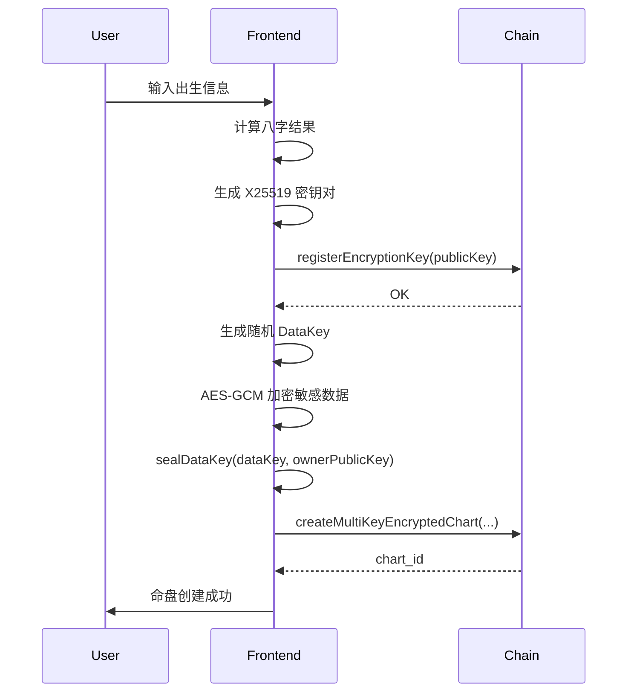
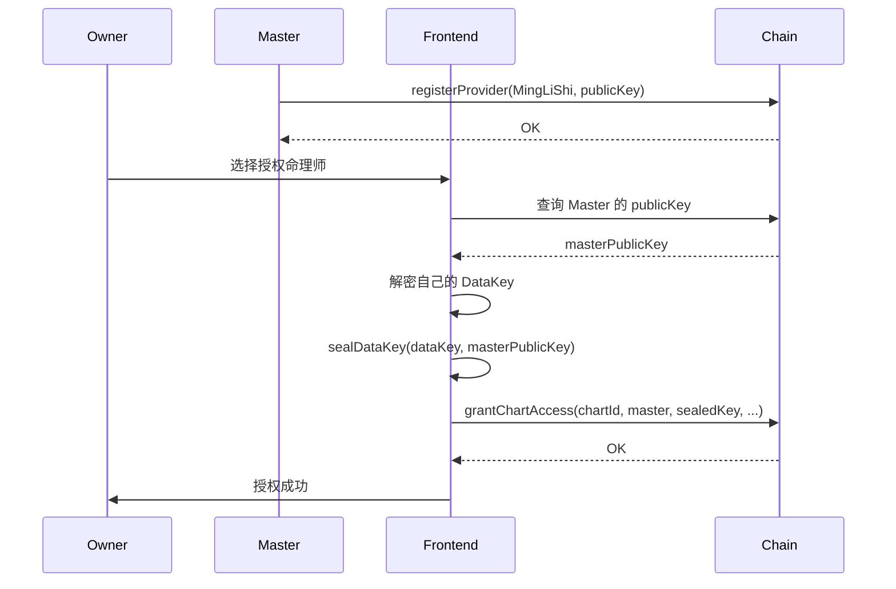
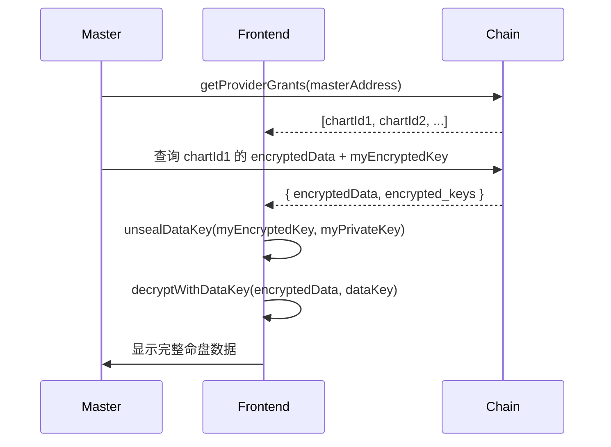
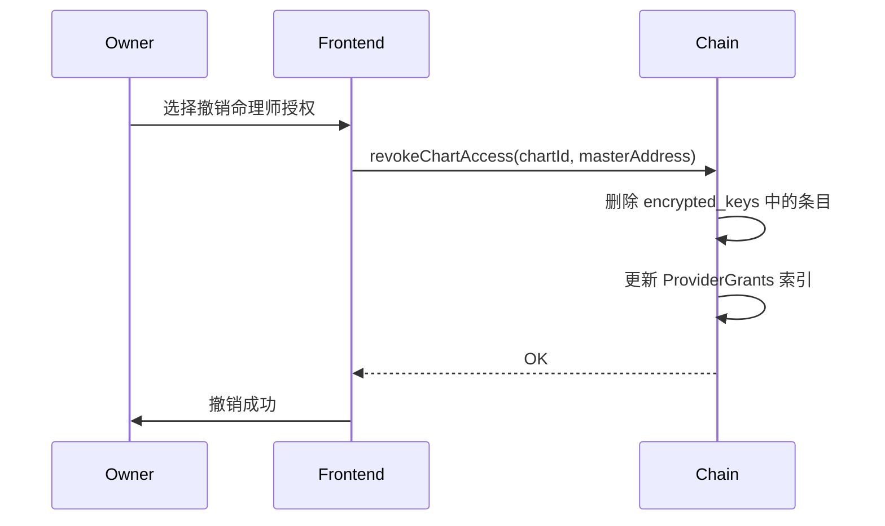

# V6 多方授权加密命盘 API 文档

> 版本: 1.0.0
> 最后更新: 2024-12

## 目录

1. [概述](#概述)
2. [安全架构](#安全架构)
3. [类型定义](#类型定义)
4. [链上存储](#链上存储)
5. [Extrinsics（交易）](#extrinsics交易)
6. [Runtime API](#runtime-api)
7. [前端工具函数](#前端工具函数)
8. [使用流程](#使用流程)
9. [错误处理](#错误处理)

---

## 概述

V6 多方授权加密命盘系统允许用户：

- 🔐 **加密存储**：出生时间等敏感数据使用 AES-256-GCM 加密
- 👥 **多方授权**：授权命理师、家人、AI 服务访问命盘
- 🔑 **密钥分发**：每个授权方使用 X25519 独立密钥
- ⏱️ **时效控制**：支持授权过期时间
- ❌ **撤销机制**：随时撤销任何非所有者的授权
- 🆓 **免费计算**：四柱索引明文存储，支持 Runtime API 免费解盘

---

## 安全架构

### 加密层次

```
┌─────────────────────────────────────────────────────────────┐
│                    用户敏感数据                              │
│  (出生时间、子时模式、经度、命盘名称、备注等)                  │
└─────────────────────────────────────────────────────────────┘
                              │
                              ▼ AES-256-GCM 加密
┌─────────────────────────────────────────────────────────────┐
│                    encrypted_data                            │
│  (最大 256 bytes, 包含 nonce + ciphertext + auth_tag)        │
└─────────────────────────────────────────────────────────────┘
                              │
                              │ DataKey (32 bytes 随机密钥)
                              │
     ┌────────────────────────┼────────────────────────┐
     │                        │                        │
     ▼                        ▼                        ▼
┌─────────┐              ┌─────────┐              ┌─────────┐
│ Owner   │              │ Master  │              │ Family  │
│ sealed  │              │ sealed  │              │ sealed  │
│ DataKey │              │ DataKey │              │ DataKey │
└─────────┘              └─────────┘              └─────────┘
     │                        │                        │
     ▼ X25519 公钥加密         ▼ X25519 公钥加密         ▼ X25519 公钥加密
```

### 密钥类型

| 密钥类型 | 算法 | 长度 | 用途 |
|---------|------|------|------|
| DataKey | 随机生成 | 32 bytes | AES-256-GCM 对称加密 |
| X25519 KeyPair | ECDH | 32+32 bytes | 密钥封装（sealed box） |
| Nonce | 随机 | 12 bytes (AES) / 24 bytes (sealed box) | 防止重放攻击 |
| Auth Tag | AES-GCM | 16 bytes | 数据完整性验证 |

---

## 类型定义

### AccessRole（访问角色）

```rust
pub enum AccessRole {
    /// 所有者（不可撤销）
    Owner = 0,
    /// 命理师（可撤销）
    Master = 1,
    /// 家族成员（可撤销）
    Family = 2,
    /// AI 服务（可撤销）
    AiService = 3,
}
```

**TypeScript 对应:**
```typescript
export enum AccessRole {
  Owner = 0,
  Master = 1,
  Family = 2,
  AiService = 3,
}
```

### AccessScope（访问范围）

```rust
pub enum AccessScope {
    /// 只读（仅查看命盘）
    ReadOnly = 0,
    /// 可评论/解读
    CanComment = 1,
    /// 完全访问（含元数据）
    FullAccess = 2,
}
```

### ServiceProviderType（服务提供者类型）

```rust
pub enum ServiceProviderType {
    /// 命理师（人工解读）
    MingLiShi = 0,
    /// AI 解读服务
    AiService = 1,
    /// 家族成员（非商业）
    FamilyMember = 2,
    /// 研究机构
    Research = 3,
}
```

### EncryptedKeyEntry（加密密钥条目）

```rust
pub struct EncryptedKeyEntry<AccountId> {
    /// 授权账户
    pub account: AccountId,
    /// 用该账户 X25519 公钥加密的 DataKey
    /// 格式：nonce(24 bytes) + sealed(32 + 16 MAC bytes) = 最大 72 bytes
    pub encrypted_key: BoundedVec<u8, ConstU32<72>>,
    /// 授权角色
    pub role: AccessRole,
    /// 访问范围
    pub scope: AccessScope,
    /// 授权开始时间（区块号）
    pub granted_at: u32,
    /// 授权结束时间（区块号，0 = 永久有效）
    pub expires_at: u32,
}
```

### MultiKeyEncryptedBaziChart（多方授权加密命盘）

```rust
pub struct MultiKeyEncryptedBaziChart<T: Config> {
    // === 基础信息（明文）===
    /// 所有者账户
    pub owner: T::AccountId,
    /// 四柱干支索引（明文，用于免费计算解盘）
    pub sizhu_index: SiZhuIndex,
    /// 性别（明文，用于大运计算）
    pub gender: Gender,

    // === 加密数据 ===
    /// AES-256-GCM 加密的敏感数据（最大 256 bytes）
    pub encrypted_data: BoundedVec<u8, ConstU32<256>>,
    /// 加密使用的 nonce（12 bytes）
    pub nonce: [u8; 12],
    /// 认证标签（16 bytes）
    pub auth_tag: [u8; 16],

    // === 密钥分发 ===
    /// 多个加密的 DataKey（最多 10 个授权）
    pub encrypted_keys: BoundedVec<EncryptedKeyEntry<T::AccountId>, ConstU32<10>>,

    // === 验证与元数据 ===
    /// 原始敏感数据的 Blake2-256 哈希
    pub data_hash: [u8; 32],
    /// 创建时间（区块号）
    pub created_at: u32,
}
```

### ServiceProvider（服务提供者）

```rust
pub struct ServiceProvider<T: Config> {
    /// 提供者账户
    pub account: T::AccountId,
    /// 服务类型
    pub provider_type: ServiceProviderType,
    /// X25519 公钥（32 bytes）
    pub public_key: [u8; 32],
    /// 信誉分（0-100，初始 50）
    pub reputation: u8,
    /// 注册时间（区块号）
    pub registered_at: u32,
    /// 是否激活
    pub is_active: bool,
}
```

### SiZhuIndex（四柱索引）

```rust
pub struct SiZhuIndex {
    pub year_gan: u8,   // 年柱天干索引 (0-9)
    pub year_zhi: u8,   // 年柱地支索引 (0-11)
    pub month_gan: u8,  // 月柱天干索引 (0-9)
    pub month_zhi: u8,  // 月柱地支索引 (0-11)
    pub day_gan: u8,    // 日柱天干索引 (0-9)
    pub day_zhi: u8,    // 日柱地支索引 (0-11)
    pub hour_gan: u8,   // 时柱天干索引 (0-9)
    pub hour_zhi: u8,   // 时柱地支索引 (0-11)
}
```

---

## 链上存储

### UserEncryptionKeys

用户 X25519 公钥注册表。

```rust
#[pallet::storage]
pub type UserEncryptionKeys<T: Config> = StorageMap<
    _,
    Blake2_128Concat,
    T::AccountId,
    [u8; 32],  // X25519 公钥
    OptionQuery,
>;
```

**查询示例:**
```typescript
const publicKey = await api.query.baziChart.userEncryptionKeys(address);
```

### ServiceProviders

服务提供者注册信息。

```rust
#[pallet::storage]
pub type ServiceProviders<T: Config> = StorageMap<
    _,
    Blake2_128Concat,
    T::AccountId,
    ServiceProvider<T>,
    OptionQuery,
>;
```

### ProvidersByType

按服务类型索引的提供者列表。

```rust
#[pallet::storage]
pub type ProvidersByType<T: Config> = StorageMap<
    _,
    Blake2_128Concat,
    ServiceProviderType,
    BoundedVec<T::AccountId, ConstU32<1000>>,
    ValueQuery,
>;
```

### MultiKeyEncryptedChartById

多方授权加密命盘存储。

```rust
#[pallet::storage]
pub type MultiKeyEncryptedChartById<T: Config> = StorageMap<
    _,
    Blake2_128Concat,
    u64,  // chart_id
    MultiKeyEncryptedBaziChart<T>,
    OptionQuery,
>;
```

### UserMultiKeyEncryptedCharts

用户的多方授权加密命盘列表。

```rust
#[pallet::storage]
pub type UserMultiKeyEncryptedCharts<T: Config> = StorageMap<
    _,
    Blake2_128Concat,
    T::AccountId,
    BoundedVec<u64, ConstU32<100>>,  // chart_id 列表
    ValueQuery,
>;
```

### ProviderGrants

**重要：反向索引** - 服务提供者被授权访问的命盘列表。

```rust
#[pallet::storage]
pub type ProviderGrants<T: Config> = StorageMap<
    _,
    Blake2_128Concat,
    T::AccountId,  // 被授权账户
    BoundedVec<u64, ConstU32<1000>>,  // chart_id 列表
    ValueQuery,
>;
```

**用途:** 命理师可以快速查询所有授权给自己的命盘，无需遍历所有命盘。

---

## Extrinsics（交易）

### 1. register_encryption_key

注册用户 X25519 加密公钥。

**签名:**
```rust
pub fn register_encryption_key(
    origin: OriginFor<T>,
    public_key: [u8; 32],
) -> DispatchResult
```

**参数:**
- `public_key`: X25519 公钥（32 bytes）

**事件:** `EncryptionKeyRegistered { who, public_key }`

**错误:**
- `EncryptionKeyAlreadyRegistered`: 已注册过公钥

**前端调用:**
```typescript
const tx = api.tx.baziChart.registerEncryptionKey(publicKeyBytes);
await tx.signAndSend(signer, callback);
```

### 2. update_encryption_key

更新用户 X25519 加密公钥。

**签名:**
```rust
pub fn update_encryption_key(
    origin: OriginFor<T>,
    new_public_key: [u8; 32],
) -> DispatchResult
```

**错误:**
- `EncryptionKeyNotRegistered`: 未注册公钥

### 3. register_provider

注册为服务提供者。

**签名:**
```rust
pub fn register_provider(
    origin: OriginFor<T>,
    provider_type: ServiceProviderType,
    public_key: [u8; 32],
) -> DispatchResult
```

**参数:**
- `provider_type`: 服务类型（MingLiShi/AiService/FamilyMember/Research）
- `public_key`: X25519 公钥

**事件:** `ProviderRegistered { who, provider_type }`

**错误:**
- `ProviderAlreadyRegistered`: 已注册为提供者

**注意:** 此调用同时会注册 `UserEncryptionKeys`。

### 4. update_provider_key

更新服务提供者公钥。

**签名:**
```rust
pub fn update_provider_key(
    origin: OriginFor<T>,
    new_public_key: [u8; 32],
) -> DispatchResult
```

**错误:**
- `ProviderNotFound`: 未注册为提供者

### 5. set_provider_active

设置服务提供者激活状态。

**签名:**
```rust
pub fn set_provider_active(
    origin: OriginFor<T>,
    is_active: bool,
) -> DispatchResult
```

### 6. unregister_provider

注销服务提供者。

**签名:**
```rust
pub fn unregister_provider(
    origin: OriginFor<T>,
) -> DispatchResult
```

**事件:** `ProviderUnregistered { who }`

### 7. create_multi_key_encrypted_chart

创建多方授权加密命盘。

**签名:**
```rust
pub fn create_multi_key_encrypted_chart(
    origin: OriginFor<T>,
    sizhu_index: SiZhuIndex,
    gender: Gender,
    encrypted_data: BoundedVec<u8, ConstU32<256>>,
    nonce: [u8; 12],
    auth_tag: [u8; 16],
    encrypted_keys: BoundedVec<EncryptedKeyEntry<T::AccountId>, ConstU32<10>>,
    data_hash: [u8; 32],
) -> DispatchResult
```

**参数:**
- `sizhu_index`: 四柱干支索引（明文）
- `gender`: 性别
- `encrypted_data`: AES-GCM 加密的敏感数据
- `nonce`: 12 字节 nonce
- `auth_tag`: 16 字节认证标签
- `encrypted_keys`: 加密的 DataKey 列表（必须包含 Owner）
- `data_hash`: 原始数据的 Blake2-256 哈希

**事件:** `MultiKeyEncryptedChartCreated { owner, chart_id }`

**错误:**
- `EncryptionKeyNotRegistered`: 创建者未注册公钥
- `InvalidSiZhuIndex`: 四柱索引无效

### 8. grant_chart_access

授权访问命盘。

**签名:**
```rust
pub fn grant_chart_access(
    origin: OriginFor<T>,
    chart_id: u64,
    grantee: T::AccountId,
    encrypted_key: BoundedVec<u8, ConstU32<72>>,
    role: AccessRole,
    scope: AccessScope,
    expires_at: u32,  // 0 = 永久
) -> DispatchResult
```

**参数:**
- `chart_id`: 命盘 ID
- `grantee`: 被授权账户
- `encrypted_key`: 用被授权方公钥加密的 DataKey
- `role`: 授权角色（不能为 Owner）
- `scope`: 访问范围
- `expires_at`: 过期区块号（0 表示永久有效）

**事件:** `ChartAccessGranted { chart_id, grantee, role, scope }`

**错误:**
- `ChartNotFound`: 命盘不存在
- `NotChartOwner`: 非命盘所有者
- `EncryptionKeyNotRegistered`: 被授权方未注册公钥
- `GrantLimitExceeded`: 超过最大授权数（10）
- `AlreadyGranted`: 已授权给该账户

**副作用:** 更新 `ProviderGrants` 反向索引。

### 9. revoke_chart_access

撤销单个账户的访问权限。

**签名:**
```rust
pub fn revoke_chart_access(
    origin: OriginFor<T>,
    chart_id: u64,
    revokee: T::AccountId,
) -> DispatchResult
```

**事件:** `ChartAccessRevoked { chart_id, revokee }`

**错误:**
- `ChartNotFound`: 命盘不存在
- `NotChartOwner`: 非命盘所有者
- `CannotRevokeOwner`: 不能撤销所有者权限
- `GrantNotFound`: 未找到该授权

**副作用:** 更新 `ProviderGrants` 反向索引，移除对应条目。

### 10. revoke_all_chart_access

撤销所有非所有者的授权（紧急情况）。

**签名:**
```rust
pub fn revoke_all_chart_access(
    origin: OriginFor<T>,
    chart_id: u64,
) -> DispatchResult
```

**事件:** `AllChartAccessRevoked { chart_id }`

**说明:** 保留 Owner 的授权，撤销所有 Master/Family/AiService 授权。

### 11. delete_multi_key_encrypted_chart

删除多方授权加密命盘。

**签名:**
```rust
pub fn delete_multi_key_encrypted_chart(
    origin: OriginFor<T>,
    chart_id: u64,
) -> DispatchResult
```

**事件:** `MultiKeyEncryptedChartDeleted { owner, chart_id }`

**错误:**
- `ChartNotFound`: 命盘不存在
- `NotChartOwner`: 非命盘所有者

**副作用:** 清理所有相关的 `ProviderGrants` 索引。

---

## Runtime API

### BaziChartApi

```rust
sp_api::decl_runtime_apis! {
    pub trait BaziChartApi<AccountId> {
        /// 获取用户加密公钥
        fn get_user_encryption_key(account: AccountId) -> Option<[u8; 32]>;

        /// 获取服务提供者信息
        fn get_service_provider(account: AccountId) -> Option<Vec<u8>>;  // JSON

        /// 获取某类型的服务提供者列表
        fn get_providers_by_type(provider_type: ServiceProviderType) -> Vec<AccountId>;

        /// 获取被授权的命盘列表
        fn get_provider_grants(account: AccountId) -> Vec<u64>;

        /// 获取多方授权加密命盘信息
        fn get_multi_key_encrypted_chart_info(chart_id: u64) -> Option<Vec<u8>>;  // JSON

        /// 获取多方授权加密命盘的解盘（基于 sizhu_index 免费计算）
        fn get_multi_key_encrypted_chart_interpretation(chart_id: u64) -> Option<FullInterpretation>;
    }
}
```

**前端调用示例:**
```typescript
// 获取用户公钥
const result = await api.call.baziChartApi.getUserEncryptionKey(address);
if (result.isSome) {
  const publicKey = result.unwrap();
}

// 获取被授权的命盘列表（命理师视角）
const chartIds = await api.call.baziChartApi.getProviderGrants(masterAddress);

// 获取命盘解盘（免费，基于 sizhu_index）
const interpretation = await api.call.baziChartApi.getMultiKeyEncryptedChartInterpretation(chartId);
```

---

## 前端工具函数

### 密钥生成

```typescript
import { generateX25519KeyPair, generateDataKey } from './multiKeyEncryption';

// 生成 X25519 密钥对
const keyPair = await generateX25519KeyPair();
// keyPair.publicKey: "0x..." (64 hex chars)
// keyPair.privateKey: "0x..." (64 hex chars) - 安全存储！

// 生成随机 DataKey
const dataKey = generateDataKey();  // Uint8Array(32)
```

### 私钥存储

```typescript
import { savePrivateKey, loadPrivateKey, deletePrivateKey, hasStoredKey } from './multiKeyEncryption';

// 保存私钥（可选密码加密）
savePrivateKey(address, keyPair.privateKey, password);

// 加载私钥
const privateKey = loadPrivateKey(address, password);

// 检查是否有存储的密钥
const hasKey = hasStoredKey(address);

// 删除私钥
deletePrivateKey(address);
```

### 加密/解密

```typescript
import {
  encryptWithDataKey,
  decryptWithDataKey,
  sealDataKey,
  unsealDataKey,
} from './multiKeyEncryption';

// 使用 DataKey 加密敏感数据
const sensitiveData = {
  year: 1990,
  month: 5,
  day: 15,
  hour: 14,
  minute: 30,
  zishiMode: 2,
  dayunInfo: { qiyunAge: 5, isShun: true },
};
const encryptedData = encryptWithDataKey(sensitiveData, dataKey);

// 解密
const decrypted = decryptWithDataKey(encryptedData, dataKey);

// 为授权方封装 DataKey
const sealedKey = sealDataKey(dataKey, recipientPublicKey);

// 解封 DataKey
const unsealedKey = unsealDataKey(sealedKey, myPrivateKey);
```

### 完整流程封装

```typescript
import { prepareMultiKeyEncryptedChart, decryptMultiKeyChart } from './multiKeyEncryption';

// 准备多方授权加密命盘数据
const params = prepareMultiKeyEncryptedChart(
  baziResult,           // 八字计算结果
  ownerPublicKey,       // 所有者公钥
  ownerAddress,         // 所有者地址
  [                     // 额外授权方（可选）
    {
      address: masterAddress,
      publicKey: masterPublicKey,
      role: AccessRole.Master,
      scope: AccessScope.CanComment,
    },
  ],
  2,  // zishiMode
);

// 创建链上交易
const tx = createMultiKeyEncryptedChart(api, params);

// 解密命盘（授权方）
const sensitiveData = decryptMultiKeyChart(
  encryptedData,    // 链上存储的加密数据
  myEncryptedKey,   // 我的加密 DataKey（从链上获取）
  myPrivateKey,     // 我的私钥
);
```

### 链上交互

```typescript
import {
  registerEncryptionKey,
  registerProvider,
  createMultiKeyEncryptedChart,
  grantChartAccess,
  revokeChartAccess,
  getMultiKeyEncryptedChartInfo,
  getProviderGrants,
} from './baziChainService';

// 注册公钥
const tx1 = registerEncryptionKey(api, publicKey);

// 注册为命理师
const tx2 = registerProvider(api, ServiceProviderType.MingLiShi, publicKey);

// 授权命理师访问
const tx3 = grantChartAccess(
  api,
  chartId,
  masterAddress,
  sealedDataKey,
  AccessRole.Master,
  AccessScope.CanComment,
  0,  // 永久有效
);

// 查询命理师被授权的命盘
const chartIds = await getProviderGrants(api, masterAddress);

// 获取命盘信息
const chartInfo = await getMultiKeyEncryptedChartInfo(api, chartId);
```

---

## 使用流程

### 流程 1: 用户创建加密命盘



### 流程 2: 授权命理师访问



### 流程 3: 命理师解密命盘



### 流程 4: 撤销授权



---

## 错误处理

### 错误枚举

```rust
#[pallet::error]
pub enum Error<T> {
    // 密钥相关
    /// 加密公钥已注册
    EncryptionKeyAlreadyRegistered,
    /// 加密公钥未注册
    EncryptionKeyNotRegistered,

    // 服务提供者相关
    /// 服务提供者已注册
    ProviderAlreadyRegistered,
    /// 服务提供者未找到
    ProviderNotFound,

    // 命盘相关
    /// 命盘不存在
    ChartNotFound,
    /// 非命盘所有者
    NotChartOwner,
    /// 四柱索引无效
    InvalidSiZhuIndex,

    // 授权相关
    /// 超过最大授权数
    GrantLimitExceeded,
    /// 已授权给该账户
    AlreadyGranted,
    /// 未找到该授权
    GrantNotFound,
    /// 不能撤销所有者权限
    CannotRevokeOwner,
}
```

### 前端错误处理示例

```typescript
try {
  await tx.signAndSend(signer, ({ status, dispatchError }) => {
    if (dispatchError) {
      if (dispatchError.isModule) {
        const decoded = api.registry.findMetaError(dispatchError.asModule);
        const { section, name, docs } = decoded;

        // 中文错误映射
        const errorMessages: Record<string, string> = {
          'EncryptionKeyAlreadyRegistered': '您已注册过加密公钥',
          'EncryptionKeyNotRegistered': '请先注册加密公钥',
          'NotChartOwner': '您不是该命盘的所有者',
          'GrantLimitExceeded': '授权数量已达上限（最多10个）',
          'AlreadyGranted': '已授权给该用户',
        };

        throw new Error(errorMessages[name] || `${section}.${name}: ${docs.join(' ')}`);
      }
    }
  });
} catch (error) {
  console.error('交易失败:', error);
}
```

---

## 安全注意事项

### ⚠️ 私钥安全

1. **永远不要**将私钥上传到链上或发送给他人
2. 使用密码加密后存储到 localStorage
3. 考虑使用硬件钱包签名派生密钥

### ⚠️ 密钥轮换

更新公钥后，需要重新为所有授权方封装 DataKey：

```typescript
// 1. 生成新密钥对
const newKeyPair = await generateX25519KeyPair();

// 2. 更新链上公钥
await updateEncryptionKey(api, newKeyPair.publicKey);

// 3. 解密旧 DataKey
const oldDataKey = unsealDataKey(oldSealedKey, oldPrivateKey);

// 4. 用新公钥重新封装
const newSealedKey = sealDataKey(oldDataKey, newKeyPair.publicKey);

// 5. 更新链上数据（需要撤销并重新授权所有人）
```

### ⚠️ 授权过期

建议设置合理的授权过期时间：

```typescript
// 30 天后过期（假设 6 秒一个区块）
const expiresAt = currentBlock + (30 * 24 * 60 * 60 / 6);

grantChartAccess(api, chartId, grantee, key, role, scope, expiresAt);
```

---

## 附录

### A. 存储大小估算

| 组件 | 大小 |
|-----|------|
| SiZhuIndex | 8 bytes |
| Gender | 1 byte |
| encrypted_data | 最大 256 bytes |
| nonce | 12 bytes |
| auth_tag | 16 bytes |
| 单个 EncryptedKeyEntry | ~120 bytes |
| data_hash | 32 bytes |
| created_at | 4 bytes |
| **总计（10 个授权）** | **~1,500 bytes** |

### B. Gas 费用估算

| 操作 | 权重 | 备注 |
|-----|------|------|
| register_encryption_key | 低 | 单次写入 |
| create_multi_key_encrypted_chart | 中 | 写入加密数据和密钥 |
| grant_chart_access | 中 | 更新命盘和索引 |
| revoke_chart_access | 低 | 删除单条授权 |
| revoke_all_chart_access | 高 | 批量删除 |

### C. 相关文件

- 后端类型：`pallets/divination/bazi/src/types.rs`
- 后端逻辑：`pallets/divination/bazi/src/lib.rs`
- 单元测试：`pallets/divination/bazi/src/tests.rs`
- 前端服务：`stardust-dapp/src/services/baziChainService.ts`
- 前端加密：`stardust-dapp/src/services/multiKeyEncryption.ts`
