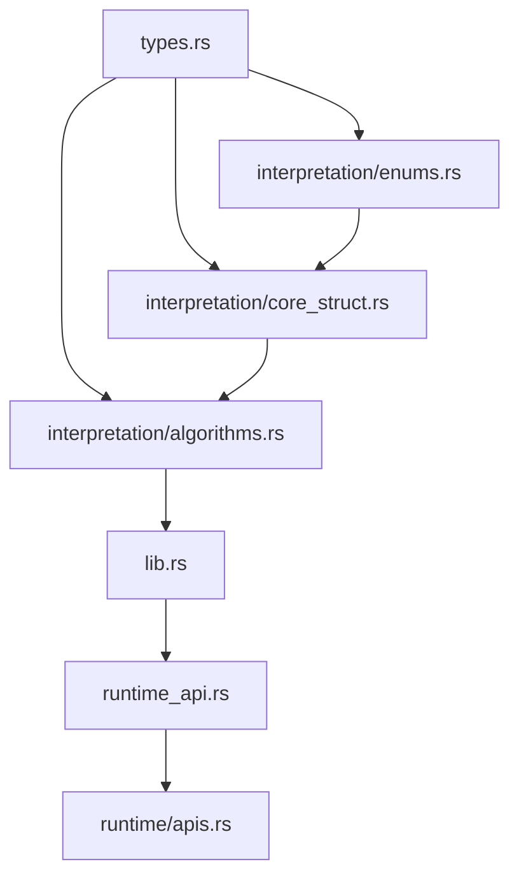

# 小六壬解卦模块 - 文档总览

## 📚 文档导航

本项目包含完整的设计、实施和开发文档。请按需阅读：

### 🌟 核心文档（必读）

| 文档 | 描述 | 适合人群 | 阅读时间 |
|------|------|---------|---------|
| **[QUICK_START.md](./QUICK_START.md)** ⭐⭐⭐ | 快速开始指南 | 开发者 | 5分钟 |
| **[CHECKLIST.md](./CHECKLIST.md)** ⭐⭐⭐ | 任务清单 | 开发者 | 5分钟 |
| **[QUICK_SUMMARY.md](./QUICK_SUMMARY.md)** ⭐⭐ | 设计总结 | 所有人 | 10分钟 |

### 📖 详细文档（推荐）

| 文档 | 描述 | 适合人群 | 阅读时间 |
|------|------|---------|---------|
| [IMPLEMENTATION_PLAN.md](./IMPLEMENTATION_PLAN.md) | 详细实施计划 | 开发者 | 30分钟 |
| [INTERPRETATION_DESIGN.md](./INTERPRETATION_DESIGN.md) | 完整设计文档 | 架构师、开发者 | 60分钟 |
| [README.md](./README.md) | 模块说明 | 所有人 | 10分钟 |

---

## 🎯 根据角色选择阅读路径

### 👨‍💻 我是开发者，准备实现这个模块

**阅读顺序**：
1. ✅ **[QUICK_START.md](./QUICK_START.md)** - 了解如何开始（5分钟）
2. ✅ **[QUICK_SUMMARY.md](./QUICK_SUMMARY.md)** - 理解核心设计（10分钟）
3. ✅ **[CHECKLIST.md](./CHECKLIST.md)** - 查看任务清单（5分钟）
4. ✅ **[IMPLEMENTATION_PLAN.md](./IMPLEMENTATION_PLAN.md)** - 详细开发步骤（30分钟）
5. 📖 **[INTERPRETATION_DESIGN.md](./INTERPRETATION_DESIGN.md)** - 深入理解设计（可选，60分钟）

**总时间**：约 50 分钟（必读部分）

**下一步**：
```bash
cd /home/xiaodong/文档/stardust/pallets/divination/xiaoliuren
cat QUICK_START.md
# 然后按照指引开始编码
```

---

### 🏗️ 我是架构师，需要评审设计

**阅读顺序**：
1. ✅ **[QUICK_SUMMARY.md](./QUICK_SUMMARY.md)** - 快速了解（10分钟）
2. ✅ **[INTERPRETATION_DESIGN.md](./INTERPRETATION_DESIGN.md)** - 完整设计（60分钟）
3. 📖 **[IMPLEMENTATION_PLAN.md](./IMPLEMENTATION_PLAN.md)** - 实施细节（可选，30分钟）

**评审要点**：
- 数据结构设计（13字节优化）
- 算法正确性（五个维度评分）
- 存储方案（懒加载 + 缓存）
- 性能指标（<10微秒/次）

---

### 📊 我是产品经理，想了解功能

**阅读顺序**：
1. ✅ **[QUICK_SUMMARY.md](./QUICK_SUMMARY.md)** - 核心功能（10分钟）
2. ✅ **[README.md](./README.md)** - 用户使用（10分钟）

**关键功能**：
- ✅ 吉凶判断（7个等级）
- ✅ 综合评分（0-100分）
- ✅ 应期推算（6种类型）
- ✅ 建议生成（8种类型）
- ✅ 特殊格局识别（8种）

---

### 🔍 我在查找特定信息

| 我想了解... | 请查看... | 章节 |
|------------|----------|------|
| **核心数据结构** | QUICK_SUMMARY.md | 一、核心数据结构 |
| **算法公式** | QUICK_SUMMARY.md | 三、核心算法 |
| **开发步骤** | IMPLEMENTATION_PLAN.md | 三、详细开发步骤 |
| **测试计划** | IMPLEMENTATION_PLAN.md | 五、测试计划 |
| **存储优化** | INTERPRETATION_DESIGN.md | 二、设计原则 |
| **Runtime API** | IMPLEMENTATION_PLAN.md | 阶段3 |
| **性能指标** | QUICK_SUMMARY.md | 四、设计优势 |
| **使用示例** | QUICK_SUMMARY.md | 六、使用示例 |

---

## 📊 项目概览

### 核心指标

| 指标 | 数值 | 说明 |
|------|------|------|
| **存储大小** | 13 bytes | 极致优化 |
| **性能** | < 10μs | 单次解卦 |
| **覆盖率** | > 90% | 测试覆盖 |
| **开发周期** | 6天 | 预计时间 |

### 技术栈

- **语言**：Rust
- **框架**：Substrate FRAME
- **存储**：链上KV + 懒加载
- **API**：Runtime API

### 依赖关系



---

## 🚀 快速开始

### 1. 环境准备（5分钟）

```bash
cd /home/xiaodong/文档/stardust/pallets/divination/xiaoliuren

# 检查现有代码
cargo check
cargo test

# 查看文档
cat QUICK_START.md
```

### 2. 创建文件（5分钟）

```bash
# 按照 QUICK_START.md 的指引创建所有文件
mkdir -p src/interpretation
touch src/interpretation/{mod.rs,enums.rs,core_struct.rs,algorithms.rs}
touch src/{interpretation.rs,runtime_api.rs,interpretation_tests.rs}
mkdir -p tests
touch tests/interpretation_integration.rs
```

### 3. 开始开发（Day 1）

按照 **[CHECKLIST.md](./CHECKLIST.md)** 的任务清单逐步完成。

---

## 📋 开发阶段总览

### 阶段1：数据结构（Day 1）
- 核心结构体（13字节）
- 枚举类型（JiXiongLevel, AdviceType, YingQiType）
- 特殊格局位标志

**产出**：`src/interpretation/` 模块

### 阶段2：核心算法（Day 2-3）
- 吉凶等级计算
- 综合评分算法
- 特殊格局识别
- 应期推算
- 核心 `interpret()` 函数

**产出**：`src/interpretation/algorithms.rs`

### 阶段3：Runtime API（Day 4）
- API trait 定义
- 懒加载机制
- 批量查询

**产出**：`src/runtime_api.rs` + runtime集成

### 阶段4：集成测试（Day 5）
- 单元测试（覆盖率 > 90%）
- 集成测试
- 性能测试

**产出**：完整测试覆盖

### 阶段5：文档优化（Day 5.5）
- API 文档
- 使用示例
- 代码优化

**产出**：完整文档 + 优化代码

---

## 🎓 学习资源

### Substrate 官方文档
- [FRAME Pallets](https://docs.substrate.io/reference/frame-pallets/)
- [Runtime Storage](https://docs.substrate.io/build/runtime-storage/)
- [Runtime APIs](https://docs.substrate.io/build/custom-rpcs/)

### 项目内参考
- [六爻解卦设计](../liuyao/INTERPRETATION_DESIGN.md) - 类似模块参考
- [奇门解卦设计](../qimen/INTERPRETATION_DATA_STRUCTURE_DESIGN.md) - 另一参考

### Rust 文档
- [Rust Book](https://doc.rust-lang.org/book/)
- [Rust By Example](https://doc.rust-lang.org/rust-by-example/)

---

## 💡 设计亮点

### 1. 极致存储优化
仅 **13字节** 存储核心数据：
- 吉凶等级 (1 byte)
- 综合评分 (1 byte)
- 五行关系 (1 byte)
- 体用关系 (2 bytes)
- 八卦 (2 bytes)
- 特殊格局 (1 byte)
- 建议类型 (1 byte)
- 流派 (1 byte)
- 应期类型 (2 bytes)
- 预留 (1 byte)

### 2. 特殊格局位标志
1个字节表示8种格局，使用位运算：
```rust
pub const PURE: u8 = 0b0000_0001;           // 纯宫
pub const ALL_AUSPICIOUS: u8 = 0b0000_0010;  // 全吉
pub const ALL_INAUSPICIOUS: u8 = 0b0000_0100; // 全凶
// ... 最多8种格局
```

### 3. 懒加载 + 缓存
首次查询时计算，之后从缓存读取：
```rust
fn get_or_create_interpretation(pan_id: u64) -> Option<Interpretation> {
    if let Some(cached) = Interpretations::get(pan_id) {
        return Some(cached);
    }
    let new = calculate(...);
    Interpretations::insert(pan_id, new);
    Some(new)
}
```

### 4. 综合评分算法
五个维度加权评分（0-100分）：
- 时宫吉凶：40%
- 三宫整体：20%
- 五行关系：20%
- 体用关系：10%
- 特殊格局：10%

---

## ✅ 质量保证

### 测试覆盖
- [ ] 单元测试覆盖率 > 90%
- [ ] 216种六宫组合全测试
- [ ] 8种特殊格局测试
- [ ] 边界情况测试

### 性能指标
- [ ] 单次解卦 < 10微秒
- [ ] 批量100次 < 1毫秒
- [ ] 存储大小 = 13字节
- [ ] 内存占用 < 1KB

### 代码质量
- [ ] 无 Clippy 警告
- [ ] 代码格式化
- [ ] 文档注释完整
- [ ] API 文档生成

---

## 📞 问题反馈

### 开发中遇到问题？

1. **先查文档**：
   - IMPLEMENTATION_PLAN.md 第七章：风险管理
   - QUICK_START.md：常见问题

2. **检查代码**：
   - 参考六爻模块：`../liuyao/src/interpretation.rs`
   - 查看测试用例：`src/tests.rs`

3. **性能问题**：
   - 运行 benchmark：`cargo bench`
   - 检查算法复杂度

4. **编译错误**：
   - 检查 trait 实现
   - 查看类型定义

---

## 🎊 完成标志

当所有 ✅ 都勾选时，项目就完成了：

```bash
✅ 所有阶段完成（Day 0 - Day 5.5）
✅ 所有测试通过
✅ 文档完整
✅ 代码质量达标
✅ 性能指标达标
```

---

## 📈 版本历史

| 版本 | 日期 | 说明 |
|------|------|------|
| v1.0 | 2025-12-12 | 初始设计和规划 |
| - | - | 待开发 |

---

## 📄 许可证

本项目为 Stardust 区块链项目的一部分。

---

**创建时间**：2025-12-12
**最后更新**：2025-12-12
**状态**：📝 规划完成，待开发

---

**祝开发顺利！** 🚀
