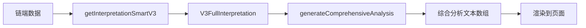

# 八字综合分析功能实现文档

## 📋 功能概述

在八字详情页面的"基础解盘"卡片中添加了完整的**综合分析文本**，基于链端返回的核心指标、性格分析等数据，自动生成8-9条详细的命理分析。

---

## 🎯 功能特点

### 1. 完全基于链端数据
- ✅ 无需额外API调用
- ✅ 实时计算生成
- ✅ 完全免费
- ✅ 响应速度快

### 2. 内容全面丰富
包含9大分析维度：

| 维度 | 内容 |
|------|------|
| 📊 格局分析 | 正格/从强格/从弱格等，附详细说明 |
| ⚖️ 命局强弱 | 身旺/身弱/中和，提供针对性建议 |
| 🎯 用神分析 | 用神/喜神/忌神，幸运方位和颜色 |
| 💼 事业发展 | 根据用神推荐适合行业 |
| 🧠 性格特征 | 主要特点、优点、缺点（如有数据） |
| 👔 职业建议 | 综合适合职业类型（如有数据） |
| 🧭 发展方位 | 有利方向和地域选择 |
| ⭐ 综合评价 | 评分、等级、总体建议 |
| ℹ️ 可信度说明 | 低可信度时的温馨提示 |

### 3. 展示效果优化
- 🎨 灰色背景独立卡片
- 📖 1.8倍行高，易于阅读
- 🏷️ 【标题】格式，结构清晰
- 📱 响应式设计，适配移动端

---

## 💻 技术实现

### 修改文件
```
src/features/bazi/components/BasicInterpretationCard.tsx
```

### 核心函数

#### 1. generateComprehensiveAnalysis()
```typescript
/**
 * 生成综合分析文本
 * 基于核心指标、性格分析等信息生成完整的综合分析
 */
const generateComprehensiveAnalysis = (): string[] => {
  if (!interpretation) return [];

  const { core, xingGe } = interpretation;
  const texts: string[] = [];

  // 1. 格局分析
  texts.push(`【格局分析】您的命局为${core.geJu}。${getGeJuDescription(core.geJu)}`);

  // 2. 强弱分析
  texts.push(`【命局强弱】日主${core.qiangRuo}。${getQiangRuoDescription(core.qiangRuo)}`);

  // ... 更多分析维度

  return texts;
};
```

#### 2. 数据流程



---

## 📊 数据来源

### 链端返回的数据结构

```typescript
interface V3FullInterpretation {
  // 核心指标
  core: {
    geJu: string;          // 格局
    qiangRuo: string;      // 强弱
    yongShen: string;      // 用神
    xiShen: string;        // 喜神
    jiShen: string;        // 忌神
    yongShenType: string;  // 用神类型
    score: number;         // 评分 0-100
    confidence: number;    // 可信度 0-100
  };
  
  // 性格分析（可选）
  xingGe?: {
    zhuYaoTeDian: string[];   // 主要特点
    youDian: string[];        // 优点
    queDian: string[];        // 缺点
    shiHeZhiYe: string[];     // 适合职业
  };
}
```

---

## 🎨 UI展示

### 1. 位置布局
```
基础解盘卡片
├── 核心指标（格局、强弱、用神等）
├── 用神喜神忌神
├── 命局解读（简要）
├── 性格分析（如有）
├── 发展建议
├── 总体评价
├── ═══════════════════
├── 【新增】综合分析 ⭐
│   ├── 格局分析
│   ├── 命局强弱
│   ├── 用神分析
│   ├── 事业发展
│   ├── 性格特征
│   ├── 职业建议
│   ├── 发展方位
│   └── 综合评价
├── ═══════════════════
├── 可信度警告（如需要）
└── 升级提示
```

### 2. 样式设计

```tsx
<Paragraph style={{
  marginBottom: 12,
  padding: '12px',
  backgroundColor: '#fafafa',  // 灰色背景
  borderRadius: '4px',          // 圆角
  lineHeight: '1.8',            // 行高
  textIndent: '0',              // 不缩进
}}>
  {text}
</Paragraph>
```

---

## 📝 示例输出

### 实际生成的分析文本示例

```
【格局分析】您的命局为正格。命局五行相对平衡，发展较为稳定，
适合循序渐进的发展方式。

【命局强弱】日主身旺。日主偏旺，精力充沛，自主性强，但需注意
克制，避免刚愎自用。

【用神分析】命局用神为木，属于扶抑用神。喜神为水，忌神为金。
用神木主管方位为东方，幸运颜色为绿色、青色。

【事业发展】根据用神木的特性，您适合从事教育、文化、环保、
农林、医药等相关行业。在这些领域能够更好地发挥您的优势，
获得事业上的成功。

【性格特征】您的主要性格特点是正直、有主见、积极向上。优点
表现为温和、适应性强、有艺术天赋。需要注意克服固执、缺乏
变通等倾向。

【职业建议】综合您的命局特点，除了前述行业外，还特别适合从事
教育、文化、金融、贸易等工作。这些职业能够充分发挥您的天赋
和才能。

【发展方位】以您的出生地为中心，向东方方向发展更为有利。在
选择工作地点、投资方向时，可优先考虑东方方位的城市或区域。

【综合评价】您的命局综合评分为75分（满分100分），评级为
"中上"等。命局良好，稳中有进，把握机遇可成建议在人生规划中
充分考虑上述因素，顺势而为，必能有所成就。
```

---

## 🔧 使用方式

### 对于开发者

1. 数据已自动获取，无需额外配置
2. 文本自动生成，无需手动维护
3. 样式已优化，可直接使用

### 对于用户

1. 刷新浏览器查看最新效果
2. 滚动到"综合分析"部分阅读
3. 可结合核心指标对照理解

---

## ✅ 验证清单

- [ ] 刷新浏览器（Ctrl+Shift+R）
- [ ] 访问 http://localhost:5173/#/bazi/1
- [ ] 向下滚动到"综合分析"部分
- [ ] 确认显示8-9条分析文本
- [ ] 确认每条文本格式为【标题】内容
- [ ] 确认灰色背景显示正常
- [ ] 确认文本内容完整无错别字
- [ ] 测试不同命盘的分析是否变化

---

## 🚀 后续优化建议

### 1. 短期优化（易实现）
- [ ] 添加折叠/展开功能
- [ ] 支持复制综合分析文本
- [ ] 添加分享综合分析功能
- [ ] 支持打印或导出PDF

### 2. 中期优化（需开发）
- [ ] 根据性别差异化分析
- [ ] 添加婚姻分析内容
- [ ] 添加健康建议内容
- [ ] 添加流年运势分析

### 3. 长期优化（需AI）
- [ ] 接入AI生成更详细分析
- [ ] 支持自定义问题解答
- [ ] 个性化建议推荐
- [ ] 实时互动解盘

---

## 📚 相关文档

- [八字详情页面完善总结](./test-summary.md)
- [拼音显示问题修复](./BAZI_FIX_SUMMARY.md)
- [BasicInterpretationCard组件](../src/features/bazi/components/BasicInterpretationCard.tsx)

---

## 📞 支持

如有问题或建议，请：
1. 检查浏览器控制台错误信息
2. 确认链端数据返回正常
3. 查看本文档的验证清单
4. 联系开发团队

---

生成时间：2025-12-14  
版本：v1.0  
状态：✅ 已完成

